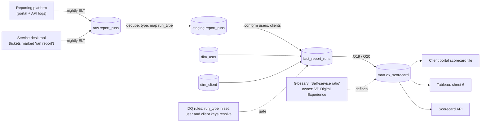

# Lineage — from book of record to a number on a client screen

This is the diagram a data steward keeps in Collibra (or any catalogue) for one client-facing metric.
Trace it for **"Self-service ratio"** on the Digital Experience scorecard:

Exercise: draw the same diagram for **"Acknowledged alert rate"**, then answer: which single upstream change would silently make the portal and Tableau disagree? (Hint: what if the service desk starts marking tickets differently?)

## Governance operating model for your domain

| Role | Who | For this metric |
|---|---|---|
| Data owner | VP Digital Experience (you) | Definition, target, sign-off on changes |
| Data steward | Reporting product owner | Day-to-day: DQ issues, access requests, glossary upkeep |
| Data custodian | Data platform engineering | Pipelines, storage, controls |
| Consumers | Client coverage, operations, clients | Read the number; raise disputes through the steward |

## What Collibra adds on top of this folder

Collibra is the enterprise system of record for exactly these artefacts: the **glossary** (`glossary.csv`), the **catalogue** (`data_dictionary.csv`), **lineage** (this diagram, harvested automatically from pipelines), **data-quality** rules and scores (`dq_rules.sql` + `run_dq.py`), and **workflows** (a request to change a definition routes to the owner for approval). There is no free download; learn the concepts here, then take the free self-paced courses at Collibra University (university.collibra.com), and on Day 1 ask who your domain's steward is. An open-source stand-in you can run locally to see a catalogue UI: OpenMetadata (`docker compose` quick start at docs.open-metadata.org).
