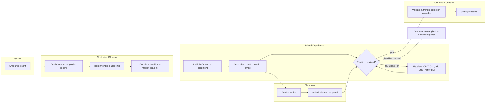

# Process models — business and system process modelling

The JD asks for "experience with business and system process modelling". The standard notation is **BPMN 2.0**;
the free tools are **bpmn.io** (demo.bpmn.io in the browser, nothing to install), **Camunda Modeler** (desktop, free),
and **draw.io** (diagrams.net, has a BPMN shape library). Mermaid, used below, renders on GitHub and is enough for reviews.

## Model 1 — Corporate-action election (the process behind Q7 and the alerts lab)



**Where the process breaks (from the lab data):** CA-5005 had three alerts, zero acknowledgements, the notice was never opened, the election defaulted. Every one of those facts is a *measurable step* in the model above. That is the point of modelling: the fix is a process control (escalate to a second named user; require acknowledgement; RM call at T-2), not a prettier email.

## Model 2 — System process: an alert from event to acknowledgement

```mermaid
sequenceDiagram
    participant Core as Settlement engine
    participant Bus as Event backbone
    participant NF as Notification framework
    participant Ent as Entitlement service
    participant Ch as Channels (portal, email, SMS, webhook)
    participant U as Client user
    Core->>Bus: TradeFailed {trade_id, account, reason}
    Bus->>NF: consume event
    NF->>Ent: who is entitled to account + subscribed to SETTLEMENT_FAIL?
    Ent-->>NF: users + preferred channels
    NF->>Ch: deliver (record delivered_at per channel)
    Ch-->>U: alert
    U->>NF: acknowledge (portal click or API)
    NF->>NF: record acknowledged_at; stop escalation
    NF->>Bus: AlertAcknowledged (for the scorecard)
```

## Exercises

1. Open demo.bpmn.io and redraw Model 1 in real BPMN: pools per organisation, a timer boundary event for "3 days before deadline", and a message end event for "election transmitted". Export as SVG and add it to this folder.
2. Model the **document lifecycle**: generated → published → opened → downloaded → retained → destroyed, with the retention rule as a gateway. Which steps produce the timestamps in `fact_documents`?
3. Model **user onboarding for IAM**: client admin requests → entitlement service validates same-client rule → MFA enrolment → grant with expiry → periodic recertification. Mark where `fact_user_entitlements` rows are written and where the Q15 findings would be caught earlier.
