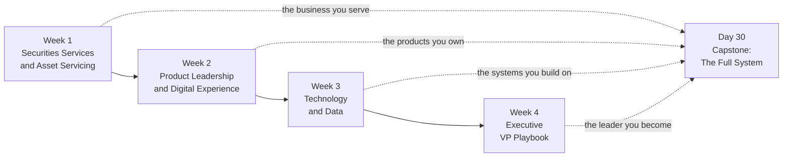
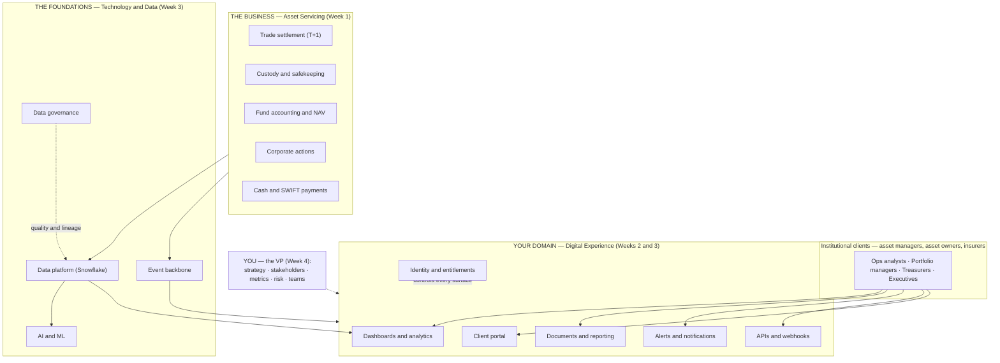

# 🏛️ State Street VP Bootcamp — Product Development (Digital Experience)

> **A 30-day daily learning handbook, prepared exclusively for Rishabh Sharma.**
> One chapter a day · 60–90 minutes each · heavy on diagrams, systems thinking and real banking numbers.

This is not generic product-management material. Every chapter is written for one specific job: **VP, Product Development (Digital Experience) at a global custodian bank** — the person who owns the client-facing digital layer (portals, APIs, alerts, documents, dashboards) sitting on top of custody, fund accounting and asset-servicing operations.

All diagrams are Mermaid and render directly on GitHub — just click any chapter.

---

## How to use this book

1. **One day = one chapter.** Read Part 1 (concepts) in the morning, Part 2 (system deep dive) later, then do the exercises and quiz. 60–90 minutes total.
2. **Draw the diagrams yourself.** The fastest way to internalize a system is to redraw its diagram from memory the next morning.
3. **Keep the [glossary](glossary.md) open** in a second tab. 500+ terms, organized by theme, each with "why it matters to you."
4. **Days 7, 14, 21 and 30 are capstones** — synthesis chapters with case studies, master diagrams and cumulative quizzes. Don't skip them; they're where the mental models lock in.
5. **Re-read Week 4 in your actual first 90 days.** Days 22–30 are written to be used on the job, not just read once.



---

## 📅 The 30-day curriculum

### Week 1 — Securities Services & Asset Servicing *(the business)*

| Day | Chapter | You'll be able to… |
|-----|---------|--------------------|
| 01 | [State Street and the Business of Custody Banking](week-1-securities-services/day-01-state-street-and-custody-banking.md) | Explain how a custodian makes money and where Digital Experience sits |
| 02 | [The Asset Servicing Lifecycle](week-1-securities-services/day-02-asset-servicing-lifecycle.md) | Trace an asset from onboarding through the global holding chain |
| 03 | [The Trade Lifecycle and T+1 Settlement](week-1-securities-services/day-03-trade-lifecycle-and-t1-settlement.md) | Walk a trade from order to settlement and diagnose a fail |
| 04 | [Fund Accounting and NAV](week-1-securities-services/day-04-fund-accounting-and-nav.md) | Compute a NAV by hand and explain how errors happen |
| 05 | [Corporate Actions](week-1-securities-services/day-05-corporate-actions.md) | Run the CA event lifecycle and explain why it's custody's biggest risk |
| 06 | [SWIFT, Payments and Cash Management](week-1-securities-services/day-06-swift-payments-and-cash-management.md) | Read SWIFT message flows and follow the cash leg of a settlement |
| 07 | [**Capstone**: Case Studies and the Full Picture](week-1-securities-services/day-07-week-1-capstone-and-case-studies.md) | Connect all of Week 1 into one mental model |

### Week 2 — Product Leadership & Digital Experience *(your craft)*

| Day | Chapter | You'll be able to… |
|-----|---------|--------------------|
| 08 | [Product Strategy in Institutional Financial Services](week-2-product-and-digital-experience/day-08-product-strategy-in-financial-services.md) | Build a strategy and business case for a custody digital platform |
| 09 | [Product Operating Model, Roadmaps and Prioritization](week-2-product-and-digital-experience/day-09-product-operating-model-and-roadmaps.md) | Run OKRs, roadmaps and prioritization inside a scaled-agile bank |
| 10 | [Customer Journeys and UX for Institutional Clients](week-2-product-and-digital-experience/day-10-customer-journey-and-ux-for-institutional-clients.md) | Map journeys and design for dense, exception-first workflows |
| 11 | [Identity and Access Management for Client Platforms](week-2-product-and-digital-experience/day-11-identity-and-access-management.md) | Own SSO, entitlements and delegated admin as product capabilities |
| 12 | [Alerts and Notifications as a Platform](week-2-product-and-digital-experience/day-12-alerts-and-notifications-platforms.md) | Design an event-to-delivery notification platform clients trust |
| 13 | [Documents and Client Reporting](week-2-product-and-digital-experience/day-13-document-management-and-client-reporting.md) | Own the document lifecycle from generation to retention |
| 14 | [**Capstone**: Stakeholder Management + Week 2 Synthesis](week-2-product-and-digital-experience/day-14-stakeholder-management-and-week-2-capstone.md) | Map and move your stakeholder landscape |

### Week 3 — Technology & Data *(your foundations)*

| Day | Chapter | You'll be able to… |
|-----|---------|--------------------|
| 15 | [APIs and API Products](week-3-technology-and-data/day-15-apis-and-api-products.md) | Treat APIs as products: design, DX, versioning, adoption |
| 16 | [Microservices, Legacy and Enterprise Architecture](week-3-technology-and-data/day-16-microservices-and-enterprise-architecture.md) | Talk architecture credibly: bounded contexts, strangler fig, resilience |
| 17 | [Event-Driven Architecture](week-3-technology-and-data/day-17-event-driven-architecture.md) | Reason about Kafka, delivery semantics and event contracts |
| 18 | [Data Platforms: Snowflake, Warehouses and SQL](week-3-technology-and-data/day-18-data-platforms-snowflake-and-sql.md) | Read SQL, understand Snowflake economics and data sharing |
| 19 | [BI, Tableau and Embedded Analytics](week-3-technology-and-data/day-19-bi-tableau-and-analytics-products.md) | Govern BI and embed analytics into client experiences |
| 20 | [Data Governance and Collibra](week-3-technology-and-data/day-20-data-governance-and-collibra.md) | Run data quality, lineage and stewardship like a first-line owner |
| 21 | [**Capstone**: AI in Financial Services + Week 3 Synthesis](week-3-technology-and-data/day-21-ai-in-financial-services-and-week-3-capstone.md) | Prioritize AI use cases and navigate model risk in a bank |

### Week 4 — The Executive VP Playbook *(your leadership)*

| Day | Chapter | You'll be able to… |
|-----|---------|--------------------|
| 22 | [Your First 90 Days](week-4-executive-playbook/day-22-first-90-days.md) | Execute a 30/60/90 plan with a ready-made question bank |
| 23 | [Executive Communication](week-4-executive-playbook/day-23-executive-communication.md) | Write and present the way executives actually consume information |
| 24 | [Leadership and Decision-Making Frameworks](week-4-executive-playbook/day-24-leadership-and-decision-frameworks.md) | Delegate, decide and manage managers at VP altitude |
| 25 | [Client Engagement and Commercial Acumen](week-4-executive-playbook/day-25-client-engagement-and-commercial-acumen.md) | Support sales, run QBRs and handle strategic-client escalations |
| 26 | [Metrics, OKRs and Running the Business](week-4-executive-playbook/day-26-metrics-okrs-and-running-the-business.md) | Build a metrics tree and run credible business reviews |
| 27 | [Risk, Compliance and Regulation](week-4-executive-playbook/day-27-risk-compliance-and-regulation.md) | Operate as a first-line risk owner and ship safely in a G-SIB |
| 28 | [Building and Scaling Product Teams](week-4-executive-playbook/day-28-building-and-scaling-teams.md) | Design orgs, run global hubs and grow product talent |
| 29 | [The Path to SVP and Interview Mastery](week-4-executive-playbook/day-29-path-to-svp-and-interview-prep.md) | Build your promotion case and ace VP-level interviews |
| 30 | [**Capstone**: The Full System, End to End](week-4-executive-playbook/day-30-capstone-the-full-system.md) | Narrate the entire custody + digital stack in one story |

### Reference

- 📖 **[Master Glossary — 500+ terms](glossary.md)** organized by theme, with "why it matters to you" for every term
- 📐 **[Chapter template](TEMPLATE.md)** — the structure every chapter follows

---

## The map of everything you're learning



---

## Progress tracker

Copy this into your notes and check days off:

```
Week 1: [ ]01 [ ]02 [ ]03 [ ]04 [ ]05 [ ]06 [ ]07
Week 2: [ ]08 [ ]09 [ ]10 [ ]11 [ ]12 [ ]13 [ ]14
Week 3: [ ]15 [ ]16 [ ]17 [ ]18 [ ]19 [ ]20 [ ]21
Week 4: [ ]22 [ ]23 [ ]24 [ ]25 [ ]26 [ ]27 [ ]28 [ ]29 [ ]30
```

> ⚠️ **A note on accuracy:** chapters describe custody banking and large-custodian practices from public knowledge; anything about State Street specifically is either public information or clearly framed as "representative of large custodians." Verify internal specifics (systems, org names, processes) on the job.
