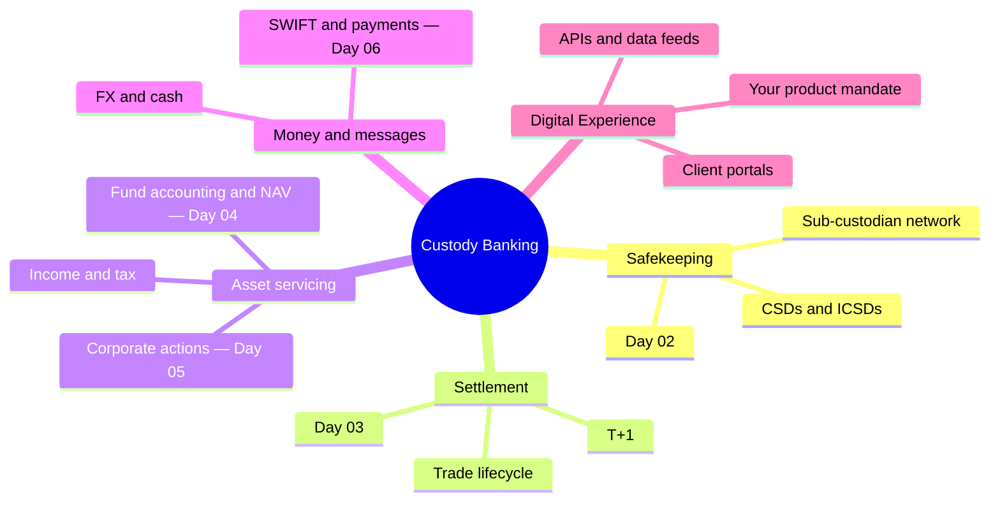
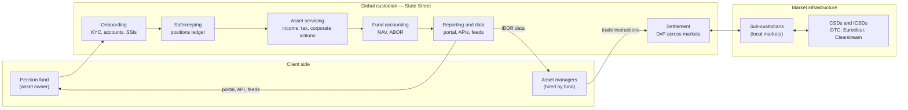
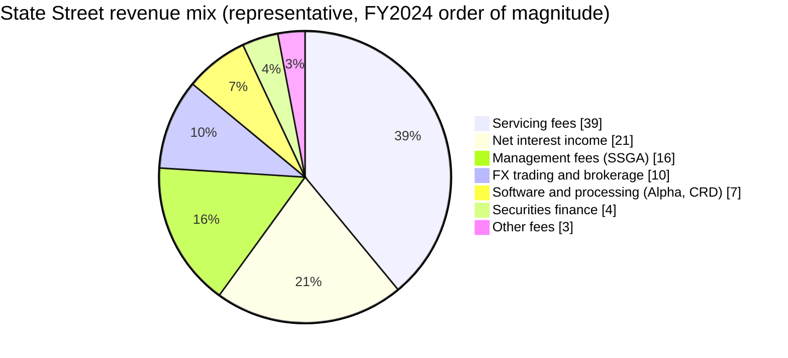
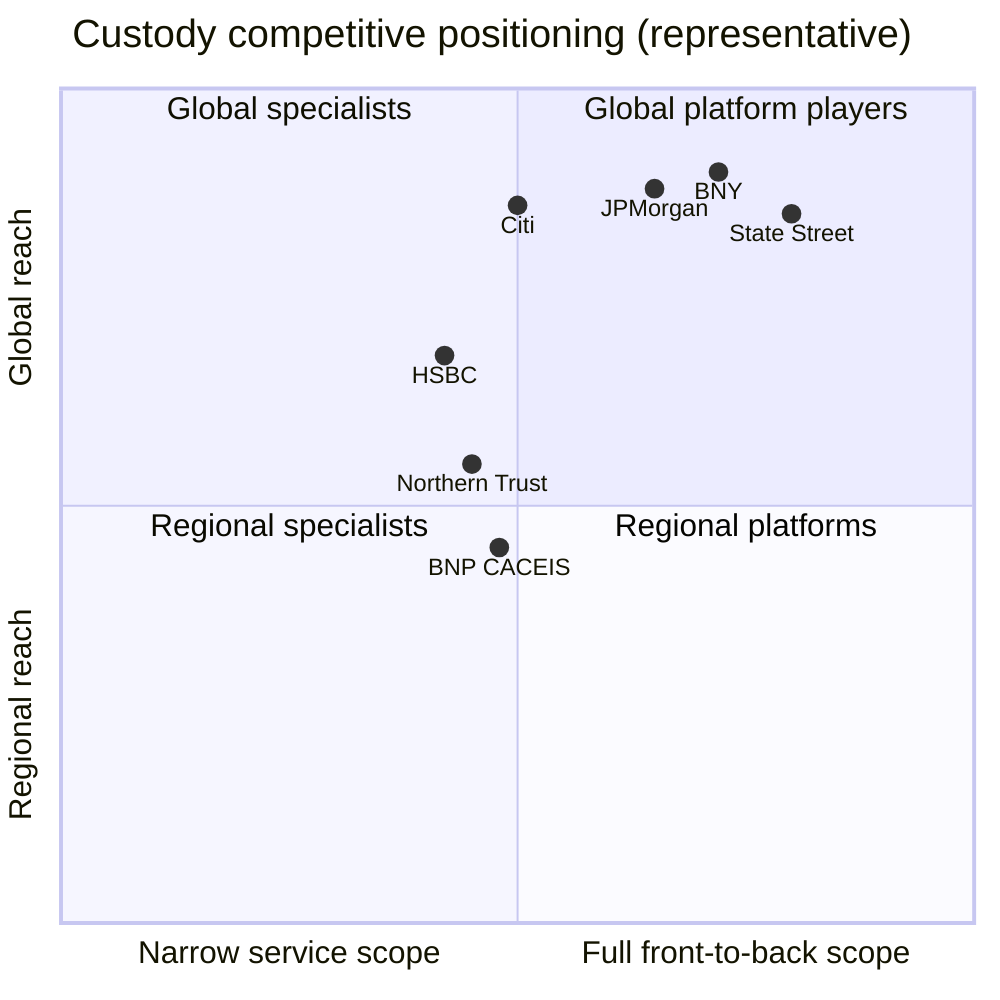
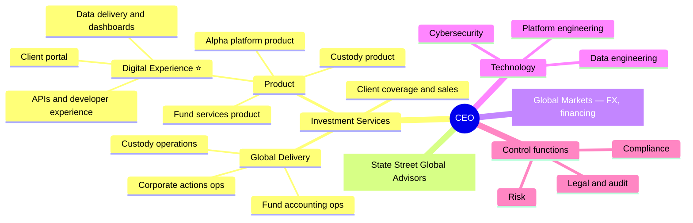
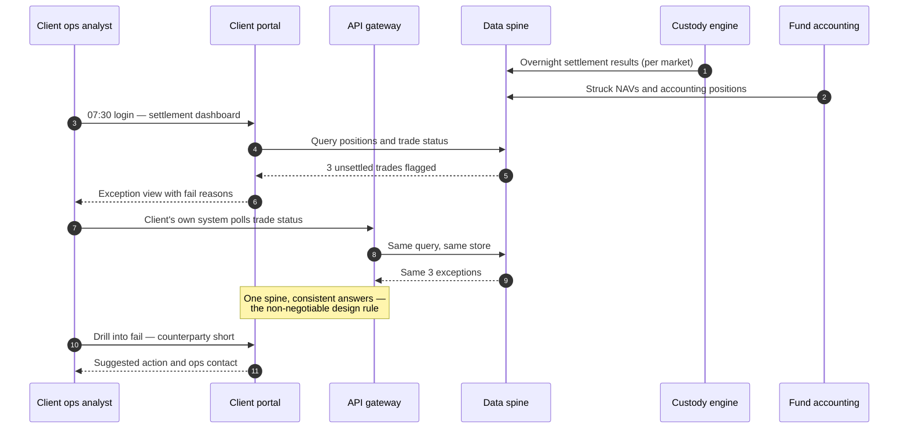
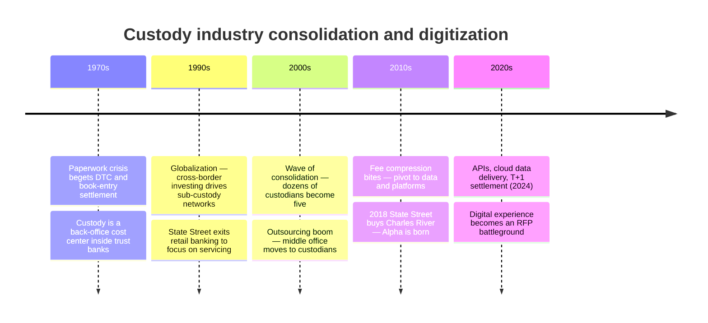

# Day 01 — State Street and the Business of Custody Banking

> Week 1 · Securities Services Foundations · Est. reading time: 60–90 min

---

## 🎯 Learning objectives

By the end of today you can:

- Explain what a custodian bank does — safekeeping, settlement, asset servicing — and why institutional investors are legally and practically required to use one.
- Distinguish custody banking from commercial banking and investment banking across balance-sheet, risk, and revenue dimensions.
- Break down State Street's revenue model into its major lines (servicing fees, management fees, net interest income, FX, securities lending, software and data) and explain the economics of each.
- Correctly use AUC/A vs AUM, and cite real magnitudes for State Street and its peers.
- Sketch the competitive landscape (BNY, JPMorgan, Citi, Northern Trust, HSBC) and articulate where State Street differentiates.
- Place the VP of Product Development (Digital Experience) role inside a representative custodian org chart and name your key stakeholders.

---

## 🧭 Where this fits

This is Day 1 of 30. Everything in this book — trade settlement, NAV production, corporate actions, SWIFT messaging, client portals — hangs off one question: *what does a custodian bank actually sell, and to whom?* Today builds the frame; the next 29 days fill it in. Digital Experience is not a side show here: for most clients, your portal, APIs, and data feeds **are** State Street — they never see a vault or an operations floor.

---

## Part 1 — Core concepts

### 1.1 What a custodian bank is

A **custodian bank** holds financial assets in safekeeping on behalf of institutional investors — pension funds, mutual funds, insurance companies, sovereign wealth funds, asset managers — and performs the administrative work those assets generate. Three functions define the business:

1. **Safekeeping.** The custodian holds securities (today, almost entirely electronic book entries, not paper) in segregated or nominee accounts, so that the client's assets are legally separate from the custodian's own balance sheet. If the custodian fails, client assets are not part of the bankruptcy estate. This separation is the entire point: US mutual funds are *required* by the Investment Company Act of 1940 (Section 17(f)) to place assets with a qualified custodian; UCITS funds in Europe have an equivalent depositary requirement.
2. **Settlement.** When the client's asset manager trades, the custodian moves securities and cash to complete the trade — receiving shares against payment, delivering bonds against cash, across ~100 markets worldwide.
3. **Asset servicing.** Assets sitting in an account still generate work: dividends and coupons must be collected, withholding tax reclaimed, corporate actions (splits, rights issues, tender offers) processed, proxies voted, portfolios valued and reported.

**Analogy (use it once, then drop it):** a custodian is to institutional portfolios what a title company plus escrow agent plus property manager is to real estate — it doesn't decide what you buy, it makes ownership *safe, provable, and serviced*.

### 1.2 Why custody exists at all

Three forces created and sustain the industry:

- **Regulation.** Fiduciaries cannot self-custody at scale. ERISA (US pensions), the '40 Act (US funds), UCITS/AIFMD (Europe) all mandate independent custody or depositary oversight.
- **Market access.** Settling a trade in Brazil, India, or Taiwan requires local accounts at the local central securities depository (CSD), local tax registrations, and local banking relationships. A global custodian gives a client one contract and one interface to ~100 markets via its **sub-custodian network** (Day 2).
- **Scale economics.** Custody is a fixed-cost, technology-heavy business. Processing the 10-millionth dividend costs almost nothing; building the machine that processes the first one costs billions. This is why the industry concentrated into a handful of giants.

### 1.3 Custody vs commercial vs investment banking

| Dimension | Custody bank | Commercial bank | Investment bank |
|---|---|---|---|
| Core activity | Safekeep and service assets | Take deposits, make loans | Underwrite, advise, trade |
| Primary revenue | Fees (basis points on assets, per-transaction) | Net interest margin on loans | Deal fees, trading P&L |
| Balance sheet use | Light — client assets are **off** balance sheet | Heavy — loans on balance sheet | Heavy — inventory, leverage |
| Principal risk | Low (operational risk dominates) | Credit risk dominates | Market risk dominates |
| Client | Institutions (funds, pensions, insurers) | Consumers and corporates | Corporates, governments, funds |
| Failure mode | Operational error, processing loss | Loan defaults, bank runs | Trading losses, deal drought |
| Regulatory lens | G-SIB via interconnectedness; operational resilience | Capital and liquidity ratios | Market and counterparty rules |

The crucial line in that table: **client assets are off balance sheet.** State Street services roughly **$46 trillion** in assets under custody and/or administration (AUC/A, year-end 2024 public figures) on a balance sheet of roughly **$350 billion**. The $46T is not State Street's money and never appears as State Street assets; only client *cash deposits* left with the bank (a few hundred billion) hit the balance sheet. Custody banks are nonetheless designated **G-SIBs** (global systemically important banks) — not because they could lose the assets, but because the plumbing they run is systemically critical: if a top custodian stopped settling for a day, a meaningful share of world markets would seize.

### 1.4 AUC/A vs AUM — get this distinction right on day one

- **AUC/A (assets under custody and/or administration):** assets State Street *safekeeps and/or administers* for clients. State Street earns **basis points and transaction fees** for servicing them, but makes no investment decisions. Magnitude: **~$46T** for State Street; BNY is comparable at ~$50T+.
- **AUM (assets under management):** assets where the firm makes investment decisions and earns **management fees**. State Street Global Advisors (SSGA) — the asset-management arm, home of the SPDR ETF family including SPY — manages **~$4.7T**.

A single dollar can be counted in both: an SSGA ETF custodied at State Street shows up in AUM *and* AUC/A. Ratio to remember: AUC/A is roughly **10×** AUM at State Street. When an article says "State Street, with $40 trillion in assets," it means AUC/A — nobody manages $40T.

**Worked economics — why basis points matter at this scale:**

| Revenue line | Base | Representative rate | Annual revenue |
|---|---|---|---|
| Servicing fees | $46T AUC/A | ~1.1 bps blended | ~$5.1B |
| Management fees (SSGA) | $4.7T AUM | ~4.5 bps blended | ~$2.1B |
| Net interest income | ~$230B avg interest-earning assets | ~1.2% margin | ~$2.7B |

One basis point = 0.01%. On $46T, **one extra basis point of blended servicing fee is ~$4.6B of revenue** — which is why fee compression (clients relentlessly negotiating that blended ~1.1 bps downward) is the industry's defining commercial pressure, and why custodians push into higher-margin software and data (Alpha, CRD) to escape it.

### 1.5 The securities services product stack

"Custody" in conversation usually means the whole stack of services a firm like State Street sells. Learn the layers now — Days 2–5 walk through each:

| Layer | What it does | Who buys it | Typical pricing |
|---|---|---|---|
| **Global custody** | Safekeeping, settlement, income, corporate actions, proxy, tax | Everyone with assets | Bps on AUC + per-trade fees |
| **Fund accounting** | Strikes the official books and NAV (ABOR — Day 4) | Mutual funds, ETFs, hedge funds | Bps on NAV + per-fund minimums |
| **Fund administration** | Financial statements, regulatory filings, board reporting, expense management | Funds and their boards | Fixed + per-fund fees |
| **Transfer agency** | Shareholder register: who owns the fund's shares; subscriptions, redemptions | Funds distributing to investors | Per-account, per-transaction |
| **Middle office outsourcing** | Client's own trade support, IBOR, reconciliation, collateral run by the custodian | Asset managers shedding cost | Bps + fixed; large multi-year deals |
| **Data and software** | CRD front office, Alpha data platform, analytics, ESG and risk data | Sophisticated institutions | Subscription / license |

Two consequences of the stack. First, **cross-sell is the growth engine**: a custody-only client at 0.5 bps becomes a custody + accounting + middle-office client at an effective 3–4 bps. Second, **each layer has its own digital surface** — a fund accountant needs a NAV oversight dashboard, a treasurer needs cash and FX views, a fund board needs administration packs — so "the portal" is really a family of persona-specific experiences over one data spine. Scoping which personas you serve first is a genuine product decision, not an implementation detail.

**Worked example — pricing a mandate.** A $200B asset manager RFPs custody + fund accounting + middle office. Representative economics:

| Component | Rate | Annual fee |
|---|---|---|
| Custody (blended, global assets) | 0.45 bps on $200B | $9.0M |
| Trade settlement (2M trades/yr) | $4.50 avg per trade | $9.0M |
| Fund accounting (140 funds) | 0.9 bps on NAV + minimums | $19.5M |
| Middle office outsourcing | fixed + bps | $14.0M |
| **Direct fees** | | **$51.5M** |
| + Estimated FX capture, cash NII, sec-lending split | | ~$20–30M |

The invisible half matters: perhaps a third to half of total client profitability comes from **ancillaries** (FX, cash, lending) that never appear on the fee schedule. This is why pricing teams will accept skinny headline bps to win flow — and why a digital feature that helps clients optimize their idle cash or recall lent securities has real, quantifiable P&L consequences for the bank. Know where your features sit in that equation before you ship them.

---

## Part 2 — The system deep dive

### 2.1 The custody value chain

Follow one client — a $50B US public pension fund — through the machine:

Read the chain left to right: money enters as mandates, work flows through operations, and **everything the client actually experiences exits through the reporting and data layer on the right — your layer.** Every upstream process (settlement status, corporate action elections, NAV sign-off) ultimately becomes a screen, an API response, or a file that Digital Experience owns.

### 2.2 State Street's revenue lines in detail

State Street's total revenue runs at roughly **$13B/year** (2024 public filings). Representative mix:

| Line | What it is | Economics and pressure |
|---|---|---|
| **Servicing fees** (~$5B) | Bps on AUC/A + per-transaction charges for custody, fund accounting, fund administration, transfer agency, middle office | Largest line. Chronic fee compression (~2–4%/yr on like-for-like); growth must come from net new business and market levels |
| **Net interest income** (~$2.5–2.9B) | Spread earned on client cash deposits and the bank's investment portfolio | Rate-sensitive: soared 2022–23 with Fed hikes, compresses as rates fall or clients sweep cash to money-market funds |
| **Management fees** (~$2.1B) | SSGA's fees on ~$4.7T AUM, heavily ETF and index | Low-fee, high-scale; SPDR franchise (SPY is one of the largest ETFs on earth) |
| **FX trading** (~$1.2B) | Executing FX for clients settling cross-border trades and hedging | Adjacent to custody flow; volume-driven; post-2009 litigation reshaped disclosure standards industry-wide |
| **Software and processing** (~$0.8B+) | **CRD (Charles River Development)**, acquired 2018 for $2.6B — a front-office order management system — plus data and analytics; front-to-back = **State Street Alpha** | The strategic bet: recurring SaaS-like revenue, stickier clients, escape from bps compression |
| **Securities finance** (~$0.4–0.5B) | Lending clients' idle securities to short sellers and borrowers against collateral, splitting the fee with the client | Steady annuity; the 2024 T+1 shift tightened recall timelines (Day 3) |

**The Alpha strategy in one paragraph:** custody alone is a commoditizing utility. State Street's answer is **Alpha** — combining CRD's front office (portfolio management, order management, compliance) with State Street's middle office (IBOR, post-trade) and back office (custody, fund accounting) into one "front-to-back" platform with a single data spine. A client on Alpha has State Street woven through its entire workflow, making the relationship far harder to unwind than a custody-only mandate, and shifting revenue toward multi-year platform contracts. Digital Experience sits directly on this strategy: Alpha's promise is *one consistent data and interaction layer*, and the portal/API estate is where that promise is kept or broken.

### 2.3 Competitive landscape

Five names matter, plus regional specialists:

| Custodian | AUC/A (approx.) | Distinguishing posture |
|---|---|---|
| **BNY** (Bank of New York Mellon) | ~$52T | Largest custodian; broad platform (Pershing, treasury services); rebranded "BNY" 2024 |
| **State Street** | ~$46T | #2; deepest in fund servicing (accounting/administration); Alpha front-to-back bet |
| **JPMorgan Securities Services** | ~$35T | Custody inside a universal-bank fortress; can bundle financing, markets, banking |
| **Citi Securities Services** | ~$26T | Unique **proprietary custody network** — its own local branches in ~60 markets rather than third-party sub-custodians |
| **Northern Trust** | ~$16T | Premium boutique; asset owners, wealth, ultra-high-touch service |
| **HSBC, BNP Paribas, CACEIS, SocGen** | $4–13T each | Regional strength: HSBC in Asia and the Middle East; BNP/CACEIS in Europe |

Competitive dynamics worth internalizing:

- **Mandates are huge, rare, and sticky.** A large custody mandate ($500B+ AUC/A) comes up for RFP perhaps once a decade per client, takes 12–24 months to win and 1–3 years to convert (migrate). Switching costs protect incumbents — and make every service failure a slow-burning fuse rather than an instant loss.
- **Fee compression is structural.** Clients benchmark bps rates each renewal; custodians concede price and try to recover margin through cash (NII), FX, lending, and software attach.
- **Differentiation has moved to data and digital.** All five leaders settle trades adequately. RFPs are increasingly won on data quality, API coverage, dashboard usability, and integration effort — i.e., on the territory your role owns.

### 2.4 Where you sit — a representative org map

Every large custodian organizes slightly differently and reorganizes often; treat this as representative of the species, not a State Street org chart:

As **VP, Product Development (Digital Experience)** you sit in the product organization of the servicing business (⭐). Your product is the **channel layer**: the client-facing portal(s), the API estate, file-based data delivery, alerting, and the experience standards that sit across them. Your permanent stakeholders: operations (who own the truth your screens display), technology (who build and run it), client coverage (who sell it and field complaints), risk/compliance (who constrain it), and the Alpha platform team (whose front-to-back story you make tangible).

### 2.5 The digital channels landscape

Custodian clients consume the bank through four channel families — and every client uses several at once:

| Channel | Persona | Typical content | Latency expectation |
|---|---|---|---|
| **Web portal** | Ops analysts, portfolio managers, treasurers | Positions, settlement status, NAV packs, corporate action elections, reporting | Interactive; intraday freshness |
| **APIs** (REST, increasingly event/streaming) | Client engineers, fintech integrators | Same data, machine-readable; status queries, instruction submission | Seconds; SLA-bound |
| **File feeds** (SFTP: ISO 15022/20022, CSV, proprietary) | Client back-office systems | End-of-day positions, transactions, NAVs, GL extracts | Batch; contractual delivery windows |
| **SWIFT** | Client ops via their own SWIFT gateway | Instructions in (MT540s), statuses and statements out (MT535/536/548) | Near-real-time messaging |

The strategic pattern of the last decade: clients graduate from *"send me a file at 6 a.m."* to *"give me an API and push me events."* The custodians winning digital-experience evaluations are those whose portal, API, and file channels expose **the same governed data with the same timeliness** — a "one data spine, many channels" architecture. When channels disagree (portal says settled, feed says pending), clients lose trust in all of them; channel consistency is the single most important non-functional requirement of your estate.

Here is one morning in the life of that channel layer — a client checking on yesterday's trading:

Notice what makes this scene work: both channels hit the same store (steps 4–9), fails arrive as *exceptions with reasons and actions*, not as raw data the client must interpret, and the portal closes the loop into a workflow rather than a dead end. Most legacy custodian portals fail all three tests; most RFP digital-experience sections now probe exactly these.

### 2.6 How the industry got here — a compressed history

Understanding the accretion explains the estate you will inherit:

Every acquisition in that timeline left behind a portal, a data model, and a client base that dislikes migrations. The consolidation of those surfaces — technically and experientially — is the multi-year program most custodian digital leaders are running, State Street included.

---

## Part 3 — The VP lens

What you actually own, and the decisions that will land on your desk in the first year:

### Decisions and trade-offs

1. **Parity vs progress.** Ops teams and clients will demand the portal replicate every legacy report pixel-for-pixel; strategy demands you build the API-first, event-driven experience. Committing 100% to parity means you ship a faster horse. A defensible split: fund ~70% of capacity to the strategic experience, ~30% to parity items that are contractual or blocking a named client conversion — and make the split explicit in your roadmap governance so it survives escalations.
2. **Build vs buy vs expose.** For dashboards and analytics: build native, embed a vendor (which erodes your data moat and UX control), or expose raw data via API and let sophisticated clients build their own? Rule of thumb: **own the experience where State Street data is the differentiator** (settlement status, CA deadlines, NAV timeliness); buy or embed where it's commodity (generic charting, document management).
3. **Whose backlog wins?** Digital Experience serves custody, fund services, middle office, and Alpha simultaneously. Without an explicit prioritization frame — e.g., weighted scoring on revenue at risk, client count affected, regulatory necessity — the loudest business head wins and the platform fragments.
4. **Freshness costs money.** Real-time settlement status means streaming from settlement engines across ~100 markets; end-of-day batch is 10× cheaper. Price the tiers deliberately: real-time where clients make intraday decisions (fails management, cash), batch where they don't (monthly performance).

### Metrics that matter (your scorecard)

| Metric | Why it matters | Healthy signal |
|---|---|---|
| Portal MAU / entitled users | Adoption = relevance | >60% and rising |
| API call share of total data consumption | Strategic channel shift | Rising share vs files |
| Digital-served vs phone/email service inquiries | Deflection = cost + client autonomy | Inquiry deflection rising |
| Channel data-consistency incidents | Trust | Near zero; every one gets an RCA |
| Time-to-onboard a client to digital channels | Conversion friction | Weeks, not quarters |
| Client digital NPS / RFP digital scores | Commercial impact | Cited in wins |

### Stakeholder map — who you must carry with you

| Stakeholder | What they want from Digital Experience | What they can do to you | Your play |
|---|---|---|---|
| Client coverage / sales | Demo-able differentiators for RFPs; fast fixes for angry clients | Escalate around you to the business head | Give them a roadmap they can sell; a named intake path for client asks |
| Operations | Screens that reduce their inquiry load; no features that create ops work | Quietly tell clients to call instead of using the portal | Co-design exception workflows; measure inquiry deflection together |
| Technology | Clear priorities, stable scope, realistic dates | Deliver your roadmap late or thin | Joint quarterly planning; argue for platform investment jointly |
| Risk and compliance | Entitlements discipline, audit trails, no data leakage | Block launches late in the cycle | Engage at design time; make entitlement model a first-class feature |
| Alpha platform leadership | Channel layer that proves front-to-back is real | Absorb or bypass your roadmap | Align your data-spine dependencies with theirs explicitly |
| Clients (ops users, CTOs) | Fewer logins, consistent data, APIs that work first time | Score you poorly in RFPs and renewals | Client design councils; usage telemetry over anecdote |

### Questions to ask your teams in week one

- "Show me the top 10 client complaints about the portal in the last quarter — and which ones a client raised in an RFP or renewal."
- "Where do our channels disagree? Do the portal, the API, and the SWIFT statement read from the same position store, or three?"
- "What percentage of settlement status updates reach the portal within 5 minutes of the market event?"
- "Which screens do ops staff privately tell clients *not* to trust?"
- "What is our API developer onboarding time, from signed agreement to first successful call?"

### A first-90-days shape

- **Days 1–30:** inventory the estate (every portal, API, feed, and its owner); sit with operations for two full days; join three client calls as a listener; pull usage telemetry.
- **Days 31–60:** publish a one-page channel strategy (data spine, persona map, consistency rules); pick one measurable quick win — e.g., settlement-fail alerting latency — and ship it.
- **Days 61–90:** stand up the prioritization forum with coverage, ops, and Alpha at the table; baseline your scorecard metrics; socialize the parity-vs-progress capacity split with your business head before the first escalation tests it.

---

## 🏦 State Street context

*(Public-knowledge and representative; verify specifics internally.)*

- **Scale:** founded 1792 in Boston (one of America's oldest banks); ~$46T AUC/A, ~$4.7T AUM at SSGA, ~$13B revenue, G-SIB designation. Headquarters: One Congress Street, Boston.
- **Franchise depth:** State Street is historically the leader in **fund servicing** — it was custodian to the first US mutual fund (Massachusetts Investors Trust, 1924) and services a very large share of US mutual fund and ETF assets, which is why Days 4 (NAV) and 5 (corporate actions) matter so much to its P&L and risk profile.
- **Alpha and CRD:** the 2018 Charles River acquisition created **State Street Alpha**, the front-to-back platform strategy; Alpha mandates are the growth story told to investors each quarter. Your digital estate is Alpha's shop window.
- **Digital channels:** State Street's client-facing estate has historically included the my.statestreet.com portal and a growing API/data business (including cloud-delivered data through partnerships with major cloud and data platforms, e.g. Snowflake-style delivery and the Alpha Data Platform). Representative reality at all custodians: multiple portals accreted through acquisitions and product silos, with an ongoing consolidation program — expect your mandate to include rationalizing that estate.
- **Org reality:** matrixed. Product defines, technology builds, global delivery operates, coverage owns the client. A VP succeeds through influence across that matrix, not line authority.

---

## 💪 Exercises

1. **Annual-report teardown (45 min).** Pull State Street's latest 10-K (free on sec.gov). Find: AUC/A, AUM, each fee revenue line, and NII. Compute servicing fees ÷ AUC/A in basis points and compare with the ~1.1 bps figure above. Then do the same for BNY's 10-K and write three sentences on who monetizes assets better and why.
2. **Channel audit on paper (30 min).** List every way a pension-fund client could learn its trade failed to settle: portal screen, email alert, API, SWIFT MT548, phone call from ops. For each, estimate latency and note who owns it. Circle the inconsistencies a client could observe. This is your future problem statement.
3. **Elevator pitch (15 min).** Write a 100-word explanation of "what State Street does" for an intelligent friend outside finance, using neither "custody" nor "trillion" until the final sentence. If you can do this, Day 1 stuck.

---

## ❓ Self-check quiz

1. Why are client assets under custody not at risk if the custodian bank fails?
2. State Street's AUC/A is ~$46T and its AUM ~$4.7T. Which earns servicing fees, which earns management fees, and can one dollar appear in both?
3. Name three revenue lines beyond servicing fees, and state which one is most sensitive to central-bank interest rates.
4. What did State Street buy in 2018, and what strategy did it enable?
5. Why is "channel data consistency" arguably the most important non-functional requirement for a custodian's digital estate?

Answers

1. Custodied assets are held in segregated/nominee accounts legally separate from the bank's own balance sheet, so they are not part of the bankruptcy estate; clients would migrate assets to another custodian. The systemic risk of a custodian failure is operational disruption to market plumbing, not asset loss.
2. AUC/A earns **servicing fees** (bps + transaction charges, no investment discretion); AUM at SSGA earns **management fees**. Yes — an SSGA ETF custodied at State Street counts in both AUM and AUC/A.
3. Net interest income, FX trading, securities finance, management fees, software/processing (Alpha/CRD). **Net interest income** is the rate-sensitive one — it expands when policy rates rise and client cash stays on deposit.
4. **Charles River Development (CRD)**, a front-office order/portfolio management system, for ~$2.6B — enabling **State Street Alpha**, the front-to-back platform strategy that bundles front, middle, and back office on one data spine.
5. Clients receive the same facts (positions, settlement status, NAVs) through portal, API, files, and SWIFT. If channels disagree, clients stop trusting all of them and revert to phone calls — destroying both the client experience and the cost case for digital.

---

## 🔑 Key takeaways

- Custody = **safekeeping + settlement + asset servicing**, mandated by regulation, monetized in basis points, and delivered off balance sheet — operational risk, not credit or market risk, is the business's defining hazard.
- **AUC/A ≠ AUM.** State Street: ~$46T AUC/A (servicing fees) vs ~$4.7T AUM at SSGA (management fees). One bp on AUC/A ≈ $4.6B — hence the industry's obsession with fee compression.
- Revenue is a **portfolio**: servicing fees (~39%), NII (~21%, rate-sensitive), management fees, FX, securities finance, and the strategically prized software/data line (Alpha, CRD).
- The big five — BNY, State Street, JPMorgan, Citi, Northern Trust — compete on scale and increasingly on **data and digital experience**, because settlement competence is table stakes and mandates are decade-long decisions.
- **Alpha** is State Street's escape from commoditization: front-to-back on one data spine, with CRD as the front door. Your channels are where clients experience whether that story is true.
- The product stack (custody → accounting → administration → transfer agency → middle office → data) is the cross-sell engine; each layer adds bps and a distinct digital persona to serve.
- Roughly a third to half of client profitability sits in ancillaries (FX, cash, lending) that never appear on the fee schedule — know where your features touch that hidden P&L.
- As VP of Digital Experience you own the layer through which clients perceive the entire bank; your recurring battles are parity-vs-progress, channel consistency, and cross-business prioritization.

---

## 📚 Going deeper

- State Street 10-K and quarterly earnings materials — investors.statestreet.com and sec.gov (the definitive public source for revenue lines and AUC/A).
- BNY, Northern Trust, JPMorgan securities-services investor materials — for peer comparison.
- *Securities Operations: A Guide to Trade and Position Management* — Michael Simmons (Wiley). The standard operations text; will accompany Days 2–5.
- Bank for International Settlements (BIS/CPMI), *Principles for Financial Market Infrastructures* — free at bis.org; the rulebook for CSDs and settlement systems.
- ISSA (International Securities Services Association) reports — issanet.org — free industry papers on custody trends and digital transformation.
- Investment Company Act of 1940, Section 17(f) — the US legal root of the custody requirement.
- *The Global Custody Yearbook* and Global Custodian magazine surveys (globalcustodian.com) — annual client-scored rankings of custodians, including digital capabilities.
- Federal Reserve G-SIB documentation — why custodians are systemically important despite light balance sheets.
- State Street corporate history pages — from 1792 charter to the first US mutual fund custody mandate (1924); useful for client-conversation color.

---

## Tomorrow

**Day 02 — The Asset Servicing Lifecycle:** how a client actually gets onboarded, how holdings really sit in tiered accounts across sub-custodians and CSDs, and how dividends, tax reclaims, and proxy votes flow back to the investor.
