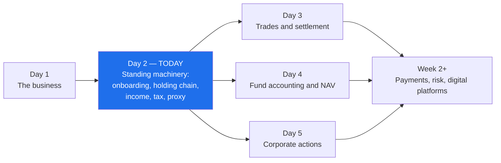
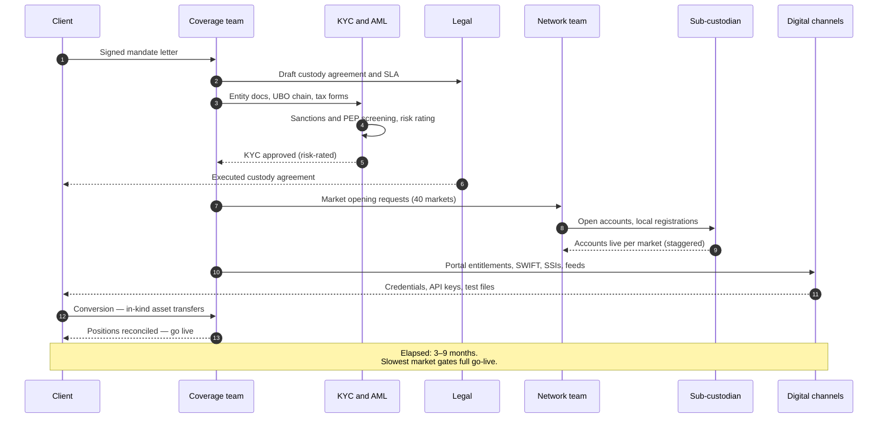
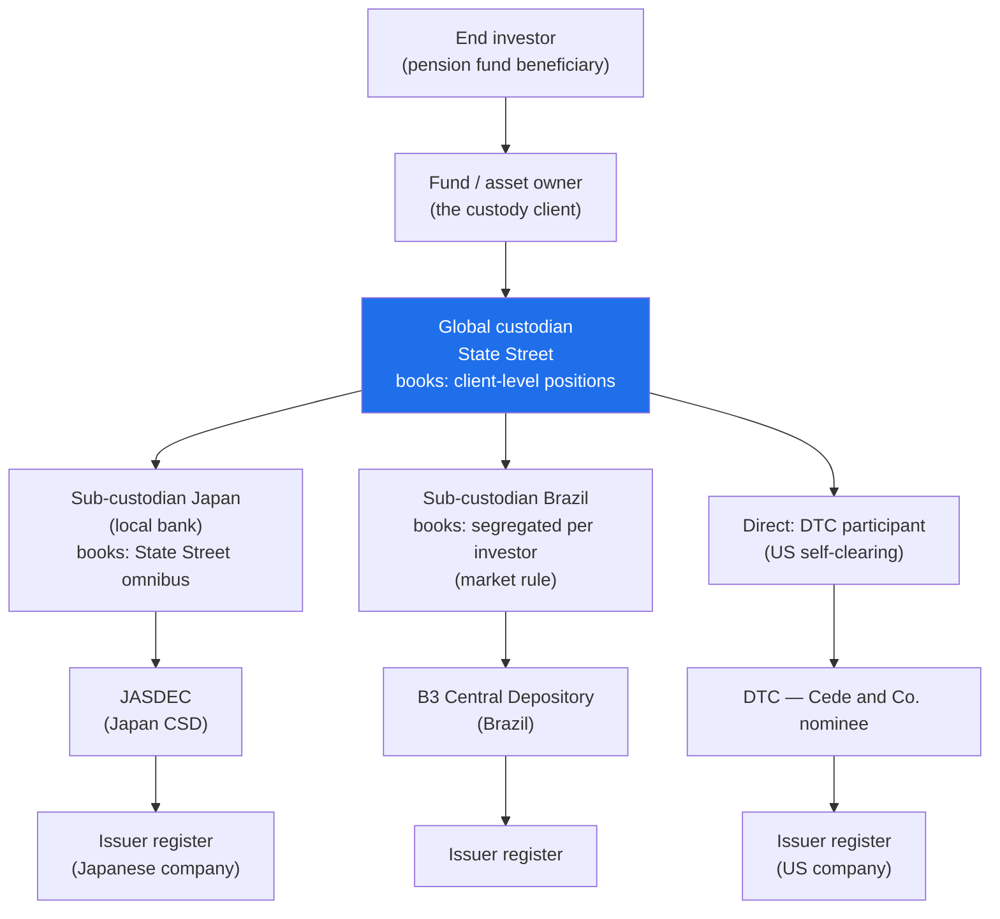
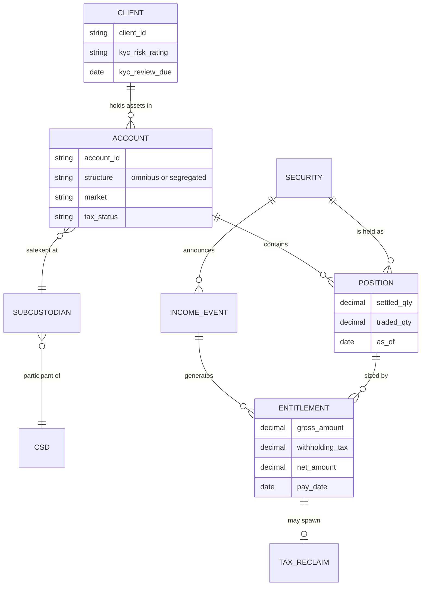
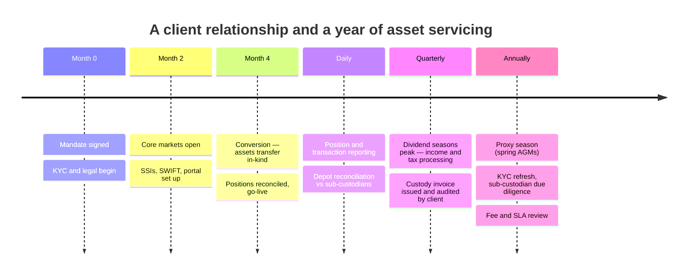
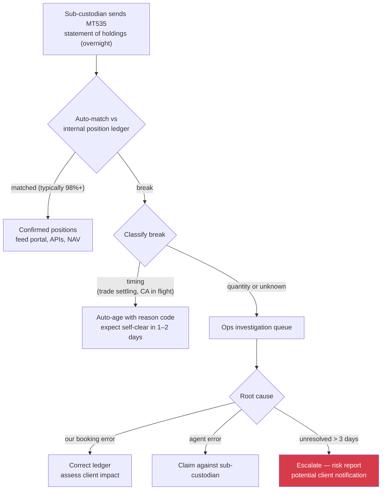

# Day 02 — The Asset Servicing Lifecycle

> Week 1 · Securities Services Foundations · Est. reading time: 60–90 min

---

## 🎯 Learning objectives

By the end of today you can:

- Walk a new institutional client through onboarding — KYC/AML, documentation, account structures, market openings — and explain why it takes weeks to months.
- Draw the holding chain from end investor to issuer, through global custodian, sub-custodian, and CSD, and explain what "your" securities legally are at each tier.
- Distinguish omnibus from segregated accounts and explain nominee registration, with the trade-offs of each.
- Explain what CSDs and ICSDs (DTC, Euroclear, Clearstream) do, and how a position "at DTC" actually sits in tiered books.
- Describe income collection, withholding tax reclaims vs relief-at-source, and proxy voting mechanics — with worked numbers.
- Identify where the servicing lifecycle surfaces in digital products: onboarding trackers, holdings views, income dashboards, tax status reporting.

---

## 🧭 Where this fits

Day 1 established *what* a custodian sells. Today covers the **standing machinery**: how a client comes on board, how their assets actually sit in the world's depositories, and how the routine fruits of ownership — dividends, coupons, tax reclaims, votes — flow back. Days 3–5 then cover the *events*: trades, NAVs, corporate actions. Everything in those days lands on the account structures and holding chains you learn today.

---

## Part 1 — Core concepts

### 1.1 Onboarding: the client's first experience of you

Onboarding a new custody client is a program, not a form. For a mid-sized asset manager (say 60 funds, 40 markets), expect **3–9 months** from signed mandate to first settled trade. The workstreams:

| Workstream | Content | Typical elapsed time |
|---|---|---|
| **Legal** | Custody agreement, fee schedule, SLAs, liability standard (negligence vs strict), securities lending addendum | 4–12 weeks |
| **KYC/AML** | Verify client identity, beneficial ownership (UBO), sanctions screening, source of funds; risk-rate the client | 2–8 weeks |
| **Account opening** | Create legal accounts and sub-accounts per fund/portfolio in the custodian's books | 1–4 weeks |
| **Market openings** | Open accounts in each market of investment via sub-custodians; some markets (India, Taiwan, Korea, Saudi) require investor-level registration, tax IDs, regulator approval | 1 week (US) to 3–6 months (restricted markets) |
| **Tax documentation** | W-8/W-9 forms, certificates of residence, treaty documentation per market | Parallel, ongoing |
| **SSIs and connectivity** | Standing settlement instructions, SWIFT setup, file feeds, portal entitlements | 2–6 weeks |
| **Conversion** | Migrate assets in-kind from the prior custodian (free-of-payment transfers), reconcile every position | 4–12 weeks |

**KYC/AML in one paragraph.** Know Your Customer and Anti-Money-Laundering rules require the bank to establish who the client *really* is: legal entity documents, ownership chain to ultimate beneficial owners (typically anyone holding ≥25%), screening against sanctions lists (OFAC, EU, UN) and politically-exposed-person databases, and an assessment of money-laundering risk that sets the review cycle (high-risk clients re-reviewed annually, low-risk every 3 years). For funds, this extends to understanding the fund's own investor base. It is repetitive, document-hungry, and the single most complained-about phase of onboarding — which is why digital onboarding trackers and document reuse ("perpetual KYC") are high-value product territory.

**Market opening — the hidden long pole.** Opening the US or UK takes days. Opening **India** requires FPI (Foreign Portfolio Investor) registration with SEBI, a PAN tax card, and local documentation; **Korea** historically required an Investor Registration Certificate; **Saudi Arabia** requires QFI qualification. A client who decides on Monday to buy Indian equities cannot; the custodian's market-opening machinery gates the investment strategy. Representative elapsed times: India 6–12 weeks, Taiwan 4–8 weeks, Brazil 4–6 weeks (CVM/local registrations).

### 1.2 Account structures: omnibus vs segregated, and the nominee concept

Securities at every tier sit in accounts, and the structure chosen balances cost, protection, and transparency:

- **Segregated account:** the client's assets sit in an account in the client's (or fund's) own name at the next tier down. Maximum protection and transparency; maximum cost (every account must be opened, maintained, reconciled in every market).
- **Omnibus account:** the custodian pools many clients' holdings of the same security into one account at the next tier ("State Street clients omnibus"). The custodian's own books keep the client-level detail. Cheaper and operationally efficient; but protection depends on the *custodian's* record-keeping, and some markets' insolvency law treats omnibus claims less kindly.
- **Nominee registration:** securities are registered in the name of a nominee company (e.g., a shell entity wholly owned by the custodian, with no other business) rather than the underlying investor. The investor keeps **beneficial ownership** (economic rights); the nominee holds **legal title**. This makes transfers book-entry instead of re-registration events.

| | Segregated | Omnibus |
|---|---|---|
| Asset protection | Strongest — identifiable at sub-custodian/CSD | Depends on custodian records and local law |
| Cost | High — per-account fees in every market | Low — one account serves thousands of clients |
| Corporate action handling | Elections per account at market | Custodian aggregates elections; splits entitlements internally |
| Tax | Investor-level rates can apply at source more easily | May force reclaim route where disclosure required |
| Market requirements | Some markets **mandate** segregation or investor IDs (India, Korea, China Connect variants) | Default in US/Europe omnibus-friendly markets |

Most global custody books are omnibus wherever the market allows, segregated where mandated or where the client pays for it. The 2008 Lehman insolvency made "where exactly are my assets, and in whose name?" a board-level question — expect sophisticated clients to demand digital transparency into their holding chain, not a PDF once a year.

A related vocabulary trap — three roles that sound alike but carry different legal duties:

| Role | Duty | Appointed by |
|---|---|---|
| **Custodian** | Safekeep and service assets per contract | The client (or its manager) |
| **Depositary** (UCITS/AIFMD) | Custody **plus** statutory oversight: cash monitoring, ownership verification, and liability to *restitute* assets lost in the chain | The fund, required by EU regulation |
| **Trustee** (US/UK trust structures) | Fiduciary duty to beneficiaries; may delegate custody | The trust instrument |

State Street frequently wears two of these hats for the same fund (custodian and depositary/trustee through separate legal entities), with internal information barriers — a structure worth understanding before you design entitlement models that assume "one client, one relationship."

### 1.3 CSDs and ICSDs: where securities actually live

A **central securities depository (CSD)** is the market-level utility where securities exist in final, root form — the top of the ownership pyramid:

- **DTC** (Depository Trust Company, US): holds virtually all US equities and corporate bonds. Legal quirk: nearly the entire US market is registered in the name of **Cede & Co.**, DTC's nominee. Your "Apple shares" are an entry in a chain of books that ends at Cede & Co. on Apple's share register.
- **Euroclear Bank** (Brussels) and **Clearstream Banking** (Luxembourg): the two **ICSDs** (international CSDs), born to settle Eurobonds in the 1960s–70s, now settling international securities and linking into dozens of domestic markets. National CSDs also exist per market (CREST in the UK, T2S-connected CSDs across Europe, JASDEC in Japan).

**Tiered (intermediated) holding** is the fundamental model: each tier holds a claim against the tier above and keeps books for the tier below. Almost no end investor appears on an issuer's register.

### 1.4 What "asset servicing" does day to day

Once assets sit in the chain, four recurring flows keep an operations floor busy — and each is a digital product surface:

1. **Income collection** — dividends and coupons must be captured, calculated, collected, and credited (worked example in Part 2).
2. **Tax** — withholding tax applied at source; the custodian pursues **relief-at-source** (correct treaty rate applied on pay date) or **reclaims** (file paperwork, wait months–years for refunds).
3. **Proxy voting** — meeting announcements flow down the chain; votes flow back up, usually via specialist intermediaries (Broadridge is the dominant utility; ISS and Glass Lewis advise on how to vote).
4. **Reporting and billing** — daily/monthly position and transaction reporting, audited statements, and the custodian's own invoice (bps on average assets + transaction charges — clients audit these aggressively, and billing transparency is an underrated portal feature).

Income events themselves come in more flavors than "dividend," and each has distinct data and timing characteristics your products must represent:

| Income type | Rate known when? | Typical complication |
|---|---|---|
| Cash dividend (equity) | At announcement | Currency options, tax by investor domicile |
| Bond coupon | At issuance (fixed) or reset date (floating) | Accrual conventions (30/360, ACT/ACT), defaults |
| Fund distribution | Shortly before pay date | Income vs capital split for tax |
| REIT / partnership distributions | Often re-classified **after** payment | Retroactive tax reclassification — restatements |
| Dividend with currency option | Election required | Becomes a corporate action (Day 5) |

### 1.5 Safekeeping risk and the network management discipline

The sub-custodian network is a chain of counterparties, and every link carries risk that someone at the custodian must own. **Network management** is that discipline: selecting agents (usually 1 per market, occasionally 2 for resilience), performing annual due diligence (financial strength, control environment, insurance, subcontracting), monitoring market infrastructure risk, and re-tendering periodically.

| Risk | Example | Mitigant |
|---|---|---|
| Agent insolvency | Local bank fails holding client omnibus | Asset segregation under local law; agent credit monitoring; UCITS depositary restitution liability concentrates minds |
| Market/country risk | Capital controls trap cash (historically: Argentina, Greece redenomination fears, Russia 2022 sanctions freezing assets in NSD) | Market risk ratings, client disclosures, contingency playbooks |
| Operational failure at agent | Missed corporate action deadline by sub-custodian | SLAs, penalty clauses, daily reconciliation, dual-agent strategies |
| Fraud / bad record-keeping | Positions on agent's books don't exist at CSD | Independent depot reconciliation to CSD level where possible |

Russia 2022 is the modern case study: sanctions and countermeasures left billions of client assets immobilized in Russia's NSD — legally owned, practically untouchable. Clients discovered which custodians could tell them *precisely* what was held where within days, and which took weeks. That difference was largely a **data and digital capability**, not an operations one: chain-of-custody data quality is a resilience feature.

### 1.6 Cash: the twin of every securities account

Every securities account has cash accounts beside it — usually one per currency, so a global portfolio easily carries 20–30. Custody cash does three jobs: it **settles trades** (DvP requires cash ready in the right currency at the right cutoff), it **receives income** (the dividends and coupons above), and it **funds expenses** (fees, taxes). Idle balances are swept into interest-bearing options or money-market funds; unswept cash is how the custodian earns part of its net interest income (Day 1), which is why sweep design is a commercial negotiation, not a technicality.

| Cash event | Direction | Timing sensitivity |
|---|---|---|
| Trade settlement debit/credit | Both | Hard market cutoffs — same day |
| Dividend/coupon credit | In | Pay date; contractual vs actual crediting |
| FX to fund cross-currency trades | Both | Compressed under T+1 (Day 3) |
| Fee debits, tax payments | Out | Monthly/eventual |
| Sweep to MMF or deposit | Out/in | End of day |

For your products: treasurers live in a **projected cash ladder** — today's opening balance, expected settlements, expected income, resulting end-of-day position per currency. A custodian that shows only *booked* cash forces clients to rebuild projections in spreadsheets; a projected ladder with drill-down to the underlying trades and entitlements is consistently among the most-used screens in any custody portal. It is also entirely a data-integration product: every number already exists somewhere upstream.

---

## Part 2 — The system deep dive

### 2.1 Onboarding, end to end

Failure modes to know: KYC document churn (client sends stale board resolutions; each re-request adds a week), market-opening surprises (a regulator changes documentary requirements mid-flight), conversion breaks (positions received don't match the prior custodian's records — every break must be chased before the client's auditors sign off), and entitlement errors (users can't see their funds on day one — a trivial-sounding defect that colors the client's entire first impression, and it belongs to you).

### 2.2 The holding chain: from your client to the issuer

Key readings of this diagram:

- **Each arrow is a set of books.** The issuer's register shows Cede & Co. DTC's books show participants (including State Street). State Street's books show clients. The client's books show portfolios. Reconciliation between adjacent tiers is a daily, automated, non-negotiable control — a position that exists on your books but not the sub-custodian's is either a timing difference or a serious problem.
- **The global custodian may be direct or indirect per market.** In the US, State Street is itself a DTC participant (no sub-custodian needed). In Japan or Brazil, it appoints a local sub-custodian — selected, monitored, and periodically re-tendered by a **network management** team that assesses each agent's financials, controls, and local market risk. Sub-custodian risk (what if the local bank fails or the market imposes capital controls?) is a real, priced risk; depositaries under UCITS rules can be liable for restitution of assets lost in the chain.
- **Legal nature of the claim changes by tier and jurisdiction.** In the US model the investor has a "security entitlement" (UCC Article 8) against its intermediary — not a direct claim on the issuer. Practical consequence: your record-keeping *is* the client's ownership.

### 2.3 The data model you'll build products on

Memorize the spine **client → account → position → entitlement**: nearly every custody screen, API, and report is a projection of it. Note the two quantities on POSITION — **settled** (what actually sits at the depository) vs **traded/contractual** (including pending trades). Clients constantly ask "which number am I looking at?"; a portal that doesn't label its position basis is generating support calls by design.

### 2.4 Income collection and tax — worked example

Your client, a Dutch pension fund, holds **500,000 shares of a US company** paying a **$2.00 quarterly dividend**.

| Step | Amount | Notes |
|---|---|---|
| Gross dividend | 500,000 × $2.00 = **$1,000,000** | Entitlement = record-date settled position × rate |
| US statutory withholding | 30% = $300,000 | Default for foreign investors |
| US–Netherlands treaty rate | **15%** | Fund qualifies under treaty |
| **Relief-at-source path** | Net credit **$850,000** on pay date | Custodian filed W-8BEN-E docs in advance; correct rate applied immediately |
| **Reclaim path** (if docs weren't in place) | $700,000 on pay date + **$150,000 reclaim** filed | Refund arrives in **months to years**, interest-free |

The difference between the two paths is pure client value: on this single dividend, relief-at-source gives the client $150,000 of cash **now** rather than a receivable that drags on performance. Multiply across a portfolio: a €10B European equity portfolio yielding 3% with an average 10–15% reclaimable spread can have **tens of millions** tied up in outstanding reclaims. Custodians differentiate hard on tax: documentation coverage, reclaim cycle times, and — squarely in your patch — **dashboards showing reclaim status and aged outstanding amounts by market**. Also know the cautionary tale: dividend-arbitrage abuse of reclaim systems ("cum-ex") cost European treasuries billions and produced criminal convictions; tax services now carry heavy compliance scrutiny.

**Proxy voting flow:** issuer announces meeting → CSD notifies participants → sub-custodian notifies global custodian → custodian (usually via Broadridge) notifies the client with agenda and deadlines → client (often guided by ISS/Glass Lewis policy) instructs votes → votes aggregate back up the chain before the market deadline. Pain points: chain latency compresses the client's decision window, omnibus positions must be split across clients voting differently, and vote confirmation ("was my vote actually cast?") remains patchy — a chronic client complaint the Shareholder Rights Directive II tried to fix in Europe by mandating same-day electronic transmission along the chain.

| Proxy chain step | SRD II expectation | Practical reality |
|---|---|---|
| Meeting notice down the chain | Same business day transmission | Mostly met via ISO 20022 seev messages |
| Client voting deadline | Set by intermediaries, before market deadline | Each tier shaves 1–2 days of buffer off the client's window |
| Vote confirmation to investor | On request, post-meeting | Coverage improving; still inconsistent outside EU |

### 2.5 The lifecycle in time

### 2.6 Reconciliation — the control that makes the chain trustworthy

Because every tier keeps its own books, **depot reconciliation** (positions) and **nostro reconciliation** (cash) run daily between adjacent tiers. The logic is simple; the volume is not — millions of position records across 100+ markets, every business day.

Why you care: **unreconciled data must never silently reach clients.** The channel layer needs a policy for breaks — suppress the position, flag it, or show last-confirmed with a staleness indicator. The worst policy is the accidental one: showing a number ops knows is wrong. Agree the rule with operations once, encode it in the data spine, and every downstream product inherits it.

### 2.7 Billing — the unglamorous flow clients scrutinize most

Common billing pitfalls worth knowing before a client raises them:

- **Wrong rate tier applied** after AUC crossed a breakpoint mid-quarter — the classic audit finding.
- **Double-charged pass-throughs**: sub-custodian fees both embedded in the bps rate and itemized separately.
- **Transaction miscounts**: cancelled-and-rebooked trades billed twice; internal transfers billed as market trades.
- **FX on fees**: invoices in USD for EUR-denominated assets using an undisclosed conversion rate.

Each is small money and large trust damage. A billing drill-down that lets the client see the calculation eliminates suspicion even when the invoice is right — which it usually is.

Custody invoices are computed from average AUC by market (each market has its own bps rate reflecting local costs), transaction counts by type, and ancillary charges (tax reclaims filed, corporate action elections, out-of-pocket sub-custodian pass-throughs). A representative invoice for the pension fund above: $50B average AUC at blended 0.6 bps = $3.0M + 45,000 trades × $6 avg = $270k + ancillaries ≈ **$3.4M/quarter**. Clients employ specialist invoice-audit firms; disputed line items and opaque calculations sour relationships far beyond their dollar value. A self-service billing transparency view — rate card, calculation drill-down, invoice history — is one of the cheapest client-satisfaction wins in the digital estate.

---

## Part 3 — The VP lens

### What Digital Experience owns in this lifecycle

| Lifecycle stage | Digital product surface | Client value / risk if absent |
|---|---|---|
| Onboarding | Status tracker (workstreams, per-market progress, doc checklist), secure doc exchange | Without it: weekly status spreadsheets by email; first impression = 1995 |
| Holdings | Position views with **basis labeling** (settled vs traded), holding-chain transparency (which sub-custodian, which account structure) | Post-Lehman boards demand chain visibility |
| Income | Projected vs received income, aged outstanding items | Treasurers plan cash on this |
| Tax | Reclaim pipeline by market with aging and amounts; documentation status per account | Millions in client cash; differentiator in RFPs |
| Proxy | Usually delegated to Broadridge — decide integration depth (embed, link out, or ignore) | Fragmented UX vs build cost |
| Billing | Invoice drill-down and rate-card transparency | Deflects the most contentious inquiries |

### Decisions and trade-offs on your desk

1. **Onboarding tracker: whose workflow system is the source?** Onboarding runs on internal case-management tools that were never built for exposure. Choose: build a client-facing skin over the internal tool (fast, but you inherit its data hygiene), or define a clean status abstraction with mapped milestones (slower, durable). Recommendation: the abstraction — internal workflow tools change; your client-facing status vocabulary shouldn't.
2. **How much chain transparency?** Showing clients the sub-custodian and account structure per market is a trust win but exposes network changes (agent switches) that ops prefers to manage quietly. Negotiate a disclosure standard with network management rather than letting each RFP answer improvise one.
3. **Position basis as a product standard.** Mandate that every screen, API field, and file column carrying a quantity declares its basis (settled/traded/contractual) and as-of time. This one governance rule eliminates a double-digit percentage of client data inquiries — it is boring, and it is some of the highest-ROI work you can sponsor.
4. **Tax dashboard prioritization.** Tax data lives in specialist sub-systems with slow batch outputs. Real-time is unnecessary — reclaims move monthly — so resist gold-plating; a daily-refreshed aged view covers 95% of the value at a fraction of the integration cost.

### Metrics for this domain

| Metric | Owner | Why it's on *your* scorecard |
|---|---|---|
| Onboarding cycle time and client-visible milestone latency | Coverage/ops; you own the visibility | The tracker's value is measured in "surprises avoided" |
| % of onboardings run through the tracker vs email | You | Adoption of your product by internal teams |
| Depot recon breaks older than 3 days | Operations | You surface it; your break policy depends on it |
| Income items credited on pay date | Operations | Feeds your projected cash ladder accuracy |
| Reclaim aging visible to clients (coverage by market) | You | Tax dashboards are an RFP differentiator |
| Billing inquiries per 100 invoices | Coverage; you move it | Direct evidence transparency features work |
| Position-basis labeling coverage across screens/APIs/files | You | The governance rule that pays compounding dividends |

### A RACI for the holdings screen (illustrative of every surface you own)

| Activity | Product (you) | Technology | Operations | Coverage | Risk/Compliance |
|---|---|---|---|---|---|
| Define position-basis labeling standard | **A/R** | C | C | I | C |
| Source-system data quality | I | C | **A/R** | I | I |
| Break-suppression policy on screens | **A** | R | **R** | I | C |
| Entitlements model (who sees what) | **A/R** | R | C | C | **A** (approval) |
| Client communication of data incidents | C | I | C | **A/R** | C |
| Chain-transparency disclosure standard | **A/R** | I | C (network team) | C | C |

The pattern to internalize: you are **accountable for the experience and the standards**, operations is accountable for **the truth**, and the seams between those two accountabilities are where clients get hurt. Manage the seams explicitly.

### Questions for your teams

- "When a client asks 'where are my Korean shares held and in what structure?' — can they self-serve that answer today?"
- "What happens on our screens when a position is in reconciliation break — suppressed, flagged, or silently wrong?"
- "Do our position APIs expose settled and traded quantities as distinct, labeled fields — or one ambiguous number?"
- "What share of onboarding status updates reach clients through the portal vs a coverage analyst's spreadsheet?"
- "Which markets' income and tax data arrive too late or too dirty to show clients — and is the fix data engineering or vendor management?"
- "If Russia-2022 happened in another market tomorrow, how fast could we give every affected client a precise, self-service view of what they hold there — hours or weeks?"
- "Does our projected cash ladder include expected income and pending settlements, or only booked cash?"
- "Who approved the current entitlements model, and does it correctly separate what our custodian and depositary entities may each see?"

---

## 🏦 State Street context

*(Public-knowledge and representative; verify specifics internally.)*

- State Street operates one of the industry's largest global networks — servicing clients across **100+ markets** through a mix of direct memberships (DTC, Fed, major European CSDs via its international entities) and appointed sub-custodians, overseen by a network management function that publishes market information guides clients rely on.
- As one of the largest servicers of US mutual funds and ETFs, State Street's asset-servicing volumes in income, tax, and proxy are among the industry's biggest; small per-event error rates become large absolute exposures at this scale — the operational-risk backdrop to every digitization case you'll write.
- State Street's institutional clients include the world's largest asset owners and managers; onboarding programs for flagship mandates (multi-hundred-billion conversions) are run as named programs with executive sponsors. The digital onboarding experience is routinely probed in RFPs.
- Representative of large custodians: legacy internal systems per function (income, tax, network, billing) accreted over decades and acquisitions (e.g., State Street's acquisitions of Investors Financial 2007, parts of Deutsche Bank's fund business, Mourant, IFS Ireland, and BBH's Investor Services announced-then-restructured deal era) — meaning your channel layer integrates *many* systems of record, and data normalization is the real work behind every "simple" holdings screen.
- State Street acts as depositary/trustee for large fund ranges in Europe (Ireland and Luxembourg entities) and as trustee for US collective trusts — the multi-hat reality above is daily life, and it shapes entitlements, data-sharing rules, and even which dashboards different State Street entities may legally see.
- The Alpha data platform ambition (Day 1) is directly relevant here: onboarding status, chain data, income, tax, and billing all become products only when normalized onto a common spine — the representative multi-year program behind any credible custody digital roadmap.

---

## 💪 Exercises

1. **Chain mapping (30 min).** Pick three markets — US, Japan, India. For each, sketch the holding chain for a State Street client's equity position: which entity is on the issuer register, who keeps which books, omnibus or segregated (research the market rule). Note where the answer differs and why.
2. **Tax math (20 min).** A UK pension fund holds 2M shares of a German company paying €1.50/share. German statutory withholding is 26.375%; the treaty rate for qualifying pension funds is 0%. Compute the cash difference between relief-at-source and a reclaim that takes 18 months, assuming the fund's cash earns 3% annually. (Answer: withheld €791,250; reclaim path costs ~€35,600 in foregone interest plus filing costs and balance-sheet drag.)
3. **Portal critique (30 min).** Find any public demo/screenshots of a custodian or broker holdings screen. List: is the position basis labeled? As-of time shown? Chain/location visible? Draft the three field-level changes you would mandate as product standards.
4. **Break policy memo (20 min).** Write a half-page policy: when a position is in reconciliation break, what should the portal, the API, and the end-of-day file each do? Defend the differences (interactive users can absorb a flag; downstream systems consuming files may not).

---

## ❓ Self-check quiz

1. Why can opening a custody account take six months for some markets when the US takes days?
2. Your client's US shares are "registered to Cede & Co." Explain to a nervous trustee why this is normal and what protects the client.
3. Omnibus vs segregated: give two advantages of each, and name a circumstance where the client has no choice.
4. A dividend pays $1M gross with 30% withheld, but the treaty rate is 15%. Contrast relief-at-source and reclaim outcomes for the client's cash.
5. Name three points in today's lifecycle where a digital product materially changes the client's experience, and the metric you'd use for each.

Answers

1. Restricted markets require investor-level registration with local regulators and tax authorities (e.g., India's FPI registration with SEBI plus PAN, Saudi QFI qualification), local documentation, and sometimes regulator approval — each a multi-week external dependency the custodian coordinates but doesn't control.
2. Cede & Co. is DTC's nominee; virtually all US-market securities are registered this way to enable book-entry transfer. The client holds a security entitlement through the tiered chain (UCC Article 8), client assets are segregated from each intermediary's own assets, and daily reconciliation between tiers evidences the position. Protection comes from segregation law plus record-keeping, not from name-on-register.
3. Omnibus: cheaper, operationally efficient (one account per market serves all clients). Segregated: stronger and more directly evidenced asset protection, cleaner investor-level tax and elections. No choice: markets that mandate segregation/investor IDs (e.g., India), or fund regulations demanding it.
4. Relief-at-source: correct 15% rate applied on pay date — client receives $850,000 immediately. Reclaim: $700,000 on pay date, $150,000 refund filed and received months-to-years later, interest-free — a real economic cost in foregone return and an operational cost in filing and tracking.
5. Examples: onboarding tracker (metric: milestone-update latency, share of updates self-served); position basis labeling (metric: position-related inquiry volume); tax reclaim dashboard (metric: aged-reclaim visibility coverage, tax inquiries); billing transparency (metric: billing inquiries per 100 invoices).

---

## 🔑 Key takeaways

- Onboarding is a 3–9 month program gated by KYC, legal, and — the hidden long pole — per-market openings; the client's first impression of your digital estate is the onboarding tracker, or its absence.
- Securities live in a **tiered holding chain**: investor → global custodian → sub-custodian → CSD → issuer register, each tier a set of books reconciled daily; nominee registration (Cede & Co.) separates legal title from beneficial ownership to enable book-entry markets.
- **Omnibus** trades protection-evidence and tax granularity for cost; **segregated** the reverse; markets sometimes dictate the answer. Post-Lehman, clients demand visibility into exactly this.
- Income and tax are where servicing quality becomes measurable client money: relief-at-source vs reclaim on one $1M dividend is $150k of immediate cash; across portfolios it's tens of millions of working capital.
- Proxy voting runs on an intermediated chain (usually via Broadridge) whose latency and confirmation gaps are chronic client irritants — and mostly a build-vs-integrate decision for you, not a build.
- The data spine **client → account → position → entitlement**, with position basis (settled vs traded) explicitly labeled, underlies every digital product you will ship; making that labeling a product standard is quiet, high-ROI governance.
- Daily depot and nostro reconciliation is the control that makes tiered books trustworthy; your channels need an explicit, agreed policy for what breaks look like to clients — never a silent wrong number.
- Cash is the twin of every securities account; a projected multi-currency cash ladder is reliably one of the most-used screens in any custody portal, and it's pure data integration.
- Billing transparency is the cheapest trust win in custody digital products.
- Custodian, depositary, and trustee are different legal roles State Street often plays simultaneously through separate entities — a fact that quietly shapes entitlements and data-sharing design.

---

## 📚 Going deeper

- Michael Simmons, *Securities Operations* (Wiley) — chapters on safekeeping, income, and reconciliation.
- DTCC learning resources and dtcc.com — how DTC, NSCC, and Cede & Co. actually work; free primers.
- Euroclear and Clearstream public "knowledge" portals — ICSD mechanics and market guides.
- BIS/CPMI-IOSCO, *Principles for Financial Market Infrastructures* — CSD obligations (bis.org, free).
- Shareholder Rights Directive II (EU 2017/828) — the regulatory push for same-day proxy information flow through custody chains.
- AFME and ISSA papers on account segregation and asset protection post-Lehman (free PDFs).
- IRS W-8BEN-E instructions and OECD treaty-rate tables — the plumbing of relief-at-source.
- UCC Article 8 (US) overviews — the "security entitlement" legal model behind tiered holding.
- ESMA and CBI guidance on depositary obligations under UCITS V/AIFMD — the restitution-liability regime.
- Broadridge public materials on proxy processing — how the dominant proxy utility actually works.
- Thomas Murray public market profiles — the market-infrastructure risk data network managers use.

---

## Tomorrow

**Day 03 — The Trade Lifecycle and T+1 Settlement:** what happens between "buy 100,000 shares" and settled cash and securities — allocations, affirmations, CCPs, DvP — and how the 2024 move to T+1 compressed every deadline in the chain.
