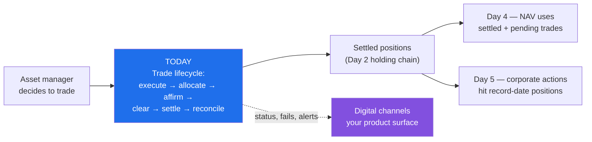
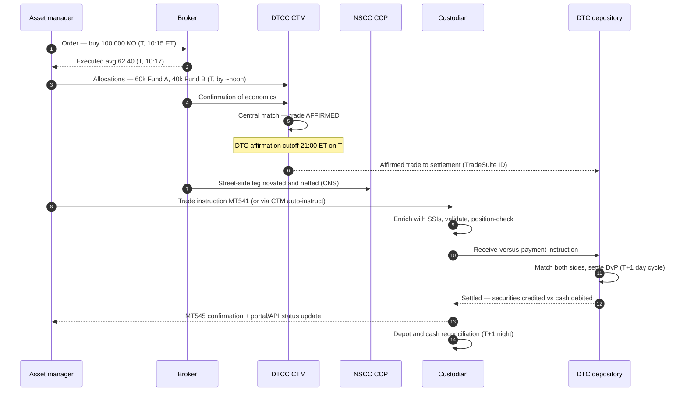
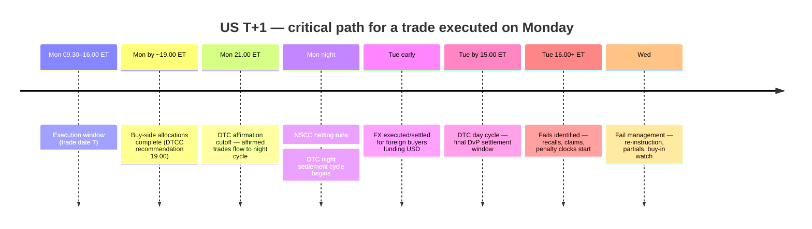
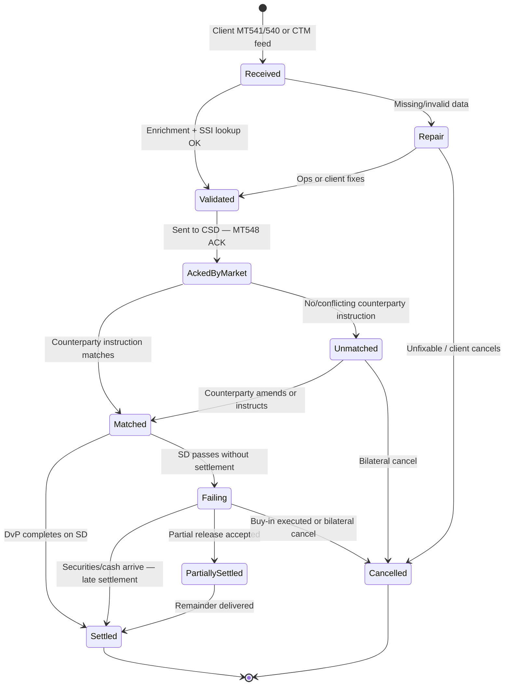
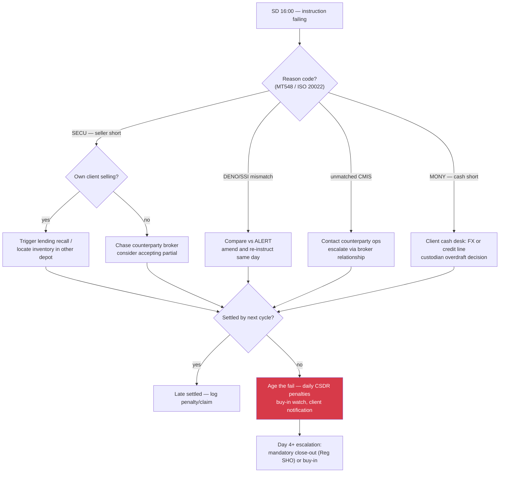

# Day 03 — The Trade Lifecycle and T+1 Settlement

> Week 1 · Securities Services Foundations · Est. reading time: 60–90 min

---

## 🎯 Learning objectives

By the end of today you can:

- Narrate the full trade lifecycle — order, execution, allocation, confirmation/affirmation, clearing, settlement, reconciliation — naming the systems and actors at each step.
- Explain DvP vs FoP settlement and why DvP eliminates principal risk.
- Describe what changed with the US move to **T+1** in May 2024: the 9:00 PM ET affirmation deadline on trade date, compressed FX funding, securities-lending recalls, and the automation it forced.
- Diagnose why settlements fail (securities short, cash short, SSI mismatches, market issues) and quantify what fails cost — including **CSDR cash penalties** in Europe.
- Explain SSIs and why reference data quality is the quiet determinant of settlement rates.
- Specify where a custodian's digital products surface trade status — and what a genuinely good settlement-status experience looks like.

---

## 🧭 Where this fits

Day 2 covered the standing machinery: accounts, chains, holdings. Today covers the highest-volume *event* that machinery processes: the trade. Settlement is the custodian's heartbeat — State Street-scale firms process on the order of **100+ million trades a year** — and settlement status is the single most-queried data item in any custody digital channel. Tomorrow (Day 4) covers how settled positions become fund NAVs; Day 5 covers corporate actions.

---

## Part 1 — Core concepts

### 1.1 The lifecycle in one pass

A US pension fund's equity manager buys 100,000 shares of Coca-Cola. What actually happens:

| Stage | What happens | Who | Key systems/utilities |
|---|---|---|---|
| **1. Order** | PM decides; order routed to trading desk | Asset manager | OMS (e.g., Charles River) |
| **2. Execution** | Broker executes on exchange/ATS, possibly in pieces | Broker-dealer | Exchange, broker systems |
| **3. Allocation** | Block of 100k split across the manager's funds (60k Fund A, 40k Fund B) | Asset manager | OMS → CTM |
| **4. Confirmation / affirmation** | Broker confirms economics; manager (or custodian as agent) **affirms** — "yes, that matches" | Broker, manager, custodian | DTCC CTM, TradeSuite ID |
| **5. Clearing** | For US equities, NSCC nets all trades per participant per security; CCP guarantees | NSCC (a CCP) | Continuous Net Settlement |
| **6. Settlement instruction** | Custodian instructed (SWIFT MT541 receive-vs-payment); matches counterparty instruction at the depository | Custodian, DTC | SWIFT, DTC |
| **7. Settlement** | On settlement date: securities move to custodian's DTC account against cash — **DvP** | DTC | Book entry |
| **8. Reconciliation and reporting** | Position and cash updated, confirmed to client (MT544/545, portal, API) | Custodian | Recon engines, channels |

Vocabulary that must become reflexive:

- **T, T+1, T+2:** trade date and business days after. US equities/corporates settled **T+2 until May 27, 2024; T+1 since May 28, 2024** (with India before it and the UK/EU targeting 2027). Most European markets remain T+2 today.
- **Confirmation vs affirmation:** the broker *confirms* trade details; the buy-side (or its custodian/prime as agent) *affirms* agreement. An affirmed trade flows straight into settlement ("straight-through processing"); an unaffirmed one needs manual intervention and, post-T+1, is at high risk of failing.
- **Clearing:** everything between execution and settlement — trade matching, netting, and (where a CCP stands in) counterparty risk mutualization.
- **Settlement:** the actual exchange of securities and cash, final and irrevocable, at the CSD.

### 1.2 CCPs and netting — why clearing exists

A **central counterparty (CCP)** interposes itself between buyer and seller through *novation*: one trade becomes two (buyer↔CCP, CCP↔seller). If a member defaults, the CCP — armed with margin and a default fund — completes the trades. The other gift of central clearing is **multilateral netting**. NSCC nets every member's trades per security per day into one net obligation:

**Worked example.** During one day, State Street's DTC participant account (acting for hundreds of clients) executes in Coca-Cola: buys of 2,400,000 shares and sells of 2,150,000 across thousands of trades. Netting compresses this to **one net receive of 250,000 shares** and one net cash payment. Industry-wide, NSCC netting routinely reduces gross settlement obligations by **~98%** — trillions of dollars of gross trades become tens of billions of actual movements. Less movement = less liquidity needed = fewer things that can fail. Note: institutional deliveries between custodians and brokers still settle trade-for-trade at DTC via TradeSuite ID; netting applies to the street-side (broker-to-broker) layer.

### 1.3 DvP vs FoP

- **Delivery versus payment (DvP):** securities and cash move simultaneously and conditionally — neither leg settles without the other. This kills *principal risk* (paying and not receiving). The 1990 BIS "DvP Report," written after the 1987 crash and Herstatt-style scares, made DvP the global standard.
- **Free of payment (FoP):** securities move with no cash leg — used for custodian-to-custodian transfers (conversions, Day 2), collateral movements, some fund-of-fund flows. FoP is riskier by construction (you deliver and hope), so ops guards FoP instructions with extra controls — and fraud attempts disproportionately target FoP flows, which matters for how your channels authenticate instruction workflows.

### 1.4 SSIs and reference data — the unglamorous determinant of settlement rates

A **standing settlement instruction (SSI)** is the stored answer to "where do I deliver?": for each counterparty, market, currency, and security type — account numbers, depository IDs, agent BICs. When SSIs are wrong or stale, instructions mismatch and trades fail. Industry plumbing: **DTCC ALERT** is the golden SSI database; custodians auto-enrich trades from it. Studies consistently attribute **30%+ of settlement fails** to bad or mismatched SSIs and reference data — failures of data hygiene, not market drama. The strategic lesson for a product leader: settlement performance is a *data quality* product before it is an operations product.

### 1.5 What a fail costs

A settlement fail is a trade that doesn't settle on intended settlement date. Costs stack up fast:

| Cost | Mechanism | Worked example (on a $10M equity delivery failing 4 days) |
|---|---|---|
| Funding | Buyer's cash is committed but idle; seller doesn't get proceeds | $10M × 5% overnight × 4/360 ≈ **$5,556** |
| CSDR penalty (EU/EEA trades) | Daily bps penalty on failing value, paid to the suffering party | Equities: 1.0 bp/day → $10M × 0.0001 × 4 = **$4,000** |
| Buy-in risk | Suffering party (or CCP) buys the securities elsewhere; failing party pays the difference | Price moved +2% → **$200,000** |
| Ops cost | Investigation, chasing, claims | ~$50–$500 per fail touched |
| Client trust | Fails visible to the client's PM and their performance | Unquantified, decisive at renewal |

Europe's **CSDR Settlement Discipline Regime** (live February 2022) made fails legally expensive: cash penalties accrue daily (0.5 bp for liquid equities, 1.0 bp illiquid, 0.1–0.25 bp for bonds, per day of fail), calculated by the CSD, collected from the failing participant, and passed to the suffering party. Custodians had to build entire penalty processing, allocation, and reporting capabilities — and clients now expect to *see* their penalties, per trade, in digital channels. In the US there is no CSDR equivalent, but persistent fails trigger Reg SHO close-out obligations for equities and (for Treasuries) the TMPG fails charge.

---

## Part 2 — The system deep dive

### 2.1 End-to-end with every actor

Study the timestamps: under T+1, *everything to the left of settlement now happens on trade date*. Allocation by early afternoon, affirmation by 21:00 ET, instruction and enrichment overnight, settlement next day. Under T+2 there was a full extra day of slack for exceptions; T+1 deleted it.

### 2.2 The T+1 timeline — cutoffs that now rule the day

**Why T+1 happened:** the 2021 meme-stock volatility showed that margin at the CCP scales with time-to-settle; halving the cycle halves risk exposure and freed billions in clearing-fund margin. The SEC mandated the move for May 28, 2024 (Canada and Mexico moved May 27).

**The three operational consequences you must be able to discuss:**

1. **FX funding compression.** A Tokyo or London asset manager buying US equities must now source USD a full day earlier — often executing FX after their local market close, into thinner liquidity, or pre-funding (holding USD buffers, a performance drag). CLS's main settlement window became hard to reach for late-day FX, pushing some flows to riskier bilateral settlement. Custodian FX desks (State Street's included) built late-cutoff and automated FX programs specifically for this — an example of an operational rule change becoming a revenue product.
2. **Securities lending recalls.** If a client sells a security that's out on loan, the custodian/lending agent must recall it from the borrower in time for T+1 settlement. The recall window collapsed from ~2 days to hours; automated recall triggering off sale notifications became mandatory, and recall latency became a differentiating metric for lending programs.
3. **Affirmation automation.** Manual affirmation by fax-era workflows cannot hit 21:00 ET on T. The industry pushed same-day affirmation rates from ~70% pre-transition to **~95%+ by settlement date within months of go-live**, via CTM auto-affirmation, custodians affirming as agents (TradeSuite ID roles), and buy-side workflow automation. Trades affirmed by the cutoff settle at dramatically higher rates — affirmation status is now a *leading indicator* your dashboards should treat as such.

Notably, the feared spike in fails didn't materialize: US fail rates stayed broadly at pre-T+1 levels (CNS fails ~2%, slightly better within months), vindicating the automation-first approach. The next frontier — UK/EU T+1 in October 2027, and live debates about T+0 — will re-run the same playbook with worse time zones.

### 2.3 The life of a settlement instruction — states your products must model

The instruction's state machine is *the* data model behind every settlement-status screen:

Product implications, state by state: **Repair** and **Unmatched** are *pre-settlement-date* exceptions — surfacing them on T gives the client (or ops) a full day to act; surfacing them on SD is an autopsy. **Failing** needs reason codes (see 2.4), aging, and projected penalty accrual. **PartiallySettled** exists in Europe (CSDR encourages partials) and confuses clients unless the UI decomposes quantity settled vs outstanding. Your status vocabulary across portal/API/SWIFT must map 1:1 to these states — inventing channel-specific statuses is how custodians end up with "portal says pending, MT548 says PACK/MTCH" support tickets.

### 2.4 Why trades fail, and how fails get worked

Fail causes, in rough industry frequency order:

| Cause | Share (representative) | Typical fix |
|---|---|---|
| Seller short of securities (lending recall late, inventory elsewhere, inbound fail chains) | ~35–40% | Recall, borrow, partial delivery |
| SSI / reference data mismatch | ~25–30% | Amend instruction, ALERT hygiene |
| Unmatched — counterparty never instructed or economics differ | ~15–20% | Chase counterparty on T/T+1 |
| Cash/FX short (buyer funding late) | ~10% | Credit line, overdraft, late FX |
| Market/infrastructure issues (CSD outage, sanctions screening holds) | ~5% | Case-by-case |

The operational pattern: fails management is a **prioritized queue** worked by value, age, penalty accrual, and client sensitivity — precisely the shape of problem good workflow software crushes. Best-in-class custodians now run *predictive* fails models (flagging at-risk instructions on T using counterparty history, security borrow-tightness, and matching status) — and expose the prediction to clients so they can act. That is a digital product, not an ops process, and it is where the RFP questions have moved.

### 2.5 Reconciliation closes the loop

After settlement: depot recon (Day 2) confirms the DTC/sub-custodian position matches the ledger; cash recon confirms the debit/credit; client reporting (MT544–547 confirmations, MT535/536 statements, portal, API, files) tells the world. Any mismatch between "what we told the client" and "what the depository says" becomes a data-consistency incident — Day 1's cardinal sin.

---

## Part 3 — The VP lens

Settlement status is the most-used feature of custody digital channels. Owning it well means:

### The settlement experience, tiered by client maturity

| Tier | Experience | Who wants it |
|---|---|---|
| Baseline | Accurate T+0 status list, filter/search, export | Every client |
| Competitive | Exception-first dashboard: repairs, unmatched, at-risk, failing — with reason codes, aging, penalty accrual | Ops-heavy clients |
| Differentiating | Predictive fail risk on T; push alerts (email/webhook) on state transitions; partial-settlement decomposition; penalty analytics by counterparty | Global managers, RFP winners |
| Frontier | Write-back: cancel/amend instructions, approve partials, trigger recalls from the portal with maker-checker | Clients consolidating ops |

### Decisions and trade-offs on your desk

1. **Read-only vs write-back.** Letting clients *act* (amend, cancel, approve partials) multiplies value and risk: instruction workflows need maker-checker, entitlement granularity, fraud controls (remember FoP), and ops sign-off. Sequence deliberately: read → alert → act. Skipping to "act" before status data is trusted destroys the feature's credibility.
2. **Event-driven vs polling.** Clients' systems polling your status API every 30 seconds for 100k trades is expensive and stale; webhook/streaming events on state change are the right architecture but demand client-side maturity. Offer both; price polling abuse; measure event adoption as a strategy KPI.
3. **One status vocabulary.** Force portal, API, files, and SWIFT to derive from the same state machine (2.3). This is a governance decision you can win in one architecture council and harvest for years.
4. **Predictive fails: build where you have proprietary signal.** Your fail-prediction edge is State Street's cross-client view of counterparty behavior and inventory — data no client and few competitors have. This is exactly the "own the experience where the data is differentiated" rule from Day 1.
5. **Penalty transparency.** CSDR penalties arrive from CSDs monthly, get allocated to underlying clients, and generate disputes. A penalties dashboard (per trade, per counterparty, appealable items flagged) converts an irritant into a differentiator — and reduces ops workload fielding penalty queries.

### Metrics that matter

- Same-day affirmation rate (by client, by broker) — the leading indicator.
- Settlement rate on SD; fails by reason code, value-weighted; average fail age.
- % of exceptions surfaced to clients on T (vs on/after SD).
- Alert latency: market event → client notification (target minutes).
- Digital deflection: settlement-status inquiries per 1,000 trades, trending down.
- API event adoption vs polling share.

### Questions for your teams

- "What is our clients' same-day affirmation rate distribution — and do we show each client theirs, benchmarked?"
- "How many distinct settlement-status vocabularies exist across our channels today?" (The honest answer at most custodians: 3–6.)
- "When a trade flips to Failing at the CSD, how many minutes until the portal shows it and an alert fires?"
- "Do we expose CSDR penalty accrual per failing trade, or does the client discover it on a monthly statement?"
- "What would it take to let a client approve a partial settlement from the portal — and which control function has to say yes?"

---

## 🏦 State Street context

*(Public-knowledge and representative; verify specifics internally.)*

- **Scale:** State Street processes on the order of nine figures of trades annually across 100+ markets; it is among the largest DTC/NSCC participants and a major direct participant across European CSDs (including via T2S) and Asian markets — settlement is arguably its core industrial process.
- **T+1 program:** like all major custodians, State Street ran a multi-year T+1 readiness program through May 2024 — client outreach on affirmation models (self-affirm vs custodian-affirm via TradeSuite ID), late FX cutoff products through State Street Global Markets, and automated lending recalls through its agency lending business. Public industry post-mortems (DTCC, SIFMA) recorded affirmation rates above 94% at the deadline within weeks of go-live.
- **Charles River tie-in:** with CRD in the family, State Street sits on *both* sides of the lifecycle — the OMS generating allocations and the custodian settling them. Alpha's front-to-back pitch is precisely that allocation-to-settlement can be one data flow; digital experience is where a client should *see* that continuity (e.g., order status and settlement status in one timeline).
- **Representative reality:** settlement processing runs on per-region legacy engines accreted over decades; the "one state machine" your channels need is usually built as a normalization layer on top, not by replacing the engines. Budget accordingly and be skeptical of "we'll just re-platform settlement" timelines.
- **UK/EU T+1 (October 2027)** is the next program: expect the same affirmation-automation and FX story with more markets, more CSDs, and CSDR penalties already live. Digital readiness (exception surfacing, penalty analytics) planned now lands exactly when clients start asking.

---

## 💪 Exercises

1. **Cutoff math (20 min).** A Sydney-based manager executes a US equity buy at 3:50 PM ET Monday. Map their working-day timeline to affirm by 9:00 PM ET and fund USD by Tuesday morning — noting it is already Tuesday morning in Sydney at execution. Write the three process changes you'd recommend them (hint: standing FX program, custodian-affirmation agency, allocation automation).
2. **Penalty P&L (20 min).** A client's €25M Italian government bond delivery fails for 6 business days under CSDR (bond penalty rate 0.10 bp/day). Compute the penalty (€25M × 0.00001 × 6 = €1,500), then compute the funding cost at 4% (≈ €16,667). Note which one the client sees on a statement and which one they feel in performance — then draft the one-screen "cost of fails" view that shows both.
3. **State machine audit (30 min).** Take the stateDiagram in 2.3 and map each state to: the MT548 code that evidences it, the portal label you'd display, and whether an alert should fire on entry. You now have a real product spec artifact.

---

## ❓ Self-check quiz

1. Distinguish confirmation, affirmation, clearing, and settlement in one sentence each.
2. Why does multilateral netting reduce settlement risk, and roughly how much does NSCC netting compress gross obligations?
3. Name the three biggest operational consequences of US T+1 and the automation each forced.
4. A trade is "Unmatched" at the CSD on trade date. Why is this the most valuable moment to alert someone, and who should be alerted?
5. Under CSDR, who pays settlement-fail penalties, who receives them, and what should a custodian's digital channel show about them?

Answers

1. Confirmation: the broker states the trade's economics. Affirmation: the buy-side (or its agent) agrees to them, releasing the trade to settle. Clearing: post-trade matching, netting, and CCP risk management between execution and settlement. Settlement: the final, irrevocable exchange of securities against cash at the CSD.
2. Netting collapses thousands of gross obligations into one net movement per participant per security, shrinking the value that must actually move (NSCC routinely ~98% reduction) — less liquidity required, fewer deliveries that can fail, smaller exposures if a member defaults.
3. FX funding compression (→ late-cutoff FX products, pre-funding, automated custodian FX); securities-lending recall compression (→ automated recall triggering off sales); affirmation deadline of 21:00 ET on T (→ CTM auto-affirmation, custodian-as-agent affirmation, buy-side workflow automation lifting same-day affirmation to ~95%+).
4. Unmatched on T means the counterparty hasn't instructed or details conflict — there is still a full day to fix it before settlement date, so the fix is cheap and the fail preventable. Alert the party who can act: the client's ops team (or the custodian's ops if they act as agent), with the counterparty and the mismatched fields identified.
5. The failing participant pays; the CSD calculates and collects daily (0.1–1.0 bp/day by asset class) and redistributes to the suffering party. Channels should show accruing and settled penalties per trade, aggregated by counterparty and fund, flag appealable items, and net paid-vs-received — otherwise clients reconcile penalties by spreadsheet and blame the custodian for opacity.

---

## 🔑 Key takeaways

- The lifecycle is order → execution → allocation → confirmation/**affirmation** → clearing (CCP netting) → **DvP settlement** → reconciliation; affirmation by 21:00 ET on T is the hinge of the US T+1 regime.
- Netting is the quiet miracle: ~98% compression of gross obligations at NSCC; DvP kills principal risk; FoP flows deserve suspicion and stronger controls.
- T+1 (US, May 2024) deleted the industry's slack day: FX funding, lending recalls, and affirmation all became same-day, automated disciplines — and fails did *not* spike, because automation was funded. UK/EU repeat in 2027.
- Fails are mostly data and inventory problems (SSIs ~30%, seller short ~35–40%); in Europe they carry daily CSDR cash penalties; everywhere they carry funding, buy-in, and trust costs far exceeding the penalty line.
- The settlement instruction's state machine (received → repair/validated → acked → matched/unmatched → settled/failing/partial) is the canonical data model — one vocabulary across portal, API, files, and SWIFT is a governance decision worth fighting for once.
- Exceptions surfaced on T are prevention; on SD they're autopsy. Predictive fail-risk scoring built on the custodian's cross-client data is a genuinely differentiated digital product.
- Your sequencing rule for settlement features: **read → alert → act** — write-back workflows only after status data has earned trust.

---

## 📚 Going deeper

- DTCC, *T+1 industry implementation playbook* and post-transition reports — dtcc.com (free); the affirmation statistics and cutoff tables cited today.
- SEC adopting release for the T+1 rule (Rel. 34-96930) — the regulator's own case for shortening the cycle.
- ESMA CSDR Settlement Discipline materials — penalty rates, partials, buy-in history.
- BIS/CPMI, *Delivery versus Payment in Securities Settlement Systems* (1992) — the DvP models still cited today.
- SWIFT ISO 15022 message reference for MT540–548 — the settlement message family (Day 6 goes deeper on SWIFT).
- AFME/SIFMA papers on UK-EU T+1 (2027) — the next program's shape.
- Michael Simmons, *Securities Operations* — trade lifecycle chapters.

---

## Tomorrow

**Day 04 — Fund Accounting and NAV:** how settled positions, accruals, and prices become the one number a mutual fund publishes every day — the NAV — who strikes it, how it goes wrong, and what an ETF changes.
