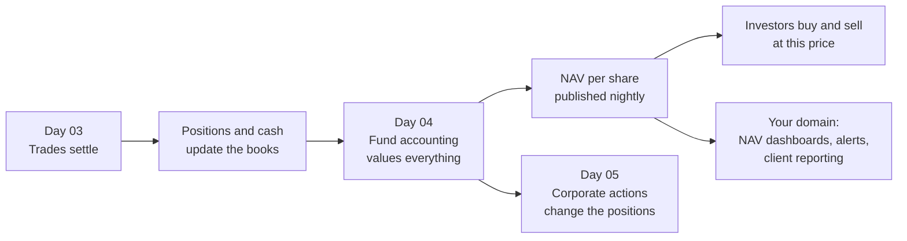
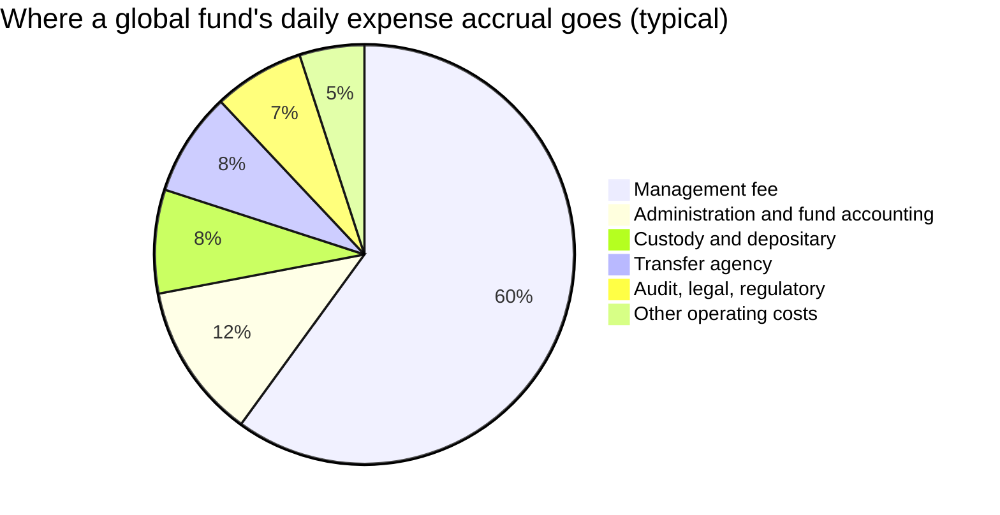
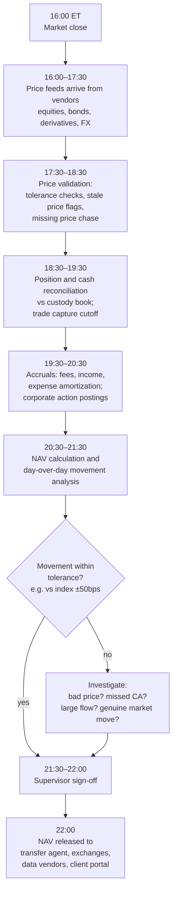
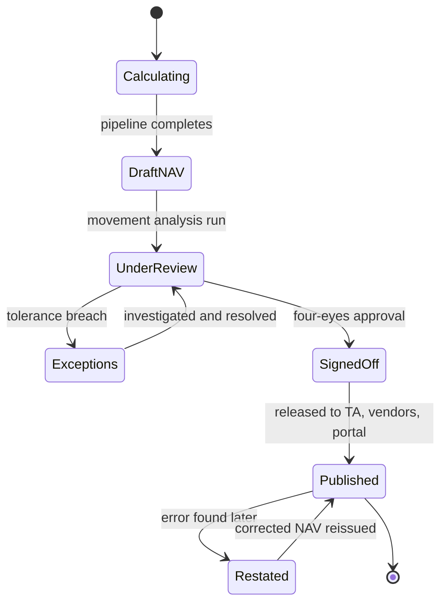
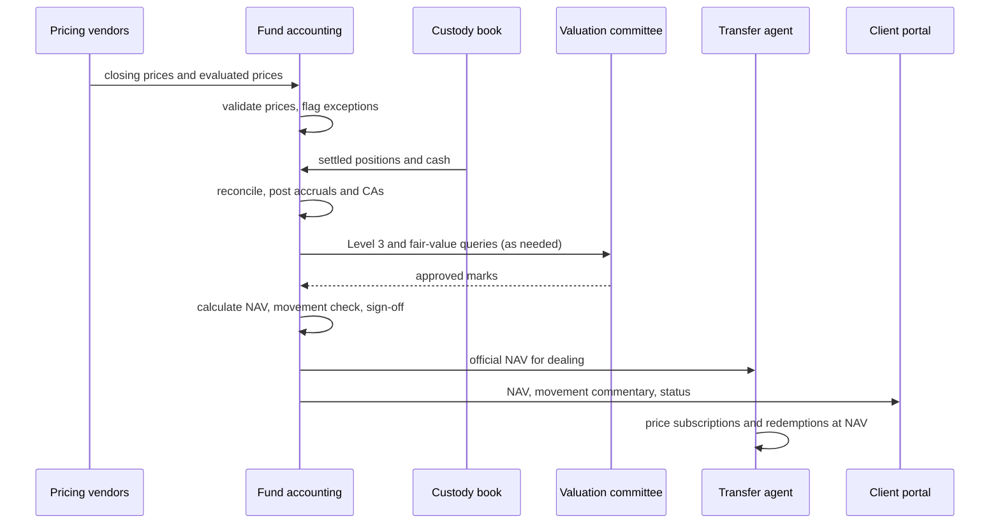

# Day 04 — Fund Accounting and NAV

> Week 1 · Securities Services and Asset Servicing · Est. reading time: 60–90 min

## 🎯 Learning objectives

By the end of today you can:

- Explain what fund accounting does, and how it differs from custody, transfer agency and middle office
- Compute a fund's NAV per share by hand from assets, liabilities, accruals and shares outstanding
- Walk the daily NAV production timeline, including pricing cutoffs and sign-off
- Explain the fair-value hierarchy (Level 1/2/3) and what happens when prices are stale or missing
- Describe how NAV errors happen, how materiality thresholds work, and what remediation costs
- Explain ETF creation/redemption mechanics and why iNAV exists
- Identify where a Digital Experience VP adds value in the NAV supply chain

## 🧭 Where this fits

Yesterday you settled trades. Today you learn what happens every evening after the market closes: the fund accounting engine turns thousands of positions, prices and accruals into a single number — the NAV per share — that investors transact on the next day. NAV is the custodian-administrator's most visible daily deliverable, and the one where errors are measured in compensation payments and headlines.

---

## Part 1 — Core concepts

### The four functions people confuse

Around every fund sits a cluster of service providers. Clients (and new VPs) constantly blur them, so fix the boundaries now:

| Function | Core question it answers | Book it maintains | Typical outputs |
|---|---|---|---|
| **Custody** | "Where are the assets and are they safe?" | Custody book (settled positions, cash) | Safekeeping, settlement, income collection |
| **Fund accounting** | "What is the fund worth?" | ABOR — Accounting Book of Record | Daily NAV, financial statements, expense accruals |
| **Transfer agency (TA)** | "Who owns the fund's shares?" | Shareholder register | Subscriptions, redemptions, investor records |
| **Middle office / IBOR** | "What does the portfolio manager think they hold, right now?" | IBOR — Investment Book of Record | Start-of-day positions, intraday cash, exposure |

**IBOR vs ABOR** is the distinction that will come up in every data conversation you have:

- **ABOR** (accounting book) is settled-position, end-of-day, audited truth. It is *late but right*. NAV comes from ABOR.
- **IBOR** (investment book) includes pending trades, projected cash and intraday events. It is *timely but provisional*. Portfolio managers trade off IBOR.

A number on a client dashboard must declare which book it came from. Showing an ABOR position labeled as "current holdings" at 11 a.m. — after the PM has traded all morning — is how you lose credibility with investment teams.

### What NAV actually is

$$\text{NAV per share} = \frac{\text{Total assets} - \text{Total liabilities}}{\text{Shares outstanding}}$$

Simple formula; the work is in the inputs. "Total assets" means every position priced at fair value, plus cash, plus receivables (dividends declared but unpaid, interest accrued, receivables from securities sold). "Liabilities" means payables, accrued expenses (management fees, audit fees, custody fees accrue *daily*), and distributions payable.

### A fully worked NAV

**Meridian Global Equity Fund — valuation date Tuesday, close of business:**

| Component | Amount (USD) |
|---|---|
| Equities (2,400 positions, priced at closing prices) | 1,842,300,000 |
| Cash and cash equivalents | 31,150,000 |
| Dividends receivable (declared, not yet paid) | 2,940,000 |
| Receivable for securities sold (unsettled sales) | 8,610,000 |
| **Total assets** | **1,885,000,000** |
| Payable for securities purchased (unsettled buys) | (11,200,000) |
| Accrued management fee (0.60% p.a., accrued daily) | (1,540,000) |
| Accrued other expenses (audit, custody, admin) | (760,000) |
| **Total liabilities** | **(13,500,000)** |
| **Net assets** | **1,871,500,000** |
| Shares outstanding | 62,383,333 |
| **NAV per share** | **$30.0001 → published as $30.00** |

Notice three things a layperson misses:

1. **Unsettled trades appear on both sides.** A bought-not-settled security is already *in* the priced positions, so the cash you owe for it is a payable. Get this wrong and NAV double-counts.
2. **Expenses accrue daily.** The management fee of 0.60% p.a. is charged as ~0.60%/365 of net assets *every single day*, so the NAV declines smoothly rather than dropping once a quarter. The sum of all annual expense accruals over average net assets is the **TER (total expense ratio)**.
3. **Rounding policy is a policy.** Publishing at 2 or 4 decimals, and how you round, is defined in the fund's prospectus. At scale, rounding is real money.

### The fair-value hierarchy

Every asset must be priced. Accounting standards (ASC 820 / IFRS 13) define a hierarchy by input observability:

| Level | Inputs | Examples | Who worries |
|---|---|---|---|
| **Level 1** | Quoted prices in active markets | Listed equities, on-the-run treasuries | Nobody, usually |
| **Level 2** | Observable inputs, not direct quotes | Most bonds (evaluated pricing), swaps, FX forwards | Pricing vendors, valuation teams |
| **Level 3** | Unobservable inputs; models and judgment | Private equity, distressed debt, exotic derivatives | Valuation committees, auditors, regulators |

The operational reality: pricing vendors (ICE, Bloomberg BVAL, Refinitiv) feed evaluated prices for Level 2; a **valuation committee** governs Level 3 marks and **fair-value adjustments** — e.g., when an Asia-Pacific fund strikes NAV at 4 p.m. New York but Tokyo closed 14 hours earlier, a fair-value model adjusts stale Asian closes for what happened in US markets since. Funds without fair-value pricing were historically arbitraged by "market-timing" traders — a real scandal genre of the early 2000s.

---

## Part 2 — The system deep dive

### The nightly NAV production cycle

NAV production is a **batch pipeline with hard external deadlines**. A typical US-domiciled fund's evening:

Key mechanics inside that pipeline:

- **Price tolerance checks**: every price is compared to yesterday's (e.g., flag moves >5% for equities, >2% for bonds) and to secondary sources. Exceptions go to a pricing analyst queue — this is one of the highest-volume exception workflows in the building.
- **The movement check**: the single best error catch. The fund's NAV return is compared to its benchmark's return; a 120bp deviation on a fund that tracks within 10bps means *something is wrong* — a fat-fingered price, a missed corporate action, an unbooked subscription.
- **Sign-off** is a controlled, auditable human gate. Four-eyes review, documented exceptions, timestamps. Regulators inspect this trail.

### The actors, in sequence

### NAV errors — the risk that defines the business

A **NAV error** is a published NAV that was wrong: bad price, missed accrual, missed corporate action, wrong FX rate, unbooked flow. What happens next is governed by **materiality thresholds** — commonly around 0.50% of NAV for equity funds (thresholds vary by jurisdiction and fund policy; Luxembourg's CSSF framework, for example, sets them by asset class).

- **Below threshold**: correct going forward, log it, no compensation.
- **Above threshold**: the fund must **reprocess** — recalculate every affected NAV, identify every investor who bought or sold at a wrong price, and **compensate** whoever lost (investors, or the fund itself). The administrator often pays when the error was theirs.

**Worked scenario:** an equity price feed drops a decimal on a large holding, overstating NAV by 0.9% for three days. Investors who *redeemed* during those days were overpaid by the fund — the administrator compensates the fund. Investors who *subscribed* overpaid — the fund (or administrator) compensates them. Add reprocessing labor, audit review, client explanation, regulator notification. A single decimal point becomes a seven-figure event plus a dented relationship. This is why pricing exceptions get four-eyes review at 6 p.m. every night.

### ETFs — the special case

ETFs trade intraday on exchange, but their NAV machinery is the same nightly process. What differs:

- **Creation/redemption in kind**: **Authorized Participants (APs)** exchange baskets of the underlying securities for large blocks of ETF shares ("creation units", e.g., 50,000 shares). Arbitrage between the ETF's market price and the basket's value keeps price ≈ NAV.
- **iNAV (indicative NAV)**: an intraday estimate of per-share value published every 15 seconds, so market makers can price against something during the day.
- **The custodian-administrator** runs the basket calculation (the daily published portfolio composition file), processes creations/redemptions, and strikes the official NAV.

For your world: ETF servicing is data-hungry and time-critical — basket files, iNAV feeds, AP portals for placing creation/redemption orders. It is one of the most "digital" corners of asset servicing.

---

## Part 3 — The VP lens

Where the Digital Experience VP actually touches NAV:

**1. NAV publication as a client-facing product.** Clients (fund boards, asset manager ops teams) want: today's NAV, its status (draft/signed-off/published/restated), day-over-day movement with attribution, and history. A **NAV dashboard with status and movement commentary** is a classic high-value, low-glamour product. The hard part is honesty about state: never show a draft NAV as final.

**2. Alerting on the NAV supply chain.** "NAV will be late tonight" is information clients currently get by phone. Productizing it — late-NAV alerts, pricing-exception volume signals, sign-off timestamps — converts ops chaos into client trust. (This connects to Day 12's notification platform.)

**3. Oversight tooling.** Asset managers who outsource fund accounting still must *oversee* it (regulators insist). They need shadow-NAV comparison views, exception dashboards, KPI packs (on-time NAV %, error counts, aging). If your clients oversee your own ops teams, your product is literally the lens they judge State Street through.

**4. The IBOR/ABOR labeling decision.** Every screen showing positions or valuations must state the book of record, the as-of time, and data freshness. This is a design-system-level decision you should standardize once, estate-wide.

Decisions and trade-offs you'll face:

| Decision | Tension | A defensible default |
|---|---|---|
| Show draft NAVs to clients? | Transparency vs risk of acting on unapproved numbers | Show with unmissable DRAFT state and no export |
| Real-time pricing-exception counts? | Openness vs exposing internal mess | Aggregate signal (on-track / at-risk / late), not raw queues |
| Restatement communication | Speed vs legal review | Templated, pre-approved comms flow with ops and legal |
| iNAV / intraday data on portal | Client delight vs licensing and infra cost | Business-case per client segment; ETF clients first |

Questions to ask your teams this week:

1. What is our on-time NAV publication rate, and where do clients see it?
2. When a NAV is restated, how does the client find out — system or phone call?
3. Do any of our screens show ABOR data without an as-of timestamp?
4. What's the current volume of "is the NAV out yet?" service inquiries we could deflect?

## 🏦 State Street context

State Street is one of the world's largest fund administrators — it services tens of thousands of fund NAV calculations across domiciles (US '40 Act funds, Luxembourg and Irish UCITS, Cayman alternatives). Representative realities that follow from that scale: NAV production runs in global follow-the-sun hubs; pricing exceptions and movement checks are worked by large operations teams in centers like Hyderabad and Kraków; and clients increasingly demand *oversight* products, not just the NAV itself. State Street's Alpha platform strategy (front-to-back servicing, with CRD on the front end) makes the IBOR/ABOR distinction commercially central: the pitch is one connected data spine from portfolio management through accounting. Digital experience sits exactly on that spine — the portals, dashboards and data feeds through which clients consume NAV, positions and oversight KPIs. (All public-knowledge or representative; verify internal specifics on the job.)

## 💪 Exercises

1. **Hand-crank a NAV.** Take the Meridian example and re-run it after: a $25M subscription hits (cash up, shares up at today's NAV), and one holding's price was corrected downward by $4M. What's the new NAV per share? What does the movement check show vs yesterday?
2. **Design the status model.** Sketch the states a NAV should expose on a client dashboard (calculating → draft → signed-off → published → restated) and write the one-line client-facing message for each state.
3. **Error post-mortem.** Write a 10-line incident narrative for the "dropped decimal" scenario: detection, threshold assessment, reprocessing, compensation, and the one product feature that would have caught it earlier.

## ❓ Self-check quiz

1. What is the difference between IBOR and ABOR, and which one feeds NAV?
2. Why do unsettled purchases appear as both an asset (position) and a liability (payable)?
3. What is a Level 3 asset and who governs its valuation?
4. A fund's NAV moved +1.4% on a day its benchmark moved +0.2%. Name three possible causes an analyst checks before sign-off.
5. What generally happens when a NAV error exceeds the materiality threshold?

Answers

1. IBOR (Investment Book of Record) is the timely, trade-date, intraday view portfolio managers use; ABOR (Accounting Book of Record) is the settled, end-of-day, audited book. **ABOR feeds NAV.**
2. The purchased security is already included in priced positions (asset side), but the cash hasn't left yet — so the amount owed is a payable (liability). Omitting the payable would double-count value.
3. An asset priced with unobservable, model-based inputs (private equity, exotic derivatives). A valuation committee governs the marks, with auditor and board scrutiny.
4. A wrong/stale price on a large holding; a missed or double-booked corporate action; an unbooked subscription/redemption or expense; (also legitimate: concentrated active positions genuinely diverging). The movement check exists to force this investigation.
5. The fund reprocesses affected NAVs, identifies investors who transacted at wrong prices, and pays compensation (to investors or the fund); the error is logged, reported to the board and often the regulator, and the responsible party (frequently the administrator) bears the cost.

## 🔑 Key takeaways

- NAV = (assets − liabilities) / shares — the formula is trivial; the **pipeline of prices, accruals and reconciliations** behind it is the product.
- ABOR is late-but-right; IBOR is timely-but-provisional. **Label the book of record on every screen.**
- The **movement check vs benchmark** is the single most effective NAV error catch.
- NAV errors above materiality thresholds trigger reprocessing and compensation — the economics of the whole administration business hinge on preventing them.
- Fair-value pricing (Levels 1/2/3, stale-price adjustment) is where judgment enters an otherwise mechanical process.
- ETFs bolt intraday machinery (APs, baskets, iNAV) onto the same nightly NAV core.
- Your leverage as Digital Experience VP: **NAV status transparency, late/restatement alerting, and oversight dashboards.**

## 📚 Going deeper

- ASC 820 / IFRS 13 fair-value measurement summaries (any Big-4 plain-English guide)
- CSSF Circular 24/856 (Luxembourg NAV error framework — the industry's reference regime)
- ICI (Investment Company Institute) publications on fund pricing and valuation practice
- "How ETFs work" primers from major ETF issuers (creation/redemption mechanics)

## Tomorrow

Day 05 tackles the most operationally dangerous area in custody: **corporate actions** — where a missed election on a rights issue can cost more than a year of servicing fees.
