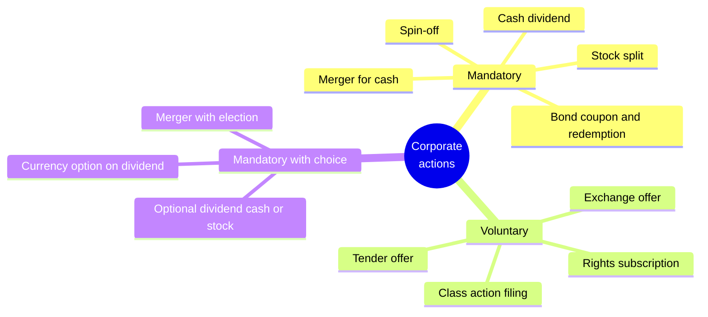
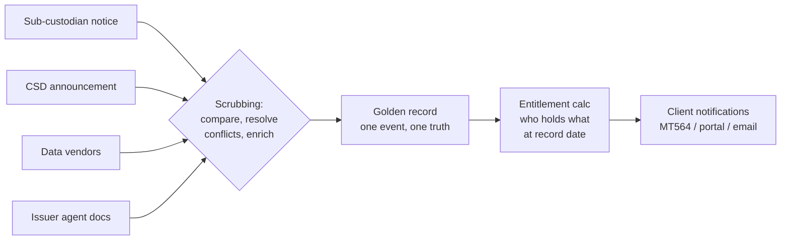
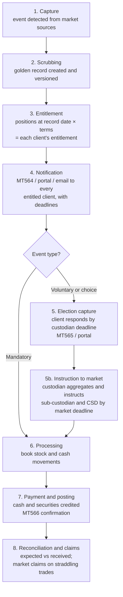
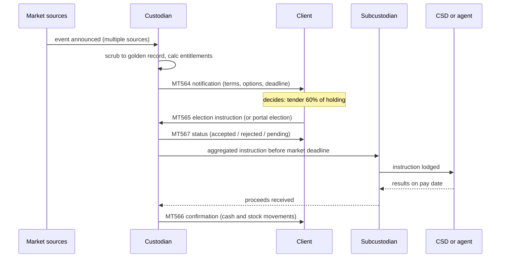

# Day 05 — Corporate Actions

> Week 1 · Securities Services and Asset Servicing · Est. reading time: 60–90 min

## 🎯 Learning objectives

By the end of today you can:

- Classify any corporate action as mandatory, voluntary, or mandatory-with-choice, and name examples of each
- Explain ex-date vs record date vs pay date, and compute who is entitled to what
- Walk the full event lifecycle: capture → scrubbing → entitlement → notification → election → instruction → payment → reconciliation
- Explain why corporate actions are custody's highest operational-risk area, with a realistic loss scenario
- Recognize the SWIFT MT564/565/566/567 message family and the ISO 20022 `seev` equivalents
- Identify the digital products that de-risk corporate actions: election portals, deadline alerting, golden-record transparency

## 🧭 Where this fits

Days 1–4 built the steady state: assets safekept, trades settled, NAV struck nightly. Corporate actions are where **issuers reach into that steady state and change it** — paying dividends, splitting shares, offering rights, tendering for stock. Every event touches positions (Day 2), can create trades and cash movements (Days 3 and 6), and must land correctly in NAV (Day 4). And uniquely, some events require the *client to decide something by a deadline* — which is why this is the most client-interactive, most digital-product-relevant corner of core custody.

---

## Part 1 — Core concepts

### The taxonomy that drives everything

| Type | Client must act? | Risk profile | Examples |
|---|---|---|---|
| **Mandatory** | No — it just happens | Processing risk only (book it right) | Cash dividend, split, coupon, redemption at maturity, cash merger |
| **Voluntary** | Yes — participation is optional | **Highest**: missed deadline = lost value | Tender offer, rights subscription, odd-lot buyback, class action |
| **Mandatory with choice** | Event happens; client picks the form | High: default applies if silent | Dividend with cash-or-stock option (scrip), merger with cash/share election |

The risk asymmetry is the whole story: a mandatory event booked a day late is an ops annoyance; a **voluntary tender at a 25% premium that a client never heard about is a compensable loss** — and the custodian's fault if the notification failed.

### The dates that determine entitlement

For a distribution (dividend), four dates matter:

| Date | Meaning |
|---|---|
| **Announcement date** | Issuer declares the event and its terms |
| **Ex-date** | First day the stock trades *without* the entitlement |
| **Record date** | Issuer snapshots the register: holders *on this date* get paid |
| **Pay date** | Cash or securities actually move |

In a T+1 settlement world, **ex-date = record date** for most markets (you must buy *before* ex-date to settle *by* record date). The classic trap is trades straddling ex-date: if you bought before ex-date but settlement fails past record date, you're entitled but not on the register — generating a **market claim** (the buyer claims the dividend from the seller). Claims processing is a permanent background industry inside every custodian.

**Worked example:** Client holds 1,000,000 shares of ACME. ACME declares $0.42/share dividend, ex-date June 10, record date June 10, pay date June 24. On June 9 the client sells 200,000 shares (regular way, settles June 10 — on record date, so buyer is on register? No: the *seller* still appears if settlement fails; if it settles, buyer is recorded). Cleanly settled: client is paid on 800,000 shares = $336,000, subject to withholding tax (say 15% treaty rate): net $285,600 credited on pay date, tax reclaim potential depending on client's domicile (Day 2's tax reclaim machinery).

### Why "scrubbing" exists

Event data arrives from **many conflicting sources**: the local sub-custodian, the CSD, data vendors, exchange notices, the issuer's agent. Terms differ in detail (rates, deadlines, options, conditions). **Scrubbing** is the process of comparing sources and compounding them into one **golden record** per event. Custodians and vendors compete on scrubbing quality because a wrong deadline in the golden record poisons every downstream notification.

---

## Part 2 — The system deep dive

### The event lifecycle, end to end

Two deadline layers deserve attention in step 5: the **market deadline** (when the CSD/agent must have instructions) and the **custodian deadline**, set *earlier* (often 1–2 days) to leave time for aggregation and transmission. Clients experience the custodian deadline; missing the gap between the two is an ops failure with the custodian's name on it.

### The election conversation, as messages

The SWIFT family, so you can follow any CA conversation:

| Message | Role |
|---|---|
| **MT564** | Notification — event terms, options, deadlines, entitlements (sent and re-sent on every terms change) |
| **MT565** | Instruction — the client's election |
| **MT566** | Confirmation — what was actually paid/delivered |
| **MT567** | Status — election accepted/rejected/processed |
| ISO 20022 | `seev.031` (notification), `seev.033` (instruction), `seev.036` (confirmation), `seev.034` (status) — richer, more structured successors |

### The risk that pays for everything

Corporate actions consistently top custody operational-loss tables. The canonical loss:

> **Scenario — the missed rights issue.** A client holds €80M of a European bank. The bank announces a deeply discounted rights issue: subscribe at 40% below market or your position is diluted ~15%. The event is voluntary; deadline in 12 business days. The MT564 goes out — to a queue the client's ops team doesn't monitor. Two reminder emails land in a shared inbox of someone on leave. The deadline passes; rights expire worthless (in some markets unexercised rights are auto-sold — in this one, not). Client's dilution loss: **~€12M**. The inquiry finds notifications were "sent" but never *seen*, and the custodian's default action was legally adequate and commercially catastrophic. Settlement: eight figures, split between custodian and client, plus a departed relationship.

Every control in this domain — scrubbing quality, deadline buffers, escalating reminders, response tracking, default-action policies — exists because of scenarios like this. Note what actually failed: not the pipeline, but the **last mile of human attention**. That last mile is a digital experience problem.

### Risk heat by event type

| Event | Volume | Value at risk per event | Deadline pressure | Net risk |
|---|---|---|---|---|
| Cash dividends | Very high | Low | None | Medium (volume × claims) |
| Splits / mandatory reorgs | Medium | Low–medium | None | Low–medium |
| Voluntary tenders | Low | **Very high** | **Hard deadline** | **High** |
| Rights issues | Low | **Very high** | **Hard deadline** | **Highest** |
| Choice dividends | Medium | Medium | Deadline with default | Medium–high |
| Class actions | Low | Medium (long tail) | Filing windows | Medium |

---

## Part 3 — The VP lens

Corporate actions are arguably the **single best domain for digital experience investment** in custody, because the residual risk is concentrated in notification, comprehension and response — your territory.

**Products that move the needle:**

1. **A CA event hub on the portal** — every event affecting the client's holdings, filterable, with the golden-record terms in readable English (not MT564 tag soup), entitlement amounts pre-computed, and documents attached.
2. **Election workflow** — respond online with validation (can't elect more than you hold), four-eyes approval *within the client's own team* (Day 11's entitlements), step-up authentication for high-value elections, immediate MT567-backed status.
3. **Deadline alerting with escalation** — reminders at T-5/T-2/T-1 to *widening audiences* (analyst → their manager → client's ops head) for unanswered voluntary events, across channels (Day 12). "Response rate before final reminder" becomes your KPI.
4. **Response-tracking transparency** — show clients *and* your own service teams the same view of who hasn't responded to what. Deflects the daily "have they elected?" phone traffic.

**Decisions you'll own:**

| Decision | Tension | Defensible default |
|---|---|---|
| Portal election vs MT565 only | Channel conflict (many clients are SWIFT-native) | Both; portal for the underserved mid-tier, status unified |
| Show scrubbing conflicts? | Transparency vs alarming clients | Show golden record + "terms updated" version history, not raw source conflict |
| Hard-block late elections online? | Client fury vs ops heroics risk | Block online past custodian deadline; route to service with clear SLA |
| Default-action display | Legal caution vs clarity | Always show "if you do nothing: X" in plain language — this line prevents lawsuits |

**Questions for your teams this week:** What % of voluntary-event elections arrive in the final 24 hours before deadline? What's our no-response rate and what happens then? How many "what does this event mean" service tickets per month? Can a client see election status in real time or do they call?

## 🏦 State Street context

At State Street's scale (custody across ~100+ markets), corporate actions means processing hundreds of thousands of events a year, scrubbed from sub-custodian, CSD and vendor feeds into a golden record, with large ops teams in global hubs working the exception and deadline queues. Representative platform realities: event data quality is a perennial investment theme; clients range from SWIFT-everything quant shops to mid-size asset owners who live entirely on the portal and email; and CA notification/election capability shows up in *every* custody RFP's digital section. The industry-wide move from MT to ISO 20022 `seev` messages is multi-year and coexistence is the norm — your products must render both eras of message into one client experience. (Public-knowledge/representative; verify internal specifics on the job.)

## 💪 Exercises

1. **Classify and compute.** ACME announces a scrip dividend: $0.30 cash or 1 new share per 80 held, default cash, record date July 1, election deadline June 24 (custodian: June 22). Your client holds 400,000 shares. Classify the event, compute both entitlement outcomes at a $26 share price, and state what happens if the client is silent.
2. **Redesign the notification.** Take a raw MT564 (find any example online) and rewrite its content as a portal event card: what are the 6 fields that must be above the fold?
3. **Post-mortem to product.** For the missed-rights-issue scenario, write the product requirements (5 bullet features) that would each independently have prevented the loss.

## ❓ Self-check quiz

1. What distinguishes mandatory-with-choice from voluntary events, and why do both carry deadline risk?
2. Why is ex-date effectively equal to record date under T+1?
3. What is scrubbing and why do custodians invest heavily in it?
4. Name the four SWIFT MT messages in the CA family and their roles.
5. Why is the custodian's client deadline earlier than the market deadline?

Answers

1. Mandatory-with-choice: the event definitely happens, the client only picks the *form* (a default applies if silent). Voluntary: participation itself is optional. Both risk value loss at a deadline — a bad default or a missed opportunity.
2. Because a trade must be executed before ex-date to settle (T+1) by record date; the settlement lag that used to separate the two dates has collapsed to one day.
3. Comparing and reconciling event terms from multiple conflicting sources (sub-custodians, CSDs, vendors, issuer agents) into one golden record. Every downstream notification, entitlement and election inherits the golden record's accuracy — bad scrubbing poisons everything.
4. MT564 notification (terms/deadlines), MT565 election instruction, MT566 confirmation of movements, MT567 election status.
5. The custodian needs time to validate, aggregate and transmit elections through the sub-custodian to the CSD/agent; the buffer absorbs processing and time-zone lag. Missing the gap between deadlines is the custodian's own operational failure.

## 🔑 Key takeaways

- The taxonomy (mandatory / voluntary / with-choice) *is* the risk model: deadlines and defaults are where money is lost.
- Entitlement flows from **record-date positions**; T+1 collapsed ex-date onto record date; failed straddling trades generate market claims.
- **Scrubbing to a golden record** is the unglamorous core competency of the whole domain.
- The canonical catastrophic loss is a **missed voluntary election** — and its root cause is almost always the last mile of notification and human attention, i.e., digital experience.
- MT564/565/566/567 (and ISO `seev.*`) are the message vocabulary; render them into human-readable products.
- Your highest-ROI products: event hub, online elections with team approvals, escalating deadline alerts, shared response tracking.

## 📚 Going deeper

- ISO 20022 `seev` message catalogue (iso20022.org) — read one `seev.031` schema to see event data structure
- SMPG (Securities Market Practice Group) corporate actions market practice documents
- DTCC and Euroclear corporate action processing guides
- Any annual industry operational-loss survey (corporate actions reliably near the top)

## Tomorrow

Day 06 follows the money: **SWIFT, payments and cash management** — the rails on which every dividend, settlement and redemption you've met this week actually moves.
