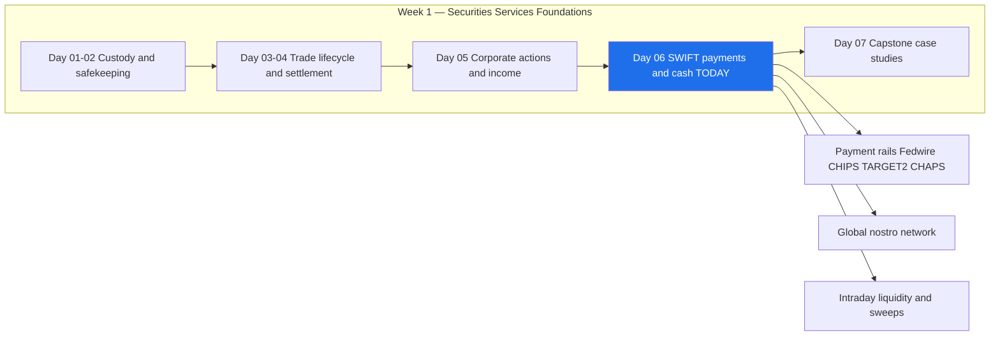
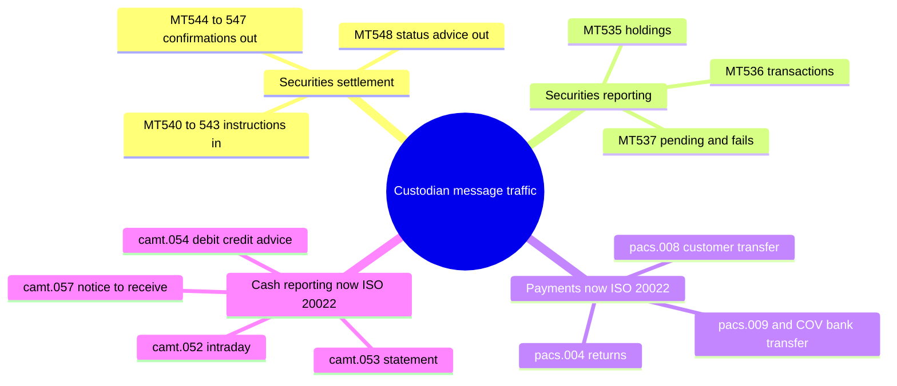
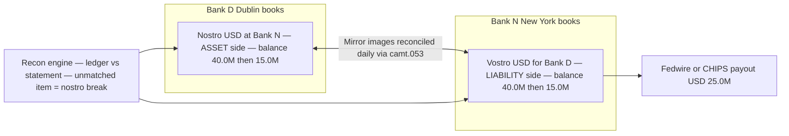
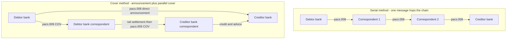
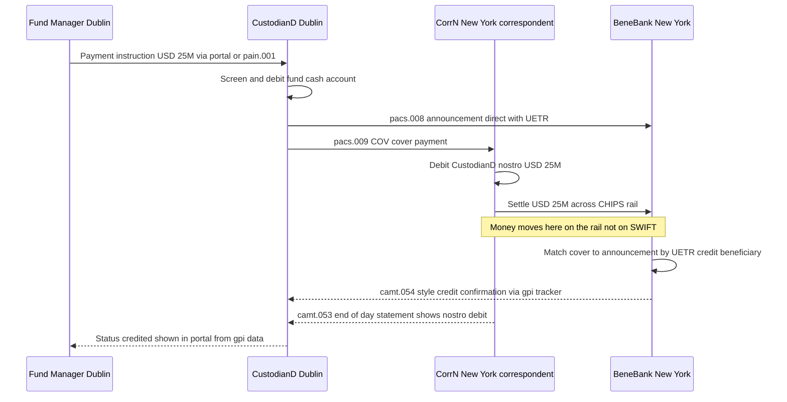
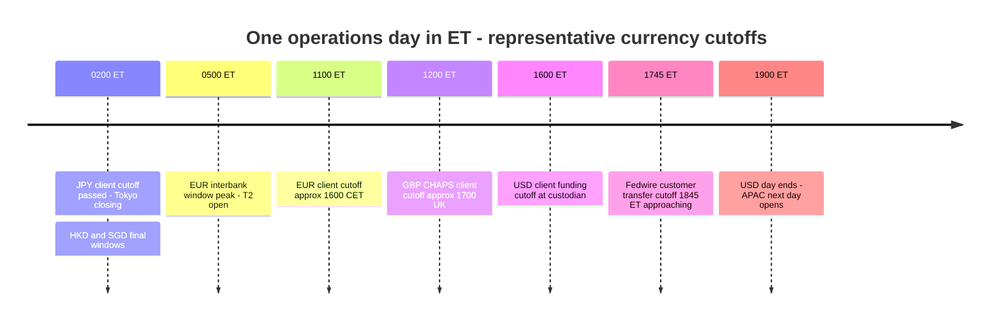
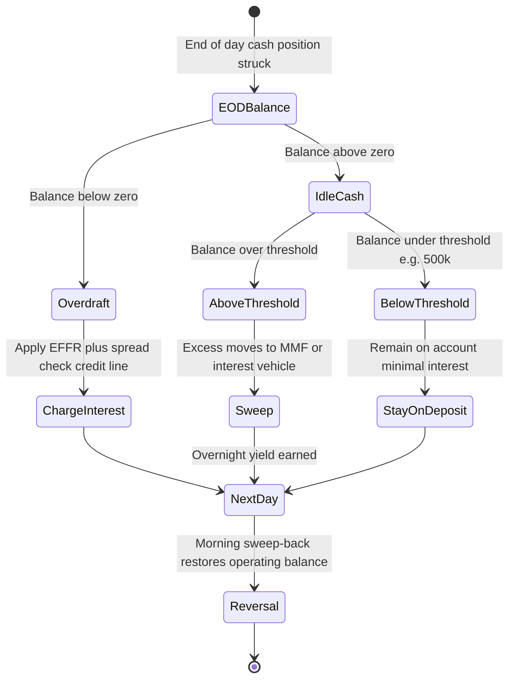

# Day 06 — SWIFT, Payments and Cash Management

> Week 1 · Securities Services Foundations · Est. reading time: 60–90 min

---

## 🎯 Learning objectives

By the end of today you can:

- Explain what SWIFT actually is (a cooperative messaging network and standards body) and what it is **not** (a settlement system), and describe FIN vs InterAct/FileAct and the role of the BIC.
- Read the MT and ISO 20022 (MX) message families a custodian lives on — MT540–548 for securities, MT9xx for cash, MT103/202 and pacs.008/pacs.009 for payments — and map MT to MX from memory for the ten messages that matter most.
- Walk a cross-border USD payment end to end: serial vs cover method, nostro debits and credits, the CHIPS/Fedwire leg, and where cut-off times bite.
- Explain nostro/vostro accounting with a numeric example and articulate why a global custodian runs a worldwide nostro network.
- Describe custody cash management: end-of-day sweeps, contractual vs actual income settlement, custody FX, overdraft economics, and BCBS 248 intraday liquidity monitoring.
- Bring the VP lens: decide where ISO 20022 data richness should live in your architecture, what payment status to expose to clients, and which metrics (STP rate, nostro breaks, funding misses) your digital experience should surface.

---

## 🧭 Where this fits

Days 01–05 covered what a custodian holds and how securities settle. Today is the **money side**: every settlement, income event, corporate action and fee from the past five days ultimately becomes a cash movement, and almost every cash movement between institutions is *instructed* over SWIFT and *settled* on a payment rail or across correspondent-bank books. SWIFT is the nervous system; the rails (Fedwire, CHIPS, TARGET2, CHAPS) are the muscles; the custodian's nostro network is the skeleton it all hangs on. Tomorrow's capstone ties the whole week into end-to-end case studies — you cannot follow the cash leg of any of them without today.



---

## Part 1 — Core concepts

### 1.1 What SWIFT actually is — and is not

SWIFT (the Society for Worldwide Interbank Financial Telecommunication, headquartered in La Hulpe, Belgium) is a **member-owned cooperative** that does two things:

1. **Runs a secure messaging network** connecting ~11,000+ financial institutions in 200+ countries.
2. **Acts as a standards body** — it maintains the MT message standard, is the registration authority for ISO 20022 and for ISO 9362 (the BIC), and coordinates market practice through bodies like the PMPG and, for securities, alongside SMPG.

Here is the sentence to internalize, because half the industry gets it sloppy:

> **SWIFT moves *instructions*, never money.** Money moves on payment rails (Fedwire, TARGET2) or across the books of correspondent banks. A SWIFT message is a very secure, very structured email that says "please debit X and credit Y." If the receiving bank never acts on it, no money has moved.

This distinction matters commercially. When a client asks "where is my payment?", the answer is almost never "stuck in SWIFT" — network delivery takes seconds. It is stuck in a bank's sanctions-screening queue, a repair queue, or waiting for a currency cut-off. Your digital experience must reflect *that* reality, not a cartoon of money flowing through pipes.

**The three channels:**

| Channel | What it is | Typical custody use |
|---|---|---|
| **FIN** | Store-and-forward messaging for MT messages; guaranteed delivery, non-repudiation | MT540–548 settlement traffic, MT103/202 payments (legacy), MT9xx cash reporting |
| **InterAct** | Real-time or store-and-forward exchange of XML (MX/ISO 20022) messages | pacs/camt CBPR+ traffic, real-time queries, T2S connectivity |
| **FileAct** | Bulk file transfer over the SWIFT network | Bulk payment files, holdings extracts, pricing files, regulatory reports |

**BICs (ISO 9362):** the Business Identifier Code is the network address — 8 or 11 characters: 4 (institution) + 2 (country) + 2 (location) + optional 3 (branch). Example shape: `SBOSUS33` would parse as institution `SBOS`, country `US`, location `33`. Routing a payment correctly is largely the art of putting the right BICs in the right fields — and a large share of manual payment repairs are, at root, BIC problems: a head-office BIC where a branch BIC was needed, a BIC not connected for the message type, or a BIC that changed after a merger and never got updated in a client's standing settlement instructions (SSIs).

**What the wire actually looks like.** It sharpens intuition to see both generations side by side. The essence of an MT payment field block:

```
:20:FUND2026071301          ← sender's reference
:32A:260715USD25000000,     ← value date, currency, amount in ONE field
:50K:/IE29AIBK93115212345678
GLOBAL UCITS FUND III
DUBLIN                      ← ordering customer, free text
:59:/021000021456789
CLEARING AGENT ACCOUNT
NEW YORK NY                 ← beneficiary, free text
:71A:OUR                    ← charges
```

The pacs.008 equivalent carries the same economics but as typed XML: `<IntrBkSttlmAmt Ccy="USD">25000000</IntrBkSttlmAmt>`, a dedicated `<Dbtr>` block with structured `<PstlAdr>` (street, town, country as separate elements), `<UETR>`, `<Purp><Cd>SECU</Cd></Purp>` and optionally thousands of characters of structured `<RmtInf>`. Same payment; one is a screen-scraper's guessing game, the other is a database row in flight. Everything strategic about the migration follows from that one contrast.

### 1.2 MT vs ISO 20022 (MX): the migration that just reshaped payments

The MT standard (MT = "message type") dates to the 1970s: compact, field-tagged, brutally terse. `:32A:260713USD25000000,` carries value date, currency and amount in one line. It served four decades but has three structural problems:

1. **Unstructured data.** Names and addresses live in free-text 4×35-character blocks. "1234 Main St, Attn: Sanctions Dept" and an actual sanctioned name look the same to a parser.
2. **Truncation.** Remittance information gets chopped at 140 characters; reconciliation data dies in transit.
3. **No native extensibility.** You cannot add structured LEIs, purpose codes, or tax data without abusing free-text fields.

**ISO 20022 (colloquially "MX")** is an XML-based standard with a shared data dictionary. The payments-relevant families:

- **pacs** ("payments clearing and settlement") — interbank: `pacs.008` (customer credit transfer), `pacs.009` (financial-institution credit transfer, with a COV variant for the cover method), `pacs.004` (payment return).
- **camt** ("cash management") — reporting: `camt.052` (intraday account report), `camt.053` (end-of-day statement), `camt.054` (debit/credit notification), plus `camt.056`/`camt.029` for cancellations and their resolutions.
- **pain** ("payments initiation") — corporate-to-bank: `pain.001` (credit transfer initiation).

**Why CBPR+ matters.** CBPR+ (Cross-Border Payments and Reporting Plus) is the usage-guideline set that defines exactly how ISO 20022 is used on the SWIFT network for cross-border payments. The business case is not cosmetic:

- **Structured party data** → materially better sanctions screening (fewer false positives; large banks report false-positive reductions in the 25–30% range when address fields are structured).
- **Richer remittance** → up to 9,000+ characters of structured remittance vs 140 in MT; invoice-level reconciliation becomes possible.
- **Analytics** → purpose codes, LEIs and structured references turn payment flows into a queryable dataset instead of parsing exercises.

**The timeline you must know:** MT/MX coexistence for cross-border payments began in March 2023 and **ended in November 2025**. As of that date, the in-scope interbank payment and cash-reporting MT messages (the Category 1, 2 and 9 messages covered by CBPR+ — MT103, MT202, MT202COV, MT900/910/940/950 interbank, etc.) were retired from FIN for bank-to-bank traffic; ISO 20022 is now the *only* language of cross-border interbank payments on SWIFT. Two big carve-outs:

- **Securities stays MT for now.** The 5xx series (MT540–548, MT535/536/537, MT564/566 corporate actions) continues on FIN. ISO 20022 exists for securities (the `sese`/`semt`/`seev` families, shaped by SMPG market practice and mandatory inside T2S), and a securities migration is on the horizon — but there is no forced end-date equivalent to Nov 2025 yet.
- **Bank-to-corporate traffic** (e.g., MT940 statements delivered to corporate treasuries under SCORE, or via non-SWIFT channels) can persist; the mandate bites *interbank* messaging.

And the rails moved with the network: **CHIPS migrated to ISO 20022 in April 2024** and **Fedwire cut over in a single-day big-bang in 2025**, joining TARGET2 (which re-platformed to the ISO-native T2 in March 2023) and CHAPS (June 2023). The significance for a custodian: the domestic leg and the cross-border leg of a payment now speak the same structured language end to end, so the old excuse — "the rail would truncate it anyway" — is gone. Data-rich in, data-rich through, data-rich out is now the physically available default; preserving it is an internal-systems choice.

If you joined payments technology in 2024–2025, you lived this migration. If you are joining custody in 2026, you inherit its aftermath: dual-format archives, translation layers built during coexistence (many banks ran MX-in, MT-out translation into legacy cores — with documented truncation risk when the rich message would not fit the old fields), and the SWIFT **Transaction Manager**, which maintains a central "golden copy" of each transaction's full ISO data so that a data-poor hop cannot permanently destroy data for the hops after it. The strategic residue for a product leader: the *network* now guarantees rich data end to end; whether *your* systems keep or squander it is a local architecture choice — which is exactly Decision 1 in Part 3.

### 1.3 The message families a custodian lives on

A global custodian's SWIFT traffic is dominated by a surprisingly short list. Learn this table cold — it is the vocabulary of every operations conversation you will have.

| Message | Direction (typical) | What it does |
|---|---|---|
| **MT540/541** | Client → custodian | Receive free / **receive vs payment** settlement instruction |
| **MT542/543** | Client → custodian | Deliver free / **deliver vs payment** settlement instruction |
| **MT544–547** | Custodian → client | Confirmations of the four above (544 confirms 540, 545 confirms 541, etc.) |
| **MT548** | Custodian → client | Settlement **status and processing advice** — matched, unmatched, pending, failed, with reason codes |
| **MT535** | Custodian → client | **Statement of holdings** (positions) |
| **MT536** | Custodian → client | **Statement of transactions** |
| **MT537** | Custodian → client | **Statement of pending/failed transactions** |
| **MT103** | Bank ↔ bank (now pacs.008) | **Customer** credit transfer — ultimate debtor/creditor are not banks |
| **MT202** | Bank ↔ bank (now pacs.009) | **FI-to-FI** credit transfer — bank treasury moves, cover payments |
| **MT202COV** | Bank ↔ bank (now pacs.009 COV) | Cover payment carrying underlying customer details (post-2009 transparency rule) |
| **MT210** | Bank → bank (now camt.057) | **Notice to receive** — "expect funds into my account today" |
| **MT900/910** | Account servicer → owner (now camt.054) | **Confirmation of debit / credit** — single-movement advices |
| **MT940/950** | Account servicer → owner (now camt.053) | **End-of-day statement** (940 with narrative, 950 without) |
| **MT942** | Account servicer → owner (now camt.052) | **Interim/intraday** transaction report |

Two reading habits worth building: (1) the tens digit tells the family — 54x is securities settlement, 9xx is cash; (2) instructions flow *in* to the custodian, confirmations and statements flow *out*.



### 1.4 MT → MX mapping table

The mapping every architect and BA on your teams should have pinned above their desk:

| MT (legacy FIN) | ISO 20022 (MX) | Family | Status after Nov 2025 |
|---|---|---|---|
| MT103 | **pacs.008** | Customer credit transfer | MX only (interbank) |
| MT202 | **pacs.009** (core) | FI credit transfer | MX only (interbank) |
| MT202COV | **pacs.009 COV** | Cover payment | MX only (interbank) |
| MT103/202 return | **pacs.004** | Payment return | MX only (interbank) |
| MT192/292 + MT196/296 | **camt.056 / camt.029** | Cancellation request / resolution | MX only (interbank) |
| MT210 | **camt.057** | Notice to receive | MX only (interbank) |
| MT900 / MT910 | **camt.054** | Debit / credit notification | MX interbank; MT persists to some corporates |
| MT940 / MT950 | **camt.053** | End-of-day statement | MX interbank; MT persists to some corporates |
| MT942 | **camt.052** | Intraday report | MX interbank; MT persists to some corporates |
| MT540–543 | **sese.023** | Settlement instruction | Still MT on FIN (ISO in T2S) |
| MT544–547 | **sese.025** | Settlement confirmation | Still MT on FIN |
| MT548 | **sese.024** | Settlement status advice | Still MT on FIN |
| MT535 / MT536 / MT537 | **semt.002 / semt.017 / semt.018** | Holdings / transactions / pending-fails statements | Still MT on FIN |

### 1.5 Correspondent banking: nostro and vostro

No bank holds accounts at every other bank in every currency. Instead, banks hold accounts **with each other**:

- **Nostro** ("ours"): *our* account held *at another bank*, in their currency. On our books it is an **asset** ("due from banks").
- **Vostro** ("yours"): the mirror image — an account *another bank holds with us*. On our books it is a **liability** ("due to banks").

The same physical account is a nostro to one party and a vostro to the other. **Numeric example:**

> Custodian Bank D (Dublin) holds a USD account at Correspondent Bank N (New York) with a balance of **USD 40,000,000**.
>
> - **Bank D's ledger:** asset — "Nostro USD at Bank N: 40,000,000 Dr balance."
> - **Bank N's ledger:** liability — "Vostro USD for Bank D: 40,000,000 Cr balance."
>
> Bank D now pays USD 25,000,000 to a third party. Bank N debits the vostro (liability falls to 15,000,000) and pays out via Fedwire/CHIPS. Bank D's nostro ledger shows the mirrored entry: asset falls to 15,000,000. Every night, Bank D's reconciliation engine compares its **internal ledger** against Bank N's **camt.053 statement**. Any line that doesn't pair off is a **nostro break** — the single most watched operational metric in cash operations.



**Why a custodian runs a global nostro network.** A custodian like State Street settles securities in 100+ markets and must pay and receive in each local currency, before each local cut-off, every business day. That means either (a) direct membership of the local rail plus a central-bank account (feasible in a handful of home markets), or (b) a nostro at a well-chosen local correspondent/subcustodian in every other market. The nostro network *is* the custodian's cash plumbing: its cut-off times, credit lines and reconciliation quality set the physical limits on everything the front-end promises clients.

### 1.6 Payment rails: the comparison table

| Rail | Currency | Settlement model | Operating window (approx.) | Typical custody use |
|---|---|---|---|---|
| **Fedwire** | USD | RTGS (gross, central bank money, final on execution) | ~21:00 prior day – 19:00 ET (final customer cutoff ~18:45) | Large-value USD legs, DTC funding, Fed-eligible securities cash |
| **CHIPS** | USD | Netting with prefunding — continuous multilateral netting, finality intraday | ~21:00 prior day – 17:00 ET release | Cross-border correspondent USD; ~95% of cross-border USD value |
| **TARGET2 / T2** | EUR | RTGS (Eurosystem) | 02:30 – 18:00 CET (customer cutoff 17:00 CET) | EUR settlement, T2S cash legs (DCA accounts) |
| **CHAPS** | GBP | RTGS (Bank of England) | 06:00 – 18:00 UK (customer cutoff earlier) | GBP settlement, London market cash |
| **ACH (US)** | USD | Deferred net settlement, batch | Batch windows; same-day ACH cutoffs intraday | Low-value: fees, dividends to retail-adjacent accounts |
| **SEPA SCT / SDD** | EUR | Batch DNS via clearing (e.g., EBA STEP2) | Multiple daily cycles | Low-value EUR, fee collection (SDD) |
| **FedNow / RTP** | USD | Instant, 24×7×365, prefunded/real-time final | Always on | Emerging: real-time client cash movement expectations |
| **SEPA Instant (SCT Inst)** | EUR | Instant, 24×7, ≤10 seconds | Always on | Same — and EU regulation now mandates reachability |
| **UPI (reference)** | INR | Instant retail overlay on IMPS/NPCI | Always on | Reference point for what "instant at scale" looks like — 15bn+ txns/month |

**RTGS vs DNS in one breath:** RTGS (real-time gross settlement) settles each payment individually and finally in central-bank money — zero credit risk, high liquidity demand. DNS (deferred net settlement) nets obligations and settles the net — liquidity-efficient, but requires risk controls (CHIPS answers with prefunded balances, making it a hybrid with intraday finality). The instant rails are RTGS-like finality at retail speed, 24×7 — which is precisely why they stress bank liquidity and ops models built around a "banking day."

### 1.7 Cash management in custody

Custody cash is a product in its own right. Five mechanisms to know:

1. **End-of-day sweeps.** Client cash sitting idle overnight earns little and consumes the custodian's balance sheet (deposits attract capital and LCR costs). Automated sweeps move end-of-day balances above a threshold into money market funds or interest-bearing vehicles, and reverse the next morning. *Example:* a fund's USD account ends the day at 12,400,000 with a 500,000 operating threshold → 11,900,000 sweeps to a government MMF at ~4.9% (vs 0–1% on uninvested balances). One night's difference: 11,900,000 × (4.9% − 0.5%) / 360 ≈ **USD 1,454** — per account, per night. Across thousands of accounts this is a nine-figure annual revenue/cost conversation.
2. **Contractual vs actual settlement of income.** Under *contractual* income, the custodian credits dividends/coupons on pay date regardless of whether the cash has actually arrived from the market — a client-experience feature that is economically a short-term credit extension (typically with right of reversal). *Actual* settlement credits only on receipt. Which markets get contractual treatment is a credit-risk and product decision. *Example:* a fund is due a USD 3,000,000 coupon on pay date Monday; the paying agent in an emerging market actually remits Thursday. Contractual settlement means the fund had use of the cash three days early — worth 3,000,000 × 4.9% × 3/360 ≈ **USD 1,225** to the fund and a three-day, USD 3M credit exposure to the custodian, per event, across tens of thousands of income events a year. That is why contractual settlement is offered market-by-market (reliable markets yes, chronically late markets no) and why the entitlement engine feeding it must be excellent: every wrong contractual credit is a real reversal hitting a client's cash ledger.
3. **Overdrafts and credit lines.** Settlement timing mismatches make intraday and overnight overdrafts routine. They are priced (commonly a spread over the reference rate, e.g., Fed funds/EFFR + 100–200bp for overnight) and capped by credit lines. Uncommitted, repayable on demand — but operationally the grease of settlement.
4. **FX for funding settlement.** A EUR-based fund buying USD securities needs USD. Options: **custody FX / standing instructions** (the custodian auto-converts at a published benchmark-plus-spread — convenient, historically expensive, now heavily disclosed after industry litigation in the early 2010s) vs **competitive FX** (the manager deals with third-party banks and the custodian just moves cash — cheaper, but *the client owns the cut-off risk*). This trade-off drives Worked Example 2.
5. **Intraday liquidity (BCBS 248).** Since 2013, regulators require banks to monitor intraday liquidity usage. Key monitoring metrics:

| BCBS 248 metric | What it measures | Why the VP cares |
|---|---|---|
| Daily maximum intraday usage | Largest net negative position on the day | Sizes the intraday credit the bank must hold against |
| Available intraday liquidity at start of day | Central bank balances, eligible collateral, committed lines | The buffer against the above |
| Total payments (gross in/out) | Volume context | Denominator for throughput |
| Time-specific obligations | Payments that MUST settle by a set time (CLS pay-ins, DTC settlement) | Missing these is a reportable event |
| Throughput | % of outgoing value settled by hour (e.g., by 12:00) | Regulators dislike banks that hoard liquidity and pay late |

---

## Part 2 — The system deep dive

### 2.1 Worked example 1 — a USD 25M cross-border payment, end to end

**Scenario.** A Dublin-domiciled UCITS fund is buying USD 25,000,000 face of US Treasuries (settlement details tomorrow's capstone; today we follow the cash). The fund's account is with its global custodian in Dublin ("CustodianD"). The fund manager instructs a USD 25,000,000 payment to the fund's clearing agent account at a US bank ("BeneBank") to pre-fund the purchase.

**Serial vs cover — the one design choice in correspondent payments:**

- **Serial method:** a single customer payment (pacs.008, née MT103) hops bank-to-bank along the correspondent chain; each bank passes the full message on.
- **Cover method:** the customer message (pacs.008) goes **directly** debtor-bank → creditor-bank as an announcement, while the actual money moves through correspondents via a parallel FI transfer, **pacs.009 COV** (née MT202COV), which since 2009 must carry the underlying customer details for sanctions transparency.

Our example uses the **cover method** — typical when the two endpoint banks know each other but don't hold accounts with each other.



The trade-off: serial is simpler but each intermediary sees and processes the full customer payment (fees and delay per hop); cover is faster to announce and lets the endpoint banks reconcile by UETR, but creates a matching problem — the creditor bank must pair announcement with cover before crediting, and mismatches spawn investigations.

**The clock (all times 2026-07-13):**

| Time | Event | Message / rail |
|---|---|---|
| 09:30 Dublin (04:30 ET) | Fund manager instructs payment via portal/API (or pain.001) | Instruction into CustodianD |
| 09:42 Dublin | CustodianD validates, screens, debits fund's USD cash account 25,000,000 | Internal ledger |
| 09:45 Dublin | CustodianD sends announcement **pacs.008** direct to BeneBank; sends **pacs.009 COV** to its US correspondent "CorrN" | SWIFT InterAct, gpi UETR attached |
| 08:05 ET | CorrN screens, debits CustodianD's **nostro** 25,000,000 | Vostro debit on CorrN books |
| 08:07 ET | CorrN pays BeneBank across **CHIPS**; CHIPS nets and finality attaches intraday | CHIPS (had BeneBank required central-bank money, Fedwire instead) |
| 08:09 ET | BeneBank receives cover, matches to the pacs.008 announcement by UETR, credits the clearing agent account | camt.054 credit advice out |
| 08:10 ET | gpi tracker shows end-to-end status "credited" — 3h40m after instruction, most of it time-zone wait | gpi / tracker API |
| EOD | CorrN issues **camt.053** showing the 25,000,000 debit; CustodianD recon matches it to its ledger | Statement recon |

Note what did *not* happen: no money "moved through SWIFT." Money moved twice — once on CorrN's books (vostro debit), once on CHIPS (CorrN → BeneBank). SWIFT carried five instructions and advices. The **UETR** (Unique End-to-end Transaction Reference, a UUID mandated on all payments since 2018 under SWIFT gpi) is what lets everyone — including your client portal — track the payment across all hops.



**Failure modes on this path** (each is a product-experience moment): sanctions hit → payment parked in screening queue, hours–days; wrong/closed beneficiary account → **pacs.004** return, often minus lifting fees; missed CHIPS/Fedwire cutoff → value date rolls a day, interest claim risk; cover and announcement mismatch → BeneBank sits on funds pending investigation (**camt.056** cancellation/inquiry traffic).

### 2.2 Worked example 2 — a securities settlement's cash leg, and the cost of missing a cut-off

**Scenario.** The same fund now settles the actual purchase: **MT541** (receive vs payment) instructing CustodianD's US subcustodian/agent to receive USD 46,600,000 of US Treasuries at DTC/Fed against payment on 2026-07-15 (T+1 conventions covered Day 03; assume settlement date is the 15th).

- The fund's base currency is **EUR**; it holds only ~USD 2,000,000. It needs ~USD 44,600,000 more.
- The manager chose **competitive FX** (not the custodian's standing instruction), dealing EUR/USD with a third-party bank: sell EUR 41,860,000, buy USD 44,600,000 at 1.0655, value 2026-07-15.
- The FX counterparty must pay USD into the fund's account at CustodianD **before the USD funding cut-off** so the custodian will release the settlement.

**Projected vs actual cash.** On the morning of the 15th, CustodianD's cash projection for the fund's USD account:

| Item | Amount (USD) |
|---|---|
| Opening balance | +2,000,000 |
| Projected FX inflow (competitive FX) | +44,600,000 |
| MT541 settlement debit at DTC | −46,600,000 |
| **Projected end-of-day** | **0** |

**The miss.** The FX counterparty's payment desk fat-fingers the beneficiary BIC; the repair loops past CustodianD's **16:00 ET USD client funding cut-off**. The custodian faces a choice: fail the securities settlement (fund loses the T+1 settlement, potential fail costs and, in other markets, CSDR-style penalties) or settle and let the fund run an **overnight overdraft**. Credit line covers it; they settle.

**Overdraft math:**

- Overnight overdraft: USD **44,600,000** (46,600,000 debit − 2,000,000 held).
- Pricing: EFFR + 150bp. Assume EFFR = 4.33% → all-in **5.83%**.
- One-day cost (ACT/360): 44,600,000 × 0.0583 × 1/360 = **USD 7,222**.
- Had the repair taken three days (weekend): 44,600,000 × 0.0583 × 3/360 = **USD 21,666**.
- The fund claims the cost from the FX counterparty via an **interest claim** — a well-worn back-office process that your ops teams spend real hours on.

Compare: the custodian's standing-instruction FX would have cost perhaps 5–10bp of spread on EUR 41.86M ≈ USD 22,000–44,000 — but with *zero* funding-cut-off risk, since the custodian nets it internally. This is the real trade-off behind "custody FX vs competitive FX," and a numerically literate product team can show clients exactly where the crossover sits.

### 2.3 The global cut-off day

A custodian's operations day is a westward-marching sequence of currency cut-offs. A client instruction that is "same-day" for USD at 14:00 ET is two days too late for JPY. Your portal and APIs must make this brutally clear at the point of instruction — the single cheapest fix for funding misses.



(Exact times vary by bank, client tier and channel; treat these as representative. Internally, every custodian maintains a per-currency, per-client **cut-off matrix** — and whether that matrix is exposed as data in your APIs or buried in a PDF is a genuine digital-experience differentiator.)

### 2.4 End-of-day sweep logic



The sweep engine's inputs are exactly the messages from Part 1: intraday positions from camt.052/MT942, final positions from camt.053/MT940, and projected movements from the settlement systems (MT548 statuses tell you which projected debits are real). A sweep engine running on stale or unreconciled data sweeps cash it doesn't have — and manufactures overdrafts.

Two design subtleties that separate good sweep products from lawsuits waiting to happen:

- **Projected-movement awareness.** Sweeping tonight's 12.4M when a 46.6M settlement debit hits at 08:00 tomorrow, before the reversal posts, creates a synthetic overnight-into-morning overdraft. The engine must net *known next-day obligations* (matched MT541s, pending FX value dates) against sweepable balance — which is why sweep logic belongs architecturally beside the cash projection engine, not beside the ledger.
- **Cut-off ordering.** The sweep must run *after* the last credit that can arrive with today's value and *before* the sweep vehicle's own subscription cut-off. For a USD government MMF that window can be under an hour. Every currency has its own version of this squeeze, which is why sweep timing is configured per currency, per vehicle — data your product should expose, not bury.

### 2.5 SWIFT gpi and the UETR: how tracking actually works

Before 2017, "where is my payment" was answered by phone calls between banks' investigations teams, at a cost the industry estimated in the tens of dollars per inquiry. SWIFT gpi (global payments innovation) changed the mechanics:

- **UETR** — every payment carries a 36-character UUID, generated at origination and preserved unchanged across every hop, translator and rail. It is the primary key of the payment's life.
- **Tracker** — a central SWIFT database records each hop's confirmations (received, forwarded, credited, rejected), fee deductions and FX conversions, keyed by UETR.
- **Confirmations are mandatory** — since universal confirmations rules, beneficiary banks must confirm credit (or rejection) to the tracker, typically within a business day, so the chain has an authoritative end state.
- **APIs** — banks query and expose tracker data programmatically (`GET /payments/{uetr}/transactions` in shape), which is what makes portal-grade tracking a straightforward build rather than a bilateral data project.

| gpi status (conceptual) | Meaning | What your portal should say |
|---|---|---|
| ACCC | Accepted, settlement completed on creditor side | "Delivered — credited to beneficiary at 08:09 ET" |
| ACSP | Accepted, in process at an intermediary | "In transit — with correspondent bank" |
| RJCT | Rejected by a party in the chain | "Returned — reason and next steps" |
| Pending cover | Announcement received, cover not yet matched | "Arriving — beneficiary bank awaiting funds" |

The product insight: the data to answer the number-one client question already exists, centrally, in structured form. The only open questions are whether your experience consumes it, how you translate status codes for each persona, and whether you *push* exceptions ("payment rejected at 08:12, here is why") instead of waiting for the client to ask.

### 2.6 Where it breaks: the failure-mode inventory

| Failure mode | Detected by | Cost driver |
|---|---|---|
| Nostro break (ledger ≠ statement) | camt.053 reconciliation | Investigation FTE, undetected fraud/loss risk |
| Funding miss (client cash late) | Projected-vs-actual monitor, MT210/camt.057 unmatched | Overdraft interest, failed settlement, interest claims |
| Sanctions/screening queue | Screening system | Delay, client escalation, regulatory exposure |
| Truncated remittance (MT legacy, or MX→MT translation at a laggard bank) | Client reconciliation complaints | Manual repair, client dissatisfaction |
| Missed time-specific obligation (CLS pay-in, DTC settlement) | BCBS 248 monitoring | Regulatory report, reputational |
| Duplicate payment (resend without UETR check) | UETR/duplicate detection | Recovery effort, counterparty credit risk |

---

## Part 3 — The VP lens

You own digital experience for a business whose cash layer just finished the biggest messaging migration in 50 years. Real decisions on your desk:

### Decision 1 — ISO 20022-native data model vs translate-at-the-edge

- **Translate at the edge:** keep internal systems on MT-shaped data; convert pacs/camt to MT-like structures at the boundary. Cheap now; but you *permanently truncate* the structured data (140-char remittance again), which forfeits the entire analytics and screening upside — and you will pay to undo it.
- **ISO-native core:** model cash movements internally on the ISO 20022 dictionary (parties, structured addresses, purpose codes, UETR as a first-class key). More upfront cost, but your portal can then show clients *exactly* what the richest message carried, and every downstream product (forecasting, analytics, virtual accounts) inherits clean data.
- **Opinion:** for anything client-facing built after 2023, ISO-native is the only defensible answer; translation layers are for legacy internals with a decommission date attached. Ask any team proposing translation for the *end date* of the translator.

### Decision 2 — expose raw SWIFT statuses or curated statuses in the portal?

MT548/sese.024 reason codes and gpi statuses are precise but hostile (a client should never have to google `PEND//CMON`). Curated statuses ("Awaiting your funding — USD cut-off 16:00 ET") are humane but lossy for sophisticated ops teams at asset managers. **Resolution:** layered disclosure — curated status as the default, raw ISO/gpi codes one click deeper, and both available via API so power clients can build their own logic. The mistake is picking one layer for all personas.

### Decision 3 — payment tracking: API-first with gpi UETR

Every payment carries a UETR; SWIFT gpi exposes tracker APIs. The product question is whether your client experience treats "where is my money" as a support ticket or a self-service query. Building UETR-keyed tracking into portal and API kills a top-3 inquiry category. Measure it: inquiries-per-1,000-payments before and after.

### Decision 4 — how much cash intelligence to productize

You sit on projected vs actual cash, cut-off matrices, sweep results, FX flows. Each is a potential client-facing product (intraday cash dashboards, funding-risk alerts — "your FX inflow for tonight's DTC settlement has not arrived and the cut-off is in 90 minutes"). That single alert, priced against Worked Example 2's USD 7,222 overdraft, is a self-evidently valuable feature. Prioritize alerts that map to computable dollar losses.

### Metrics that matter

| Metric | Definition | Healthy shape |
|---|---|---|
| Payments STP rate | % of payments processed with zero manual touch | High 90s; every point below is FTE and delay |
| Nostro breaks | Open unreconciled items by age and value | Aged >5 days trending to zero |
| Funding misses | Settlements requiring unplanned overdraft | Falling; each has a dollar cost you can compute |
| Cut-off proximity | % of client instructions arriving <30 min before cut-off | Falling — a UX metric in disguise |
| Inquiry rate | "Where is my payment/cash" tickets per 1,000 transactions | Falling as self-service tracking lands |
| Throughput (BCBS 248) | % of value paid out by 12:00 local | Steady; treasury owns it, your data feeds it |

### Stakeholder map

| Stakeholder | What they want from you |
|---|---|
| Cash/payments operations | Fewer manual repairs; screens that expose ISO data, not truncate it |
| Treasury / liquidity management | Accurate projected cash; intraday feeds for BCBS 248 |
| Network management (nostro/agent banks) | Cut-off and agent data mastered once, consumed everywhere |
| Compliance / sanctions | Structured party data end to end; no free-text laundering of fields |
| Client service | Curated statuses and tracking so tickets close themselves |
| Asset-manager clients' ops teams | APIs: camt.053/052 delivery, UETR tracking, cut-off matrices as data |

### Decision 5 — instant rails and the "banking day" assumption

FedNow, RTP and SEPA Instant are small in custody flows today, but they reset client expectations: a portfolio manager who moves personal money in 5 seconds will not accept "USD cut-off was 16:00, try tomorrow" forever without at least understanding *why*. You cannot unilaterally make DTC settle at midnight — but you can (a) stop building new features that hard-code a single daily cycle, (b) design status models around events rather than end-of-day batches, and (c) pilot instant rails for the flows you do control, like fee collection and client cash returns. The trap to avoid: spending instant-payments budget on flows where the binding constraint is the market's settlement cycle, not your plumbing.

### The trade-off summary

| Decision | Cheap-now option | Right-long-term option | Forcing question |
|---|---|---|---|
| Data model | Translate MX to MT-shaped internals | ISO 20022-native core | "What is the translator's decommission date?" |
| Status display | One status vocabulary for everyone | Layered: curated default, raw codes on demand, both in API | "Which persona did we design this for?" |
| Payment tracking | Support tickets | UETR self-service in portal and API | "Inquiries per 1,000 payments — trending which way?" |
| Cash intelligence | Reports after the fact | Real-time funding-risk alerts priced in dollars | "What did funding misses cost clients last quarter?" |
| Instant rails | Ignore until material | Event-driven design now, targeted pilots | "Where is the constraint really the market, not us?" |

### Questions to ask your teams in week one

1. What is our payments STP rate, and what are the top three repair reasons by volume?
2. Where do we translate MX→MT internally today, and what is the decommission date for each translator?
3. Can a client see a UETR-tracked payment status in the portal without calling anyone? Via API?
4. How is the cut-off matrix mastered — data or documents? Who consumes it programmatically?
5. What was our aged nostro-break count and total funding-miss cost last quarter, in dollars?
6. When ISO 20022 securities migration firms up, are we edge-translating again or going native?

---

## 🏦 State Street context

*(Public-knowledge and representative framing.)*

- **Scale user of SWIFT.** State Street, custodian of roughly USD 40+ trillion in assets under custody/administration, is among the largest generators of securities and cash SWIFT traffic globally, operating across 100+ markets — which means a correspondingly global **nostro and subcustodian network** of the kind described in Part 1. The CBPR+ migration was, for an institution of this shape, a multi-year program touching payments, screening, reconciliation and client reporting simultaneously.
- **Digital experience implications.** State Street's client-facing platforms — represented publicly by the **State Street Alpha** front-to-back platform, **my.statestreet.com** as the client portal and its associated APIs — are exactly where the themes above surface: cash visibility (intraday balances from camt.052-grade data), settlement status transparency (MT548-derived statuses), and increasingly API-delivered reporting alongside file/SWIFT delivery. A VP of Product Development in Digital Experience is, in practice, deciding how much of the messaging layer's richness reaches the client, in what shape, and how fast.
- **Cash and FX adjacency.** Like all large custodians, State Street operates significant FX (State Street Markets/StreetFX in representative terms) and cash/liquidity products alongside custody; the custody-FX vs competitive-FX economics in Worked Example 2 are an industry-wide dynamic that was the subject of well-publicized industry litigation and disclosure reform in the 2010s — treat pricing transparency as a settled expectation, and design products accordingly.
- **Self-clearing and direct membership.** A custodian of State Street's size is a direct participant in its home-market infrastructure (Fedwire, DTC/NSCC, and a Fed master account via its bank charter) while using subcustodians and correspondents elsewhere — the hybrid model from Section 1.5. For your product work, this means USD flows can carry deeper, faster, first-party status data than markets served through agents; a well-designed experience is honest about that asymmetry rather than pretending every market is equally observable.
- **Representative caveat.** Specific cut-off times, spreads, thresholds and internal system names in this chapter are illustrative industry norms, not statements about State Street's actual books, prices or systems.

---

## 💪 Exercises

1. **Message forensics at your desk.** Take Worked Example 1 and list every message that would exist end to end (instruction, pacs.008, pacs.009 COV, camt.054, camt.053, plus any MT548-equivalents if a securities leg were attached). For each: sender, receiver, and the one field a client would most want surfaced in a portal. You should end with 6–8 rows — this is a real product-backlog seeding technique.
2. **Compute the crossover.** Using Worked Example 2's numbers, find the FX-spread level (in bp on the EUR notional) at which custody FX becomes cheaper than competitive FX *if* competitive FX carries a 5% probability of a one-day funding miss at EFFR+150bp. (Set expected miss cost = spread cost and solve; answer is under 1bp — then argue why clients still often choose competitive FX, and what alert product changes the calculus.)
3. **Cut-off audit.** Sketch the cut-off timeline (Section 2.3) for a fund that settles in JPY, EUR and USD on the same day with one EUR/USD and one USD/JPY funding FX. Mark the last safe instruction time for each leg. Where is the single tightest dependency? (Hint: the JPY leg's FX must be instructed the *prior* ET afternoon.) Then write the one-sentence portal warning you would show a user instructing each leg 45 minutes before its deadline — you have just designed a feature.

---

## ❓ Self-check quiz

1. A client says "my USD 25M is stuck in SWIFT." Give the two-sentence correction, and name three places the payment could actually be stuck.
2. What is the difference between pacs.008 and pacs.009 COV, and why does the COV variant exist?
3. Your Dublin ledger shows the USD nostro at 15,000,000 but the correspondent's camt.053 shows 15,250,000. What is this called, and name two plausible causes.
4. A EUR 41.86M competitive FX misses the USD funding cut-off, forcing a USD 44.6M overnight overdraft at EFFR (4.33%) + 150bp. What does one night cost (ACT/360)?
5. After November 2025, which of the following still legitimately travel as MT on SWIFT FIN: MT103, MT202COV, MT541, MT548, interbank MT940?

<details>
<summary>Answers</summary>

1. SWIFT is a messaging network — it delivers instructions in seconds and never holds money; funds move on rails or correspondent books. The payment is more likely stuck in (a) a sanctions/screening queue, (b) a repair queue for bad beneficiary data, or (c) waiting on a currency cut-off / value date, or with a correspondent pending cover-matching.
2. pacs.008 is a **customer** credit transfer (non-bank ultimate debtor/creditor); pacs.009 is an **FI-to-FI** transfer. pacs.009 **COV** is the cover-method variant that moves the money through correspondents in parallel to a direct pacs.008 announcement, and it must carry the underlying customer details — a post-2009 transparency requirement so intermediary banks can screen the true parties.
3. A **nostro break** — an unreconciled difference between internal ledger and the account servicer's statement. Plausible causes: a credit received but not yet posted internally (timing), a payment your ledger recorded that the correspondent rejected or repaired, duplicate or missed statement entries, or fees/interest posted by the correspondent not yet booked internally.
4. 44,600,000 × 0.0583 / 360 ≈ **USD 7,222** for the night (≈ USD 21,666 if it spans three days over a weekend).
5. **MT541 and MT548** — the securities 5xx series remains on FIN. MT103, MT202COV and interbank MT940 were retired for bank-to-bank traffic when CBPR+ coexistence ended in November 2025 (MT940 can persist bank-to-*corporate*).

</details>

---

## 🔑 Key takeaways

- SWIFT is a cooperative **messaging network and standards body**; money settles on rails (RTGS like Fedwire/T2/CHAPS, hybrid netting like CHIPS, instant rails) or across correspondent books — never "in SWIFT."
- November 2025 ended MT/MX coexistence for cross-border interbank **payments and cash reporting**: pacs.008/009/004 and camt.052/053/054 are now the language of cash. **Securities messaging (MT54x/53x) remains MT for now**, with ISO 20022 established in T2S and shaped by SMPG.
- A custodian's operational vocabulary is ~15 messages: MT540–543 in, MT544–548 and MT535/536/537 out, MT9xx/camt for cash — learn the mapping table.
- **Nostro/vostro are mirror images** of the same account; daily statement-vs-ledger reconciliation makes *nostro breaks* the flagship cash-ops metric, and the global nostro network defines the custodian's real cut-off and funding capabilities.
- Custody cash management is a product: sweeps (a computable nightly yield delta), contractual income (a credit decision wearing a UX costume), priced overdrafts, and the custody-FX vs competitive-FX trade-off — where a single missed cut-off has a precise dollar cost (USD 7,222 in our example).
- ISO 20022's payoff is **structured data** — better screening, richer remittance, real analytics — but only if your architecture is ISO-native rather than translated-at-the-edge back into 1977-shaped fields.
- The VP-level wins are unglamorous and quantifiable: STP rate up, UETR self-service tracking (inquiries down), cut-off matrices as data, and funding-risk alerts priced against real overdraft math.

---

## 📚 Going deeper

- **swift.com — ISO 20022 programme pages** and the **CBPR+ Usage Guidelines** (via SWIFT MyStandards) — the authoritative source on message scope and the coexistence timeline.
- **BIS / CPMI**: *Correspondent banking* (2016) and the CPMI **Red Book** statistics on payment systems — the best public data on rails, RTGS vs DNS models and correspondent trends; plus **BCBS 248**, *Monitoring tools for intraday liquidity management* (2013).
- **SMPG (Securities Market Practice Group)** — smpg.info — market practice for the securities message flows (settlement, reconciliation, corporate actions) that remain MT/ISO-dual today.
- **The Payment System: Design, Governance and Oversight** (Tom Kokkola, ed., ECB, 2010) — free ECB publication; still the single best structured treatment of payment, clearing and settlement systems.
- **Federal Reserve** (Fedwire/FedNow service pages) and **ECB T2/T2S documentation** — operating schedules, cut-offs and participation models straight from the operators.
- **SWIFT gpi documentation** — UETR, tracker APIs and the case for payment transparency you will be productizing.

---

## Tomorrow

**Day 07 — Week 1 Capstone:** we run full case studies — a trade, its settlement, its cash, its FX and its reporting — end to end through everything Week 1 built, and stress-test them against the failure modes you now know by name.
