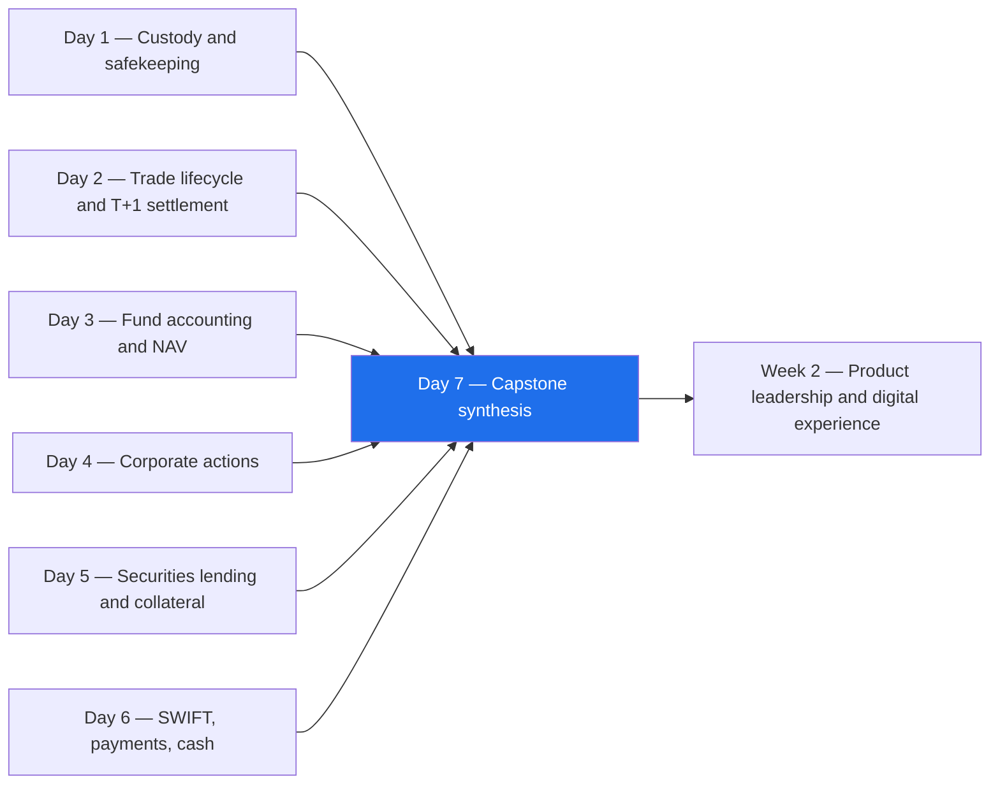
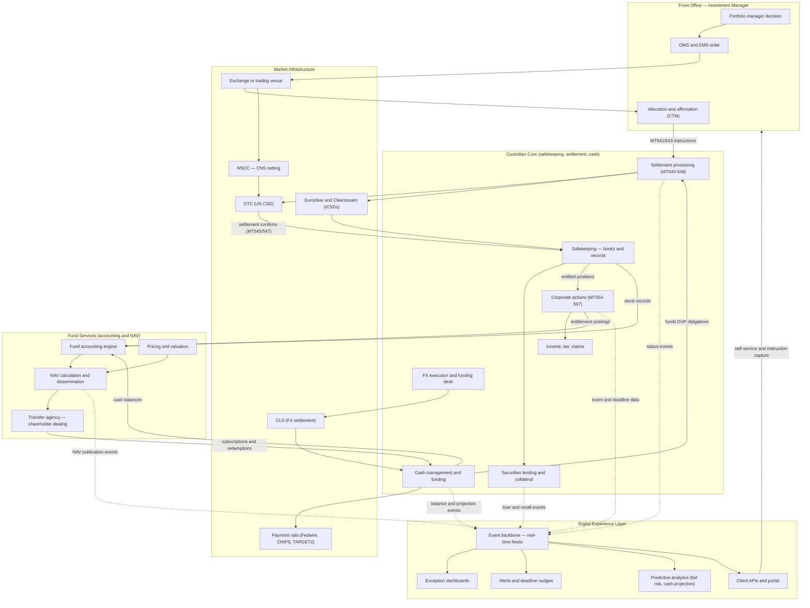
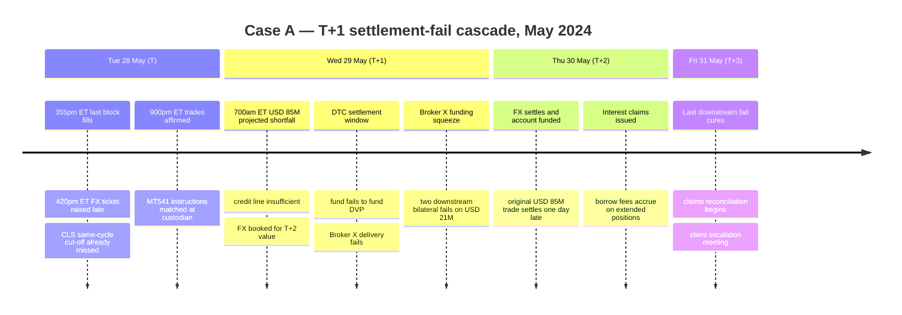
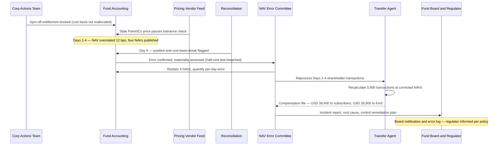
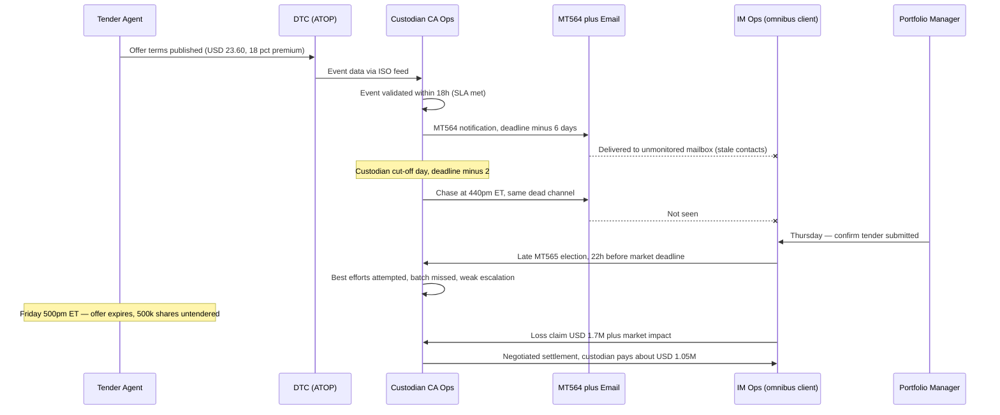
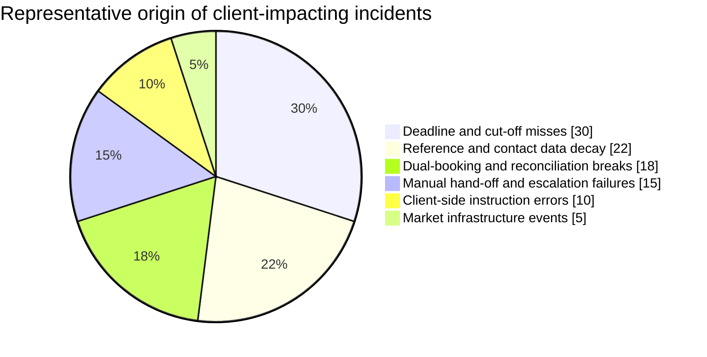

# Day 07 — Week 1 Capstone: Case Studies and the Full Picture
> Week 1 · Securities Services Foundations · Est. reading time: 60–90 min

---

## 🎯 Learning objectives

By the end of today you can:

- **Draw the entire securities-services machine from memory** — custody, trade lifecycle, NAV production, corporate actions, securities lending, SWIFT messaging and cash management — as one connected system, and explain where the digital experience layer sits on top of it.
- **Dissect three realistic operational failures** (a T+1 settlement-fail cascade, a NAV error with client compensation, and a missed voluntary corporate action election) step by step, with the financial impact quantified.
- **Trace any incident back through the chain** — from the client-visible symptom to the message, the deadline, the system, and the human hand-off that caused it.
- **Articulate, for each failure mode, what a digital experience product could have prevented, detected, or softened** — and what it could not.
- **Prioritize which failure modes the digital layer should attack first**, using an impact-versus-feasibility lens and a metrics baseline for all six Week 1 domains.
- **Pass a 20-question master quiz** spanning everything from Day 1 to Day 6, and honestly self-assess where you sit on a four-level fluency rubric.

---

## 🧭 Where this fits

Days 1–6 gave you six vertical slices of a custodian bank: safekeeping (Day 1), the trade lifecycle and settlement (Day 2), fund accounting and NAV (Day 3), corporate actions (Day 4), securities lending and collateral (Day 5), and SWIFT, payments and cash (Day 6). Today is the horizontal cut. Real incidents almost never stay inside one vertical — a missed FX cut-off (cash) becomes a settlement fail (trade lifecycle) becomes a claim (custody) and can even distort a NAV (fund accounting). The digital experience layer you will own exists precisely because clients experience the *system*, not the silos. Today you fuse the six days into one mental model and stress-test it against three case studies.

---

## Part 1 — Core concepts: the unified mental model

### 1.1 One machine, five layers

Strip away the departmental org chart and a custodian bank resolves into five layers:

1. **Front office / investment manager (the client).** Decides, orders, allocates, affirms. Everything downstream exists to make this layer's intent real and to report the consequences back.
2. **Custodian core.** The books and records of who owns what; the settlement engine that instructs markets; the cash and FX machinery that funds it; the corporate actions and income teams that keep entitlements true; the lending desk that sweats idle assets.
3. **Market infrastructure.** CSDs (DTC, Euroclear, Clearstream, local CSDs), CCPs and netting (NSCC's CNS), payment rails (Fedwire, CHIPS, TARGET2), and CLS for FX. The custodian does not control this layer — it interfaces with it, on its deadlines.
4. **Fund services.** Fund accounting, pricing, NAV calculation and dissemination, transfer agency. Consumes the custodian core's positions and cash as raw material and produces the single most client-visible number in the industry: NAV per share.
5. **Digital experience.** Your layer. It owns no positions and settles nothing — it **consumes events from every other layer** and turns them into visibility, prediction, and self-service: dashboards, APIs, alerts, nudges, projections.

### 1.2 The master diagram

Study this until you can reproduce it on a whiteboard. Every case study today, and most incidents you will ever triage, is a path through this graph.

Three properties of this graph matter more than any single box:

- **Deadlines live at the layer boundaries.** Affirmation cut-offs (9:00 pm ET on trade date under T+1), CLS cut-offs, DTC settlement windows, custodian election deadlines that sit *before* market deadlines, NAV strike times. Nearly every case study today is a deadline missed at a boundary.
- **Cash and securities are one system.** DVP welds them together; a cash problem *is* a settlement problem within hours.
- **The digital layer's edges are dotted for a reason.** It observes and instructs, but does not process. Its power is that it sees *across* all boundaries at once — the one vantage point no single ops team has.

### 1.3 How the six domains interlock

| From ↓ feeds → | Custody | Trade lifecycle | NAV / accounting | Corporate actions | Sec lending | SWIFT / cash |
|---|---|---|---|---|---|---|
| **Custody (Day 1)** | — | Positions available to deliver | Stock records = accounting raw material | Entitled holdings as of record date | Lendable inventory | Account structures for cash |
| **Trade lifecycle (Day 2)** | Settled positions update books | — | Trades booked, pending vs settled | Trades straddling record date create claims | Recalls needed to cover sales | DVP cash legs, fail funding |
| **NAV / accounting (Day 3)** | Reconciliation vs custody records | Pricing of pending trades | — | Entitlement accruals in NAV | Lending revenue accrues in NAV | Cash ladders reconcile to accounting |
| **Corporate actions (Day 4)** | Entitlement postings to accounts | Elections generate market transactions | Event bookings move NAV | — | Recalls before record date to vote or elect | Income proceeds hit cash accounts |
| **Sec lending (Day 5)** | Loaned positions flagged on books | Fails cured by borrowing | Collateral and revenue in NAV | Lender loses vote, gets manufactured dividends | — | Cash collateral reinvestment |
| **SWIFT / cash (Day 6)** | MT535 statements confirm holdings | MT54x drive settlement | MT9xx feed cash reconciliation | MT564-567 carry event lifecycle | MT54x for loan settlement | — |

Read this table row by row: any cell is a potential failure path. Case A today is the "SWIFT/cash → trade lifecycle" cell. Case B is "corporate actions → NAV." Case C is "corporate actions → custody liability."

---

## Part 2 — The system deep dive: three case studies

> These cases are composites, built from public post-mortems, industry claims practice, and regulatory guidance. Names are fictional; the mechanics, deadlines and math are real.

### Case Study A — The T+1 fail cascade (May 2024)

**Setup.** Meridian Capital, a Dublin-domiciled UCITS equity fund (base currency EUR), custodied at a large global custodian. On **Tuesday 28 May 2024 — the first US trade date under T+1** — the fund buys **USD 85,000,000** of US large-cap equities across 14 line items, executed through Broker X, settling **Wednesday 29 May** at DTC. As an institutional (ID) trade, it settles **bilaterally, trade-for-trade at DTC — not through NSCC's CNS**, which nets only street-side broker-to-broker obligations.

The fund holds EUR. Under T+2 it had a full day to arrange the USD. Under T+1 the FX must be executed **on trade date** and settled by settlement morning — and the CLS cut-off for next-day settlement (midnight CET, with custodian internal cut-offs hours earlier, ~6:00 pm CET) now lands *during the US trading afternoon*.

**What went wrong, step by step:**

1. **28 May, 3:55 pm ET (9:55 pm CET).** The last block fills late in the NY session. The IM's ops team begins allocation; the FX ticket for USD 85M is raised at 4:20 pm ET — **almost four hours past the custodian's CLS same-cycle cut-off.**
2. **28 May, 9:00 pm ET.** Affirmation deadline met (barely). Settlement instructions (MT541 receive-versus-payment) hit the custodian and are matched. Securities side: ready. Cash side: unfunded.
3. **29 May, 7:00 am ET.** The FX, now booked for **T+2 value (30 May)**, cannot fund today. The fund's USD account projects a **USD 85M shortfall**. The custodian will not extend an uncommitted intraday overdraft of that size to this fund under its credit policy.
4. **29 May, during the DTC settlement day.** The custodian cannot fund the DVP receive; the deliveries **fail**. Broker X is left holding USD 85M of stock it expected to deliver.
5. **The cascade.** Broker X had sourced ~40% of the position (USD 34M) via stock borrow and expected to return other borrows out of the settlement proceeds; it also had onward street-side deliveries that CNS netting only partially absorbed. Two downstream counterparties fail in turn on ~USD 21M of bilateral obligations. Because these legs are **bilateral, not CNS**, there is no central netting to dampen the chain — each fail propagates one-for-one.
6. **30 May.** The FX settles; the fund funds; the original trade settles one day late. The downstream tail takes until **31 May** to fully clear — a **three-day cascade** from one missed cut-off.

**Financial impact (quantified):**

| Item | Basis | Amount |
|---|---|---|
| Interest claim from Broker X to the fund | USD 85M × 5.33% (fed funds, May 2024) ÷ 360 × 1 day | **USD 12,584** |
| Broker X funding cost on inventory (passed on via TMPG-style interest claims) | USD 85M × (OBFR + 50 bp) ÷ 360 × 1 day | USD 13,765 |
| Extended stock-borrow fees on USD 34M | 75 bp annualized × 2 extra days | USD 1,417 |
| Downstream bilateral claims (2 counterparties, USD 21M, 1–2 days) | Overnight cost of funds, netted | USD 4,900 |
| Overdraft interest once partial credit extended | USD 30M × (fed funds + 100 bp) ÷ 360 × 1 day | USD 5,275 |
| Ops handling (claims processing ~USD 500 each × 11 claims, investigation time) | Internal cost | ~USD 9,000 |
| **Total direct cost** | | **~USD 47,000** |
| Indirect cost | CSDR-style settlement-discipline exposure in EU legs, client escalation, one "red" quarterly scorecard | Not booked, very real |

Note the asymmetry: a **USD 85M** notional produced "only" ~USD 47k of direct cost — but the fund escalated to the custodian's CEO office, because what the client experienced was *"you let me fail on the first day of T+1."* At custodian scale, multiply by the hundreds of funds that hit the same FX-window compression that week.

**Timeline:**

**Root causes:**

1. **Process design, not execution error.** The IM's FX workflow was still calibrated to T+2; nobody had moved the FX trigger from "next morning" to "at allocation."
2. **No forward-looking cash projection.** The USD shortfall was knowable at 4:30 pm ET on trade date — 14 hours before it hurt — but the first system to notice was the overdraft monitor on settlement morning.
3. **Credit policy and ops were not connected.** The credit decision (no USD 85M uncommitted overdraft) surprised the settlement team in real time.
4. **Bilateral settlement amplified the chain.** CNS would have netted street-side; the ID legs had no such shock absorber.

**Lessons learned:**

| # | Lesson | Owner |
|---|---|---|
| 1 | Under T+1, FX funding is a trade-date, front-office-adjacent process — not next-day ops | IM + custodian FX desk |
| 2 | Cash projection must be *predictive* (T+1 horizon, per currency, per fund), not end-of-day | Custodian cash mgmt |
| 3 | Fails are graphs, not events — one fail's cost includes its downstream chain | Settlement ops |
| 4 | Pre-agreed contingency FX and credit playbooks must exist *before* the deadline compresses | Relationship + credit |
| 5 | Claims are cheap; client trust is not. Measure both | Client management |

**What the digital experience layer could have done:**

- **Real-time fail prediction.** A model scoring every pending settlement on funding status, affirmation time, historical counterparty behavior and FX-booking value date would have flagged this trade **red at 4:30 pm ET on trade date** — "matched securities instruction, no same-cycle FX booked, projected USD shortfall 85M."
- **Cash projection API and dashboard.** A per-currency, per-account projected balance for T+0/T+1/T+2, exposed both in the portal and as an API the IM's own systems poll — so the *client's* ops desk sees the hole before your credit desk does.
- **Cut-off countdown nudges.** Event-driven alerts: "USD funding for tomorrow's USD 85M DVP not yet arranged; custodian CLS cut-off in 90 minutes" — pushed to the named funding contact, escalating to a second contact at 30 minutes.
- **Fail-cascade visibility.** An exception dashboard that links a fail to its downstream chain and running claim estimate, so the ops lead triages by *system cost*, not by first-in-first-out.
- **Post-event claims automation.** Auto-drafted interest claims with rate sourcing (OBFR/fed funds) and audit trail — turning an 11-claim, two-week reconciliation into days.

---

### Case Study B — The NAV error and client compensation

**Setup.** The Meridian Global Balanced Fund, **USD 2.1 billion** NAV, ~60/40 equities/bonds, daily-dealing, NAV struck at 4:00 pm ET by the fund administrator (the custodian's fund services arm). NAV per share ≈ **USD 10.00**, ~210 million shares outstanding. Daily flows average **USD 8M subscriptions and USD 6M redemptions**.

**What went wrong, step by step:**

1. **Day 0 (Monday).** A portfolio company completes a **spin-off**: holders receive 1 share of SpinCo per 4 shares of ParentCo, and ParentCo's price adjusts down accordingly. The corporate actions team books the SpinCo entitlement to the fund's account correctly. But in the **accounting** system, the event is mis-booked: SpinCo shares are added **without the offsetting cost-basis reallocation**, and the vendor price feed for ParentCo briefly carries a **stale pre-spin price** (the pricing exception was auto-tolerated because the day's market move masked it — the price moved, so the stale-price check saw "movement").
2. **Days 1–4 (Tue–Fri).** The fund's NAV is **overstated by 12 basis points** — USD 2.52M of phantom value on USD 2.1B, i.e. **USD 0.012 per share** on a USD 10.00 NAV. Four NAVs are published and used for dealing.
3. **Day 5 (Monday).** The weekly position-level reconciliation between fund accounting and the custody stock record flags the cost-basis break; investigation uncovers both the mis-booking and the stale price. The error is confirmed and the NAV error protocol invoked.

**Was it material?** This is where convention nuance matters — and where a US mutual fund answers differently from a UCITS:

- **US practice (informed by SEC guidance):** an error is generally corrected and shareholders compensated if it is **≥ USD 0.005 per share (half a cent)** *or* ≥ 0.5% (50 bps) of NAV. Here, USD 0.012/share **breaches the half-cent test** even though 12 bps is well under the 50 bps percentage test. **Material — full correction required.**
- **European practice (e.g., Luxembourg CSSF Circular 24/856):** thresholds by fund type — commonly **0.5% for equity funds, 0.25% for mixed/bond funds, 0.10% for money market funds**. A 12 bps error on a balanced fund would fall *under* a 25 bps threshold — likely no shareholder compensation, but still recordable and reportable. Same error, different jurisdiction, different obligation. Know which regime each fund lives under.

Our fund is US-registered: the half-cent rule bites.

**The compensation math, worked:**

Over the 4 error days, the NAV was too **high**. Two harmed populations:

| Party | Mechanics | Math | Compensation |
|---|---|---|---|
| **Subscribing shareholders (Days 1–4)** | Paid USD 10.012 for shares worth USD 10.00 — overpaid by 12 bps | USD 32M subscriptions × 0.0012 | **USD 38,400** paid to subscribers (or extra shares issued) |
| **The fund itself** | Redeemers were paid USD 10.012 per share for shares worth USD 10.00 — the fund overpaid them; remaining shareholders bore it | USD 24M redemptions × 0.0012 | **USD 28,800** paid *into the fund* (typically by the party at fault; redeemers usually keep small windfalls rather than being clawed back) |
| **Account-level de minimis** | Payments below ~USD 10 per account typically not distributed | Reduces the USD 38,400 modestly | — |
| **Reprocessing cost** | Transfer agent re-runs 4 days of shareholder transactions at corrected NAVs; ~3,900 transactions | Internal + TA cost | ~USD 45,000 |
| **Total cost of a 1.2-cent error** | | | **~USD 112,000** plus audit, legal review, board time |

Who pays? Fault allocation: the administrator's mis-booking and tolerated pricing exception → the administrator's error-and-omissions provision funds the compensation, subject to the SLA's standard-of-care and liability caps.

**The discovery and correction flow:**

**Root causes:**

1. **Split-brain corporate action booking** — correct in custody, wrong in accounting; no automated cross-check between the two postings.
2. **A tolerance check that tests the wrong thing.** Stale-price detection keyed on "did the price move," which a spin-off adjustment defeats by design. Event-aware pricing validation was missing.
3. **Reconciliation cadence too slow for the error's blast radius.** Weekly position/cost reconciliation meant four dealing days ran on a bad NAV.

**Lessons learned:**

| # | Lesson | Owner |
|---|---|---|
| 1 | Corporate action postings must reconcile custody-vs-accounting *same day*, automatically | Fund services + CA |
| 2 | Pricing tolerances must be corporate-action-aware (expected price breaks on ex-dates) | Pricing / valuation |
| 3 | Materiality is jurisdiction-specific — encode both the per-share and percentage tests per fund | NAV oversight |
| 4 | The cost of a NAV error is dominated by reprocessing and governance, not the compensation itself | Product / ops |
| 5 | Every published NAV is a client promise; oversight dashboards must treat pre-publication checks as release gates | Digital + fund services |

**What the digital experience layer could have done:**

- **NAV oversight dashboard with pre-publication gates:** a control-room view showing, per fund per day, pricing exceptions tolerated, corporate action bookings pending cross-check, and accounting-vs-custody breaks — with a hard visual gate before dissemination. Day-1 detection instead of Day-5.
- **Event-aware pricing validation:** the corporate actions event feed (MT564 data) piped into the pricing exception engine, so an ex-date automatically *expects* a price break of a computable magnitude and flags deviations from the expected adjustment, not from yesterday's price.
- **Same-day automated CA reconciliation:** an event-driven comparison of the custody posting and the accounting posting for every corporate action, alerting on divergence within hours.
- **Client transparency APIs:** administrators' clients (fund boards, IM oversight teams) increasingly demand NAV-oversight data feeds — exceptions, restatements, error logs — via API. Turning your internal control telemetry into a client-facing product is a genuine differentiator.
- **Impact simulation:** when an error is confirmed, an instant "blast radius" calculator — days affected, flows in the window, estimated compensation both ways, threshold tests per jurisdiction — turning a two-day scramble into a one-hour committee pack.

---

### Case Study C — The missed voluntary election

**Setup.** A cash **tender offer**: AcquirerCo offers **USD 23.60** per share for TargetCo, an **18% premium** over the USD 20.00 market price. Offer expires **Friday, 5:00 pm ET** (market deadline at the tender agent via DTC's PTOP/ATOP platform). The custodian sets its **client election deadline at Wednesday, 5:00 pm ET** — two days earlier, its standard buffer for voluntary events. One omnibus account — an asset manager holding **500,000 TargetCo shares** across underlying funds — intends to tender in full.

**What went wrong, step by step:**

1. **Announcement + 1 day.** Custodian's corporate actions system creates the event from vendor and DTC data; **MT564 notifications** generated. But the omnibus client's event notifications route to a **contact group last reviewed 14 months earlier** — the responsible analyst had left, and notifications flowed to an unmonitored mailbox. The portal showed the event, but this client operated email-first.
2. **Deadline minus 6 days.** First MT564 sent. No acknowledgment required, none received. The custodian's SLA promised notification within 24 hours of event validation — technically **met** ("send"), substantively failed ("receive").
3. **Deadline minus 2 days (custodian cut-off day).** No election received. The custodian's process included a *best-efforts* chase for unresponsive elections on high-value events — but the chase queue was sorted by event count, not value at risk, and this event's chase call went out at 4:40 pm ET, 20 minutes before cut-off, to the same dead mailbox.
4. **Deadline minus 1 day.** The asset manager's PM asks their ops team to confirm the tender was submitted. Ops discovers the gap at 3:00 pm ET Thursday and instructs immediately — **22 hours before the *market* deadline, but 22 hours *after* the custodian's cut-off.**
5. **Thursday 3:20 pm ET.** Custodian receives the late MT565 election. Best-efforts processing attempted; the instruction misses the custodian's internal batch to DTC and the manual fallback is not escalated with sufficient urgency. **The tender window closes Friday with 500,000 shares untendered.**
6. **Post-expiry.** The offer is fully subscribed with **no subsequent offering period**. There is **no market claim mechanism for a lapsed voluntary election** — unlike a missed dividend, the entitlement cannot be bought back. TargetCo's shares drift back toward USD 20.15.

**Financial impact (quantified):**

| Item | Math | Amount |
|---|---|---|
| Lost tender premium | 500,000 × (USD 23.60 − USD 20.15 post-expiry) | **USD 1,725,000** |
| Client's alternative (sell in market post-expiry) | Executed over 3 days, ~35 bp impact | further ~USD 35,000 cost |
| Settlement | Negotiated: custodian pays 60%, IM's E&O covers remainder | Custodian pays **~USD 1.05M** |
| Relationship cost | Client initiates RFP for a secondary custodian | Unquantified, largest number on the page |

**Liability analysis — SLA versus actual:**

| Chain step | SLA commitment | Actual | Verdict |
|---|---|---|---|
| Event capture and validation | Within 24h of public announcement | Met (18h) | ✅ |
| Client notification (MT564 / email / portal) | Within 24h of validation | Sent on time — to a dead contact group | ⚠️ Technically met; contact hygiene was a *shared* SLA duty the annual review missed |
| Reminder before custodian cut-off | Best efforts, high-value events prioritized | Sent 20 min before cut-off, wrong channel | ❌ Effectively failed |
| Late election handling | Best efforts, no guarantee | Received 22h before market deadline; not escalated | ❌ The 2-day buffer existed precisely to absorb this — and the buffer's value was destroyed by weak escalation |
| Client's duty to instruct by cut-off | Client obligation | Missed | ❌ Client shares fault — hence 60/40 |

The 60/40 split reflects reality on both sides: the client missed a contractual deadline, but the custodian's notification chain had a known-stale contact group, an unprioritized chase, and a best-efforts process that wasn't. Courts and negotiators alike look past "we sent the SWIFT."

**Notification chain — as it happened:**

**Root causes:**

1. **Contact-data decay** — the single most common root cause in voluntary-event losses industry-wide.
2. **Chase prioritization by count, not value at risk** — a USD 1.7M-exposure event queued behind trivial ones.
3. **No acknowledgment loop** — notifications were fire-and-forget; nobody measured *receipt*, only *send*.
4. **Best-efforts late handling without an escalation trigger** — 22 hours of usable buffer wasted.

**Lessons learned:**

| # | Lesson | Owner |
|---|---|---|
| 1 | Measure notification *acknowledgment*, not delivery; unacknowledged high-value events are incidents | CA ops + digital |
| 2 | Rank all chases and exceptions by dollars at risk (position × premium), never by count | CA ops |
| 3 | Contact data is a control, not an admin chore — verify quarterly, alert on bounce | Client service |
| 4 | Buffers between custodian and market deadlines only work with a defined escalation path for late instructions | CA ops |
| 5 | For lapsed voluntary events there is no cure — prevention is the entire game | Everyone |

**What the digital experience layer could have done:**

- **Election deadline nudges with escalation:** portal + email + API webhook notifications with **read receipts**; unacknowledged events auto-escalate through a contact hierarchy, then to the relationship manager, with cadence accelerating as the deadline approaches (D-5, D-3, D-1, hourly on cut-off day).
- **Value-at-risk-ranked election dashboard:** every open voluntary event scored as position × economic differential (here 500k × USD 3.60 ≈ USD 1.8M) — for *both* the ops chase queue and the client's own portal view. The client's PM could have seen "USD 1.8M uninstructed, cut-off in 48h" at a glance.
- **Elections as APIs:** let the IM's order management system submit MT565-equivalent elections programmatically and receive status callbacks — removing the email/fax human channel entirely.
- **Contact-health telemetry:** bounce detection, last-login and last-acknowledgment analytics per client contact, surfaced to client service as a hygiene score with automated re-verification workflows.
- **Late-instruction triage bot:** any instruction received after custodian cut-off but before market deadline triggers an automated high-priority workflow with a named owner and a countdown — converting "best efforts" from a phrase into a process.

---

## Part 3 — The VP lens

### 3.1 Where do Week-1 incidents actually come from?

Across the three cases, notice what *didn't* cause them: no exchange outage, no CSD failure, no SWIFT network incident. The market infrastructure layer is astonishingly reliable. Incidents breed at the **boundaries** — deadlines, hand-offs, dual bookings, decayed reference data. Representative distribution of client-impacting custody incidents by origin:

This is the strategic insight for your product: **the digital experience layer is the only layer that natively sees across boundaries** — which is exactly where ~85% of the incident mass lives.

### 3.2 Triage: which failure modes should the digital layer attack first?

Score candidate capabilities on client-impact-avoided versus feasibility (data availability, integration surface, model risk):

| Capability | Impact | Feasibility | Rationale | Priority |
|---|---|---|---|---|
| Election deadline nudges + acknowledgment loop | High (7-figure single-event losses) | **High** — event and deadline data already structured (MT564) | Case C is entirely preventable with plumbing that mostly exists | **1** |
| Cash projection dashboard + API (multi-currency, T+2 horizon) | High (T+1 made this structural) | High — balances and pending trades are known | Case A's 14-hour warning window | **2** |
| Exception dashboards ranked by value at risk | High | High — re-ranking existing queues | Cheap, changes ops behavior immediately | **3** |
| Same-day CA custody-vs-accounting reconciliation alerts | Medium-high | Medium — needs feeds from two platforms | Case B's Day-1 detection | **4** |
| Real-time fail *prediction* (ML scoring) | Medium-high | Medium — needs history, labels, model governance | Do after projection; prediction without the dashboard has no actuator | **5** |
| Client-facing NAV oversight APIs | Medium | Medium | Differentiator; sell-side of the same telemetry | **6** |
| Claims automation | Medium | High | Efficiency play, not loss prevention | **7** |

The pattern worth internalizing: **visibility before prediction, prediction before automation.** A fail-prediction model with no dashboard and no owner is a science project; a value-at-risk-sorted queue with no model already saves money on day one.

### 3.3 Metrics baseline — know these numbers for your shop in your first 60 days

| Domain | Metric to baseline | Healthy shape (representative) |
|---|---|---|
| Custody / safekeeping | Position reconciliation breaks open > 5 days | Near zero; aging tail is the tell |
| Trade lifecycle | Settlement fail rate (value-weighted); affirmation rate by 9pm ET on T | Fails < 2%; affirmation > 95% |
| Fund accounting / NAV | NAV errors per 1,000 NAVs; % NAVs disseminated on time | Errors < 0.5; timeliness > 99.5% |
| Corporate actions | % voluntary events with uninstructed positions at custodian cut-off; notification acknowledgment rate | Uninstructed < 2% of value; ack rate measured *at all* |
| Securities lending | Recall fail rate; % lendable utilized | Recall fails < 1%; utilization is a revenue metric, not a risk one |
| SWIFT / cash | STP rate on payments; projected-vs-actual cash variance at settlement date | STP > 95%; variance shrinking under T+1 |

Then, for the digital layer itself: **event latency** (custody event → client-visible), **alert acknowledgment rate**, **API adoption** (% of top-50 clients consuming programmatically), and **exceptions resolved via self-service**.

### 3.4 Questions to ask your ops and platform leads

1. "Show me the **last five client-impacting incidents**. For each: which layer boundary did it cross, and at what timestamp was it first *knowable* versus first *known*?" (The gap between those timestamps is your product's addressable market.)
2. "How are exception queues sorted today — age, count, or **dollars at risk**?"
3. "Do we measure notification **acknowledgment** anywhere, or only dispatch?"
4. "What is our **cash projection horizon** per currency, and who consumes it — humans, dashboards, or client APIs?"
5. "When corporate actions post to custody and accounting, what reconciles the two, and how fast?"
6. "Which of our controls exist as **release gates** (block the NAV, block the payment) versus after-the-fact reports?"
7. "What events can clients today receive as **webhooks or API subscriptions**, and what still travels by email and PDF?"

---

## 🏦 State Street context

*Representative and public-knowledge framing.*

- **Scale changes the math.** State Street reports roughly **USD 40+ trillion in assets under custody and/or administration** and tens of millions of transactions flowing through its platforms. At that scale a 2% fail rate, a 0.05% NAV-error rate, or a 1% uninstructed-election rate is not a rounding error — it is thousands of daily exceptions, each one a client interaction that is either self-served through a digital channel or lands on a phone line. Exception economics *is* the digital experience business case.
- **T+1 was an industry-wide stress test.** The May 2024 US transition — documented extensively in DTCC and SIFMA public materials — went far better than feared (affirmation rates above 90% by the deadline, fail rates broadly stable), but it structurally compressed FX and funding windows for non-US investors, exactly as in Case A. Large custodians including State Street responded with extended FX capabilities, funding tools, and projection services for cross-border clients; the T+1 experience is now the template for the announced 2027 UK/EU transitions.
- **The digital product surface.** In representative terms, State Street's client-facing digital estate spans portal experiences and data platforms (e.g., the State Street Alpha℠ front-to-back platform, built around the acquired Charles River front office, and cloud-based data services) whose promise is precisely the master diagram's dotted lines: one event backbone across custody, accounting, and markets, consumed as dashboards, data feeds and APIs. A VP of Product Development in Digital Experience effectively owns the top subgraph of today's master diagram — and its credibility depends on the freshness and completeness of events flowing up from every other subgraph.
- **Why the case studies matter here.** For an organization servicing tens of thousands of funds, the three cases above are not anecdotes; they are *distributions*. The product question is never "how do we prevent this incident" but "which class of incident do we make structurally impossible, for every client, at once."

---

## 💪 Exercises

1. **Whiteboard from memory (45 min).** Without looking, redraw the master diagram: five subgraphs, the main solid-line flows, and the dotted event flows into the digital layer. Then compare against the original and list what you missed — the misses are your weakest Week-1 areas. Repeat tomorrow morning; target 90% fidelity.
2. **Write a one-page incident review (60 min).** Take Case A and write it up as a formal post-incident review for an executive audience: summary (3 sentences), timeline (5 rows), root causes (max 3), financial impact (one table), and exactly **three** remediation commitments with owners and dates. Practice the discipline of *three* — executives fund three fixes, not eleven.
3. **Build the triage matrix for your own backlog (30 min).** List 8–10 digital capabilities you suspect your future team's backlog contains (use §3.2 as a seed). Score each 1–5 on client-impact-avoided and feasibility, and force-rank. Note which ones are "visibility," which are "prediction," and which are "automation" — check that your top three are not all from the hardest category.

---

## ❓ Self-check quiz — Week 1 master quiz (20 questions)

**Custody and safekeeping**
1. What is the difference between holding securities in an omnibus account versus a segregated account at the sub-custodian level, and name one risk-and-one-cost trade-off.
2. In whose name are US securities typically registered at DTC, and what does the custodian's "books and records" layer add on top?

**Trade lifecycle and settlement**
3. Under US T+1, by when must institutional trades be affirmed, and why did T+1 make this deadline so much harder for European investors specifically?
4. Explain the difference between CNS (continuous net settlement) and bilateral/ID settlement at DTC. Which one dampens fail cascades, and why?
5. A USD 50M equity delivery fails for 2 days with overnight rates at 5.4%. Approximately what interest claim should the failing party expect (ACT/360)?
6. What is DVP, and why does it convert a cash shortfall into a securities settlement failure?

**Fund accounting and NAV**
7. State the two common US materiality tests for a NAV error. A USD 25.00 NAV fund misstates by USD 0.008 per share — material or not, and under which test?
8. When a NAV was overstated for several days, which two parties are harmed and how is each typically made whole?
9. Why can a stale price survive a naive tolerance check on the ex-date of a spin-off?

**Corporate actions**
10. Rank by operational risk: mandatory event, mandatory-with-options, voluntary event — and justify the ranking in one sentence.
11. Why do custodians set client election deadlines 1–2 days before the market deadline, and what is the failure mode if late instructions have no escalation path?
12. Why is a missed voluntary election generally *not* recoverable via a market claim, while a missed dividend generally is?

**Securities lending and collateral**
13. A fund lends stock over a dividend record date. What does the lender receive instead of the dividend, and what right does the lender lose?
14. Why might a securities lending desk *recall* a loan ahead of a proxy vote or a tender offer, and what Week-1 domain does a failed recall damage?
15. Name the two main collateral models in securities lending and one risk that is specific to cash collateral.

**SWIFT, payments and cash**
16. Match the message families to functions: MT540–548, MT564–567, MT535, MT9xx.
17. What is CLS, what risk does it eliminate, and why did its cut-off timing become a T+1 pain point for EUR-based buyers of US securities?
18. What is the practical difference between an end-of-day cash statement and a projected cash ladder, and which one does T+1 make indispensable?

**Synthesis**
19. In the master mental model, why do most client-impacting incidents originate at *layer boundaries* rather than inside a single system? Give two boundary examples from this week's cases.
20. State the "visibility before prediction, prediction before automation" principle and defend it with one concrete example from the case studies.

Answers

1. **Omnibus:** the custodian's clients are pooled in one account at the sub-custodian; cheaper and operationally simpler, but individual client identification relies on the custodian's own records (attribution risk in insolvency, and events like elections must be split internally). **Segregated:** each client (or fund) has its own account; stronger asset-protection clarity and cleaner entitlement attribution, but higher account maintenance cost and more settlement fragmentation.
2. In the nominee name **Cede & Co.** (DTC's nominee). The custodian's books and records layer maintains the beneficial-ownership ledger — which client owns what — on top of the fungible pooled position at the CSD; that ledger is what makes entitlements, elections and reporting per-client possible.
3. By **9:00 pm ET on trade date**. Under T+2, European investors affirmed and arranged USD funding during their next business morning; under T+1 both must happen on trade date, i.e. during the European evening/night, colliding with CLS and custodian FX cut-offs.
4. **CNS:** NSCC nets each member's street-side obligations per security into one net receive/deliver against NSCC as central counterparty — one member's fail is absorbed and re-netted, damping propagation. **Bilateral/ID:** institutional deliveries settle trade-for-trade at DTC between the two parties, so each fail passes one-for-one to the next obligation — no shock absorber (Case A).
5. USD 50,000,000 × 0.054 ÷ 360 × 2 ≈ **USD 15,000**.
6. **Delivery versus payment** — securities move if and only if cash moves, simultaneously and finally. Because the two legs are inseparable, an unfunded cash account means the securities leg cannot complete: the cash problem *is* the fail.
7. (a) **≥ half a cent (USD 0.005) per share**, (b) **≥ 50 bps of NAV** (conventions vary; either can trigger). USD 0.008 on a USD 25.00 NAV is only ~3.2 bps — fails the percentage test — but **breaches the half-cent per-share test → material**.
8. **Subscribers during the error window** overpaid per share → compensated in cash or additional shares. **The fund itself** overpaid redeemers → reimbursed (typically by the party at fault, e.g., the administrator); small shareholder windfalls are usually not clawed back, and per-account de minimis thresholds apply.
9. Naive checks flag prices that *didn't move*. On a spin-off ex-date the parent's price is *supposed* to gap down by the spun-off value; a stale price sitting at the pre-spin level looks "moved" relative to the adjusted expectation only if the check is corporate-action-aware — otherwise the stale pre-spin price can pass, as in Case B.
10. **Voluntary > mandatory-with-options > mandatory.** Risk scales with the number of decisions and deadlines: mandatory events need only correct booking; options add a default and a choice; voluntary events add a client decision, a notification chain, and a hard expiry with no cure (Case C).
11. The buffer gives the custodian time to collect, validate, batch and transmit elections to the agent/CSD, and to chase non-responders. If late instructions (after custodian cut-off, before market deadline) lack a defined escalation path, the buffer's value is destroyed — a late-but-usable instruction dies in a best-efforts queue, as in Case C.
12. A missed dividend creates a **market claim**: the cash exists and can be claimed from the party who wrongly received it. A lapsed voluntary election destroys the *option* itself — once the offer expires, the entitlement (e.g., the 18% tender premium) no longer exists at any price, so there is nothing to claim in the market; only bilateral loss compensation remains.
13. A **manufactured (substitute) dividend** from the borrower, contractually equal to the distribution (tax treatment may differ). The lender loses the **voting rights** for shares on loan over record date.
14. To restore the position so the client can **vote** or **participate in the event** (tender, election). A failed recall damages the **trade lifecycle/settlement** domain (a sale or election delivery fails) — and can convert into a corporate-actions loss.
15. **Cash collateral** and **non-cash collateral** (securities, typically government bonds, at a haircut). Cash-specific risk: **reinvestment risk** — the cash collateral is reinvested, and losses in the reinvestment vehicle (2008's lesson) fall on the lender/beneficial owner.
16. **MT540–548:** settlement instructions and confirmations/status. **MT564–567:** corporate action notification, instruction, movement confirmation, status. **MT535:** statement of holdings. **MT9xx:** cash — confirmations and statements (e.g., MT900/910 debit/credit confirmations, MT940/950 statements).
17. **CLS** is the multi-currency FX settlement system settling both legs **payment-versus-payment**, eliminating FX settlement (Herstatt) risk. Its next-day settlement cycle has cut-offs around midnight CET (custodian internal cut-offs earlier, ~6 pm CET) — which now falls *inside* the US trading afternoon, so a late US execution leaves a EUR-based buyer unable to settle FX through CLS in time to fund T+1 (Case A).
18. A statement is **backward-looking** (what happened); a projected ladder is **forward-looking** (expected balances per currency per day, from pending settlements, FX, income, subscriptions/redemptions). T+1 makes the ladder indispensable because the funding decision window shrank to hours — by the time the statement shows the shortfall, the fail has happened.
19. Because each system is individually controlled and tested, but the **hand-offs** carry deadlines, data translations and ownership ambiguity that no single team owns end-to-end. Examples: the IM-to-custodian FX funding hand-off across the CLS cut-off (Case A); the custody-to-accounting dual booking of one corporate action (Case B); the custodian-to-client notification/acknowledgment boundary (Case C).
20. Build **visibility** (dashboards, value-at-risk-ranked queues, projections) before **prediction** (models scoring fail or error risk) before **automation** (auto-claims, auto-escalation), because each stage supplies the data, trust and human workflow the next stage needs. Example: a fail-prediction model is useless without the cash-projection dashboard and alerting path that let someone *act* on a red flag 14 hours early (Case A) — while the dashboard alone, with no model at all, already surfaces the USD 85M shortfall.

---

## Week 1 self-assessment rubric

Rate yourself honestly per domain. "Can lead" means you could chair the incident review, not just follow it.

| Domain | 1 — Aware | 2 — Conversant | 3 — Fluent | 4 — Can lead |
|---|---|---|---|---|
| **Custody and safekeeping** | Knows custody ≠ ownership transfer; can define AUC | Can explain nominee structures, omnibus vs segregated, asset safety | Can trace a position from client ledger to Cede and Co. and explain entitlement attribution | Can debate account-structure trade-offs with a network manager and set client-asset policy questions |
| **Trade lifecycle and settlement** | Knows T+1, DVP, and what a fail is | Can walk execution → affirmation → instruction → settlement with the key deadlines | Can explain CNS vs bilateral, compute an interest claim, and diagnose a fail from MT548 reason codes | Can run a fail-cascade post-mortem and specify the prediction/projection product to prevent it |
| **Fund accounting and NAV** | Knows NAV = (assets − liabilities) ÷ shares | Can describe the daily NAV cycle, pricing sources, tolerance checks | Can apply materiality tests, work compensation math both ways, and explain jurisdiction differences | Can chair a NAV error committee pack and redesign the pre-publication control gates |
| **Corporate actions** | Can classify mandatory / with-options / voluntary | Can walk MT564→565→566 and explain record vs ex vs pay dates | Can analyze a notification chain against SLA, compute value at risk on an open election | Can own the custodian's election-deadline policy and defend a liability split negotiation |
| **Securities lending and collateral** | Knows why funds lend and what collateral is | Can explain fees vs rebates, manufactured dividends, recalls | Can trace a recall-for-tender end to end and price a lending program's risk trade-offs | Can set program parameters (collateral, indemnification, restricted lists) with the desk |
| **SWIFT, payments and cash** | Recognizes MT54x/56x/9xx families | Can map message flows for a settlement and a corporate action | Can read a projected cash ladder, explain CLS and cut-off interactions under T+1 | Can specify the cash-projection API and argue the ISO 20022 migration roadmap |

**How to close the gap:**

| If you scored ≤ 2 in… | Do this within 2 weeks |
|---|---|
| Custody | Re-read Day 1; ask a network-management colleague to walk one sub-custodian market file with you |
| Trade lifecycle | Sit with settlement ops for half a day watching the fail queue; re-derive Case A's math yourself |
| NAV / accounting | Obtain (or mock) one fund's NAV pack and trace every input; redo Case B's compensation table with different flows |
| Corporate actions | Pull 10 live voluntary events; rank them by value at risk; compare with how ops has them ranked |
| Sec lending | Read one lending program agreement's indemnification and collateral schedule end to end |
| SWIFT / cash | Get read access to a message browser; follow one real trade's full message trail T to T+1 |

---

## 🔑 Key takeaways

- **The custodian is one machine, not six departments.** Custody, settlement, cash, corporate actions, lending and accounting are welded together by DVP, record dates and reconciliations — and clients experience the welds, not the parts.
- **Incidents breed at boundaries.** Deadlines, hand-offs, dual bookings and decayed contact data cause the vast majority of client-impacting losses; core market infrastructure almost never does.
- **The digital experience layer is the only layer that sees across all boundaries** — which makes cross-domain visibility (projections, value-at-risk-ranked exceptions, acknowledgment loops) its highest-leverage product territory.
- **Small percentages, big absolutes.** A 12 bps NAV error cost ~USD 112k; a missed election on 500k shares cost USD 1.7M; a single missed FX cut-off cascaded for three days. At USD 40T+ of scale, these are distributions to be engineered away, not anecdotes.
- **T+1 turned cash management from a back-office statement into a real-time product.** Funding windows measured in hours make projection and alerting structural necessities, and 2027's UK/EU transitions will replay this.
- **Sequence your product ambition: visibility → prediction → automation.** Each stage earns the data and trust the next one spends.
- **Measure receipt, not dispatch.** "We sent the notification" satisfied the SLA and still lost USD 1.05M; acknowledgment loops are cheap and transformative.

---

## 📚 Going deeper

- **DTCC — "T+1 After the Transition" and the T+1 Industry Implementation Playbook** (dtcc.com) — the definitive public record of the May 2024 US move: affirmation statistics, fail rates, lessons.
- **SIFMA / ICI / DTCC T+1 command-center materials and post-transition reports** — including the FX and funding impacts on non-US investors.
- **SEC materials on mutual fund NAV errors and pricing** (sec.gov) — releases and staff guidance underlying US materiality and compensation practice.
- **CSSF Circular 24/856** (cssf.lu) — Luxembourg's NAV-error and investment-breach regime; the cleanest public articulation of European threshold conventions.
- **TMPG — U.S. Treasury fails-charge trading practice** (newyorkfed.org/tmpg) — the model for fail-charge economics referenced in Case A.
- **ISO 20022 and SWIFT Standards MT documentation** (iso20022.org, swift.com) — message-level detail for the MT54x/56x/9xx families used throughout this week.
- **ECB / Bank of England T+1 taskforce reports** — the 2027 UK/EU transition plans that will replay the Case A dynamics in your first years in seat.

---

## Tomorrow

**Day 08** shifts gears from operations to product leadership: product strategy in institutional financial services — how you set direction when your users are trillion-dollar clients and your platform is a 230-year-old bank.
