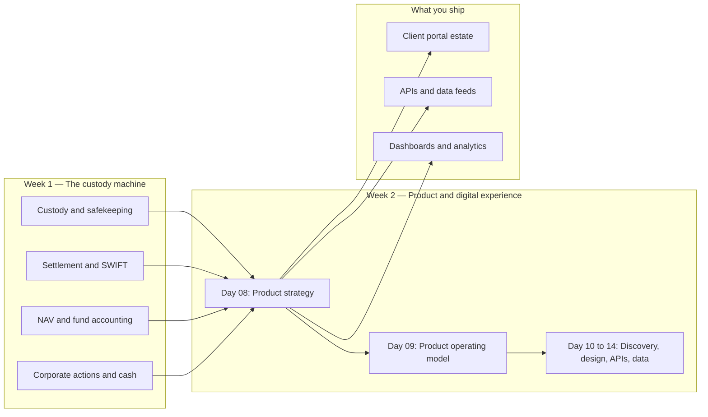
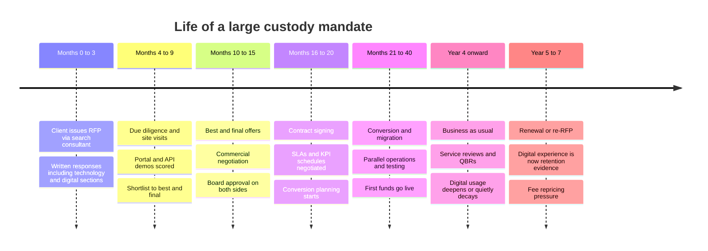
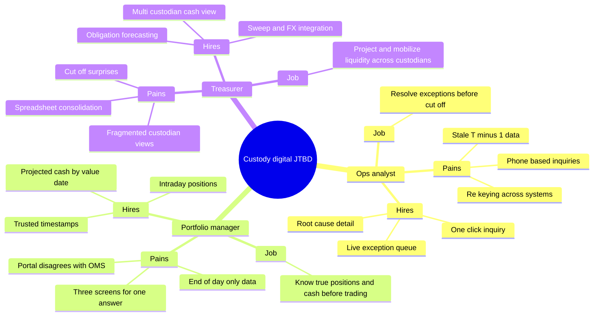
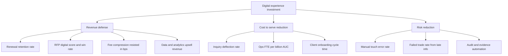
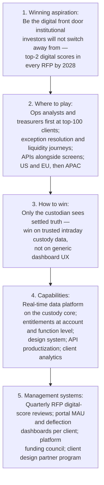
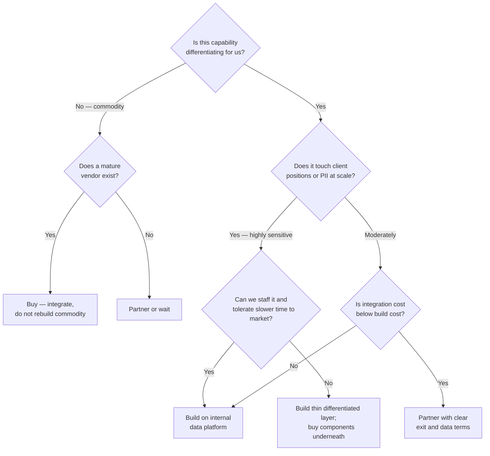
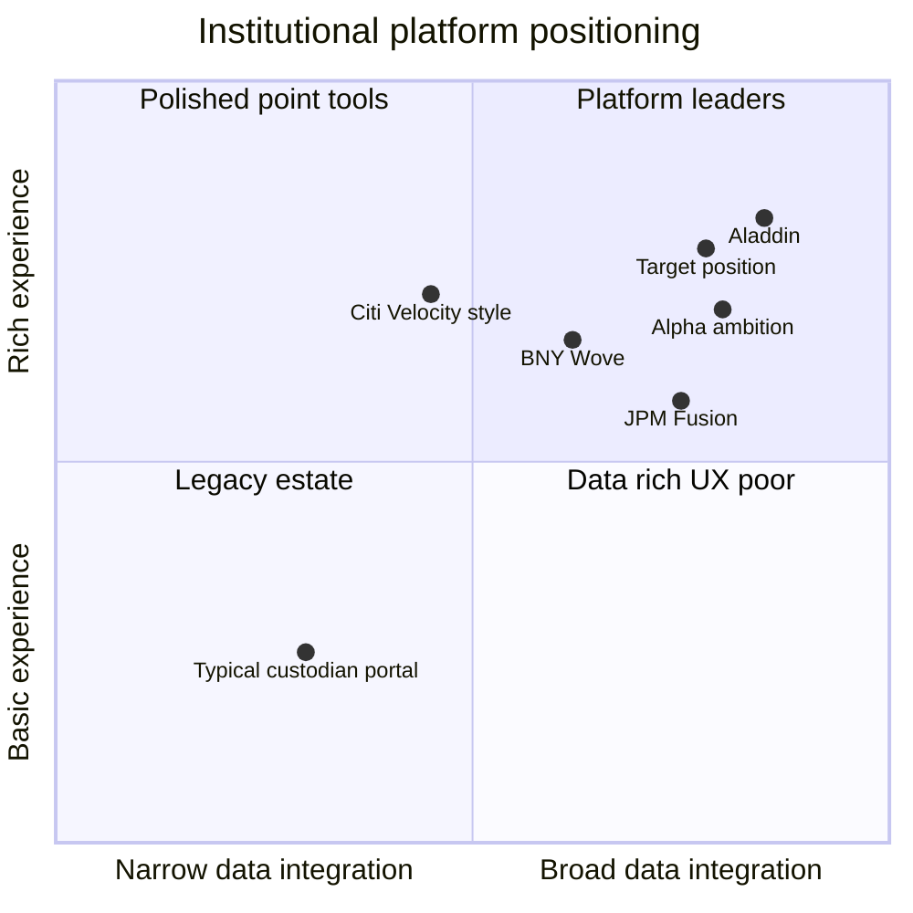

# Day 08 — Product Strategy in Institutional Financial Services
> Week 2 · Product and Digital Experience · Est. reading time: 60–90 min

Welcome to Week 2. Week 1 gave you the machine room: custody, settlement, NAV, corporate actions, SWIFT and cash. This week is about the job you were actually hired to do — leading product. Today we establish the foundation everything else this week builds on: **what product strategy means when your "market" is a few hundred institutional clients, your product was historically a service, and your software is the interface to a 200-year-old trust business.**

If you arrive from consumer or even enterprise SaaS product management, the single most important thing today can do is recalibrate your instincts. Most of them are still valid — but the ones that aren't will cost you credibility in your first quarter if you don't spot them early.

---

## 🎯 Learning objectives

By the end of today you can:

- Explain, with numbers, how institutional B2B2B product differs from consumer and enterprise SaaS product — and why RFPs, multi-year contracts, and ops-heavy delivery reshape every product decision.
- Apply the Playing-to-Win strategy cascade (winning aspiration → where to play → how to win → capabilities → management systems) concretely to a custody digital platform.
- Write jobs-to-be-done statements for the three personas who dominate custody digital experience: the operations analyst, the portfolio manager, and the treasurer.
- Run a weighted build/buy/partner decision matrix and show the arithmetic, not just the conclusion.
- Build and defend a business case with a real NPV calculation for a digital investment whose benefits are indirect (retention, cost-to-serve) rather than directly monetized.
- Position the major competing platforms — BNY Wove, J.P. Morgan Fusion, Northern Trust, Citi-style dealer portals, BlackRock Aladdin — and articulate where a custodian's digital experience should aim.

---

## 🧭 Where this fits

Week 1 taught you what the custody machine does; Day 08 is the hinge where you stop learning the machine and start deciding what to build on top of it. Product strategy is the layer that connects the operational core (settlement, NAV, cash) to the client-facing digital estate (portal, APIs, dashboards) you will own. Days 09–14 then go deeper into operating model, discovery, design, APIs and data — all downstream of the strategic choices framed today.

---

## Part 1 — Core concepts

### 1.1 The market you are actually in: B2B2B, not B2B

Consumer product managers optimize for millions of users making individual choices. Enterprise SaaS PMs sell to companies but still think in funnels, trials, and seat expansion. Custody digital experience is a third species: **B2B2B**. State Street's client is an asset manager or asset owner (business one), whose own clients are pension funds, sovereign funds, and retail investors (business two). Your users — ops analysts, portfolio managers, treasurers — sit inside the client, but the *buyer* is a procurement-led committee that may never open your portal.

The numbers that reshape your instincts:

- **Client concentration.** A top-20 custody client can represent hundreds of millions of dollars in annual revenue across custody, fund accounting, middle office, and securities lending. Losing one is a board-level event. In consumer, losing 0.1% of users is a Tuesday; here, "one client" can be 2–4% of segment revenue.
- **Sales cycle.** New mandates come through RFPs (requests for proposal) with 12–18 month cycles: RFP issuance, due diligence, site visits, best-and-final, contract negotiation, then a *conversion* (migrating the client's books) that itself takes 12–36 months. Your digital demo is scored in that RFP — often with an explicit "technology and digital capabilities" section worth 10–20% of the evaluation.
- **Contracts.** Multi-year (typically 3–7 years) with negotiated SLAs, KPI schedules, and sometimes bespoke deliverable commitments — including, dangerously, bespoke *software* commitments made by sales to close the deal.
- **Switching costs.** A large client transition involves re-papering thousands of accounts, market-by-market re-registration, parallel NAV runs, and operational rewiring. Clients switch custodians roughly once a decade, if that. This cuts both ways: high retention by default, but when a client decides to leave, no feature will save you — the decision was made 18 months before you heard about it.
- **The product was the service.** For most of custody's history, "product" meant the *service line* — custody, fund accounting, transfer agency — run by "product managers" who owned pricing, P&L, and operational delivery, not software. You will meet senior "product" people who have never written a user story. That is not a deficiency; it is the incumbent meaning of the word. Part of your job is bilingual translation between service-product and software-product cultures.

### 1.2 Consumer vs enterprise SaaS vs institutional B2B2B

| Dimension | Consumer | Enterprise SaaS | Institutional B2B2B (custody) |
|---|---|---|---|
| Customers | Millions | Thousands | Hundreds; top 20 dominate revenue |
| Revenue per customer | $0–$100/yr | $10k–$5M/yr | $1M–$300M+/yr per relationship |
| Buyer vs user | Same person | CIO buys, teams use | Procurement/committee buys; ops, PM, treasury use; end investors never see it |
| Sales motion | Self-serve, growth loops | Sales-led, 3–9 month cycle | RFP-driven, 12–18 months; consultant-intermediated (e.g., search consultants) |
| Contract | Terms of service | 1–3 yr subscription | 3–7 yr master agreement, negotiated SLAs, KPI schedules |
| Switching cost | One tap | Months of migration | Years; parallel operations; regulatory re-papering |
| Pricing | Freemium/ads | Per seat/usage | Basis points on assets, per-transaction fees, bundled across services |
| What "product" means | The app | The software | Historically the *service*; software is emerging as the differentiator |
| Delivery | Cloud push | Cloud + CS team | Software + large human ops teams; SLAs measured in cut-off times |
| Feedback loop | A/B tests, daily | QBRs, usage data | Client councils, RFP losses, service reviews; usage data historically sparse |
| Kill-a-feature cost | Cohort churn | Renewal risk | Contractual breach risk; relationship damage measured in mandates |

The strategic consequence: **in custody, digital experience is rarely the reason a client arrives, but it is increasingly the reason a client stays, expands, or scores you first in an RFP.** Your product strategy must be honest about that indirect value chain — Part 2's NPV case shows how to quantify it.

To make the sales-cycle point visceral, here is the life of a single large mandate. Note where digital experience actually gets evaluated — and how long before "win" becomes "live" (and therefore before your portal has a user):

Two readings of this timeline matter for strategy. First, **your demo environment is a product**: months 4–9 is when digital gets scored, so the demo estate deserves real investment, not a scramble before each site visit. Second, **the feedback loop is brutally long**: a capability you ship today influences RFPs scored next year and renewals three years out. This is why custody product strategy must be conviction-led (cascade, Part 2.1) rather than purely metrics-led — the metrics arrive too late to steer by alone.

And because "digital gets scored in the RFP" is abstract until you see one, here is a representative technology-and-digital section of a custody RFP scorecard (structure representative of what search consultants use; weights vary by mandate):

| Scorecard item (technology section, ~15% of total evaluation) | Weight within section | What evaluators actually look at |
|---|---|---|
| Client portal functionality and usability | 20% | Live demo against scripted scenarios: find a failed trade, explain the fail, raise an inquiry |
| Data delivery: APIs, feeds, cloud sharing | 20% | API catalogue depth, versioning policy, sandbox access, existing client integrations |
| Timeliness of data (intraday vs end-of-day) | 15% | Timestamps in the demo; consistency between portal and reports; honesty about batch dependencies |
| Reporting and analytics flexibility | 15% | Self-service report building, scheduling, export formats, data dictionary quality |
| Technology roadmap and investment credibility | 15% | Multi-year platform narrative, spend commitments, delivery track record on past promises |
| Security, entitlements, resilience | 15% | Entitlement granularity, SOC reports, availability history, incident transparency |

A custodian scoring 4/5 across this section against competitors at 3/5 gains roughly 1.5 points of the 15-point technology allocation — routinely enough to reorder a shortlist where service and price are near parity, which at the top of the market they usually are. This table is also, conveniently, a free product requirements document: it tells you exactly what the market's professional evaluators believe "good" looks like.

### 1.3 Jobs-to-be-done: the three personas who matter most

Jobs-to-be-done (JTBD — Christensen's framing: people "hire" products to make progress in a circumstance) is unusually powerful in custody because the personas are stable, professional, and articulate about their jobs. Three dominate the digital experience estate:

| Persona | JTBD statement | Hire criteria (what wins them) | Fire criteria (what loses them) |
|---|---|---|---|
| **Operations analyst** (client's middle/back office) | "When settlement exceptions arise during the day, help me **resolve my exceptions before market cut-off** so my trades don't fail and I don't get escalated." | Real-time exception queue; root-cause detail (why is it failing — SSI mismatch? insufficient position?); one-click inquiry with context attached; audit trail | Stale data (T-1 files when they need T+0 status); having to phone the service desk to learn what the portal should show; re-keying between portal and internal systems |
| **Portfolio manager** (client's front office) | "Before I trade, help me **know my true positions and cash** — settled, pending, and projected — so I don't oversell, breach, or leave cash idle." | Intraday positions with pending activity; projected cash by currency and value date; trust in the number (reconciled, timestamped) | Positions that disagree with their OMS; end-of-day-only data; needing three screens to answer one question |
| **Treasurer** (client's treasury/liquidity function) | "Across all my custodians and accounts, help me **project and mobilize liquidity** so I can fund obligations without emergency borrowing or idle balances." | Multi-custodian cash visibility; sweep and FX integration; forecast of tomorrow's obligations (settlements, margin, capital calls) | Single-custodian-only views; cut-off surprises; manual spreadsheet consolidation |

Notice the asymmetry: the **ops analyst** uses your portal 6 hours a day and shapes daily sentiment; the **PM** uses it 10 minutes a day but has the most political power inside the client; the **treasurer's** job is the hardest to serve (multi-custodian) but the most differentiating if you crack it. Part 3 takes up the prioritization decision.

### 1.4 Platform vs feature thinking

The defining architectural-strategic choice for a custody digital estate:

- **Portal-as-feature:** each service line (custody, fund accounting, securities lending) ships its own screens onto a shared shell. Fast per-team, but produces the classic custodian portal: 40 modules, 12 data definitions of "position", inconsistent entitlements, and a client experience that feels like the org chart.
- **Experience-platform:** a shared foundation — one data layer (the same position/cash/transaction entities everywhere), one entitlements model, one design system, one API surface — on which journeys are composed. Slower to first value, compounding thereafter, and the only architecture that supports the "one number everywhere" trust that PMs and treasurers hire you for.

The **trap of one-off client-driven builds** deserves its own warning. A top-5 client asks for a bespoke report or workflow; sales commits it in a renewal negotiation; a team builds it as a special case. Do this 30 times over a decade and you have a portfolio of unowned, untested, client-specific code paths that consume 20–30% of engineering capacity in maintenance and make every platform migration a hostage negotiation. The discipline (Part 3) is not "never say yes" — it is "never say yes *as a one-off*": generalize the ask into a platform capability with configuration, or price the bespoke work explicitly so its cost is visible.

### 1.5 The economics: how digital experience makes money without a price tag

Custody digital experience is almost never directly monetized — clients pay basis points on assets and per-transaction fees, not portal subscriptions. Its economic contribution flows through five channels:

1. **Fee revenue defense.** Custody fees face perpetual compression (repricing at renewal is routine). A demonstrably superior digital experience is one of the few non-price levers in a renewal negotiation.
2. **Retention and renewal.** Switching is rare, but at-risk revenue is enormous; even small churn-probability reductions on nine-figure relationships are worth millions (quantified in Part 2).
3. **RFP win rate.** Digital capability sections are explicitly scored. Moving from "parity" to "differentiated" in the technology score can swing best-and-final decisions on mandates worth $5M–$50M/yr.
4. **Cost-to-serve reduction.** Every inquiry a client resolves via self-service is a call your ops team doesn't handle. At scale — large custodians handle millions of client inquiries a year — deflection compounds into real FTE (full-time-equivalent) capacity.
5. **Premium data and analytics upsell.** The one directly monetizable adjacency: analytics, risk, performance, and ESG data services sold on top of the custody data you already hold.

Memorize this tree. It is how every business case in Part 2 and every metric in Part 3 hangs together — and it is your answer when a CFO asks "why are we spending $40M a year on a portal nobody pays for?"

---

## Part 2 — The system deep dive

Now we apply three frameworks end-to-end to one concrete object: **the digital experience platform of a global custodian**. This is the analytical core of the day.

### 2.1 The strategy cascade, worked

Lafley and Martin's *Playing to Win* defines strategy as five linked choices. Most "product strategies" in banks are actually just roadmaps — lists of what, with no where-to-play/how-to-win logic. Here is the cascade worked for a custody digital platform:

Walk through the reasoning, because the cascade only works if each choice constrains the next:

- **Winning aspiration.** Not "delight clients" (unfalsifiable) but a measurable position: top-2 in RFP digital scoring, portal so embedded in client workflow that it materially raises switching costs. Aspirations in this business are about *defensibility*, not delight for its own sake.
- **Where to play** is the hardest set of choices because saying yes to everything is the custodian's disease. Concrete choices: (a) **personas** — ops analysts first (highest usage, fastest cost-to-serve payback), treasurers second (highest differentiation), PMs served through APIs into their OMS rather than screens (meet them where they live); (b) **journeys** — exception resolution and cash/liquidity, not all 40 modules at once; (c) **segments** — top-100 clients by revenue, because concentration means the top 100 is most of the economics; (d) **channels** — API-first with screens on top, because your most sophisticated clients want data in *their* systems.
- **How to win.** This is where custodians usually get it wrong by trying to out-UX fintechs. Your structural advantage is **data**: the custodian is the source of settled truth. Nobody else — not the OMS vendor, not the analytics fintech — knows the client's actual settled positions, pending settlements, and cash across every market, because you *are* the books and records. The winning move is to make that truth available intraday, entitled, and consistent, wrapped in a competent (not necessarily dazzling) experience. A fintech can copy your UI in a quarter; it cannot copy your custody core.
- **Capabilities** follow: real-time eventing off the custody and accounting cores (hard — these are batch-heritage systems, as you saw in Week 1), a canonical data layer, industrial-strength entitlements (a client user may see fund A but not fund B, positions but not tax lots), a design system so 15 teams ship one product, and API productization with versioning and SLAs.
- **Management systems** make it real: if RFP digital scores, per-client MAU, and deflection rates aren't reviewed with the same cadence as service KPIs, the strategy is decorative.

The test of a real strategy is what it lets you **refuse**: this cascade says no to building a portfolio-analytics suite to compete with Aladdin (wrong how-to-win), no to a retail-grade mobile app as first priority (wrong persona), and no to bespoke one-off builds for individual clients (violates the platform capability choice).

### 2.2 Build / buy / partner, with arithmetic

The decision: **client-facing analytics dashboards** (positions, exposures, flows, activity trends for client executives). Three options: build on the internal data platform; buy an embedded-analytics suite; partner with a fintech that white-labels investor analytics.

First the gates, then the scoring:

Then the weighted matrix. Criteria and weights (agree these with stakeholders *before* scoring, or the scoring becomes theater):

| Criterion | Weight | Build (internal data platform) | Buy (analytics suite) | Partner (fintech white-label) |
|---|---|---|---|---|
| Differentiation potential | 30% | 5 — native custody data, unique views | 2 — same suite competitors can buy | 3 — co-developed but shared IP |
| Data sensitivity fit | 20% | 5 — data never leaves our perimeter | 3 — vendor in our cloud tenancy | 2 — client position data at a third party |
| Time to market | 20% | 2 — 12–18 months to first release | 5 — 3–4 months to pilot | 4 — 6 months with integration |
| 5-yr TCO | 15% | 3 — ~$9.5M build and run | 3 — ~$7.2M licenses and integration | 4 — ~$6.0M rev-share model |
| Vendor/partner risk | 15% | 5 — none | 3 — lock-in, roadmap dependency | 2 — fintech viability, acquisition risk |
| **Weighted score** | **100%** | **4.10** | **3.10** | **3.00** |

The arithmetic, shown in full for the build option: (5 × 0.30) + (5 × 0.20) + (2 × 0.20) + (3 × 0.15) + (5 × 0.15) = 1.50 + 1.00 + 0.40 + 0.45 + 0.75 = **4.10**. Buy: 0.60 + 0.60 + 1.00 + 0.45 + 0.45 = **3.10**. Partner: 0.90 + 0.40 + 0.80 + 0.60 + 0.30 = **3.00**.

Three things a VP should notice about this result:

1. **Build wins because of the weights, and the weights are the real decision.** If time-to-market were weighted 35% (say, a competitive RFP is six months away), buy would score 3.55 vs build 3.65 — nearly a coin flip. Always show weight sensitivity; a matrix that "proves" the answer you wanted convinces nobody.
2. **The honest answer is usually hybrid.** Build the differentiated layer — custody-native data model, entitlements, the views only a custodian can produce — and buy commodity components underneath (charting libraries, visualization engines). The matrix decides where the *differentiation boundary* sits, not a religious build-vs-buy identity.
3. **TCO must be 5-year and loaded.** The build option's $9.5M includes run-rate engineering (a platform team of ~8 at ~$180k loaded ≈ $1.4M/yr after build). Teams that compare build *capex* to buy *license fees* systematically flatter the build option.

### 2.3 The worked business case: self-service settlement status and inquiry deflection

The scenario. Week 1 taught you that settlement status inquiries ("where is my trade?", "why did it fail?") are among the highest-volume client contacts a custodian handles. Proposal: a self-service settlement-status experience — real-time status, fail reason codes in plain language, projected settlement, and structured inquiry creation pre-populated with context.

**Investment:** $4.2M over two years ($2.4M in Year 1: data plumbing off the settlement engine, status API, core UX; $1.8M in Year 2: fail-reason enrichment, inquiry workflow integration, rollout to top-100 clients).

**Benefits:**

- **Ops FTE reduction (cost-to-serve).** Current state: ~220,000 settlement-related inquiries/yr from the target client segment; an inquiry averages 25 minutes of ops handling end-to-end. Target: deflect 40% at full run rate (industry self-service benchmarks for status-type inquiries are 35–60%). Capacity released: 220,000 × 40% × 25 min ≈ 36,700 hours ≈ **18 FTE** at ~2,000 productive hours/yr. At $95k loaded cost per ops FTE: **$1.71M/yr** at full run rate (Year 3+); one-third realized in Year 2 (6 FTE, $0.57M) as rollout progresses.
- **Retention lift (revenue defense).** Relationship management identifies **$30M of annual revenue at risk** across clients citing digital/service friction in reviews. Assume the capability reduces annual churn probability on that book by **1.5 percentage points** (conservative; it is one factor among many). Expected value: $30M × 1.5% = **$0.45M/yr** from Year 3, once clients have lived with the capability through a review cycle.

**Five-year cash flows, discounted at 9%** (the firm's hurdle rate for technology investments; figures in $M):

| Year | Investment | FTE benefit | Retention benefit | Net cash flow | Discount factor @9% | PV | Cumulative nominal |
|---|---|---|---|---|---|---|---|
| 1 | (2.40) | — | — | (2.40) | 0.917 | (2.20) | (2.40) |
| 2 | (1.80) | 0.57 | — | (1.23) | 0.842 | (1.04) | (3.63) |
| 3 | — | 1.71 | 0.45 | 2.16 | 0.772 | 1.67 | (1.47) |
| 4 | — | 1.71 | 0.45 | 2.16 | 0.708 | 1.53 | 0.69 |
| 5 | — | 1.71 | 0.45 | 2.16 | 0.650 | 1.40 | 2.85 |
| **Total** | **(4.20)** | **5.70** | **1.35** | **2.85** | | **NPV ≈ +1.36** | |

**NPV ≈ +$1.36M** at 9%; **nominal payback ~3.7 years** (cumulative turns positive during Year 4: 1.47 remaining ÷ 2.16 ≈ 0.68 of the year).

**Sensitivity — read this before presenting the case.** The case is dominated by FTE capture, so show the deflection scenarios explicitly (benefits scale proportionally with deflection; retention benefit held constant):

| Scenario | Deflection at run rate | FTE released | Annual benefit Yr 3–5 ($M) | NPV @9% ($M) | Verdict |
|---|---|---|---|---|---|
| Downside | 27% | 12 | 1.14 + 0.45 = 1.59 | ≈ 0.0 | Earns only the hurdle rate |
| **Base** | **40%** | **18** | **1.71 + 0.45 = 2.16** | **≈ +1.36** | **Fund** |
| Upside | 50% | 22–23 | 2.14 + 0.45 = 2.59 | ≈ +3.0 | Strong |

Two implications: (1) instrument deflection from day one — the metric *is* the business case, and the downside row tells you your kill/pivot threshold (if measured deflection is tracking below ~30% six months after rollout, intervene); (2) "FTE reduction" only becomes cash if ops leadership commits to redeploying or releasing the capacity. An NPV built on capacity nobody harvests is fiction, which is why the ops COO must co-sign this case (Part 3 returns to this).

Also note what is deliberately *excluded*: RFP win-rate improvement and failed-trade cost reduction (fails avoided because clients act on real-time status). Both are real; both are hard to attribute. Excluding them makes the case conservative and the conversation about them upside, not dependency. This is good business-case craft: put your most defensible benefits in the model and your speculative ones in the narrative.

### 2.4 Failure modes: how custody digital strategies actually die

Before the competitive landscape, a catalogue of the ways this goes wrong. Every one of these is observable across the industry (and most custodians have lived several); treat them as pattern-matching equipment for your first 90 days:

| Failure mode | Symptom you'll observe | Root cause | Countermeasure |
|---|---|---|---|
| **Portal-as-org-chart** | 40 modules, separate logins/looks per service line, "which screen has the real number?" | Each service line funded its own front end; no platform authority | Shared data layer, entitlements, and design system as *funded mandates*, not guidelines |
| **Bespoke barnacles** | 20–30% of capacity on client-specific maintenance; migrations blocked by "client X's version" | Years of one-off renewal commitments (Part 3, Decision 2) | Triage policy agreed with sales; bespoke work priced and quarantined outside the platform codebase |
| **Demo-ware strategy** | Beautiful RFP demos; live clients on the old stack; consultants notice within a cycle | Funding follows sales events, not client journeys | One estate for demo and production; demo lag is a tracked metric |
| **Intraday theater** | "Real-time" dashboards silently refreshed from overnight batch; clients discover via a mismatch on a volatile day | Experience layer shipped ahead of core data plumbing | Never label data fresher than it is; timestamp everything; sequence platform work first (Part 3, Decision 1) |
| **Business-case ritualism** | Every case approved, no benefits ever harvested; finance grows cynical; funding shrinks | Benefits in other P&Ls with no co-signed owners (Part 3, Decision 4) | Co-sponsorship, benefit tracking in the owner's scorecard, portfolio-level review |
| **Metrics-led myopia** | Roadmap chases MAU and NPS quarter-to-quarter; multi-year data-platform work never starts | Consumer-style metric cadence applied to a 5-year feedback loop (see the mandate timeline) | Conviction-led cascade reviewed annually; metrics as instrumentation, not steering wheel |

The common thread: every failure mode is an *organizational* failure wearing a technology costume. The countermeasures are governance and funding-model choices — which is precisely why they belong to a VP and not to an architect.

### 2.5 The competitive landscape (public knowledge)

Client expectations are not set by other custodians' portals — they are set by the best screen on the user's desk, which is often BlackRock's Aladdin. Public positioning of the platforms you will be compared against:

| Platform | Owner | Positioning (public) | What it teaches you |
|---|---|---|---|
| **Wove** | BNY | Wealth/investment platform launched 2023; portfolio management, data and advisory tooling; builds on BNY's Pershing portal heritage | A custodian monetizing software *as software*, sold beyond custody clients |
| **Fusion** | J.P. Morgan | Data platform for institutional investors: custody, accounting and third-party data normalized, delivered via cloud shares, APIs, and analytics tools | Data-as-product; delivery into the client's stack (Snowflake-style) beats forcing clients into your screens |
| **Northern Trust digital estate** | Northern Trust | Front-office-to-ops digital tools; Matrix modernization of custody core; partnerships for analytics | Mid-size scale answered with partnering and platform modernization |
| **Velocity-style dealer portals** | Citi and peers | Markets-side portals: rich analytics, research, execution in one venue | The interaction-density and immediacy bar your institutional users are used to on the markets side |
| **Aladdin** | BlackRock | Front-office order/risk/portfolio platform; the de facto benchmark for institutional investment technology UX and integration | Not a custodian — but your PM persona lives in it all day; it defines "good" for them |
| **State Street Alpha** | State Street | Front-to-back platform anchored on Charles River (CRD, acquired 2018): front office through middle office to custody/accounting on one data spine | Your strategic context: digital experience is Alpha's client-facing surface, not a standalone portal project |

The strategic reading: the typical custodian portal sits bottom-left — broad *service* coverage but shallow data integration and dated experience. Fusion shows the data-breadth play; Aladdin shows the experience ceiling. The target position for a custody digital platform is **not** to out-Aladdin Aladdin in the front office; it is to be unmatched top-right for *custody-anchored* data and workflows — the settled-truth territory only a custodian can occupy — while integrating cleanly with Aladdin-class front ends rather than fighting them.

---

## Part 3 — The VP lens

Frameworks are table stakes. Here are the actual decisions this role puts in front of you, with a position on each.

### Decision 1: Which persona do you prioritize first?

The tempting answer is the portfolio manager — highest status, closest to the client's investment decision. The right first answer, in most custody contexts, is the **operations analyst**, for three reasons: (1) **usage density** — ops analysts are in your portal all day; improvements compound into daily sentiment and measurable deflection, funding the platform via the cost-to-serve case you just built; (2) **data readiness** — exception and status data comes from systems you control; PM-grade intraday positions require harder core-platform work (Week 1 showed you why batch-heritage accounting makes "true intraday" genuinely hard — promising it before the plumbing exists is how portals lose trust); (3) **political safety** — an ops win is visible to the client's COO, who sits on the renewal committee. Then treasurers (differentiation), with PMs served API-first into their existing tools. Sequence, not favoritism: publish the sequence so every stakeholder knows *when* their persona is served.

### Decision 2: When do you say no to a top-5 client's one-off ask?

A top-5 client — nine figures of revenue — asks for a bespoke reporting workflow. Sales wants it committed in the renewal. Saying a flat no is career-limiting and commercially naive; saying yes as scoped is how portals die (Part 1.4). The VP move is a **three-way triage**, agreed with sales leadership *before* the next such ask arrives:

1. **Generalize** (the default): "We will build the capability this ask is an instance of — configurable reporting — on the platform, and this client shapes it as design partner. Delivery in two releases, not one sprint." Roughly 60% of asks fit here.
2. **Charge**: genuinely bespoke, strategically unimportant → priced as professional services with its own margin, built *outside* the platform codebase, with a stated support boundary. The price is the honesty mechanism: many "must-haves" evaporate when they cost money.
3. **Refuse with a path**: the ask conflicts with the platform direction (e.g., a client-specific data model) → offer the API so the client builds their variant themselves. "No, and here is how you can" preserves the relationship; bare "no" does not.

What you never do is let the answer be decided ad hoc in a renewal negotiation you are not in. The triage policy is the point, not any single verdict.

### Decision 3: Platform investment vs feature velocity

Your service-line stakeholders want features monthly; your architects want two years for the data layer. Both extremes fail: all-features re-creates the 40-module portal; all-platform gets your funding cut in year one for shipping nothing visible. The workable pattern is a **declared capacity split — roughly 60% journey features, 25% platform, 15% run/regulatory — with the platform tax non-negotiable and every platform investment carrying a feature it enables** ("the entitlements service ships *with* the treasurer's multi-account cash view, not before it"). Review the split quarterly; never let platform hit zero, because platform capacity, once disbanded, takes 18 months to rebuild.

### Decision 4: Defending a business case whose benefits land in other P&Ls

The Part 2 NPV has a structural problem: you spend the $4.2M from the technology/product budget, but the $1.71M/yr accrues to **ops** (fewer FTE) and the $0.45M/yr to the **service line P&L** (retention). If you present it alone, the CFO sees your cost and someone else's benefit — the classic reason digital investments stall in banks. Three defenses: (1) **co-sponsorship** — the ops COO co-signs the FTE harvest plan with named teams and dates, and presents the case *with* you; (2) **benefits tracking in their systems** — deflection reported in ops' own scorecard, not just yours, so the benefit is undeniable in the owner's numbers; (3) **portfolio framing** — digital experience funded as a program against the value-driver tree (Part 1.5), reviewed annually, rather than re-litigating every project as if it were standalone. If you cannot get a benefit owner to co-sign, treat that as information: the benefit may not be real.

### Metrics that matter (and their traps)

| Metric | What it tells you | Trap to avoid |
|---|---|---|
| RFP digital-scorecard wins | Are we top-2 in technology sections of RFPs decided this quarter? | Scores are consultant-mediated and lagging; pair with win/loss debrief themes |
| Portal MAU **per client** | Depth of embedding by relationship, weighted by revenue | Raw total MAU hides that 5 small clients love you and a top-10 client has gone quiet — the quiet one is the risk signal |
| Inquiry deflection rate | Cost-to-serve engine; the Part 2 business case made measurable | Deflection without resolution just moves frustration; track re-contact rate alongside |
| API adoption (clients consuming, calls, data domains) | Are sophisticated clients wiring you into their stack? Deepest switching-cost signal | Volume ≠ value; one client polling wastefully can dwarf ten integrating well |
| Client NPS / satisfaction | Directional sentiment | With ~200 enterprise respondents, NPS is statistically fragile and relationship-events swamp product effects; treat as conversation-starter, never as a target |
| Time-to-onboard a client to a new capability | Platform health proxy — entitlements, config, data setup speed | If every rollout needs a project team, you built features, not a platform |

### Stakeholder map

| Stakeholder | What they want from you | What you need from them | Watch-out |
|---|---|---|---|
| Sales / RFP team | Demo-able differentiation; confident answers in RFP tech sections | Early sight of RFP pipeline; no bespoke commitments without triage | Committing roadmap in best-and-final without you in the room |
| Relationship management | Nothing that destabilizes their client; visible wins to present in reviews | At-risk client intel; access to client users for discovery | Filtering client feedback into only what's politically comfortable |
| Operations | Deflection that actually reduces load; no tool that creates new manual work | Co-signed benefit harvest; SME time for journey design | Treating your roadmap as a threat to headcount rather than relief |
| Technology / architecture | Clear priorities; respect for the platform tax | Realistic capacity truth; core-system data access | "It's on the mainframe roadmap for 2028" as an unchallenged answer |
| Risk / compliance / infosec | Entitlements rigor; data-residency and client-confidentiality compliance | Early engagement so controls are designed in, not bolted on | Discovering a blocking requirement in the week before launch |
| Finance | Cases with owned, tracked benefits | Multi-year program funding, not project-by-project re-approval | Benefits claimed twice across cases — finance keeps score forever |

### Questions to ask your teams in week one

1. "Show me the last five RFP technology-section scores and the verbatim consultant feedback." (Reveals the external truth about your estate.)
2. "What percentage of engineering capacity goes to client-specific one-offs and run-the-bank?" (Reveals your real, not nominal, feature capacity.)
3. "Which top-20 clients' portal usage declined over the last two quarters?" (The churn early-warning system nobody is usually watching.)
4. "What does 'position' mean in each of our client-facing screens, and do the numbers agree?" (The data-layer honesty test.)
5. "Who owns the benefits from our last three business cases, and are we tracking them?" (Reveals whether business cases are decisions or rituals.)

---

## 🏦 State Street context

*Everything here is public knowledge or framed as representative of large custodians.*

- **Alpha is the strategic frame.** State Street's flagship strategy is **State Street Alpha**, publicly positioned as the industry's first front-to-back platform: Charles River Development (CRD, acquired 2018) for front-office portfolio management and trading, connected through middle-office services to State Street's custody and fund-accounting back end, on a common data spine. For a VP of Digital Experience, this means your work is not "a portal project" — it is plausibly **the client-facing surface of a front-to-back platform**. Your strategy cascade must nest inside Alpha's: where Alpha's how-to-win is "one provider, one data spine, front to back," digital experience's how-to-win is making that spine *visible and usable* to ops analysts, PMs, and treasurers daily.
- **Data is an explicit product line.** State Street has publicly invested in data-as-a-service and analytics offerings (including cloud-based data warehousing and delivery around the Alpha Data Platform). This validates the "premium data upsell" branch of the value-driver tree and means your API and data-delivery choices have direct revenue adjacency, not just experience value.
- **What "digital experience" plausibly owns** at a firm like State Street: the client portal estate (the my.statestreet.com-style entry point and its module ecosystem), client-facing APIs and data-delivery channels, dashboards and reporting experiences, and the design system and entitlements layers beneath them — spanning service lines that each have their own product owners.
- **Org realities, representative of any large custodian:** product sits alongside **client delivery/service** organizations (who own the client relationship day-to-day) and **technology** (who own the engineering capacity and the core platforms), with service-line product owners (custody product, fund-accounting product in the *classic* sense) as peers. Practical consequences: you rarely own all the engineers building your roadmap; the legacy meaning of "product" (Part 1.1) is alive in the corridors; and your most important internal alliances are with the ops COO (for the cost-to-serve case), the head of sales/RFP (for the revenue-defense case), and the Alpha platform leadership (for the data spine). Influence, sequencing, and co-signed business cases are the operating currency — which is exactly why today's frameworks matter more here than in a startup where you could just ship.

---

## 💪 Exercises

1. **Write a where-to-play / how-to-win one-pager.** One page, five headed sections (aspiration, where to play, how to win, capabilities, management systems) for the *treasurer liquidity journey* specifically. Force at least three explicit "we will NOT" statements in where-to-play. Test: could a smart colleague use your page to reject a plausible-sounding feature request? If not, it's a vision statement, not a strategy.
2. **Score a build/buy/partner decision.** Take "client-facing corporate-actions election experience" (Week 1, Day 05 domain). Set your own weights across the five Part 2 criteria and justify each weight in one sentence *before* scoring. Score build/buy/partner, show the arithmetic, then recompute with time-to-market weight doubled. Did the answer flip? Write three lines on what that tells you about where the real decision lives.
3. **Sketch a value-driver tree for one journey.** For the self-service settlement-status journey, redraw the Part 1.5 tree down to *measurable leaf metrics with a current baseline and a 12-month target* (e.g., "settlement inquiries per 1,000 instructions: baseline 14, target 9"). Invent plausible baselines where you lack data — the discipline of stating a number you must defend is the exercise.

---

## ❓ Self-check quiz

1. Name four structural features of institutional B2B2B product that a consumer PM would find alien, and state one strategic consequence of each.
2. In the Playing-to-Win cascade for a custody digital platform, what is the how-to-win, and why can't a fintech copy it?
3. In the build/buy/partner matrix, build won at 4.10 vs 3.10. What single change most plausibly flips the decision, and what does that imply about how you should present such matrices?
4. Reconstruct the headline NPV logic of the settlement-status case: investment, the two benefit streams with their annual values, the NPV at 9%, and the variable the case is most sensitive to.
5. Why is raw total portal MAU a misleading KPI for a custodian, and what should replace it?

Answers

1. (a) **Extreme client concentration** — a top-20 client can be hundreds of millions in revenue → every roadmap decision has named-client consequences and one-off-ask pressure. (b) **RFP-driven 12–18 month sales cycles** → digital capability is scored in procurement, so RFP scorecards are a product KPI. (c) **Buyer ≠ user** — committees buy, ops/PM/treasury use → you must win both the demo (buyer) and the daily workflow (user). (d) **Multi-year contracts with negotiated SLAs and years-long switching/conversion** → retention is the dominant economic lever and features rarely save a departing client, so early-warning signals (usage decline) matter more than save-attempts. (Also acceptable: "product" historically meaning the service; ops-heavy delivery.)
2. How-to-win: **trusted custody data — the settled truth**. Only the custodian holds the books and records: actual settled positions, pending settlements, and cash across every market, intraday. A fintech can replicate the UI in a quarter but cannot replicate the custody core, the regulatory position, or the data provenance behind it.
3. **Raising the time-to-market weight** (e.g., to 35%, justified by an imminent competitive RFP) nearly equalizes build and buy — the weights, not the scores, carry the decision. Implication: agree weights with stakeholders before scoring, and always present weight sensitivity, otherwise the matrix is post-hoc rationalization.
4. Investment $4.2M over two years ($2.4M + $1.8M). Benefits: ops FTE reduction of 18 FTE × $95k = $1.71M/yr at full run rate (one-third in Year 2), plus retention lift of $30M at-risk revenue × 1.5% = $0.45M/yr from Year 3. Five-year NPV at 9% ≈ **+$1.36M**, nominal payback ~3.7 years. Most sensitive to the **deflection/FTE-capture rate**: at ~27% deflection (12 FTE) NPV falls to roughly zero — and the FTE benefit is only real if ops commits to harvesting the capacity.
5. Total MAU hides concentration: five enthusiastic small clients can mask a top-10 client going quiet, and the quiet nine-figure relationship is the churn signal that matters. Replace with **per-client MAU weighted by revenue**, trended, with usage-decline alerts on the top-20 book (plus re-contact-aware deflection rather than raw deflection).

---

## 🔑 Key takeaways

- Institutional B2B2B product is defined by concentration (top-20 clients are the economics), RFP-driven 12–18 month sales cycles, multi-year contracts, buyer-user separation, and switching costs measured in years — every consumer-product instinct must be re-derived from these facts.
- In custody, "product" historically meant the service line, not software. Lead bilingually: respect the service-product culture while building the software-product one.
- A real strategy is five linked choices, and its test is what it refuses. The custody how-to-win is **settled-truth data** delivered intraday through a competent experience — not out-UXing fintechs or out-Aladdinning Aladdin.
- Platform beats feature-accretion, but only with a protected capacity split and every platform investment paired with a visible journey win. One-off client builds are triaged — generalize, charge, or refuse-with-an-API — never decided ad hoc in renewal negotiations.
- Build/buy/partner is decided by the weights, not the scores; agree weights first, show the arithmetic, present sensitivity, and expect the honest answer to be a hybrid around the differentiation boundary.
- Digital experience monetizes indirectly — retention, RFP wins, fee defense, cost-to-serve, data upsell. Business cases must carry real NPVs (the $4.2M settlement-status case: NPV +$1.36M at 9%, payback ~3.7 years) and co-signed benefit owners in other P&Ls, or they are rituals.
- Your KPI set is per-client MAU (revenue-weighted), inquiry deflection with re-contact, RFP digital scores, and API adoption — with NPS treated as a fragile conversation-starter, never a target.

---

## 📚 Going deeper

- **Playing to Win** — A.G. Lafley and Roger Martin. The strategy cascade used today; read it end-to-end, it is short.
- **Inspired** and **Empowered** — Marty Cagan. The modern product operating model you will spend Day 09 adapting to a bank's reality.
- **Competing in the Age of AI** — Marco Iansiti and Karim Lakhani. The data-platform economics behind the "settled truth" how-to-win.
- **Jobs to Be Done: Theory to Practice** — Anthony Ulwick; and Clayton Christensen's "Know Your Customers' Jobs to Be Done" (HBR, 2016) for the canonical JTBD framing.
- **The Crux** — Richard Rumelt. Antidote to strategy-as-wishlist; pairs well with Playing to Win.
- Public materials on the landscape: State Street's Alpha and Charles River pages and investor presentations; BNY's Wove announcements; J.P. Morgan's Fusion product pages; BlackRock's Aladdin site. Read them as positioning artifacts — what each firm *chooses to claim* is itself strategy data.

---

## Tomorrow

**Day 09 — The Product Operating Model in a Large Bank:** how roadmaps, funding, prioritization and product-team structures actually work inside a custodian — and how to run modern product discovery when your stakeholders control the budget and your engineers report elsewhere.
