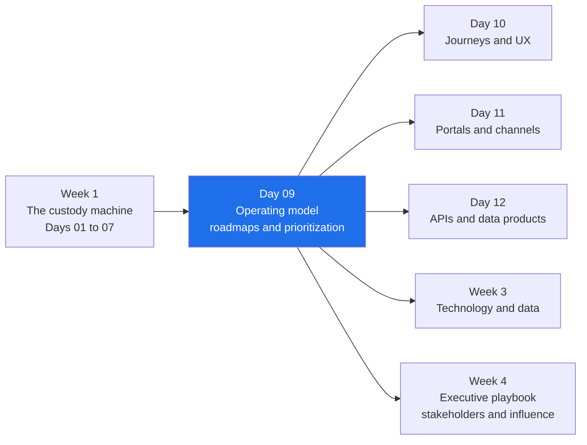
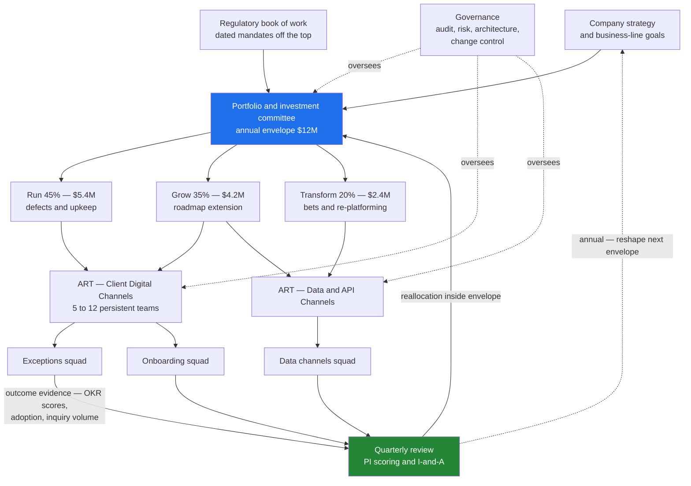
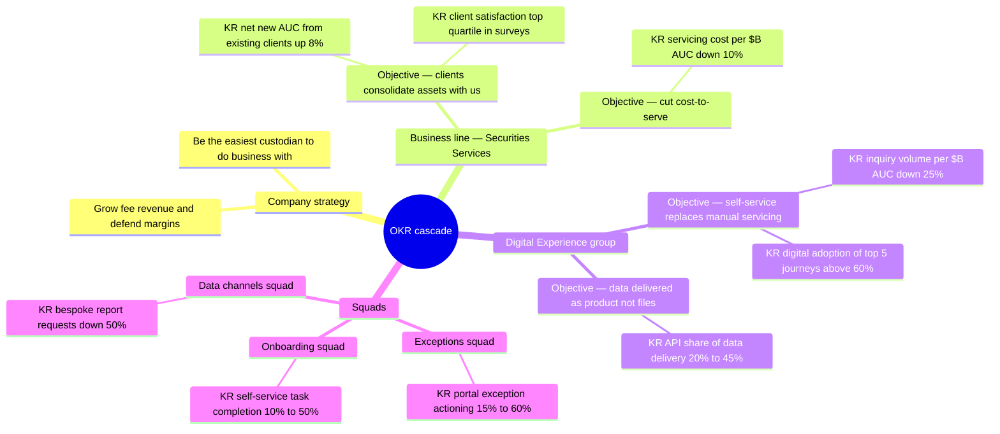
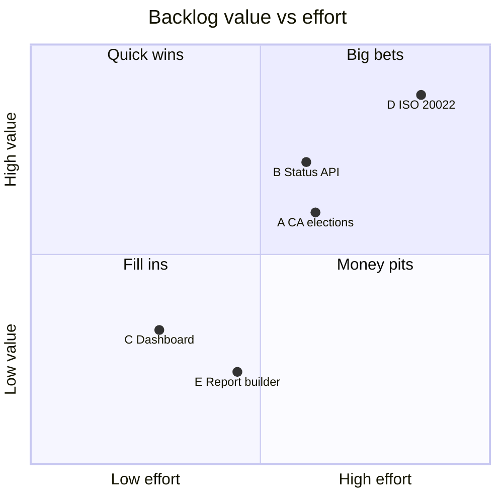
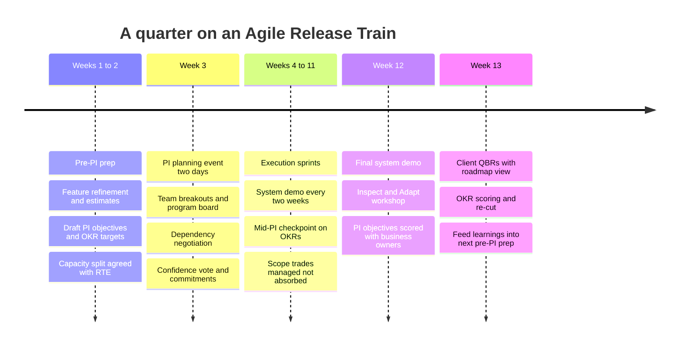

# Day 09 — Product Operating Model, Roadmaps and Prioritization

> Week 2 · Product and Digital Experience · Est. reading time: 60–90 min

---

## 🎯 Learning objectives

By the end of today you can:

- Explain why large banks default to annual project/CapEx funding, what it does to product teams, and how the hybrid model (persistent teams inside an annual investment envelope) actually works — including how a $12M envelope gets carved up.
- Place your organization honestly on the empowered-team vs feature-factory spectrum (Cagan's framing) and name what a VP can realistically shift in 12 months versus what is structural.
- Work productively *inside* SAFe — PI planning, ARTs, program boards — while steering it toward outcomes: OKRs in PI objectives, capacity allocation guardrails, measurable business results per increment.
- Disambiguate Product Manager, Product Owner, Business Analyst, and Delivery Lead/RTE with a RACI you can defend in a role-mapping meeting.
- Write custody-relevant OKRs that measure outcomes, spot the three classic anti-patterns, and cascade objectives from company strategy to squad level.
- Run RICE and WSJF on a realistic backlog, show the arithmetic, explain where the two frameworks disagree, and articulate when judgment overrides both.
- Say no to a top-client roadmap escalation with data and a script, not just conviction.

---

## 🧭 Where this fits

Week 1 taught you what the custody machine *does*. Week 2 is about how you change it. Today is the hinge chapter of the whole book: the operating model — who gets funded, who decides, on what cadence, measured how — determines whether every idea in Days 10–14 (journeys, portals, APIs, data products) ships as an outcome or dies as a slide. Most new product VPs in banks fail not on product judgment but on operating-model navigation: they bring a startup playbook to an institution that funds projects annually, plans in 12-week increments, and carries a non-negotiable regulatory book of work. Today gives you the map of that institution and the levers that actually move.

---

## Part 1 — Core concepts

### 1.1 How the money moves: project funding vs product funding

Everything downstream — team stability, roadmap honesty, even how meetings feel — is set by one upstream choice: **how work gets funded.**

**Model A — annual project/CapEx funding.** Each year, sponsors write business cases ("Portal Modernization Phase 3, $4.2M, NPV positive by year 3"). An investment committee approves a portfolio of *projects*. Teams are assembled per project (often with contractors), deliver the scope, and disband. Finance capitalizes the build cost as an intangible asset and amortizes it.

**Model B — persistent product funding.** Long-lived teams own products. Funding is a *capacity* decision ("the Digital Experience group is 12 teams, ~$18M/yr fully loaded"); leadership steers by adjusting team allocation against outcomes, quarterly, not by re-chartering teams annually.

Banks default to Model A for reasons that are rational *from where the CFO and CRO sit*, not because nobody has read Marty Cagan:

| Force | Why it pushes toward project funding |
|---|---|
| **Regulatory change book** | Regulators impose dated mandates (ISO 20022 migration, T+1, resilience rules). These arrive as scoped, dated obligations — they *look like projects*, and boards want project-style tracking against them. |
| **CFO capitalization** | Software build cost can be capitalized (spread over 5–7 years) only with auditable evidence that spend maps to an asset under construction. Project business cases and timesheets generate that evidence cheaply. Persistent-team costing can also be capitalized (by feature/epic), but it takes more mature finance tooling that many banks haven't built. |
| **Audit and governance** | Internal audit and program governance are built around stage gates: initiation, funding approval, delivery, closure, benefits realization. A project has all of these; a persistent team has none, natively. |
| **Annual planning ritual** | Budgets are set once a year in Q4. A project list is a legible thing to negotiate in a budget meeting; "trust the team allocation" is not. |

**What project funding does to teams** — and this is the part you will feel weekly:

- **Team churn.** People roll off when "the project" ends, taking domain knowledge with them. Rebuilding a custody-domain-fluent team takes 6–12 months; annual funding resets that clock.
- **Scope worship.** The business case promised scope X for $Y; delivering X becomes the goal even when discovery shows X is wrong. Changing course means re-papering the business case — so nobody does.
- **Benefits fiction.** Business cases claim benefits ("$3M efficiency saves") that no one measures after go-live, because the team that would measure them has disbanded.
- **January stampede, December famine.** Q1 is spent mobilizing (hiring contractors, spinning up environments); Q4 is spent burning budget or starving, depending on the portfolio's health.

**The hybrid reality.** Most large custodians and universal banks have converged on a hybrid: **persistent teams (or ARTs) that live year to year, funded through an annual investment envelope** allocated top-down, with quarterly reprioritization inside the envelope. Teams don't disband; the *work* they pull is re-negotiated annually and re-sequenced quarterly. This is genuinely workable — if the VP defends the team boundary and the allocation guardrails (Part 3).

**Worked numbers — a $12M Digital Experience envelope.** Say your group gets a $12M annual investment envelope (excluding baseline production support). A representative split:

| Bucket | Share | $ | What it is | Mandatory? |
|---|---|---|---|---|
| **Run** | 45% | $5.4M | Keep-the-lights-on: defect burn-down, minor enhancements, currency upgrades, vulnerability patching, platform version upkeep | Mostly mandatory (you can squeeze ~$1M at real risk) |
| **Grow** | 35% | $4.2M | Extend what exists: new portal modules, API expansion, onboarding new client segments to existing capabilities | Discretionary — this is your real roadmap money |
| **Transform** | 20% | $2.4M | Bets: re-platforming, new data products, GenAI-assisted servicing | Discretionary and first to be cut mid-year |

Now overlay the mandatory/discretionary cut: the **regulatory book of work** (say ISO 20022 portal changes plus a resilience mandate, ~$2.5M) is taken off the top and doesn't care which bucket it notionally sits in. Net discretionary money — the part where your prioritization frameworks actually apply — is roughly **$12M − $5.4M run − $2.5M regulatory ≈ $4.1M**, about a third of the headline envelope. Every VP who quotes their "budget" without doing this subtraction is negotiating against themselves.

**The whole operating model on one page** — how money, strategy, and governance flow down to teams, and how evidence flows back up:

Read the two loops carefully: the **quarterly loop** (teams → evidence → reallocation inside the envelope) is where a VP steers; the **annual loop** (evidence → next year's envelope) is where the operating model itself gets reshaped — but only if the quarterly loop actually produces outcome evidence rather than delivery status.

### 1.2 The empowered-team ↔ feature-factory spectrum

Marty Cagan's distinction: **empowered product teams** are given *problems to solve* and are accountable for outcomes; **feature factories** are given *features to build* and are accountable for output. Neither pole exists in pure form; the honest question is where you sit and which notches you can move.

| Dimension | Feature factory (typical large-bank state) | Empowered team | What a VP can shift in 12 months |
|---|---|---|---|
| Work source | Stakeholder requests, sales commitments, regulatory list | Problems derived from strategy and discovery | **Partially.** Install an intake filter; convert top 5 asks into problem statements. Can't stop regulatory/contractual intake. |
| Success measure | On-time, on-scope delivery ("PI predictability") | Outcome movement (adoption, inquiry reduction) | **Yes.** Add outcome KRs to every PI objective; report them beside delivery metrics. Cheapest, highest-leverage move you have. |
| Discovery | Little; BA writes requirements from stakeholder interviews | Continuous; PM/design test with clients weekly | **Partially.** Fund 1–2 designers and a research cadence; get 5 clients into a design-partner program. Full continuous discovery needs client-coverage cooperation. |
| Team composition | Rotating contractors, shared architects, proxy POs | Stable PM, design, engineering trio | **Slowly.** Convert 2–3 key contractor roles to FTE; co-locate a real PM with the top two teams. Full stability fights the funding model. |
| Tech decisions | Central architecture board approves | Team decides within guardrails | **Barely.** Architecture governance in a bank is entangled with risk and regulatory accountability. Negotiate faster lanes, not autonomy. |
| Roadmap | Dated feature list, 12–18 months | Outcomes now/next/later | **Yes.** One artifact, multiple views (§2.2). Fully within your gift. |

Honest placement: most custodian digital teams sit **two-thirds toward feature factory**, and the realistic 12-month goal is not "empowered teams" — it's *outcome-accountable teams inside a delivery-governed system*. That is a real and valuable improvement, and framing it as such (rather than as a failed transformation) is itself a VP skill.

### 1.3 SAFe in a bank: the realistic take

Most large banks that "did agile" landed on **SAFe** (Scaled Agile Framework) or a homegrown derivative. Core mechanics you'll live inside:

- **ART (Agile Release Train):** 5–12 teams (~50–125 people) around a value stream — e.g., "Client Digital Channels ART." Runs on a synchronized cadence.
- **PI (Program Increment) planning:** every 10–12 weeks, the entire ART plans the next increment together over ~2 days. Output: PI objectives per team, a **program board** of features and dependencies strung across sprints, and a confidence vote.
- **RTE (Release Train Engineer):** chief scrum master of the ART; runs the cadence, chases dependencies.
- **System demo** each sprint or two; **Inspect and Adapt (I&A)** workshop at PI end.

**What SAFe is genuinely good for in a bank** — say this out loud, because SAFe-bashing reads as naive here:

1. **Dependency visibility.** Your portal feature needs a settlements-platform API, a data-warehouse feed, and an entitlements change — three teams in three reporting lines, possibly three countries. The program board makes that visible 10 weeks out instead of discovering it in UAT.
2. **Synchronized cadence across tech, ops, and compliance.** Operations readiness, model risk review, and client communications can plan against a known drumbeat.
3. **Audit and regulator comfort.** PI objectives, capacity records, and I&A artifacts are exactly the evidence trail auditors want for change governance. This is not theater to them; it is control.

**Its failure modes** — equally real:

1. **Output theater.** "PI predictability 94%!" — of what? Teams learn to commit to safely deliverable output; the metric measures promise-keeping, not value.
2. **12-week batching.** Anything conceived in week 2 waits ~14 weeks to start. For client-facing digital work, that's an eternity; competitors on continuous delivery ship the fix in days.
3. **Proxy product owners.** The "PO" is a BA or ops SME relaying requirements, with no authority over priorities and no client contact. The empowered-team model dies exactly here.

**How a VP works within it while pushing toward outcomes.** You will not remove SAFe; the change-governance stack is built on it. You *can*:

- **Bring OKRs into PI objectives.** SAFe already asks for "business value" scoring on PI objectives (1–10, scored by business owners at planning and re-scored at I&A). Replace vibes-based scoring with your KRs: a PI objective is only "10" if it moves a named key result. Insist every team has **at least one PI objective phrased as a measurable business outcome**, not a feature title.
- **Protect capacity allocation.** Negotiate — with the RTE, business owners, and technology lead — a standing split, e.g. **60% roadmap / 20% tech debt and resilience / 10% regulatory-mandatory / 10% run and defects**, reviewed at every PI planning. Without an explicit split, regulatory and defects silently eat the roadmap and you discover it in the I&A retro.
- **Exploit the cadence.** PI boundaries are natural checkpoints for OKR scoring, roadmap re-cuts, and client QBR inputs. Fighting the 12-week rhythm wastes energy; loading your agenda onto it compounds.

### 1.4 Roles disambiguated: PM vs PO vs BA vs Delivery Lead/RTE

In banks these four roles blur, and role confusion is a top source of both delivery friction and career grievance. A defensible RACI (R = Responsible, A = Accountable, C = Consulted, I = Informed):

| Activity | Product Manager | Product Owner | Business Analyst | Delivery Lead / RTE |
|---|---|---|---|---|
| Discovery and client research | **A/R** | C | C (analysis support) | I |
| Product strategy and roadmap | **A/R** | C | I | C (feasibility, sequencing) |
| Business case and funding ask | **A/R** | C | R (data, cost model) | C (estimates) |
| Backlog priority (feature level) | **A** | **R** | C | I |
| Story detail and acceptance criteria | I | **A** | **R** | I |
| Stakeholder management (clients, sales, exec) | **A/R** | I | I | C |
| Stakeholder management (ops, compliance detail) | C | R | **R** | C |
| Ceremonies (planning, refinement, PI logistics) | I | R | C | **A/R** |
| Dependency management across teams | C | C | I | **A/R** |
| Production incidents (client comms, priority calls) | **A** (severity and client stance) | R (backlog triage) | C (impact analysis) | **R** (coordination, ops bridge) |
| Benefits/outcome measurement | **A/R** | C | R (reporting) | I |

Three practical notes. **First:** if one person holds both PM and PO for more than two teams, discovery stops happening — the ceremony load wins. **Second:** the BA role is not a legacy artifact; in custody, translating "reduce settlement-exception effort" into precise rules across 20 markets and 3 legacy platforms is real analytical work no PM has time for. Value it. **Third:** where the PO is a proxy (an ops SME with no priority authority), name it explicitly and decide deliberately whether to accept it (Part 3.3) — the silent version is the damaging one.

---

## Part 2 — The system deep dive

### 2.1 OKRs done properly (custody edition)

**OKR mechanics in one paragraph.** An **Objective** is a qualitative, memorable statement of a change you want in the world. **Key Results** (2–4 per objective) are the measurable evidence the change happened — *outcomes, not activities*. Scored 0.0–1.0; a healthy target-setting culture lands around 0.6–0.8 on stretch KRs. Cadence: annual objectives, quarterly KRs, reviewed monthly.

**Bad vs good — three custody-relevant pairs:**

| | ❌ Bad (feature list wearing an OKR costume) | ✅ Good (outcome-based) |
|---|---|---|
| **Pair 1 — exceptions** | O: Deliver settlement exception module. KR1: Ship exception dashboard by June. KR2: Complete API integration. KR3: Migrate 100% of clients to new screen. | **O: Clients resolve settlement exceptions without calling us.** KR1: Client inquiry volume per $B AUC down 25%. KR2: Median time-to-resolution 4h → 90min. KR3: Share of exceptions actioned in portal (vs email/phone) 15% → 60%. |
| **Pair 2 — onboarding** | O: Improve onboarding. KR1: Launch onboarding tracker. KR2: Hold 12 client training sessions. KR3: Publish new user guides. | **O: New funds go live without heroics.** KR1: Median account-opening-to-first-settled-trade 45 → 20 business days. KR2: Onboarding tasks completed by client self-service 10% → 50%. KR3: Onboarding-related escalations to relationship managers down 40%. |
| **Pair 3 — data delivery** | O: Modernize reporting. KR1: Decommission legacy report engine. KR2: Deliver 30 new report templates. KR3: 100% of reports on new platform. | **O: Clients trust and consume our data without asking for bespoke files.** KR1: Bespoke report-build requests down 50%. KR2: API/data-feed share of total data delivery 20% → 45%. KR3: Report-related data-quality tickets per month 80 → 30. |

Read the bad column carefully: every KR is *shippable and verifiable* — that's why teams love them and why they're worthless. Shipping the module and clients still phoning is scored 1.0 fail-as-success.

**The cascade.** OKRs cascade by *contribution*, not decomposition — each level asks "which higher-level result do we move, and what's our measurable contribution?"

Notice the group-level KR "inquiry volume per $B AUC down 25%" *is* a direct contribution to the business line's cost-to-serve KR, and the exceptions squad's adoption KR is a driver of the group's inquiry KR. If you can't draw that arrow, the squad OKR is decoration.

**Anti-patterns to police:**

1. **KRs as feature lists** — the bad column above. Test: "could we score 1.0 and the client notice nothing?" If yes, rewrite.
2. **Sandbagging** — committing to results already in the bag so the dashboard stays green. Symptom: every KR lands 0.95–1.0. Fix: publish attainment *distributions* and celebrate a well-reasoned 0.5 louder than a sandbagged 1.0.
3. **100%-attainment culture** — the bank-flavored twin of sandbagging: annual-appraisal systems that punish misses convert OKRs back into commitments. Fix: formally decouple OKR scores from performance ratings (say it in writing) and separate *committed* KRs (regulatory, contractual — must hit) from *stretch* KRs (target 0.7).

### 2.2 Roadmap formats: one artifact, multiple views

There is no single right roadmap format — there is a right format **per audience**. The failure mode is maintaining three disconnected documents. The fix: one backlog/outcome core, three rendered views.

| Format | Structure | Best audience | Strength | Risk |
|---|---|---|---|---|
| **Now / Next / Later** | Three columns, problems and bets, no dates | Your teams; peer product groups; discovery-heavy areas | Honest about uncertainty; invites discovery; cheap to maintain | Executives read it as evasive ("when?"); useless for contractual commitments |
| **Outcome-based** | Objectives with KRs per horizon, features as supporting detail | Leadership, business-line heads, strategy reviews | Ties investment to results; survives feature churn | Requires OKR maturity; can hide delivery reality if no dates anywhere |
| **Dated timeline** | Features on a calendar, quarters/months | Clients, sales, regulators, contract schedules | Meets B2B reality — clients plan *their* books of work around your dates | Becomes a promise inventory; every slip is a client conversation; kills discovery if it's the master document |

**The B2B custody reality:** you cannot escape dated roadmaps. Clients embed delivery dates in contracts and side letters; regulators publish migration deadlines (an ISO 20022 date does not care about your discovery process); client operations teams must budget *their* testing capacity quarters ahead. The mature pattern is a **thin dated layer over an outcome core**:

- The dated layer contains **only** externally committed items: regulatory dates, contractual commitments, published client-testing windows. Keep it deliberately small — every entry is a liability.
- Everything else lives in now/next/later or outcome view, and client-facing versions say "planned for H2, date confirmed one PI ahead."
- **Rule: nothing enters the dated layer without a named accountable owner and a confidence check with the delivering teams.** Sales adding dates unilaterally is how portfolios die; make the escalation path for that explicit.

### 2.3 Prioritization, fully worked: RICE and WSJF on a real backlog

Five items competing for your discretionary capacity next PI:

- **(A) Corporate-action election portal module** — clients submit voluntary CA elections digitally instead of faxed/emailed instructions (Day 05 showed why this is high-risk manual work today).
- **(B) Settlement-status API for clients** — real-time settlement status so client ops teams stop calling and start polling.
- **(C) Dashboard redesign** — modernize the portal landing dashboard; frequent client survey comment.
- **(D) Regulatory ISO 20022 portal changes** — screens, exports, and client reporting must handle richer ISO 20022 message data by the market deadline.
- **(E) Client-specific report builder** — one large client ($30M annual relationship) wants a bespoke report-builder capability, escalated via their relationship manager.

**RICE** = (Reach × Impact × Confidence) ÷ Effort. Reach = client organizations materially touched per quarter; Impact on a 0.25–3 scale (3 = massive per-client value); Confidence as a fraction; Effort in person-months.

| Item | Reach | Impact | Confidence | Effort (PM) | Arithmetic | RICE |
|---|---|---|---|---|---|---|
| C Dashboard redesign | 400 | 0.5 | 0.8 | 4 | 400 × 0.5 × 0.8 = 160; 160 ÷ 4 | **40.0** |
| A CA election module | 120 | 2.0 | 0.8 | 8 | 120 × 2.0 × 0.8 = 192; 192 ÷ 8 | **24.0** |
| B Settlement-status API | 150 | 2.0 | 0.7 | 9 | 150 × 2.0 × 0.7 = 210; 210 ÷ 9 | **23.3** |
| D ISO 20022 changes | 400 | 0.5 | 1.0 | 12 | 400 × 0.5 × 1.0 = 200; 200 ÷ 12 | **16.7** |
| E Report builder (1 client) | 5 | 3.0 | 0.9 | 5 | 5 × 3.0 × 0.9 = 13.5; 13.5 ÷ 5 | **2.7** |

RICE ranking: **C > A > B > D > E.** The dashboard wins on breadth-per-effort; the single-client builder is crushed by Reach, exactly as designed.

**WSJF** (Weighted Shortest Job First, from Reinertsen via SAFe) = **Cost of Delay ÷ Job Size**, where CoD = User-Business Value + Time Criticality + Risk Reduction/Opportunity Enablement, each scored on a relative Fibonacci scale (1, 2, 3, 5, 8, 13, 20) *across the compared set*.

| Item | User-Biz Value | Time Criticality | Risk Red. / Opp. Enable | CoD (sum) | Job Size | Arithmetic | WSJF |
|---|---|---|---|---|---|---|---|
| D ISO 20022 changes | 5 | 20 | 8 | 33 | 13 | 33 ÷ 13 | **2.54** |
| B Settlement-status API | 8 | 3 | 8 | 19 | 8 | 19 ÷ 8 | **2.38** |
| A CA election module | 8 | 5 | 3 | 16 | 8 | 16 ÷ 8 | **2.00** |
| C Dashboard redesign | 3 | 2 | 1 | 6 | 3 | 6 ÷ 3 | **2.00** |
| E Report builder | 2 | 5 | 1 | 8 | 5 | 8 ÷ 5 | **1.60** |

Scoring rationale worth noting: D's Time Criticality is 20 because the cost of delay is nonlinear — miss the market deadline and the cost is regulatory findings and client-forced workarounds, not lost revenue. B's Risk Reduction/Opportunity Enablement is 8 because a status API is *platform*: it enables the exceptions OKR, reduces inquiry load, and opens the API-channel strategy. A's CA module scores high on value (manual elections are the riskiest thing in the portal's domain) but its time criticality is moderate — the risk exists this quarter and next.

WSJF ranking: **D > B > A ≈ C > E.**

**Where the frameworks disagree, and why:**

| Disagreement | Cause | Verdict |
|---|---|---|
| RICE crowns **C** (dashboard); WSJF ranks it mid-pack | RICE rewards broad shallow reach at low effort; WSJF's CoD asks "what does *delay* cost?" — and delaying a cosmetic redesign costs almost nothing | WSJF is closer to the truth here; do C opportunistically, not first |
| WSJF crowns **D** (regulatory); RICE ranks it fourth | RICE has **no time dimension** — it literally cannot see a deadline. WSJF's time-criticality term exists precisely for this | D doesn't belong in either contest: it's *mandatory*. Fund it off the top (your 10% regulatory allocation), then prioritize the rest. Putting mandates in a scoring contest wins you nothing and teaches stakeholders the scores are theater |
| Both frameworks bury **E** (single-client builder) | Reach of 5 and modest CoD — arithmetically correct | And yet this is a $30M relationship's named ask. The frameworks are inputs; the decision needs the escalation protocol (§ Part 3.5). Sometimes the right answer is still no — but *shown*, not asserted |

**Judgment overrides — the honest rules:** frameworks exist to (1) force explicit assumptions, (2) make comparisons legible, (3) give you a defensible artifact for stakeholder conversations. They do not capture strategic sequencing (B before A because the API layer serves both), political capital, or contractual exposure. Use the scores to *structure* the argument; never let a spreadsheet make a call you can't explain in plain language.

### 2.4 A quarter in the life: the planning rhythm

The quarterly (PI) rhythm, weeks 1–13, as you will actually live it:

VP notes on this rhythm:

- **Weeks 1–2 are where the PI is actually won.** If features arrive at PI planning unrefined, teams will plan padding, not outcomes. Your PMs' job in prep weeks: problem framing, thin slicing, and pre-negotiating the top three cross-team dependencies *before* the event.
- **The mid-PI checkpoint (around week 7) is your invention to install** — SAFe doesn't mandate it. Thirty minutes per team: are the leading indicators of our PI-objective outcomes moving? If not, trade scope now, not at the I&A postmortem.
- **Sequence QBRs after I&A**, so client conversations carry fresh, scored results ("we committed to cutting exception resolution time; here's the graph") rather than promises. QBR feedback then lands exactly in time for the next pre-PI prep — the loop closes.

### 2.5 Stakeholder-driven vs strategy-driven roadmaps: saying no with data

Every custody digital roadmap is pulled by four forces: **regulatory mandates** (non-negotiable), **client escalations** (loud), **sales commitments** (contractual or near-contractual), and **strategy** (quiet, easily crowded out). A purely stakeholder-driven roadmap is a queue sorted by seniority of the person shouting; a purely strategy-driven roadmap in B2B custody is fantasy — your top 10 clients may be 40%+ of revenue, and their asks *are* strategic information.

**The top-client escalation problem.** A $30M client's COO tells your relationship manager they "need" the report builder (item E) and the RM's head escalates to your business-line CEO, who forwards it to you with "thoughts?". The trap is binary framing: cave (roadmap becomes client-of-the-week) or refuse (you're now "the blocker" in the client's QBR). The escape is a standing, data-driven protocol:

**Step 1 — size it honestly on three axes:**

| Axis | Question | Item E answer |
|---|---|---|
| Ask volume | How many clients have asked for substantially this? | 3 of 400 (one loudly) |
| Revenue at risk | Is this ask tied to retention risk, RFP, or contract renewal — evidenced how? | $30M relationship; renewal in 18 months; no RFP signal; RM rates relationship "strong" |
| Strategic fit | Does it advance a group OKR or platform bet? | Partially — conflicts with "kill bespoke reports" KR; the *underlying data need* fits the API strategy |

**Step 2 — apply the "swap, don't add" rule.** Capacity is fixed. The only honest response to "add E" is "instead of what?" Put the trade on one page: "E costs 5 person-months. That is the CA-election module slipping a full PI — the item addressing our highest operational-risk journey, affecting 120 clients. Which do we choose?" Executives almost never pick E *when the displaced item is named*. Vague capacity claims get overridden; specific swaps get respected.

**Step 3 — offer routes that aren't roadmap slots:**

- **Paid services route:** a client-funded, ring-fenced delivery (professional services or a partner SI builds against your APIs). The client's urgency meets a price signal; genuine need survives it, vanity asks don't.
- **Roadmap-adjacent route:** "The report builder as specified, no. But the settlement-status API next PI gives your ops team the underlying data, and here are three clients building exactly your report on it."
- **Design-partner route:** if the ask *does* fit strategy, invite the client in as a design partner on the strategic version — they get influence and early access; you get discovery and a reference client.

**The script, condensed:** *"Here's the data on the ask: 3 of 400 clients, $30M relationship, renewal in 18 months, partial strategic fit. Building it as specified displaces the corporate-action module — our highest-risk journey, 120 clients. I recommend we decline the bespoke build, offer the client-funded route, and bring them in as a design partner on the status API, which solves their underlying need on-strategy. If we believe the retention risk justifies more, let's say that explicitly and choose what to swap out."* You have not said no to the client; you have given your executives an informed decision with named costs — which is the actual job.

---

## Part 3 — The VP lens

The operating model is where you personally earn your title. Real decisions you will face:

### 3.1 Fight the funding model or work it?

**Decision:** you inherit annual project funding with business-case gates. Do you campaign for persistent product funding or optimize within?

**Recommendation: work it for year one, reshape it from inside.** Concretely: (1) keep teams persistent *de facto* by writing business cases around existing teams ("this funds the Exceptions squad's 2026 book") rather than assembling new ones; (2) attach outcome KRs to every business case and *actually report benefits* quarterly — you become the only leader whose benefits are real, which buys enormous credibility; (3) partner with finance on capitalizing persistent-team work at epic level — solve the CFO's problem and the CFO stops defending project funding. Open warfare on the funding model in year one marks you as someone who doesn't understand banks; making the current model produce evidence for the better one marks you as someone who does.

### 3.2 How many ARTs/teams can one VP steward?

Rules of thumb from practice: a VP can meaningfully steward **1–2 ARTs (roughly 8–15 teams, 100–180 people)** — attending both PI plannings, knowing every PM personally, reading every team's PI objectives. Beyond that you need product directors per ART and your role shifts to portfolio, standards, and talent. Warning sign you're over-extended: you learn about a PI commitment for the first time when it slips. If you're given three-plus ARTs without directors, your first hire is not a PM — it's a director, and your first artifact is a decision-rights note saying which calls stay with you (capacity splits, dated-layer entries, top-client escalations) and which devolve.

### 3.3 When to accept a proxy-PO arrangement

Purists say never. Reality: for a **deep-ops internal-facing team** (e.g., reconciliations tooling), an ops SME as PO with a PM covering two such teams is acceptable and sometimes better — the SME's domain depth outweighs generic PM skills. For any **client-facing journey** (portal, APIs, onboarding), a proxy PO is unacceptable: the person setting sprint priorities must have direct client exposure and priority authority. Your test: *can this PO reorder the backlog against a stakeholder's wish and survive?* If not, they're a proxy. Accept it knowingly for internal tooling; fix it within two PIs for client-facing teams, even at the cost of a headcount fight.

### 3.4 Defending the capacity allocation

The 60/20/10/10 split (roadmap / tech-debt-and-resilience / regulatory / run-defects) survives only if defended at three moments: **PI planning** (the split is on the wall; features are tagged; the RTE reports actuals-vs-split as a standing metric); **mid-PI** (a "sev-2 defect surge" or a "quick regulatory clarification" arrives — it comes *out of a named bucket*, publicly, or the split is fiction); and **annual planning** (when the envelope is cut 15%, the cut lands proportionally unless you *choose* otherwise — the silent default is that roadmap absorbs 100% of any cut). The 20% tech-debt line needs special defense: pair with your engineering lead and translate it into risk language executives respect ("this is what keeps portal availability at 99.9% and our resilience findings closed"), not developer-happiness language.

### 3.5 Escalation protocol for top-client asks

Install §2.5 as a *standing protocol*, agreed with relationship management **before** the first escalation: every client ask above a size threshold gets the three-axis sizing within 5 business days; anything entering the roadmap displaces a named item; client-funded and design-partner routes are always priced as alternatives. The protocol's real function is not filtering asks — it's converting "the VP said no" into "the process produced a recommendation the VP stands behind," which is the difference between spending political capital and accruing it.

### 3.6 Metrics that tell you the operating model is working

| Metric | What it tells you | Healthy signal |
|---|---|---|
| % capacity on outcome-tagged work vs mandates and run | Whether discretionary strategy is real or squeezed to zero | ≥ 50% and stable across PIs |
| PI predictability (committed vs delivered objectives) | Promise-keeping — necessary, insufficient | 80–95%. Persistently 100% means sandbagging |
| OKR attainment **distribution** | Target-setting culture | Centered ~0.7, real spread. A wall of 1.0s is a lie; a wall of 0.3s is chaos |
| Lead time (idea approved → in clients' hands) | Whether 12-week batching is strangling responsiveness | Trending down; small items shipping mid-PI |
| Benefits follow-through | % of business cases with outcomes actually measured 2 quarters post-delivery | > 80% — most banks sit near 20% |
| Dated-layer size and slip rate | Promise inventory health | Small layer, slip rate < 10% |

### 3.7 Questions to ask your delivery leads and RTEs (week one)

1. "Show me last PI's plan vs actuals **by capacity bucket** — how much roadmap did regulatory and defects actually eat?"
2. "Which PI objectives last quarter were phrased as business outcomes, and how were they scored at I&A — by whom?"
3. "What's our real lead time for a small client-facing change — approval to production? Walk me through the last one."
4. "Where are our proxy POs, and which client-facing team worries you most on that front?"
5. "What's on the dated roadmap layer, who put each item there, and which entries would you *not* have committed?"
6. "When did we last drop or swap a committed feature mid-PI because evidence changed — and what happened to whoever proposed it?" (The answer tells you whether you run a learning system or a promise-keeping system.)

---

## 🏦 State Street context

*Representative and public-knowledge framing — verify specifics with your own org chart and intranet in week one.*

- **Scaled-agile-style delivery is the norm.** State Street, like its peers (BNY, JPMorgan Securities Services, Northern Trust), publicly describes agile transformation programs, product-aligned technology organizations, and train/quarterly-increment planning constructs. Expect ART-like structures, PI-style planning cadences, and the vocabulary of this chapter — possibly under house names. Your job is not to grade the framework but to locate the levers: who sets capacity splits, who owns PI objective scoring, where OKRs (if present) attach.
- **Global delivery is genuinely global.** State Street operates large technology and operations hubs in **India (notably Hyderabad and Bangalore), Poland (Kraków and Gdańsk), and China (Hangzhou and Zhejiang region)**, alongside US and Ireland centers. Practical consequences: PI planning spans time zones (expect split ceremonies and recorded breakouts); "the team" is rarely co-located with the PM; and follow-the-sun is an asset for run work but a tax on discovery. Building direct client exposure for POs sitting in Hyderabad is a real problem you will own — rotations, recorded client sessions, and design-partner calls scheduled for IST are the usual tools.
- **The regulatory book of work is non-negotiable and large.** ISO 20022 migration waves, T+1 settlement ripple effects across markets, operational-resilience regimes (DORA in the EU, equivalents elsewhere) all land dated obligations on client-facing digital surfaces. In any given year, expect a material slice of your envelope to be pre-committed before strategy gets a vote — plan your discretionary math (§1.1) accordingly.
- **Client-committed dates live in contracts.** In institutional custody, large mandates come with negotiated onboarding milestones, deliverables schedules, and sometimes named platform capabilities with dates. Sales and client-delivery organizations will treat these as immovable — because legally, some are. This is why the thin-dated-layer discipline (§2.2) matters here more than at a product company: your dated layer has *lawyers*.
- **You operate in a matrix.** A VP of Product Development (Digital Experience) at a large custodian typically sits between: a **product/business line** (who owns P&L and client outcomes), **global technology** (who owns engineers, architecture standards, and much of the delivery machinery), and **client delivery/relationship management** (who own the client voice and escalate the asks). Funding, headcount, and priorities each flow through different lines of this matrix. The operating-model skills in this chapter — capacity guardrails, escalation protocols, outcome evidence — are precisely the currency that works in all three directions at once.

---

## 💪 Exercises

**Exercise 1 — Score your own backlog both ways (45 min).** Take five real items from your current (or most recent) backlog. Build the RICE table (§2.3) with explicit Reach definitions and honest Confidence, then the WSJF table with the three CoD components. Compare rankings. For every disagreement between the frameworks, write one sentence naming *which assumption* causes it (no time dimension? reach vs relative value? effort vs job-size scaling?). Finish with your actual recommended sequence and a three-sentence justification that references — but is not dictated by — the scores.

**Exercise 2 — Rewrite a feature-list OKR (20 min).** Take this real-world-shaped OKR: *"Objective: Deliver the client portal roadmap. KR1: Launch redesigned dashboard by end of Q2. KR2: Ship 8 of 10 committed features. KR3: Complete ISO 20022 screen changes."* Rewrite it as one outcome objective with three measurable KRs (baseline → target), then answer: which of the original KRs was legitimate as a *committed* (non-stretch) item, and where should it live instead of the OKR?

**Exercise 3 — Derive a now/next/later from a dated roadmap (30 min).** Sketch a typical 12-month dated roadmap with 10 items (invent them from this week's chapters: portal modules, APIs, data feeds). Now produce the two derived views: (a) the thin dated layer — which items *genuinely* must keep dates (regulatory, contractual) — and (b) a now/next/later of the rest, phrased as problems/outcomes rather than features. Count how many of the 10 survived with dates. If it's more than 4, challenge each one: who exactly committed it, to whom, in writing?

---

## ❓ Self-check quiz

1. Give three reasons a large bank rationally defaults to annual project funding, and name the single most damaging effect on product teams.
2. Your ART reports 98% PI predictability for four consecutive PIs. Why should this worry rather than delight you, and what two metrics would you put beside it?
3. In the worked example, RICE ranked the dashboard redesign first while WSJF ranked ISO 20022 first. Explain the structural cause of each result and where the ISO 20022 item should actually be decided.
4. A PO on your client-facing exceptions team is an operations SME who cannot reorder the backlog without stakeholder sign-off. What is this arrangement called, when is it acceptable, and what's your test?
5. Your largest client escalates a bespoke feature ask via your business-line CEO. Name the three data axes you size it on and the rule that governs whether it enters the roadmap.

Answers

1. Reasons (any three): the regulatory change book arrives as dated, scoped obligations that fit project tracking; CFO capitalization of software build cost is cheapest to evidence with project business cases and timesheets; internal audit and governance are built around stage gates that projects natively provide; annual budget rituals need a legible project list to negotiate. Most damaging effect: **team churn** — teams disband with the project, destroying domain knowledge that takes 6–12 months to rebuild, which quietly caps the organization's maximum competence.

2. Persistently near-100% predictability usually means **sandbagging** — teams committing only to safely deliverable output, i.e., the metric measures promise-keeping, not value or ambition. Put beside it: (a) an **outcome measure** — % of PI objectives phrased as business outcomes and their scored movement (or OKR attainment distribution, healthy ≈ 0.7 with spread); (b) **lead time** from approval to in-clients'-hands, to expose whether safe commitments are also slow ones.

3. RICE ranked the dashboard first because RICE rewards **broad reach at low effort** and has **no time dimension** — it cannot see a deadline, so ISO 20022's date is invisible to it. WSJF ranked ISO 20022 first because its **time-criticality** component captures the nonlinear cost of missing a regulatory date. The real answer: ISO 20022 is *mandatory* and shouldn't compete in a discretionary scoring contest at all — fund it off the top from the regulatory capacity allocation, then run the frameworks on genuinely discretionary items.

4. A **proxy product owner**. Acceptable for deep-ops, internal-facing teams where the SME's domain depth outweighs generic product skills (e.g., reconciliations tooling), and accepted *explicitly*, not by drift. Unacceptable for client-facing journeys. The test: *can this PO reorder the backlog against a stakeholder's wish and survive?* If not, they are a proxy regardless of title.

5. Axes: (a) **ask volume** — how many clients want substantially this; (b) **revenue at risk** — retention/RFP/renewal exposure, with evidence, not vibes; (c) **strategic fit** — does it advance a group OKR or platform bet. Governing rule: **swap, don't add** — fixed capacity means the ask enters the roadmap only by displacing a *named* item, and that trade is put explicitly to the escalating executives. Alternatives always offered: client-funded/partner delivery, a roadmap-adjacent solution to the underlying need, or design-partner status on the strategic version.

---

## 🔑 Key takeaways

- **The funding model is the operating model.** Annual project funding produces team churn, scope worship, and benefits fiction; the workable bank pattern is persistent teams inside an annual envelope — and your real discretionary money is the envelope minus run minus regulatory (≈ a third of the headline).
- **Don't fight SAFe; load your agenda onto it.** Its cadence, program board, and audit trail are genuinely valuable in a bank. Push outcomes *through* it: OKRs inside PI objectives, a defended 60/20/10/10 capacity split, and a mid-PI outcome checkpoint of your own invention.
- **Outcome accountability is the realistic 12-month prize** — not "empowered teams." Measuring what shipped *did* is the cheapest, highest-leverage shift a VP can make, and it generates the evidence that later reshapes funding.
- **OKRs fail three ways** — feature-list KRs, sandbagging, and 100%-attainment culture. Police them with one test ("could we score 1.0 and the client notice nothing?") and publish attainment distributions, not just greens.
- **One roadmap, three views.** Now/next/later for teams, outcomes for leadership, and a deliberately thin dated layer for clients and regulators — every dated entry is a liability with a named owner.
- **Frameworks structure arguments; they don't make decisions.** RICE is blind to time; WSJF is blind to absolute scale; both are blind to strategy, politics, and contracts. Show the arithmetic, then own the judgment call in plain language.
- **Say no with a swap, not a shrug.** Ask volume, revenue at risk, strategic fit — then "instead of what?", plus a client-funded or design-partner route. The protocol converts refusals from spent political capital into accrued credibility.

---

## 📚 Going deeper

- **Marty Cagan — *Inspired*, *Empowered*, and *Transformed*** (SVPG). The empowered-team canon; *Transformed* speaks most directly to organizations like banks. Read with today's "what can actually move in 12 months" table beside you.
- **Donald Reinertsen — *The Principles of Product Development Flow***. The intellectual source of cost-of-delay and WSJF; dense, quantitative, and worth it.
- **Melissa Perri — *Escaping the Build Trap***. The best short treatment of feature-factory dynamics and outcome-based product management.
- **John Doerr — *Measure What Matters***. OKR fundamentals and case studies; pair with a skeptical eye for the anti-patterns in §2.1.
- **scaledagileframework.com** — the primary SAFe documentation (PI planning, WSJF, ART roles). Read it to know the system you're operating in, whatever you think of it.
- Public investor and careers materials from large custodians (State Street, BNY, Northern Trust) describing technology hubs and agile operating models — useful for calibrating the representative claims in today's State Street context section.

---

## Tomorrow

**Day 10 — Customer Journeys and UX for Institutional Clients:** who actually uses a custody portal (hint: not the CIO), and how journey mapping works when your "user" is a 40-person operations team with entitlements, four-eyes controls, and a deadline at 4pm.
