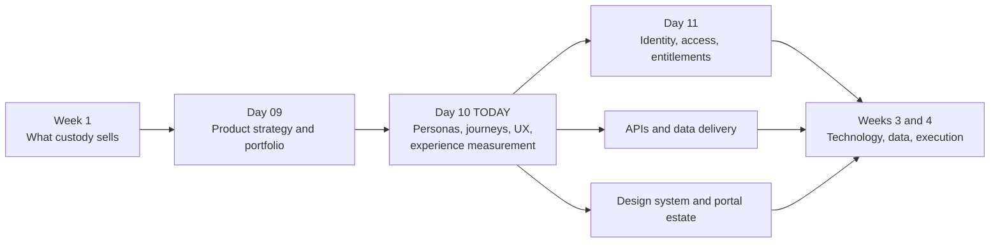
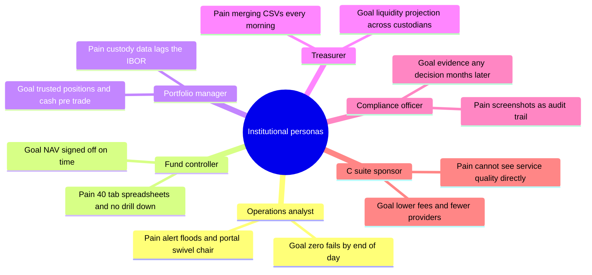
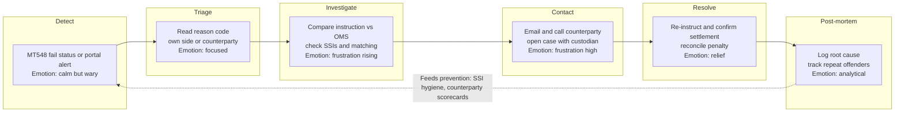
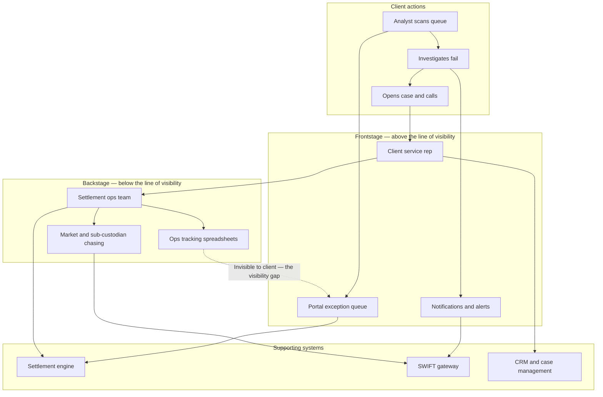
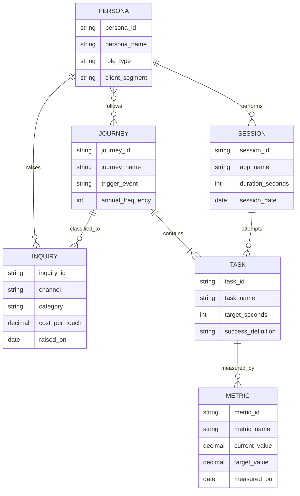
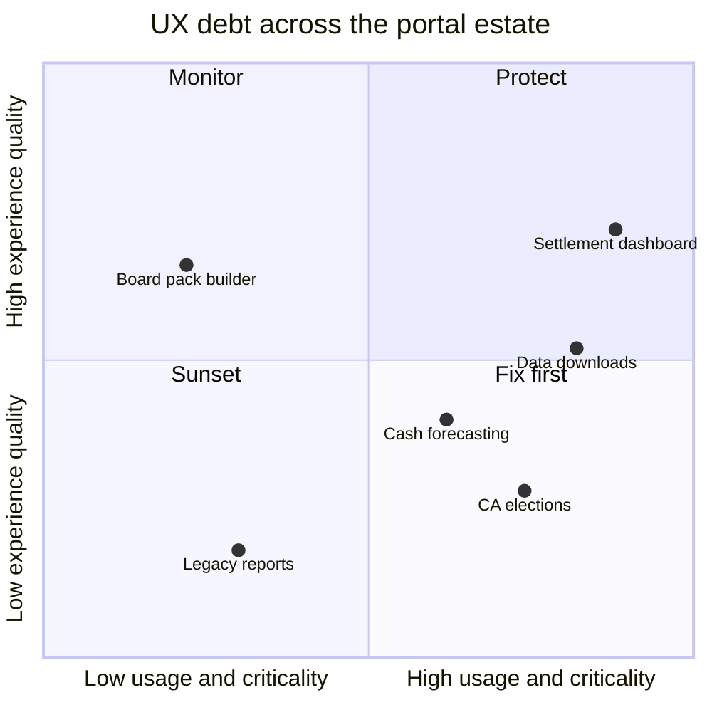

# Day 10 — Customer Journeys and UX for Institutional Clients

> Week 2 · Product and Digital Experience · Est. reading time: 60–90 min

---

## 🎯 Learning objectives

By the end of today you can:

- Describe the six core institutional personas of a custodian's digital estate — operations analyst, fund controller, portfolio manager, treasurer, compliance officer, C-suite sponsor — with their goals, pains, tools, and success metrics, and explain why the **buyer is almost never the user**.
- Build a full journey map and service blueprint for a real custody journey (investigating a failed trade), including the line of visibility between what clients see and what actually happens.
- Apply UX principles for dense-data applications — tables-first design, progressive disclosure, exception-first workflows, bulk actions, keyboard efficiency, latency budgets — and defend them with time-on-task arithmetic.
- Treat WCAG 2.1/2.2 AA accessibility as a contractual and regulatory gate, not a polish item, and name the specific implications for data grids.
- Explain why custodians accumulate 10–15 portals, and how a token-based design system plus a strangler migration pattern consolidates them.
- Commit to an experience-measurement stack that works in B2B — task success, time-on-task, inquiry classification and deflection — and explain why NPS alone will mislead you.

---

## 🧭 Where this fits

Week 1 taught you what a custodian sells and to whom; Week 2 is about the digital product that wraps it. Yesterday covered the product portfolio and strategy; today answers the question underneath every roadmap debate: **who actually touches your screens, what are they trying to get done, and how do you know if the experience is any good?** Everything after this — identity and entitlements (Day 11), APIs and data delivery, platform architecture — is in service of the journeys you map today. Get the personas and journeys wrong and you will build technically excellent software for nobody.

---

## Part 1 — Core concepts

### 1.1 The buyer–user split: the defining fact of institutional UX

In consumer products, the person who chooses the product uses the product. In institutional finance, the **economic buyer** — a COO or CFO who signs a multi-year, multi-million-dollar servicing mandate — may log into your portal twice a year, if ever. The **daily users** are operations analysts and fund controllers who had no vote in the selection and cannot leave no matter how bad the experience is. Three consequences:

1. **Bad UX doesn't churn users; it generates cost.** Trapped users don't uninstall — they file inquiries, build shadow spreadsheets, and demand named service reps. Your UX quality shows up in your *service cost line* and in *renewal-time sentiment*, not in daily active users.
2. **Great UX is sold twice.** Once to the buyer (demo, RFP, due diligence — where polish and dashboards matter) and again to users post-onboarding (where speed, density, and reliability matter). Products that win RFPs and lose ops floors are common; the reverse is rarer but fatal in a different way — you keep clients you can't win more of.
3. **Personas are your unit of design.** A custodian portal is not one product; it is six or more persona-specific workspaces over one data spine. Entitlements (Day 11) enforce that split technically; personas define it.

### 1.2 The six personas, in depth

These are representative of any large custodian's client base. Learn them well enough to role-play each in a roadmap debate.

#### Operations analyst — the volume user

Sits at an asset manager or asset owner, owns trade settlement, cash, and reconciliation exceptions across multiple custodians. Handles **200+ emails a day**, lives by market cut-offs (a missed 4:30 PM instruction deadline for certain markets means a failed trade tomorrow), and measures the day in queues cleared.

| Dimension | Detail |
|---|---|
| Goals | Zero fails at end of day; every exception resolved before market cut-off; clean recs by morning |
| Pains | Alert floods with no prioritization; swivel-chair across 3–5 custodian portals plus email; no idea whether the custodian is already working an item; re-keying references into emails |
| Tools today | Custodian portals, Excel, Outlook, internal OMS or settlement system, phone to the service desk |
| Success metrics | Fail rate, aged-exception count, cut-off misses, time-to-resolve, overtime hours |

#### Fund controller — the deadline user

At the fund's administrator-oversight or finance function. Owns **NAV sign-off** and **month-end close**. Usage is intensely cyclical: near-silent mid-month, mission-critical for a 5-day window around period end.

| Dimension | Detail |
|---|---|
| Goals | Sign off an accurate NAV on time every day; close the month without restatement; evidence oversight for auditors |
| Pains | Waiting on custodian reports that arrive as 40-tab spreadsheets; no drill-down from a suspicious NAV movement to the causing transaction; chasing pricing exceptions over email |
| Tools today | Fund accounting portal, report downloads, Excel tie-out models, email trails as audit evidence |
| Success metrics | NAV timeliness and accuracy (errors per 10,000 NAVs), close duration in days, audit findings |

#### Portfolio manager — the glance user

Front office. Rarely logs into a custody portal — but when they do, it is high stakes: **are my positions and cash right before I trade?** Cares about start-of-day cash availability, unsettled trades affecting buying power, and exposure.

| Dimension | Detail |
|---|---|
| Goals | Trustworthy positions and cash at 7 AM; know what is unsettled and why; never breach a mandate on stale data |
| Pains | Custody data lags the IBOR; three definitions of "cash" (settled, traded, projected) shown without labels; portal built for ops, not for a 30-second front-office glance |
| Tools today | OMS/PMS as primary; custody portal as tie-breaker when numbers disagree |
| Success metrics | Data trust (does the desk reconcile daily or has it stopped bothering), pre-trade check speed |

#### Treasurer — the aggregation user

Owns liquidity across the whole institution — often **across multiple custodians**. Needs projected cash by currency by value date to make funding decisions (borrow, sweep, FX) before currency cut-offs.

| Dimension | Detail |
|---|---|
| Goals | Accurate multi-currency cash projection T+0 to T+5; fund every obligation without idle balances; minimize overdraft charges |
| Pains | Each custodian shows only its own slice; projection quality degrades past T+1; downloads then merges CSVs in Excel every single morning |
| Tools today | Treasury management system, custodian portals, SWIFT MT940/MT942 statements, Excel master sheet |
| Success metrics | Overdraft incidents and charges, idle cash drag, forecast accuracy, time to complete morning funding |

#### Compliance officer — the evidence user

Monitors investment mandates and regulatory limits, investigates breaches, and must **evidence everything** for auditors and regulators. The audit trail is not metadata to this persona — it is the product.

| Dimension | Detail |
|---|---|
| Goals | Detect breaches fast; reconstruct any decision months later; produce regulator-ready evidence in hours, not weeks |
| Pains | Alerts without underlying data lineage; screenshots as evidence; no export of who-saw-what-when; retention gaps |
| Tools today | Compliance monitoring systems, custodian breach reports, document repositories, email archives |
| Success metrics | Time-to-detect and time-to-close breaches, audit findings, completeness of evidence packs |

#### C-suite sponsor — the economic buyer who rarely logs in

The COO/CFO/CIO of the client. Thinks in **fees, risk, and provider consolidation** — "can I move from four providers to two and cut 15% of my servicing cost?" Sees your product in QBR decks, RFP demos, and one dashboard glance a quarter.

| Dimension | Detail |
|---|---|
| Goals | Lower total cost of ownership; fewer providers; no operational surprises that reach the board; a credible digital story for their own stakeholders |
| Pains | Cannot see service quality except through anecdote and invoices; every provider claims a "platform"; switching costs trap them with mediocrity |
| Tools today | QBR packs, invoices, their own staff's complaints, industry surveys |
| Success metrics | All-in cost in bps, incident count reaching their desk, ease of the annual due-diligence exercise |

**The VP takeaway:** design the daily product for the analyst, controller, and treasurer; design the *demo and the QBR view* for the sponsor; and never confuse the two. A roadmap that only serves the buyer produces shelfware; one that only serves the user produces renewals nobody celebrates — you need both, deliberately.

### 1.3 Journey maps and service blueprints — the two instruments

- A **journey map** describes an end-to-end task *from the user's point of view*: stages, actions, thoughts, emotions, touchpoints, pain points. It answers "what is it like?"
- A **service blueprint** extends the map *below the line of visibility*: frontstage staff and interfaces the client sees, backstage teams and processes they don't, and the supporting systems underneath. It answers "why is it like that, and what would we have to change?"

Rule of thumb: journey maps create empathy and alignment; blueprints create **investment cases**, because they expose that most experience pain is caused backstage (a spreadsheet handoff, a batch job, a team in another time zone) where no amount of frontend polish will fix it. In custody, where the "product" is 80% operations, blueprints are the more important of the two. Pick journeys by **frequency × pain × economic value** — which is why today's worked example is trade-fail investigation: high frequency (fails run ~2–5% of settlement volume industry-wide), acute pain, and directly monetized (CSDR penalties in Europe, buy-in risk, client escalations).

---

## Part 2 — The system deep dive

### 2.1 Worked journey: investigating a failed trade

**Persona:** operations analyst at an asset manager. **Trigger:** an inbound **MT548** (settlement status message) or portal alert flags a trade as failing — say, a €25M corporate bond purchase, counterparty hasn't delivered, and under CSDR the fail is now accruing cash penalties daily.

| Stage | User actions | Thoughts | Emotion | Touchpoints | Pain points | Opportunity |
|---|---|---|---|---|---|---|
| 1. Detect | Scans morning exception queue; spots FAIL status | "Which of these 60 alerts actually matter?" | Calm but wary | Portal queue, MT548 feed, email alert | No prioritization by value, penalty, or cut-off proximity | Risk-ranked queue: sort by penalty accrual and time-to-cutoff |
| 2. Triage | Opens item; checks reason code; decides own-side vs counterparty-side | "Is this ours or theirs? Can it still settle today?" | Focused | Trade detail screen, status history | Cryptic ISO reason codes (LACK, CMON) untranslated; no plain-language cause | Human-readable fail reason plus recommended next action |
| 3. Investigate | Pulls instruction details, SSIs, matching status; compares own OMS record vs custodian record | "The SSIs don't match — whose data is stale?" | Frustration rising | Portal, OMS, SSI database, Excel | Field-by-field comparison done by eye across two screens; re-keying references | Side-by-side instruction comparison with differences highlighted |
| 4. Contact | Emails or calls counterparty ops and custodian service desk; opens a case | "Now I wait, and I have no idea if anyone is working this" | Frustration high | Email, phone, service desk, chat | No shared case state; repeats the story to each party; custodian may already be chasing — invisibly | In-portal case with live status, custodian actions visible, one thread |
| 5. Resolve | Counterparty re-instructs; watches for settlement confirmation; confirms cash and penalty adjustment | "Did it actually settle? What did the fail cost us?" | Relief | Portal status, MT548/MT545 confirms | Confirmation lag; penalty amounts arrive weeks later on a separate report | Real-time settle confirmation push plus penalty estimate attached to the case |
| 6. Post-mortem | Logs root cause; updates SSI records; reports repeat offenders monthly | "Third time this counterparty failed this month" | Analytical | Excel fail log, monthly deck | All analytics done manually offline; no pattern detection | Fail analytics: counterparty league table, root-cause trends, auto-flag repeats |

Notice where the emotional low point is: **stage 4, contact** — precisely the stage that happens *outside* your product today (email and phone). That is the classic institutional pattern: the worst experience moments are the ones you currently don't own, which is also why they are the biggest opportunities.

### 2.2 The service blueprint: what sits under the journey

The **line of visibility** runs between the FRONT and BACK lanes. Read the blueprint for structural findings, not cosmetic ones:

1. **The visibility gap.** Your settlement ops team is often already chasing the fail with the sub-custodian *before the client notices it* — but that work lives in backstage spreadsheets and never surfaces frontstage. The client experiences silence, calls the service rep, who then asks ops, who checks the spreadsheet. Exposing "custodian actions taken" on the case record converts existing backstage work into visible service — near-zero marginal ops cost, large experience gain, measurable inquiry reduction.
2. **The spreadsheet is a system of record.** If ops tracks chase status in Excel, no portal feature can display it. The UI fix requires a backstage fix (case management adoption by ops) — this is why your roadmap must include operations change management, not just engineering.
3. **Three systems, one journey.** Settlement engine, SWIFT gateway, and CRM each hold a third of the story. The blueprint is your argument for the unified case/exception data model that Day 11's entitlements and Week 3's data architecture will need anyway.

### 2.3 Second journey, lighter: fund controller at month-end

| Stage | User action | Pain today | Opportunity |
|---|---|---|---|
| Pre-close prep | Confirms all pricing sources and accruals ready | Chasing status by email | Close-readiness dashboard with red or green by fund |
| Preliminary NAV review | Reviews draft NAV, checks movements vs expectation | Flat report; no threshold flags | Auto-flag moves beyond tolerance with drill-down |
| Exception clearing | Queries pricing and accrual breaks with the accountant | Email ping-pong, versioned spreadsheets | Structured query threads attached to each break |
| Sign-off | Approves NAV, evidences review | Prints or screenshots for audit file | One-click sign-off with immutable audit record |
| Reporting | Assembles board and client packs | Manual assembly from 6 downloads | Templated pack generation |

Same lesson at lower resolution: the controller's pain concentrates in *status visibility* and *evidence*, not in visual design. A prettier NAV screen without a close-readiness view and audit-grade sign-off misses the journey entirely.

### 2.4 UX principles for dense-data applications

Institutional UX is its own discipline. Consumer instincts — whitespace, minimalism, one-thing-per-screen — actively harm users who live in your product seven hours a day. Principles, opinionated:

**1. Tables-first: the grid IS the product.** Your users think in rows: trades, positions, exceptions, cash lines. Invest in the grid like a trading firm invests in its order blotter: virtualized rendering (10,000+ rows without pagination), column-level filtering and sorting, saved views per user ("my Asia fails view"), column choosers, conditional formatting. A custodian portal with a weak grid and beautiful charts has its priorities inverted.

**2. Excel export is a feature — and a diagnostic.** Do not fight the export button; institutional workflows legitimately end in Excel (board packs, tie-outs, one-off analyses). But **instrument it**: if 70% of visits to a screen end in export within 30 seconds, that screen is not a product, it is a download link — users are exporting to do a *join, a pivot, or a share* your product doesn't support. Export telemetry is your cheapest roadmap research.

**3. Information density done right.** Tufte's data-ink principle — maximize the share of pixels carrying data — matters *more* here, but with the opposite conclusion from consumer design: institutional users want **more per screen**, not less. A treasurer comparing 12 currencies wants them on one screen, not a paged card layout. Density ≠ clutter: use typography, alignment, and restrained color to organize density, and progressive disclosure (summary row → expandable detail → full record) instead of removal.

**4. Exception-first workflows.** The single highest-leverage pattern in operations software: default every queue to "show me only what needs me, ranked by urgency." 96% of trades settle cleanly; a UI that lists all trades equally makes the user perform the filtering your software should do. Combine with **smart defaults by role**: an analyst lands on exceptions; a controller lands on close status; a treasurer lands on projected cash. Nobody should land on a marketing dashboard.

**5. Bulk actions.** Corporate-action season: 40 income elections needing the default option. One-by-one approval is 40 × (open, read, click, confirm) ≈ 40 × 45s = 30 minutes. Select-all-plus-approve with a confirmation summary: under 2 minutes. Bulk actions with good guardrails (preview, undo window, out-of-pattern flags) are where enterprise UX earns its keep.

**6. Keyboard efficiency.** Power users at 7 hours/day amortize learning cost fast. Arrow-key grid navigation, Enter to open, keyboard shortcuts for approve/assign/next. This is why Bloomberg's terminal — visually archaic — retains fanatical loyalty: it optimizes for the ten-thousandth use, not the first.

**7. Latency budgets.** Set them explicitly and test in the client's geography: grid interactions (sort, filter) under 200 ms; screen loads under 2 s; anything longer gets a progress state and, past 10 s, becomes an async job with notification. A 4-second grid sort performed 200 times a day is 13 minutes of daily dead time per user — latency is a feature with an FTE cost, and it deserves roadmap slots like any feature.

**Worked example — the triage-time business case.** An ops analyst triages **120 exceptions/day**. Current UI: ~**90 seconds** per triage (open item, decode reason, cross-reference OMS, decide). Redesigned exception-first queue with translated reason codes and side-by-side comparison: ~**40 seconds**.

- Saving: 50 s × 120 = 6,000 s = **100 minutes per analyst per day**.
- Across **300 client ops users**: 300 × 100 min = 30,000 min = **500 hours/day**.
- At a 7.5-hour workday: 500 ÷ 7.5 ≈ **67 FTE-equivalents of capacity** returned to clients.
- Valued at a loaded $60/hour: 500 h × 250 business days × $60 ≈ **$7.5M/year of client-side value**.

You don't capture that $7.5M directly — but it is exactly the number the C-suite sponsor persona understands at renewal, and the number that justifies your design headcount internally. Institutional UX improvements should always be argued in this currency: *seconds per task × frequency × population*.

### 2.5 Accessibility: a contractual gate, not a nicety

Treat **WCAG 2.1 AA (moving to 2.2 AA)** as a hard requirement with four independent forcing functions:

| Driver | Mechanism | Consequence of failure |
|---|---|---|
| ADA litigation (US) | Web apps treated as places of public accommodation in a steady stream of suits | Legal cost, settlements, remediation under deadline |
| European Accessibility Act | In force June 2025; explicitly covers consumer banking services, and large clients apply it across their supply chain | Market-access risk in the EU; client compliance teams push it into contracts |
| Section 508 (US) | Federal and many public-sector entities must procure accessible ICT | Public pensions and sovereigns — core custody clients — cannot buy you |
| Client RFPs | Procurement checklists demand a current **VPAT** (Voluntary Product Accessibility Template) | No VPAT, no shortlist — you lose before the demo |

The strategic point: for a custodian whose clients include public pension funds and European institutions, accessibility is **sales infrastructure**. Budget it like security: continuous, audited, with a maintained VPAT per product — not a one-off remediation.

Practical implications for dense grids, where generic checklists go quiet:

- **Focus management:** every grid cell reachable and operable by keyboard; visible focus indicator (WCAG 2.2 strengthens this); focus returns sensibly after modal close or row deletion.
- **Screen-reader table semantics:** real row/column header associations (or correct ARIA grid roles) so "€25M, column Amount, row 47" is announced meaningfully; virtualized grids need extra care since off-screen rows don't exist in the DOM.
- **Color is never the sole carrier:** red/green P&L must also differ by sign, icon, or text ("-1.2%" plus a down glyph) — this simultaneously serves the ~8% of men with color-vision deficiency, a population well represented on ops floors.
- **Reflow and zoom:** 400% zoom without loss of function — hard for dense grids; solve with responsive column priority, not by exempting the screen.

### 2.6 Design systems and the multi-portal estate

Why does every large custodian end up with **10–15 client-facing portals**? Because the estate grows the way the business grew: each acquisition brings its portals; each product line (custody, fund accounting, transfer agency, middle office, data) built its own front end in its own decade; each region occasionally forked one. The client experiences this directly: five logins, five navigation models, three definitions of "cash," and a due-diligence questionnaire asking why.

The consolidation toolkit:

1. **Token-based design system.** Design tokens (color, type, spacing, elevation as named variables) → component library (grid, forms, charts, navigation built once, accessibility baked in) → patterns (how an exception queue or approval flow behaves anywhere). Tokens matter because they let 15 heterogeneous codebases converge visually *before* they converge technically.
2. **Governance with a contribution model.** A pure central team becomes a bottleneck and gets bypassed; pure federation re-fragments. Use core-team-plus-contributors: the central team owns tokens, the grid, and accessibility conformance; product teams contribute components through review. Fund it as a platform product with a roadmap — not a project that "finishes."
3. **The migration reality: strangler pattern for UI.** You will not rewrite 15 portals. You wrap them: unified shell (single sign-on, one navigation, consistent chrome) around legacy screens, then replace screens journey-by-journey behind the shell, highest-traffic first, retiring legacy routes as you go. Clients get coherence in quarters; full replacement takes years and that's fine — sequence by journey value, not by codebase.
4. **Measure adoption or it isn't real.** Percentage of screens on system components; token coverage per app; number of rogue component forks; accessibility-defect density on-system vs off-system (the killer stat — on-system screens typically show a fraction of the defects). Design-system adoption without measurement becomes a brand exercise.

### 2.7 Measuring experience in B2B — what actually works

The consumer playbook (DAU, NPS, funnels) mostly breaks in institutional settings. Build this stack instead:

| Signal | What it tells you | Cautions |
|---|---|---|
| **Task success rate** | Can users complete the top journeys unaided (target ≥ 90% on top 5) | Requires defining journeys and instrumenting completion — do that first |
| **Time-on-task** | Efficiency trend per journey; feeds the FTE math from 2.4 | Compare like-for-like task complexity; watch p90, not just median |
| **Adoption by persona** | Which personas use which capabilities; where Excel-swivel persists | Raw logins are vanity; measure *journey-level* engagement |
| **Relationship NPS (annual)** | Directional account health for QBRs | n is tiny (hundreds of clients, not millions); relationship halo — scores track the service rep and the fee negotiation as much as the product; survey fatigue is real |
| **Transactional CES (sparingly)** | Friction on a specific journey right after completion | One question max, rate-limited per user per quarter |
| **Inquiry/ticket corpus** | **Your richest dataset** — see below | Requires disciplined classification to be usable |
| **Session analytics** | Behavioral detail: paths, rage-clicks, abandonment | In banks: privacy review, client permission or contract terms, often anonymization and regional data-residency limits; assume you get less than a consumer team would, and design metrics that survive that |

**The inquiry goldmine, worked.** Every client email, call, and case is a user telling you where the product failed — at scale, classified, and time-stamped. Suppose your service organization handles **240,000 client inquiries/year** at an industry-representative cost of **$18–45 per touch** (say $28 blended, covering rep time, ops research time, systems): that is a **~$6.7M annual service cost**, and a free research corpus. Classify inquiries by journey stage (e.g., "where is my trade" → failed-trade Detect/Contact stages; "explain this NAV move" → controller review stage). If 30% are *status inquiries answerable by self-service* and a real-time status feature deflects half of those: 240,000 × 30% × 50% = **36,000 deflected × $28 ≈ $1.0M/year**, plus faster answers for clients. This is the cleanest ROI argument in your entire portfolio — and it makes the service organization your ally rather than a rival budget line.

### 2.8 Researching with institutional clients

You cannot A/B test your way to insight with 300 named clients under NDA. The institutional research toolkit:

- **Client advisory councils.** 8–12 named clients, quarterly, roadmap previews for candid feedback. High signal on direction, low on usability — council attendees are senior, i.e., buyers, not daily users. Explicitly ask each member to also nominate a *hands-on-keyboard* participant.
- **Beta programs with named design partners.** 3–5 clients per major release, real data, structured feedback cadence, early access as the incentive. The design-partner relationship is also a renewal moat.
- **Shadowing ops teams.** The highest-yield method in this domain: a day watching an analyst work beats ten interviews, because expert users cannot articulate their workarounds — the Excel macro, the second monitor with the counterparty list, the printed cut-off cheat sheet are only visible in situ. On-site or observed-screen-share; twice a year per key persona, minimum.
- **Win/loss and RFP feedback.** Every lost RFP contains a scored evaluation of your digital experience against competitors — often the only competitive UX benchmarking you will ever legally obtain. Institutionalize the debrief.
- **Internal proxies.** Your own operations teams (large ops centers in lower-cost locations) run near-identical workflows and are infinitely accessible. Use them for usability mechanics (can users complete the task?) but respect the limits: they know your systems' quirks too well, tolerate pain a client wouldn't, and never see the multi-custodian swivel-chair reality.
- **Compliance and legal constraints — plan for them.** NDAs before any prototype exposure; care around **MNPI** (a client's positions, trades, and holdings are confidential and possibly market-sensitive — research sessions must not expose one client's data to anyone else, including your researcher's recording); recording policies (many client firms prohibit recording; default to notes and get consent explicitly); works-council rules in some European jurisdictions for shadowing staff. Build a pre-approved research protocol with legal *once*, so each study doesn't renegotiate from zero.

---

## Part 3 — The VP lens

### 3.1 Decisions you actually own

**Where do scarce designers go?** You will have far fewer designers than teams — ratios of 1:8 or worse against engineering squads are normal in banks. Do not peanut-butter them. Concentrate on: (1) the top 5 journeys by frequency × pain × value, (2) the design system (multiplies everyone else), (3) anything touching an RFP demo path. Teams without a designer get the design system plus office hours. This will be unpopular with the unstaffed teams; hold the line — a designer spread across four squads improves none of them.

**Design system vs feature delivery.** The system is an investment with a J-curve: the first two quarters *slow* feature teams (new components, migration tax) before velocity and consistency compound. Fund it explicitly (a dedicated team of ~4–8, treated as a product) rather than as a tax on feature squads, and set expectations upward that quarters 1–2 show cost before quarters 3+ show payback. The alternative — every squad rebuilding grids — is how you got 15 portals.

**Fund a research practice or borrow client-facing staff?** Start hybrid: one senior researcher who builds the legal-approved protocol, the inquiry-classification pipeline, and trains PMs to run sessions — rather than a large research org or pure reliance on relationship managers (whose feedback is real but filtered through the commercial relationship and skewed to the loudest client). Scale researchers only when the top-5-journey instrumentation exists; research without measurement infrastructure produces decks, not decisions.

**The export-to-Excel dilemma: kill, tolerate, or instrument?** Instrument — always. Killing export is declaring war on your users' actual workflow; you will lose, via CSV-scraping and screenshots. Passive tolerance wastes the signal. Instrument every export (screen, filters, frequency, time-to-export) and treat high-export screens as a ranked backlog of missing product capability. Then — selectively — replace the *reasons* for export (in-product pivots, scheduled report delivery, API/data-feed for the truly heavy users) and watch the export rate as your success metric.

**UX debt triage across the estate.** You inherit 10–15 portals of uneven quality. Plot them: usage/criticality against experience quality, and let the quadrants drive investment:

Reading it: **Fix first** (high usage, poor quality — corporate-action elections, cash forecasting) is where the FTE math from Part 2 lives. **Protect** (settlement dashboard) gets maintenance and latency budgets, not redesigns. **Sunset** (legacy reports) gets a migration date, not investment — every dollar spent polishing a sunset asset is stolen from Fix-first. **Monitor** items are candidates for consolidation into a Protect asset.

**Metrics you commit to leadership.** Commit to few, and to ones you can move: (1) **task success rate on the top 5 journeys** (baseline, then target ≥ 90%), (2) **inquiry deflection** (classified status-inquiries down X% year-over-year, with the $-per-touch translation), (3) **adoption by persona** (e.g., % of client treasurers using cash projection weekly). Resist committing to NPS as a target — report it as context. A number you can't causally influence is a number that will eventually be used against you.

### 3.2 Stakeholder map

| Stakeholder | What they want from you | What you need from them | Watch-out |
|---|---|---|---|
| Client service leadership | Fewer inquiries, tools for reps | Inquiry data, classification discipline, deflection partnership | May fear self-service shrinks their org — frame as escalation-quality, not headcount |
| Operations | Screens that match real workflow; no change fatigue | Backstage process change (case mgmt adoption), shadowing access | Their spreadsheets are load-bearing; migrate, don't confiscate |
| Sales and RM | Demo-ready product, RFP answers, VPAT on file | Win/loss debriefs, client introductions for research | Will lobby for top-client one-offs; route through the roadmap |
| Brand and marketing | Visual consistency with the corporate brand | Tokens as the contract between brand and product | Brand refreshes must flow through tokens, not per-app reskins |
| CISO and privacy | Analytics that respect data policy; accessible ≠ insecure | Pre-approved telemetry and research protocols | Get session-analytics approval *once*, as policy, not per study |
| Legal and compliance | NDA-clean research, MNPI hygiene, retention rules | The standing research protocol; audit-trail requirements as features | Involve early; retrofit approval is 10× slower |
| Client advisory council | Influence and early access | Direction validation and named beta users | Buyers over-index in the room; demand hands-on nominees |

### 3.3 Questions to ask your design lead this month

1. What are our top 5 journeys by frequency × pain, and do we have a current map and blueprint for each — or are we designing screen-by-screen?
2. What is our task success rate and p90 time-on-task on those journeys today? If we can't answer, what instrumentation is missing?
3. Where does export-to-Excel spike, and what does each spike tell us is missing?
4. What is our WCAG 2.2 AA conformance status per portal, and which client RFPs asked for a VPAT in the last 12 months?
5. What percentage of screens are on design-system components, and what is the accessibility-defect density on-system vs off-system?
6. When did a designer or PM last physically watch a client ops analyst work for a full morning? What changed as a result?
7. Which of our portals would you sunset tomorrow, and what is stopping us?

---

## 🏦 State Street context

*(Representative/public-knowledge framing.)*

- **Multi-portal estates are the norm at large custodians**, State Street included: decades of product-line growth (custody, fund accounting, middle office via outsourcing deals, data and analytics) and acquisitions — Charles River Development (2018) on the front end, Brown Brothers Harriman's Investor Services *attempted* acquisition (later abandoned) would have added more — each generation leaving client-facing surfaces. State Street's public digital narrative centers on **State Street Alpha**, the front-to-back platform proposition combining CRD's front office with custody/accounting servicing and a common data layer; "my.statestreet.com" is the representative client-portal entry point for servicing content. The consolidation problem described in Part 2 — one coherent experience over heterogeneous back ends — is precisely the Digital Experience mandate at any firm of this shape.
- **The client base is global and institutional** — pensions (including public-sector), sovereign wealth funds, insurers, asset managers across ~100 markets. That implies: localization (languages, date/number formats, market-specific conventions), follow-the-sun support expectations, regional data-residency constraints on analytics, and the accessibility obligations from Part 2 arriving via *client* procurement (public pensions and EU institutions especially), not just via your own regulators.
- **Internal-user proxies at scale:** State Street operates large global operations and technology hubs — publicly, sites in **Poland (Kraków/Gdańsk)** and **India (multiple cities)** among others — where thousands of internal ops users run workflows adjacent to what client ops teams do in your portal. That is a permanent, NDA-free usability lab and a source of exception-queue expertise; use it with the proxy caveats from Part 2.8.
- **Fee compression makes the experience case commercial:** with servicing fees measured in single-digit basis points (Day 1), the inquiry-deflection and FTE-savings math in Part 2 is not soft benefit — service cost and client stickiness are among the few margin levers a custodian's product organization directly controls.

---

## 💪 Exercises

1. **Blueprint one journey end-to-end.** Take "client requests a historical audit report for a regulator" (compliance-officer persona). Map the journey stages (request → scope → retrieve → package → deliver), then draw the service blueprint: frontstage (portal, service rep), backstage (which teams touch it, where the spreadsheets are), systems (archive, document store, CRM). Mark the line of visibility. Identify one backstage step whose *exposure* (not automation) would most improve the experience, and estimate the inquiry volume it would deflect.
2. **Design a 5-user hallway test plan.** Using internal ops staff as proxies, script a usability test of the failed-trade triage flow: 3 tasks (find the highest-penalty fail; determine own-side vs counterparty; open a case), success criteria per task, a time-on-task target, and the two proxy-bias questions you will *not* be able to answer with internal users. One page.
3. **Classify 20 inquiries.** Pull (or imagine, realistically) 20 recent client inquiries. Tag each with: persona, journey, journey stage, root cause (missing data / missing feature / confusing UI / genuine service question), and deflectable yes/no. Compute the deflectable percentage and, at $28 per touch and your firm's annual inquiry volume, the annualized value of deflecting them. Note which journey stage dominates — that is tomorrow-morning's roadmap argument.

---

## ❓ Self-check quiz

1. Why does the buyer–user split matter so much in institutional product, and name one concrete design consequence for each side of the split.
2. In the failed-trade journey, which stage carries the emotional low point, and why is it also the biggest product opportunity?
3. An analyst triages 150 exceptions/day; a redesign cuts triage from 80s to 50s. Across 200 users at $60/hour loaded, what is the approximate annual value (250 business days)?
4. Give three reasons WCAG AA conformance is a commercial requirement (not a nicety) for a custodian, and one grid-specific implementation implication.
5. Why is the classified inquiry corpus a better primary UX signal than NPS in this business?

Answers

1. The economic buyer (C-suite: fees, risk, consolidation) signs the mandate but rarely logs in; daily users (analysts, controllers) had no vote and can't leave — so bad UX shows up as service cost and renewal sentiment, not churn. Consequences: design daily workflows (exception-first queues, bulk actions, density) for users; design demo paths, QBR views, and RFP-ready evidence (VPATs, dashboards) for buyers — deliberately and separately.
2. Stage 4, **Contact** — the analyst leaves the product for email and phone, loses all status visibility, and repeats the story to each party. It is the biggest opportunity precisely because it sits outside the product today: an in-portal case with visible custodian actions converts existing backstage work into experience with little new ops cost.
3. Saving 30 s × 150 = 4,500 s = 75 min/user/day. × 200 users = 15,000 min = 250 hours/day. × 250 days × $60 = **≈ $3.75M/year** (and ≈ 33 FTE-equivalents at 7.5 h/day).
4. Drivers: ADA litigation exposure (US), the European Accessibility Act (in force 2025, pushed through client supply chains), Section 508 (public-sector clients cannot procure non-conforming tools), and RFP checklists demanding a current VPAT — fail these and you're off the shortlist before the demo. Grid implication (any one of): full keyboard operability with visible focus; correct row/column header semantics for screen readers (hard with virtualization); color never the sole carrier for red/green P&L; 400% zoom reflow.
5. NPS in B2B has tiny n (hundreds of clients), relationship halo (scores reflect the service rep and fees, not the product), and survey fatigue. The inquiry corpus is large, continuous, time-stamped, tied to real failures, and classifiable to journeys and stages — and it converts directly to money via cost-per-touch ($18–45) and deflection math, making it both the richest research dataset and the cleanest ROI argument.

---

## 🔑 Key takeaways

- Institutional UX starts from the **buyer–user split**: build daily workflows for analysts, controllers, and treasurers; build the demo, QBR view, and compliance evidence for the sponsor who signs — and never let one masquerade as the other.
- **Service blueprints beat journey maps** in custody because most experience pain is backstage — spreadsheets, handoffs, invisible chasing. The cheapest big win is often *exposing* existing backstage work (case status), not building new capability.
- Dense-data UX inverts consumer instincts: **the grid is the product**; density, exception-first queues, bulk actions, keyboard speed, and explicit latency budgets — argued in seconds × frequency × population (100 min/analyst/day ≈ $7.5M/yr across 300 users).
- **Excel export is a feature and a sensor**: never kill it, always instrument it, and treat export spikes as a ranked backlog of missing capability.
- **Accessibility is a contractual gate** — ADA, the European Accessibility Act, Section 508, and RFP VPAT demands make WCAG AA sales infrastructure; budget it continuously like security.
- Consolidate the multi-portal estate with a **token-based design system, contribution-model governance, and a UI strangler pattern** — and measure adoption, or it isn't happening.
- Measure experience with **task success on the top 5 journeys, time-on-task, persona-level adoption, and the classified inquiry corpus** (deflection × $18–45/touch); report NPS as context, never as your committed target.

---

## 📚 Going deeper

- **Nielsen Norman Group** — enterprise/complex-application UX articles: "Complex Application Design," "Journey Mapping 101," "Service Blueprints: Definition," and their enterprise-UX research series (nngroup.com, free articles).
- **WCAG 2.2 specification** — W3C Recommendation (w3.org/TR/WCAG22/), plus the W3C's "ARIA Authoring Practices Guide" grid pattern for accessible data tables.
- **Don Norman, *The Design of Everyday Things* (revised edition)** — mental models, affordances, and error design; the error-message chapter maps directly onto exception queues.
- **Service blueprinting** — G. Lynn Shostack's original HBR article "Designing Services That Deliver" (1984) and the Nielsen Norman Group blueprinting guides.
- **Baymard Institute** — deep pattern research on tables, data lists, and form design; consumer-commerce framing but the grid findings transfer (baymard.com, mix of free and premium).
- **Edward Tufte, *The Visual Display of Quantitative Information*** — data-ink ratio and density done right; read it as an argument *for* institutional density, not for minimalism.

---

## Tomorrow

**Day 11 — Identity and Access Management:** entitlements, SSO, and security as the literal front door of the institutional experience — where "who can see which fund's data" becomes your hardest product problem.
