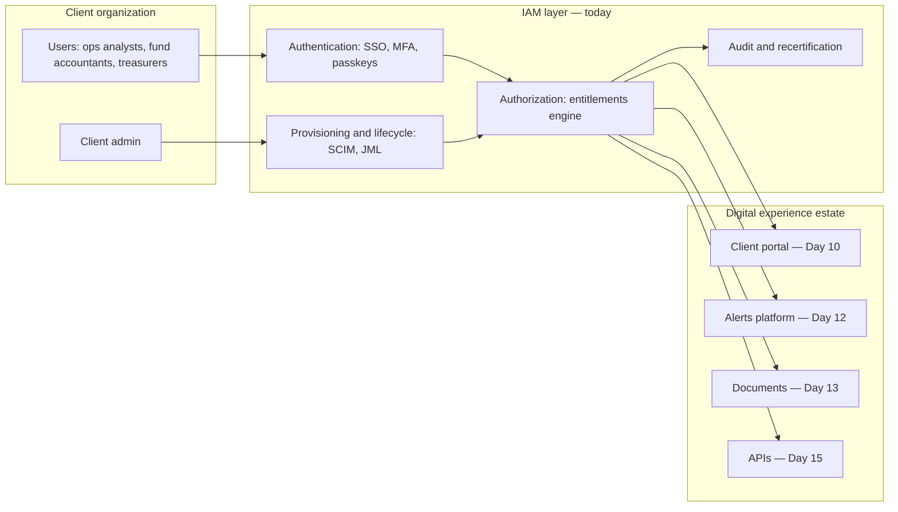
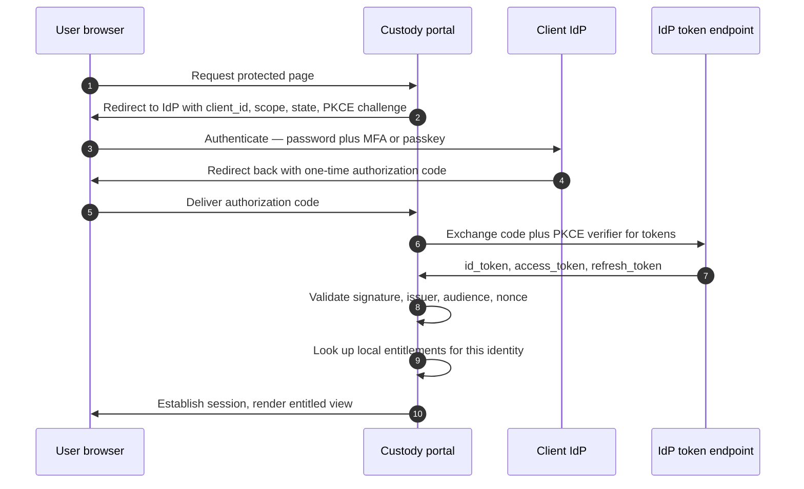
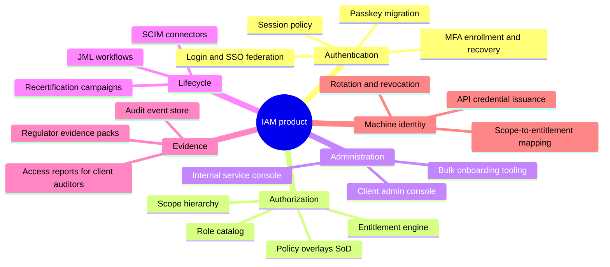
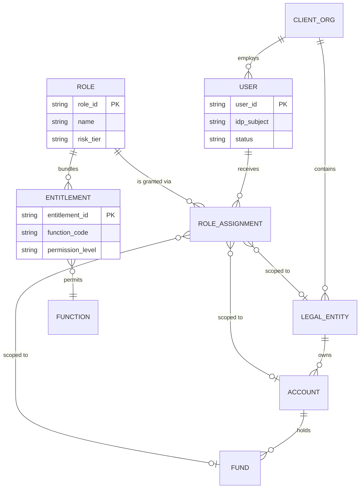
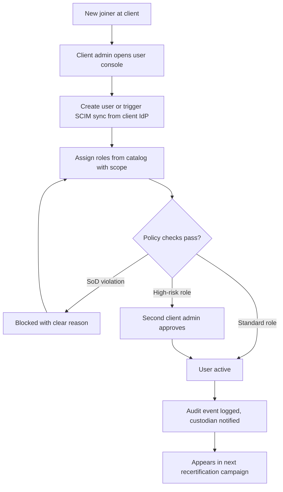
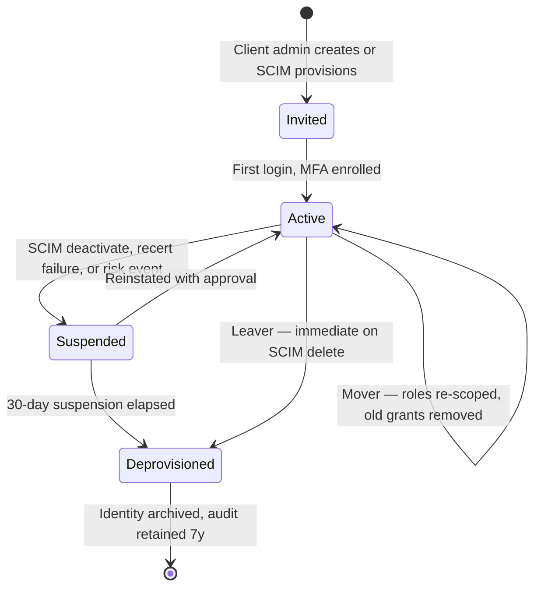

# Day 11 — Identity and Access Management for Client Platforms

> Week 2 · Product and Digital Experience · Est. reading time: 60–90 min

## 🎯 Learning objectives

By the end of today you can:

- Explain why IAM is a **product** with its own roadmap, not a security checkbox — and defend that position in a budget conversation.
- Distinguish authentication from authorization, and SAML 2.0 from OIDC/OAuth 2.0, well enough to referee an architecture debate.
- Describe the custody-portal **entitlements problem** — users × legal entities × accounts × funds × functions — and compare RBAC, ABAC, and ReBAC as solutions.
- Sketch the delegated administration model and argue why it is a killer feature in institutional client platforms.
- Walk the joiner-mover-leaver lifecycle, SCIM provisioning, and access recertification as a compliance-grade process.
- Specify where step-up authentication belongs in high-risk client actions such as payment approval or corporate-action elections.

## 🧭 Where this fits

Everything you built conceptually this week — journeys (Day 9), portal experience (Day 10) — sits behind a front door. IAM is that front door *and* the internal corridors: it decides who gets in, what they see, and what they may do. In a custody portal, authorization is not a technical afterthought; it is the encoding of the client's own governance (who at the client may move money, who may only view). Get IAM wrong and every other digital investment is either insecure or unusable.

Note the arrows into Days 12, 13, and 15: the **same entitlement model** must govern portal screens, alert subscriptions, document visibility, and API scopes. One model, many enforcement points. That is the single most important architectural sentence in today's chapter.

## Part 1 — Core concepts

### 1.1 Why IAM is a product

Three arguments to internalize, because you will make them repeatedly:

1. **Onboarding friction is revenue friction.** A new custody mandate is not "live" for the client until their 40 users can log in with the right permissions. If user setup takes six weeks of email forms and manual entitlement spreadsheets, that is six weeks of a multi-million-dollar relationship starting badly — and the client's ops team forming the habit of calling your service desk instead of using the portal. Time-to-first-productive-login is a product metric.
2. **Security posture is a sales artifact.** Institutional clients send security due-diligence questionnaires (SIG, CAIQ) before signing. "Do you support SAML SSO with our IdP? FIDO2? SCIM provisioning? Access recertification?" are literally RFP line items. IAM features win and lose deals.
3. **Delegated administration converts cost into stickiness.** When the client's own admin manages their users, you remove your service-desk cost *and* embed your platform into the client's operating procedures. Ripping out a custodian whose portal is wired into your joiner-mover-leaver process is harder. Stickiness is the product outcome.

### 1.2 Authentication vs authorization

| Dimension | Authentication (AuthN) | Authorization (AuthZ) |
|---|---|---|
| Question answered | "Who are you?" | "What may you do?" |
| Frequency | Per session (plus step-up events) | Per request, every request |
| Typical protocols | SAML 2.0, OIDC, FIDO2/WebAuthn | OAuth 2.0 scopes, policy engines, entitlement services |
| Failure mode | Account takeover, phishing | Over-entitlement, data leakage across clients |
| Who owns the source of truth | Often the **client's** IdP (federation) | Always **you** (the custodian's entitlement store) |
| Product surface | Login experience, MFA enrollment | Admin console, entitlement matrix, recertification UI |

The last row of the table is the one VPs miss: you can outsource authentication to the client's identity provider via federation, but you can never outsource authorization. The client's Azure AD knows Jane is an employee; only your platform knows Jane may view Fund 7 but not instruct payments on it.

### 1.3 Enterprise SSO — SAML 2.0 vs OIDC/OAuth 2.0

Both solve federation: the client's identity provider (IdP — e.g., Entra ID, Okta, Ping) vouches for the user; your platform (the service provider / relying party) trusts that assertion.

- **SAML 2.0** (2005): XML assertions posted via the browser. The incumbent standard for enterprise web SSO; virtually every institutional client's IdP speaks it. Heavy, XML-signature-fragile, browser-only.
- **OAuth 2.0** (2012): a *delegation* framework — "let this application act on my behalf with these scopes." Not an authentication protocol by itself.
- **OIDC** (OpenID Connect, 2014): a thin identity layer on top of OAuth 2.0. Adds the `id_token` (a signed JWT stating who authenticated, when, and how). JSON/REST-native, works for web, mobile, and APIs.

The OIDC **authorization code flow with PKCE** is the modern default:

Step 9 matters: federation ends at identity. Entitlements are resolved locally, from your store, keyed on a stable identifier (never on email alone — emails change on marriage and rebranding).

| Criterion | SAML 2.0 | OIDC / OAuth 2.0 |
|---|---|---|
| Token format | XML assertion | JWT (JSON) |
| Transport | Browser POST bindings | REST + redirects |
| Mobile and SPA support | Poor | Native (with PKCE) |
| API authorization | Not designed for it | Core use case (access tokens, scopes) |
| Enterprise IdP support | Universal | Near-universal, growing |
| Logout | Single logout exists, rarely works well | RP-initiated + back-channel logout, cleaner |
| Your policy | Support it — clients demand it | Build new on it; it also powers Day 15 APIs |

**VP position:** support both inbound (clients bring SAML or OIDC from their IdP), standardize internally on OIDC/OAuth, because it unifies the human portal and the machine API under one token model.

A practical wrinkle worth knowing before your architects raise it: many custodians put an **identity broker** (a federation hub) between client IdPs and applications. Clients federate once to the broker — SAML or OIDC, their choice — and the broker issues normalized OIDC tokens to every downstream app. Benefits: one integration per client instead of one per client per app, one place to enforce MFA policy, one certificate-rotation relationship. Cost: the broker becomes tier-0 infrastructure — if it is down, *no* client logs into anything. Its availability target must exceed every application it fronts.

### 1.5 The IAM product surface

When you inherit "IAM" as a product area, this is the actual estate — each branch has users, a backlog, and failure modes:

Two of these branches are chronically under-invested at most banks and are therefore where a new VP finds quick wins: **MFA recovery** (account-recovery flows are the real attack surface once passkeys make front-door phishing hard — a helpdesk that resets MFA over the phone undoes the whole program) and **bulk onboarding tooling** (the first 40 users of a new mandate should be loadable from a validated spreadsheet or SCIM in an hour, not keyed one-by-one).

### 1.4 MFA and phishing resistance

| Factor | Phishing-resistant? | Notes |
|---|---|---|
| SMS OTP | No | SIM-swap and relay attacks; deprecated by NIST for high assurance |
| TOTP app (authenticator codes) | No | User can be socially engineered to type the code into a fake site |
| Push approval | Weak | "MFA fatigue" attacks — attacker spams prompts until user taps approve |
| FIDO2 / passkeys (WebAuthn) | **Yes** | Credential is cryptographically bound to the origin; a fake domain gets nothing |
| Smartcard / PIV | Yes | Common in large banks; heavier to deploy externally |

Phishing resistance is not academic in custody: your users can instruct settlement and payments. A phished credential at a client is *your* incident in the client's eyes. Roadmap stance: passkeys as the promoted default, TOTP as fallback, SMS retired on a dated plan, and **step-up to a phishing-resistant factor mandatory for value-moving actions** (see Part 2.4).

## Part 2 — The system deep dive

### 2.1 The entitlements problem in custody portals

A retail app has one dimension: the user and their own account. A custody portal has at least four:

- **Legal entity** — the client group may have dozens (UK pension scheme, Irish ManCo, US 40-Act adviser).
- **Account / fund** — hundreds of custody accounts and funds per entity.
- **Function** — view holdings, view transactions, download documents, instruct payments, approve payments, elect corporate actions, manage users.
- **Permission level** — none / view / initiate / approve (with four-eyes separation between initiate and approve).

The design insight in the diagram: a role assignment is a **(user, role, scope)** triple, where scope can be an entity, an account, or a fund. Roles without scoping explode into per-fund role copies; scoping without roles explodes into raw permission lists. You need both.

### 2.2 Worked example — 40 users, per-fund, per-function

**Meridian Pension Partners** (representative client): 3 legal entities, 12 funds, 40 users. Functions: Holdings view (H), Transactions view (T), Documents (D), Payment initiate (Pi), Payment approve (Pa), Corporate-action elect (CA), User admin (UA).

Role catalog (7 roles instead of 40 bespoke profiles):

| Role | H | T | D | Pi | Pa | CA | UA | Typical scope |
|---|---|---|---|---|---|---|---|---|
| Viewer | ✓ | ✓ | ✓ | — | — | — | — | Entity or fund subset |
| Fund Accountant | ✓ | ✓ | ✓ | — | — | — | — | Assigned funds only |
| Treasury Initiator | ✓ | ✓ | ✓ | ✓ | — | — | — | Entity |
| Treasury Approver | ✓ | ✓ | ✓ | — | ✓ | — | — | Entity |
| CA Manager | ✓ | ✓ | ✓ | — | — | ✓ | — | Assigned funds |
| Auditor (time-boxed) | ✓ | ✓ | ✓ | — | — | — | — | All, expiring grant |
| Client Admin | — | — | — | — | — | — | ✓ | Whole org |

Population: 22 Viewers/Fund Accountants (fund-scoped), 6 Treasury Initiators, 4 Treasury Approvers (no user holds both — enforced separation of duties), 4 CA Managers, 2 Client Admins, 2 auditors with 90-day expiring access. Total assignments: ~40 triples instead of 40 × 12 × 7 = **3,360** individual permission cells. That compression ratio — and the four-eyes constraint — is the whole argument for a real entitlement model.

Two policy rules ride on top: (a) no user may hold Pi and Pa on the same entity; (b) Auditor grants must carry an expiry date. These are **policy checks at assignment time**, your first taste of ABAC.

### 2.3 RBAC vs ABAC vs ReBAC

| Model | Grant logic | Strength | Weakness | Custody fit |
|---|---|---|---|---|
| **RBAC** (role-based) | User has role → role has permissions | Auditable, explainable to clients and regulators | Role explosion when scope varies; static | Backbone: role catalog + scoped assignments |
| **ABAC** (attribute-based) | Policy over attributes: user dept, fund domicile, amount, time | Fine-grained, dynamic rules ("approve only below USD 10m") | Hard to answer "who can access X?"; policy sprawl | Overlay: SoD rules, amount thresholds, time-boxed access |
| **ReBAC** (relationship-based) | Graph traversal: user→team→entity→fund (Zanzibar-style) | Natural fit for org hierarchies, delegation chains | Newer tooling; recertification reports need graph flattening | Emerging: models "entity owns account holds fund" cleanly |

Pragmatic architecture for a custodian: **scoped RBAC as the primary model** (regulators and client auditors can read a role matrix), **ABAC as a policy overlay** for separation of duties and thresholds, and ReBAC concepts to represent the entity/account/fund hierarchy so scopes inherit sensibly ("grant at entity level implies all its funds unless excluded").

### 2.4 Sessions, step-up, and high-risk actions

Baseline session controls: idle timeout (15–30 min for financial portals), absolute session lifetime, device binding on refresh tokens, concurrent-session policy, and immediate revocation on deprovisioning.

**Step-up authentication** re-challenges the user — ideally with a phishing-resistant factor — at the moment of a sensitive action, even mid-session:

- Approving a payment or standing settlement instruction (SSI) change
- Submitting or amending a **corporate-action election** (an irrevocable, deadline-bound instruction — Day 12 will alert on these deadlines; Day 11 protects who may submit them)
- Changing another user's entitlements
- Generating API credentials

Worked micro-example: a Treasury Approver approves a USD 25m redemption payment. Policy: payments above USD 10m require step-up with passkey plus display of a **transaction-bound challenge** ("Approve USD 25,000,000 to beneficiary ending 4417?"). Binding the approval to the transaction defeats the malware pattern where a session is hijacked after login.

### 2.5 Delegated administration — the killer feature

Design principles that make this safe rather than scary:

1. **Custodian defines the role catalog; client assigns from it.** Clients never invent permissions, they select and scope.
2. **Guardrails are code**: SoD conflicts and risk-tier rules block at assignment, with human-readable reasons.
3. **Four-eyes on high-risk grants**: a second client admin (or your service team) approves payment-approver and admin roles.
4. **Everything is an immutable audit event** — who granted what to whom, when, under which approval.
5. **Break-glass stays with you**: your service team can suspend any user or the whole org instantly.

The commercial punchline: a 500-client book with delegated admin turns roughly 10,000 annual user-admin service tickets (at, say, USD 40 fully-loaded cost each — USD 400k/yr) into client self-service, while *improving* audit quality because grants are captured structurally instead of in emails.

### 2.6 Provisioning and lifecycle — SCIM and JML

**SCIM 2.0** (System for Cross-domain Identity Management) is the REST/JSON standard by which the client's IdP pushes user create/update/deactivate events into your platform. It automates the most dangerous gap in institutional access: **the leaver who still has portal access weeks after resigning.**

The **mover** transition is the subtle one: promotions and team changes must *remove* old entitlements, not just add new ones, or you breed "permission barnacles" — long-tenured users who have accreted access to everything. Recertification exists largely to scrape off barnacles.

**Access recertification campaigns**: quarterly or semi-annual, the client admin (and your internal owners for internal users) must attest every grant is still needed. Product requirements that separate a good recert experience from a hated one: bulk approve with risk-tier sorting (review payment approvers line-by-line, viewers in bulk), diff view ("what changed since last campaign"), auto-revoke on non-response by a deadline, and exportable evidence packs for the client's own auditors.

### 2.7 Audit and session management in detail

Every IAM event is potential evidence — for a client dispute ("we never authorized that payment user"), an internal audit, or a regulator. Treat the audit trail as a first-class data product:

| Event class | Examples | Retention posture | Consumers |
|---|---|---|---|
| Authentication | Login success/failure, MFA challenge, step-up, logout | 1–2y hot, 7y archive | Cyber SOC, fraud, client disputes |
| Entitlement change | Grant, revoke, scope change, approval chain | 7y+, immutable | Internal audit, client auditors, regulators |
| Administrative | Admin console actions, break-glass suspensions | 7y+, immutable | Compliance, incident reviews |
| Session | Session create/terminate, token refresh, device fingerprint | 90d–1y | SOC, anomaly detection |
| Recertification | Attestations, auto-revocations, campaign evidence | 7y+ | Compliance, client evidence packs |

Design rules: events are **append-only and tamper-evident** (hash-chained or WORM-stored — the same discipline Day 13 applies to documents); every event carries the *actor*, the *subject*, the *before/after state*, and the *authorization context* (which approval allowed it); and the client-facing angle matters — sophisticated clients ask to **pull their own IAM audit events via API** so their security team can feed their SIEM. That is a differentiating feature, not an odd request.

Session management specifics for a custody portal:

| Control | Typical setting | Rationale |
|---|---|---|
| Idle timeout | 15–30 min | Ops users on shared floors; balance against re-login rage |
| Absolute session lifetime | 8–12 h | Bounds token theft window regardless of activity |
| Refresh token rotation | On every use, family revocation on reuse | Detects stolen refresh tokens |
| Concurrent sessions | Allowed but visible; anomaly-flagged | Ops teams legitimately use two screens/devices |
| Revocation propagation | < 1 min to all enforcement points | A suspended user must lose API and portal access together |
| Device signals | Fingerprint plus IP reputation into risk engine | Feeds conditional step-up, not silent blocking |

The revocation row hides an architectural trap: if you use stateless JWTs with 60-minute lifetimes and no revocation check, a terminated-for-cause user keeps a live token for up to an hour. Options: short-lived access tokens (5–10 min) with rotating refresh, or a revocation list checked at the gateway. Ask your architects which one you have — "neither" is a finding.

### 2.8 Machine identities and API credentials

Day 15 will cover APIs in depth; the IAM groundwork: machine clients authenticate with **OAuth 2.0 client-credentials** (plus mTLS or signed JWTs for high assurance), and their tokens carry **scopes that map to the same entitlement model** — a client's ops platform gets `positions:read` scoped to the same funds its humans can see. Rules: no shared human accounts for machines, credential rotation ≤ 90 days, secrets never in email, and machine identities appear in recertification campaigns too. An orphaned API key with payment scope is the scariest object in your estate.

### 2.9 Failure modes

| Failure | Cause | Consequence | Control |
|---|---|---|---|
| Cross-client data leak | Entitlement check missing on one endpoint | Client A sees Client B's holdings — relationship-ending | Central policy enforcement point, not per-screen checks; automated entitlement tests in CI |
| Ghost leaver | No SCIM, client forgot to notify | Ex-employee retains payment view | SCIM push, 90-day inactivity auto-suspend, recert |
| Role explosion | Per-fund role copies | 3,000 roles nobody understands | Scoped assignments (Part 2.2) |
| MFA fatigue compromise | Push-approval spamming | Account takeover | Number-matching, passkeys, velocity limits |
| Recert rubber-stamping | 400-line flat list UX | Attestation without review — audit finding | Risk-tiered UX, sampling QA on attestations |

## Part 3 — The VP lens

### Decisions you own (or heavily shape)

1. **Build vs buy the entitlement engine.** IdP/authentication: buy (Okta, Entra External ID, ForgeRock — commodity). Fine-grained custody entitlements: usually **build the model, buy the policy engine** (OPA, or a Zanzibar-style service such as OpenFGA/SpiceDB), because no vendor ships your entity/account/fund/function semantics. The model is your IP; the plumbing is not.
2. **One entitlement service or per-app checks?** Fight hard for one. Every app doing its own checks is how cross-client leaks happen and how Day 12/13/15 end up with inconsistent visibility. This is a 12–18 month platform investment; sequence it before the API program scales.
3. **Passkey timeline.** Set a dated policy: passkeys default for new users in 2 quarters, SMS retired within 4, step-up mandatory on payments and CA elections immediately. Expect client pushback; offer TOTP fallback, not SMS.
4. **Delegated admin depth.** Which grants may clients make alone, which need four-eyes, which need your approval? Codify as a risk-tier matrix and get compliance to sign it once, instead of debating per client.
5. **Recert cadence and scope** — negotiate with compliance: quarterly for payment/admin roles, semi-annual for view roles, machine identities included.

### Metrics that tell you the truth

| Metric | Target shape | Why it matters |
|---|---|---|
| Time from mandate signing to first productive login | Days, not weeks | Onboarding friction = revenue friction |
| % client orgs on SSO federation / on SCIM | Rising | Reduces credential risk and ticket load |
| % users with phishing-resistant factor enrolled | Rising to >80% | Real security posture, not policy theater |
| User-admin tickets per 100 client users per month | Falling | Delegated admin adoption |
| Recert completion by deadline, and % grants revoked | >98% / 3–8% revoked | 0% revoked = rubber-stamping |
| Orphaned accounts found in audit | Zero | The metric a regulator will ask about |
| Entitlement check p99 latency | <20ms | Central AuthZ must not slow every page |

### Questions to ask your teams this week

- "Show me every enforcement point where entitlements are checked. Is it one service or forty copies of the logic?"
- "If a client emails at 5pm that an employee was terminated for cause, how many minutes until access is dead — and can we prove the timestamp?"
- "What percentage of our grants were touched (not just attested) in the last recert campaign?"
- "Which endpoints can return data without an account-scope filter? Prove it with a test, not an assertion."
- "How many machine credentials exist, who owns each, and when did each last rotate?"

## 🏦 State Street context

*Representative and public-knowledge framing.* State Street serves institutional clients — asset managers, asset owners, insurers, official institutions — through digital channels such as **my.statestreet.com** and the **State Street Alpha** front-to-back platform (which incorporates Charles River). Realities that shape IAM there and at any custodian of comparable scale:

- **Client organizations are federated by default.** Large asset managers insist on SSO from their own IdP and increasingly on SCIM; supporting SAML *and* OIDC inbound is table stakes in due-diligence questionnaires.
- **Entitlements must respect the account hierarchy of asset servicing**: client group → legal entity → fund/account structures spanning custody, fund accounting, transfer agency, and Alpha data services. A single "portal role" concept collapses under this; scoped assignment models as in Part 2.2 are the norm.
- **Regulatory gravity is heavy.** As a G-SIB supervised by the Fed/OCC-equivalent regimes and, for its European entities, under DORA and CSSF/BaFin expectations, access-management evidence (recertification, leaver timeliness, privileged access) is examined — client-facing IAM inherits internal-control discipline.
- **Alpha raises the stakes**: when clients run front-office, IBOR, and custody data through one platform, entitlement errors don't just show a wrong report — they can expose pre-trade information across teams that must be walled. Expect information-barrier requirements (ABAC overlays) beyond simple fund scoping.
- Organizationally, expect a **central cyber/identity engineering function** owning the IdP and standards, while your Digital Experience group owns the client-facing entitlement model, admin console, and onboarding experience. The partnership seam — who approves a new role type — is where you personally will spend time (Day 14 material).

## 💪 Exercises

1. **Entitlement matrix drill.** Take the Meridian example and add a requirement: the client acquires a fourth legal entity with 3 funds, and two existing Fund Accountants must cover it, but one of them must *lose* access to Entity 2. Write the exact assignment changes as (user, role, scope) operations, and identify which ones your policy engine should flag.
2. **Protocol whiteboard.** Without looking at the chapter, draw the OIDC auth-code sequence and mark: where phishing is defeated (or not), where the entitlement lookup happens, and what breaks if the `state`/`nonce` checks are skipped. Compare with the diagram.
3. **Recert critique.** Find any access-review screen you have seen (or sketch your current employer's). List five UX changes that would raise genuine review quality, and one metric to prove reviews are genuine.

## ❓ Self-check quiz

1. Why can authentication be federated to the client's IdP but authorization cannot?
2. What makes FIDO2/passkeys phishing-resistant when TOTP codes are not?
3. In the Meridian example, why is scoped RBAC (role + scope triples) preferable to either pure roles or pure per-fund permission lists?
4. Give two grants that should require four-eyes approval in delegated administration, and why.
5. What is the "mover" risk in JML, and which two mechanisms mitigate it?

Answers

1. The IdP can attest identity ("this is Jane, she authenticated with MFA"), but only the custodian's own entitlement store knows which entities, accounts, funds, and functions Jane may access — that mapping is custodian-side business data and a custodian-side liability, so it must be resolved locally on every request.
2. The WebAuthn credential is cryptographically bound to the origin (domain): a lookalike phishing site receives no valid signature because the browser will not release the credential for the wrong origin. TOTP codes are origin-agnostic — a user can be tricked into typing one into a fake site, which relays it in real time.
3. Pure roles explode (a role copy per fund ≈ thousands of roles); pure permission lists explode the other way (40 × 12 × 7 = 3,360 cells to manage and recertify). (User, role, scope) triples compress this to ~40 auditable assignments while supporting policy checks like separation of duties.
4. Payment-approver roles (they authorize movement of client money) and client-admin roles (they can grant everything else). Both are privilege-escalation paths; a single compromised or malicious admin should not be able to create them unilaterally.
5. Movers accumulate entitlements because role changes add new access without removing old ("permission barnacles"). Mitigations: SCIM-driven attribute changes that trigger re-scoping with explicit removal, and periodic recertification campaigns that force attestation and auto-revoke stale grants.

## 🔑 Key takeaways

- IAM is a product: onboarding speed, RFP-grade security posture, and delegated admin stickiness are commercial outcomes, not IT hygiene.
- Federate authentication (SAML/OIDC inbound, OIDC internally); never federate authorization — the entitlement store is yours.
- Custody entitlements are four-dimensional (entity × account/fund × function × level); scoped RBAC + ABAC overlays is the workable answer, enforced at **one** central point.
- Passkeys plus transaction-bound step-up are the right posture for payment approvals and corporate-action elections.
- Delegated administration with codified guardrails converts service cost into client stickiness and better audit evidence.
- SCIM + JML discipline + honest recertification (measured by revocation rate, not completion rate) keep the estate clean; machine identities follow the same rules.

## 📚 Going deeper

- OpenID Connect Core 1.0 spec — openid.net/specs (read the auth-code flow section once, slowly)
- RFC 6749 (OAuth 2.0), RFC 7644 (SCIM 2.0 protocol)
- FIDO Alliance — passkeys.dev and the WebAuthn spec overview
- NIST SP 800-63B — Digital Identity Guidelines (authenticator assurance levels)
- Google's Zanzibar paper (2019) — the ReBAC reference; OpenFGA and SpiceDB docs as practical implementations
- OWASP Authentication and Access Control Cheat Sheets

## Tomorrow

Day 12: the events your entitled users actually care about — building alerts and notifications as a platform, from settlement fails to corporate-action deadline escalation.
