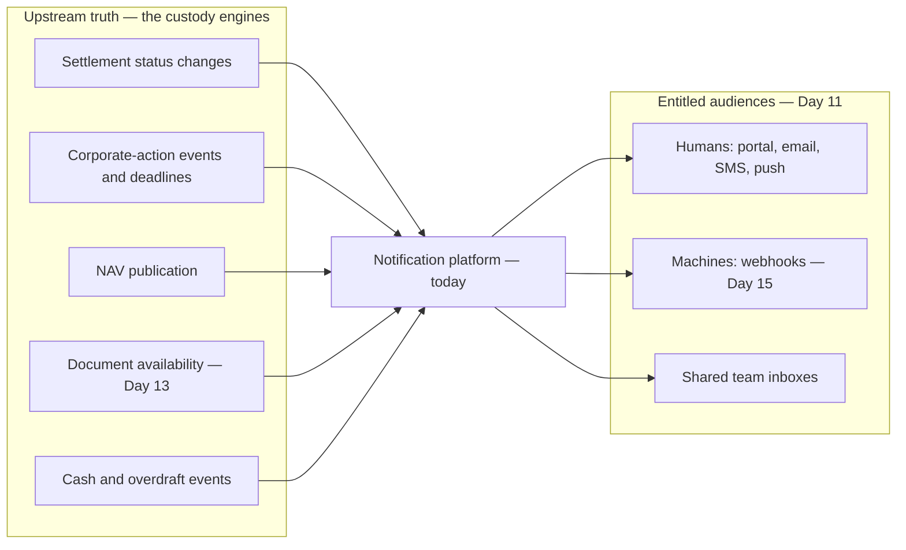
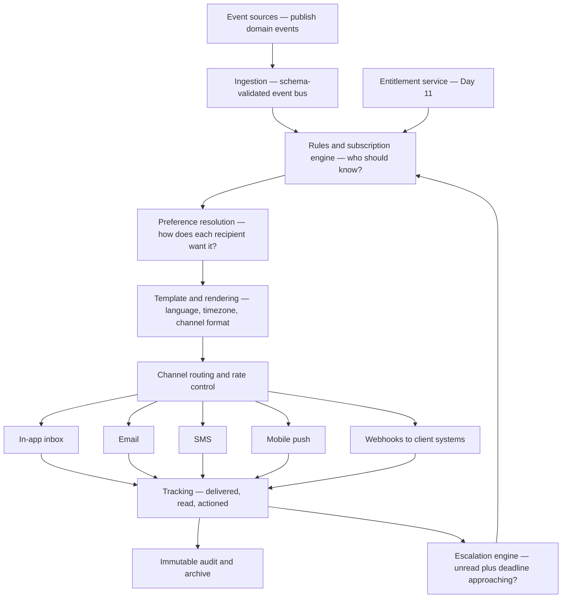
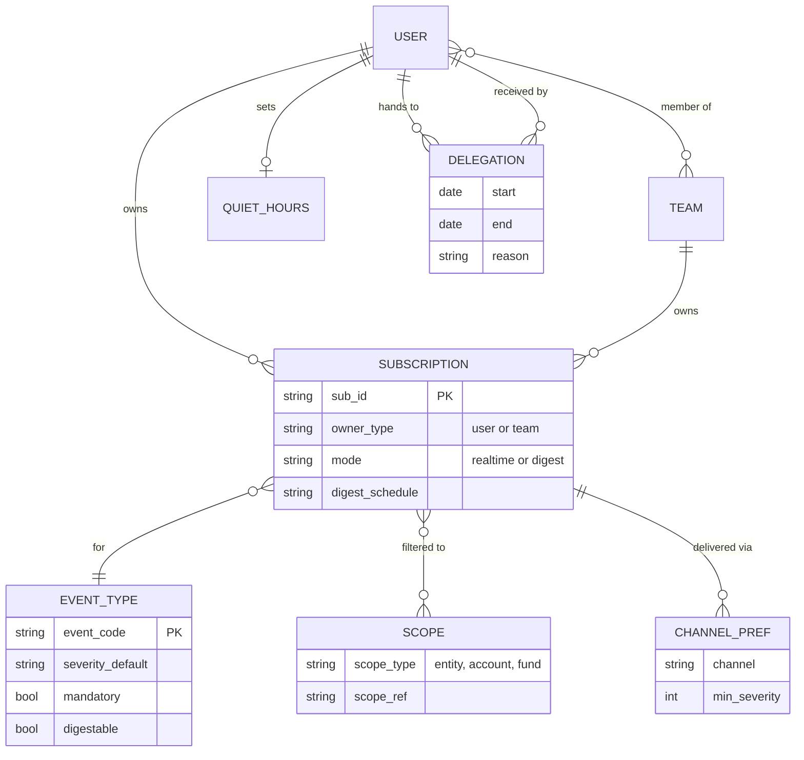
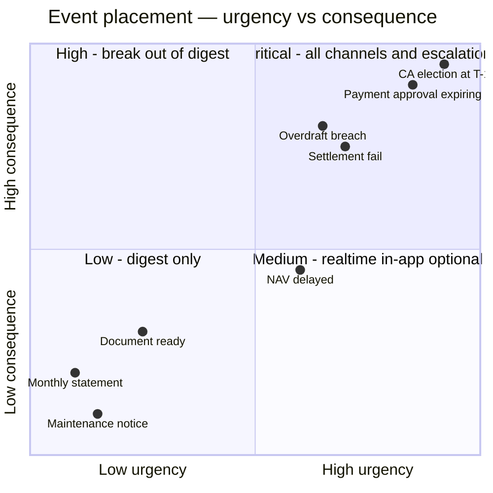
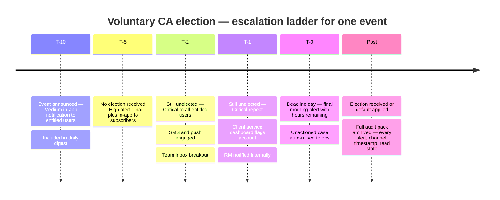

# Day 12 — Alerts and Notifications as a Platform

> Week 2 · Product and Digital Experience · Est. reading time: 60–90 min

## 🎯 Learning objectives

By the end of today you can:

- Argue why notifications must be a **shared platform capability**, and quantify the cost of every product team building its own.
- Draw the end-to-end anatomy: event sources → rules/subscription engine → preferences → templating → channel delivery → tracking and audit.
- Design a preference model that handles per-event, per-account, digest vs real-time, quiet hours, and team delegation without collapsing into chaos.
- Attack alert fatigue with a severity taxonomy and deadline-driven escalation (the corporate-action T-5/T-2/T-1 pattern).
- Specify the compliance layer: archiving, proof of delivery for regulatory notices, and deliverability engineering.
- Outline a real product spec for a "CA deadline alerting" epic, including SLOs and observability.

## 🧭 Where this fits

Yesterday you decided *who* may see and do things (IAM). Today is about the platform that tells those entitled people *when something needs their attention* — because in custody, information that arrives late is functionally information that never arrived. A missed corporate-action election deadline or an unnoticed settlement fail turns into client losses, claims, and relationship damage. Notifications are also the connective tissue for the rest of the week: documents (Day 13) announce themselves through this platform, and APIs (Day 15) deliver the same events to machines via webhooks.



## Part 1 — Core concepts

### 1.1 Why a platform, not a feature per app

Left alone, every product team builds its own notifier. The settlements screen emails from its own SMTP relay; the documents team bolts on "statement ready" emails; the CA team builds deadline reminders in a batch job. Within three years you have:

| Symptom | Cost |
|---|---|
| 9 template engines, 9 visual styles | Clients see a schizophrenic brand; every rebrand is 9 projects |
| No unified preference center | Client must configure alerts in 6 places; support tickets: "how do I stop these emails?" |
| No global suppression or quiet hours | The same user gets 400 emails during a market event; no one can turn the firehose down |
| No shared audit trail | Compliance cannot prove a regulatory notice was delivered; legal discovery spans 9 systems |
| No shared deliverability management | One team's blast tanks the sending domain's reputation; **everyone's** email goes to spam |
| Duplicate engineering | Each team re-solves retries, bounce handling, unsubscribe, timezone math — badly |

The platform argument in one sentence for your steering committee: *notifications are undifferentiated heavy lifting with shared blast-radius — exactly the profile of capability that must be built once, run centrally, and consumed by product teams through self-service.*

What stays with product teams: **which events matter, what the message says, and what the user can do about it.** What moves to the platform: everything between the event and the inbox.

### 1.2 Anatomy of a notification platform



Walk the stages:

1. **Event sources.** Custody engines publish domain events: `settlement.status.changed`, `ca.event.announced`, `ca.deadline.approaching`, `nav.published`, `document.available`. The platform never polls screens; it consumes versioned, schema-validated events (this same event backbone feeds Day 15's webhooks).
2. **Rules and subscription engine.** Two grant paths: *explicit subscriptions* ("alert me on settlement fails for accounts 100–120") and *mandatory notifications* (regulatory notices, security alerts — cannot be unsubscribed). Every resolution is filtered through **entitlements**: you can only be notified about funds you can see. An alert leaking a fund name to an unentitled user is a data breach in miniature.
3. **Preference resolution.** The recipient's channel, format, digest, quiet-hours, and delegation settings are applied (Part 2.1).
4. **Template and rendering.** Central template service: versioned templates, brand-consistent, localized, timezone-correct, with per-channel variants (a 3-line SMS and a full email from one logical template).
5. **Channel delivery.** Pluggable providers with retries, failover, and per-channel rate control.
6. **Tracking and audit.** Delivery receipts, opens/reads where possible, in-app read state, webhook acknowledgments — feeding both the escalation engine and the compliance archive.

### 1.3 The channels and when each wins

| Channel | Latency | Richness | Reliability of "seen" signal | Best for |
|---|---|---|---|---|
| In-app inbox | Instant when logged in | High — actionable links | High (read state is truth) | Everything; the system of record for the user |
| Email | Seconds–minutes | High | Low (opens are unreliable) | Digests, documents-ready, non-urgent detail |
| SMS | Seconds | Very low, 160 chars | Medium (delivery receipts) | Urgent deadline escalation, step-up codes only if unavoidable |
| Mobile push | Seconds | Low–medium | Medium | Urgent nudges for enrolled users |
| Webhook | Sub-second | Structured JSON | High (HTTP ack + retries) | Client ops platforms consuming events as machines |

Rule of thumb: **in-app is the ledger, other channels are pointers to it.** The email should say "3 corporate-action elections due in 2 days — open the portal," not carry the full entitled data into an uncontrolled inbox. This posture also simplifies compliance (less sensitive data leaving your perimeter) and keeps the portal the center of gravity.

### 1.4 Vocabulary check

Terms you will use precisely from today onward:

- **Event** — a fact from an upstream system ("settlement failed"), with no opinion about who cares.
- **Notification** — the platform's decision that a specific recipient should learn about an event, in a channel, at a time.
- **Subscription** — a standing request (user- or team-owned, scoped) to be notified about an event type.
- **Digest** — a batched rendering of multiple notifications on a schedule; a property of delivery, not of the event.
- **Escalation** — a state machine that re-notifies with widening audience and rising severity while a condition persists.
- **Suppression** — a deliberate, logged decision not to deliver (bounced address, muted type, quiet hours) — never a silent drop.

The event/notification distinction is the one to police in design reviews: teams who conflate them build "send email when X" spaghetti; teams who separate them get storm collapse, digests, webhooks, and audit for free from the same pipeline.

## Part 2 — The system deep dive

### 2.1 Preference models that survive contact with real clients

Institutional preferences are organizational, not personal. A pension fund's ops team of 8 shares coverage; a user going on leave must not silently orphan a deadline alert. The model:



Design decisions encoded here, each learned the hard way somewhere:

- **Subscriptions can be owned by teams**, delivering to a shared inbox or distribution list, with read-state tracked per team. Coverage survives any individual's vacation.
- **Scope filters reuse Day 11's hierarchy** (entity/account/fund) — never a parallel taxonomy. When a user gains a fund entitlement, offer (don't force) the matching subscriptions.
- **Channel preferences carry a minimum severity**: "email me everything, SMS me only Critical." This one field kills half of alert fatigue.
- **`mandatory` and `digestable` are event-type attributes set by you, not the user.** A regulatory notice is mandatory and non-digestable. A NAV publication is digestable. Users choose within guardrails.
- **Quiet hours defer, never drop** — deferred items land in the morning digest — and *mandatory + Critical overrides quiet hours*, prominently disclosed.
- **Delegation is dated and reasoned** ("annual leave until 24 Jul"), auditable, and auto-expiring. Silent permanent forwarding is how alerts rot.

### 2.2 Event to delivery, end to end

Worked scenario: custody ops marks trade T-88231 as **failed settlement** (counterparty short). Two client users are subscribed: Priya (real-time, in-app + email) and the shared "EMEA Ops" team inbox (digest mode, but severity High breaks out of digest).

```mermaid
sequenceDiagram
    autonumber
    participant Core as Settlement engine
    participant Bus as Event bus
    participant Rules as Rules engine
    participant Ent as Entitlement svc
    participant Pref as Preference svc
    participant Tmpl as Template svc
    participant Email as Email provider
    participant App as In-app inbox
    Core->>Bus: settlement.status.changed v3 for T-88231, severity High
    Bus->>Rules: Deliver event
    Rules->>Ent: Who is entitled to account A-1104?
    Ent-->>Rules: 11 users, 1 team
    Rules->>Rules: Match subscriptions — Priya, EMEA Ops team
    Rules->>Pref: Resolve channels and modes
    Pref-->>Rules: Priya realtime in-app plus email; team breakout for High
    Rules->>Tmpl: Render per recipient — locale en-GB, timezone Europe/London
    Tmpl-->>Rules: Rendered payloads with idempotency keys
    Rules->>App: Write inbox items
    Rules->>Email: Send 2 emails
    Email-->>Rules: Provider accepted, message ids
    Email-->>Rules: Bounce for stale team alias
    Rules->>Rules: Log bounce, raise ops task, mark address suppressed
    Note over Rules: All steps written to immutable audit trail
```

Non-negotiables visible in this flow: **idempotency keys** (a bus redelivery must not double-email a payment alert), **entitlement check at send time** (not subscription time — access may have been revoked since), and **bounce handling as a first-class workflow** (a bouncing address on a deadline alert is an operational risk event, not a log line).

### 2.3 Webhooks — the machine channel done properly

Webhooks deserve their own engineering discipline because the consumer is a client's production system, and a sloppy webhook implementation becomes *their* incident and *your* escalation:

| Concern | Requirement | Why |
|---|---|---|
| Authenticity | Sign every payload (HMAC or asymmetric signature) with rotating keys; publish verification docs | Client must be able to prove the event came from you, not an attacker |
| Delivery semantics | At-least-once with exponential backoff over 24–72h; then dead-letter and alert both sides | Client endpoints go down at 2am; deadline events must not evaporate |
| Idempotency | Stable event id in every payload | At-least-once means duplicates; clients must dedupe safely |
| Ordering | Do not promise global ordering; include sequence hints and timestamps per entity | Promising ordering you cannot keep breaks client reconciliations silently |
| Replay | Client-initiated replay API for a time window | The polite answer to "our listener was down all weekend" |
| Schema evolution | Versioned payloads; additive changes only within a version | Client parsers are brittle and change on quarterly release cycles |
| Failure visibility | Client-facing dashboard of their endpoint health and recent failures | Turns "your webhooks are broken" calls into self-service |

Note how much of this table reappears on Day 15 — a webhook is an API product with the arrow reversed, and it should be governed by the same versioning, documentation, and deprecation policies as your REST endpoints.

### 2.4 Alert fatigue: severity taxonomy and prioritization

Alert fatigue is the platform's primary failure mode: over-notified users create inbox rules that bury everything, then miss the one alert that mattered — and blame you. Defenses are taxonomy, defaults, and escalation.

**Severity taxonomy (yours to own, small and stable):**

| Severity | Definition | Default channels | Example |
|---|---|---|---|
| Critical | Financial loss or irreversible deadline within 24h if unactioned | All channels, overrides quiet hours, escalates | CA election unelected at T-1; payment approval expiring |
| High | Action needed within days; loss possible | In-app + email, breaks out of digest | Settlement fail; overdraft breach |
| Medium | Awareness; action optional | In-app + digest | NAV published late; document ready |
| Low | Informational | Digest only | Monthly statement available; scheduled maintenance |



Anti-fatigue tactics that work: (1) **severity floors per channel** in preferences; (2) **default new users into digests** for Medium/Low — opt *up* to real-time, not opt down from a firehose; (3) **collapse storms**: 300 settlement fails from one market outage become one alert "312 settlements failed in market XETR" with a drill-down link, not 312 emails; (4) **measure read rates per event type** and demote chronically-ignored alerts; (5) never let a product team mark its own events Critical without platform review — severity inflation is the tragedy of the commons.

### 2.5 Deadline-driven escalation — the CA pattern

Corporate-action elections are the canonical case: the client must instruct a choice (take cash or shares, subscribe or lapse) by a hard market deadline. Miss it and the default option is applied — potentially a material loss and a claim against whoever failed to notify.



Design notes: the ladder is **state-driven, not schedule-driven** — the moment an election is received, all pending escalations for that event cancel (nothing destroys trust like being nagged about a task already done). Rungs widen the audience deliberately: subscriber → all entitled users → your own client-service team. And the *internal* escalation at T-1 is a product feature: your ops calling the client about an unelected event at T-1 is exactly the service moment that renews mandates.

### 2.6 Deliverability, compliance, and observability

**Deliverability is engineering, not luck.** Email from a custodian competes with the world's spam: dedicated sending domains and IPs per traffic class (alerts vs marketing must never share reputation), SPF/DKIM/DMARC enforced, bounce classification (hard bounces suppress immediately; a hard bounce on a Critical alert opens an ops task to obtain a new address), feedback-loop handling for spam complaints, and warm-up plans for new IPs. One shared-domain blast from another department can poison your alert deliverability for weeks — argue for isolation now.

**Compliance layer:**

- **Archive everything**: rendered content (not just the template reference — you must reproduce *exactly what the client saw*), recipients, channels, timestamps, delivery evidence. Retention aligned to your books-and-records schedule (7+ years; Day 13 covers WORM storage).
- **Proof of delivery for regulatory notices**: some communications (fee changes, terms updates, certain shareholder communications) legally require evidence of delivery. Pattern: mandatory event type + in-app acknowledgment ("Acknowledge" button with timestamp) + delivery-evidence bundle per recipient.
- **Content review**: templates for regulated communications go through compliance approval *once per template version*, not per send — versioned templates make this tractable.

**SLOs and observability for the pipeline:**

| SLI | SLO (representative) | Alarm consumer |
|---|---|---|
| Event ingestion to channel handoff, p95 | < 60s for Critical/High | Platform on-call |
| End-to-end delivery success (non-bounce) | > 99.5% | Platform on-call |
| Critical alert delivery, p99 | < 5 min including retries | Platform on-call + product |
| Escalation job timeliness (T-5/T-2/T-1 fired on time) | 100%, reconciled daily | Ops + product — this one is money |
| Dead-letter queue depth | ~0, paged above threshold | Platform on-call |
| Bounce rate per domain | < 2% | Deliverability owner |

The reconciliation job deserves emphasis: every day, compare "CA events with deadlines in window" against "escalation alerts actually sent." A silent failure in the escalation scheduler is the nightmare scenario — the platform looks healthy while deadline alerts silently don't fire. **Detect the absence of expected alerts**, not just the failure of attempted ones.

### 2.7 Internationalization and timezone correctness

Deadlines make timezone bugs financially dangerous. Rules: store every deadline as an instant (UTC) **plus** its market timezone; render in the *recipient's* timezone with the market time alongside ("Deadline: 10:00 Tokyo — 02:00 your time, 13 Aug"); compute T-n escalation rungs in the **market's** calendar (business days, market holidays — T-2 before a Tokyo deadline is not two calendar days); test DST transitions explicitly (the classic bug: an escalation firing an hour late on the four weeks a year when Europe and the US are out of sync). Localization: templates externalize all strings; dates, numbers, and currency formats follow the recipient locale; and legal-entity-specific footers (sender identification, disclaimers) vary by the client's jurisdiction.

### 2.8 Worked product spec outline — "CA deadline alerting" epic

The artifact your product managers should produce; use this as the quality bar:

1. **Problem statement.** In the trailing 12 months, N voluntary CA events defaulted for lack of client election; M generated claims totaling USD X; client service handles ~Y calls/month asking "what's due." (Real numbers from ops — if nobody can produce them, that's finding #1.)
2. **Outcome metrics.** Unelected-at-deadline rate ↓ 60%; % elections submitted >24h before deadline ↑; deadline-related inbound calls ↓ 40%.
3. **Scope.** Event types: voluntary and choice-mandatory CA events across markets A/B/C. Ladder: T-5/T-2/T-1/T-0 with state-driven cancellation. Audience widening per Part 2.5. Channels: in-app, email, SMS (Critical only), webhook parity for API clients.
4. **Preferences.** Team subscriptions supported; T-2 and later rungs are mandatory-class (cannot be fully muted, may be channel-tuned). Explicitly documented for clients.
5. **Entitlement integration.** Recipients resolved via entitlement service at send time; fund-scoped.
6. **Compliance.** Alert content approved template v1.0; full audit pack per event; delivery evidence retained 7y.
7. **Observability.** Daily reconciliation of deadlines vs alerts sent; dashboard for ops; SLOs per Part 2.6.
8. **Edge cases.** Deadline amended by market (re-baseline ladder, notify "deadline changed"); event cancelled (cancel ladder, notify); election received then amended; client with zero subscribed users (escalate internally — this is a coverage gap, not silence).
9. **Rollout.** Pilot with 5 friendly clients, measure read/action rates, tune copy, then GA with RM communication kit.

### 2.9 Failure modes

| Failure | Cause | Consequence | Control |
|---|---|---|---|
| Silent missing alerts | Scheduler dead, event dropped upstream | Client misses CA deadline; claim against you | Daily reconciliation of expected vs sent (Part 2.6) |
| Entitlement leak in alert | Send-time check skipped or cached stale | Unentitled user learns fund positions exist | Send-time resolution against Day 11 service; leak tests in CI |
| Duplicate Critical alerts | Bus redelivery without idempotency keys | Client actions a payment approval twice; trust erosion | Idempotency key per logical notification, dedupe at channel edge |
| Notification storm | Market event fans out per-transaction | 400 emails per user in an hour; inbox rules bury you forever | Storm collapse to aggregate alerts with drill-down |
| Deliverability collapse | Shared domain reputation poisoned by another sender | All alert email lands in spam for weeks | Dedicated domains and IPs per traffic class; DMARC enforced |
| Stale nag | Escalation not cancelled after client acted | Users learn alerts can be wrong, ignore all of them | State-driven cancellation as a hard requirement |
| Timezone drift | T-n computed in server timezone, DST edge | Escalation fires hours late in the four DST-skew weeks | Market-calendar rung computation; explicit DST test cases |
| Template regression | Copy change breaks a variable binding | Alert renders "Dear {name}, deadline {date}" to 2,000 clients | Versioned templates, rendering tests with golden files, canary sends |

### 2.10 A note on the economics

Rough platform math to keep in your pocket for funding conversations. Assume 3,000 client organizations, 30 active users each — 90,000 users — receiving an average of 6 notifications/day: ~200M notifications/year. Direct channel costs are trivial (email fractions of a cent; SMS reserved for Critical). The real money:

| Line | Per-app world (9 notifiers) | Platform world |
|---|---|---|
| Engineering maintenance | 9 teams × ~0.5 FTE = 4.5 FTE | Platform team ~4 FTE serving everyone |
| New product's time-to-notify | 3–6 months building plumbing | Days — register events, write templates |
| Compliance evidence production | Manual archaeology across 9 systems per request | Query the archive |
| One missed CA deadline claim | Uncapped — six figures is unremarkable | The reconciliation exists precisely to prevent it |

The platform does not win on channel costs; it wins on **avoided claims, compliance cycle time, and product velocity**. Frame it that way — a steering committee hears "cheaper emails" as trivial and "we cannot currently prove we alerted the client before the deadline they missed" as existential.

## Part 3 — The VP lens

### Decisions you own

1. **Platform funding model.** Central platforms die when funded as "someone's side project." Options: tax on product lines (resented), central platform budget (cleanest), or charge-back per notification (bureaucratic). Recommend central budget with a published roadmap and consumption SLAs — you will defend this at steering committee (Day 14 rehearses exactly this).
2. **Migration sequencing.** You will inherit 6–9 legacy notifiers. Do not big-bang. Sequence: new use cases on platform only → highest-risk legacy flow (CA deadlines) migrated with parallel-run reconciliation → long tail by attrition. Publish a sunset date for legacy SMTP relays or attrition never finishes.
3. **Severity governance.** You chair (or delegate but own) the review that admits new event types and severities. This is boring and utterly necessary — severity inflation is a governance failure, not an engineering one.
4. **Mandatory vs optional boundary.** Legal/compliance will want everything mandatory; users will drown. Your job is the negotiated floor: regulatory notices and T-2+ deadline rungs mandatory, everything else preference-driven. Get it signed once as policy.
5. **Webhook parity.** Decide early that every client-relevant event ships in-app **and** as a webhook from day one. Retrofitting machine channels later doubles the work; parity by construction feeds Day 15's API story free.

### Trade-offs

- **Reach vs restraint:** more alerts raise "coverage" metrics and drown users. Optimize for *actioned* alerts, not sent alerts.
- **Real-time vs digest defaults:** real-time flatters demo audiences; digests respect working users. Default to digest for Medium/Low, real-time only for High/Critical.
- **Rich email vs pointer email:** rich emails reduce clicks but leak entitled data into inboxes and complicate compliance. Pointer-style wins for custody.
- **Central templates vs team velocity:** teams want to ship copy changes instantly; compliance wants review. Solve with versioned templates, pre-approved components, and a fast lane for non-regulated copy.

### Metrics that tell you the truth

| Metric | Healthy shape | Rot signal |
|---|---|---|
| Read rate per event type | > 60% for High+ | Critical alerts under 40% read — fatigue or mis-severity |
| Action rate on actionable alerts | Rising | Alerts read but tasks still late — copy or link problem |
| Unelected-at-deadline CA rate | Falling toward ~0 | Flat despite alert volume — wrong recipients |
| Unsubscribe and mute rates per type | Low, stable | Spikes after a launch — a team over-notified |
| % events with zero entitled subscribers | ~0, monitored | Silent coverage gaps |
| Escalation reconciliation breaks | 0 | Any — treat as Sev-1 |
| Notifications per user per day, p95 | < 15 | 50+ — you are training users to ignore you |

### Questions to ask your teams this week

- "Show me yesterday's reconciliation between CA deadlines in window and escalation alerts sent. If we don't have one, when will we?"
- "Which event types have read rates under 30%? Why do they still default to real-time email?"
- "What happens to a Critical alert when the email provider is down — and how long until failover?"
- "Can compliance reproduce, byte for byte, the notice we sent client X on 3 March, with delivery evidence?"
- "How many distinct systems can send email to clients today? What is the plan and date for that number to be one?"
- "When a client says they never received an alert, what is our mean time to produce the evidence — minutes or days?"
- "Do our webhooks meet the same signing, retry, and replay standards we would demand from a vendor's webhooks?"

### A 90-day arc for a new VP inheriting this space

| Days | Focus | Deliverable |
|---|---|---|
| 0–30 | Inventory: every system that contacts clients, every event type, read rates, the CA claim history | The "notification estate" one-pager with the scary numbers |
| 31–60 | Stand up governance: severity board, mandatory/optional policy signed by compliance, reconciliation for deadline alerts | First reconciliation report; first demoted noisy alert |
| 61–90 | Platform case: funding model, migration sequence, webhook parity decision | Steering-committee paper (Day 14 teaches the room; this is the artifact) |

## 🏦 State Street context

*Representative and public-knowledge framing.* At State Street's scale — tens of trillions in assets under custody/administration, thousands of client organizations, servicing spanning custody, fund accounting, transfer agency, middle office, and the **Alpha** front-to-back platform — notification pressure is structural:

- **Event volume is enormous and spiky**: month-end NAV publication waves, market-wide settlement disruptions, and proxy/CA season create bursts that a per-app emailer cannot absorb; a shared pipeline with storm-collapse logic is the only sane architecture.
- **my.statestreet.com** functions as the client hub across many servicing products; clients reasonably expect one alert inbox and one preference center across custody, fund services, and Alpha data — a heterogeneous back-end (decades of acquisitions and platform generations, including Brown Brothers Harriman Investor Services integration) makes the "one event backbone" the hard, valuable work.
- **Institutional clients are ops teams, not consumers**: shared-inbox delegation, team subscriptions, and webhook delivery into their own dashboards (State Street clients often consume events via file and API channels alongside the portal) are first-order requirements, not enhancements.
- **Regulatory perimeter shapes the compliance layer**: as a G-SIB with major EU operations, books-and-records retention, DORA-grade operational-resilience evidence for the alerting pipeline itself, and per-jurisdiction disclosure formatting are standing requirements your platform must satisfy by design.
- Organizationally, expect the event sources to be owned by **many** technology groups across product lines. Your leverage as Digital Experience VP is a published event contract and an easy on-ramp — teams adopt the platform because it is the cheapest way to reach clients, not because a memo said so.

## 💪 Exercises

1. **Storm design.** A market outage causes 2,400 settlement fails across 300 client accounts in 20 minutes. Specify precisely what each affected user receives (count, content, channels, timing), what ops sees, and what the audit trail records. Then specify what a *naive* per-event design would have sent, and the resulting damage.
2. **Preference center critique.** Sketch the preference screen implied by the erDiagram in Part 2.1 for a client ops manager who runs a team of 6. Identify the three hardest UX problems (hint: team vs personal subscriptions, severity floors, delegation visibility) and propose treatments.
3. **Write the reconciliation spec.** One page: inputs, comparison logic, tolerance, alerting, and ownership for the daily "deadlines vs alerts sent" reconciliation in Part 2.6. Include what happens on a non-zero break at 7am.
4. **Severity court.** A product team requests Critical severity for "intraday cash balance below threshold." Argue both sides in writing (client treasurer's view vs fatigue governance), then rule — including the conditions under which your ruling would change. Practice writing the decision in five sentences; this is the format your severity review board should use.

## ❓ Self-check quiz

1. Name three concrete costs of letting each product team build its own notification path.
2. Why must entitlements be checked at send time rather than at subscription time?
3. What distinguishes a `mandatory` event type from a Critical severity, and who controls each?
4. In the CA escalation ladder, why is state-driven cancellation as important as the escalation itself?
5. Why is "detect the absence of expected alerts" a separate engineering requirement from normal error handling?

<details>
<summary>Answers</summary>

1. Any three of: brand and template fragmentation; no unified preference center (support burden, client frustration); shared email-domain reputation damage from one bad sender; no consolidated audit/proof-of-delivery for compliance; duplicated engineering for retries, bounces, timezone logic; no global fatigue controls (storm collapse, severity floors).
2. Access changes between subscription and event: a user may have lost entitlement to the fund (mover/leaver, recert revocation) since subscribing. Sending would leak entitled data to a now-unentitled recipient — a data breach. Send-time resolution against the entitlement service (Day 11) guarantees currency.
3. Severity describes urgency/consequence and drives default channels and escalation; `mandatory` means the recipient cannot unsubscribe (regulatory notices, late deadline rungs). Both are event-type attributes governed by the platform owner (with compliance for mandatory), never by end users, and severity assignments by product teams require platform review.
4. Because nagging users about tasks they have already completed destroys trust in the entire alert channel — users who learn alerts can be stale start ignoring all of them, recreating the fatigue problem the ladder was built to solve. The ladder must cancel instantly when the election is received.
5. Normal error handling catches attempted sends that fail (bounces, provider errors). A broken scheduler or a dropped event produces no attempt at all — the system looks healthy while deadline alerts silently never fire. Only an independent reconciliation of "expected alerts given the deadline book" vs "alerts actually sent" catches this class of failure, and in custody it is the class with direct financial consequence.

</details>

## 🔑 Key takeaways

- Notifications are a platform capability: shared blast radius (deliverability, brand, audit) plus undifferentiated plumbing means build once, consume by self-service.
- The pipeline is event → rules/subscriptions (entitlement-filtered at send time) → preferences → versioned templates → channels → tracking → immutable archive.
- Preference models must be organizational: team subscriptions, delegation with expiry, severity floors per channel, digest defaults.
- Fight alert fatigue structurally: small stable severity taxonomy, storm collapse, read-rate measurement, and governance against severity inflation.
- Deadline alerting is state-driven escalation with audience widening — and a daily reconciliation that detects missing alerts, not just failed ones.
- In-app is the ledger; email/SMS/push are pointers; webhooks give machines parity — one event backbone serves Days 12, 13, and 15.

## 📚 Going deeper

- Google SRE Workbook — chapters on alerting philosophy and SLOs (directly transferable to client-facing alerting)
- RFC 8058 (one-click unsubscribe), M3AAWG sender best practices, and DMARC.org — the deliverability canon
- ISO 20022 corporate-action message set (seev.*) — the semantics your CA events ultimately derive from
- SWIFT / SMPG corporate-action market practice guides — why deadlines and defaults behave as they do per market
- "Designing Data-Intensive Applications" (Kleppmann) — event logs, exactly-once myths, idempotency
- CloudEvents specification (cncf.io) — a sensible baseline for your event envelope
- Nielsen Norman Group research on notification and interruption design — the UX evidence base for digest defaults

## Tomorrow

Day 13: the payload behind half of today's alerts — documents and client reporting, from batch composition engines to WORM retention and the month-end mountain.
