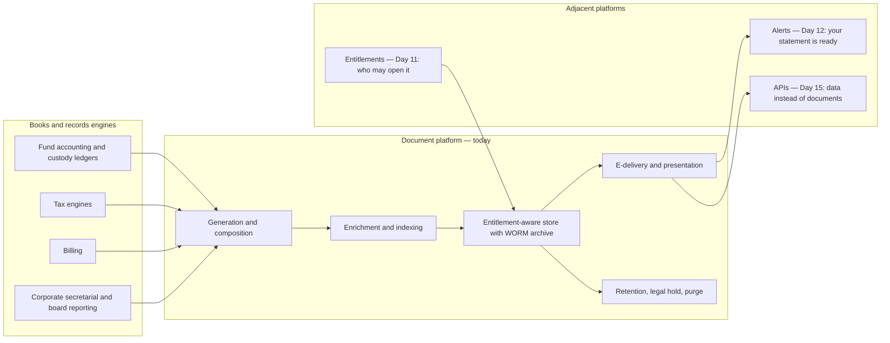
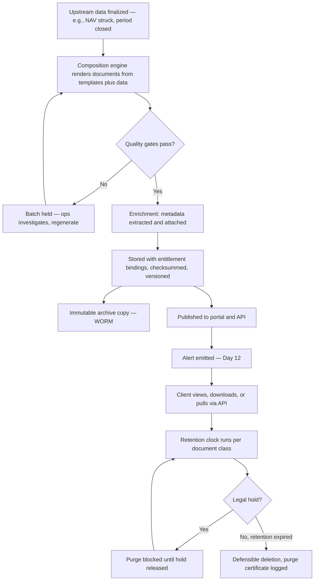
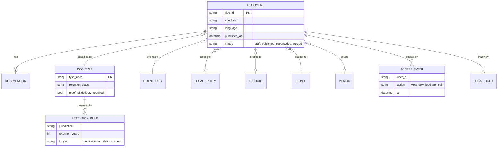
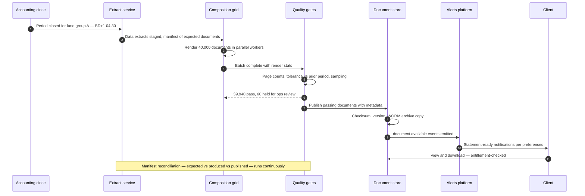
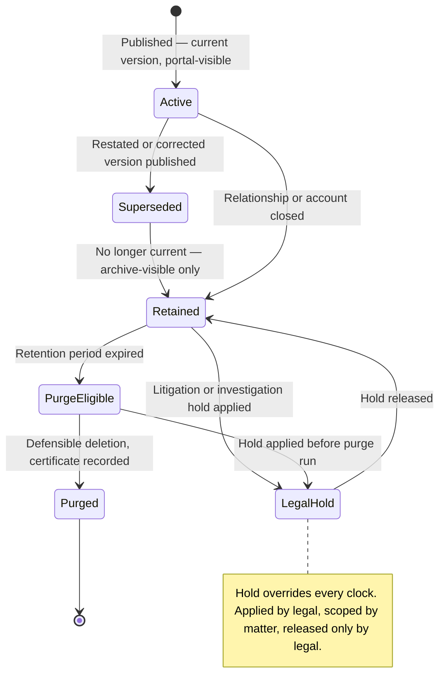

# Day 13 — Documents and Client Reporting

> Week 2 · Product and Digital Experience · Est. reading time: 60–90 min

## 🎯 Learning objectives

By the end of today you can:

- Map the document estate of a custodian — from daily contract notes to annual tax packs — and its distinct lifecycle and compliance demands.
- Explain the document lifecycle end to end: generation, enrichment and indexing, entitlement-aware storage, e-delivery, retention, legal hold, and defensible purge.
- Reason about month-end report-production peaks with real scale numbers, and know which pipeline stages break first.
- Judge when a client should graduate from PDFs to self-service reporting to raw data delivery — and why forcing the wrong tier damages the relationship.
- Navigate the SEC 17a-4 WORM-vs-GDPR-erasure tension and describe how legal hold actually works.
- Frame a migration off a legacy document platform as a risk program, not a storage project.

## 🧭 Where this fits

Documents are the oldest digital product a custodian has — banks were mailing statements before "portal" meant anything — and still the highest-volume client touchpoint. Yesterday's alerts platform announces documents ("your statement is ready"); Day 11's entitlements decide who may open them; Day 15's APIs are where sophisticated clients graduate when PDFs stop being enough. Today you learn the machinery in the middle: the estate, the factory, the vault, and the lawyers.

## Part 1 — Core concepts

### 1.1 The document estate of a custodian

Know the inventory before designing the warehouse. Each document class differs in volume, cadence, regulatory driver, and how angry someone gets when it is late or wrong:

| Document class | Cadence | Typical volume driver | Regulatory driver | Sensitivity if wrong/late |
|---|---|---|---|---|
| Custody/holdings statements | Monthly, quarterly | Accounts × entities | Books and records; client contract | High — the baseline trust artifact |
| Valuation reports | Daily/weekly/monthly | Funds × share classes | Client IMA terms; fund rules | Very high — feeds client NAV oversight |
| Contract notes / trade confirmations | Per trade, same day | Trade volume | MiFID II, market rules | Very high — legal record of the trade |
| Cash and transaction statements | Daily/monthly | Accounts × activity | Books and records | High |
| Tax documents (1099s, withholding, reclaims) | Annual + event-driven | Investors × jurisdictions | IRS/HMRC and local tax law | Extreme — hard external deadlines, penalties |
| Fee invoices | Monthly/quarterly | Billing relationships | Contract | Medium — disputes are relationship acid |
| Prospectuses, KIIDs/KIDs | On change + annual | Funds × languages | UCITS/PRIIPs | High — distribution without current version is a breach |
| Board and committee reports | Quarterly | Governed entities | Fund governance codes | High — directors' statutory duties rely on them |
| Regulatory notices and disclosures | Event-driven | Rule changes | Various | Extreme — proof of delivery required (Day 12) |
| Inbound client instructions (SSI changes, mandates) | Event-driven | Client ops activity | Contract + fraud controls | Extreme — the fraud vector |

Two structural observations. First, **the estate is mostly machine-generated** — perhaps 95% by volume comes out of batch composition, not humans writing documents. Second, **inbound documents are a different product** with different risks (authenticity, fraud, workflow) — Part 2.6.

### 1.2 The document lifecycle

The gate that separates professionals from amateurs is **QC before publication**: page counts vs expected, zero-value and null checks, comparison against prior period within tolerance ("this fund's statement is 40 pages, last month it was 4 — hold it"), and sampling for visual regression. Publishing a wrong statement and retracting it is far worse than publishing three hours late; retraction itself becomes a compliance event because the client may have already relied on it.

### 1.3 Generation: batch composition engines

Statements are not "PDF exports." A composition engine (the genre: OpenText Exstream, Quadient Inspire, smashing-scale in-house builders) takes **a data extract + a versioned template + assembly rules** and renders per-recipient documents with conditional sections (only show securities-lending pages if the client lends), language and branding variants, pagination, and accessibility tagging. Product-relevant properties:

- **Templates are software.** They are versioned, tested (golden-file rendering tests), and released; a template bug ships thousands of wrong documents per hour. Template change control is compliance-relevant (a fee-disclosure footnote is legal text).
- **Composition is embarrassingly parallel** — per-document independence means horizontal scale — but the *data extract* upstream usually is not; the extract query hammering the accounting database is the classic month-end bottleneck.
- **Idempotent regeneration** matters: when fund 7's NAV is restated, you regenerate 1 fund's documents, version them as "v2 — restated," and keep v1 immutably archived with a supersession link. Clients must see the current version *and* auditors the history.

### 1.4 Metadata: the difference between a store and a dump

A custody document store without rich metadata is a landfill with a search box. The core model:

Notice that **entitlement scoping reuses Day 11's hierarchy** (client org / entity / account / fund) — a user sees exactly the documents whose scope intersects their grants, with zero per-document permissioning. And every access is an event: "who has viewed this valuation" is a question clients' auditors ask, and yours.

## Part 2 — The system deep dive

### 2.1 Month-end: the production peak, with numbers

Representative scale for a large custodian's client-reporting factory (rounded for arithmetic, realistic in shape):

| Input | Value |
|---|---|
| Client organizations | 3,000 |
| Custody accounts | 150,000 |
| Funds under administration | 20,000 |
| Statement documents per month-end cycle | ~450,000 (accounts × statement types, entities consolidated) |
| Valuation and accounting packs | ~60,000 |
| Pages composed in the 5-day window | ~25 million |
| Business-day window to complete | BD+1 to BD+5, with client-specific SLAs |

The killer property is **concentration**: perhaps 70% of monthly volume lands in five business days, and within that, the first 36 hours after accounting close are the crunch. Size the pipeline for the peak, and instrument the *dependencies*:

The **manifest** (step 2) is the unsung hero, the same pattern as Day 12's reconciliation: a statement that was never generated produces no error anywhere unless something knows it was *expected*. Ops dashboards must show expected/produced/published/failed per client SLA, live, throughout the window.

What breaks first, in order of empirical likelihood: (1) upstream close is late, compressing your window while the SLA clock runs; (2) the extract stage saturates the accounting database; (3) one malformed fund's data poisons a batch — the pipeline must quarantine per-document failures, not fail per-batch; (4) the notification wave hits email rate limits (Day 12's storm controls apply to good news too).

### 2.2 Retention, WORM, and the GDPR tension

Financial-records rules (e.g., **SEC 17a-4** in the US and analogous books-and-records regimes elsewhere) require records kept for defined periods in a form that prevents alteration or premature deletion — historically "WORM" (write once, read many), now also satisfiable via 17a-4(f) audit-trail alternatives. Meanwhile **GDPR** grants data subjects erasure rights and mandates storage limitation. The reconciliation, in practice:

- Legal-obligation processing defeats erasure requests *for the retention period*: you may lawfully refuse to erase a statement you are required to keep — but you must **prove the mapping** from each document class to its legal basis and period. That mapping is the `RETENTION_RULE` table above; keep it lawyer-signed and versioned.
- Storage limitation cuts the other way: keeping documents *past* their retention period "just in case" is itself a GDPR problem and a discovery liability. **Defensible purge is a feature**, with certificates logged for what was destroyed, when, under which rule.
- Minimize personal data in documents where possible, and never let convenience copies escape the governed store (a shared drive full of exported statements defeats the entire architecture — make the governed store the easiest place to get documents, which is a product problem).

**Legal hold mechanics** a VP should verify exist: holds are placed by legal via a console (not by emailing IT); they are scoped by matter to metadata queries ("all documents for client X, funds Y–Z, 2019–2023"); they block purge *and* are reported ("what is under hold and why"); and hold placement/release is itself audited. The catastrophic failure is purging documents that were under hold — that is spoliation, with court sanctions.

### 2.3 The reporting maturity ladder: PDFs → self-service → data

Clients graduate through three tiers, and revenue-relevant friction appears when you hold them at the wrong one:

| Tier | What the client gets | Who it serves | Limits |
|---|---|---|---|
| 1. Canned documents | Scheduled PDFs/statements | Boards, auditors, smaller clients | Static, monthly cadence, human-only |
| 2. Self-service reporting | Portal report builder: choose columns, periods, filters, export XLSX/CSV; save and schedule | Client ops and oversight teams | Bounded by your semantic layer; still human-driven |
| 3. Data delivery | Files (SFTP), APIs, or direct data-share into the client's warehouse | Clients with their own data teams and IBOR/oversight platforms | You become a data vendor: contracts, schemas, SLAs — Day 15 and Week 3 |

Signals a client is ready to graduate: they export the same report to Excel every day (tier 1→2); their ops team asks for the report "as of the moment we open it" or their data team asks for your column definitions (tier 2→3). Product stance: **make graduation easy and deliberate** — clients pushed to tier 3 before they can consume it drown and blame you; clients trapped in tier 1 mature into believing your platform is a fax machine. Note the cost asymmetry: tier 1 is expensive per document but cheap per client; tier 3 is expensive to stand up but nearly free per additional consumption. The pricing conversation (does data delivery cost extra?) is a live commercial debate — flag it for Day 15's monetization discussion.

Self-service reporting deserves one warning from scar tissue: the report builder is only as trustworthy as its **semantic layer**. If "market value" in self-service can differ from "market value" on the PDF statement (different pricing snapshot, different FX), you will manufacture client escalations at scale. One governed definition set must feed both — this is the Week 3 data-platform story arriving early.

### 2.4 Search across millions of documents

- **Metadata search is the workhorse** — 95% of client intent is "March 2026 statement for fund 12": type + period + scope filters over the erDiagram's fields. Invest here first; it is cheap, precise, and entitlement-filtering is trivial (filter on scope before ranking).
- **Full-text search is the luxury** — "find the document that mentions security XS1234..." requires extracting text at ingestion, indexing entitlement-aware (the index must never return a snippet the user cannot open — snippet leakage is a genuine breach class), and accepting OCR costs for scanned inbound documents.
- Ranking sanity: recency and type-priority beat TF-IDF cleverness for statements; a client searching "statement" wants last month's, not 2017's best keyword match.

### 2.5 Notifications integration

"Your statement is ready" is Day 12's `document.available` event with three document-specific subtleties: **batch collapse** (a client with 400 accounts gets one "your March statements (412) are ready" digest, not 412 emails); **proof-of-delivery classes** (documents whose delivery must be evidenced — regulatory notices — ride the mandatory-notification path with acknowledgment tracking); and **e-delivery consent** (many jurisdictions require explicit client consent to deliver statements electronically instead of by post; consent state is metadata that routes the document to portal-plus-alert vs the print-and-mail vendor — yes, that vendor still exists, and its feed comes from this same pipeline).

### 2.6 Inbound documents and e-signature

The reverse direction is a different product with a fraud budget. Clients send you: payment and settlement instructions, **standing settlement instruction (SSI) changes**, mandate and authorized-signer updates, subscription/redemption forms, KYC refresh documents. Controls that matter:

- **SSI changes are the classic fraud vector** (business email compromise: "please redirect proceeds to this new account"). Inbound-instruction handling needs channel authentication (portal-submitted with step-up beats emailed PDF — tie-in to Day 11's transaction-bound step-up), out-of-band callback verification as policy for high-risk changes, and workflow with four-eyes on your side.
- **E-signature** (DocuSign-class) for mandates and agreements: legally mature nearly everywhere (ESIGN/eIDAS), but the product work is *evidence packaging* — signer identity assurance, certificate of completion, and the signed artifact flowing into this same governed store with the same retention rules, not living in the e-sign vendor's cloud.
- Every inbound document gets the same treatment as outbound: classified, metadata-enriched, entitlement-scoped, retained. An emailed instruction that lives only in an ops mailbox is a records-management failure waiting for a subpoena.

### 2.7 Migrating off legacy document platforms

Every custodian has at least one 20-year-old document archive nobody dares touch. Migration is a risk program:

| Phase | Work | Trap to avoid |
|---|---|---|
| Inventory | Enumerate document counts, types, date ranges, metadata quality per legacy store | Discovering mid-migration that 30M documents have no machine-readable client ID |
| Legal mapping | Retention/hold obligations per class; what must migrate vs what can be purged *before* migration | Migrating garbage: purging eligible documents first can cut scope 40% |
| Metadata remediation | Backfill classification and scope bindings, often via rules + ML-assisted classification with human QA | Trusting auto-classification for entitlement-bearing fields without sampling audits |
| Dual-run | New documents to new platform; legacy read-only behind a search facade | Letting "temporary" facade become permanent (fund the retirement, not just the build) |
| Verified cutover | Checksum-verified copy, count reconciliation, WORM chain-of-custody evidence, legal sign-off | Breaking the immutability evidence chain — an archive whose integrity you cannot attest is an archive you do not have |
| Decommission | Legacy licenses, hardware, and its retention rules formally ended | Paying the mainframe archive's license forever "just in case" |

Chain-of-custody is the phrase to use with legal: for 17a-4-class records you must be able to show the migrated copy is complete and unaltered (checksums at source, in flight, at rest; reconciled manifests; signed attestation). Budget reality: metadata remediation, not data copying, is usually >50% of migration cost.

## Part 3 — The VP lens

### Decisions you own

1. **One document platform or federated stores?** Push hard for one governed store with one metadata model and one entitlement binding (Day 11's), fronted by portal, API, and search. Every additional store multiplies retention governance, legal-hold scope, and leak surface. Acquisitions will keep gifting you new stores; the *policy* that they migrate onto the platform within N months is yours to set.
2. **Composition engine: renew, replace, or wrap?** These are decade-scale, deeply embedded vendor decisions. Evaluation axes: template developer experience (release cycle time for a disclosure change is a compliance metric), peak throughput economics, accessibility output (PDF/UA — increasingly regulatory, e.g., European Accessibility Act), and data-extract decoupling. Wrapping legacy composition behind your own API while modernizing templates is often the pragmatic middle.
3. **Where does self-service reporting live?** If every product line builds its own report builder, you recreate the Day 12 fragmentation story with worse data-consistency stakes. One reporting service on one semantic layer; product lines contribute definitions, not engines.
4. **The graduation policy.** Decide deliberately when to *offer* data delivery, how it is priced, and who owns the client data contract. If you don't, sales will decide ad hoc, and you will support 40 bespoke file feeds by next year — the exact anti-pattern Day 15 is designed to prevent.
5. **Print's end state.** Paper still exists (consent gaps, jurisdictions, board packs). Set the e-delivery adoption target and the consent-capture campaign, because every mailed statement is cost plus latency plus a lost analytics signal.

### Metrics that tell you the truth

| Metric | Healthy shape | Rot signal |
|---|---|---|
| Month-end SLA attainment per client tier | >99% documents by BD+5 | Chronic misses concentrated in specific funds — upstream close problem, not composition |
| Manifest breaks (expected vs published) | 0 unexplained | Any silent gap — the un-generated statement nobody noticed |
| Retraction rate (documents recalled post-publication) | Near 0, every one reviewed | Rising — QC gates too loose or template chaos |
| E-delivery adoption / consent capture | Rising toward >90% | Plateau — consent UX problem |
| % documents viewed within 30 days | Know it per type | 8% viewership on a costly report — kill or redesign it |
| Time to produce a legal-hold evidence pack | Hours | Weeks of archaeology — the archive is a landfill |
| Self-service vs canned report ratio | Rising self-service | Clients exporting everything to Excel — semantic layer distrust |
| Search success (result opened per search session) | >80% | Repeated reformulations — metadata quality debt |

### Questions to ask your teams this week

- "Show me the month-end manifest dashboard from last cycle. How many documents were expected, produced, published — and who investigated the difference?"
- "When did we last purge documents on schedule, and can I see a purge certificate? If we have never purged, why are we comfortable in discovery?"
- "If legal calls at 4pm with a hold on client X, what happens mechanically, and how do we prove tonight's purge run respected it?"
- "Can 'market value' differ between the PDF statement and the self-service report for the same fund and date? Prove it can't."
- "How do SSI change instructions arrive today, channel by channel, and which channels have no out-of-band verification?"
- "What fraction of our documents have complete scope metadata? What is unclassifiable, and what is our exposure if it is subpoenaed?"

## 🏦 State Street context

*Representative and public-knowledge framing.* Documents and reporting sit at the heart of State Street's servicing propositions:

- **Scale is the defining constraint.** With tens of trillions in AUC/A across custody, fund accounting, and administration for thousands of fund structures, month-end document production runs at the "millions of pages in days" scale of Part 2.1 — and NAV/valuation reporting carries direct client-oversight weight, so QC-before-publish discipline is existential.
- **my.statestreet.com** is the delivery surface where clients expect a single document experience across custody statements, fund-services reporting, and (increasingly) **Alpha**-generated analytics — while the documents originate from multiple generations of platforms, including estates inherited through acquisitions such as Brown Brothers Harriman Investor Services. The federated-store problem in Part 3 is not hypothetical; it is the job.
- **The Alpha thesis changes the reporting story**: a front-to-back platform's promise is precisely that clients stop consuming reconciled PDFs and start consuming governed *data* (State Street's partnership-era messaging around Alpha Data Platform and cloud data-sharing, e.g., via Snowflake-style distribution, is public). Your Day 13 ladder — documents → self-service → data — is effectively the Alpha client-maturity story, which makes the semantic-layer consistency warning a strategic issue, not a detail.
- **Regulatory reality**: US books-and-records (17a-4-class) obligations, EU fund-documentation regimes (UCITS/PRIIPs), the European Accessibility Act pushing accessible document output, and GDPR-vs-retention mapping across a multi-entity, multi-jurisdiction group — the lawyer-signed retention-rule table is a living artifact here.
- Organizationally, expect document generation owned by operations-aligned technology teams per product line, while Digital Experience owns presentation, search, alerts integration, and increasingly the self-service layer. The seam — who owns metadata quality — is where document programs succeed or die; claim it early.

## 💪 Exercises

1. **Peak math.** Using Part 2.1's numbers, compute: documents per hour required to clear 450,000 statements in the first 3 business days assuming 18 productive hours/day; then recompute when the accounting close slips 12 hours on BD+1. What do you pre-negotiate with clients whose SLA becomes unmeetable — and what should the portal show them during the delay?
2. **Retention table drill.** Draft the `RETENTION_RULE` rows for: US trade confirmations, UK custody statements, fee invoices, and inbound SSI change instructions. For each: retention years (research or reasoned guess), trigger (publication vs relationship end), and the GDPR lawful basis you would cite against an erasure request. Mark which answers you would insist a lawyer signs.
3. **Fraud walk-through.** An email arrives from a client CFO's address instructing a change of SSI for redemption proceeds. Write the ideal handling flow across inbound-document capture, verification, four-eyes, and audit — then identify the two weakest links if the client insists on email because "the portal is slow."

## ❓ Self-check quiz

1. Why is publishing a wrong statement worse than publishing a late one, and which pipeline stage encodes that judgment?
2. What is the manifest pattern and which failure class does it uniquely catch?
3. How do SEC 17a-4-style immutability and GDPR erasure coexist in one architecture?
4. Give the three tiers of the reporting maturity ladder and one graduation signal for each transition.
5. Why is metadata remediation usually the dominant cost in a legacy document migration?

Answers

1. A published statement is relied upon immediately (client oversight, auditor consumption, onward reporting), so an error propagates into the client's own books and its retraction is itself a compliance event with mandatory client communication. Lateness costs SLA credits and irritation but nothing propagates. The QC gate before publication (page counts, prior-period tolerance, sampling) encodes exactly this asymmetry: hold on doubt.
2. A manifest declares, before generation, every document *expected* from a cycle (from accounts × types × schedules), then reconciles expected vs produced vs published continuously. It uniquely catches silent absence — the statement that was never generated — which produces no error in any component because no component knew it was supposed to exist. Same principle as Day 12's alert reconciliation.
3. Retention obligations are legal-obligation processing that lawfully overrides erasure requests during the retention period, provided each document class maps to a documented rule and period; WORM/immutable storage satisfies the records regime for that window. When retention expires (and no legal hold applies), GDPR's storage-limitation principle takes over and drives defensible purge with logged certificates. The architecture needs both the immutable archive and the purge machinery, driven by one signed retention-rule table.
4. Tier 1 canned documents → tier 2 self-service reporting: the client repeatedly exports the same PDF/report into Excel. Tier 2 → tier 3 data delivery: the client asks for data "as of now," requests column/field definitions, or their data team wants feeds into their own warehouse/oversight platform. (Any equivalent signals acceptable.)
5. Copying bytes is cheap and mechanical; but legacy documents commonly lack the machine-readable classification, client/account/fund scope bindings, and retention class that the target platform's entitlement, search, and governance layers require. Backfilling that metadata — rules, ML-assisted classification, human QA sampling, especially for entitlement-bearing fields where an error is a data leak — dominates cost and schedule.

## 🔑 Key takeaways

- The document estate is a portfolio of distinct products — statements, confirmations, tax packs, board reports, inbound instructions — each with its own cadence, regulator, and blast radius.
- The lifecycle is generation → QC gate → enrichment → entitlement-aware storage with WORM archive → e-delivery → retention → legal hold → defensible purge; the QC gate and the manifest reconciliation are the two disciplines that prevent silent disasters.
- Month-end is a concentration problem: size for the peak, quarantine per-document failures, and instrument expected-vs-published continuously.
- Retention and erasure coexist through a lawyer-signed mapping of document class → legal basis → period, plus purge as a real, certificated feature.
- Clients climb a maturity ladder from PDFs to self-service to data; your job is deliberate, consistent graduation on one semantic layer — this is the bridge to Week 3.
- Inbound documents (especially SSI changes) are a fraud product, not a storage product; and legacy migration is chain-of-custody risk management where metadata, not bytes, is the cost.

## 📚 Going deeper

- SEC Rule 17a-4 and the 2022 amendments (audit-trail alternative to WORM) — read the adopting release summary
- FINRA books-and-records guidance; CSSF/CBI fund-documentation circulars for the EU fund lens
- ARMA International's records-management principles (retention schedules, defensible disposition)
- PDF/UA and the European Accessibility Act — accessible document output requirements
- Sedona Conference commentaries on legal hold and defensible deletion — the litigation-side canon
- Vendor architecture papers from Quadient/OpenText on high-volume customer communications management (CCM) — know the genre your engineers evaluate

## Tomorrow

Day 14: the humans around all of this — stakeholder mapping, influence without authority, and the Week 2 capstone that assembles strategy, journeys, IAM, alerts, and documents into one platform picture.
