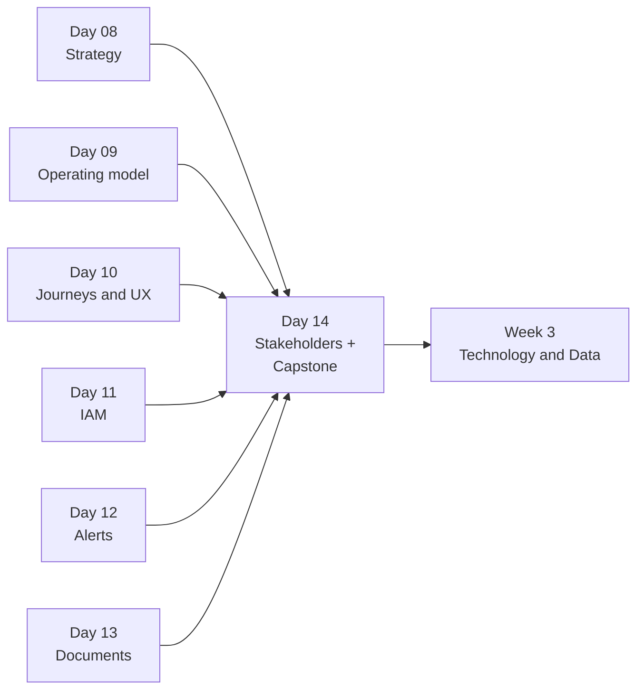
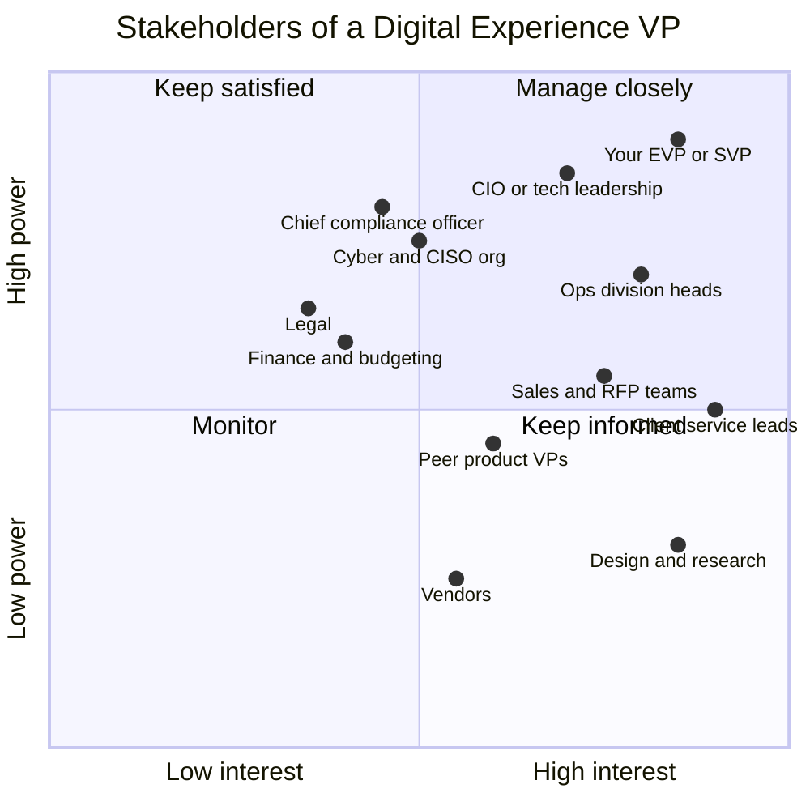
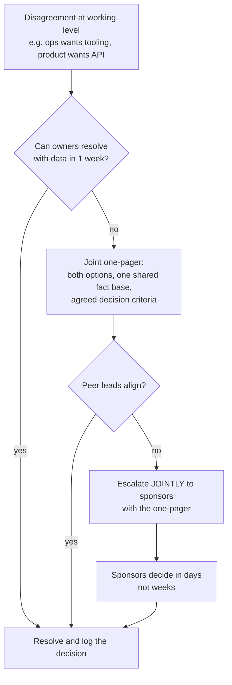
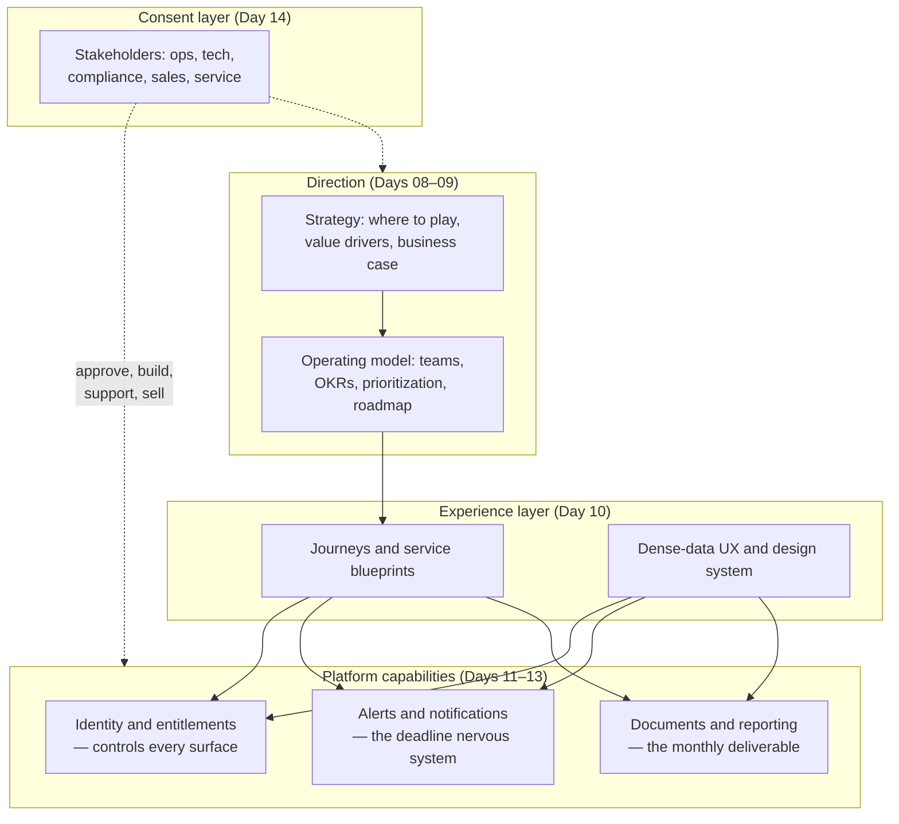

# Day 14 — Stakeholder Management + Week 2 Capstone

> Week 2 · Product Leadership and Digital Experience · Est. reading time: 60–90 min

## 🎯 Learning objectives

By the end of today you can:

- Map the stakeholder landscape around a Digital Experience VP on a power/interest grid
- Apply influence-without-authority techniques: currencies of exchange, coalition building, pre-wiring
- Describe what each partner function needs from you — and what you need from them
- Run escalations and decision forums that produce decisions instead of meetings
- Connect Week 2's six chapters into one platform picture (the capstone)
- Pass a 20-question quiz covering Days 8–13

## 🧭 Where this fits

You now know the craft (strategy, operating model, journeys) and the platform capabilities (IAM, alerts, documents). None of it ships without other people's consent and effort. At a custodian, a product VP controls perhaps 10% of what must move for a feature to reach a client; the other 90% belongs to operations, technology, compliance, legal, cyber, client service and sales. Stakeholder management isn't politics — **it's the operating system your roadmap runs on.**

---

## Part 1 — Core concepts

### The cast, mapped

The power/interest grid is old because it works. Populate it with your *actual* cast:

### What each function wants (and what you need)

| Partner | What they need from you | What you need from them | The trap |
|---|---|---|---|
| **Operations** | Tools that cut manual touches; no surprise launches that spike call volume | Domain truth, exception data, pilot users | Building *around* ops instead of *with* them — they can quietly kill adoption |
| **Technology/CIO** | Realistic roadmaps, prioritized demand, product decisions on time | Delivery capacity, architecture runway | Treating tech as a vendor; they're co-owners |
| **Compliance** | Early sight of anything client-facing; auditable requirements | Approval, and defense in front of regulators | Bringing them a finished feature ("approval theater") — engage at concept stage |
| **Cyber/CISO** | Threat-model participation, entitlement rigor (Day 11) | Pen-test capacity, security patterns pre-blessed | Assuming "secure" is a checkbox at the end |
| **Legal** | Precise wording on anything clients rely on (disclaimers, terms) | Contract cover for new capabilities (APIs, AI) | Ambiguity in what a screen "promises" |
| **Sales/RMs** | Demo-able differentiators, RFP answers, roadmap they can (carefully) share | Client intel, deal-driven priority signals | Letting the loudest deal rewrite the roadmap weekly |
| **Client service** | Deflection tooling, advance notice of changes, status transparency | The richest source of client pain you have | Ignoring them because they're not "strategic" |
| **Finance** | Business cases, benefits tracking | Funding continuity for persistent teams (Day 9) | Promising hard-dollar benefits you can't evidence |

### Influence without authority

You outrank almost nobody who does the work. The reliable techniques:

1. **Currencies of exchange** (Cohen–Bradford): people trade in different currencies — recognition, resources, relief from pain, information, relationship. Ops leaders trade in *headcount relief*; sales trades in *win stories*; compliance trades in *no surprises*. Pay in their currency, not yours.
2. **Coalitions before meetings.** The steering committee should *confirm* a decision, not *discover* the question. Pre-wire the three people who matter; incorporate one objection from each so the proposal is partly theirs.
3. **Written narratives beat slideware for alignment.** A two-page memo circulated 48 hours early collects objections cheaply (Day 23 covers the craft).
4. **Reciprocity with a ledger.** Do visible favors for partner functions (a dashboard for ops, an RFP paragraph for sales) and bank the goodwill deliberately.
5. **Escalate as a service, not a threat.** "We disagree on priority; let's frame both options for our sponsors jointly" preserves the relationship and usually settles it *before* the sponsors meet.

---

## Part 2 — The system deep dive

### Decision forums that actually decide

Large banks drown in meetings that admire problems. The forums you'll run or feed, and what makes each work:

| Forum | Cadence | Purpose | Your role | Failure mode |
|---|---|---|---|---|
| Product steering committee | Monthly | Direction, funding, cross-division conflicts | You run it | Status theater; no decisions logged |
| Design authority / ARB | Per initiative | Architecture and pattern approval | Bring options, accept constraints | Treating it as an obstacle, not a resource |
| Compliance/risk review | Per feature | Approve client-facing change | Early, structured submissions | Late "surprise" submissions |
| Ops readiness review | Per release | Confirm support model, training, comms | Co-chair with ops | Launching support-blind |
| Client advisory board | Quarterly | Validate direction with real clients | You curate agenda | Becoming a top-3-clients wishlist |

Non-negotiables for your own forums: an **agenda that names the decisions** ("Decide: X or Y"), pre-reads 48h ahead, a **decision log** with owner and date, and ruthless separation of *for-decision* items from *for-information* items.

### The escalation path, drawn once

The two rules that keep escalation healthy: **never escalate a surprise** (the other party sees the one-pager first), and **never accept a decision without a log entry** (or it will be re-litigated in a quarter).

### Three conflicts you will definitely have

**1. Ops wants internal tooling; clients want the API (capacity for one).**
Resolution pattern: quantify both in the same currency — ops touches avoided per month vs client retention/RFP value. Often the answer is a thin API *first* (it also removes the inquiries ops handles) with tooling next quarter. What matters is that the loser saw the criteria before the decision.

**2. Compliance blocks a feature late.**
Root cause is almost always engagement timing, not the feature. Recovery: split the feature into an approvable core plus a parked increment; agree a standing "concept review" slot with compliance so the *next* feature enters review at design time. (Day 27 walks the full approval journey.)

**3. Sales commits an undelivered roadmap item to close a deal.**
You now own a date you never set. Response: triage honestly (is it accelerable without breaking commitments?), give sales a corrected client-safe message *within days*, and fix the system — a quarterly "shareable roadmap" artifact with clear confidence tiers, so sales has something safe to show.

---

## Part 3 — The VP lens

Your stakeholder system, run deliberately:

- **A relationship cadence you schedule, not improvise:** monthly 1:1s with ops division heads, compliance lead, CIO counterpart; quarterly with legal, cyber, finance. Agenda-less is fine — the meeting *is* the deliverable.
- **A stakeholder ledger** (private): for each key partner — their goals this year, their currency, what you've paid, what you owe, open friction. Review monthly. This feels mechanical; it is how you scale trust across 25 relationships.
- **One narrative, many renderings:** the same strategy (Day 8) told in ops currency (fewer touches), sales currency (win rate), tech currency (platform investment), compliance currency (controlled channels). If your story changes per audience, that's tailoring; if your *commitments* change, that's how trust dies.
- **Measure it:** stakeholder health is real telemetry — escalations that skipped you, launch-blocking surprises per quarter, cycle time through compliance review. All three trend down when this system works.

## 🏦 State Street context

Representative realities of a global custodian: the matrix is real — a Digital Experience VP's initiatives typically need alignment across a technology org with its own reporting line, multiple ops divisions (often in different global hubs), product peers in fund accounting, custody and data, plus second-line functions with regulator-facing accountability. Expect governance density (design authorities, change boards, risk committees) that startup-trained PMs misread as bureaucracy; in a G-SIB it is the license to operate. The VPs who ship are not the ones who fight the forums but the ones who arrive earliest and best-prepared in each. (Representative; verify internal specifics on the job.)

## 💪 Exercises

1. **Draw your actual grid.** Power/interest map of the 15 people who will matter most in your first 90 days (roles are fine before you know names). Mark the three "manage closely" relationships you'll invest in first and the currency each trades in.
2. **Pre-wire rehearsal.** Take a real decision you'll need (e.g., "portal elections launch before internal tooling"). Write the three 15-minute pre-wire conversations: who, their likely objection, what you'll concede.
3. **Decision log.** Design the 6-column template for your steering committee's decision log and write two example entries from this week's conflict scenarios.

## Week 2 Capstone — the platform, assembled

Six chapters, one system:

Read the diagram bottom-up before Week 3: the platform capabilities all sit on *technology and data foundations* — APIs, events, warehouses, governance — which is exactly where we go tomorrow.

### Week 2 self-assessment rubric

| Skill | 1 — Aware | 3 — Working | 5 — Fluent |
|---|---|---|---|
| Strategy | Can recite the frameworks | Can draft a value-driver tree for the portal | Can defend a build/buy call to an EVP |
| Operating model | Knows RICE/WSJF exist | Can score a real backlog | Can redesign a team's funding model |
| Journeys/UX | Knows the personas | Can blueprint one journey end-to-end | Can critique any screen against exception-first principles |
| IAM | Knows RBAC vs ABAC | Can whiteboard the entitlement ERD | Can spec delegated admin from memory |
| Alerts | Knows the pipeline stages | Can design a preference model | Can spec CA deadline escalation with SLAs |
| Documents | Knows the lifecycle | Can explain 17a-4 retention states | Can plan a legacy document migration |
| Stakeholders | Can name the cast | Runs pre-wired forums with decision logs | Peers escalate *to* you as the honest broker |

## ❓ Week 2 master quiz (20 questions)

1. What makes B2B2B institutional product different from consumer product (three structural features)?
2. What is a value-driver tree and what belongs at its root for a custody digital platform?
3. When is "buy" clearly wrong in a build/buy/partner decision?
4. What's the difference between a project-funded and a product-funded team, and why does it matter?
5. Write the WSJF formula and name its four inputs.
6. When is a dated timeline roadmap the *right* format?
7. Name four of the six institutional personas and one goal each.
8. What is a service blueprint's key addition over a journey map?
9. Give three principles of dense-data UX.
10. SAML vs OIDC — which would you pick for a new client portal and why?
11. RBAC vs ABAC in one sentence each.
12. Why is delegated administration a "killer feature" for institutional clients?
13. What is SCIM for?
14. Name the seven stages of the notification pipeline (event source → … → tracking).
15. What design choices fight alert fatigue (name three)?
16. What does SEC 17a-4 require of client statements?
17. Why do document platforms need entitlement-aware search?
18. What are the two axes of the stakeholder grid and the strategy for the high/high quadrant?
19. Name three "currencies" different partner functions trade in.
20. What two rules keep escalations healthy?

Answers

1. Few, huge clients; RFP-driven multi-year sales; buyers ≠ users; ops-heavy value chain (any three).
2. A tree decomposing how the platform creates value; root = a business outcome like retention/cost-to-serve/RFP win rate — not a usage metric.
3. When the capability is the differentiator you're selling (core IP), or when integration cost exceeds build cost.
4. Project teams disband at delivery and lose knowledge; product teams persist against an outcome and compound. Funding model drives behavior.
5. WSJF = cost of delay ÷ job size; cost of delay = business value + time criticality + risk reduction/opportunity enablement.
6. When commitments are contractual/regulatory or clients need dates (e.g., a regulatory deadline, a migration).
7. Ops analyst (clear exceptions fast), fund controller (accurate/timely NAV oversight), portfolio manager (current exposure), treasurer (cash visibility), compliance officer (auditability), executive sponsor (value evidence).
8. The backstage: internal ops actions and systems beneath each frontstage step.
9. Tables-first, exception-first defaults, progressive disclosure, bulk actions, data freshness labeling (any three).
10. OIDC — modern, JSON/REST-native, better mobile/API story; SAML still needed for legacy client IdPs, so support both, OIDC by default.
11. RBAC grants via roles assigned to users; ABAC evaluates attribute rules (user, resource, context) at decision time.
12. It removes the custodian from the client's own joiner/mover/leaver loop — faster for clients, safer for the bank, and it scales support.
13. Standardized user provisioning/deprovisioning between the client's IdP/HR systems and your platform.
14. Event sources → rules/subscriptions → preferences → templating/rendering → channel delivery → tracking/audit (+ escalation).
15. Severity taxonomy, digests, per-event preferences, deadline-based escalation instead of blanket repeats, quiet hours (any three).
16. Retention in non-rewriteable, non-erasable (WORM-style) form for the regulatory period, with retrievability.
17. Because a search hit *is* a disclosure — results must be filtered by the caller's entitlements at query time.
18. Power and interest; high/high = manage closely (invest in the relationship personally).
19. Ops: relief from manual pain; sales: win stories; compliance: no surprises; tech: realistic prioritized demand; finance: evidenced benefits.
20. Never escalate a surprise (joint one-pager first); never accept an unlogged decision.

## 🔑 Key takeaways

- Your roadmap runs on other people's consent: **map the cast, learn their currencies, pay deliberately.**
- Pre-wire decisions; forums confirm, they don't discover.
- Escalation done jointly, on a shared fact base, is a *service* to the organization.
- The three classic conflicts (ops vs API, late compliance block, sales overcommit) all have systemic fixes, not just heroics.
- Week 2 in one line: strategy and operating model direct an experience layer, which rests on three platform capabilities, all wrapped in a consent layer of stakeholders.

## 📚 Going deeper

- Allan Cohen and David Bradford, *Influence Without Authority* — the currencies model
- Barbara Minto, *The Pyramid Principle* — the memo craft behind pre-wiring (previewed in Day 23)
- *Team Topologies* (Skelton and Pais) — resurfaces in Day 28 for org design

## Tomorrow

Week 3 begins under the waterline: **APIs as products** — because your most sophisticated clients don't want your portal at all; they want your data in *their* systems.
