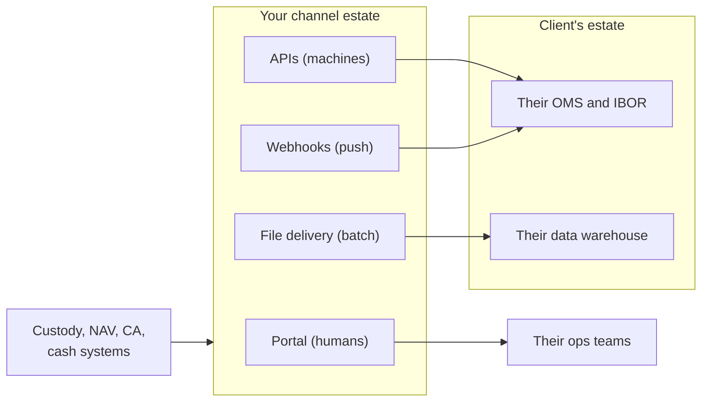
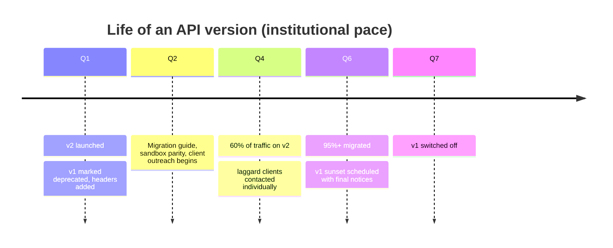
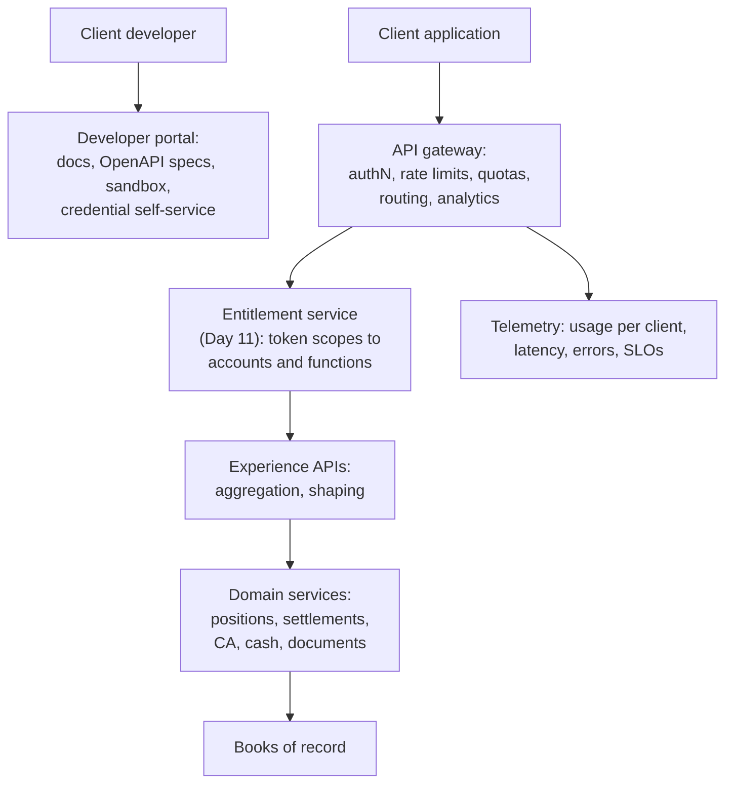
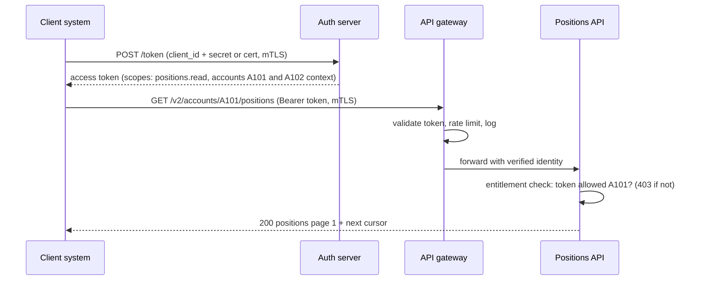

# Day 15 — APIs and API Products

> Week 3 · Technology and Data · Est. reading time: 60–90 min

## 🎯 Learning objectives

By the end of today you can:

- Explain why institutional clients demand APIs and where APIs beat portals (and files)
- Read and critique a REST API design: resources, verbs, status codes, idempotency, pagination
- Choose and defend a versioning and deprecation policy suitable for institutional clients
- Explain OAuth2 client-credentials and mTLS, and how API scopes tie back to Day 11's entitlements
- Run an API *as a product*: developer experience, time-to-first-call, adoption metrics, packaging
- Know when GraphQL or file delivery beats REST

## 🧭 Where this fits

Week 2 built experiences for humans. But your largest clients — the big asset managers — barely log in: their operations run on *their own* platforms, and they want your custody data flowing into those systems machine-to-machine. The API channel is where digital experience stops being screens and becomes **plumbing that clients build businesses on**. Everything downstream this week (events, data platforms, AI) either feeds or consumes this layer.

---

## Part 1 — Core concepts

### Why APIs, and why now

Three real forces: **clients automate** (a top-20 asset manager would rather poll `GET /settlement-instructions?status=failed` every 10 minutes than have analysts watch your portal); **T+1 killed batch-only** (Day 3 — when the settlement window shrinks, yesterday's file is too late); **RFPs score it** (the digital section of every custody RFP now asks for the API catalogue, sandbox, and SLA).

Channel economics in one table:

| Channel | Latency | Integration cost to client | Best for |
|---|---|---|---|
| Portal | Human-speed | None | Investigation, elections, oversight |
| Files (SFTP) | Batch (EOD) | Low (they already parse files) | Bulk reconciliation, warehouse loads |
| REST APIs | Seconds | Medium (they must build) | On-demand queries, workflow integration |
| Webhooks | Push, near-real-time | Medium | Status changes, deadline events |

The mature answer is **all four, one data spine** — same numbers everywhere (this becomes Day 18's and Day 20's problem: one governed source).

### REST literacy — the 20% a VP must actually know

- **Resources, not actions**: `GET /accounts/{id}/positions`, not `POST /getPositions`. Nouns are the contract.
- **Verbs carry meaning**: GET (read, safe), POST (create), PUT/PATCH (update), DELETE. A custody API is ~90% GET — you're a system of record.
- **Status codes are the error contract**: 200 OK, 201 created, 400 your request is malformed, 401 who are you, 403 you're not entitled (Day 11!), 404 not found, 429 slow down, 5xx we broke. Consistent, documented error bodies (code, message, correlation ID) are what developers actually judge you on.
- **Idempotency**: retrying the same request must not double-apply. For the rare POST (e.g., submitting a CA election via API), an `Idempotency-Key` header lets the client retry a timeout safely. Ask any team building a write API: "what happens on retry?"
- **Pagination and filtering**: positions for a large client = hundreds of thousands of rows. Cursor-based pagination, standard filters (`?asOf=2026-07-10&accountId=...`), and hard page-size limits are not optional.

**A worked mini-critique.** A team proposes `GET /getFailedTrades?client=BIGCO`. What's wrong? Verb in the path; client identification belongs to the *token*, not a parameter (else any caller can ask for anyone); "failed" should be a filter on a general resource: `GET /settlement-instructions?status=FAILED` with entitlements resolved from the credential. This 30-second review is a real thing you'll do monthly.

### Versioning and deprecation — where institutions differ most

Institutional clients integrate slowly and *hate* churn. A breaking change (renaming a field, changing a type) forced on 40 asset managers is 40 change projects you triggered.

| Policy element | Institutional-grade default |
|---|---|
| Version scheme | Major version in path (`/v2/positions`); additive changes (new optional fields) are non-breaking within a version |
| Breaking changes | New major version only; old version keeps running |
| Deprecation window | **12–18 months minimum**, contractual for large clients |
| Communication | Deprecation headers, changelog, direct outreach to consuming clients (you can see who's calling!) |
| Sunset | Only after usage telemetry shows migration; never "flag day" |

---

## Part 2 — The system deep dive

### The platform around the endpoints

Two layers worth internalizing:

- **The gateway** is policy: authentication, rate limiting (per-client quotas so one runaway script can't degrade everyone), version routing, and the usage analytics your product decisions depend on.
- **Experience APIs vs domain services** (echoes Day 16): the public contract is a stable, client-shaped façade; internal services can churn behind it. Never expose a core system's raw shape — you'd be freezing your legacy in a public contract for 18 months.

### Security: the machine-identity flow

Client systems authenticate with **OAuth2 client-credentials** (no human in the loop), typically hardened with **mTLS** (both sides present certificates):

The sentence that connects the weeks: **scopes and API entitlements must resolve from the same entitlement model as the portal (Day 11)** — one client, one permission truth, whether a human clicks or a machine calls. Custodians that bolt on a separate API permission store spend years reconciling the two.

### Developer experience is the product

For an API product, the "UX" is the integration journey. The north-star metric: **time-to-first-call** — how long from "client signs up" to "first successful 200 in sandbox." Institutional reality check: for banks this is often *weeks* (legal agreements, credential ceremonies). Every day you cut is real differentiation.

What good DX looks like: a public **developer portal**; **OpenAPI specs** for every endpoint (machine-readable contracts that generate client SDKs and docs); a **sandbox with realistic, coherent test data** (a fake client with accounts, positions, in-flight settlements and a live corporate action — not three random rows); copy-paste quickstarts; and human support with an SLA.

### Running it as a product

| Metric | Why it matters |
|---|---|
| Time-to-first-call | The funnel's front door |
| Active consumers (clients with calls this month) | Adoption truth |
| Calls by endpoint and client | What's valued; who to consult before changes |
| 4xx rate by client | Integration pain — reach out proactively |
| p99 latency and availability vs SLO | The contract you're silently making |
| % of eligible clients integrated | Your real market penetration |

**Packaging and monetization**: the perennial debate. Charging per-call fights your own strategy if APIs deflect expensive manual service; most custodians land on *tiered inclusion* (basic data APIs bundled with servicing, premium/high-volume data products priced separately — this connects to Day 18's data-sharing products). Take a position early: **adoption first, monetize the premium tier, never meter the plumbing.**

### When REST isn't the answer

- **GraphQL**: one flexible query endpoint; clients pick fields. Wins for *your own* front ends (portal teams iterating fast); risky as a public institutional contract (unbounded queries, harder rate-limiting/versioning). Common pattern: GraphQL inside, REST outside.
- **Files**: still king for bulk (full daily holdings to a warehouse). Don't apologize — publish the same governed data via files, and consider Day 18's Snowflake data sharing as the modern successor.
- **Webhooks**: push, not pull — "settlement failed" arrives in the client's system seconds after it happens. They ride on Day 17's event backbone; retry policies and signed payloads are the design work.

---

## Part 3 — The VP lens

Decisions this domain will put on your desk:

| Decision | Tension | A defensible position |
|---|---|---|
| API-first vs portal-first for a new capability | Big clients want API; mid-tier wants screens | Build the API, make the portal its first consumer — one contract, two channels |
| Public catalogue breadth | Sales wants everything listed | Publish only what has an SLA and an owner; a broken endpoint costs more than a missing one |
| Versioning discipline | Teams want to "just fix" contracts | The 12–18 month deprecation policy is yours to enforce; no exceptions without your sign-off |
| Monetization | Finance wants revenue line | Adoption first; premium data products, not metered plumbing |
| Sandbox investment | Feels like cost | It's your top-of-funnel; fund it like marketing |

Questions for your teams this week: What's our actual time-to-first-call? Which clients are calling deprecated versions and who owns migrating them? Do API entitlements share the portal's permission model or shadow it? What's our top endpoint by volume — and does its team know it's load-bearing?

## 🏦 State Street context

State Street, like its peers, has made APIs and data delivery central to its platform story — the Alpha front-to-back proposition depends on data flowing between the client's front office (CRD), State Street servicing, and the client's own estate; peers market equivalent channels (JPMorgan's Fusion data platform is the reference competitor genre). Representative realities: the API estate grew team-by-team, so consistency and a unified catalogue are ongoing product work; the biggest consumers are the largest, most sophisticated clients, making every breaking change a named-relationship event; and RFP digital sections increasingly ask for OpenAPI specs and sandbox access during evaluation. (Public-knowledge/representative; verify internal specifics on the job.)

## 💪 Exercises

1. **Critique an endpoint.** A team proposes `POST /v1/createElectionForClient` taking `{clientId, eventId, option}`. Write your five-line review (verb, resource shape, where client identity belongs, idempotency, what the 4xx contract should be).
2. **Draft the deprecation policy.** One page: version scheme, what counts as breaking, window, comms channels, sunset criteria. This is a real artifact you could bring to week one on the job.
3. **Design the sandbox client.** Specify the fictional client dataset a great sandbox needs: entities, accounts, positions, two in-flight settlements (one failing), one live voluntary corporate action, and one month of documents.

## ❓ Self-check quiz

1. Why did T+1 strengthen the case for APIs and webhooks over files?
2. What's wrong with `POST /getPositions`?
3. What does an Idempotency-Key protect against, and on which verb class?
4. Why do institutional APIs need 12–18 month deprecation windows?
5. How should API scopes relate to portal entitlements?

Answers

1. The settlement window shrank to hours; end-of-day files arrive too late to act on affirmation and fail exceptions. Machines must see status in near-real-time.
2. Verb in the path (action-style, not resource-style); positions should be a resource (`GET /accounts/{id}/positions`) with the caller's identity and entitlement resolved from the token, not implied by an RPC name.
3. Duplicate side-effects when a client retries a timed-out request; it applies to non-idempotent writes (POST).
4. Because each breaking change forces a change project inside dozens of slow-moving, change-controlled client organizations; short windows convert your release into their emergency.
5. They must resolve from the same entitlement model (one permission truth per client across human and machine channels); a shadow API permission store guarantees drift and audit findings.

## 🔑 Key takeaways

- Your biggest clients experience you through APIs, not screens; the API **is** the digital experience for them.
- A custodian's API estate is ~90% reads; the craft is contracts: resources, errors, pagination, idempotency.
- **Versioning discipline is a client-relationship policy**, not a technical preference — enforce the long deprecation window personally.
- One entitlement model across portal and API, or spend years reconciling two.
- Run it as a product: developer portal, sandbox, time-to-first-call, per-client telemetry.
- Portal, API, files, webhooks — four renderings of one governed data spine.

## 📚 Going deeper

- Any major bank/custodian public developer portal (browse one competitor's catalogue this week)
- The OpenAPI specification (skim a real spec; readability is the point)
- *Continuous API Management* (Medjaoui et al.) — lifecycle and maturity model
- OAuth 2.0 client-credentials flow (RFC 6749 §4.4) — it's shorter than you fear

## Tomorrow

Day 16 opens the engine room: **microservices, legacy and enterprise architecture** — how 200 years of systems coexist, and how to modernize a portal without stopping the bank.
