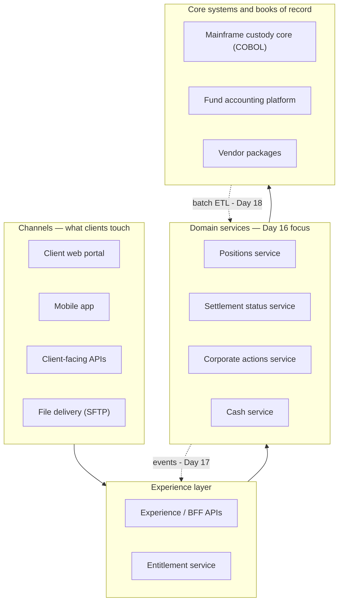
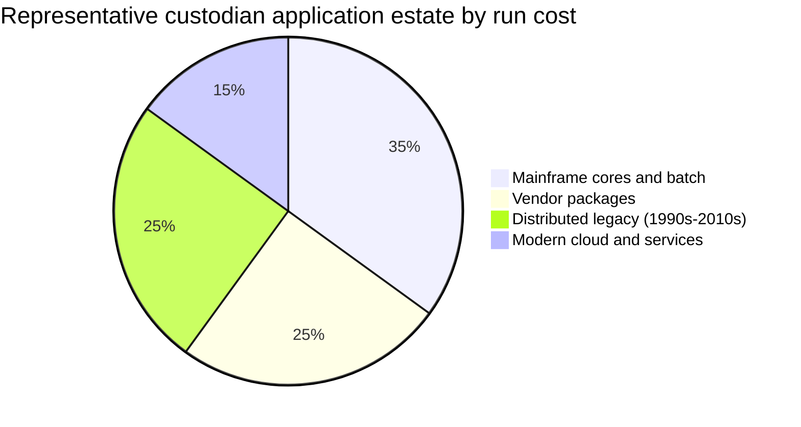
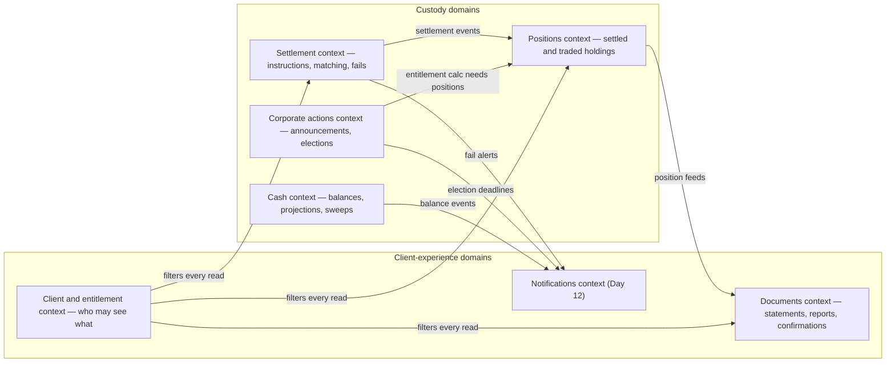
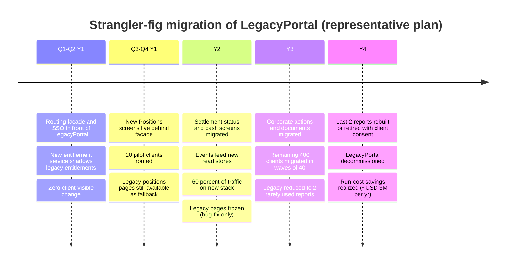
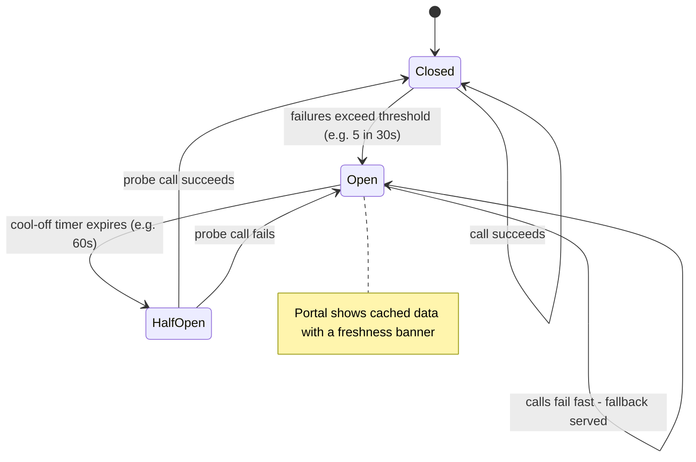
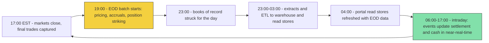
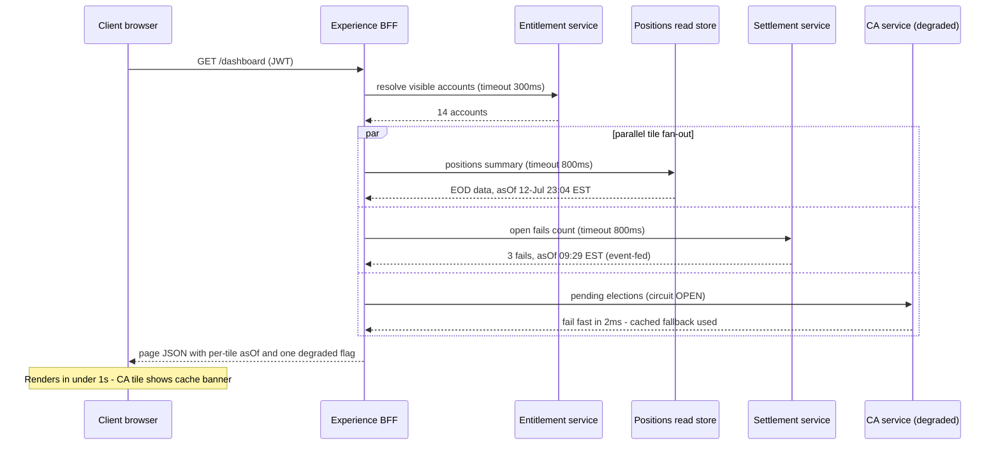

# Day 16 — Microservices, Legacy and Enterprise Architecture

> Week 3 · Technology and Data · Est. reading time: 60–90 min

## 🎯 Learning objectives

By the end of today you can:

- Describe the real technology estate of a 200-year-old custodian — mainframe cores, batch cycles, vendor packages and modern services coexisting — and explain *why* it looks that way.
- Argue both sides of the monolith-vs-microservices debate honestly, and name the three situations where microservices actively hurt.
- Map domain-driven design (DDD) bounded contexts onto concrete custody domains: settlement, positions, corporate actions, cash, client/entitlement, documents.
- Choose the right integration pattern (API, event, file, MQ, ETL) for a given data flow, and explain what an anti-corruption layer buys you over legacy.
- Sketch a multi-year strangler-fig migration plan for replacing a legacy client portal, with realistic phases and exit criteria.
- Work *with* the enterprise architecture (EA) function — design authorities, reference architectures — instead of routing around it, and demand the right resilience patterns (circuit breakers, bulkheads, graceful degradation) from your teams.

## 🧭 Where this fits

Weeks 1–2 covered what a custodian does and what your digital product must deliver. Week 3 opens the hood: today is the *structural* view — how the systems that produce settlement status, positions and cash balances are actually arranged, and how a modern client experience gets bolted onto (and gradually replaces parts of) a decades-old core. Every later topic this week — events (Day 17), data platforms (Day 18), BI (Day 19), governance (Day 20) — lives somewhere on the map below.

---

## Part 1 — Core concepts

### 1.1 The real estate of a 200-year-old bank

Forget the conference-slide picture of a clean microservices mesh. A large custodian's estate is an *archaeological dig* — every layer was the modern answer of its decade, and almost nothing was ever fully decommissioned:

| Era | What was built | Still in production? | Why it survives |
|---|---|---|---|
| 1970s–80s | Mainframe custody and accounting cores in COBOL/PL1, batch-oriented, indexed files and later DB2 | **Yes — the books of record** | Correct, fast, audited for 40 years; rewriting risks the one thing a custodian cannot break: the record of who owns what |
| 1990s | Client-server apps, Sybase/Oracle databases, overnight ETL, MQ middleware | Yes, widely | Cheap to keep, expensive to replace; deeply wired into batch schedules |
| 2000s | Vendor packages (corporate actions, collateral, reconciliation, tax), Java app servers, SOA/ESB | Yes | Buying beat building for standardized domains; contracts run in decades |
| 2010s | First-generation web portals, REST APIs, private cloud, early big-data platforms | Yes — often the thing *you* are replacing | "Modern" ages fast; a 2012 portal is now legacy |
| 2020s | Public cloud, microservices, Kafka event backbones, Snowflake, API products | Growing | This is where your roadmap lives |

A representative split of where a large custodian's application estate (and run budget) actually sits — the modern layer is the visible tip, not the iceberg:

Three structural facts follow, and they shape every decision you will make:

1. **The books of record are batch-native.** The mainframe core processes the day's transactions, then runs an end-of-day (EOD) batch cycle — often 6–10 hours of dependent jobs — that strikes balances, accrues income, values positions and produces the files everything downstream consumes. Your "real-time" portal sits on top of an inherently periodic heartbeat.
2. **Nothing has one owner.** A settlement status touches the market-facing settlement engine, the custody core, a vendor SWIFT gateway, a data warehouse and your portal. Change requires choreography across teams that do not report to you.
3. **Heterogeneity is permanent.** The realistic goal is not "one modern stack"; it is *well-managed seams* between old and new. That is what today's patterns are for.

### 1.2 Monolith vs microservices — the honest version

A **monolith** is one deployable unit: all functions compiled, tested and released together. A **microservice architecture** decomposes the system into independently deployable services, each owning its data and communicating over the network.

The honest comparison:

| Dimension | Monolith | Microservices |
|---|---|---|
| Team scaling | One codebase becomes a merge-conflict traffic jam beyond ~30–50 engineers | Teams own services end-to-end; deploy independently |
| Release cadence | Whole-app releases; one bad module blocks everyone | Service-level releases, canaries, independent rollback |
| Runtime failure | One process; a memory leak takes everything down | Faults *can* be isolated — if you build the resilience patterns |
| Complexity location | Inside the code (modules, call stacks) | Between the services (network, contracts, versioning, tracing) |
| Data consistency | One database, ACID transactions, easy joins | Distributed data; eventual consistency; sagas instead of transactions |
| Debugging | One stack trace | Distributed tracing across 12 services or you are blind |
| Cost | One runtime | Dozens of runtimes, pipelines, dashboards, on-call rotations |

**When microservices hurt** — the three cases to watch for as a VP:

1. **Premature decomposition.** A team of 8 engineers running 40 services spends its life on plumbing, not product. Rule of thumb: you need roughly a team (5–9 people) per service *group* to justify the operational overhead. A well-modularized monolith ("modular monolith") is the right answer for most small products.
2. **Distributed monolith.** Services that must be released together, share a database, or call each other synchronously in long chains have all the costs of microservices and none of the benefits. Symptom: a "simple" change needs coordinated deploys across 5 services.
3. **Splitting along the wrong lines.** Services carved by technical layer ("the validation service", "the persistence service") instead of by business domain force every feature through every service. The cure is domain-driven design.

> **VP framing:** microservices are an *organizational* technology. They buy independent team velocity at the price of operational complexity. If you don't have the team structure to exploit the independence, you are paying for nothing.

### 1.3 Domain-driven design and bounded contexts — mapped to custody

**Domain-driven design (DDD)** says: structure software around the business domain, and accept that big domains cannot have one universal model. A **bounded context** is a boundary inside which a term has exactly one meaning and one model. The classic custody example: "position" means *settled* holdings to the settlement team, *traded* (contractual) holdings to the front-office-facing team, and *accrual-adjusted* holdings to fund accounting. Forcing one "Position" object to serve all three is how monoliths rot.

A realistic bounded-context map for the digital-experience estate:

Key vocabulary you will hear in design reviews:

- **Ubiquitous language** — within a context, engineers and business use identical terms ("instruction", "fail", "election") with identical meanings.
- **Context mapping** — the explicit contract between contexts: who is *upstream* (sets the model) and who is *downstream* (conforms or translates).
- **Aggregate** — the unit of consistency inside a context (e.g., a settlement instruction and its status history change together, atomically).

Why you care: **service boundaries should follow context boundaries.** When the corporate-actions team can change its model without breaking positions, you have real independence. When they can't, you have a distributed monolith wearing a DDD costume.

### 1.4 Integration patterns — the five ways systems talk

| Pattern | What it is | Latency | Best for | Custody example |
|---|---|---|---|---|
| **Synchronous API** (REST/gRPC) | Request/response over HTTP | ms | Queries needing an immediate answer; commands with immediate validation | Portal asks positions service for a holdings screen |
| **Events** (Kafka) | Publish facts; many consumers subscribe | ms–s, async | "Something happened, many parties care" | Settlement status changes fan out to portal, notifications, warehouse |
| **Message queue** (MQ) | Point-to-point guaranteed delivery, often transactional | ms–s | Reliable handoff between two systems, mainframe-friendly | Instruction handoff from portal capture to the settlement engine |
| **File transfer** (SFTP) | Batch files on a schedule | hours | Bulk, EOD, regulated exchange with clients/vendors | EOD positions extract to a client's back office |
| **ETL/ELT** | Bulk copy into analytics stores | hours (or streaming) | Reporting, analytics, ML | Core ledger → warehouse (Day 18) |

The mistake to police: teams using synchronous APIs for everything, creating chains (portal → BFF → positions → core adapter → mainframe) where one slow link stalls the whole page. The heuristic: **queries can be synchronous against a fast read store; facts should travel as events; bulk should travel as files or ELT.**

### 1.5 The anti-corruption layer

When a modern service must consume a legacy system, DDD prescribes an **anti-corruption layer (ACL)**: a translation component that converts the legacy model (EBCDIC copybooks, 8-character account codes, status flags like `S`, `P`, `X`) into your clean domain model — and *nothing legacy leaks past it*.

Worked example: the mainframe encodes a settlement state as `STAT-CD = 'P'` with `RSN-CD = '042'`. Without an ACL, `'P'` and `'042'` appear in your portal code, your tests, your analytics — and when the core team recodes reason 042, twelve systems break. With an ACL, one adapter translates `('P','042')` → `PENDING(reason=COUNTERPARTY_INSUFFICIENT_SECURITIES)`, and the blast radius of core changes is one component. The ACL is also your *future decommissioning seam*: when the core is eventually replaced, only the ACL changes.

### 1.6 Vendor packages — the third estate

Between "our legacy" and "our new services" sits a large third category: **vendor packages** — corporate-actions processing, reconciliation, collateral, tax, SWIFT gateways. They behave differently from both, and product plans that ignore this get burned:

| Property | Consequence for your roadmap |
|---|---|
| You don't control the release calendar | A field you need on the portal may arrive "in the vendor's Q4 release" — of next year. Plan integration features against *vendor* roadmaps, not just yours |
| Customization is expensive debt | Every custom patch must be re-applied on each vendor upgrade; heavily customized packages become unupgradeable. Prefer configuration and wrapping (ACL again) to modification |
| Integration surface is what it is | If the package only emits an EOD file, your "real-time CA elections" feature needs either a vendor enhancement, screen-scraping (never), or an intraday API the vendor sells separately |
| Contracts run in decades | Switching cost is enormous; the credible threat of leaving at renewal is one of the few levers — coordinate with procurement years ahead |

VP takeaway: treat major vendors as *dependency teams you cannot manage* — get their roadmap into your planning cycle, escalate through the vendor-management function early, and never promise a client a feature whose critical path runs through an uncommitted vendor release.

### 1.7 Consistency across contexts — sagas in one page

Splitting the monolith splits the database, and with it the ACID transaction. When one business action spans contexts — a client submits a payment instruction that must reserve cash, create the instruction, and notify — you can no longer wrap it in one transaction. The pattern is a **saga**: a sequence of local transactions, each publishing an event that triggers the next, with **compensating actions** to undo prior steps on failure (release the cash reservation if instruction creation fails). Two implications an executive should retain: (1) *eventual consistency is a product-design fact* — for seconds, the cash tile and the instruction list may disagree, and good UX shows "processing" states rather than pretending atomicity; (2) *compensations are features to specify* — what the client sees when step 3 of 4 fails is a product decision, not an engineering detail.

---

## Part 2 — The system deep dive

### 2.1 The layered target architecture

The reference architecture most large custodians converge on:

- **Channels** (web, mobile, API, file) are thin — rendering and capture only, no business logic.
- **Experience APIs / BFFs** (backend-for-frontend) compose data for specific screens and enforce entitlements on every call.
- **Domain services** own business logic and their own read stores, populated by events and batch feeds.
- **Core adapters / ACLs** wrap the mainframe and vendor packages.
- **Books of record** stay authoritative — the digital stack *presents* truth, it does not *own* it.

The critical discipline is **read-path decoupling**: the portal reads from domain-service read stores (refreshed by events and intraday feeds), *not* by calling the mainframe per page load. A mainframe rated for its nightly batch plus modest online traffic will fall over if 3,000 portal users hammer it at 9am — and mainframe capacity is often billed by consumption (MIPS), so chatty portals literally cost money per click.

### 2.2 The strangler-fig migration — replacing a legacy client portal

The **strangler fig** pattern (named for the tree that grows around a host until the host is gone): put a routing facade in front of the legacy system, build new capabilities behind the facade, migrate traffic page by page, and decommission the legacy only when nothing routes to it. No big-bang cutover, no multi-year rewrite that ships nothing.

Worked multi-year example — replacing "LegacyPortal", a 2010-era client portal with 400 institutional clients:

Rules that make it work (and whose absence makes it fail):

| Rule | Why | Failure mode if ignored |
|---|---|---|
| Facade first, features second | You need the routing control point before you can migrate anything | Two portals, two logins, angry clients |
| Migrate by *page/capability*, not by *client* only | Lets you retire legacy code paths; client waves alone keep all legacy alive | Legacy runs at full cost until the last client moves |
| Freeze legacy early and publicly | Every feature added to legacy is migration debt | Legacy and new stack diverge; migration never converges |
| Decommissioning is a funded milestone with a date | The savings *are* the business case | "Zombie" legacy runs for 5 extra years at USD 3M/yr |
| Fallback routes for the first 2 quarters of each capability | New read stores will have data-quality surprises | A bad positions number with no way back destroys client trust |

The number every steering committee forgets: **the business case only closes at decommissioning.** Running both stacks costs *more* than legacy alone (often +40–60% during overlap years). If your plan has no credible decommissioning date, you are proposing a permanent cost increase.

### 2.3 Resilience patterns — keeping the portal up when upstreams are not

Your portal depends on services you don't control. The patterns below are how a well-built experience layer survives their bad days:

- **Timeouts** — every remote call has a deadline (e.g., 800ms to the positions read store, 2s to a document render). No timeout = one hung upstream thread-starves your whole BFF.
- **Retries with backoff and jitter** — retry *idempotent reads* a small number of times; never blind-retry writes (you'll double-submit an instruction).
- **Circuit breaker** — after N consecutive failures, stop calling the sick upstream for a cooling-off window; probe with a trial request before resuming. Protects the upstream from retry storms and your users from 30-second spinners.
- **Bulkheads** — partition resources (thread pools, connections) per upstream so a drowning documents service cannot exhaust the pool the positions calls need. Named for ship compartments: one flooded compartment must not sink the ship.
- **Graceful degradation** — the page renders with the sick component clearly flagged, not a global error.

Worked degradation example — the corporate-actions service is down at 8am:

| Naive portal | Resilient portal |
|---|---|
| Home page spins for 30s, then shows a generic error for the *whole* dashboard | Dashboard renders in 900ms; positions, cash and settlement tiles are live |
| Client calls the service desk; incident escalates to "portal down" | CA tile shows last-cached elections with banner: "Corporate actions as of 06:12 EST — refresh in progress" |
| Ops cannot tell which upstream failed | Circuit-breaker dashboard shows exactly one open circuit: `corporate-actions-read` |

Decide the degradation behavior *per tile, in advance, as a product requirement* — "when upstream X is down, show Y with message Z" belongs in your acceptance criteria, not in an engineer's improvisation during an incident.

### 2.4 Batch vs online — the "as of" problem

The daily heartbeat of a custody core, and where your portal's data comes from:

Consequences you must design for honestly:

1. **Mixed freshness on one screen.** At 10am, settlement status is minutes old (event-fed) while accrued income is from last night's batch. A screen that implies uniform freshness is *lying by layout*.
2. **The batch can be late.** A failed pricing job at 21:00 can push the whole cycle; the portal opens at 6am showing *two-day-old* positions. Without honest labeling, clients discover this by reconciling against their own records — the worst way.
3. **Global follows the sun.** APAC EOD, EMEA EOD and US EOD strike at different times; a global client's "as of" is genuinely plural.

The honest-freshness playbook: stamp every dataset with an **"as of" timestamp sourced from the pipeline itself** (never "now"); show it on every screen and every export; publish a data-freshness status page; alert *proactively* when a batch is late ("US positions for 12-Jul will be available by 08:30 EST, delayed from 06:00") rather than letting clients find stale data. Freshness transparency is a *feature* clients will name in due-diligence reviews — the alternative, silently stale data, is a credibility incident.

### 2.5 Anatomy of one page load — the layers in motion

To make the layering concrete, here is the portal home page rendering for a pension-fund client at 09:30 EST, with one upstream degraded:

Read the mechanics like an executive: entitlement resolution happens **before** any data call (Day 11's rule — filter at the source of the read, never in the browser); tiles fan out **in parallel**, so page latency is the slowest healthy tile, not the sum; the open circuit fails in milliseconds instead of consuming an 800ms timeout; and every tile carries its own "as of." Five design decisions, all reviewable in a one-hour architecture walkthrough — this is the level of detail worth your personal attention.

Common failure modes this design prevents, and what each looks like when it happens anyway:

| Failure mode | Symptom clients see | Root cause | Design countermeasure |
|---|---|---|---|
| Sequential tile loading | 6-second page loads at 9am | BFF calls upstreams one by one | Parallel fan-out with per-call timeouts |
| Missing entitlement pre-check | Client A glimpses client B's account name in a cached response | Filtering applied after caching | Entitlements resolved first; cache keys include entitlement scope |
| Retry storm | Sick upstream gets 10x traffic and dies fully | Blind retries without breakers | Circuit breaker + backoff with jitter |
| Uniform "as of" on mixed data | Client reconciles intraday cash against EOD accruals, logs a false break | One page-level timestamp | Per-tile asOf from the pipeline |
| Thread-pool exhaustion | Whole portal hangs because documents is slow | Shared connection pool | Bulkheads per upstream |

### 2.6 The enterprise architecture function

Large banks run an **EA function** because 2,000+ applications with no coordination produces chaos regulators notice. What EA actually does:

- **Reference architectures** — the sanctioned patterns (approved layering, approved integration styles) new designs must follow.
- **Technology standards and the approved-product list** — which databases, clouds, frameworks are sanctioned; what is "contain/retire".
- **Design authority / Architecture Review Board (ARB)** — the gate significant designs pass before build funding. Typically checks: security, data residency, resilience, alignment to target state, no duplication of an existing capability.
- **Target-state and roadmap stewardship** — the multi-year picture your strangler plan must slot into.

How a smart product VP works *with* EA rather than around it:

| Around EA (loses) | With EA (wins) |
|---|---|
| Show up at the ARB with a finished design; get sent back; lose 6 weeks | Engage the domain architect at *discovery*; arrive at ARB pre-socialized |
| Treat standards as bureaucracy to waive | Use standards as leverage: "the reference architecture *requires* an event backbone — fund it" |
| Fight EA on tool choice you care little about | Spend credibility only on choices that affect client experience |
| Surprise EA with a vendor selection | Bring EA into the RFP — their non-functional requirements are real, and their sign-off accelerates procurement |

EA's approval is also *air cover*: when your design later hits an incident or an audit, "it followed the reference architecture and passed ARB" is a very different conversation from "the product team improvised".

---

## Part 3 — The VP lens

### Decisions you own (or heavily shape)

1. **Buy vs build vs strangle** for each capability on your roadmap. Default: buy for undifferentiated domains (document rendering, notification delivery mechanics), build for the experience layer where you differentiate, strangle — never big-bang — when replacing legacy.
2. **Where the seams go.** You won't draw the bounded contexts personally, but you approve the team topology — and team boundaries *become* service boundaries (Conway's law works in both directions). If entitlements are smeared across four teams, entitlements will be smeared across four services.
3. **Freshness and degradation as product requirements.** "As of" labeling, per-tile fallback behavior, and the freshness status page are *your* backlog items, not infrastructure afterthoughts.
4. **The decommissioning date.** You are the executive who keeps the strangler plan honest by defending the legacy freeze and the retirement milestone against every "just one more feature on the old portal" request.
5. **How much modernization to buy per quarter.** A practical allocation for a portfolio sitting on legacy: ~60% client-visible features, ~25% modernization/strangler work, ~15% resilience and operability. Squeeze the 25% to zero for three quarters and you will feel it as slowing delivery in year two.

### Trade-offs to argue explicitly

| Trade-off | The tension | A defensible position |
|---|---|---|
| Real-time everywhere vs batch reality | Clients say "real time"; the core says "EOD" | Event-feed the 3 datasets where intraday genuinely changes client decisions (settlement status, cash, trade capture); label the rest honestly as EOD |
| Microservice purity vs delivery speed | Architects want clean decomposition; you want the Q3 release | Modular monolith for the BFF layer now, extraction seams documented; split when a team needs independent deploys |
| Fallback complexity vs simplicity | Every fallback path is code to test | Fund fallbacks only for the 5 tiles on the money screens; a global maintenance banner is acceptable for the rest |
| Legacy freeze vs client asks | A top client wants a feature on the old portal | Offer it on the new stack with priority migration for that client; a freeze exception needs *your* sign-off, and you should almost never give it |

### Metrics that tell you the architecture is healthy

- **Deployment frequency and lead time per team** (independence is the whole point of the decomposition).
- **Change failure rate and MTTR** for the experience layer.
- **% of portal reads served from read stores vs direct core calls** (target: >99% from read stores).
- **Batch-late incidents per quarter and mean lateness** — and % of those where clients were *proactively* notified.
- **Open-circuit minutes per upstream per month** — trending up means an upstream needs engineering attention, not more retries.
- **Strangler burn-down**: % of page views served by legacy (should fall monotonically) and legacy run-cost retired.

### Stakeholder map for architecture decisions

| Stakeholder | What they optimize for | What they need from you | What you need from them |
|---|---|---|---|
| Enterprise architecture / ARB | Target-state alignment, no duplication, standards | Early engagement; designs that reference the standards | Pattern approval, air cover, roadmap influence |
| Core custody technology leadership | Stability of books of record, batch SLA, MIPS cost | Read-store patterns that keep portal load off the core | Event feeds, extract SLAs, ACL cooperation |
| Fund accounting platform owners | EOD accuracy, NAV timeliness | Honest "as of" labeling so their batch isn't blamed for portal staleness | Freshness timestamps in every extract |
| Vendor management / procurement | Contract value, vendor risk | 18-month heads-up on needs tied to renewals | Vendor roadmap intelligence, escalation muscle |
| CISO / security architecture | Least privilege, data protection, resilience | Entitlement enforcement at the experience layer; degradation that fails closed | Pragmatic review timelines |
| Operations (custody ops, client service) | Break reduction, incident clarity | Circuit-breaker dashboards; proactive batch-late comms they can forward to clients | Ground truth on which data issues clients actually feel |
| Your engineering leads | Team autonomy, sane on-call | Protected modernization capacity (~25%); realistic freshness promises to clients | Honest independence assessment — monolith seams vs true services |

### A worked funding conversation

You will pitch modernization to people who fund features. The argument that works is *unit economics of change*, not elegance. Representative example: on the legacy portal, adding one data field to the holdings screen takes 9 weeks (change requests across 3 systems, one release train per quarter, regression cycle); on the strangled stack it takes 2 weeks. If your book of demand is ~30 such changes a year, the delta is ~210 engineer-weeks/year — roughly four engineers of capacity recovered, before counting the USD 3M/yr run-cost retirement at decommissioning and the incident-cost reduction from circuit breakers (each "portal down" P1 costs real client-service hours and, repeated, real relationship damage in an industry where mandates are won on service quality). Frame modernization as buying back capacity and risk, with a dated cash-savings milestone — never as "engineering wants to refactor."

### Questions to ask your teams this week

1. "Show me the map: which screens read from read stores, and which still call the core directly per page load?"
2. "What happens to the client dashboard, tile by tile, if the corporate-actions service is down at 8am? Show me, in the test environment."
3. "Where does our 'as of' timestamp come from — the pipeline, or `now()`?" (If anyone says `now()`, you have found a lie in production.)
4. "What was added to the legacy portal in the last two quarters, and who approved the freeze exceptions?"
5. "When did we last talk to our EA domain architect — at design time, or at the review gate?"

---

## 🏦 State Street context

*Representative and public-knowledge; treat specifics as directional.*

- State Street is one of the world's largest custodians (tens of trillions in assets under custody and administration), founded in 1792 — the archaeology metaphor is literal. Core custody and accounting platforms have mainframe lineage measured in decades, surrounded by successive generations of middleware and vendor packages.
- **State Street Alpha℠** — the front-to-back servicing platform (anchored by the Charles River acquisition on the front end) — is publicly positioned as an integrated platform spanning front office to custody. From an architecture standpoint it is exactly today's material at enterprise scale: many acquired and legacy systems presented as one experience, held together by integration seams, with data consistency across contexts as the hard problem.
- State Street has publicly discussed multi-year cloud and platform-modernization programs and partnerships with major cloud providers — i.e., strangler-style modernization of a regulated estate, not big-bang rewrites.
- Your role sits in the **experience and API layers** of the map: my.statestreet-style client portals and client-facing data/API products consume domain services fed by books of record you will not own. Expect your dependency list to include core custody technology, fund accounting platforms, entitlement services and enterprise data platforms — each with its own leadership, priorities and release calendar. Your architecture skill as VP is mostly *seam management and dependency negotiation*, not greenfield design.
- Expect a formal EA function, architecture review gates, and firm-wide reference architectures — plus heightened regulatory attention to operational resilience (the Fed/OCC lens on critical service providers), which makes the resilience patterns in Part 2 compliance topics, not just engineering taste.

---

## 💪 Exercises

1. **Context-map your product.** Take your (current or target) portal's five main screens. For each, list: which bounded context owns the data, which system is the book of record, how the data reaches the screen (API/event/file/ETL), and its worst-case staleness. One page. The gaps you can't fill are your first-week questions.
2. **Write the degradation spec.** Pick the portal home page. For each tile, write one line: "If upstream X is unavailable: show ___, with message ___, sourced from ___." Then decide which of these are worth engineering cost — you have budget for three.
3. **Stress the strangler plan.** Take the Y1–Y4 timeline in Part 2 and write the three most likely derailers (e.g., a big client refuses to migrate; a regulator freezes changes during an exam; the legacy vendor announces end-of-support in Y2). For each, write the mitigation you would present to the steering committee.

## ❓ Self-check quiz

1. Why does a custodian's mainframe core survive every modernization wave?
2. Name the three situations where microservices actively hurt.
3. What is a bounded context, and why should service boundaries follow context boundaries?
4. What does an anti-corruption layer do, and what is its second (future) purpose?
5. Why does a strangler-fig business case only close at decommissioning?

Answers

1. It is the book of record — decades of proven correctness and audit history for the one thing a custodian cannot get wrong (who owns what). Rewrite risk vastly exceeds run cost, so the rational strategy is to wrap it (ACLs, read stores) rather than replace it, until a very deliberate, well-funded core-replacement program says otherwise.
2. (a) Premature decomposition — a small team drowning in operational overhead for services it didn't need; (b) the distributed monolith — services that must deploy together or share data, giving all the cost and none of the independence; (c) decomposition along technical layers instead of business domains, forcing every feature through every service.
3. A boundary within which a term (like "position") has exactly one meaning and one model. Service boundaries should follow context boundaries so teams can change their models independently; when boundaries cut across contexts, every model change breaks neighbors and you get a distributed monolith.
4. It translates the legacy system's model (codes, formats, semantics) into the modern domain model so legacy concepts never leak into new code — containing the blast radius of core changes to one adapter. Its second purpose: it is the decommissioning seam — when the legacy system is replaced, only the ACL changes.
5. Because during the overlap years you run both stacks and cost *rises* (typically 40–60% over legacy-only). The savings — legacy run cost, licenses, support — are only realized when the legacy system is actually switched off. A plan without a funded, dated decommissioning milestone is a permanent cost increase.

## 🔑 Key takeaways

- A custodian's estate is layered by decades; the goal is well-managed seams between old and new, not a single modern stack.
- Microservices are an organizational technology: they buy team independence at operational cost — and hurt when teams are small, boundaries are wrong, or services aren't truly independent.
- Bounded contexts map cleanly to custody domains (settlement, positions, CAs, cash, client/entitlement, documents); draw service and team boundaries on those lines.
- Wrap legacy with anti-corruption layers; feed the portal from read stores, never from per-click core calls.
- Strangle, don't rewrite: facade first, migrate by capability, freeze legacy publicly, and defend a dated decommissioning milestone — that's where the money is.
- Resilience (timeouts, retries, circuit breakers, bulkheads, per-tile degradation) and honest "as of" freshness labeling are product requirements you own, not engineering internals.
- Work with EA from discovery, not at the gate — their standards are leverage and their sign-off is air cover.

## 📚 Going deeper

- Eric Evans, *Domain-Driven Design* (2003) — the source for bounded contexts; read chapters 1–4 and the context-mapping material.
- Sam Newman, *Building Microservices* (2nd ed.) and *Monolith to Microservices* — the honest practitioner view, including when not to.
- Martin Fowler, "StranglerFigApplication" and "CircuitBreaker" — martinfowler.com (free).
- Michael Nygard, *Release It!* (2nd ed.) — the origin of bulkheads/circuit breakers as production patterns.
- Team Topologies (Skelton & Pais) — how team design and architecture co-evolve (Conway's law, stream-aligned teams).
- BIS/Basel and FFIEC publications on operational resilience — why regulators care about your degradation behavior.

## Tomorrow

**Day 17 — Event-Driven Architecture:** the backbone that makes "settlement status changed" reach your portal, your notifications platform and your warehouse at once — Kafka, delivery semantics, and why duplicate events can put a lie on a client screen.
