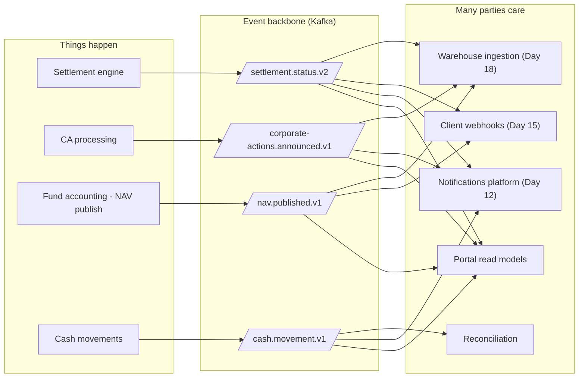
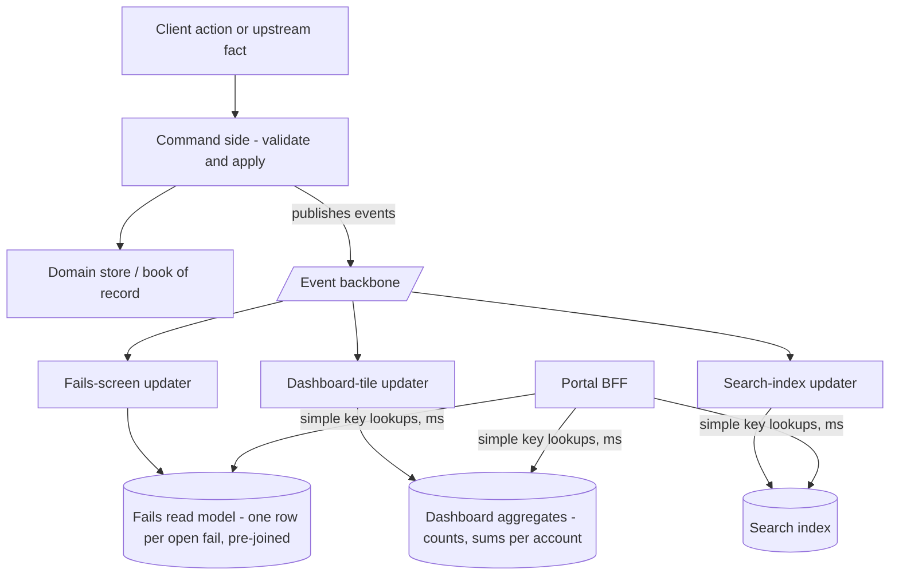
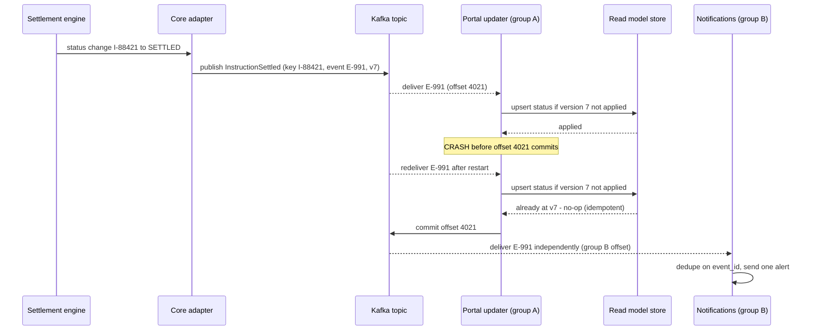
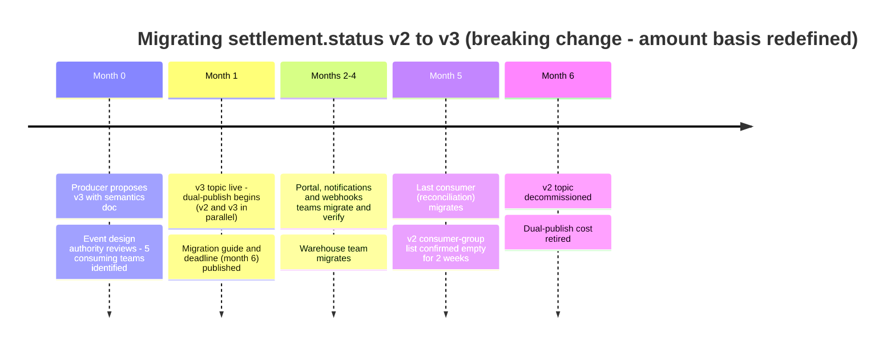
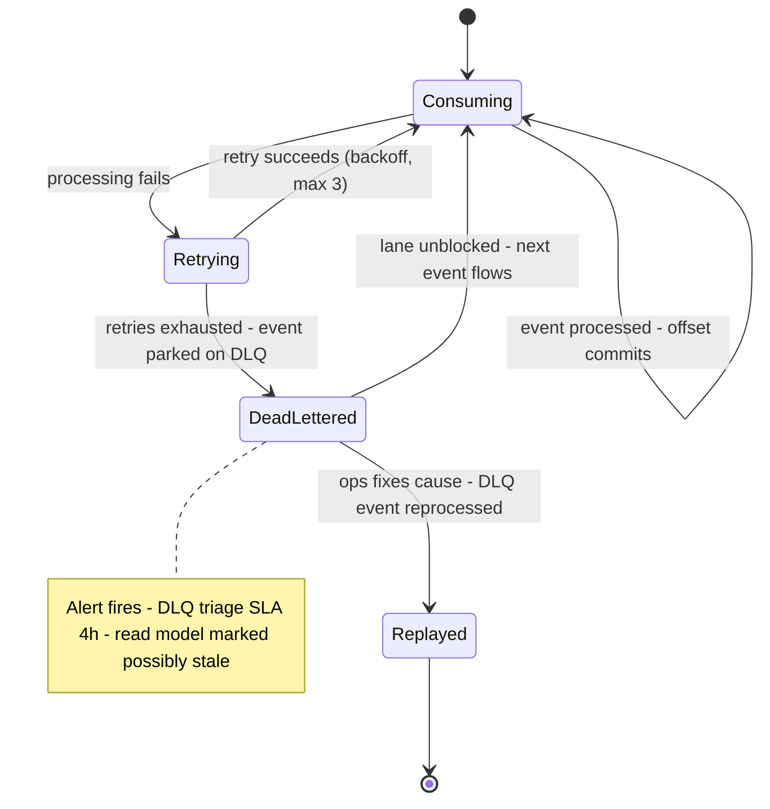
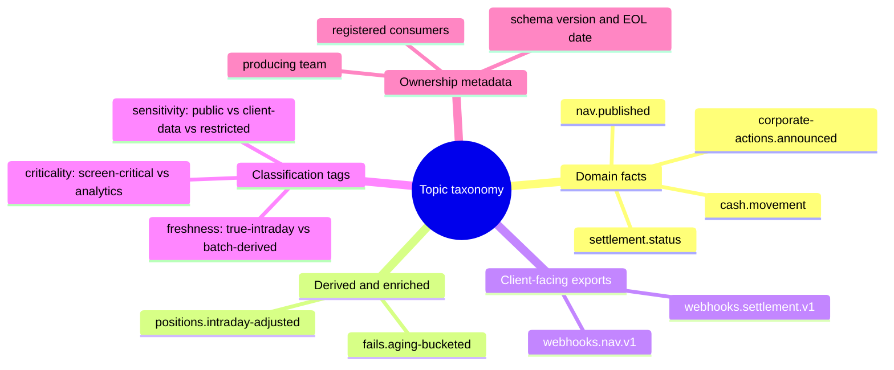

# Day 17 — Event-Driven Architecture

> Week 3 · Technology and Data · Est. reading time: 60–90 min

## 🎯 Learning objectives

By the end of today you can:

- Distinguish events, commands and queries — and explain why confusing them produces brittle systems.
- Explain Kafka's core mechanics (topics, partitions, ordering, consumer groups, retention, replay) precisely enough to challenge a design review.
- Reason about delivery semantics — at-least-once vs exactly-once, idempotent consumers — and predict what duplicate events do to a client-facing screen.
- Choose correctly among notification events, event-carried state transfer and event sourcing for a given use case.
- Explain CQRS and why read models are what make portal screens fast.
- Ask the right operational questions: consumer lag, dead-letter queues, poison messages, schema versioning — and settle the organizational question of who owns an event schema.

## 🧭 Where this fits

Day 16 gave you the map: channels → experience APIs → domain services → cores. Today is the *nervous system* running through that map. Custody is a business where things **happen** — trades settle, corporate actions are announced, NAVs publish, cash moves — and many parties care about each happening: the portal, the notifications platform (Day 12), client webhooks (Day 15), the warehouse (Day 18), reconciliation, risk. Event-driven architecture (EDA) is how one happening reaches all of them without the producer knowing or caring who listens.

---

## Part 1 — Core concepts

### 1.1 Events, commands, queries — three different sentences

The grammar of distributed systems. Get this straight and half of EDA follows:

| | **Command** | **Event** | **Query** |
|---|---|---|---|
| Grammar | Imperative: "Do this" | Past tense: "This happened" | Interrogative: "What is…?" |
| Example | `SubmitInstruction` | `InstructionSettled` | `GetOpenFailsForAccount` |
| Audience | Exactly one handler | Zero-to-many subscribers, unknown to the producer | One responder |
| Can be rejected? | Yes — validation may refuse it | **No — it is a fact; you cannot reject history** | N/A (returns data) |
| Coupling | Sender knows the receiver | Producer does not know consumers | Caller knows the responder |
| Typical transport | API call or point-to-point queue | Event backbone (Kafka) | API against a read store |
| Custody example | Client submits a payment instruction | Trade settled at CSD; CA announced; NAV published | Portal loads the holdings screen |

Two failure smells worth policing in design reviews:

- **Commands dressed as events.** An "event" called `SendClientEmail` is a command wearing a costume — the producer secretly expects exactly one consumer to act. When a second consumer subscribes, the client gets two emails. Facts describe the world; they never instruct.
- **Queries over the event bus.** A service publishing `PositionRequested` and waiting for `PositionProvided` has rebuilt RPC badly — with latency, no timeout semantics, and debugging pain. Queries belong on synchronous APIs against read stores.

### 1.2 Why EDA fits custody like a glove

Custody is *observational*: the bank witnesses and records what happens to clients' assets. The domain is naturally a stream of facts with fan-out:

1. **Many consumers per fact.** One `InstructionFailed` event matters to the portal (fails screen), notifications (alert the ops contact), webhooks (client's own system), the warehouse (fails analytics), and the client-service dashboard. Point-to-point integration would need five bespoke feeds; EDA needs one published fact.
2. **Producers must not care.** The settlement engine's job is settling, at scale, inside market deadlines. It cannot slow down because the notifications platform is having a bad day. Events decouple *availability*: the producer publishes and moves on.
3. **New consumers are cheap.** When next year's roadmap adds a fails-prediction model (Day 21 territory), it subscribes to the same topics. No change to producers. This is the compounding asset: **each well-designed topic makes every future feature cheaper.**
4. **Replay is audit-friendly.** A durable log of business facts, in order, with timestamps, is close to what regulators and auditors already want.

The honest limits: EDA buys decoupling at the price of **eventual consistency** (consumers lag reality by milliseconds to minutes), **harder debugging** (no single stack trace — you need correlation IDs and tracing), and **contract discipline** (a sloppy schema change breaks consumers you've never heard of). Part 2 deals with all three.

### 1.3 From MQ and the ESB to the event backbone — a 60-second history

You will inherit all three generations in production, so know how they differ:

| Generation | Model | Strengths | Why it wasn't enough |
|---|---|---|---|
| **Message queues** (IBM MQ, 1990s–) | Point-to-point mailboxes; message deleted on consumption | Transactional handoff, mainframe-native, rock solid | One producer, one consumer; adding a consumer means a new queue and producer change; no replay |
| **Enterprise Service Bus** (2000s SOA) | Central bus doing routing *and* transformation *and* orchestration | One integration point | The bus became a monolith of business logic owned by an integration team — every change queued behind a central bottleneck ("smart pipes, dumb endpoints") |
| **Event backbone** (Kafka, 2010s–) | Durable shared log; dumb pipe, smart endpoints; consumers self-serve | Fan-out for free, replay, consumer isolation, horizontal scale | Demands schema discipline and consumer-side operational maturity — the subjects of Part 2 |

The lesson banks paid to learn: keep transformation and business logic in the *domain teams' services* (endpoints), not in the pipe. When someone proposes enriching events "centrally in the platform," you are watching the ESB mistake attempt a comeback.

### 1.4 Kafka fundamentals for executives — without hand-waving

Kafka is the de-facto enterprise event backbone. The mental model that actually holds up:

**Kafka is a distributed, durable, append-only log — not a mailbox.** Traditional message queues delete a message once consumed. Kafka *keeps* the record; consumers move a bookmark.

- **Topic** — a named stream of events, e.g. `settlement.status.v2`. Think: a category of fact.
- **Partition** — a topic is split into N ordered logs for parallelism. Events with the same **key** (e.g., instruction ID) always land in the same partition. **Ordering is guaranteed only within a partition** — this is the sentence to remember. If status updates for one instruction are keyed by instruction ID, a consumer sees `MATCHED → SETTLED` in order. Across different instructions, no global order exists (and none is needed).
- **Offset** — each event's position in its partition. A consumer's progress is just "my offset per partition" — the bookmark.
- **Consumer group** — a set of consumer instances sharing a group ID splits the partitions among themselves (parallelism + failover within the group), while **different groups each get every event** (fan-out across teams). The portal's group and the warehouse's group both read everything; inside the portal's group, 6 instances share 24 partitions.
- **Retention** — events are kept for a configured window (say 7–30 days) or, with *compaction*, the latest event per key is kept indefinitely. Retention is why…
- **Replay** — …a consumer can rewind its bookmark and reprocess history. Deployed a bug that corrupted the portal's fails read model on Tuesday? Fix the code, reset the offset to Monday night, rebuild the read model from the log. Replay converts many data-corruption incidents from "restore from backup and reconcile" into "rewind and reprocess."

| Concept | One-line executive translation |
|---|---|
| Topic | A named stream of one kind of business fact |
| Partition + key | The parallelism unit; same key = same lane = ordered |
| Consumer group | One team's application, scaled horizontally; each group gets the full stream |
| Offset | A consumer's bookmark; consuming doesn't delete anything |
| Retention | How far back the log remembers; the replay window |
| Replay | Rewind the bookmark; rebuild state from facts |

Design-review questions this vocabulary unlocks: *What is the partition key, and does the ordering we need follow from it?* (If settlement events are keyed by account but the screen needs per-instruction ordering, you have a latent bug.) *What is the retention, and is it longer than our worst detect-and-fix time for a read-model bug?*

### 1.5 Delivery semantics — the duplicate on the client's screen

Distributed systems must choose what happens when something crashes mid-handoff:

- **At-most-once**: never redeliver; crashes lose events. Unacceptable for financial facts.
- **At-least-once**: redeliver on any doubt; crashes cause **duplicates**. The practical default.
- **Exactly-once**: Kafka offers exactly-once *within* its own processing chains (transactions across topics), but the guarantee dissolves at the edges — the moment a consumer writes to an external database, calls a webhook, or sends a push notification, you are back to at-least-once plus discipline.

The discipline is **idempotent consumption**: process the same event twice with the same end state as processing it once. Standard mechanics: carry a unique `event_id`; the consumer records processed IDs (or versions) and skips repeats; state updates are absolute ("status = SETTLED, version 7") rather than incremental ("add 1 to settled count").

**Worked example — what duplicates do to a client-facing screen.** The settlement service publishes `InstructionSettled {instruction: I-88421, event_id: E-991, version: 7}`. The portal's read-model updater consumes it, writes the update, then crashes *before committing its offset*. On restart it re-reads E-991.

| | Naive consumer (not idempotent) | Idempotent consumer |
|---|---|---|
| Read-model write | Inserts a *second* "Settled" status row; the account's "settled today" tile increments twice: 41 → 42 → **43** | Sees version 7 already applied; no-op |
| Client screen at 09:30 | Shows 43 settled instructions; client's own records say 42; client logs a **false break**, ops spends 2 hours investigating | Shows 42; nothing happens |
| Notifications (Day 12) | Client's ops contact gets **two** "settled" alerts for I-88421 and starts distrusting alerts | One alert |
| Client webhook (Day 15) | Client's system receives the fact twice — if *their* consumer is naive, the error is now inside the client's books | Duplicate sent but flagged by `event_id`; client dedupes |

The executive lesson: duplicates are not an "engineering detail" — un-deduplicated, they become **false client-visible facts**, and each false fact costs ops investigation hours and a small permanent tax on client trust. The question for every consumer team: *"Show me how you handle a duplicate — not whether you get one, because you will."*

### 1.6 Three ways to use events — pick per use case

Three patterns, often confused, with very different costs:

1. **Notification event** ("thin event"): `NavPublished {fund: F-123, date: 2026-07-12}` — a ping; consumers call an API for details. *Pro:* tiny, hard to get wrong, no schema sprawl. *Con:* thundering herd — 40 consumers call the NAV API at once; and the API's current answer may differ from the moment of the event.
2. **Event-carried state transfer (ECST)** ("fat event"): the event carries the data — `InstructionSettled {…full status, amounts, parties, timestamps…}`. Consumers build local read models and never call back. *Pro:* consumers are fast and autonomous; producer load is flat. *Con:* bigger schemas, more versioning surface, data duplicated (deliberately) across consumers.
3. **Event sourcing**: the event log **is** the system of record — current state is computed by replaying events; there is no other authoritative store. *Pro:* perfect audit trail, temporal queries ("state as of any moment"). *Con:* a demanding paradigm — schema evolution, snapshotting, replay-time discipline forever.

| Use case | Right pattern | Why |
|---|---|---|
| Feeding portal read models at scale | **ECST** | Consumers must render in ms without hammering producers |
| "NAV is out" trigger for downstream jobs | **Notification** | Consumers need the trigger; details vary by consumer |
| A new limits/instructions engine you are building from scratch | **Event sourcing — maybe** | Audit and temporal queries are core requirements; team must be strong |
| Wrapping the mainframe core | **ECST derived from core feeds** | You will not event-source a 40-year-old book of record; you *derive* events at the ACL (Day 16) |

The trap to veto: "let's event-source everything." Event sourcing is a specialist tool. Most of your estate wants ECST for reads and plain APIs/commands for writes.

### 1.7 CQRS — why portal screens are fast

**CQRS (Command Query Responsibility Segregation)**: separate the write path (commands, validated against the domain model) from the read path (queries served by **read models** — denormalized stores shaped exactly like the screens they serve, kept current by consuming events).

Why this matters commercially: the fails screen for a client with 14 accounts needs joins across instructions, accounts, securities, counterparties and reasons. Done live against normalized stores (or the core), that's a multi-second query at 9am concurrency. Done against a read model where each row is *pre-joined and entitlement-tagged*, it's an indexed lookup in single-digit milliseconds. **Read models are where "the portal feels instant" actually comes from.** The price: each read model is code plus a store plus a lag to monitor plus a rebuild procedure (replay!) — so read models are added deliberately per screen family, not per whim.

### 1.8 Four myths to retire before your first design review

| Myth | Reality |
|---|---|
| "Kafka guarantees ordering" | Only per partition, and only if the key is chosen to make the sequences you care about share a partition. Global ordering does not exist at scale |
| "Events make the system real-time" | Events make it *asynchronous*. Freshness is a budget (§2.5's lag math) you must engineer and monitor, not a property you get free |
| "Exactly-once means my consumers can be naive" | The guarantee stops at Kafka's edge. Every write to a database, webhook or email gateway reintroduces duplicates; idempotency remains mandatory |
| "The backbone replaces our APIs" | Queries still need synchronous APIs against read stores; commands still need validating endpoints. Events carry *facts* — one leg of the grammar, not all three |

---

## Part 2 — The system deep dive

### 2.1 An event's life — including the crash

End-to-end flow of one settlement status change, with the duplicate scenario from §1.5 made explicit:

Note the two consumer groups: the portal crashing and re-reading has **zero effect** on notifications — their bookmarks are independent. That isolation is the backbone's core promise.

### 2.2 Schemas, the registry, and versioning

An event schema is a **published contract with unknown consumers** — which makes it more like a client-facing API than internal code. Enterprise practice:

- **Schema registry** — every topic's schema (Avro/Protobuf/JSON Schema) is registered; producers *cannot publish* events that violate the registered schema; consumers fetch schemas to deserialize. The registry enforces **compatibility rules** on change.
- **Backward-compatible changes** (safe, no consumer action needed): adding an optional field with a default; adding a new event *type* to a family. Old consumers ignore what they don't know.
- **Breaking changes** (renaming/removing a field, changing a type, changing semantics — e.g., an amount switching from settled to traded basis!): require a **new topic version** (`settlement.status.v3`) run in **parallel** with v2 while consumers migrate on their own schedules; v2 is decommissioned only when its consumer-group list is empty. Exactly the strangler discipline of Day 16, applied to contracts.
A realistic breaking-change migration, end to end — note that the calendar is dominated by *consumer* migration, not the schema work itself:

- **Semantic changes are the killers.** The registry catches *structural* breaks; it cannot catch a field silently changing meaning. Only ownership and review can — next section.

Minimum envelope standard worth mandating estate-wide: `event_id` (dedupe), `event_type` + `schema_version`, `occurred_at` (business time) vs `published_at` (system time — the gap between them *is* your freshness measure), `correlation_id` (tracing a business flow across services), and the partition key documented in the schema.

### 2.3 Who owns an event schema — the organizational contract

The question that outlives every technology choice. The answer that works:

| Role | Owner | Responsibilities |
|---|---|---|
| Schema definition and evolution | **Producing domain team** (settlement team owns `settlement.*`) | Publish schema + semantics doc; propose changes; run parallel versions during migration |
| Compatibility enforcement | Platform team via registry | Reject breaking publishes; tooling for consumer discovery |
| Change review for widely consumed topics | Lightweight **event design authority** (EA-adjacent, Day 16) | Review semantic changes on topics with >3 consuming teams; keep the envelope standard |
| Consumer registration | Each consuming team | Registered, discoverable consumption (no anonymous consumers — you cannot version-migrate consumers you cannot find) |
| Deprecation calendar | Producer proposes, authority ratifies | Published end-of-life dates for old versions |

Anti-patterns: *consumer-owned schemas* ("the portal team defines what settlement events look like" — the producer can't evolve its own domain); *no ownership* (schema drifts, semantics rot, every change is a surprise outage); *central team owns all schemas* (a bottleneck that knows the least about each domain).

### 2.4 When consumption goes wrong — lag, poison, DLQs

Three operational realities every consuming team must have answers for:

- **Consumer lag** — the gap between the newest offset and the consumer's bookmark, i.e., *how stale is this read model right now*. Lag is the single most important EDA health metric because it translates directly into client-visible staleness: portal lag of 20 minutes means the fails screen is 20 minutes behind the settlement engine — while the "as of" stamp (Day 16) should be honestly saying so.
- **Poison message** — an event a consumer cannot process (malformed, unexpected semantics, triggers a bug). Naive handling retries it forever, and because ordering means *the lane is blocked*, everything behind it in that partition stalls: one bad event silently freezes updates for every instruction sharing the partition.
- **Dead-letter queue (DLQ)** — after N failed attempts, park the poison event on a side topic with error context; alert; let the lane flow. The DLQ then needs *operational ownership*: someone triages it daily, because each parked event is a client-visible fact that never reached the screen — a DLQ nobody reads is a slow-motion data-quality incident.

The monitoring quartet to demand on one dashboard per consumer: **lag** (events and seconds, with alert thresholds tied to the freshness SLA), **DLQ depth and age**, **processing error rate**, **end-to-end latency** (`occurred_at` → read-model-updated, p50/p99). If a team cannot show this dashboard, their read model's freshness promise is a hope, not an SLA.

### 2.5 The 9am wave — capacity and backpressure, with numbers

EDA systems fail at their **peaks**, and custody peaks are calendar-shaped: market open, EOD batch landing, quarter-end. A representative morning for `settlement.status.v2`:

- Overnight, the EOD batch lands and the ACL derives **1.2M events** in 40 minutes (~500 events/sec sustained).
- The portal updater processes 800 events/sec per instance and runs 2 instances against 24 partitions — comfortable at 1,600/sec, until a quarter-end batch produces **3.5M events** and simultaneously the notifications consumer slows because its email gateway is throttling.
- Result without design care: portal lag climbs to 25 minutes exactly when clients log in; the "as of" stamps save your honesty (Day 16), but the *experience* is stale data at the moment of maximum attention.

The levers, in the order to reach for them:

| Lever | What it does | Limit |
|---|---|---|
| Scale consumer instances | More parallelism — up to one instance per partition | Capped by partition count (24 here); re-partitioning a live topic is a project, so **size partitions for 3–5 year peak** at creation |
| Prioritize topics | Separate "screen-critical" topics from bulk/analytics topics with independent consumers | Requires the topic taxonomy to have anticipated it |
| Batch/burst-aware autoscaling | Scale on lag, not CPU — lag is the client-visible metric | Cold-start time of new instances during the very burst |
| Producer smoothing | ACL trickles batch-derived events instead of dumping 1.2M at once | Delays the freshest data; negotiate against the freshness SLA |
| Load-shed analytics consumers | Warehouse ingestion tolerates hours of lag; let it fall behind | Only works if consumer groups are truly independent (they are — that's the point) |

The review question that catches this class of incident early: *"Show me last quarter-end's lag graph for every client-facing consumer."* Quarter-end is your load test, run by reality, four times a year — someone should be reading its results.

### 2.6 Hanging Day 12 and Day 15 off the backbone

The notifications platform (Day 12) and client webhooks (Day 15) are, architecturally, just two more consumer groups — with client-facing contracts layered on top:

- **Notifications** subscribes to business topics, applies *per-client subscription rules* ("alert me on fails > USD 10M in APAC accounts"), renders templates, and delivers via email/push/portal inbox. Its lag SLA is the *alert timeliness* promise; its dedupe (on `event_id`) is what prevents the double-alert from §1.5.
- **Webhooks** re-publish selected internal events *outward* as client-facing contracts. Crucial discipline: the external schema is a **separate, stabler contract** — never expose internal topics raw, or every internal refactor becomes a breach of contract with hundreds of client systems. An anti-corruption layer pointing *outward*.
- Both inherit backbone properties for free: replay (re-send alerts lost in an outage), independent lag (a webhook storm can't slow the portal), and per-consumer isolation.

This is the compounding argument for the backbone investment: Day 12 and Day 15 were each ~30% cheaper to build because the facts were already flowing — and the next consumer will be cheaper still.

---

## Part 3 — The VP lens

### Decisions you own (or heavily shape)

1. **Which facts become first-class topics — and in what order.** Sequence by consumer demand: settlement status, cash movements and CA announcements each have 4+ hungry consumers; start there. A topic with one consumer is just an expensive queue.
2. **Freshness SLAs per read model.** "Settlement status: p99 < 60s from engine to screen; positions: EOD + intraday adjustments within 5 min" — these are *product* commitments that drive engineering budgets (lag alerting, capacity). You set them against client value, not engineering convenience.
3. **Fat vs thin events at the portal boundary.** Default to ECST for anything rendering on a screen; accept notification events only where a callback API demonstrably scales.
4. **The webhook contract boundary.** You own the decision that external event schemas are versioned, stable, and decoupled from internal topics — because you own the client relationship that a breaking change would burn.
5. **DLQ operational ownership.** Every client-facing consumer's DLQ has a named owner and a triage SLA in *your* operating model. Unowned DLQs are where client-visible facts go to die.
6. **Read-model proliferation control.** Each new screen family gets a read-model cost line (build + store + monitoring + rebuild runbook). Approve them like you approve services, not like you approve indexes.

A topic taxonomy worth sponsoring — the naming and classification scheme that makes the backbone navigable at 500+ topics:

### Stakeholder map for the event backbone

| Stakeholder | What they optimize for | What they need from you | What you need from them |
|---|---|---|---|
| Streaming platform team | Cluster stability, tenancy fairness, onboarding throughput | Realistic capacity forecasts (quarter-end!), adherence to envelope standards | Freshness SLAs in their OKRs; days-not-weeks onboarding |
| Producing domain teams (settlement, cash, CA) | Their own delivery; schema autonomy | Consumer demand signals that justify their event work; early warning of your needs | Stable, versioned, documented schemas; dual-publish discipline |
| Notifications and webhooks teams | Alert timeliness, external contract stability | The rule that external schemas decouple from internal topics | Dedupe discipline; DLQ ownership |
| Data platform team (Day 18) | Ingestion completeness | Tolerance for their lag (load-shed priority below screens) | Backfill via replay when their pipelines break |
| EA / event design authority (Day 16) | Estate-wide consistency, envelope standard | Participation — your teams' schemas reviewed early | Fast-track review for well-formed proposals |
| Security and data governance (Day 20) | Data classification, PII containment | Topic sensitivity tags, restricted-topic ACLs | Pragmatic rules that don't force thin events everywhere |

### Trade-offs to argue explicitly

| Trade-off | The tension | A defensible position |
|---|---|---|
| Eventual consistency vs perceived correctness | Client submits an instruction, flips to the list screen, doesn't see it for 3s | Read-your-own-writes UX: optimistic insert of the client's own action into the screen, reconciled when the event lands — never widen the whole SLA for this |
| Exactly-once engineering vs idempotent consumers | Teams over-invest chasing exactly-once through external systems | Mandate at-least-once + idempotency as the estate standard; it's cheaper and it composes |
| One shared backbone vs per-domain clusters | Central platform = leverage; also a shared blast radius and a queue for onboarding | Shared platform with hard multi-tenancy (quotas per producer/consumer) and a self-service onboarding path measured in days |
| Retention length vs cost | Longer replay window = more storage; infinite compacted topics grow subtly | Retention ≥ 2× your worst read-model-bug detect-and-fix time (typically 14–30 days); compaction for latest-state topics |
| Event richness vs data-governance exposure | Fat events spray PII/client data into many stores | Classify topics (Day 20); tokenize or split sensitive fields onto restricted topics with separate ACLs |

### Metrics for your monthly review

- **p99 end-to-end latency per client-facing read model** (occurred_at → on screen) vs its published freshness SLA.
- **Consumer lag alert minutes** per month, per consumer — the "open circuit minutes" of EDA.
- **DLQ: depth, oldest-event age, mean triage time.** Oldest-age > 24h on a client-facing consumer is a data-quality incident, not a backlog item.
- **Duplicate-caused client incidents** (target: zero — each one is an idempotency bug escaping to a screen).
- **Schema changes shipped: % backward-compatible** (healthy: >90%) and **days to drain consumers off deprecated versions**.
- **New-consumer onboarding time** (idea → consuming in prod) — the truest measure of the backbone as a *platform* rather than a project.

### Questions to ask your teams this week

1. "For the fails screen: what's the partition key, and does per-instruction ordering follow from it? Show me the consumer-lag dashboard and the alert threshold."
2. "Replay a day of settlement events into a staging read model — how long does the rebuild take, and when did we last actually run it?" (An untested rebuild procedure is a fictional one.)
3. "Show me the duplicate-event test in CI for every client-facing consumer." (Idempotency without a test regresses silently.)
4. "Who triaged our DLQs this week, and what was the oldest event's age?"
5. "Which topics have a breaking change pending, and what does the consumer-drain plan look like?"
6. "If the backbone itself is down for 2 hours, what do clients see, screen by screen?" (The answer should be Day 16's graceful degradation: stale-but-labeled data, not errors.)

---

## 🏦 State Street context

*Representative and public-knowledge; treat specifics as directional.*

- The fan-out problem is extreme at State Street's scale: one custody fact (a settlement across ~100 markets, a NAV strike across thousands of funds) has consumers spanning custody operations, fund accounting, middle-office outsourcing, client reporting, risk and the digital channels. Point-to-point integration at that scale is precisely the spaghetti Day 16 described; an event backbone is the standard enterprise answer, and Kafka (or equivalent managed streaming) is the standard implementation in banks of this size.
- **State Street Alpha℠**'s front-to-back promise — the same trade visible consistently from the front office (Charles River) through to custody and accounting — is at heart an event-and-data-consistency problem across acquired platforms: the marketing word "seamless" translates technically into "shared facts, controlled schemas, managed lag."
- The batch heritage matters: much of the estate still *produces* facts in EOD files (Day 16). Expect a hybrid reality — true intraday events for settlement/cash where the engines are modern, and *derived* events published by adapters as batch files land. Your freshness SLAs must distinguish the two honestly.
- Regulatory overlays make the audit properties valuable: an ordered, retained, replayable log of business facts supports the traceability that BCBS 239-style expectations (Day 20) and operational-resilience rules increasingly demand.
- Practically, expect an internal streaming/integration platform team with onboarding processes, schema-registry governance and chargeback. Your leverage as product VP: get your topics' freshness SLAs and your consumers' onboarding into *their* OKRs — the backbone team's queue is a hidden dependency on every date you promise clients.

---

## 💪 Exercises

1. **Write the topic catalog for your portal.** List the 6–8 business facts your screens depend on. For each: producer, proposed topic name and version, partition key, thin vs fat, retention, and the consumers you know of. Mark which facts are truly intraday today vs derived from batch — that column is your honest-freshness map.
2. **Duplicate drill.** Take one client-visible number (e.g., "settled today" count). Trace, on paper, what two deliveries of the same event do to it in your current design. If the answer is "it double-counts," write the one-paragraph idempotency fix (version check or event_id ledger) and the CI test that proves it.
3. **Lag budget.** Your promised freshness for settlement status is 60 seconds, p99. Allocate it: core engine → adapter → Kafka → consumer → read model → CDN/API cache. Which hop gets the biggest slice, and which is most likely to blow the budget at 9am volume? What alert fires when it does, and who is paged?

## ❓ Self-check quiz

1. Why can an event never be "rejected," and what does that imply about the difference between events and commands?
2. What ordering does Kafka actually guarantee, and what design choice controls it?
3. Why is "at-least-once plus idempotent consumers" the standard enterprise stance rather than exactly-once?
4. When would you choose event-carried state transfer over notification events for portal data?
5. A poison message hits a partition of `settlement.status.v2`. What happens without a DLQ, and what two things must exist for the DLQ answer to work operationally?

Answers

1. An event states a fact that already happened — history cannot be refused, only reacted to. Commands, by contrast, are requests that a handler may validate and reject. Confusing them (an "event" that expects exactly one consumer to act) creates hidden coupling and duplicate side effects when more consumers subscribe.
2. Ordering only *within a partition*. The partition key (e.g., instruction ID) determines which events share a partition and therefore which sequences are ordered. If the key doesn't match the ordering the consumer needs (keyed by account, ordered per instruction — fine; keyed randomly — broken), status regressions can appear on screen.
3. Exactly-once holds only within Kafka's own processing; it dissolves at every boundary with an external system (databases, webhooks, notification channels). Idempotent consumers (dedupe on event_id / version checks, absolute state writes) make duplicates harmless everywhere, are cheaper to build, and compose across the whole estate.
4. When consumers render client-facing screens at scale: ECST lets each consumer serve reads from a local, pre-joined read model in milliseconds without calling back to the producer — flat producer load, autonomous consumers. Notification events fit trigger-style integration where consumers need different details and callback volume is manageable.
5. Without a DLQ, retries block the partition — every event behind the poison message stalls, silently freezing read-model updates for all instructions in that lane. For the DLQ to work: (a) automatic parking after bounded retries with alerting, and (b) a named owner with a triage SLA who reprocesses parked events — otherwise parked client-visible facts simply never reach the screen.

## 🔑 Key takeaways

- Grammar first: commands are requests (one handler, rejectable), events are facts (many unknown consumers, never rejectable), queries are reads (synchronous, against read stores).
- Custody is a fan-out business — one fact, many consumers — which is exactly the shape EDA serves; each well-designed topic makes the next feature cheaper.
- Kafka is a durable log, not a mailbox: partitions + keys give ordering, consumer groups give isolation, retention gives replay — and replay is your read-model repair tool.
- Assume at-least-once delivery forever; mandate idempotent consumers with CI tests, because un-deduplicated duplicates become false facts on client screens.
- ECST + CQRS read models are why portals feel instant; event sourcing is a specialist tool, not a default.
- Schemas are contracts with unknown consumers: producer-owned, registry-enforced, versioned in parallel, with an envelope standard (event_id, occurred_at, correlation_id).
- Operational health = lag, DLQ depth/age, error rate, end-to-end latency — on one dashboard per consumer, with named DLQ owners.

## 📚 Going deeper

- Martin Kleppmann, *Designing Data-Intensive Applications* — chapters on replication, partitioning and stream processing; the single best deep source.
- Gwen Shapira et al., *Kafka: The Definitive Guide* (2nd ed., free from Confluent) — the mechanics without marketing.
- Martin Fowler, "What do you mean by 'Event-Driven'?" and "Event-Carried State Transfer" — martinfowler.com (free) — the pattern taxonomy used today.
- Greg Young's talks and papers on CQRS and event sourcing — the primary source, including his warnings against overuse.
- Confluent's schema-registry compatibility documentation — the concrete rules behind §2.2.
- Sam Newman, *Building Microservices*, ch. on integration — events vs RPC trade-offs in practice.

## Tomorrow

**Day 18 — Data Platforms: Snowflake, Warehouses and SQL:** where all these events and batch feeds land for analytics — and how Secure Data Sharing turns the warehouse itself into a client-facing product.
