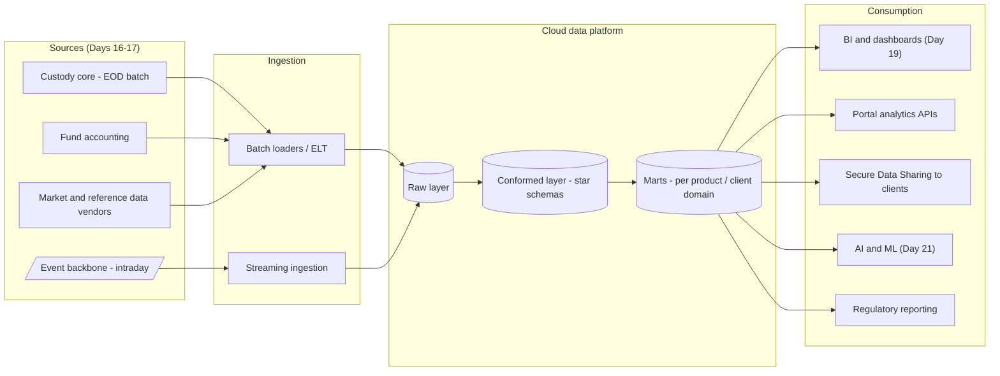
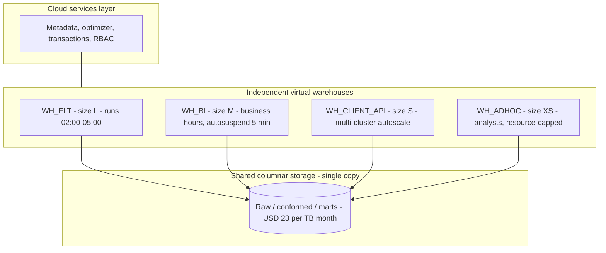
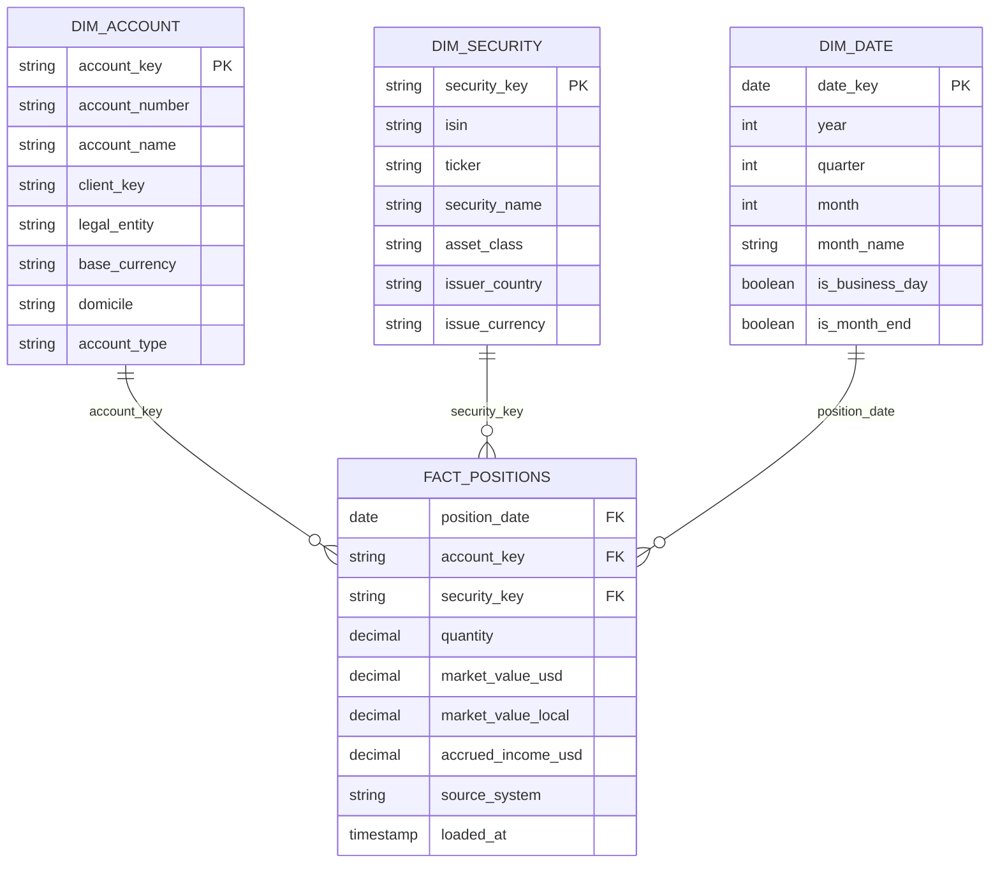
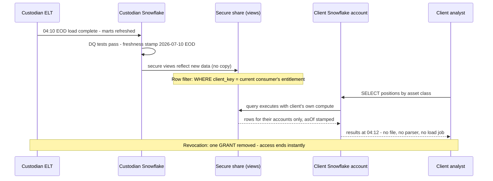

# Day 18 — Data Platforms: Snowflake, Warehouses and SQL

> Week 3 · Technology and Data · Est. reading time: 60–90 min

## 🎯 Learning objectives

By the end of today you can:

- Explain warehouse vs lake vs lakehouse in plain language and say which workloads belong where.
- Describe Snowflake's separation of storage and compute and work through why it changes cost economics — with numbers.
- Position Time Travel, zero-copy cloning and, above all, **Secure Data Sharing** as capabilities — the last one as a *client-facing product* that can replace SFTP file delivery.
- Explain ELT and the modern stack (dbt-style transformation, orchestration) well enough to challenge a pipeline design.
- Read a star schema (facts and dimensions) and follow 8 progressively harder SQL queries against a custody model — including window functions.
- Set data freshness/quality SLAs for client-facing data and run cost governance that prevents the runaway-query bill.

## 🧭 Where this fits

Days 16–17 covered where facts are born (cores, batch) and how they travel (events). Today is where they **land and become products**: the analytical platform feeding client dashboards (Day 19), data-sharing products, regulatory reporting and eventually AI (Day 21). For a custodian, this layer is special: data *is* the product. Clients increasingly choose custodians on the quality, freshness and deliverability of data about their own assets.



---

## Part 1 — Core concepts

### 1.1 Warehouse, lake, lakehouse — plainly

- **Data warehouse**: structured, governed, SQL-first store optimized for analytical queries. Data is modeled (schemas, conformed dimensions) *before or as* it is served. Strength: trustworthy, fast, business-readable. Historic weakness: rigid, expensive to load "maybe useful someday" data.
- **Data lake**: cheap object storage (S3/ADLS) holding raw files of any shape — structured extracts, JSON events, documents. Strength: cheap, keeps everything, great for data science exploration. Weakness ungoverned: the "data swamp" — nobody knows what's true, fresh or permitted.
- **Lakehouse**: lake storage with warehouse discipline layered on top — open table formats (Iceberg/Delta) adding transactions, schema enforcement and time travel to files, queried by SQL engines. The industry's convergence point; Snowflake and Databricks now meet in the middle from opposite directions.

| | Warehouse | Lake | Lakehouse |
|---|---|---|---|
| Data shape | Modeled, structured | Anything, raw | Raw + governed tables |
| Primary users | Analysts, BI, apps | Data scientists, engineers | Both |
| Governance | Strong by construction | Bring your own | Strong if operated well |
| Cost of storage | Historically premium | Cheap | Cheap |
| Client-facing suitability | High (with SLAs) | Low directly | High for curated layers |

The executive simplification that holds: **client-facing numbers come from the governed, modeled layer** — whatever the underlying technology brand. Raw layers exist to feed it, never to feed a client screen directly.

### 1.2 Snowflake architecture — and why the economics change

Snowflake's defining design: **storage and compute are separate and independently scaled.**

- **Storage**: all data lives once, in compressed columnar files on cloud object storage, priced at roughly commodity object-storage rates (order of USD 23/TB/month compressed).
- **Compute — "virtual warehouses"**: independent clusters (sized XS, S, M, L… each step doubling capacity and credit burn) that read that shared storage. They start in seconds, suspend when idle, and *do not interfere with each other*.
- **Services layer**: metadata, optimization, transactions, security — the coordination brain.



Why separation changes the economics — **worked example.** Legacy on-prem appliance world: you sized one monolithic box for the *worst hour* (the 03:00 ELT crunch plus month-end), paid for it 24×7, and every workload contended — the analyst's monster query slowed the client API. Capex, 3-year cycles, one shared fate.

Snowflake world, same bank, representative month (assume USD 3 per credit; credits/hour by size: S=2, M=4, L=8):

| Warehouse | Size | Usage pattern | Credit math | Monthly cost |
|---|---|---|---|---|
| WH_ELT | L | 3h/night × 30 nights | 3 × 8 × 30 = 720 credits | USD 2,160 |
| WH_BI | M | ~10h/day effective × 22 days (autosuspend eats idle) | 10 × 4 × 22 = 880 | USD 2,640 |
| WH_CLIENT_API | S | 24×7 but autoscales; ~1.3 clusters average | 24 × 2 × 30 × 1.3 ≈ 1,872 | USD 5,616 |
| WH_ADHOC | XS | capped at 100 credits/month | 100 | USD 300 |
| Storage | — | 40 TB compressed | 40 × 23 | USD 920 |
| **Total** | | | | **≈ USD 11,600/month** |

Three structural consequences: (1) **workload isolation is free** — the ELT crunch can never slow the client API, because they are different compute; (2) **cost is a dial, not a purchase** — month-end pressure? Run the ELT warehouse at XL for three nights and drop back; (3) **cost is now *variable and behavioral*** — one analyst leaving an L warehouse running over a long weekend burns ~USD 1,700 for nothing. Hence cost governance (§2.5) is an operating discipline, not an afterthought.

### 1.3 Time Travel and zero-copy cloning — small features, big operational value

- **Time Travel**: query any table *as of* a past moment (up to 90 days): `SELECT … AT(TIMESTAMP => '2026-07-11 06:00')`. Uses: instant recovery from a bad load (`UNDROP TABLE`, or recreate from the pre-load state in minutes, not a backup-restore weekend); and *point-in-time audit* — "what did the client's dashboard number look like on the 11th?" is answerable exactly, which matters when a client disputes a figure.
- **Zero-copy cloning**: `CREATE TABLE X CLONE Y` copies terabytes in seconds by copying *metadata pointers*, not data; storage is consumed only as the clone diverges. Uses: full-size test environments per release (test the month-end pipeline against a clone of production-scale data), and safe what-if reprocessing.

Both exist because storage is a single shared layer with immutable files underneath — the architecture, not bolt-on features. The VP translation: **your teams have no excuse for testing pipelines against toy data, and "we can't reproduce what the client saw" is no longer an acceptable incident answer.**

### 1.4 Secure Data Sharing — the warehouse as a client-facing product

The capability with the most direct product implication for a custodian. **Secure Data Sharing** lets an account grant another Snowflake account *live, read-only, governed access* to selected tables/views — **no data is copied or moved**. The consumer queries the provider's data with their own compute, seeing updates the moment the provider's tables update.

Contrast with the incumbent: nightly SFTP files.

| | SFTP file delivery | Secure Data Sharing |
|---|---|---|
| Freshness | Fixed EOD batch; client loads it hours later | Live — as fresh as the provider's tables |
| Client effort | Build/maintain parsers, loaders, schema-change firefighting | Query with SQL immediately; schema evolution is additive views |
| Failure modes | Missed files, truncated files, duplicate loads, silent format drift | Query-time errors are visible; no transport layer to break |
| Security | Files at rest on two SFTP servers and in transit | No copies; access revocable instantly; row-level filtering per consumer |
| Cost to provider | File generation jobs + transport infra + support tickets | Governed views + entitlement rows; consumer pays their own compute |
| Auditability | "Did they download it?" | Provider sees query metadata; access is a grant, not a copy |

Product framing: this is **"data delivery" reinvented as a subscription product**. A custodian can offer clients: your positions, transactions, NAVs and fails — as governed live shares into *your own* Snowflake account (or via reader accounts for clients without Snowflake), row-filtered to your entitlements (Day 11's model, enforced in the share's secure views). Marketplace/listing mechanics add discoverability, usage terms and even monetization. State Street, BNY and BlackRock's Aladdin ecosystem have all publicly moved this direction (see 🏦 below). The catch to manage: platform coupling (it works Snowflake-to-Snowflake; cross-cloud/region adds replication cost; non-Snowflake clients need reader accounts or an alternative path) — so it's an *additional* premium channel, not an immediate SFTP replacement for all clients.

### 1.5 ELT and the modern stack

The generational shift: **ETL → ELT**. Old world: transform data on a middleware server *before* loading the expensive warehouse. New world: **E**xtract, **L**oad raw into cheap storage, **T**ransform *inside* the platform with SQL, because warehouse compute is now elastic and cheap enough.

The modern reference stack, tool-brand-agnostic:

- **Ingestion** — batch loaders and streaming connectors (Kafka → Snowpipe-style continuous load) land source data into the **raw layer**, unmodified (auditability: you can always see what the source actually sent).
- **Transformation — the dbt pattern**: transformations are **SQL SELECT statements under version control**, built into a dependency graph (DAG), with **tests** (uniqueness, not-null, referential integrity, accepted ranges) and generated documentation/lineage. The profound shift: pipelines become *software engineering* — code review, CI, environments — instead of opaque GUI jobs. When Day 20 asks "where did this number come from," dbt-style lineage is a large part of the answer.
- **Orchestration** (Airflow-style): schedules and sequences the DAG — "when the custody EOD file lands *and* the security master refresh completes, rebuild the conformed layer, run tests, then refresh the marts, then signal the BI extracts (Day 19)."
- **Layered modeling convention**: `raw` (as received) → `staging` (typed, renamed, deduplicated) → `conformed` (star schemas, one version of truth) → `marts` (per consumer domain: client reporting, ops analytics, regulatory). Client-facing anything reads from marts. Nothing client-facing reads raw. Ever.

### 1.6 Dimensional modeling — the star schema, custody edition

The 40-year-old idea that still runs every serious BI estate (Kimball): model each business process as a **fact table** (the measurements: quantities, amounts — long and thin, billions of rows) surrounded by **dimension tables** (the context: who, what, when — wide and short, thousands to millions of rows). Star-shaped joins, business-readable, and fast on columnar engines.

Custody example — daily positions:



Reading rules worth internalizing: **grain** is the contract — here, *one row per account, per security, per business date*; every question the table can answer follows from the grain. Facts are numeric and additive (you can sum market value across accounts); dimensions are the GROUP BY and WHERE vocabulary. A sibling `fact_transactions` (grain: one row per transaction) and `fact_fails` (one row per failing instruction per day) share the *same conformed dimensions* — which is exactly what makes "fails by asset class next to positions by asset class" a five-minute request instead of a project.

---

## Part 2 — The system deep dive

### 2.1 SQL literacy for a VP — eight queries, progressively harder

You will never write production SQL. You *will* sit in reviews where a number is defended with a query, and the VP who can read it commands the room. All queries run against the star schema above. Sample data: three accounts of client "Meridian Pension", business date 2026-07-10.

**Q1 — Filter and project.** *What does Meridian's account A-1001 hold?*

```sql
SELECT security_key, quantity, market_value_usd
FROM fact_positions
WHERE account_key = 'A-1001' AND position_date = '2026-07-10';
```

| security_key | quantity | market_value_usd |
|---|---|---|
| S-US-AAPL | 120,000 | 25,140,000 |
| S-DE-BUND31 | 30,000,000 | 32,410,000 |
| S-JP-7203 | 800,000 | 13,During |

**Q2 — Join to a dimension.** *Same, but with human-readable names* — the join is the whole point of the star:

```sql
SELECT s.security_name, s.asset_class, p.market_value_usd
FROM fact_positions p
JOIN dim_security s ON s.security_key = p.security_key
WHERE p.account_key = 'A-1001' AND p.position_date = '2026-07-10';
```

| security_name | asset_class | market_value_usd |
|---|---|---|
| Apple Inc | Equity | 25,140,000 |
| Bund 0.5% 2031 | Government Bond | 32,410,000 |
| Toyota Motor | Equity | 13,890,000 |

**Q3 — Aggregate.** *Client's total market value by asset class, all accounts:*

```sql
SELECT s.asset_class, SUM(p.market_value_usd) AS mv_usd
FROM fact_positions p
JOIN dim_security s ON s.security_key = p.security_key
JOIN dim_account a ON a.account_key = p.account_key
WHERE a.client_key = 'C-MERIDIAN' AND p.position_date = '2026-07-10'
GROUP BY s.asset_class
ORDER BY mv_usd DESC;
```

| asset_class | mv_usd |
|---|---|
| Government Bond | 812,340,000 |
| Equity | 604,220,000 |
| Corporate Bond | 231,500,000 |
| Cash Equivalent | 88,120,000 |

**Q4 — Aggregate with a condition on the aggregate.** *Which accounts hold more than USD 100M in any single security?* (`HAVING` filters groups the way `WHERE` filters rows):

```sql
SELECT a.account_name, s.security_name, SUM(p.market_value_usd) AS mv
FROM fact_positions p
JOIN dim_account a ON a.account_key = p.account_key
JOIN dim_security s ON s.security_key = p.security_key
WHERE p.position_date = '2026-07-10'
GROUP BY a.account_name, s.security_name
HAVING SUM(p.market_value_usd) > 100000000;
```

| account_name | security_name | mv |
|---|---|---|
| Meridian Global Bond | US Treasury 2.5% 2034 | 214,700,000 |
| Meridian Global Bond | Bund 0.5% 2031 | 141,220,000 |

**Q5 — Time series.** *Month-end equity value trend, using the date dimension's flags* — note no date arithmetic, the dimension carries the calendar intelligence:

```sql
SELECT d.date_key, SUM(p.market_value_usd) AS equity_mv
FROM fact_positions p
JOIN dim_date d ON d.date_key = p.position_date
JOIN dim_security s ON s.security_key = p.security_key
JOIN dim_account a ON a.account_key = p.account_key
WHERE a.client_key = 'C-MERIDIAN' AND s.asset_class = 'Equity'
  AND d.is_month_end AND d.year = 2026
GROUP BY d.date_key ORDER BY d.date_key;
```

| date_key | equity_mv |
|---|---|
| 2026-04-30 | 571,900,000 |
| 2026-05-29 | 588,340,000 |
| 2026-06-30 | 604,220,000 |

**Q6 — Window function: rank within groups.** *Top 2 holdings per asset class* — window functions compute across related rows *without collapsing them* (the single biggest leap in SQL reading skill):

```sql
SELECT asset_class, security_name, mv,
       RANK() OVER (PARTITION BY asset_class ORDER BY mv DESC) AS rnk
FROM (
  SELECT s.asset_class, s.security_name, SUM(p.market_value_usd) AS mv
  FROM fact_positions p
  JOIN dim_security s ON s.security_key = p.security_key
  JOIN dim_account a ON a.account_key = p.account_key
  WHERE a.client_key = 'C-MERIDIAN' AND p.position_date = '2026-07-10'
  GROUP BY s.asset_class, s.security_name
) QUALIFY rnk <= 2;
```

| asset_class | security_name | mv | rnk |
|---|---|---|---|
| Equity | Apple Inc | 78,410,000 | 1 |
| Equity | Toyota Motor | 51,230,000 | 2 |
| Government Bond | US Treasury 2.5% 2034 | 214,700,000 | 1 |
| Government Bond | Bund 0.5% 2031 | 141,220,000 | 2 |

**Q7 — Window function: running balance.** *Cash running balance from transactions* — the pattern behind every "balance over time" chart on the portal:

```sql
SELECT t.trade_date, t.description, t.amount_usd,
       SUM(t.amount_usd) OVER (
         PARTITION BY t.account_key ORDER BY t.trade_date, t.txn_id
         ROWS UNBOUNDED PRECEDING) AS running_balance
FROM fact_transactions t
WHERE t.account_key = 'A-1001' AND t.trade_date BETWEEN '2026-07-06' AND '2026-07-10';
```

| trade_date | description | amount_usd | running_balance |
|---|---|---|---|
| 2026-07-06 | Opening injection | 5,000,000 | 5,000,000 |
| 2026-07-07 | Buy Bund 0.5% 31 | -3,241,000 | 1,759,000 |
| 2026-07-08 | Dividend AAPL | 28,800 | 1,787,800 |
| 2026-07-10 | FX settle EURUSD | -412,300 | 1,375,500 |

**Q8 — Period-over-period with LAG.** *Day-over-day change in total client value — the "what moved?" query:*

```sql
WITH daily AS (
  SELECT p.position_date, SUM(p.market_value_usd) AS total_mv
  FROM fact_positions p
  JOIN dim_account a ON a.account_key = p.account_key
  WHERE a.client_key = 'C-MERIDIAN'
  GROUP BY p.position_date)
SELECT position_date, total_mv,
       total_mv - LAG(total_mv) OVER (ORDER BY position_date) AS dod_change,
       ROUND(100.0 * (total_mv / LAG(total_mv) OVER (ORDER BY position_date) - 1), 2) AS dod_pct
FROM daily ORDER BY position_date DESC LIMIT 3;
```

| position_date | total_mv | dod_change | dod_pct |
|---|---|---|---|
| 2026-07-10 | 1,736,180,000 | 12,440,000 | 0.72 |
| 2026-07-09 | 1,723,740,000 | -8,010,000 | -0.46 |
| 2026-07-08 | 1,731,750,000 | 3,120,000 | 0.18 |

What to *do* with this literacy in reviews: check the **grain** ("is this double-counting because fact rows repeat per lot?"), check the **join keys** ("joining on ticker instead of security_key — tickers get reused"), check **date logic** ("calendar days or business days?"), and ask what filter enforces **entitlements** when the query is client-facing.

### 2.2 Sharing in motion — the sequence



The two lines that carry the product value: the **row filter inside the secure view** (entitlements enforced at the data layer — the same logic as Day 11, expressed in SQL) and **"no file, no parser, no load job"** (the client's total cost of consuming your data collapses — a genuine differentiator in RFPs).

### 2.3 Freshness and quality SLAs for client-facing data

Client-facing data needs *contracted* properties, not best-effort pipelines. The practical instrument is a **data SLA per mart**, published where clients (and your own support desk) can see status:

| Property | Example commitment for `mart_client_positions` | Measured how |
|---|---|---|
| Freshness | EOD positions available by 06:00 EST, 99% of business days | `loaded_at` vs schedule; status page + proactive alert on breach (Day 16's playbook) |
| Completeness | 100% of active accounts present, reconciled to core control totals | Row-count and control-total checks in the DAG; load *blocks* on failure |
| Accuracy | Market values tie to accounting within tolerance 0.01% | Automated recon step vs book of record |
| Consistency | Same number on portal, BI, share and API | All read the same mart — the architecture *is* the control |
| Validity | No nulls in keys; FX rates within daily band | dbt-style tests, fail-fast |

The design decision worth a VP fight: **block-on-failure vs publish-with-flag.** If completeness fails at 04:00, do you hold the mart (clients see yesterday, honestly labeled) or publish partial data with a warning? For custody, default to **hold and notify** — a missing account is invisible to the client until it burns them; stale-but-labeled is survivable, silently-partial is not. Agree this policy per mart *before* the first 4am incident, and rehearse it.

### 2.4 Cost governance — preventing the runaway bill

Elastic compute means elastic bills. The failure modes and controls:

| Failure mode | Real-world shape | Control |
|---|---|---|
| Runaway query | Analyst's accidental cross-join runs 9 hours on an L warehouse ≈ 216 credits ≈ USD 650 for one mistake | Statement timeouts (e.g., 1h on ad-hoc), resource monitors that suspend at credit thresholds |
| Zombie warehouse | Left running over a weekend: L × 60h = 480 credits ≈ USD 1,440 for zero work | Auto-suspend at 5–10 min idle, everywhere, no exceptions |
| Oversizing by vibes | "Make it XL, it's month-end" — permanently | Right-size by measured queue time and spill metrics; scale *up temporarily* with an end date |
| Per-team sprawl | 40 warehouses nobody maps to budgets | Tagging + chargeback: every warehouse has an owner and a cost center; monthly review |
| Chatty BI extracts | Dashboard refreshing hourly overnight for no viewer | Refresh schedules tied to actual usage (Day 19) |

Governance posture that works: platform team owns *guardrails* (monitors, timeouts, auto-suspend defaults); product/domain teams own *their spend* against budgets with visible dashboards; a monthly 30-minute cost review kills the top offenders. Expect and demand 20–30% savings in the first governed quarter of a previously ungoverned estate — it is nearly always there, in zombies and oversizing.

---

## Part 3 — The VP lens

### Decisions you own (or heavily shape)

1. **Data-as-product portfolio.** Which client-facing data products exist — portal analytics, API delivery (Day 15), file delivery (legacy), Secure Data Sharing (premium) — with one *shared mart layer* underneath so every channel shows the same number. The channels are packaging; the mart is the product.
2. **The sharing bet.** Whether and when to launch Snowflake-share delivery as a differentiator: pick 2–3 sophisticated clients already on Snowflake as design partners; price it (bundled vs premium subscription); keep SFTP running in parallel — this is additive, not a migration ultimatum.
3. **The SLA sheet.** Freshness/completeness/accuracy commitments per client-facing mart, and the hold-vs-publish policy. These are client promises; you sign them, not the platform team.
4. **Consistency mandate.** One conformed layer; no team builds a private copy of positions "for speed." Every private copy is a future client-visible discrepancy with your name on the incident review.
5. **Cost model.** Chargeback boundaries, the ad-hoc analyst budget, and which client products justify dedicated (isolated) compute.

### Trade-offs to argue explicitly

| Trade-off | Tension | Defensible position |
|---|---|---|
| Freshness vs cost | Continuous/streaming loads cost multiples of nightly batch | Intraday only where a client decision changes intraday (cash, fails); EOD with honest labels elsewhere |
| Platform coupling vs differentiation | Deep Snowflake features (shares, marketplace) are sticky both ways | Take the coupling for the delivery channel; keep the *models* (dbt SQL) portable — that's where the logic lives |
| Central platform team vs domain ownership | Central = consistency, bottleneck; domain = speed, drift | Central owns raw + conformed + standards; domains own their marts within those standards ("data mesh lite") |
| Hold vs publish on DQ failure | Client anger at stale data vs client harm from silent gaps | Hold and proactively notify for statements/positions; publish-with-flag only for analytics-grade marts |
| Buy analytics compute for clients vs consumer-pays | Reader accounts put client compute on your bill | Consumer-pays for Snowflake-native clients; reader accounts as a costed premium tier |

### Metrics for your monthly review

- **Freshness SLA attainment** per client-facing mart (and proactive-notification rate on misses).
- **DQ test pass rate** and mean time to resolve a blocked load.
- **Cross-channel consistency incidents** (portal ≠ file ≠ share): target zero; each one is an architecture violation, find the private copy.
- **Cost per client-facing mart per month**, trend; % spend on suspended/zombie compute (target <5%).
- **Sharing adoption**: clients live on shares, queries/client/week (usage = the retention signal), SFTP files retired.
- **Time-to-new-data-product**: request → governed mart in production. The platform is working when this is weeks, not quarters.

### Questions to ask your teams this week

1. "Show me the lineage for the total-market-value number on the portal dashboard — which mart, which conformed tables, which sources, and where do its DQ tests run?" (Day 20 will formalize this; today it's a sniff test.)
2. "What happens at 04:00 when completeness fails — who is paged, what does the client see at 06:00, and when did we last rehearse it?"
3. "How many copies of positions data exist outside the conformed layer, and why does each exist?"
4. "What did our top 10 most expensive queries last month cost, and what business question was each answering?"
5. "If our largest client asked for their data as a Snowflake share next quarter, what's actually missing — entitlement views, contracts, pricing, support model?"

---

## 🏦 State Street context

*Representative and public-knowledge; treat specifics as directional.*

- Data delivery is core to State Street's stated strategy. **State Street Alpha℠** is publicly built around an integrated data backbone, and State Street has announced partnerships with **Snowflake** and **Microsoft Azure** in the Alpha Data Platform context — delivering clients' investment data through cloud platforms rather than only files. The Secure Data Sharing material above is not hypothetical for this seat; it is the direction of travel of the product you are joining.
- The competitive frame: BlackRock's Aladdin ecosystem has publicly partnered with Snowflake; BNY and Northern Trust market cloud data-delivery propositions. In RFPs for asset-owner and asset-manager mandates, "how do we get our data, how fresh, how governed" is a scored section — the mart layer and SLA sheet above are directly revenue-relevant.
- Scale realities: thousands of funds, ~100 markets, multiple accounting engines — so the conformed layer's hardest problems are *reference-data consistency* (Day 20: security master, account hierarchies) and *multi-source reconciliation*, not query speed. Expect the "one version of positions" problem to be organizational as much as technical: several groups have historically produced client data extracts, and consolidation onto shared marts is a political program wearing a technical costume.
- Regulatory overlay: client data crossing borders (a global client's Irish funds, US accounts, APAC sub-custody) hits data-residency and privacy constraints (Day 20) that shape *where* marts and shares can physically live — multi-region replication is a cost and compliance decision, not just a checkbox.

---

## 💪 Exercises

1. **Read the query.** Take Q6 (top-2 holdings) and modify it on paper to show top 3 *by client* rather than per asset class. Which clause changes? (Answer: the `PARTITION BY` — if that was obvious, your window-function literacy is real.)
2. **Draft the SLA sheet.** For `mart_client_positions`, write the five-row SLA table (freshness, completeness, accuracy, consistency, validity) with *your* numbers, and write the 4am hold-vs-publish decision as one policy paragraph you could defend to an angry client the morning after.
3. **Price the sharing product.** Sketch a one-page business case for Snowflake-share delivery to your top 10 clients: build cost (entitlement views, contracts, support), run cost, SFTP cost retired, and the pricing model (bundled with custody vs premium data subscription). Decide which and defend it.

## ❓ Self-check quiz

1. What is the single defining architectural idea of Snowflake, and name two economic consequences.
2. Why must client-facing numbers come only from the conformed/mart layer and never from raw?
3. What is the "grain" of a fact table and why is it the first thing to check when a number looks double-counted?
4. In Q7, what makes the running-balance query a *window* aggregate rather than a GROUP BY?
5. Your completeness check fails at 04:00 for the positions mart. Argue the hold-vs-publish decision in three sentences.

<details>
<summary>Answers</summary>

1. Separation of storage (single shared copy on cheap object storage) from compute (independent, elastic virtual warehouses). Consequences: workload isolation is free (ELT can't slow the client API), and cost becomes variable and behavioral — you pay per running second, so both temporary scale-up and zombie-warehouse waste are possible, making cost governance an operating discipline.
2. Raw is unvalidated, unmodeled and duplicated by source; only the conformed/mart layer carries DQ tests, entitlement filtering, conformed dimensions and freshness stamps. Serving clients from raw bypasses every control that makes a number defensible — and creates cross-channel discrepancies when different consumers "clean" raw differently.
3. Grain = what one row represents (e.g., one account-security-date combination). If the actual grain is finer than assumed (per lot, per source system), naive SUMs double-count. Checking grain against the join and aggregation logic is the fastest way to audit a suspicious figure.
4. `SUM(...) OVER (PARTITION BY account ORDER BY date ROWS UNBOUNDED PRECEDING)` computes a cumulative sum *per row without collapsing rows* — each transaction row keeps its identity and gains a running total. GROUP BY would collapse the rows and lose the transaction-level view.
5. Hold: a silently missing account is invisible to the client until it causes harm (wrong asset-allocation decision, missed break), whereas yesterday's data clearly labeled "as of 09-Jul, refresh delayed" is honest and survivable. Publish-with-flag suits analytics-grade data where trends matter more than completeness. For books-and-records data like positions, hold-and-proactively-notify is the defensible default — agreed and rehearsed before the incident, not improvised at 4am.

</details>

## 🔑 Key takeaways

- Warehouse vs lake vs lakehouse matters less than one rule: client-facing numbers come from a governed, modeled layer with tests and SLAs.
- Snowflake's storage/compute separation makes isolation free and cost behavioral — budget in credits, govern zombies and runaways, expect 20–30% savings from first-quarter governance.
- Time Travel and zero-copy cloning turn "restore and reproduce" from projects into minutes — demand production-scale testing and point-in-time answers from your teams.
- Secure Data Sharing turns data delivery into a live, entitled, no-copy product — a genuine RFP differentiator and the strategic successor to SFTP, run as an additive premium channel.
- ELT + dbt-style transformation makes pipelines software: versioned SQL, tests, lineage — the foundation Day 20's governance builds on.
- Star schemas (grain! conformed dimensions!) are the lingua franca of the analytics estate; eight query patterns cover most of what you'll ever need to read in a review.
- Freshness/completeness/accuracy SLAs and the hold-vs-publish policy are product commitments you own — decide them per mart, publish status, notify proactively.

## 📚 Going deeper

- Ralph Kimball and Margy Ross, *The Data Warehouse Toolkit* (3rd ed.) — chapters 1–4 give you every dimensional-modeling concept used today.
- Snowflake documentation: architecture overview, Time Travel, cloning, Secure Data Sharing and listings — all public and readable in an evening.
- dbt Labs, "The dbt Viewpoint" and the dbt docs' "best practices" guide — the transformation-as-software philosophy.
- Zhamak Dehghani's data mesh writings (martinfowler.com) — for the central-vs-domain ownership debate, read critically.
- Joe Reis and Matt Housley, *Fundamentals of Data Engineering* — the modern stack end to end, vendor-neutral.
- State Street, Snowflake and Microsoft public press releases on the Alpha Data Platform collaborations — the strategic context of this seat.

## Tomorrow

**Day 19 — BI, Tableau and Embedded Analytics:** the marts you built today become dashboards clients actually see — Tableau governance, row-level security meeting Day 11's entitlements, and when to embed vs build native.
