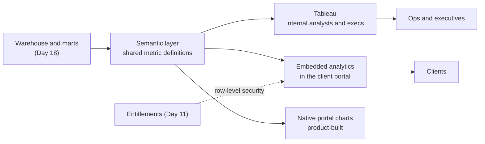
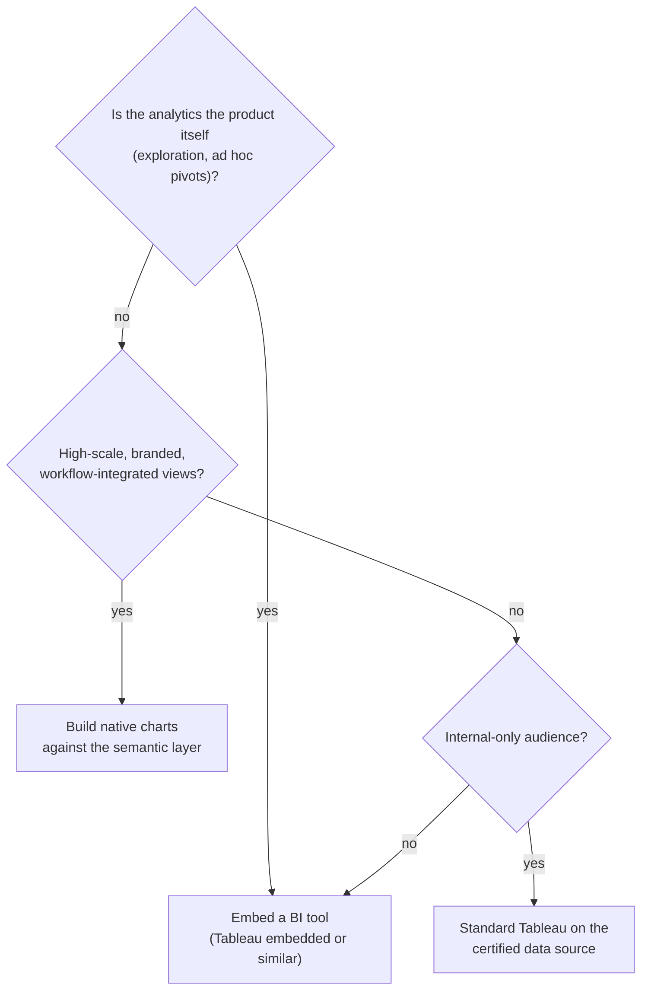
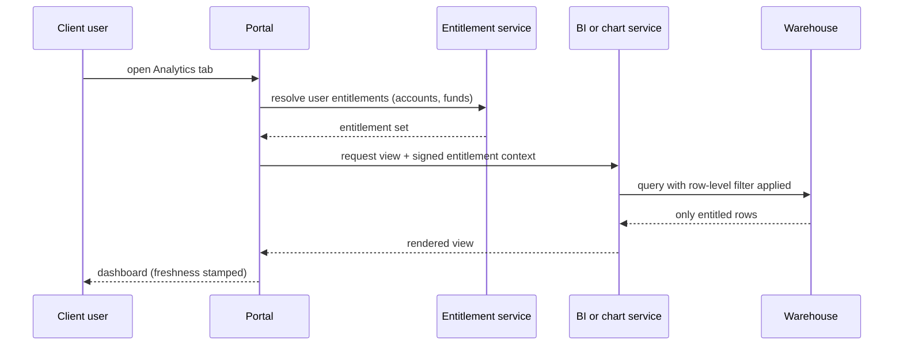

# Day 19 — BI, Tableau and Embedded Analytics

> Week 3 · Technology and Data · Est. reading time: 60–90 min

## 🎯 Learning objectives

By the end of today you can:

- Place Tableau within the enterprise BI landscape and explain how it's governed at scale
- Explain the concepts that drive Tableau decisions: extracts vs live, certified data sources, row-level security
- Critique a dashboard against principles that actually matter (and rebuild a bad one)
- Decide between embedded BI and native charts for client-facing analytics, with the licensing and performance trade-offs
- Explain the semantic/metrics layer and why "one definition of fail rate" is a product requirement
- Tell an executive data story that leads to a decision

## 🧭 Where this fits

Day 18 built the warehouse and the star schema. Today the data becomes *visible* — to your internal ops and executives through BI tools, and to clients through analytics embedded in the portal. This is where Week 3's plumbing meets Week 2's experience layer: a client dashboard is UX (Day 10), entitlements (Day 11), warehouse data (Day 18) and visualization craft, all in one screen.

---

## Part 1 — Core concepts

### The BI estate, honestly

| Tool | Sweet spot | Watch out for |
|---|---|---|
| **Tableau** | Analyst-driven exploration, polished dashboards, strong viz grammar | Server governance sprawl; per-user licensing at scale |
| **Power BI** | Microsoft-estate shops, cost at volume | Often becomes "Excel with graphs" without governance |
| **Looker-style (semantic-first)** | Governed metrics, embedded use | Modeling discipline required up front |
| **Native charts (build)** | Client-facing, high-scale, branded experiences | You own every feature (export, drill, a11y) forever |

Large banks typically run *several* of these simultaneously plus thousands of unofficial Excel "dashboards." The estate question is not "which tool" but **which tier of use case gets which tool under what governance.**

### Tableau concepts that drive real decisions

- **Workbooks and data sources are separate assets.** A *published data source* (curated, documented, refreshed) can feed many workbooks. This separation is the governance seam.
- **Extracts vs live connections**: extracts are cached snapshots (fast, load off the warehouse, but *stale by design* — stamp the refresh time); live queries hit the warehouse per interaction (fresh, but you pay Day 18's compute per click). Default: extracts for overnight-batch data (most of custody), live only where intraday matters.
- **Certified data sources**: Tableau's stamp for "the governed one." The certification *process* — who certifies, against what quality bar (Day 20's DQ dimensions) — is where governance becomes real.
- **Row-level security (RLS)**: one workbook, many viewers, each seeing only their rows. For anything client-facing, RLS must derive from the **same entitlement model as Day 11** — a user entitled to accounts A101–A150 sees exactly those rows, enforced in the data layer, not by hiding filters.

### The self-service paradox

Give analysts self-service BI and you get insight *and* sprawl: five teams compute "settlement fail rate" five ways (fails/instructions? by value or count? including cancels?), and two VPs present different numbers for the same month to the same executive. The fix is not locking BI down; it's the **semantic layer**: metric definitions (name, formula, grain, filters, owner) defined *once*, consumed by every tool. Treat metric definitions like API contracts (Day 15): versioned, owned, deprecated with notice.

---

## Part 2 — The system deep dive

### Dashboard craft — the critique you'll perform monthly

Principles that actually matter (the rest is decoration):

1. **A dashboard answers a question.** Name it: "Are we settling on time, and where are we failing?" If a viewer can't say what question a screen answers, it's a data dump.
2. **The 5-second rule**: status legible in 5 seconds — headline KPIs with targets and trend, color reserved for meaning (red = act), not decoration.
3. **Exception-first** (Day 10's principle, again): the fails, the breaches, the aging tail — not a celebration of the 99.2% that's fine.
4. **Drill path built in**: KPI → trend → breakdown (by market, client, counterparty) → the actual records. Every aggregate must open into its rows or someone re-builds that in Excel.
5. **Honest axes and freshness**: y-axis from zero for bars, no dual-axis tricks, "data as of 06:00 ET" on the face (ABOR/IBOR labeling — Day 4 — applies to charts too).

**Worked critique — "Settlement Fails" dashboard v1 vs v2:**

| | v1 (typical first attempt) | v2 (after review) |
|---|---|---|
| Layout | 9 charts, equal size, no hierarchy | 3 KPIs on top (fail rate vs target, value at risk, aging >5d), one trend, one breakdown |
| Color | Brand palette everywhere | Grey baseline; red only on breaches |
| Content | All instructions, all statuses | Exceptions first; success is one number |
| Interaction | 12 filter dropdowns | Drill path: market → client → instruction list |
| Trust | No timestamp, metric undefined | Freshness stamp + metric definition on hover (semantic layer) |
| Result | "Interesting" | Monday ops meeting runs on it |

### Embedded analytics in the client portal

The build-vs-embed decision for client-facing charts:

What each costs:

- **Embedding** buys speed and analyst-grade interactivity, but: **licensing economics** (embedded/usage-based licenses for thousands of external users are a real negotiation — model it per client, per year, before promising anything), **performance** (a slow embedded dashboard *is* your portal's reputation), **white-labeling limits**, and RLS integration work (portal session → BI identity → row filter, correctly, always).
- **Native** buys brand, performance and workflow integration (click a bar → open those failed instructions → act), but you own export, drill, accessibility and every future feature. Fund it like a product, not a sprint.

The common mature landing: **native for the standard experience** (positions, activity, fails on every client's home), **embedded for the analytical tier** (clients who want to explore), both reading the same semantic layer so numbers never disagree.

### Data storytelling for executives

BI shows; a story *moves*. The structure that works (and previews Day 23):

1. **Lead with the "so what"**: "Fail value at risk doubled this quarter, driven by one market; here's the fix and its cost."
2. **One chart, one message** — the chart's title states the finding ("Fails concentrated in market X post-T+1"), not the dataset ("Fails by market").
3. **Annotate the chart**, don't narrate around it: mark the regime change, the outlier, the target line.
4. **End on the decision you're asking for.** Analytics without an ask is trivia.

---

## Part 3 — The VP lens

What you own in this domain:

- **The client analytics roadmap** — which analytical capabilities reach clients natively vs embedded, sequenced by segment value (Day 25's client tiers).
- **The "one number" mandate** — sponsor the semantic layer politically. The moment a client sees a portal number disagree with their file feed or their RM's deck, you own the credibility repair. One metric store, all channels.
- **The certification bar** — nothing client-facing renders from an uncertified source. This single rule prevents most analytics incidents.
- **Licensing negotiations** — embedded-BI commercials for external users are a seven-figure, multi-year decision; model adoption scenarios before signing.

| Decision | Tension | Defensible default |
|---|---|---|
| Native vs embedded for clients | Speed vs ownership | Native standard tier, embedded analytical tier, one semantic layer |
| Analyst freedom internally | Insight vs metric chaos | Free exploration on certified sources; publishing requires certification |
| Real-time dashboards | Wow factor vs cost and honesty | Match refresh to the business cycle (most custody data is daily); stamp freshness |
| Export to Excel | "Leakage" fears | Always allow it — clients will screenshot anyway; make the export governed and watermarked |

Questions for your teams: How many definitions of "fail rate" exist across our dashboards today? Which client-facing views render from uncertified sources? What's the p95 load time of the portal's slowest embedded dashboard? Who certifies a data source and how long does it take?

## 🏦 State Street context

Representative reality at a global custodian: the internal Tableau (or equivalent) estate is enormous — thousands of workbooks across ops, risk and finance — and periodically pruned via certification drives; client-facing analytics is a named battleground in RFPs (peers pitch data platforms with rich exploration tiers, and State Street's Alpha data story sets the same expectation). The recurring incident class isn't broken charts — it's **two numbers disagreeing**: portal vs file feed vs QBR deck. That is why the semantic layer, unglamorous as it is, is a client-trust investment, not tech hygiene. (Representative; verify internal specifics on the job.)

## 💪 Exercises

1. **Rebuild the dashboard.** Sketch (boxes on paper) the "Settlement Fails" v2 layout: 3 KPIs, one trend, one breakdown, drill path, freshness stamp. Write the question the dashboard answers as its title.
2. **Define three metrics.** Write semantic-layer entries (name, formula, grain, inclusions/exclusions, owner) for: settlement fail rate, on-time NAV %, portal weekly active users. Note every judgment call you had to make — that's the chaos you're preventing.
3. **Model the embed decision.** For a 200-client portal where 30 clients want exploratory analytics: list the cost lines of embedded (licenses, RLS integration, performance work) vs native (build, maintain), and write your recommendation memo's first paragraph.

## ❓ Self-check quiz

1. Extracts vs live connections — trade-off and the sensible custody default?
2. What is a certified data source and what should certification require?
3. Why must client-facing RLS derive from the portal's entitlement model?
4. When does embedding a BI tool beat building native charts?
5. What is the semantic layer and which incident class does it prevent?

Answers

1. Extracts: cached, fast, cheap, stale-by-design (stamp freshness); live: fresh but warehouse compute per interaction. Custody data is mostly overnight-batch, so extracts by default, live only for genuinely intraday views.
2. A governed, documented, quality-checked, owned data source designated as the official one for its domain; certification should require DQ checks (Day 20), documented lineage, an owner, and a refresh SLA.
3. One permission truth per client (Day 11): if BI filtering is a separate mechanism, it drifts from the entitlement model and eventually shows someone rows they shouldn't see — a reportable incident, not a bug.
4. When exploration/ad-hoc analysis *is* the product for that tier of client, and adoption volume makes per-user embedded licensing viable; standard high-scale branded views are better native.
5. A single store of metric definitions (formula, grain, filters, owner) consumed by all tools and channels; it prevents "two numbers disagree" incidents — the most credibility-destroying analytics failure with clients and executives.

## 🔑 Key takeaways

- Govern the estate by tiers: free exploration inside, certified sources for anything published, semantic layer for anything client-facing.
- Dashboard craft is five rules: answer a question, 5-second status, exception-first, built-in drill, honest axes and freshness.
- Native for the standard client tier, embedded for the analytical tier — **one semantic layer under both**.
- Embedded licensing for external users is a major commercial decision; model it before demoing it.
- "Two numbers disagree" is the incident class that costs client trust — the semantic layer is the fix.
- Executive analytics ends with an ask, or it's trivia.

## 📚 Going deeper

- Stephen Few, *Information Dashboard Design* — the exception-first canon
- Cole Nussbaumer Knaflic, *Storytelling with Data* — the annotation and narrative craft
- Tableau's own governance whitepapers (certified data sources, embedded analytics)
- dbt's semantic layer documentation — the modern metrics-store reference

## Tomorrow

Day 20 goes beneath the dashboards to the discipline that decides whether any number can be trusted at all: **data governance and Collibra** — quality, lineage, ownership, and why bad reference data causes half the breaks in the building.
