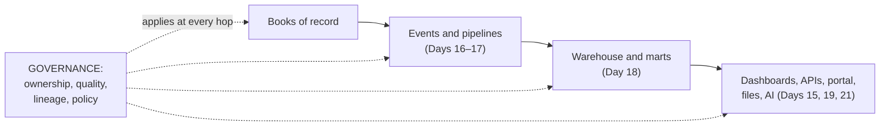
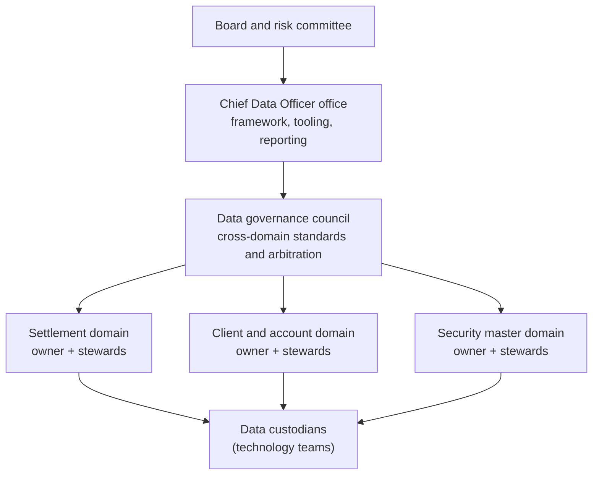
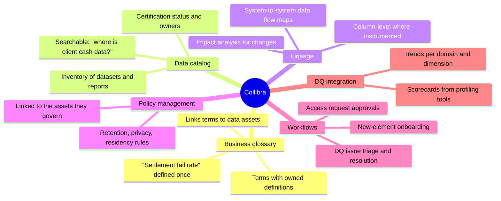
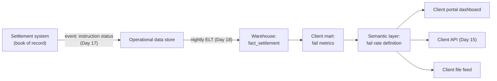

# Day 20 — Data Governance and Collibra

> Week 3 · Technology and Data · Est. reading time: 60–90 min

## 🎯 Learning objectives

By the end of today you can:

- Explain why data governance became existential for banks (BCBS 239, regulator findings, client trust)
- Describe the governance operating model: owners, stewards, custodians, councils
- Score data against the six quality dimensions and read a DQ scorecard
- Explain golden sources, master/reference data, and why bad reference data causes ops breaks
- Say concretely what Collibra does: glossary, catalog, lineage, policy, workflow
- Trace lineage from book-of-record to a client dashboard and explain why that traceability is a product requirement
- Navigate privacy and data-residency constraints on a global portal

## 🧭 Where this fits

Days 15–19 built pipes, events, warehouses and dashboards. Governance is the discipline that determines whether anything flowing through them can be **trusted, explained and defended** — to a client challenging a number, an auditor tracing a report, or a regulator asking "prove it." For a custodian, whose entire product *is* accurate records of other people's assets, data governance isn't hygiene. It's the business.

---

## Part 1 — Core concepts

### Why this became existential

Three forces converged:

1. **BCBS 239** (post-2008): the Basel Committee's principles for risk-data aggregation — banks must aggregate risk data accurately, completely and quickly, with clear ownership and lineage. A G-SIB gets examined against it; findings arrive as MRAs (matters requiring attention) with deadlines and, eventually, consequences.
2. **Regulatory findings generally**: "show me how this number was produced" is now a standard exam question. No lineage = finding.
3. **Clients industrialized their consumption** (Days 15, 18): when your data lands directly in a client's warehouse and models, a quality slip propagates into *their* NAVs, *their* reports — and comes back as a formal complaint, not a portal grumble.

### The operating model — who does what

| Role | Who (typically) | Accountability |
|---|---|---|
| **Data owner** | Senior business exec per domain (e.g., head of settlements owns settlement data) | Quality and definition of the domain — the neck on the line |
| **Data steward** | Named SME in the owner's org | Day-to-day: definitions, DQ issues, access decisions |
| **Data custodian** | Technology teams | The systems: storage, movement, controls (the *role*, not the bank!) |
| **Governance council** | Cross-domain leadership + CDO | Standards, arbitration, prioritization |
| **CDO office** | Central function | Framework, tooling (Collibra), reporting to the board |

The practical takeaway for you: **every data element on your portal has (or should have) a named owner and steward.** When a client challenges a number, that's who you call — and when you want a *new* element displayed, that's whose approval you need.

### The six quality dimensions, with custody teeth

| Dimension | Definition | Custody example of failure |
|---|---|---|
| **Accuracy** | Matches reality | Position shows 100,000 shares; CSD says 98,000 (unposted CA — Day 5) |
| **Completeness** | Nothing missing | 3% of settlement instructions lack a counterparty SSI |
| **Timeliness** | Available when needed | Prices arrive after the NAV cutoff (Day 4) |
| **Consistency** | Same everywhere | Portal fail count ≠ file-feed fail count (Day 19's nightmare) |
| **Uniqueness** | No duplicates | Same client onboarded twice under variant names |
| **Validity** | Conforms to rules | An ISIN failing its checksum; a settlement date on a weekend |

A **DQ scorecard** applies rules per dimension to a dataset and trends the pass rate. Reading one is a skill: 99.2% completeness on 2 million positions is 16,000 broken records — ask *which* 16,000 (concentrated in one market? one client?) before accepting the green cell.

### Master and reference data — the root of half the breaks

**Reference data** is the shared vocabulary: security identifiers (ISIN, CUSIP, SEDOL), the **LEI** (legal entity identifier), market/currency/calendar codes, SSIs (Day 3). **Master data** is your canonical record of core entities: the **security master**, **client master**, account/book hierarchies.

Why it matters disproportionately: a wrong SSI fails settlements (Day 3); a duplicate security-master entry splits one holding into two wrong positions; a stale calendar books a payment on a holiday. Ops "breaks" get investigated one by one downstream, but their *root cause* is upstream reference data — which is why governance programs obsess over **golden sources**: for each element, exactly one system is the authorized origin, and everyone else consumes from it (never re-keys it).

---

## Part 2 — The system deep dive

### Collibra, concretely

Collibra is the market-leading data-intelligence platform banks use to make governance operational rather than aspirational. What each capability actually is:

- **Glossary**: the business definition layer — where "settlement fail rate" gets its single owned definition (feeding Day 19's semantic layer; ideally they're linked, not parallel).
- **Catalog**: the searchable inventory of datasets, reports and their owners/certification status — "is there already a governed source for client cash balances?" answered in minutes, not meetings.
- **Lineage**: the flow map — which systems feed which, ideally column-level. Two uses: *audit* (prove where a number came from) and *impact analysis* (before changing a field, see every downstream consumer — including your portal).
- **Workflows**: the operational loop — DQ issues raised, routed to stewards, tracked to resolution; access requests approved with an audit trail.

The honest adoption caveat: Collibra is a mirror, not a magician. Populating and *maintaining* the catalog and lineage takes sustained funding and steward time; a stale catalog is worse than none because people trust it wrongly. When you hear "we have Collibra," ask: what's the coverage, and when was it last reconciled to reality?

### Lineage as a product requirement

The trace a regulator, auditor or client escalation will demand:

When the client says "your portal says 14 fails, our file says 12," lineage answers it in an hour (the file cut at 05:00, the portal refreshed at 07:00, two fails resolved between — a *timeliness/consistency* explanation, not an error). Without lineage, that's a week of archaeology and a shaken client. **This is why lineage is a product requirement for your channels, not a compliance artifact.**

### Privacy and residency on a global portal

- **GDPR/CCPA**: your portal's *users* are natural persons — their profiles, activity logs and preferences are personal data with rights attached (access, deletion) and retention limits. Design the user-data model with this in mind from day one (Day 11's identity store is in scope).
- **Data residency**: some jurisdictions restrict client or personal data leaving the country (or require local copies). For a single global portal this drives real architecture: regional data stores, careful CDN/logging configuration, and legal review of every new cross-border data flow — including sending data to AI services (Day 21).
- **Cross-border access is a flow too**: an ops user in one country viewing another country's client data can itself be a restricted transfer. Entitlements (Day 11) end up encoding *geography*, not just accounts.

---

## Part 3 — The VP lens

How governance shows up in your actual week:

- **Adding a data element to the portal** is a governed act: identify the golden source, get the steward's definition, confirm quality SLAs, register the new consumption in lineage. Build this into your teams' definition-of-done, and the process becomes fast; fight it, and every launch ends in a data escalation.
- **You are a data *owner* too**: portal usage/telemetry data (Day 26 depends on it) needs the same treatment you demand of others — owner, definitions, quality, privacy review.
- **Fund your share**: catalog and lineage coverage for *your* channels is your budget line, not the CDO's. The payback is measured in escalation-hours saved and audit findings avoided.
- **The client-facing DQ stance**: when upstream data is known-bad (a market's positions are under repair), the portal should *say so* (banner, quality flag) rather than silently display wrong numbers. Decide this policy once, estate-wide.

| Decision | Tension | Defensible default |
|---|---|---|
| Show known-bad data? | Availability vs accuracy | Show with an explicit quality banner; hide only on owner's instruction |
| New element fast-track | Speed vs governance | Standing 5-day SLA with stewards for portal additions; escalate misses to the council |
| Telemetry retention | Analytics hunger vs privacy | Defined retention schedule, anonymize after N months |
| Lineage coverage | Cost vs completeness | 100% for client-facing flows first; internal-only flows follow |

Questions for your teams: Which portal data elements have no identified golden source? What's our lineage coverage for client-facing flows? How many open DQ issues touch the portal, and what's their aging? Who approves a new data element for client display, and how long does it actually take?

## 🏦 State Street context

For a G-SIB custodian, BCBS 239 examination is a permanent fact of life, and data governance is board-visible. Representative realities: a CDO organization with domain owners across settlements, client, security master and fund data; Collibra (or an equivalent) deployed with coverage strongest in regulatory-reporting domains and growing outward; and reference-data quality (security master, SSIs, client hierarchies) as a perennial investment theme because it drives ops breaks and client-report accuracy alike. For digital experience specifically, the sharpest governance edge is **consistency across channels** — portal, API, files and QBR decks must agree — which makes your channels the most visible consumers of the whole governance program. (Representative; verify internal specifics on the job.)

## 💪 Exercises

1. **Score a dataset.** Take the settlement-instruction dataset (imagine 2M rows). Write one concrete DQ rule per dimension (six rules), and state what pass rate you'd demand before it feeds a client dashboard.
2. **Trace a number.** Pick "cash balance shown on the portal home page." Draw its lineage from book of record to screen (5–6 hops), and mark where a freshness mismatch with the daily file feed would arise.
3. **Write the fast-track.** Draft the one-page process for adding a new data element to the portal: steps, roles (owner/steward/your PM), SLA, and the two questions that must be answered before build starts.

## ❓ Self-check quiz

1. What does BCBS 239 require, in one sentence, and who gets examined against it?
2. Owner vs steward vs custodian — one line each.
3. Why does bad reference data cause disproportionate operational damage?
4. Name Collibra's five main capabilities and the question each answers.
5. Why is lineage a product requirement for client channels rather than a compliance artifact?

Answers

1. Banks (especially G-SIBs) must aggregate and report risk data accurately, completely and quickly, with clear ownership and lineage; supervisors examine G-SIBs against it and issue findings.
2. Owner: the senior business executive accountable for a domain's quality and definitions. Steward: the named SME doing the day-to-day definition and issue work. Custodian: the technology role operating the systems that store and move the data.
3. Because it's upstream of everything: one wrong SSI, duplicate security, or stale calendar fans out into many downstream breaks (failed settlements, wrong positions, misbooked payments) that get expensively investigated one by one.
4. Glossary (what does this term mean?), catalog (what data exists and who owns it?), lineage (where did this number come from / what breaks if I change this?), policy management (what rules govern this asset?), workflows (how do issues and requests get resolved?).
5. Because the fastest, most credible answer to "your portal disagrees with our file" is a lineage-backed explanation in an hour; without it, every consistency question becomes a week of archaeology and eroded client trust.

## 🔑 Key takeaways

- Governance is the trust layer of the entire data estate; for a custodian it is the product.
- The operating model is people, not tools: **named owners and stewards per domain** — know yours.
- Six DQ dimensions; read scorecards skeptically (ask *which* records fail, not just the percentage).
- **Golden sources and reference data** are where half of ops breaks are born — and where they must be fixed.
- Collibra makes governance operational — glossary, catalog, lineage, policy, workflows — but only at the coverage you fund and maintain.
- Your channels are the most visible consumers of governance: **consistency across portal, API, files and decks** is your standing requirement.

## 📚 Going deeper

- BCBS 239 principles (the original document is short and readable)
- DAMA-DMBOK (Data Management Body of Knowledge) — the reference framework
- Collibra's public product documentation and university courses
- GLEIF on the LEI system (the identity layer of global finance)

## Tomorrow

Day 21 closes Week 3 with the technology everyone asks about first and should ask about last: **AI in financial services** — real use cases, model risk in a bank, and the Week 3 capstone that assembles APIs, events, data and AI into one target-state architecture.
