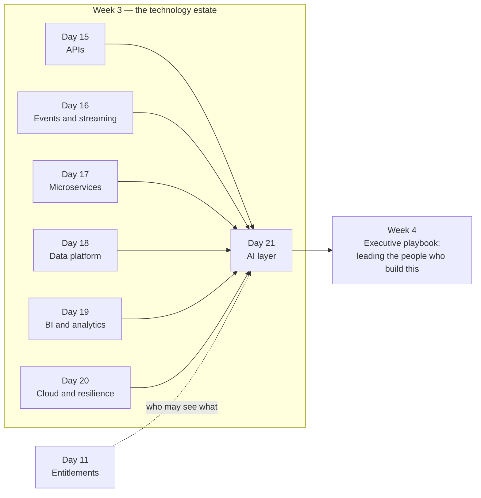
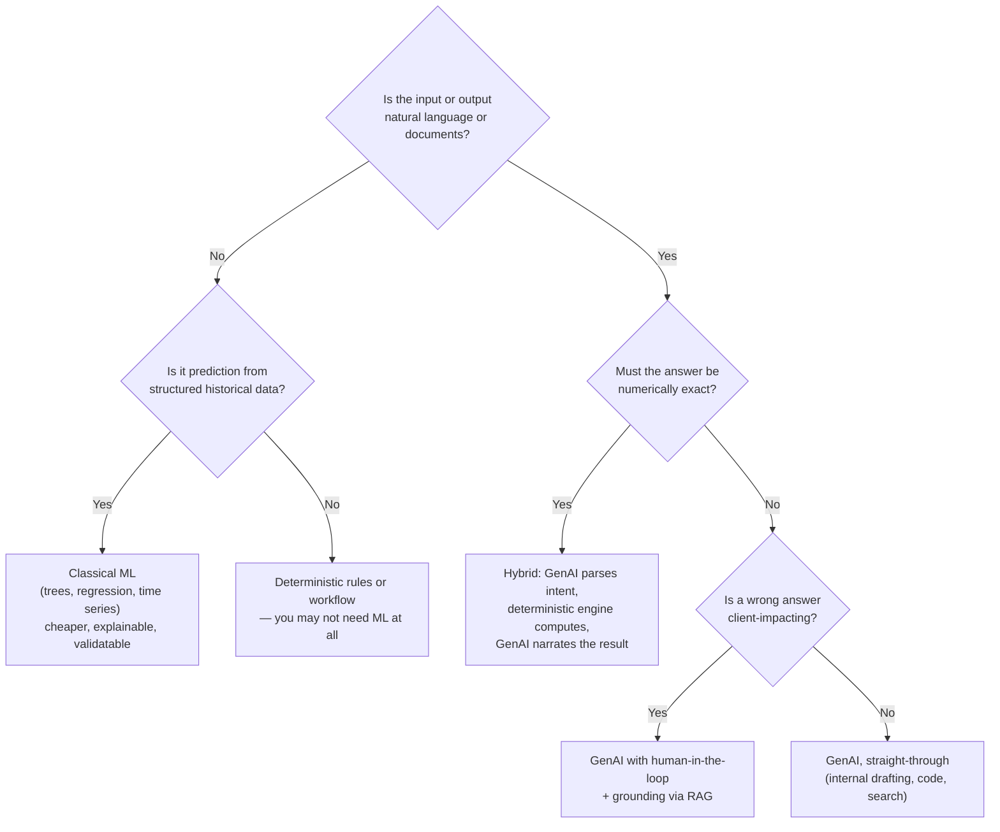
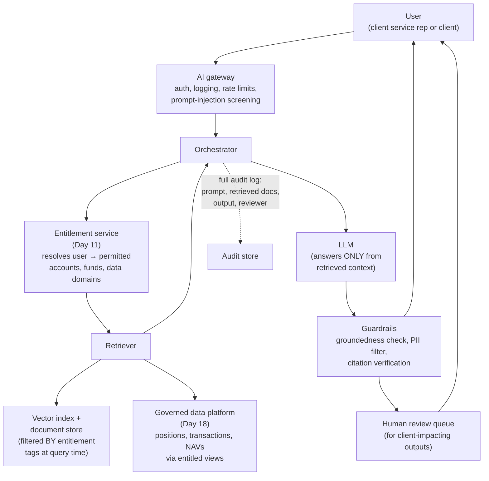
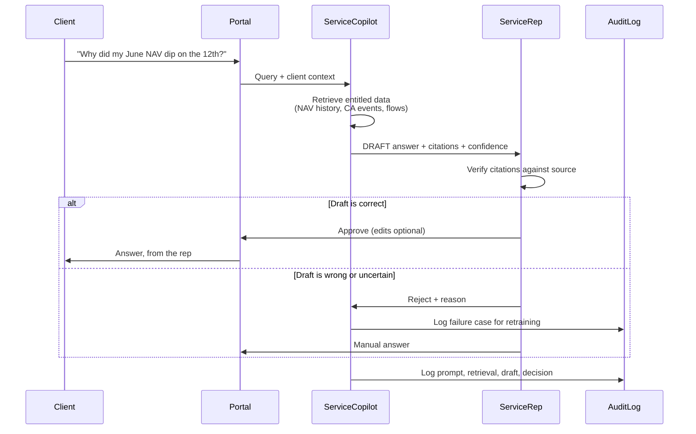
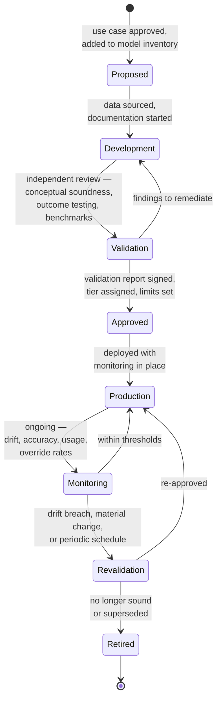
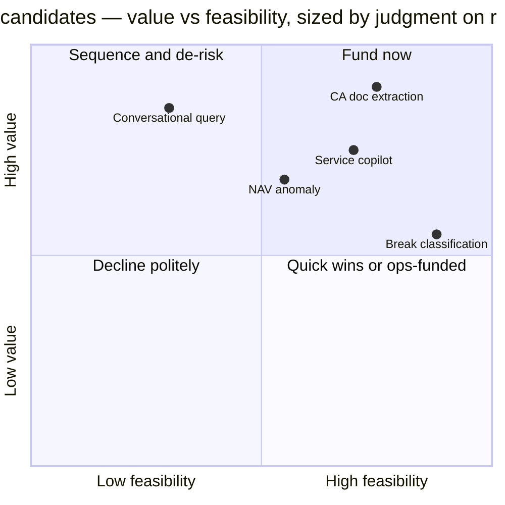
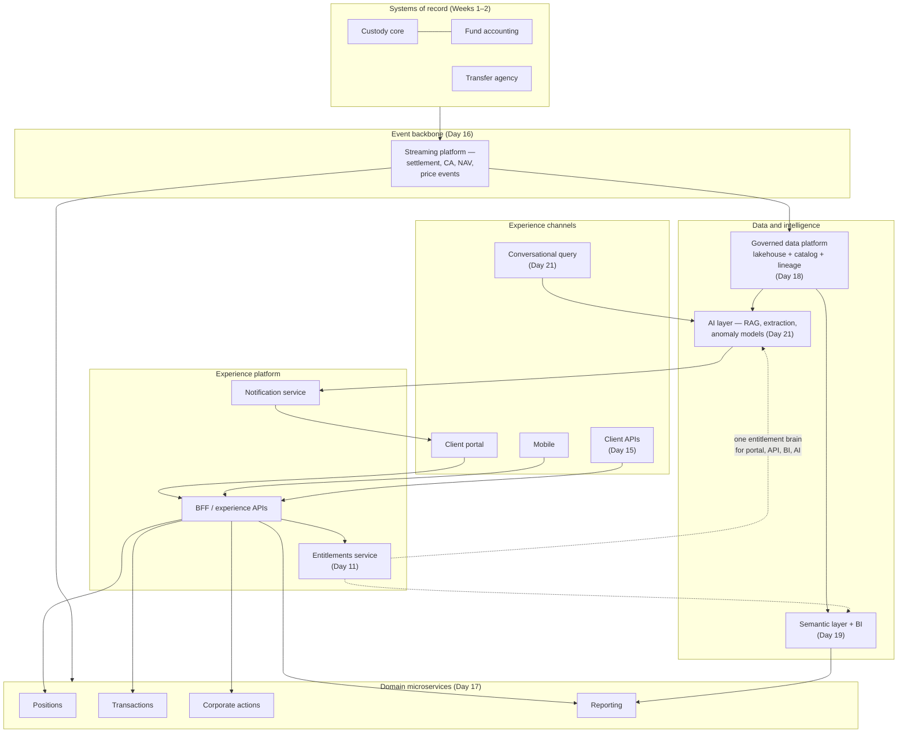

# Day 21 — AI in Financial Services + Week 3 Capstone

> Week 3 · Technology and Data · Est. reading time: 60–90 min

## 🎯 Learning objectives

By the end of today you can:

- Map the **realistic** AI use-case landscape for custody and asset servicing — and separate the seven use cases that actually pay back from the demo-ware.
- Choose honestly between **GenAI and classical ML** for a given problem, and defend the choice to both engineers and a model risk committee.
- Sketch the **RAG-over-entitled-data** architecture pattern and explain why entitlements (Day 11) and the data platform (Day 18) are its load-bearing walls.
- Explain **SR 11-7 model risk management** — inventory, validation, monitoring — and why a bank ships AI in quarters, not weeks, without that being an excuse.
- Score AI product candidates on **value / feasibility / risk** and run a defensible prioritization.
- Assemble everything from Week 3 — APIs, events, microservices, data platform, BI, AI — into **one target-state architecture** you can draw on a whiteboard from memory.

## 🧭 Where this fits

AI is the capstone of Week 3 because it is a *consumer of everything you built this week*: it needs the data platform's governed, lineage-tracked data (Day 18), the entitlements layer's answer to "who may see what" (Day 11), the event backbone to know when facts change (Day 16), and the API layer to act (Day 15). AI bolted onto a bank without those foundations is a liability generator. AI layered on top of them is the highest-leverage product surface you own.

---

## Part 1 — Core concepts

### 1.1 The realistic AI use-case map for custody and asset servicing

Strip away the conference-keynote fog and the use cases that matter in asset servicing share one shape: **large volumes of semi-structured information, processed by expensive expert humans, where errors are costly and detectable**. That shape appears in seven places:

| # | Use case | What the AI does | Who benefits | Classical ML or GenAI? |
|---|----------|------------------|--------------|------------------------|
| 1 | **Corporate action document extraction** | Reads CA announcements, prospectuses, offer documents; extracts terms (dates, ratios, options) into structured golden records | CA operations (Day 5) — today teams re-key from PDFs | GenAI (LLM extraction) with classical validation rules |
| 2 | **Reconciliation break classification** | Classifies breaks by probable root cause; suggests matches for near-miss pairs | Recs operations (Day 4) — 60–80% of breaks are recurring patterns | Classical ML (gradient-boosted trees) first; GenAI for narrative explanation |
| 3 | **NAV anomaly detection** | Flags NAV movements inconsistent with market moves, flows, and history before release | Fund accounting (Day 6) — catches the error before the client does | Classical ML (statistical / isolation forests) |
| 4 | **Cash forecasting** | Predicts intraday and next-day cash positions per account from settlement pipelines and history | Treasury, clients — reduces overdrafts and idle cash | Classical ML (time series) |
| 5 | **Client-service copilot** | Drafts responses to client queries, grounded in the client's actual account data and prior correspondence | Client service teams — cuts handling time on the ~70% of queries that are routine | GenAI (RAG) with human-in-the-loop |
| 6 | **Engineering code assistant** | Autocomplete, test generation, legacy code explanation (COBOL → docs) | Your engineering teams — 10–25% productivity lift, biggest on boilerplate and tests | GenAI (vendor tooling) |
| 7 | **Client-facing conversational query** | "What was my ex-US equity exposure at month-end?" answered over portfolio data in the portal | Clients — replaces report-hunting with questions | GenAI for language → query; **deterministic engine computes the numbers** |

Notice the pattern in the last column: **GenAI reads and writes language; classical ML and deterministic systems compute numbers**. A custodian that lets an LLM *calculate* a NAV or an exposure figure has misunderstood both technologies.

### 1.2 GenAI vs classical ML — the honest decision rule

Three honest observations a VP should internalize:

1. **Classical ML is often the right answer and the boring answer.** Break classification on 5 million historical labeled breaks is a textbook gradient-boosting problem: cheap to run, explainable enough for model validation, and it does not hallucinate. Do not let the GenAI budget cycle bully a tabular problem into an LLM.
2. **GenAI's genuine breakthrough is unstructured-to-structured.** Corporate action documents defeated classical NLP for 20 years because issuers write terms in free prose. LLM extraction with rule-based validation is the first approach that actually works at usable accuracy (~90–97% field-level, depending on document class).
3. **The hybrid pattern is the workhorse for anything numeric.** Conversational portfolio query = LLM translates the question into a governed query → the *analytics engine* (Day 19) computes the answer from entitled data → LLM phrases the response and cites the underlying report. The LLM never invents a number because it never generates one.

### 1.3 Why deploying AI at a bank takes longer than at a startup — and why that's partially correct

| Stage | Startup | Bank | Why the bank stage exists |
|-------|---------|------|---------------------------|
| Idea → prototype | 1 week | 2–6 weeks | Data access requires entitlement review; no production data in dev |
| Prototype → pilot | 2 weeks | 2–4 months | Model risk validation (SR 11-7), legal, compliance, vendor risk (if external LLM) |
| Pilot → production | 2 weeks | 3–6 months | Change management, ops training, monitoring build-out, client disclosure review |
| Total | ~5 weeks | ~6–12 months | — |

Some of that gap is legitimate control (a hallucinated corporate action deadline can cost a client millions and the bank the account); some is process theater you should attack. Your job as VP is to **shrink the theater without touching the controls**: pre-approved data sandboxes, a standing model-risk fast lane for low-tier use cases, reusable validated components (one validated RAG pipeline, many use cases).

---

## Part 2 — The system deep dive

### 2.1 RAG over entitled data — the architecture pattern that matters most

Retrieval-Augmented Generation (RAG) grounds an LLM's answer in retrieved documents or data rather than its training memory. In a custodian, the non-negotiable twist is that **retrieval must respect entitlements**: the copilot answering a client-service query about Fund A must be physically unable to retrieve Fund B's data — even if the user asks, even if the prompt is adversarial.

Design decisions inside this diagram that you, not the architects alone, must own:

- **Entitlement filtering happens at retrieval, not at generation.** If forbidden data ever reaches the LLM's context window, you have already lost — no prompt instruction reliably prevents leakage. The filter is a hard predicate on the retrieval query (`WHERE fund_id IN (:entitled_funds)`), reusing the *same* entitlement service the portal uses. One entitlement brain (Day 11), many consumers.
- **The vector index inherits data-platform governance.** Documents are chunked and embedded *with* their classification and entitlement tags from the catalog (Day 18). An untagged document does not get indexed. This is where weak data governance goes to die publicly.
- **Everything is logged for reconstruction.** When a client challenges an answer, you must reproduce: what was asked, what was retrieved, what the model said, who approved it. That log is also your model-monitoring feed.

### 2.2 Human-in-the-loop for client-impacting outputs

The economics: if the copilot drafts 70% of responses acceptably and review takes 20% of drafting-from-scratch time, a 100-rep client-service function gains roughly `0.70 × 0.80 = 56%` capacity on routine queries — which you take as *faster response SLAs and coverage of the long tail*, not headcount cuts, in year one. That framing is also how you get ops to adopt it (Day 22 foreshadowing: never surprise ops).

**Hallucination risk and mitigations, concretely.** In client-facing contexts the failure mode is not "the model is wrong," it is "the model is wrong *fluently and specifically*" — an invented ex-date, a fabricated fee clause. Mitigations, in order of effectiveness:

1. **Grounding + citation enforcement** — the answer must cite retrieved passages; a groundedness checker (a second model or NLI check) rejects unsupported claims before display.
2. **Scope fencing** — the system refuses questions outside its retrievable corpus ("I can answer about your holdings and reports") rather than improvising.
3. **Deterministic numbers** — every figure comes from the analytics engine, never generated (Section 1.2).
4. **Human-in-the-loop** for anything leaving the building (above).
5. **Confidence-based routing** — low-retrieval-score queries route straight to a human.
6. **Adversarial testing** — a standing red-team suite (prompt injection, entitlement-crossing attempts, date-mangling) run on every release.

### 2.3 Model risk management — SR 11-7 in practice

The Federal Reserve's SR 11-7 (Supervisory Guidance on Model Risk Management, 2011) predates GenAI but governs it: a "model" is any quantitative method producing estimates that inform decisions. Banks apply it through a lifecycle every model — including your copilot — must traverse:

What each stage means for your product timeline:

| Stage | Who owns it | Typical duration | Your lever as VP |
|-------|-------------|------------------|------------------|
| Inventory + tiering | Model risk management (2nd line) | 2–4 weeks | Propose the right tier honestly — internal drafting tools are lower tier than client-facing outputs |
| Independent validation | Validators who did NOT build it | 6 weeks–4 months by tier | Ship complete documentation *with* the model; validators' queue is your critical path |
| Monitoring design | You (1st line) + MRM | Built during development | Reuse one monitoring framework across models — drift metrics, override rate, groundedness score |
| Revalidation triggers | MRM policy | Annual/biennial or on change | Version prompts and retrieval corpora like code, so "material change" is detectable, not debatable |

For GenAI specifically, "validation" bends: you cannot inspect an LLM's weights, so validation shifts to **outcome testing on curated evaluation sets** (does extraction hit 95% on 1,000 held-out CA documents?), **guardrail testing**, and **monitoring drift in inputs and behavior** (document formats change; model versions change under you if you use a vendor API — pin versions contractually).

### 2.4 Build vs buy vs platform

| Dimension | Vendor copilot (buy) | Platform + your product (assemble) | Full in-house (build) |
|-----------|---------------------|-----------------------------------|----------------------|
| Examples | Vendor code assistant; CRM-embedded drafting | Cloud LLM APIs + your RAG, entitlements, UX | Self-hosted open-weights models, own pipelines |
| Time to value | Weeks | 1–2 quarters | 4+ quarters |
| Differentiation | None — competitors buy the same | **High — the moat is your data, entitlements, workflows** | High but expensive to maintain |
| Data risk | Vendor contract + data residency review | Controlled; data stays in your tenancy | Fully controlled |
| Right for | Use case 6 (code assistants), commodity productivity | Use cases 1, 5, 7 — client-touching, data-entangled | Rarely; only at extreme scale or data-sensitivity |

The strategic rule: **buy where the capability is commodity, assemble where your proprietary data and entitlements are the differentiator, build almost never.** A custodian's edge is not model quality — it is that the copilot sits on top of the servicing book of record with real entitlements. No vendor can replicate that without becoming you.

### 2.5 Regulatory temperature

- **EU AI Act (in force 2024, phased application through 2026–27):** risk-tiered — prohibited / high-risk / limited / minimal. Most custody use cases land in *limited or minimal risk* (internal tools, transparency-obliged chatbots); creditworthiness-style decisions would be high-risk, which is one more reason to keep AI away from *decisions* and pointed at *drafts and detection*. If you serve EU clients through EU entities, tiering documentation is on your compliance checklist.
- **US:** no AI-specific statute yet for banking; supervisors apply existing frameworks — SR 11-7 (models), third-party risk guidance (vendor LLMs), UDAP for anything misleading clients. The OCC and Fed have signaled that "we used AI" is never a defense; existing accountability holds.
- **Practical posture:** regulators reward *demonstrated control* — inventory, validation, monitoring, audit trails, human accountability. The architecture in 2.1–2.2 is not just good engineering; it is your examination evidence.

---

## Part 3 — The VP lens

### 3.1 The prioritization decision — worked example

You have budget for two AI initiatives in the next two quarters. Five candidates. Score each 1–5 on **value** (revenue protection, cost, client experience), **feasibility** (data readiness, integration effort, talent), and **risk drag** (model risk tier, client impact of errors, regulatory sensitivity — higher score = *less* risk). Weight: value 45%, feasibility 35%, risk 20%.

| Candidate | Value | Feasibility | Risk (inverse) | Weighted score | Notes |
|-----------|:-----:|:-----------:|:--------------:|:--------------:|-------|
| A. CA document extraction | 5 | 4 | 4 | **4.45** | Huge ops pain (Day 5); data (documents) available; internal HITL keeps tier low |
| B. Client-facing conversational query | 5 | 2 | 2 | 3.35 | Strategic but needs Day 18 semantic layer maturity + highest scrutiny — sequence it |
| C. Client-service copilot | 4 | 4 | 3 | **3.80** | Rides the same RAG pipeline as A; internal user = contained risk |
| D. NAV anomaly detection | 4 | 3 | 4 | 3.65 | Classical ML, cheap; but fund accounting owns the workflow — partner, don't lead |
| E. Recs break classification | 3 | 5 | 4 | 3.90 | Easiest win; consider funding from ops budget as a fast follower |

**Decision: fund A and C** — they share one validated RAG-with-entitlements pipeline (component reuse halves the second validation cycle), both have internal humans in the loop, and A attacks the single biggest manual-risk pocket in asset servicing. E proceeds as an ops-funded classical-ML fast follower. B is explicitly *sequenced, not rejected* — it becomes credible only after the semantic layer and the copilot's groundedness telemetry mature. Write that sequencing down; it is your answer when sales asks why the demo they saw at a conference isn't on the roadmap.

### 3.2 Decisions you own vs influence

| Decision | You | Others |
|----------|-----|--------|
| Which AI use cases enter the roadmap, in what order | **Own** | Input from ops, sales, architecture |
| RAG-entitlements pattern as the standard | **Own jointly** with chief architect | MRM validates |
| Model tier proposals and HITL design | **Own the proposal** | MRM decides tier |
| Vendor vs assemble per use case | **Own** | Procurement, vendor risk execute |
| LLM provider selection | Influence | CTO/architecture own |
| Client disclosure language for AI features | Influence | Legal/compliance own |

### 3.3 Questions to ask your teams this week

1. "Show me our model inventory entries for anything we're calling AI. If we can't, we have shadow models — a finding waiting to happen."
2. "In our copilot prototype, where exactly does entitlement filtering happen — retrieval or prompt? Prove it with a test where a rep asks about a fund they're not entitled to."
3. "What is our evaluation set for CA extraction, who curated it, and what's our current field-level accuracy by document type?"
4. "If the vendor upgrades the underlying model version tomorrow, what breaks, what re-triggers validation, and would we even know?"
5. "What's the override rate in the human-review queue, and is anyone reading the rejected drafts?" (An unread rejection log means you're not learning.)

**Metrics that tell you the truth:** field-level extraction accuracy by document class; copilot draft acceptance rate (target trajectory: 40% → 70%+); groundedness/citation-pass rate; entitlement-violation test pass rate (must be 100%, always); time-in-validation-queue; cost per query.

---

## 🏦 State Street context

*Representative and public-knowledge; verify specifics internally.*

- State Street has been publicly vocal about AI adoption — including generative AI partnerships for its Alpha platform and client-servicing workflows, and internal engineering copilots. The public posture emphasizes **augmentation of servicing professionals**, consistent with the HITL patterns above.
- **Alpha's front-to-back promise sharpens the AI opportunity**: because Alpha aspires to one data backbone from portfolio management through custody and accounting, AI grounded in that backbone can answer questions that span the whole chain — a structural advantage over point-solution fintechs, *if* the data platform (Day 18) delivers on lineage and entitlement tagging.
- As a **systemically important bank supervised by the Fed**, State Street's model risk function will apply SR 11-7 with full rigor. Expect a real Model Risk Management group, a real inventory, and real validation queues. Budget for it in every AI initiative's timeline; do not present plans that assume it away.
- The realistic State Street-shaped wins mirror the prioritization above: corporate actions and document-heavy asset classes (private markets documents in alternatives servicing are notoriously manual), client-service augmentation across its enormous servicing book, and — carefully sequenced — conversational access layered onto client reporting.
- Expect **firm-approved AI tooling and gateways** rather than direct public-API access from developer laptops; plan your team's workflow around the sanctioned path and lobby to make that path fast rather than routing around it.

---

## Week 3 Capstone — pulling the technology week together

### The master target-state architecture

Draw this from memory before your first architecture review. It is Week 3 on one page.

Narrate it in four sentences (your elevator version): *Systems of record publish facts as events. Domain services and the governed data platform consume them — one for serving, one for analytics and AI. Every channel — portal, mobile, API, conversational — goes through one experience layer and one entitlements brain. BI and AI sit on the same governed data, so a number in a dashboard, an API response, and a copilot answer never disagree.*

### Week 3 capstone quiz — 20 questions

Answer before opening the details block.

1. What are the three broad API styles you'd expose to institutional clients, and when does each fit?
2. Why do custodians favor event-driven integration between core systems and digital channels rather than direct database reads?
3. What is the difference between an event notification and event-carried state transfer?
4. Name two reasons to split a monolithic portal backend into domain microservices — and one reason not to.
5. What problem does a semantic layer solve that a data lake alone does not?
6. Define data lineage and give one regulatory reason a custodian must have it.
7. What is the medallion (bronze/silver/gold) pattern?
8. Why must entitlement filtering in a RAG system happen at retrieval time rather than via prompt instructions?
9. When is classical ML the better choice than GenAI? Give two concrete custody examples.
10. What is SR 11-7 and what three lifecycle obligations does it impose on any model?
11. Why does the conversational-query pattern route numeric computation to a deterministic engine?
12. List three hallucination mitigations in order of effectiveness for client-facing AI.
13. What does "human-in-the-loop" mean operationally in a client-service copilot, and what metric tells you it's working?
14. In build-vs-buy for AI, what should a custodian buy and what should it assemble? Why?
15. Under the EU AI Act's risk tiers, where do most custody digital-experience use cases fall?
16. What is model drift and name two monitoring signals for a GenAI extraction model.
17. Why is a shared entitlements service ("one entitlement brain") architecturally critical across portal, API, BI, and AI?
18. What is the single biggest data-platform prerequisite for trustworthy AI over client data?
19. In the prioritization worked example, why did the client-facing conversational query score high value but get sequenced later?
20. Give the four-sentence narration of the target-state architecture in your own words.

<strong>Answers</strong>

1. REST for request/response resource access (positions, transactions); webhooks/streaming (or AsyncAPI-described events) for pushed updates (settlement status); file/SFTP remains for bulk legacy delivery. GraphQL optionally for flexible experience-layer aggregation.
2. Cores are batch-oriented and fragile under ad-hoc query load; events decouple channel availability from core maintenance windows, give near-real-time propagation, and create one auditable integration contract instead of point-to-point spaghetti.
3. Notification: "something changed, here's the ID — come fetch." State transfer: the event carries the full changed state, so consumers need no callback. Notification keeps payloads small; state transfer decouples availability.
4. For: independent deployability/scaling of hot domains (positions vs documents); fault isolation; team autonomy. Against: distributed-systems complexity (consistency, tracing, ops maturity) — a modular monolith is often right until team scale forces the split.
5. Shared, governed business definitions (what "AUM" or "settled position" means) computed once — so every dashboard, API and AI answer uses identical logic; a lake alone stores data without agreeing on meaning.
6. Lineage = traceable path of a data element from source to consumption, including transformations. Regulators (e.g., BCBS 239 principles for risk data) and auditors require you to prove where a reported number came from.
7. Progressive refinement: bronze = raw immutable ingest, silver = cleansed/conformed, gold = business-ready curated marts. It separates reprocessing capability from consumption quality.
8. Once forbidden data is in the model's context window, no instruction reliably prevents leakage or influence; retrieval-time filtering is a hard, testable predicate — enforceable and auditable.
9. When the problem is prediction/classification over structured tabular history and answers must be explainable and cheap: recs break classification, NAV anomaly detection, cash forecasting.
10. Fed guidance on model risk management. Obligations: maintain a model inventory (with tiering), independent validation before use (conceptual soundness + outcome testing), ongoing monitoring with revalidation triggers.
11. LLMs generate plausible tokens, not verified arithmetic; a deterministic engine guarantees the number matches the governed source, and the LLM only phrases and cites it — eliminating numeric hallucination.
12. (1) Grounding with enforced citations plus a groundedness check; (2) scope fencing to the retrievable corpus; (3) deterministic numbers; then HITL review and confidence-based routing to humans.
13. Every client-bound draft is reviewed, editable, and approvable by a human who owns the send; the audit log captures draft vs final. Key metric: draft acceptance rate (and whether rejected drafts feed improvement).
14. Buy commodity productivity (code assistants, embedded office copilots); assemble client-touching use cases on your own data — the differentiation is your entitled servicing data and workflows, which no vendor has.
15. Mostly limited/minimal risk (internal tools; transparency-obliged assistants). High-risk categories (e.g., creditworthiness) are largely avoidable in digital-experience scope — one reason to keep AI on drafts and detection, not decisions.
16. Drift = input data or model behavior shifting from validated conditions. Signals: field-level accuracy on a rolling labeled sample; input distribution shifts (new document formats); groundedness/citation pass rate; human override rate.
17. It guarantees one consistent answer to "who may see what" everywhere; divergent entitlement logic across channels is both a security incident and a client-trust incident waiting to happen, and it makes every new channel cheaper to add.
18. Governed, lineage-tracked, entitlement-tagged data in the catalog — untagged or untraceable data can't safely be retrieved, cited, or defended to a client or examiner.
19. Its feasibility and risk scores were poor *today*: it depends on a mature semantic layer and proven groundedness telemetry, and errors land directly on clients. Sequencing preserves the ambition while building the prerequisites.
20. (Model answer) Cores publish events; services and the governed data platform consume them; all channels share one experience layer and one entitlements brain; BI and AI sit on the same governed data so no two surfaces ever disagree on a number.

### Week 3 self-assessment rubric

Score yourself 1–4 per row. Below 3 on any row: revisit that day before starting Week 4.

| Capability | 1 — Aware | 2 — Conversant | 3 — Fluent | 4 — Can lead |
|------------|-----------|----------------|------------|--------------|
| APIs (Day 15) | Knows REST exists | Can read an API spec | Can critique the client API surface | Can set API product strategy and versioning policy |
| Events (Day 16) | Knows "event-driven" | Can explain pub/sub | Can whiteboard the settlement-event flow | Can arbitrate event contract disputes between teams |
| Microservices (Day 17) | Knows the term | Can name trade-offs | Can judge a decomposition proposal | Can decide monolith-vs-split with a straight face |
| Data platform (Day 18) | Knows lake vs warehouse | Can explain medallion + catalog | Can trace lineage of a portal number | Can prioritize governance investment vs features |
| BI (Day 19) | Reads dashboards | Can spec a dashboard | Enforces one-chart-one-message and a semantic layer | Can run the metrics layer as a product |
| Cloud/resilience (Day 20) | Knows regions/AZs | Can explain RTO/RPO | Can challenge a DR test plan | Can own the resilience story to a regulator-facing forum |
| AI (Day 21) | Knows GenAI vs ML | Can explain RAG + SR 11-7 | Can score and sequence use cases | Can defend the AI roadmap to MRM, sales, and clients |

---

## 💪 Exercises

1. **Redraw the master architecture from memory** on paper, then diff it against the capstone diagram. Anything you forgot is the thing you'll fumble in a real review — study that component's day again.
2. **Write the model-risk one-pager** for the client-service copilot: proposed tier and why, evaluation-set design, monitoring metrics, HITL controls, revalidation triggers. One page. This is the artifact that makes MRM your ally instead of your queue.
3. **Run the prioritization yourself with different weights** (value 30 / feasibility 30 / risk 40 — a conservative bank's weighting). Does the funding decision change? Write three sentences on what that teaches you about how weight-setting *is* the decision.

## ❓ Self-check quiz

1. Which two funded use cases in the worked example share infrastructure, and what is that shared component?
2. What single test must pass at 100%, always, in an entitled RAG system?
3. Name the three SR 11-7 pillars.
4. Why is "buy the model, assemble the product" the default AI posture for a custodian?
5. What is the correct division of labor between the LLM and the analytics engine in conversational portfolio query?

<strong>Answers</strong>

1. CA document extraction and the client-service copilot — both ride one validated RAG-with-entitlements pipeline, so the second use case inherits most of the first's validation work.
2. The entitlement-violation test: a user must never retrieve (and therefore never see influence from) data outside their entitlements — tested adversarially on every release.
3. Model inventory with tiering; independent validation; ongoing monitoring with defined revalidation triggers.
4. Model capability is a commodity available to all competitors; the custodian's unique asset is entitled proprietary servicing data and workflows — differentiation lives in the assembly, not the model.
5. The LLM translates natural language to a governed query and phrases the cited answer; the deterministic analytics engine computes every number from entitled data. The LLM never generates a numeric value.

## 🔑 Key takeaways

- The seven real AI use cases in asset servicing share one shape: **high-volume semi-structured information handled by expensive experts, with costly but detectable errors**.
- **GenAI handles language; classical ML and deterministic engines handle numbers.** The hybrid pattern is the workhorse for anything client-facing and numeric.
- **RAG over entitled data** is the architecture that matters: entitlement filtering at retrieval, governance-tagged indexing, full audit logging — reusing Day 11's entitlement brain and Day 18's catalog.
- **SR 11-7 is your operating reality**: inventory, independent validation, monitoring. Shrink the process theater around it; never the controls themselves.
- Human-in-the-loop is not a compliance tax — it is the adoption mechanism, the training-data flywheel, and your accountability story in one.
- Prioritize AI on **value × feasibility × risk with component reuse in mind**: two use cases on one validated pipeline beat three bespoke pilots.
- Your moat is not the model. It is governed, entitled data plus workflow ownership — which is exactly what Weeks 1–3 built.

## 📚 Going deeper

- Federal Reserve SR 11-7, *Supervisory Guidance on Model Risk Management* (public, federalreserve.gov).
- EU AI Act — official summary and risk-tier overview (artificialintelligenceact.eu; EUR-Lex full text).
- NIST *AI Risk Management Framework* (nist.gov) — the vocabulary US supervisors increasingly borrow.
- Chip Huyen, *Designing Machine Learning Systems* — the production-ML mindset, highly readable.
- FINOS (Fintech Open Source Foundation) AI governance materials — bank-practitioner-grade patterns.
- Your firm's model risk policy — read the actual tiering criteria before proposing anything.

## Tomorrow

Week 3 gave you the systems; Week 4 gives you the seat. Tomorrow: **your first 90 days** — who to meet, what to ask, which quick wins buy you the credibility to change anything at all.
