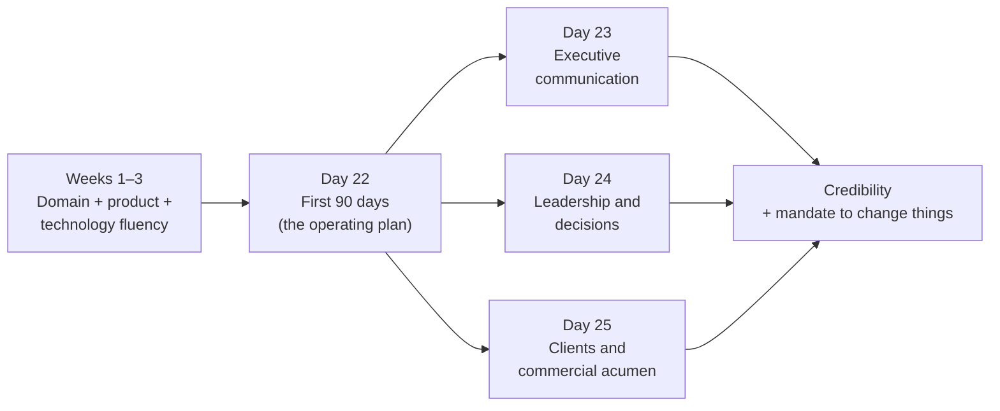
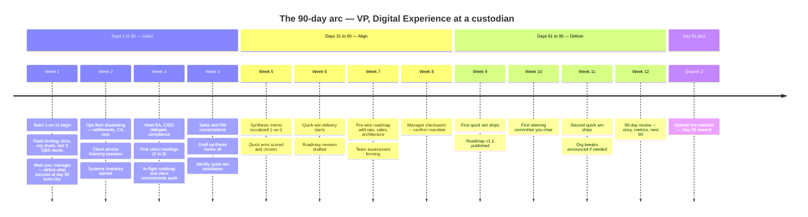
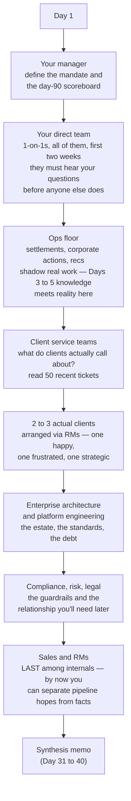
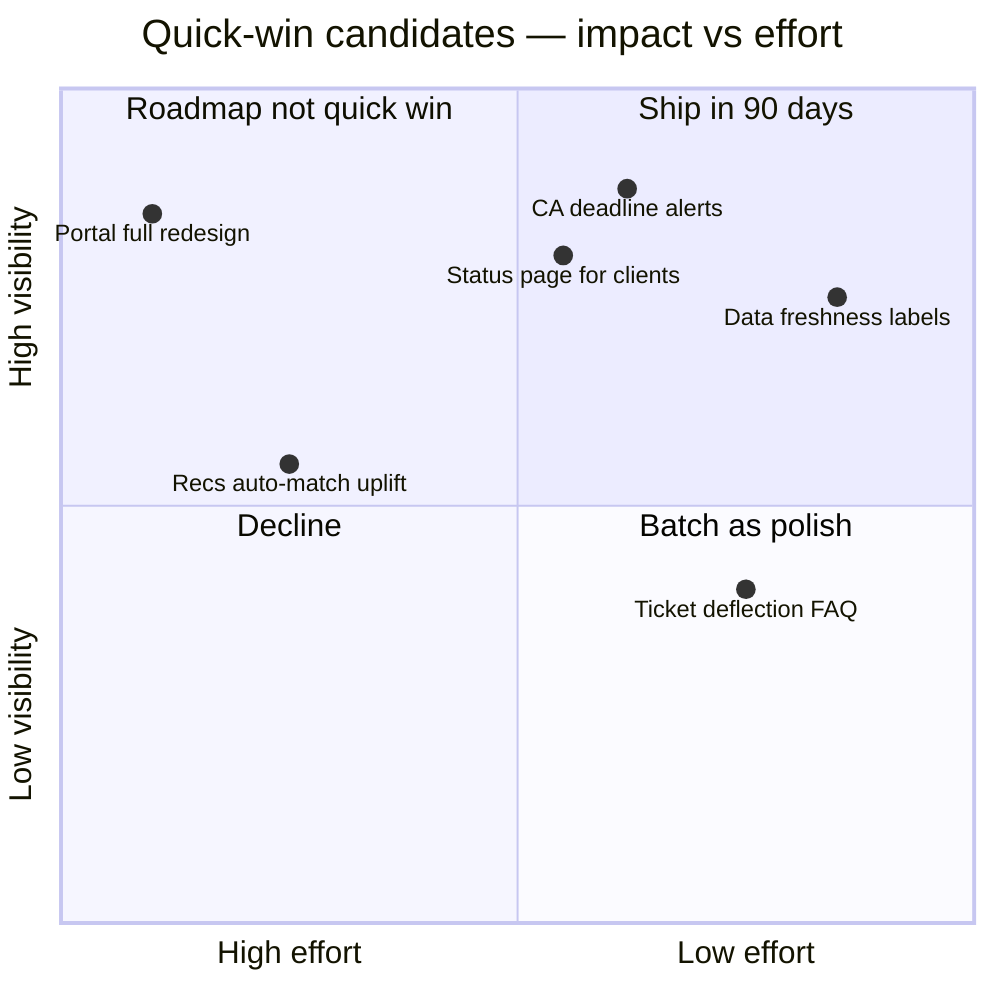
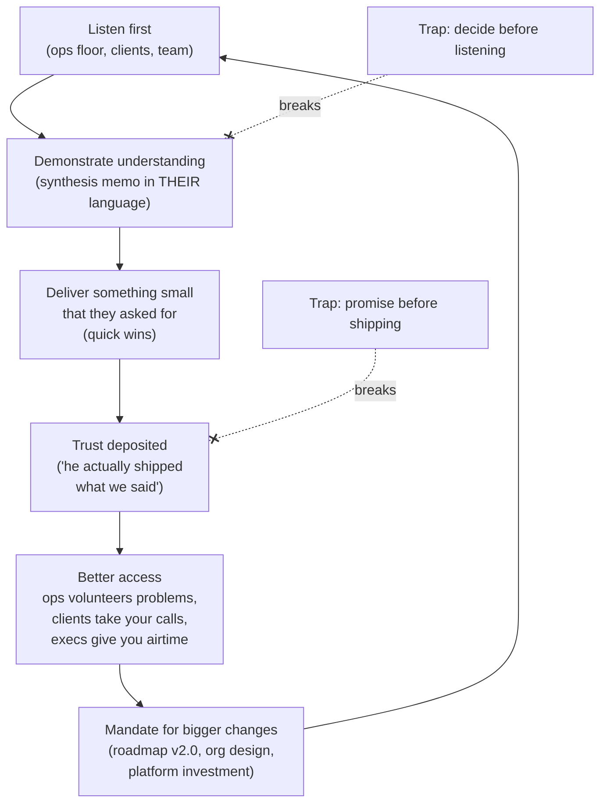

# Day 22 — Your First 90 Days

> Week 4 · Executive Playbook · Est. reading time: 60–90 min

## 🎯 Learning objectives

By the end of today you can:

- Run a **30/60/90 arc** — learn → align → deliver — tailored to a VP of Digital Experience product at a custodian, not a generic template.
- Sequence a **listening tour** across your team, the ops floor, client service, actual clients, enterprise architecture, and compliance — and arrive at each meeting with genuinely good questions.
- Build a **map of the estate** you inherited: systems, in-flight roadmap, and — critically — the commitments already made to clients (the landmines).
- Select **quick wins** against explicit criteria and name five candidates drawn from earlier chapters.
- Avoid the four traps that quietly end VP tenures: rebuilding too fast, over-promising to sales, ignoring ops, and mistaking activity for credibility.
- Execute against a **printable week-by-week checklist**.

## 🧭 Where this fits

Weeks 1–3 built your domain and technology fluency; Week 4 is about wielding it from the VP seat. Day 22 is deliberately first: everything else in this week — communication (Day 23), leadership (Day 24), clients (Day 25), metrics (Day 26) — gets deployed *through* the 90-day plan. The first 90 days are disproportionately weighted: they set the narrative others tell about you when you're not in the room, and narratives, once set, are expensive to change.

---

## Part 1 — Core concepts

### 1.1 The 30/60/90 arc — and why the order is non-negotiable

| Phase | Days | Theme | Dominant activity | Failure mode if skipped |
|-------|------|-------|-------------------|-------------------------|
| **Learn** | 1–30 | Listening tour + estate mapping | Asking, reading, shadowing; almost no deciding | You optimize a system you don't understand; ops writes you off as "another portal person" |
| **Align** | 31–60 | Form and socialize a point of view | Synthesis memo, quick-win selection, stakeholder pre-wiring | Your first proposal ambushes people; allies you never recruited become blockers |
| **Deliver** | 61–90 | First visible outcomes + first structural moves | Quick wins land, roadmap v1.1, first steering committee, team assessment concluded | You're 90 days in with only opinions — "smart, but what has he shipped?" |

The discipline that separates strong VP starts from weak ones is **resisting the urge to decide during the Learn phase**. You will spot obvious problems in week one. Write them down; do not fix them yet. Half of your week-one "obvious problems" will turn out to have reasons — usually a client contract, a regulation, or a body buried in the fund-accounting close cycle.

### 1.2 The listening tour — who, in what order, and why that order

The order encodes strategy:

- **Team first** — they are your instrument; hearing their unvarnished view before others color it is a one-time-only opportunity, and being visibly listened to is your first retention act.
- **Ops before clients** — walking onto a client call without knowing why their CA notifications are late is malpractice. Ops also decides, quietly, whether you succeed; going to them *first* signals respect no slide deck can.
- **Sales last among internal groups** — not because they matter least, but because sales conversations are persuasion-shaped. You want your own picture formed first, so you can hear their asks as inputs rather than instructions.
- **Compliance in the Learn phase, not when you need a favor** — a compliance officer met in week 3 over coffee is a different resource than one met in week 9 over an escalation.

### 1.3 The question bank — 40+ questions that earn respect

Good questions do two jobs at once: they extract truth and they signal what kind of leader you are. Organized by audience:

**Your manager (5)**

1. "What must be visibly different about digital experience in 12 months for you to call this hire a success?"
2. "What did my predecessor do well that I should keep — and what was the actual reason for the transition?"
3. "Which commitments to clients or executives am I inheriting that you consider at risk?"
4. "Where do you want me to spend political capital, and where should I conserve it?"
5. "Who, above and beside you, do I need to win over — and who will test me early?"

**Your team (8)**

6. "What are you proudest of shipping here, and what did it take that outsiders never saw?"
7. "What have we promised — to clients or execs — that you privately doubt we can deliver?"
8. "If you had my job for a quarter, what's the first thing you'd change?"
9. "What does our team believe that the rest of the organization doesn't?"
10. "Where do you lose the most time to things that shouldn't be hard?"
11. "Which decision has been stuck the longest, and what is it waiting on?"
12. "What do you want from me in the first 90 days — and what should I *not* do?"
13. "Who on this team is underestimated by the org?"

**Ops floor — settlements, CA, recs (8)**

14. "Walk me through yesterday's worst break. Where did the portal or our tooling help — or make it worse?"
15. "What information do clients ask you for that they should be able to self-serve?"
16. "When digital ships something, how do you find out — before or after clients do?"
17. "What's the most dangerous manual step in your day?" (Day 5's re-keying of CA terms will come up.)
18. "Which client causes the most manual work, and is it their behavior or our product?"
19. "What do you double-check *even though* a system already checked it? Why?"
20. "If our portal disappeared tomorrow, what would clients miss first — and what would they never notice?"
21. "What did the last digital initiative get wrong about how your work actually flows?"

**Client service (6)**

22. "Of your last 100 tickets, how many were 'where is my data / report / status' questions?"
23. "What do you have to log into more than three systems to answer?"
24. "Which answers do you give with low confidence because the data conflicts across systems?" (Day 18's consistency problem, live.)
25. "When clients complain about the portal, what exact words do they use?"
26. "What workaround have you built that product doesn't know about?"
27. "If you could give clients one honest label or disclaimer in the portal, what would it say?"

**Clients — 2 to 3, via RMs (7)**

28. "Walk me through the first hour of your operations day. Where do we appear in it — and where do we slow it down?"
29. "What do you download from us only to rebuild in Excel?"
30. "Which of our numbers do you re-check against your own systems before trusting? Why?"
31. "What has a competitor or fintech shown you that made you wonder why we don't do it?"
32. "When something goes wrong, how do you *want* to hear about it — and how do you hear about it today?"
33. "If our digital tools got 10x better, would it change how much business you do with us — honestly?"
34. "What's the one commitment we made in the sales cycle that you're still waiting on?"

**Enterprise architecture and engineering (6)**

35. "What's the oldest system a portal page depends on, and what happens the day it breaks?"
36. "Where is the roadmap writing checks the platform can't cash?"
37. "What technical debt keeps you up — and what would you *not* fix even with budget, and why?"
38. "What's the real change-lead-time from merged code to production for our client-facing stack?"
39. "Which standard do teams route around most, and is that a team problem or a standard problem?"
40. "If you had one quarter of my roadmap capacity for pure platform work, where would it go?"

**Compliance, risk, legal (4)**

41. "What's the fastest a client-facing change has gone through review here — and what made it fast?"
42. "Where has digital created findings or near-misses in the past two years?"
43. "What do product teams do that makes your job harder than it needs to be?"
44. "What's coming on the regulatory horizon that should already be shaping my roadmap?" (DORA-style operational resilience, T+1 aftershocks, AI guidance — Days 12 and 21.)

### 1.4 Mapping the estate — systems, roadmap, landmines

Three inventories to complete by day 30, each a simple table you maintain personally:

| Inventory | Contents | Where the bodies are |
|-----------|----------|---------------------|
| **Systems** | Every client-facing surface + its backing systems, owners, age, change lead time, incident history | The portal page everyone fears touching; the report built on a retiring system |
| **Roadmap in flight** | Every initiative: sponsor, status, promised date, who's heard the promise | Zombie projects nobody will kill; two teams building the same thing |
| **Client commitments** | Everything promised in RFPs, QBRs, escalation resolutions, side letters — with dates | The RFP that promised "real-time data" nobody scoped; the top-10 client told "Q3" for something not yet staffed |

The third inventory is the one incoming VPs skip and regret. **Commitments made to clients are your debts now** — you inherited them the moment you signed. Ask sales, RMs, and client service separately (their lists will not match — the deltas are the most dangerous items), and ask your manager which commitments the *executive layer* has echoed to client executives, because those cannot quietly slip.

---

## Part 2 — The system deep dive

### 2.1 Days 31–60: forming a point of view

**The synthesis memo.** Around day 35, write 3–5 pages, structured exactly like this (pyramid principle — full treatment tomorrow):

1. **What I found** — five findings, each one sentence + three lines of evidence. Findings, not opinions: "Clients re-verify our CA deadline data against SWIFT because our portal shows stale event states (heard from 3 of 3 clients, confirmed on ops floor)."
2. **What I believe** — the three bets that follow. E.g., "Our differentiation opportunity is operational transparency, not visual redesign."
3. **What I'll do in 90 days** — quick wins with dates.
4. **What I'll propose for the year** — direction, not yet a committed roadmap.
5. **What I need** — decisions, access, or air cover from the reader.

Socialize it **1-on-1 before any group setting** — ops leadership first (they gave you the material; let them correct you privately), then architecture, then sales, then your manager's peers. Every private pass converts a potential public objector into a co-author. This *is* pre-wiring (Day 23), practiced on your first artifact.

**Quick-win selection criteria.** A quick win qualifies only if it is ALL four of:

- **Visible** — clients or senior stakeholders will actually notice;
- **Low-risk** — no core-system change, no model validation queue, no client-contract implications;
- **< 90 days** — shippable inside your window with the team as it stands;
- **Dual-credibility** — earns trust with ops *and* clients, not just one.

**Five worked quick-win candidates** (all rooted in earlier chapters):

| Quick win | From | Why it qualifies | 90-day scope |
|-----------|------|------------------|--------------|
| 1. CA deadline alerts | Day 5 | Ops's scariest deadline risk becomes a client-visible notification; pure experience-layer build on existing events | Configurable email/portal alerts N days before election deadlines, for voluntary events |
| 2. Fix data-freshness labeling | Days 18–19 | Clients distrust numbers with no as-of context; honest labels ("as of 18:00 ET, post-settlement batch") cost days, buy years of trust | As-of timestamps + freshness badges on top 10 portal screens |
| 3. Client-facing service status page | Day 20 | Every incident today generates 200 "is it down?" calls to client service | Status page + subscription, wired to existing incident process |
| 4. Query-deflection content | CS listening | The top 20 "where is my…" tickets become in-context portal answers | Contextual help on the 5 highest-ticket screens |
| 5. Report-delivery notifications | Day 19 | Clients poll for reports; ops fields "where is it?" calls | Event-triggered "your report is ready" with deep link |

Note what's *absent*: nothing touching NAV calculation, entitlements logic, or core data pipelines. Quick wins live at the experience layer on top of stable plumbing. That is not timidity — it is sequencing.

### 2.2 Days 61–90: delivering and aligning

**Roadmap revision v1.1 — not v2.0.** Your first roadmap move is an *edit*, not a rewrite: kill or pause the two weakest in-flight items (with reasons stated in the synthesis memo's language), add your quick wins, and re-date anything you found to be fictional. A full re-plan in month 3 signals arrogance and destabilizes teams mid-delivery; save the structural re-plan for the annual cycle, armed with two quarters of credibility.

**Your first steering committee.** Chair it around week 10. Agenda discipline (previewing Day 23): one page pre-read sent 48 hours ahead; 10 minutes status by exception (only what changed, only what's at risk); 30 minutes on the *two decisions you need*; decisions logged with owner and date. The meeting's real function is to demonstrate that forums you run produce decisions, not updates.

**Team assessment and org tweaks.** By day 75 you owe your manager a private view of the team: keep/grow/coach/exit per direct report, with evidence beyond first impressions (Day 24 covers the frameworks). Make at most *one* structural move in the first 90 days, and only if it is obvious and widely expected — e.g., the vacant role everyone is silently covering. Early re-orgs read as ego; a single surgical fix reads as judgment.

### 2.3 The credibility flywheel

The flywheel's cruel property: it only spins forward from *listen*. Leaders who start at "bigger changes" — the month-one re-platform announcement — borrow credibility they haven't earned, and the loan gets called at the first slipped date.

### 2.4 The four traps

| Trap | What it looks like | Why it's tempting | The counter-move |
|------|-------------------|-------------------|------------------|
| **Rebuilding too fast** | "This portal needs a ground-up rewrite" in week 3 | Rewrites are legible achievements; legacy is ugly | Weeks of archaeology first — most "bad" systems encode invisible constraints (Day 14's modernization lesson: strangle, don't detonate) |
| **Over-promising to sales** | Agreeing to demo-ware dates in an RFP to be a team player | Sales pressure is immediate and personal; delivery pain is deferred | Give sales *better answers*, not earlier dates (Day 25); one broken client promise costs more than five awkward RFPs |
| **Ignoring ops** | Treating digital as a client-and-design conversation | Clients and design are more glamorous than the recs floor | Ops is your data source, your early-warning system, and your veto-holder; the flywheel starts there |
| **Activity ≠ credibility** | 60 meetings, 3 decks, 0 shipped changes at day 90 | Meetings feel like progress and are individually defensible | The day-90 review asks one question: *what is different because you arrived?* Work backward from that answer |

---

## Part 3 — The VP lens

### 3.1 Decisions you must make (and when)

| Decision | Deadline | Input needed | Reversible? |
|----------|----------|--------------|-------------|
| Day-90 success definition agreed with manager | Day 7 | Manager's honest scoreboard | Yes — revisit at day 45 |
| Which 2–3 quick wins to fund | Day 40 | Listening tour + criteria scoring | Yes (that's the point of quick wins) |
| Which in-flight items to pause or kill | Day 55 | Roadmap inventory, sponsor conversations | Partially — pre-wire the sponsors |
| Whether to make the one org fix | Day 75 | Team assessment, HR partner | No — treat as one-way door (Day 24) |
| Roadmap v1.1 publication | Day 65 | Synthesis memo socialized | Yes, but publish dates conservatively |

### 3.2 Your day-90 scoreboard — define it in week 1

A credible day-90 review contains: **2 shipped quick wins** (with usage numbers, however small), **1 synthesis memo** that ops and architecture both endorse, **1 revised roadmap** with two honest kills, **1 steering committee** that produced logged decisions, **1 team assessment** delivered privately, and **0 surprised stakeholders**. That last zero is the hardest and the most watched.

### 3.3 Printable 90-day checklist

| Week | Learn / Align / Deliver | Key actions | Output due |
|------|------------------------|-------------|------------|
| 1 | Learn | Manager contract on day-90 success; begin team 1-on-1s; read last 3 QBRs, org chart, strategy docs, incident history | Success definition (written) |
| 2 | Learn | Finish team 1-on-1s; ops floor shadowing (settlements, CA, recs); start systems inventory | Team themes note (private) |
| 3 | Learn | Client service sessions + 50-ticket read; meet EA, compliance, risk; start commitments inventory | Systems inventory v1 |
| 4 | Learn | 2–3 client meetings via RMs; sales/RM conversations; roadmap-in-flight audit | Commitments inventory ("landmines list") |
| 5 | Align | Draft synthesis memo; score quick-win candidates against 4 criteria | Synthesis memo v1 |
| 6 | Align | Socialize memo 1-on-1: ops → architecture → sales → peers; commit quick-win scope with teams | Quick wins funded (2–3) |
| 7 | Align | Pre-wire roadmap edits with sponsors of paused items; begin team assessment evidence file | Roadmap v1.1 draft |
| 8 | Align | Manager checkpoint: memo, quick-win status, proposed kills; adjust | Manager sign-off on direction |
| 9 | Deliver | Ship quick win #1; publish roadmap v1.1; announce with reasons, not just changes | Quick win #1 live |
| 10 | Deliver | Chair first steering committee (pre-read, decisions, log); client follow-ups: "you said X, we did Y" | Decision log exists |
| 11 | Deliver | Ship quick win #2; conclude team assessment; execute the one org fix if warranted | Quick win #2 live; team memo to manager |
| 12 | Deliver | Write day-90 review: what's different, what's next 90; present to manager and team | Day-90 review + Q2 plan |

---

## 🏦 State Street context

*Representative and public-knowledge; verify specifics internally.*

- **Scale changes the tour, not the logic.** State Street operates across dozens of countries with major operations hubs (e.g., in Poland, India, and China) alongside Boston headquarters. Your "ops floor" is partly a video call across time zones — budget deliberate travel or virtual shadowing for at least one major hub in the first 60 days; the offshore ops reality is where much of the servicing work actually happens.
- **Alpha reshapes who counts as a stakeholder.** Because State Street Alpha spans front-to-back (Charles River front office through custody and accounting), your digital-experience decisions touch a platform P&L with its own leadership. Add the Alpha platform organization to your listening tour explicitly; digital experience that ignores the front-to-back narrative will fight the firm's own strategy.
- **Client commitments run deep at a custodian this size.** Mandates are won through multi-hundred-page RFPs and multi-year onboarding programs; commitments inventory items may live in documents years old. RMs for your top clients will know; ask them directly for "anything digital we've promised in writing."
- **The matrix is real.** Expect your outcomes to depend on technology teams, ops teams, and client-facing teams who do not report to you. The listening-tour order above doubles as your influence map — at a firm like State Street, the VP who wins is usually the one whose *peers in ops and technology* advocate for their roadmap in rooms they're not in.
- **Regulatory posture shapes pace.** As a G-SIB, State Street's change-governance, client-communication reviews, and resilience requirements (Day 12, Day 20) apply to even your quick wins — a "simple status page" still passes through review. Build those lead times into the week-by-week plan rather than discovering them in week 9.

---

## 💪 Exercises

1. **Write your day-7 manager contract.** Draft the five questions you'll ask your manager (start from the bank above, tailor them), and draft what *you think* the day-90 success definition should be — so the meeting negotiates from your text, not a blank page.
2. **Pre-build the landmines table.** Create the three-column commitments inventory (commitment / who heard it / risk level) and fill the first five rows with hypotheticals from this book — e.g., "real-time positions promised in an RFP" (Day 15), "CA election digitization by Q3" (Day 5). Rehearse how you'd verify each in week 3.
3. **Stress-test a quick win.** Take "data-freshness labeling" and write the one-paragraph pitch to three audiences: ops ("fewer 'is this right?' calls"), a client ("you'll always know how fresh a number is"), and your manager ("trust repair that ships in six weeks"). If any paragraph feels thin, the win isn't as dual-credibility as it looked.

## ❓ Self-check quiz

1. Why does the listening tour put ops before clients, and sales last among internal groups?
2. Name the four quick-win criteria and explain why "dual-credibility" is on the list.
3. What are the three estate inventories, and which one do new VPs most often skip?
4. Why is your first roadmap move an edit (v1.1) rather than a rewrite (v2.0)?
5. What breaks the credibility flywheel at its two weak joints?

<strong>Answers</strong>

1. Ops knowledge is a prerequisite for credible client conversations, and going to ops first signals respect to your most important internal constituency; sales comes last so your own fact-base is formed before hearing persuasion-shaped input.
2. Visible, low-risk, under 90 days, dual-credibility (ops AND clients). Dual-credibility matters because a win that delights clients while creating ops work (or vice versa) spends trust with one constituency to buy it from another — a net-zero trade in a matrix organization.
3. Systems inventory, roadmap-in-flight inventory, client-commitments inventory. The commitments inventory ("landmines list") is the skipped one — and the most dangerous, because inherited promises have owners with memories and dates.
4. A rewrite in month 3 is built on 90 days of context against everyone else's years, destabilizes in-flight delivery, and signals arrogance; an edit with two honest kills plus your quick wins demonstrates judgment while conserving capital for the annual re-plan.
5. Deciding before listening breaks the link from listening to demonstrated understanding; promising before shipping breaks the link from delivery to trust. Both are loans against credibility not yet earned.

## 🔑 Key takeaways

- The 90-day arc is **learn → align → deliver, in that order** — every failure pattern is a phase run out of sequence.
- The listening tour's *order* is strategy: team first, ops before clients, sales last, compliance early as a relationship not a favor.
- Great questions do double duty — they extract truth and signal your leadership; prepare them per audience.
- The **client-commitments inventory** is the inheritance nobody hands you; build it yourself from RMs, sales, and client service, and reconcile the deltas.
- Quick wins must be visible, low-risk, sub-90-days, and credible with **both** ops and clients — experience-layer moves on stable plumbing.
- First roadmap = v1.1 with two honest kills. First org move = at most one, only if obvious. First steering committee = decisions, logged.
- At day 90 the only question is: **what is different because you arrived, and who says so besides you?**

## 📚 Going deeper

- Michael Watkins, *The First 90 Days* — the canonical transition playbook; read the STARS model chapter especially.
- Patrick Lencioni, *The Five Dysfunctions of a Team* — for reading the team you inherit.
- Andrew Grove, *High Output Management* — the manager-as-leverage lens you'll use in Day 24.
- Public State Street investor-day materials and annual reports — the strategy language your synthesis memo should echo.
- Your predecessor's last two QBR decks and the most recent client-satisfaction survey — the two most underrated onboarding documents in existence.

## Tomorrow

You now have a plan; Day 23 gives you the voice — the pyramid principle, one-page memos, pre-wired decisions, and how to tell a steering committee bad news so well they trust you more afterward.
