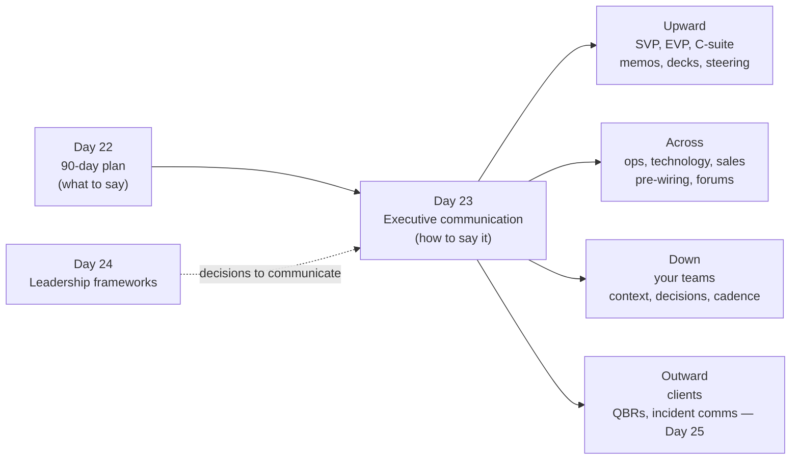
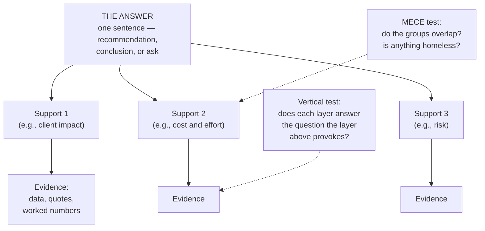
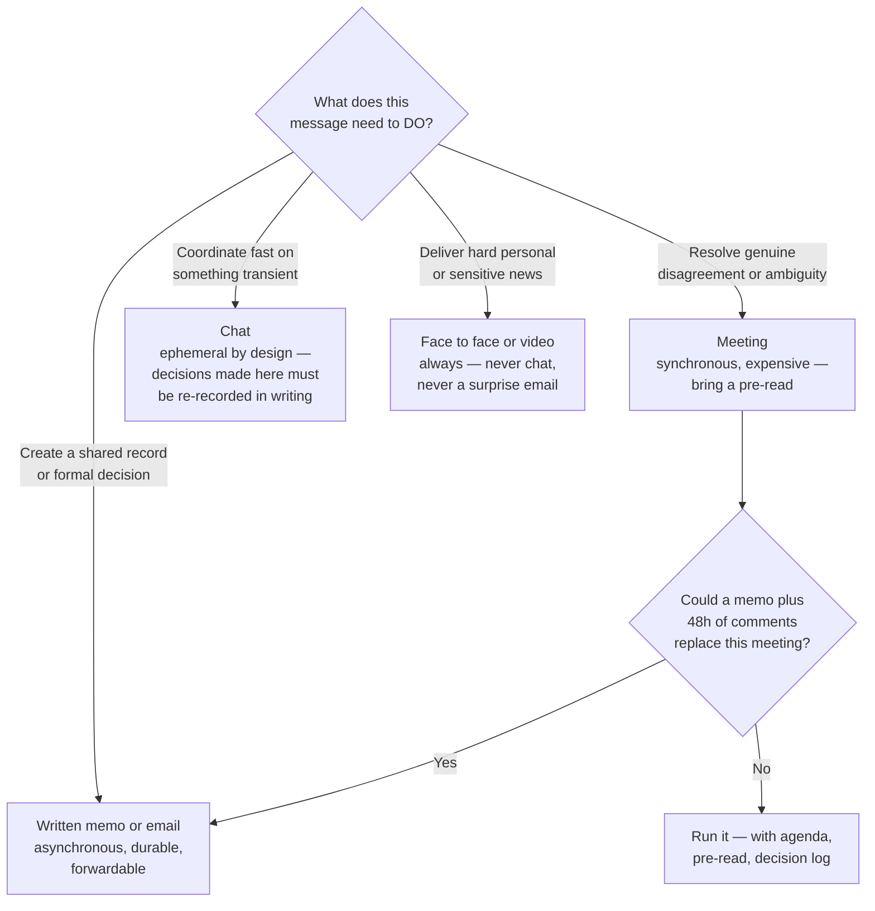
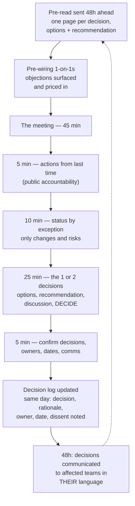
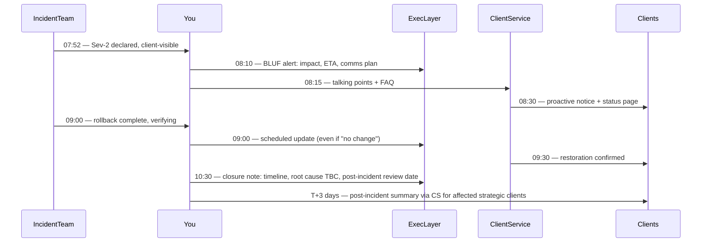

# Day 23 — Executive Communication

> Week 4 · Executive Playbook · Est. reading time: 60–90 min

## 🎯 Learning objectives

By the end of today you can:

- Apply the **pyramid principle** — answer first, grouped support, MECE — and rewrite a rambling status update into an executive summary on demand.
- Write the **one-page memo** and subject lines that carry the whole message (BLUF).
- Build and deliver the **10-minute executive deck** — five slides, pre-wired decisions, and composed answers to hostile questions.
- Run **status reporting that builds trust**: honest RAG, risks first, no watermelon reports.
- Design and chair **decision forums** that produce logged decisions instead of updates.
- Deliver **difficult messages** — delays and incidents — to internal executives and to clients, including a worked portal-outage communication.
- Choose the right channel (email / meeting / chat / memo) and run a VP-grade **communication cadence**.

## 🧭 Where this fits

Day 22 gave you the 90-day plan; almost every artifact in it — the synthesis memo, the steering committee, the pre-wired roadmap kills — is a communication act. From the VP seat, communication *is* the work product: you rarely build the thing; you cause the thing to be built by making the right people understand, decide, and stay confident. Weak communicators at VP level are experienced by the organization as weak executives, whatever their underlying judgment.

---

## Part 1 — Core concepts

### 1.1 The pyramid principle — answer first, always

Barbara Minto's pyramid principle, the house style of consulting and increasingly of banking executives, inverts how most people naturally write. Natural writing narrates your journey: context → analysis → findings → conclusion. Executive writing starts at the destination: **the answer**, then the 2–4 grouped arguments supporting it, then the evidence under each — with groups that are **MECE** (mutually exclusive, collectively exhaustive: no overlaps, no gaps).

Why executives insist on it: an EVP reads dozens of documents a day and allocates attention like capital. Answer-first lets them decide in the first ten seconds whether to read on, delegate, or approve. Burying the answer doesn't build suspense; it builds suspicion that *you* don't know what the answer is.

### 1.2 Worked example — the before/after rewrite

**Before** (a real-shaped rambling status update):

> *"Hi all, quick update on the notifications project. The team has been working hard over the last sprint. We had some challenges with the event schema from the CA platform team — their v2 schema changed field names which broke our parser, and we spent about four days on that. We also onboarded a new engineer, Priya, who is ramping up well. Testing is going okay although the test environment was down Tuesday. We met with client service about the pilot list and they suggested we add two more clients which we're considering. The Q3 date is looking tight given the schema issue, but we're trying to make it work by possibly descoping the digest email feature. We'll know more next week. Also the vendor quote for the SMS gateway came in 20% above estimate. Let me know if any questions."*

Eleven facts, no message. What must the reader do? Unclear. What's the status? Buried in "looking tight."

**After** (pyramid, BLUF, 90 words):

> **Subject: CA alerts — Q3 date at risk; recommend descoping digest email to hold it (decision by Fri)**
>
> **Recommendation: hold the Q3 launch by cutting the digest-email feature; I need your OK by Friday.**
>
> - **Schedule:** an upstream schema change cost 4 days; with digest email descoped, Q3 holds with one week of buffer. With full scope, we land mid-Q4.
> - **Client impact:** digest email was requested by 2 of 14 pilot clients; deadline alerts — the feature clients actually asked for — are unaffected.
> - **Cost:** SMS gateway quote is +20% (+$40k); absorbable within contingency, no ask.
>
> Full detail in appendix; happy to discuss Thursday.

Every transformation is teachable: the answer moved to the subject line; supports grouped MECE (schedule / client impact / cost); the new engineer and the down test environment — true but not decision-relevant — moved to the appendix or nowhere; the vague "we'll know more next week" became a decision with a deadline.

### 1.3 The one-page memo and BLUF

**BLUF** — Bottom Line Up Front, military heritage — is the pyramid principle applied to the first line of anything. The one-page memo structure:

| Section | Length | Content |
|---------|--------|---------|
| Subject line | 1 line | The message itself, plus the action and deadline: "Decision needed by 5/6: approve vendor B for status page ($120k)" |
| Bottom line | 1–2 sentences | The answer or ask, restated with the single most important reason |
| Support | 3–4 bullets or short paragraphs | MECE groups, each led by its mini-conclusion in bold |
| Risks and mitigations | 2–3 bullets | What could invalidate this and what you're doing about it — including it *builds* credibility |
| The ask | 1–2 lines | Exactly what you need, from whom, by when |
| Appendix | Separate pages | All the detail; never let it invade page one |

Subject-line discipline deserves its own sentence: at a bank, executives triage from the inbox preview pane. "Notifications update" gets opened Thursday; "CA alerts: Q3 holds only if we descope digest email — need your call by Fri" gets opened now. The subject line is the memo for 40% of your readers; write it last, and write it as if it's the only thing they'll read.

### 1.4 Choosing the channel

The async-first rule for a VP: **default to writing; escalate to meetings for disagreement; never let a decision live only in chat.** Written culture scales across the time zones a global custodian actually operates in — your ops readers in a different hub deserve a memo they can read at 9am their time, not a meeting recording at 2am theirs.

---

## Part 2 — The system deep dive

### 2.1 Presenting to SVP / EVP / C-suite: the 10-minute deck

You will typically get 30 minutes on the calendar, of which 10 are truly yours before questions take over. Build for that reality — five slides:

| Slide | Title (which IS the message) | Content | Time |
|-------|------------------------------|---------|------|
| 1 | "Ask: approve £X for Y to achieve Z by Q4" | The decision, the cost, the outcome, the date | 1 min |
| 2 | "Clients are telling us the same three things" | Evidence: quotes, adoption data, ticket trends — one chart, one message (Day 19) | 2 min |
| 3 | "Option B wins on risk-adjusted value" | 2–3 options, honest trade-offs, your recommendation visibly reasoned | 3 min |
| 4 | "It costs X, returns Y, and here's the risk register" | Numbers an EVP can sanity-check in their head; top 3 risks with mitigations | 2 min |
| 5 | "Decision needed today + what happens next" | The ask restated; the 30/60/90 after approval | 2 min |

Rules that separate polished VPs from nervous ones: **slide titles form a complete argument when read alone** (flip through titles only — does the story hold?); every number on a slide is one you can decompose from memory; and the appendix is 3× the deck, because the appendix is where credibility lives when the CFO asks about assumption 4.

**Pre-wiring: the meeting before the meeting.** No decision of consequence should be *made* in the steering committee; it should be *ratified* there. Before any decision forum, walk the recommendation past each decision-maker (or their trusted lieutenant) 1-on-1: you learn objections while they're cheap to fix, you let stakeholders shape the proposal enough to co-own it, and you discover whether you're about to lose — in which case you postpone, not present. If this feels like politics: it is, in the honorable sense. Surprising executives in public is not integrity; it's poor craft.

**Hostile questions — the three moves:**

| Move | When | Script shape |
|------|------|--------------|
| **Bridge** | Question is tangential but answerable | "The short answer is X. The fuller context connects to the point on slide 3…" — answer, then return to your line |
| **Park** | Question is legitimate but would derail the decision | "Important question, and it deserves better than a hallway answer — I'll take it offline with your team and respond in writing by Thursday. For today's decision, what matters is…" |
| **Commit** | You genuinely don't know | "I don't know, and I won't guess in this room. You'll have the answer by tomorrow noon." — then hit that time *without fail*; a kept follow-up commitment builds more trust than a fluent bluff |

The one unforgivable move is bluffing a number to a C-suite audience. Someone in the room knows the real number. The day they correct you is the day your decks start getting fact-checked line by line.

### 2.2 Status reporting that builds trust

The endemic disease of large-company status reporting is the **watermelon report**: green outside, red inside. It develops one rational-seeming shading at a time ("we'll probably catch up, no need to alarm anyone") and it is the single fastest way to convert a delivery problem into a *credibility* problem — because executives forgive slipped dates far more readily than they forgive being denied the chance to help.

Honest RAG discipline:

| Status | Honest meaning | What must accompany it |
|--------|----------------|------------------------|
| 🟢 Green | On track for scope, date, and cost — *and I have looked* | The next milestone, so green is falsifiable |
| 🟡 Amber | A named risk threatens the commitment; recovery plan exists and is funded | The risk, the plan, the date amber resolves to green or red |
| 🔴 Red | The commitment will be missed without intervention beyond my authority | The specific help needed: decision, budget, escalation, scope relief |

Two structural rules: **lead with risks, not accomplishments** (an executive reading your report is scanning for where they're exposed — serve that need first and they'll trust everything else you write), and **make red safe in your own forums** — the first team that goes red under you must have a visibly good experience, because everyone else is watching to learn whether your RAG is honest or theatrical.

### 2.3 Decision forums and steering committees

Design notes from the chair's seat: cap decisions per meeting at two (three decisions means zero decisions); name the **decision-maker per item in the agenda itself** (DACI — tomorrow's Day 24 — printed, not implied); record **dissent in the log** ("Ops flagged capacity risk; proceeding with monthly checkpoint") because logged dissent is what lets people disagree-and-commit rather than relitigate; and end every item by saying the decision out loud in one sentence — half of all forum disputes three weeks later are about what was actually decided.

### 2.4 Difficult messages — delays and incidents

**The delay announcement formula:** state the miss plainly in line one (no throat-clearing), quantify the new commitment and why *this* date is believable when the last one wasn't, own the cause without theatrical self-flagellation, and give the reader something to *do* (approve the descope, inform their client, hold questions to the Thursday call). What destroys trust is not the delay; it's the reader discovering the delay was known for three weeks.

**Worked example — portal outage, two audiences.** Scenario: the client portal is degraded from 07:40 ET; positions pages intermittently failing; root cause suspected in an overnight cache deployment; ~200 institutional clients affected during their morning checks.

*To internal executives (08:10, chat + email):*

> **Portal degraded since 07:40 ET — client-visible — fix ETA 10:00 — comms going to clients at 08:30.**
> Impact: positions pages failing intermittently for ~200 clients; transactions and reporting unaffected. Cause: suspected overnight cache release; rollback in progress. Client comms: status page updated, proactive email at 08:30 to affected clients, client-service briefed with talking points. Next update 09:00 or on material change. — Rishabh

*To clients (08:30, status page + email from client service):*

> **Subject: Service notice — intermittent errors on portal positions pages**
> Since 07:40 ET some clients are experiencing intermittent errors on portal positions pages. Transactions, reporting, and file delivery are unaffected, and **your data is complete and secure — this is an access issue, not a data issue**. Our teams have identified the likely cause and expect restoration by 10:00 ET. If you need positions before then, your client service team can provide them directly. Next update by 09:30 ET on our status page.

Note the differences: internal comms lead with *client visibility and comms plan* (what executives fear is not the outage but being blindsided by a client call); client comms lead with *scope containment and data integrity* (what clients fear is not a slow page but wrong or lost data), commit to the next update time, and never speculate on blame.

The meta-rule of incident communication: **cadence beats content**. A thin update on time ("no change; next update 09:30") preserves trust; a rich update 40 minutes late destroys it, because silence is always interpreted as chaos.

### 2.5 Storytelling with data

Day 19's one-chart-one-message rule, applied to executive rooms: every chart earns its slide by answering a question the audience already has. The narrative arc for any data story is **situation → complication → resolution**: "Portal adoption grew 40% (situation) — but query tickets grew 60%, meaning clients use it and still can't find answers (complication) — the contextual-help quick win attacks exactly that gap (resolution)." A chart without a complication is decoration; strip it to the appendix.

---

## Part 3 — The VP lens

### 3.1 Your communication cadence

| Rhythm | Audience | Format | Content | Time cost |
|--------|----------|--------|---------|-----------|
| Daily | Your leads | Chat / stand-up visibility | Blockers, incidents, today's one priority | 15 min |
| Weekly | Your team | Written note (5 bullets) | Decisions made, context from above, wins, next week's focus | 30 min to write |
| Weekly | Your manager | 1-on-1 + shared doc | Risks first, decisions needed, no-surprises items | 45 min |
| Bi-weekly | Peer VPs (ops, tech, sales) | 1-on-1 rotation | Coordination, early warning of anything touching them | 2 × 30 min |
| Monthly | Steering committee | Pre-read + forum | The 1–2 decisions, status by exception, decision log | Half day incl. prep |
| Monthly | Extended org | Open forum / AMA | Direction, celebrate specifics, take unfiltered questions | 1 hour |
| Quarterly | SVP/EVP layer | 5-slide review | Outcomes vs commitments, next-quarter asks | 2 days incl. pre-wiring |
| Quarterly | Strategic clients | QBR (Day 25) | Roadmap delivered vs promised, adoption data, listening | Varies |

The design principle: **each audience hears from you before they wonder where you are.** Cadence is what makes "no surprises" a system instead of an aspiration — and the weekly written team note is the highest-leverage 30 minutes on the list, because it is how 60 people who rarely see you experience your judgment.

### 3.2 Decisions you own

- **The pre-read standard for your forums** — no pre-read, no agenda slot. Enforce it twice and it becomes culture.
- **Your escalation-comms threshold** — decide *in advance* what severity reaches which executives within what time (e.g., any client-visible incident → your SVP within 30 minutes, from you, not from rumor).
- **What you personally review before it leaves the building** — early on: every client-facing comm about your product; later: only novel categories. Say which explicitly, or you become the bottleneck by default.
- **The vocabulary** — insist that "at risk," "committed," and "exploring" mean one thing each across your teams' documents; roadmap chaos is often just vocabulary chaos.

### 3.3 Questions to ask (of yourself, weekly)

1. "Did anyone senior learn bad news about my area from someone other than me this week?"
2. "Can my manager repeat my current top three priorities without notes?" (If not, that's your failure, not theirs.)
3. "What decision is stuck because I've been discussing it in meetings instead of writing the one-pager?"
4. "When did I last say 'I don't know, I'll find out by X' in a senior room — and did I hit X?"

---

## 🏦 State Street context

*Representative and public-knowledge; verify specifics internally.*

- **Global follow-the-sun reality.** With major hubs across North America, Europe, and Asia-Pacific (Poland, India, and China among them), a meeting-first culture systematically excludes someone. Written-first communication is not a stylistic preference at State Street's footprint — it is the only inclusive default, and your weekly written note may be the primary way offshore team members experience your leadership.
- **Regulated-entity discipline on client comms.** As a G-SIB, client-facing communications — incident notices included — typically pass through defined review paths (client service leadership, sometimes legal/compliance for material events). Pre-agree an **incident-comms template with the review path pre-approved**, so at 08:15 during a real incident you fill in blanks rather than draft prose awaiting review. Regulators may also expect notification for material operational incidents (operational-resilience regimes, Day 12); know whose job that is before you need to.
- **The matrix multiplies pre-wiring.** Decisions at a firm of State Street's structure often need alignment across product, technology, operations, and the Alpha platform organization before any formal forum. Budget pre-wiring time accordingly: for a significant decision, expect the 1-on-1 circuit to take longer than building the deck — and to matter more.
- **Formality gradient.** Board-adjacent and regulator-adjacent materials (operating committees, risk committees) carry a formality and evidentiary bar above normal product decks — versioned documents, minuted decisions, retained records. When your material feeds upward into those forums, write for that afterlife: assume anything you produce may be read by an examiner in two years.

---

## 💪 Exercises

1. **The rewrite drill.** Take the "before" status update in 1.2 and — without looking at the provided "after" — produce your own pyramid rewrite in under 100 words, subject line included. Compare. Then find a real status update you've written in the past year and do it again.
2. **Build your incident-comms kit.** Draft the two-audience template pair (internal exec alert + client notice) for a portal outage with blanks for time, scope, ETA, and next update. Write the accompanying 5-line client-service FAQ. This is the exercise you'll be gladdest you did.
3. **Title-only test.** Take any deck you own, extract just the slide titles into a list, and read them aloud. If they don't form a complete argument ending in an ask, rewrite the titles first — the slides will follow.

## ❓ Self-check quiz

1. What does MECE require of your supporting groups, and what does answer-first do for an executive reader?
2. Name the three hostile-question moves and the one unforgivable alternative.
3. What is a watermelon report, and what two structural rules prevent it?
4. In the portal-outage worked example, why do the internal and client messages lead with different things?
5. Why does "cadence beats content" hold in incident communication?

<strong>Answers</strong>

1. Groups must be mutually exclusive (no overlapping arguments) and collectively exhaustive (no missing considerations). Answer-first lets an executive allocate attention in seconds — decide, delegate, or read on — and signals that you actually know your own conclusion.
2. Bridge (answer briefly, return to your line), park (defer legitimately derailing questions with a written follow-up commitment), commit ("I don't know — you'll have it by tomorrow noon," then delivering). The unforgivable move is bluffing a number — one correction and your credibility is permanently discounted.
3. Green-outside, red-inside status reporting. Prevented by (a) leading every report with risks, not accomplishments, and (b) making the first honest red in your forums a visibly safe experience, so honesty is learned as rewarded.
4. Executives fear being blindsided by clients, so internal comms lead with client visibility and the comms plan; clients fear data problems more than access problems, so client comms lead with scope containment and explicit data-integrity assurance.
5. Silence during an incident is always interpreted as chaos. A thin on-time update ("no change, next update 09:30") maintains trust and dampens the escalation reflex; a richer but late update arrives after trust has already been spent.

## 🔑 Key takeaways

- **Answer first, grouped support, MECE** — pyramid structure is how executives read; narrating your journey reads as not knowing your destination.
- The **subject line is the memo** for a large share of readers; write it last, make it carry the message, the action, and the deadline.
- **Pre-wire every consequential decision**; forums ratify, they don't discover. Surprising executives in public is poor craft, not courage.
- Status trust is built by **honest RAG, risks first**, and by making the first red under your leadership a safe experience.
- Difficult messages follow a formula: **state it plainly, quantify the new reality, own the cause, give the reader an action** — and in incidents, cadence beats content.
- Run decision forums with pre-reads, ≤2 decisions, named decision-makers, and a same-day decision log with dissent recorded.
- Default to writing; escalate to meetings for genuine disagreement; never let a decision live only in chat.

## 📚 Going deeper

- Barbara Minto, *The Pyramid Principle* — the source text; part one is sufficient.
- Cole Nussbaumer Knaflic, *Storytelling with Data* — pairs with Day 19.
- Chip Heath and Dan Heath, *Made to Stick* — why some messages survive retelling and most don't.
- Amazon's narrative-memo practice (widely documented publicly) — the strongest existing proof that written-first decision culture scales.
- Google SRE workbook, incident-communication chapters (sre.google) — the cadence discipline, transplanted from the source.

## Tomorrow

You can now say it; Day 24 is about deciding what to say — leadership altitude, delegation that actually delegates, one-way vs two-way doors, DACI, and the frameworks that keep a VP's judgment consistent under load.
