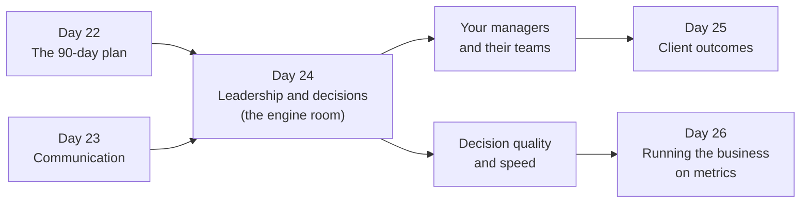
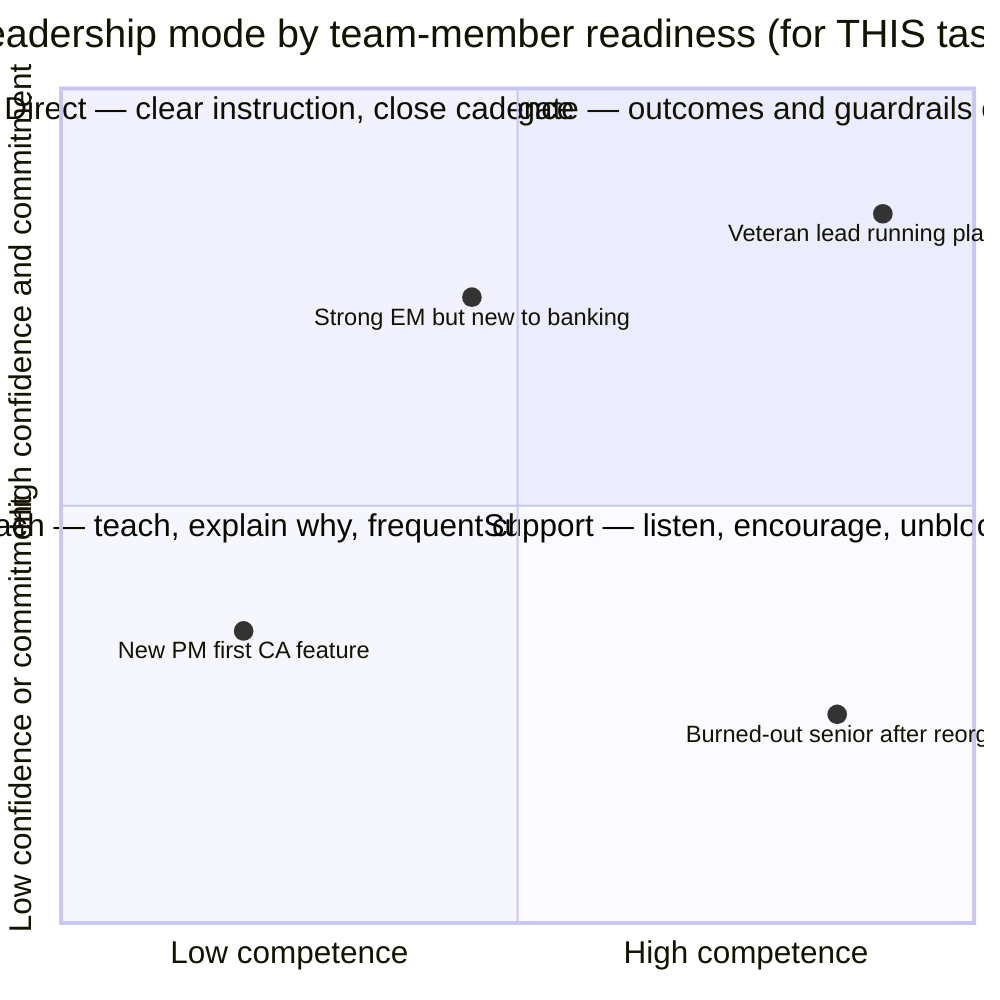
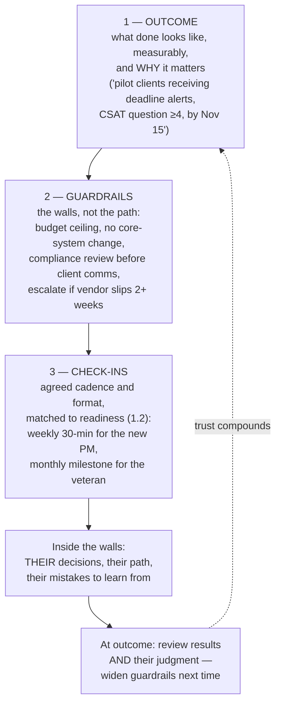
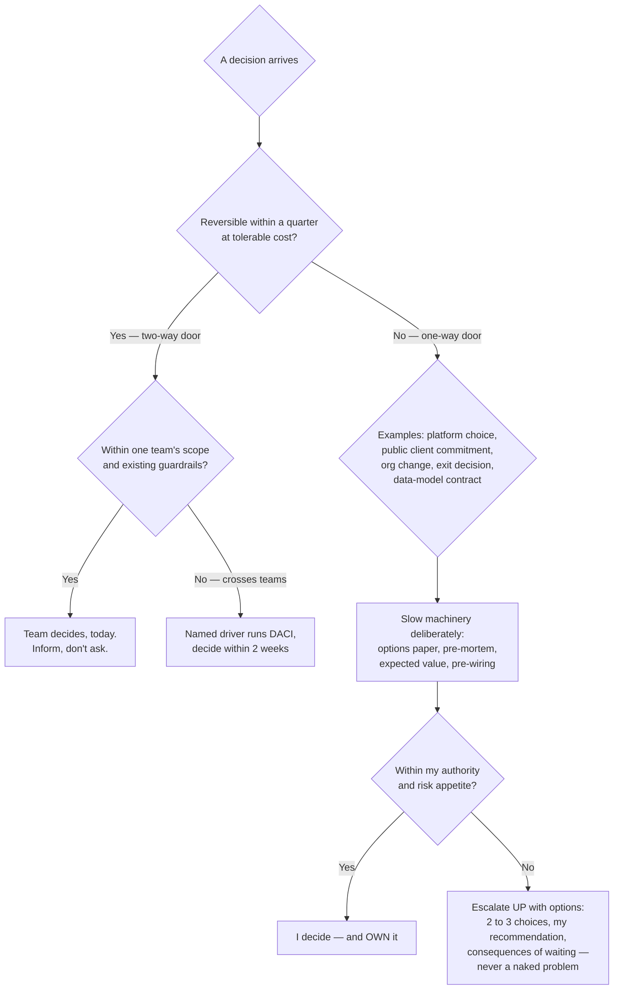
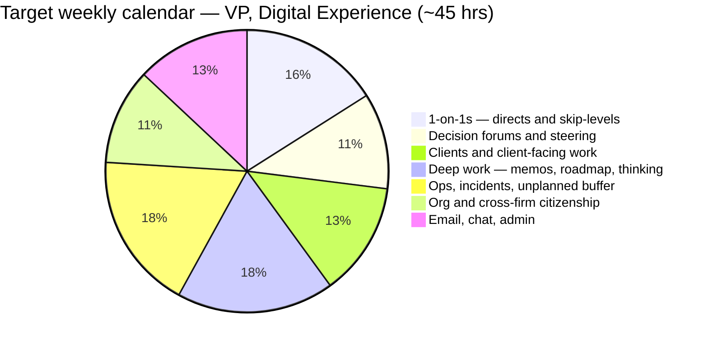

# Day 24 — Leadership and Decision-Making Frameworks

> Week 4 · Executive Playbook · Est. reading time: 60–90 min

## 🎯 Learning objectives

By the end of today you can:

- Make the transition from senior manager to VP explicit: **owning outcomes through others**, managing managers, and operating at the right altitude.
- Diagnose which **situational-leadership mode** — directing, coaching, supporting, delegating — each team member and situation needs.
- Delegate with **outcome + guardrails + check-ins**, and write a delegation brief that survives contact with reality.
- Classify decisions as **one-way vs two-way doors**, assign them with **DACI**, and run pre-mortems and expected-value thinking before the big ones.
- Give feedback with **SBI**, run a difficult conversation from a script, and navigate big-company calibration honestly.
- Hire to a defined bar, architect your **calendar as a strategy document**, and win an inherited team's trust fast.

## 🧭 Where this fits

Day 22 planned your entry; Day 23 gave you the voice. Day 24 is the engine room: the decisions you make, the people you make them through, and the personal operating system that keeps both consistent when the calendar turns hostile. Everything client-facing in Day 25 and metric-facing in Day 26 is executed by the team this day teaches you to lead.

---

## Part 1 — Core concepts

### 1.1 From senior manager to VP — what actually changes

| Dimension | Senior manager | VP | The trap in between |
|-----------|----------------|----|--------------------|
| Unit of output | Your team's delivery | **Outcomes across teams, including ones you don't manage** | Measuring yourself by your directs' velocity |
| Relationship to work | Reviews the work | Reviews the **people and systems** that produce work | Becoming the best senior engineer/PM in the room again under stress |
| Time horizon | This quarter | 2–6 quarters, plus this week's fires | Living only in one horizon |
| Information | First-hand | **Second- and third-hand, filtered by hierarchy** | Believing the filtered version; not building skip-level truth channels |
| Managing | Individual contributors | **Managers** — you now experience problems as patterns across teams | Managing your managers' reports around them |
| Failure mode | A missed sprint | A missed *year*, discovered late | Not noticing that your feedback loops got 10x slower |

The single deepest shift: as a senior manager, your instinct to dive in and fix things was an asset. As a VP, that same instinct — deployed unthinkingly — **destroys the information and ownership structures you depend on**. Every time you solve a problem your manager should have solved, you teach the organization three things: escalate everything to Rishabh, don't grow, and don't own. "Operating at altitude" means choosing your dives deliberately (a client escalation, a stuck cross-team decision, a quality spot-check) and *announcing them as dives* — "I'm going deep on this one because X; this isn't the new normal" — then climbing back up.

### 1.2 Situational leadership — one team, four modes

Hersey and Blanchard's model, stripped to its useful core: match your style to the person's **competence and confidence for this specific task** — not to the person in general. Your strongest architect may need directing on their first regulator-facing document.

Worked mappings for the four people in the chart:

| Person / situation | Mode | What it looks like in practice |
|--------------------|------|--------------------------------|
| New PM, first corporate-actions feature | **Coach** (verging on direct) | Weekly working sessions; you explain *why* ops sign-off precedes client comms; review their PRD in detail, once with them present |
| Strong engineering manager, new to banking domain | **Direct on domain, delegate on craft** | Give explicit banking guardrails (entitlements, evidence, change control); leave engineering decisions entirely alone |
| Veteran platform lead | **Delegate** | Quarterly outcomes, monthly check-in; your job is air cover and budget — added oversight would be experienced as insult |
| Burned-out senior after a reorg | **Support** | Competence isn't the issue; listen, restore meaning, protect from thrash; do NOT respond with more direction — it reads as distrust |

The classic VP error is a **single default mode**: the ex-engineer who directs everyone (micromanagement), or the "empowering" leader who delegates everything uniformly — which for a struggling junior is not empowerment but abandonment with better branding.

### 1.3 Delegation done properly — outcome, guardrails, check-ins

Delegation fails in two symmetric ways: **task-listing** (handing over activities, keeping the thinking, producing a human macro) and **abdication** (handing over a vague noun — "own notifications" — and reappearing at the deadline, disappointed). The durable structure has three parts:

**Worked delegation brief** (the artifact — one page, written, so "what did we agree?" never becomes a memory contest):

> **To:** Ananya (Senior PM) · **From:** Rishabh · **Date:** Sep 2
> **Outcome:** Corporate-action deadline alerts live for the 14 pilot clients by Nov 15, with ≥10 clients activating alerts and zero missed-notification incidents in the first 30 days.
> **Why it matters:** top listening-tour ask from ops AND clients; our first credibility quick win (Day 22 logic).
> **Guardrails:** experience-layer only — no changes to the CA core or event schema (coordinate with platform team for consumption); client-facing copy through compliance review before any send; budget ceiling $80k external; escalate to me if the events feed slips more than 2 weeks or any pilot client raises contractual questions.
> **Decisions that are yours:** alert channels, configuration UX, pilot sequencing, descope of digest option.
> **Decisions that are mine:** adding clients beyond the 14; anything touching contractual commitments; go/no-go if we're amber at Nov 1.
> **Check-ins:** Weekly 15-min written update (risks first — Day 23 format); milestone review Oct 1; I'll join the first pilot-client call, then hand off.

Note the explicit **decision split** — the most commonly omitted section and the source of most delegation friction. Ambiguity about who decides is experienced by your manager as micromanagement *and* by you as abdication, simultaneously.

---

## Part 2 — The system deep dive

### 2.1 One-way vs two-way doors — and who decides

Jeff Bezos's distinction, now standard executive vocabulary: **Type 1 decisions (one-way doors)** are consequential and effectively irreversible — decide slowly, centrally, with maximal information. **Type 2 decisions (two-way doors)** are reversible — decide fast, push authority down, and treat wrong choices as cheap information. The organizational disease of big banks is processing Type 2 decisions through Type 1 machinery: six-week committees to choose a notification vendor you could swap in a quarter.

**Escalation criteria — when to decide vs when to bring options upward.** Escalate when (a) the decision commits the firm beyond your mandate (contractual client promises, headline budget), (b) two legitimate executive priorities genuinely conflict and the trade-off is above your pay grade to arbitrate, or (c) irreversibility × blast radius exceeds your risk appetite. But escalate **options, never problems**: "Here are three choices, here's my recommendation and why, here's the cost of deciding next month instead" — the format that makes senior leaders trust you with more, not less.

### 2.2 DACI — worked example: choosing the new portal design system

DACI assigns four roles per decision: **Driver** (runs the process), **Approver** (the ONE person who decides), **Contributors** (consulted for input), **Informed** (told the outcome). Its cousin RACI does the same for ongoing work (Responsible/Accountable/Consulted/Informed); use RACI for processes, DACI for decisions.

**Decision:** adopt a design system for the client portal rebuild — extend the firm's enterprise design system, adopt-and-theme an open-source system, or build our own.

| Role | Who | Their part |
|------|-----|-----------|
| **Driver** | Head of Design (your org) | Frames options, gathers evidence, runs the 3-week process, writes the one-pager |
| **Approver** | **You (VP, Digital Experience)** | One name. Not a committee. You sign, you own the consequences |
| **Contributors** | Lead engineers (build cost), enterprise architecture (standards fit), accessibility lead (compliance), 2 senior PMs (roadmap impact), brand/marketing (identity) | Give input by a stated date; input ≠ vote |
| **Informed** | Your full org, ops liaisons, Alpha platform design counterparts, your manager | Decision + rationale within 48h (Day 23 decision log) |

The worked outcome: Driver's paper shows the enterprise system covers 70% of components but its data-grid — the heart of an institutional portal — is weak; open-source adopt-and-theme wins on grid quality but creates a divergence architecture will fight for years. You approve **extend-the-enterprise-system, with a funded contribution of a hardened data-grid back to it** — the option nobody entered the room holding, which is precisely what a good DACI process surfaces. Logged, with engineering's dissent on timeline recorded.

Why DACI earns its ceremony: the failure mode it prevents is not bad decisions but **unowned and relitigated ones** — the decision made in March, unmade by hallway in April, remade in May. One Approver plus a decision log makes relitigating visible and expensive.

### 2.3 Pre-mortems and expected-value thinking

**Pre-mortem** (Gary Klein): before committing to a one-way door, gather the team and announce: *"It is 12 months from now and this decision failed embarrassingly. Write down what happened."* Ten minutes of silent writing, then group the causes. Prospective hindsight legitimizes pessimism that meeting dynamics normally suppress — the junior engineer who *knows* the events feed can't handle month-end volume will write it down even though they wouldn't have contradicted the architect aloud. Convert the top three causes into guardrails or kill-criteria.

**Expected-value thinking**, kept honest and rough: a portal search overhaul — 60% chance of the full win (say +8 NPS-equivalent points of retention value ≈ $900k), 30% partial (≈ $300k), 10% failure (–$150k in credibility and rework) → EV ≈ $540k + $90k – $15k ≈ **$615k against a $400k cost**. The point is not the false precision; it is that writing the distribution down (a) exposes which assumption the decision actually hinges on — usually the 60% — and (b) builds the portfolio habit: a VP funding only sure things is systematically underinvesting, and expected value is how you defend the 60%-bet that failed honestly.

### 2.4 Feedback, difficult conversations, and calibration

**SBI — Situation, Behavior, Impact** — the minimum viable feedback structure: *"In yesterday's steering committee (S), you presented the risk as resolved when the mitigation isn't tested (B). The COO's team now has an expectation we may miss, and it puts our RAG honesty in question (I)."* Then stop and let them respond. SBI's value is what it excludes: no character verdicts ("you're careless"), no mind-reading ("you wanted to look good"), no accumulated history — one situation, observable behavior, real impact.

**The difficult-conversation script** (performance, repeated pattern):

1. **Headline, kindly, in one sentence:** "This conversation is about the delivery pattern on your team over the last two quarters — it's a serious one."
2. **Two or three SBI instances** — evidence, not adjectives.
3. **Listen — genuinely.** New information changes maybe a third of these conversations. Ask: "What am I missing?"
4. **State the standard and the gap** — the expectation is X; the pattern is Y.
5. **Agree the plan and timeframe:** what changes, what support you provide, when you review (30/60 days), and — honestly — what happens if it doesn't change.
6. **Document same day.** Kindness and records are not opposites; at a big company the absence of records eventually hurts the *employee* as much as you.

**Calibration at big companies:** your ratings are relative claims defended in a room of peers, and unmanaged, calibration rewards the most articulate manager rather than the best team. Your obligations: keep an **evidence file per direct all year** (outcomes, not adjectives — calibration rooms run on specifics); never promise a rating before the room; and represent your quiet performers with the same energy as your visible ones — the org learns quickly whether working for you is career-safe.

### 2.5 Hiring as a VP

Three jobs only you can do: **define the bar** (write the role's success criteria at 12 months *before* opening the req — "hired the person, not the resume" failures trace to skipping this), **design the loop** (each interviewer owns one dimension with calibrated questions; five people asking "walk me through your background" is one interview run five times), and **sell** (at VP level you close senior candidates personally — and the honest sell for a custodian is *scale, consequence, and unsolved problems*: "your notification design ships to trillions in serviced assets" — not pretending it's a startup). One discipline: never lower the bar for urgency. An empty seat costs a quarter; a mis-hire at manager level costs two years, because you'll spend year one doubting and year two documenting.

---

## Part 3 — The VP lens

### 3.1 Your calendar is your strategy — whether you designed it or not

Paul Graham's maker/manager distinction, applied upward: you now live on a manager's schedule, but your *team* includes makers, and so does part of your own job (the synthesis memo, the roadmap thinking). Both need protecting deliberately.

Design rules rather than percentages to memorize: **deep work dies first unless it has standing calendar blocks defended like client meetings** (two half-days weekly, morning, before the day fractures); **buffer is a feature, not slack** — at a custodian, incidents and client escalations *will* consume ~15–20% of your week, and a calendar without that capacity pays for it out of deep work; skip-levels are scheduled or they never happen; and audit monthly: **does the calendar match the stated strategy?** A VP claiming "clients are my priority" with 4% client time has a strategy document contradicting itself. Finally, keep a ruthless list of **what only you can do** — set direction, make one-way-door calls, represent the org upward and to clients, develop your managers, hire the bar — and treat time spent below that list as borrowed from it.

### 3.2 Building trust fast with an inherited team — the first team meeting, worked

You inherit skepticism by default: they've seen leaders arrive with theories before. The first full-team meeting (week 1–2, 60 minutes) has one goal — make it *safe and worthwhile to tell you the truth*:

| Segment | Minutes | Content |
|---------|---------|---------|
| Who I am, honestly | 10 | Background including what you *don't* know ("you'll teach me this portfolio"); why you took the job; 2–3 operating values with behavioral examples ("bad news early is rewarded — watch how I react to the first red") |
| How I'll operate | 10 | Your cadence (Day 23 table), decision style (DACI, doors), what you'll never do (surprise them in public, take credit upward) |
| What happens next | 10 | The listening tour (Day 22) — "1-on-1s with everyone in two weeks; ask me anything; I'll share the synthesis with YOU before executives see it" |
| Their questions | 25 | Take everything; model "I don't know yet" repeatedly; commit to answers with dates |
| One ask | 5 | "Before your 1-on-1: what should I keep, kill, and start? Bring one of each." |

Then trust is built by the boring mechanism nobody can shortcut: **do exactly what you said, visibly, for 90 days**. Keep the 1-on-1s unmoved, share the synthesis with the team first as promised, react well to the first bad news, and give credit upward by name. Trust at this level is just kept promises at sufficient density.

### 3.3 Questions to ask yourself monthly

1. "Which decisions did I make this month that one of my managers should have made — and why did they route to me?"
2. "Whose guardrails did I widen this quarter?" (If nobody's, you're not developing anyone.)
3. "What's my ratio of one-way-door deliberation to two-way-door speed — am I running any Type 2 decisions through Type 1 machinery?"
4. "Does my calendar's actual allocation match what I told my team the strategy is?"
5. "Who on my team got better this quarter because of something I deliberately did?"

---

## 🏦 State Street context

*Representative and public-knowledge; verify specifics internally.*

- **You lead across an ocean by default.** A State Street VP's teams typically span Boston and hubs such as Poland, India, and China. Situational leadership gets harder over video: "supporting" and "coaching" modes require deliberately scheduled time-zone-fair 1-on-1s, and delegation briefs matter *more* when you can't correct course by walking the floor. Rotate meeting-time pain; never let one hub always take the 9pm slot.
- **Formal performance architecture.** Large regulated firms run structured review cycles, calibration, and documented performance management with HR partnership. The evidence-file discipline in 2.4 is not optional here — and risk-and-control behavior (how someone handles an incident, an audit, a compliance finding) is typically a first-class rating input, not a footnote. Reward it visibly in your own team or your stated values won't survive their first calibration.
- **Matrix decision-making raises the DACI premium.** Many decisions touching your product need contributors from operations, technology, the Alpha platform organization, risk, and compliance — none reporting to you. Ambiguity about the Approver is where cross-organizational decisions at firms like State Street go to stall; write the DACI down early, socialize it (Day 23 pre-wiring), and expect that getting the *right single Approver named* is sometimes the actual negotiation.
- **One-way doors are more common than they look.** In a custodian, "just a product choice" can be irreversible in practice: a data field exposed in a client-facing API becomes a contract (Day 15), a commitment in a QBR becomes a promise with a memory (Day 25), an entitlements-model shortcut becomes an audit finding. When in doubt at a G-SIB, treat the door as one-way and spend the extra week.
- **Talent sell, honestly framed:** State Street offers scale (tens of trillions in assets under custody/administration), genuine unsolved data-and-platform problems (Alpha's front-to-back ambition, Day 21's AI-on-entitled-data), and consequence. It will not out-startup a startup on pace or equity. Senior candidates respect the honest version; they discount the pretend one instantly.

---

## 💪 Exercises

1. **Write two real delegation briefs** using the 2-part template (outcome/guardrails/check-ins + explicit decision split): one for your strongest lead, one for your newest manager. Notice how the guardrails and cadence differ while the structure holds — that difference *is* situational leadership in writing.
2. **Run a personal pre-mortem** on your own 90-day plan (Day 22): "It's day 91 and my start is considered a disappointment — what happened?" Write for ten minutes. Convert the top three causes into changes to the week-by-week checklist.
3. **Calendar audit.** Pull your last four weeks (or a representative senior-manager month). Categorize every hour against the pie above. Write the three-line memo to yourself: biggest gap vs target, what you'll decline next month, which deep-work blocks go in now.

## ❓ Self-check quiz

1. What is the deepest behavioral shift from senior manager to VP, and what does undisciplined "diving in" teach your organization?
2. A delegation brief has three structural parts plus one commonly omitted section — name all four.
3. Classify and route: (a) choosing the pilot clients for CA alerts; (b) committing a portal-API field structure to external clients; (c) exiting an underperforming manager. Doors and machinery for each.
4. In the DACI worked example, why is the Approver a single named person, and what failure mode does the decision log prevent?
5. What makes a pre-mortem produce truths a normal risk-review meeting won't?

<strong>Answers</strong>

1. From producing and fixing directly to owning outcomes through others at altitude. Unannounced diving teaches three lessons: escalate everything upward, ownership isn't real, and managers under you needn't grow — destroying the information and accountability structures a VP depends on.
2. Outcome (measurable, with the why), guardrails (walls not paths — budget, scope, escalation triggers), check-ins (cadence matched to readiness) — plus the explicit decision split: which decisions are theirs vs yours.
3. (a) Two-way door within team scope — the PM decides today, informs. (b) One-way door: a client-facing API field is a de facto contract (Day 15) — slow machinery, architecture contribution, VP approves. (c) One-way door for the person and the org — deliberate, evidenced, HR-partnered, and it's yours to own, not delegate.
4. A single Approver creates real ownership and prevents committee non-decisions; the log (with rationale and recorded dissent) makes hallway relitigation visible and expensive, converting "disagree" into "disagree and commit."
5. Prospective hindsight — "it already failed; what happened?" — reframes pessimism as the assigned task rather than social defection, so juniors and skeptics surface the risks that meeting hierarchy normally suppresses.

## 🔑 Key takeaways

- VP means **outcomes through others at altitude** — dive deliberately, announce the dive, climb back out.
- Match leadership mode to **this person on this task** — directing, coaching, supporting, delegating are tools, not identities; a single default mode is the classic failure.
- Delegation = **outcome + guardrails + check-ins + an explicit decision split**, in writing. Trust compounds by widening guardrails after good judgment.
- **Two-way doors: fast and pushed down. One-way doors: slow, pre-mortemed, expected-value-checked, singly owned.** Escalate options with a recommendation, never naked problems.
- DACI's one Approver and a decision log cure relitigation — the true disease of matrix organizations.
- Feedback is **SBI + listening + a documented plan**; calibration is won with year-round evidence files, not eloquence in the room.
- Your calendar is a strategy document with your signature on it — audit it monthly against what you claim matters, and guard deep work and buffer like client meetings.

## 📚 Going deeper

- Andrew Grove, *High Output Management* — managerial leverage, the timeless text.
- Michael Watkins, *The First 90 Days* — pairs with Day 22's transition arc.
- Camille Fournier, *The Manager's Path* — the managing-managers chapters especially.
- Gary Klein on pre-mortems (Harvard Business Review, "Performing a Project Premortem," 2007).
- Amazon shareholder letters (1997, 2015) — the original one-way/two-way door articulation.
- Kim Scott, *Radical Candor* — care personally, challenge directly; the SBI habit's cultural wrapper.

## Tomorrow

The engine room is running; now point it at revenue. Day 25 turns outward: who institutional clients really are, how asset-servicing deals make (thin) money, winning RFPs and QBRs, and how to say no to a top-10 client and keep the relationship.
