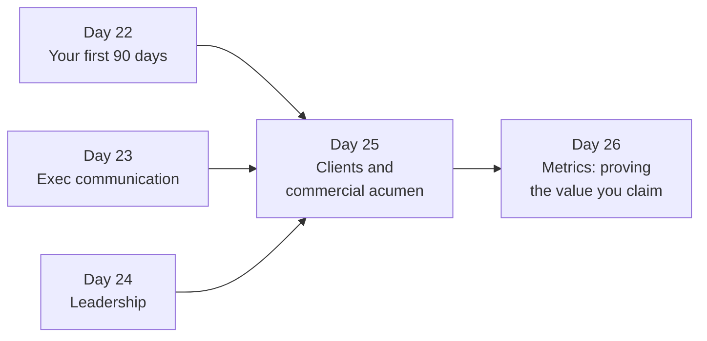
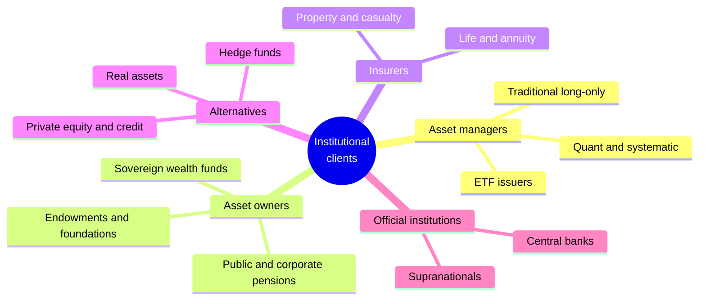
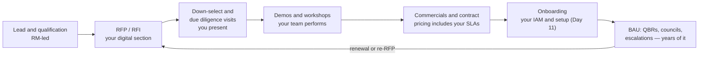
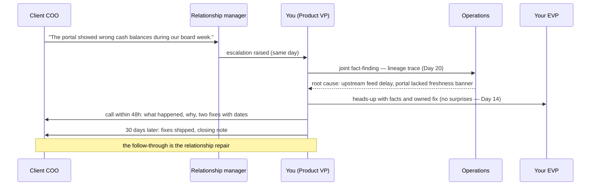

# Day 25 — Client Engagement and Commercial Acumen

> Week 4 · The Executive VP Playbook · Est. reading time: 60–90 min

## 🎯 Learning objectives

By the end of today you can:

- Segment the institutional client landscape and predict each segment's digital priorities
- Explain how asset-servicing deals are priced and why margins are thin
- Play your role in the sales cycle: RFP digital sections, due diligence, demos
- Run QBRs and a client advisory board that feed the roadmap without capturing it
- Triage and lead escalations from strategic clients
- Read a client-health early-warning table and act before the RFP goes out to your competitors
- Say no to a top-10 client and keep the relationship

## 🧭 Where this fits

Weeks 1–3 built what you know; Days 22–24 built how you operate. Today turns outward: the clients whose fees pay for everything. A Digital Experience VP is not "in sales," but at a custodian **digital is now a top-three evaluation criterion in most custody RFPs** — which means you personally win and lose revenue. This chapter is how.

---

## Part 1 — Core concepts

### The client landscape, segmented properly

What each segment wants from *your* products:

| Segment | Ops sophistication | Digital priorities | Watch-outs |
|---|---|---|---|
| **Large asset managers** | Very high — own platforms | APIs and data feeds (Day 15/18); portals only for exceptions | Breaking changes are relationship events |
| **Quant/systematic** | Extreme | Data quality, latency, machine-readable everything | They'll find your data errors before you do |
| **ETF issuers** | High, time-critical | Basket/AP workflows, iNAV, real-time status (Day 4) | Intraday deadlines, zero tolerance for late |
| **Pensions and asset owners** | Low–medium, lean teams | Portal-first: dashboards, documents, oversight packs (Day 4/13) | Board reporting drives their calendar |
| **Insurers** | Medium, accounting-heavy | Regulatory/statutory reporting, ABOR data | Multi-basis accounting complexity |
| **Alternatives** | Varies wildly | Capital-call workflows, document-heavy servicing | Entity sprawl (hundreds of vehicles) |
| **Official institutions** | Conservative | Security posture, sovereignty, confidentiality | Residency and access constraints (Day 20) |

The strategic point: **your roadmap is a portfolio across segments.** APIs delight the top of this table; portals and documents serve the middle; nobody's spend should monopolize the roadmap (that's Day 8's segment-value math).

### How the money works

Asset servicing is priced primarily as **basis points on assets under custody/administration, plus transaction fees, plus ancillary revenue**:

**Worked deal P&L — "Meridian Investments," $150B AUC mandate:**

| Line | Basis | Annual amount |
|---|---|---|
| Custody fee | 0.75 bps on $150B | $11.3M |
| Fund accounting/administration | 1.1 bps | $16.5M |
| Transaction fees | 900K settlements × $4.50 | $4.1M |
| FX and cash (spread/NII share) | — | $6.0M |
| Securities lending split | — | $3.5M |
| **Revenue** | | **$41.4M** |
| Direct ops cost (fully loaded) | | ($26M) |
| Technology and platform allocation | | ($9M) |
| **Pre-tax margin** | | **~$6.4M (≈15%)** |

Read what this table teaches:

1. **Margins are thin and fees compress every renewal.** The lever you control is the *cost line*: every manual touch your products remove (self-service, deflection — Day 26 quantifies it) drops straight to margin.
2. **Digital rarely prices as a line item** — it wins the deal, defends the renewal, and cuts cost-to-serve. Claiming direct revenue for the portal is usually a losing argument; claiming retention and cost influence is a winning one (bring Day 26's evidence).
3. **Ancillary revenue (FX, lending, cash) rides on the relationship** — losing a custody mandate loses those too, which is why a $41M client's escalation gets EVP attention by lunchtime.

### The sales cycle, and where you stand in it

**RFP digital sections — what wins.** Evaluators (often consultants with scorecards) reward: specific capabilities with screenshots over adjective clouds; an API catalogue with real OpenAPI specs and sandbox access (Day 15); a roadmap with confidence tiers (Day 14's shareable roadmap); named references using the features. They punish: "planned for next year" answers (they've read them for a decade), and any inconsistency between your answers and what due diligence later observes. Keep a maintained **RFP answer library** for digital — it's a product artifact you own, refreshed quarterly, or sales will improvise one for you.

**Demo excellence** is rehearsed, not improvised: the client's *own* segment scenario (a pension board pack, an ETF basket morning), realistic data (never lorem ipsum, never another client's), a failure-proofed environment, and one wow moment that maps to a scored requirement. A stumbling demo of a great product loses to a polished demo of a mediocre one — unfair and true.

---

## Part 2 — The system deep dive

### QBRs and the client advisory board

**QBRs** (quarterly business reviews) are the relationship's heartbeat: service metrics, incidents, change previews, roadmap. Your slot in the deck should be evidence, not promises: adoption of what shipped for *this client*, their usage vs peer benchmark, what's next for them. The RM owns the meeting; you own being the reason it went well.

**The client advisory board (product council)** is yours. Done right, it's your best strategic instrument; done wrong it's a top-3-clients wishlist generator.

| Design choice | Do | Don't |
|---|---|---|
| Membership | 8–12 clients across segments and sizes, ops practitioners + a few execs | Only the biggest logos |
| Cadence | 2–3 sessions/year + async previews | Monthly (fatigue) |
| Content | Problems and prototypes, "help us choose" trade-offs | Feature parades |
| Output | Published "you said, we did/didn't and why" | Silent minutes |
| Expectation | Input, explicitly not commitment | Implied roadmap votes |

The magic of a council is *peer witness*: when nine clients watch you explain a trade-off, the tenth stops believing their demand is universal.

### Escalations from strategic clients

Triage every escalation into one of three types — the response differs:

Type 1 — **product gap** ("your competitor has X"): honest roadmap conversation; never invent a date on the call. Type 2 — **incident/quality** (above): facts fast, fix dated, follow-through visible; an escalation handled this way routinely *increases* trust. Type 3 — **contractual/commercial** (SLA breach claims): you provide facts; the RM and legal lead. Knowing which type you're in — and which chair you sit in — is the skill.

### Client health: the early-warning table

Custody attrition is slow, then sudden: a mandate "suddenly" out to RFP was leaking signal for 18 months. Instrument it:

| Signal | Green | Amber | Red |
|---|---|---|---|
| Portal/API adoption trend (Day 26) | Growing | Flat | Declining or key users gone |
| Service tickets | Stable, transactional | Rising, repetitive themes | Angry, escalating, COO-signed |
| QBR engagement | Execs attend, forward-looking | Delegates only | Cancelled or hostile |
| Product council participation | Active | Passive | Declined invitation |
| Commercial | Growing wallet | Fee-pressure probes | Benchmark consultants engaged |
| Champions | Multiple, promoted | One, isolated | Departed |

Two ambers = RM conversation this week. Any red on a top-20 client = account plan review with your EVP. Your telemetry (adoption data) is often the **earliest** signal in the table — one more reason Day 26's instrumentation matters commercially, not just operationally.

### Saying no to a top-10 client

The scenario: your #4 client demands a bespoke workflow, "or we'll remember at renewal." The frame that works:

1. **Hear it fully, on their site** — often the underlying job (Day 8's JTBD) is servable another way.
2. **Cost the ask honestly, including opportunity cost** — "that's the CA election portal for everyone, delayed two quarters" turns your no into a trade-off they can respect.
3. **Offer the adjacent yes**: configuration instead of customization; an API so *they* build the last mile (Day 15); a paid bespoke tier via professional services if it's real enough to fund.
4. **Never a bare no**: a no with alternatives, a revisit date, and the council as the forum where their need competes openly.
5. **Pre-wire the RM and your EVP** (Day 14) — the client will test the no by asking above you. The organization must say the same thing.

Custom-per-client code is how platforms die; configuration, extensibility and APIs are how you say yes safely. Guard that line — it's *your* line to guard.

---

## Part 3 — The VP lens

Your operating rhythm for the client dimension of the job:

- **Time**: roughly 20–30% of your calendar should touch clients — QBR slots for the top tier, two council sessions a year, escalations, and two "no-agenda" client visits per quarter (Day 22's listening tour never really ends).
- **Artifacts you own**: the RFP digital answer library; the shareable roadmap with confidence tiers; the council charter; the client-health table for your channels.
- **The boundary you police**: input from everywhere, prioritization by the strategy (Day 8) and the numbers (Day 9, Day 26). Sales brings deals, not roadmaps; clients bring problems, not designs.
- **The evidence loop**: every client-facing claim ("our portal cuts inquiry volume 30%") must trace to Day 26 telemetry — because due diligence teams check, and because your credibility is the product's credibility.

Questions for your teams this week: Which top-20 clients have declining adoption? When did we last lose a deal on digital, and what did the debrief say? Does an RFP answer library exist and who maintains it? Which client demos failed last quarter and why?

## 🏦 State Street context

Representative realities: custody sales cycles run 12–24 months with consultant-scored RFPs where digital/data sections carry explicit weight; the Alpha-era pitch makes *platform and data* the differentiator, which puts your estate in the shop window of every major pursuit; mega-mandates (hundreds of billions AUC) mean single relationships with nine-figure lifetime value — their escalations reach the C-suite within hours; and client advisory structures exist at multiple levels (relationship, product, technology), so coordinate before creating another one. (Representative; verify internal specifics on the job.)

## 💪 Exercises

1. **Deal math.** Rerun the Meridian P&L assuming your products cut ops cost 8% (self-service deflection) and the renewal shaves fees 10%. What happens to margin? What does that tell you about the commercial argument for digital investment?
2. **RFP dry run.** Write the one-paragraph answer to: "Describe your client portal's alerting capabilities and how clients control their preferences." Use Day 12's content; make it specific enough that due diligence confirms it.
3. **The no, scripted.** Write the five-sentence talk track for declining the top-10 client's bespoke workflow, including the adjacent yes and the revisit commitment.

## ❓ Self-check quiz

1. Which two client segments are most API-centric and which two are most portal-centric, and why?
2. Name the five revenue lines in a typical custody deal P&L.
3. Why does digital rarely appear as a priced line item, and what's the winning commercial argument for it?
4. What makes a client advisory board strategic rather than a wishlist generator?
5. Name four early-warning signals of client attrition your own telemetry can surface.

Answers

1. API-centric: large/quant asset managers (they run their own platforms and consume machine-to-machine). Portal-centric: pensions/asset owners and (often) alternatives (lean ops teams, oversight and document needs).
2. Custody fees (bps on AUC), fund accounting/administration fees, transaction fees, FX/cash-related revenue, securities-lending split.
3. Because clients buy servicing outcomes, not portals; digital wins deals, defends renewals and cuts cost-to-serve. The winning argument is retention influence plus quantified ops-cost reduction (deflection), evidenced with telemetry.
4. Cross-segment membership, problem-and-trade-off content instead of feature parades, published "you said, we did/didn't and why," and explicit input-not-commitment framing — plus the peer-witness effect on unreasonable demands.
5. Declining portal/API adoption, departure of key champion users, falling QBR/council engagement, rising repetitive service tickets (also: fee-benchmark probes — though that one comes from the RM, not telemetry).

## 🔑 Key takeaways

- Segment first: each client type wants a different slice of your estate — the roadmap is a portfolio.
- The deal P&L explains everything: thin margins make **cost-to-serve reduction your strongest commercial claim**, and ancillary revenue makes relationships existential.
- You win RFPs with specifics, sandboxes and references — maintain the answer library like a product.
- Councils buy strategic legitimacy; escalations handled with facts, dates and follow-through *build* trust.
- Client health leaks signal for months before an RFP — your adoption telemetry is the earliest sensor.
- Say no with costed trade-offs and adjacent yeses; custom-per-client code is how platforms die.

## 📚 Going deeper

- Your own firm's last three custody RFP digital sections (read them in week one on the job)
- Global Custodian and industry surveys (how clients rank custodians on digital)
- *The Trusted Advisor* (Maister, Green, Galford) — the client-relationship canon
- Any public ETF issuer's AP/servicing documentation (the most demanding digital client segment)

## Tomorrow

Day 26 arms your claims: **metrics, OKRs and running the business** — the metrics tree, deflection economics and the business review that makes your commercial arguments provable.
