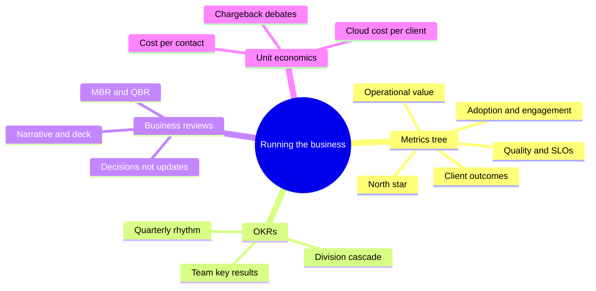
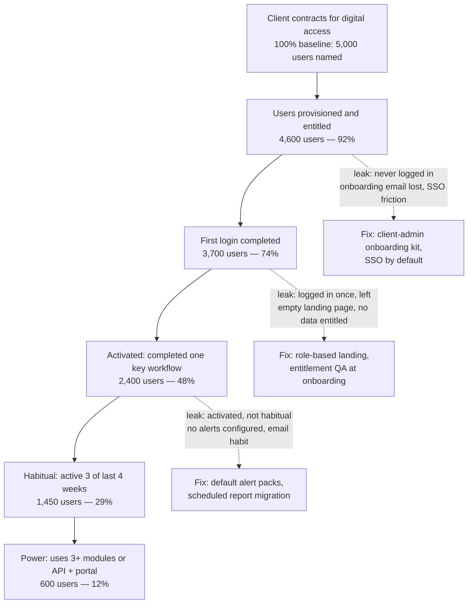
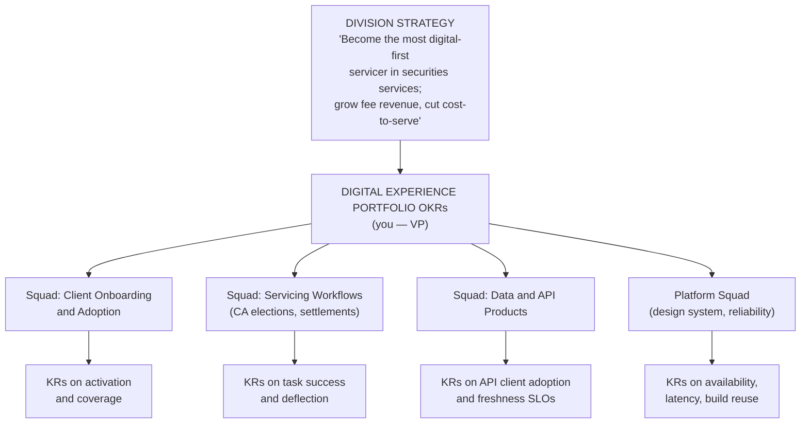
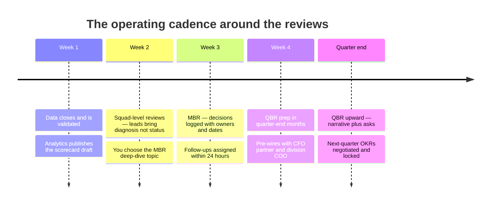

# Day 26 — Metrics, OKRs and Running the Business

> Week 4 · The Executive Playbook · Est. reading time: 60–90 min

---

## 🎯 Learning objectives

By the end of today you can:

- Draw a full metrics tree for a B2B digital experience platform — from a north star down to instrumentable events — and defend every branch.
- Distinguish adoption, engagement, quality, operational value, and client-outcome metrics, and name the two or three that matter at each level of the tree.
- Spot and kill vanity metrics (raw pageviews, total registered users) before they reach an executive deck.
- Translate SLOs and error budgets into language a COO and a client executive both respect.
- Write an OKR cascade from division strategy to team-level key results, with two fully worked quarters as a model.
- Run a monthly/quarterly business review that executives actually want to attend: deck structure, narrative arc, and meeting mechanics.
- Reason about unit economics — cloud cost per client, cost per digital interaction — and hold your own in a chargeback debate.

---

## 🧭 Where this fits

Weeks 1–3 built the machine: custody operations, the product discipline, the technology and data stack. Week 4 is about *running* it as an executive. Today is the instrument panel. A VP who cannot quantify what their platform does for clients and for the P&L is negotiating budget with adjectives. Metrics are also your defense system: when a stakeholder claims "clients hate the portal" or "nobody uses that feature," the tree either confirms it or kills it in one slide. Everything today connects backward — the event backbone from Day 17 feeds the instrumentation, the personas from Week 2 segment the adoption numbers — and forward: Day 27's risk KRIs and Day 28's engineering health metrics hang off the same discipline.

---

## Part 1 — Core concepts

### 1.1 The north star for a B2B digital experience platform

A **north star metric** captures the value clients get from your product in one number that, if it grows, the business almost certainly benefits. For a consumer app it might be weekly listening hours. For a custodian's client-facing digital platform, the strongest candidate is:

> **% of client interactions self-served digitally** — of all the times a client needed something from the bank this month (a report, a status, an instruction, an answer), what fraction did they complete through the portal, APIs, or data feeds without a human touch?

Why this one wins:

- It is a **ratio, not a raw count**, so it cannot be inflated by client growth or seasonality.
- It aligns client value (faster, 24/7, no phone tag) with bank value (every self-served interaction avoids an ops touch that costs real money — worked example in 1.4).
- It forces honesty about the denominator: you must count the emails and calls too, which means partnering with client service to measure the whole interaction volume, not just your slice.

Credible alternates, each with a flaw worth knowing:

| Candidate north star | Strength | Flaw |
|---|---|---|
| % interactions self-served digitally | Ratio; aligns client + bank value | Denominator requires ops/service data you don't own |
| Weekly active entitled users (WAEU) | Easy to instrument | Activity ≠ value; a confused user retrying is "active" |
| Digital task success rate | Purest quality signal | Doesn't grow with adoption; can be high on a tiny base |
| Client digital NPS/CSAT | Board-friendly | Lagging, low sample size in B2B, survey fatigue |
| API + portal data consumption per client | Fits data-business strategy | Volume can grow while experience decays |

**VP position:** pick the self-service ratio as north star, keep WAEU and task success as the two supporting "guardrail" metrics. One north star, two guardrails, everything else lives in the tree.

### 1.2 The metrics tree

A north star you cannot decompose is a slogan. The tree below is the working structure; each layer must be attributable to teams who can move it.

```mermaid
flowchart TD
    NS["NORTH STAR<br/>% of client interactions<br/>self-served digitally"]
    NS --> AD["ADOPTION<br/>Are the right people using it?"]
    NS --> EN["ENGAGEMENT<br/>Are they using it deeply?"]
    NS --> QU["QUALITY<br/>Does it work when they try?"]
    NS --> OV["OPERATIONAL VALUE<br/>What does the bank save?"]
    NS --> CO["CLIENT OUTCOMES<br/>Does it keep and win business?"]
    AD --> AD1["Entitled vs active users<br/>(activation rate)"]
    AD --> AD2["Feature adoption by persona<br/>(ops analyst vs PM vs CIO office)"]
    AD --> AD3["Client-account coverage<br/>(% of clients with >1 weekly active user)"]
    EN --> EN1["Weekly active per entitled user"]
    EN --> EN2["Session depth on key workflows<br/>(CA elections, cash reporting, recon)"]
    EN --> EN3["Alert and API subscription growth"]
    QU --> QU1["Task success rate per workflow"]
    QU --> QU2["Error rate and failed-search rate"]
    QU --> QU3["Page performance p95"]
    OV --> OV1["Ticket deflection rate"]
    OV --> OV2["Ops touches avoided per month"]
    OV --> OV3["Cost per client contact"]
    CO --> CO1["Digital score in client health index"]
    CO --> CO2["Retention influence<br/>(digital usage vs renewal)"]
    CO --> CO3["RFP win contribution<br/>(digital demo cited in wins)"]
```

Notes on the branches that trip people up:

- **Entitled vs active** is the B2B version of "registered vs active" — but sharper, because entitlement was deliberately provisioned (Day 14). If 4,000 users are entitled to the corporate-actions module and 700 used it this month, your activation is 17.5% and you know *exactly who* the other 3,300 are, by client, by persona. That's a campaign list, not a mystery.
- **Feature adoption by persona** matters because B2B usage is role-shaped. A cash-management dashboard at 8% overall adoption might be at 85% among treasury operations analysts — its actual audience. Always cut adoption by persona before declaring a feature dead.
- **Client-account coverage** protects you from concentration: 10,000 weekly actives means less if 60% come from five mega-clients. Coverage — % of client organizations with at least one weekly active user — is the metric a head of client management will ask about.

### 1.3 Vanity metrics in B2B — the blacklist

| Vanity metric | Why it flatters | What to use instead |
|---|---|---|
| Raw pageviews | Confused users generate more of them | Task success rate; time-to-complete |
| Total registered users | Monotonic — it can only go up | Weekly active per entitled |
| Logins per day | Forced re-auth inflates it; SSO deflates it | Sessions with a completed key workflow |
| Features shipped | Output, not outcome | Feature adoption at 90 days by persona |
| Total API calls | One client's retry loop can double it | Distinct clients consuming each API product |
| Average session duration | Ambiguous — delight or struggle? | Session depth on named workflows |

The tell of a vanity metric: **it cannot go down when the product gets better.** A brilliant redesign that lets a user finish in two clicks *reduces* pageviews, session duration, and logins. If your dashboard would punish that redesign, the dashboard is broken.

### 1.3b Leading vs lagging, and counter-metric pairs

Two more disciplines before the tree is complete:

**Leading vs lagging.** Client retention is a lagging metric — by the time it moves, the causes are 12–18 months old. Every lagging metric on your scorecard needs a leading proxy you can act on this quarter:

| Lagging metric (what the board sees) | Leading proxy (what you manage weekly) | Typical lead time |
|---|---|---|
| Client retention / renewal | Weekly active coverage per client org; declining-usage alerts | 6–12 months |
| Digital NPS (annual survey) | Task success rate; failed-search rate; support-ticket sentiment | 1–3 months |
| Deflection savings (finance-signed) | Ticket volume by deflectable category | 1–2 months |
| RFP win rate citing digital | Demo requests, sandbox API signups by prospects | 3–9 months |

**Counter-metric pairs.** Any target pursued alone will be gamed — usually innocently, by teams doing exactly what you asked. Pair every headline KR with the metric that would reveal the pathology:

| Headline metric | Pathology if pursued alone | Counter-metric to pair |
|---|---|---|
| Ticket deflection rate | Burying the "contact us" button | CSAT on unresolved journeys; call volume (did it just shift channel?) |
| Weekly active per entitled | Nagging notifications inflate opens | Alert opt-out rate; session depth |
| Activation rate | Onboarding pushes users into workflows they don't need | 90-day retention of activated users |
| Page latency p95 | Stripping the page of the data clients came for | Task success rate |
| API client adoption | Free access with no support model | API error rate per client; support cost per API client |

When you review a squad's OKRs, your fastest quality check is: *where are the counter-metrics?* A KR set with no tension in it is a KR set that hasn't been thought through.

### 1.4 Operational value — the cost-per-contact worked example

This is the branch that pays for your roadmap, so learn the arithmetic cold.

**Setup (representative numbers for a large custodian's client service function):**

| Channel | Volume per month | Fully-loaded cost per contact | Monthly cost |
|---|---|---|---|
| Phone call to client service | 40,000 | $18 | $720,000 |
| Email/case handled by ops | 110,000 | $11 | $1,210,000 |
| Portal self-service interaction | 600,000 | $0.45 | $270,000 |
| **Total** | **750,000** | — | **$2,200,000** |

Cost per contact blends salary, management, tooling, and premises over handled volume; $11–18 per human contact is a defensible range for skilled securities-services staff, versus well under $1 for a digital interaction (infrastructure amortized over volume).

**The move:** suppose you ship a self-service settlement-status tracker and improved failed-trade search, and over two quarters they deflect 15% of email cases and 10% of calls:

- Emails deflected: 110,000 × 15% = 16,500/month → savings 16,500 × ($11 − $0.45) ≈ **$174,000/month**
- Calls deflected: 40,000 × 10% = 4,000/month → savings 4,000 × ($18 − $0.45) ≈ **$70,200/month**
- **Total ≈ $244,000/month ≈ $2.9M annualized** — against, say, a two-squad two-quarter build costing ~$1.4M. Payback inside six months, and the savings recur.

Two honesty rules that keep finance on your side: (1) claim **deflection you can trace** — tickets whose category volume actually fell after launch, ideally with a holdout comparison — not theoretical maximums; (2) savings are real only if ops **redeploys or reduces** the capacity; otherwise present it as "avoided cost growth" during client growth, which is still a strong story and more defensible.

---

## Part 2 — The system deep dive

### 2.1 Instrumenting properly — the event taxonomy

Metrics are manufactured, and the raw material is events. The failure mode in large banks is every team naming events ad hoc (`btnClick_v2_final`), making cross-product analysis impossible. Impose a taxonomy:

**Event grammar:** `object_action` in past tense, with a governed property schema.

| Element | Standard | Example |
|---|---|---|
| Event name | `object_action`, snake_case, past tense | `corporate_action_election_submitted` |
| Actor properties | hashed user id, persona, client id, entitlement scope | `persona: ops_analyst` |
| Context properties | surface, module, session id, correlation id | `surface: portal_web` |
| Outcome properties | success flag, error code, duration ms | `duration_ms: 3400` |
| Governance | schema registry; new events reviewed like API changes | analytics guild sign-off |

The **correlation id** is the connection to Day 17: the same event backbone that streams settlement-status and corporate-action events to clients also lets you join a *product analytics* event ("user viewed failed-trade screen") to the *business* event ("trade SETL-99871 failed, reason: insufficient securities"). That join is what elevates your analytics from "users clicked things" to "clients whose trades fail self-serve the diagnosis 72% of the time and call us the other 28% — here is why."

Instrumentation is a **definition-of-done item**, not a fast-follow. A feature that ships without its events shipped nothing you can manage.

**Metric definitions must survive audit.** In a bank, the numbers you present upward will eventually be quoted — in a QBR, a client meeting, possibly a regulatory response. Every scorecard metric therefore gets a one-page definition of record:

| Definition element | Example for "weekly active per entitled" |
|---|---|
| Precise formula | Distinct users with ≥1 qualified session in ISO week ÷ users entitled ≥14 days |
| Qualification rules | Session must include an authenticated page view or API call; monitoring synthetics and internal staff excluded |
| Source of truth | `analytics.weekly_active_v3` in the governed warehouse (Day 18) — never a spreadsheet |
| Known caveats | SSO batch re-provisioning inflates entitled count in the first week of each quarter |
| Owner and change log | Analytics lead; definition changes versioned and announced like API changes |

The moment two decks show two different values for "active users," every number you own loses credibility. One pipeline, one definition of record, versioned changes — this is cheap insurance for your reputation.

### 2.2 The adoption funnel — where entitled users leak

Each stage conversion is a team-ownable metric. The biggest, cheapest wins in B2B are almost always at the top of the funnel: users who were entitled and *never arrived*. Nobody owns that gap by default — client onboarding thinks it's product's job, product thinks it's onboarding's. Own it.

### 2.3 Platform health — SLOs and error budgets in executive language

An **SLO** (service level objective) is an internal reliability target on a metric a client actually feels (an SLI). The **error budget** is the allowed shortfall: a 99.9% monthly availability SLO permits ~43 minutes of unavailability. Budget remaining = permission to ship; budget exhausted = the release brake engages.

| SLI | SLO | Monthly error budget | Executive translation |
|---|---|---|---|
| Portal availability (business hours, all regions) | 99.9% | ~26 min (of 43,800 business min) | "Clients can lose the portal for at most half an hour a month before we treat it as a crisis" |
| API availability | 99.95% | ~22 min (24×7) | "Client systems depend on us programmatically — tighter than the portal" |
| Page latency, p95 key workflows | < 2.0 s | 5% of requests may exceed | "19 of 20 page loads feel instant on the screens that matter" |
| Data freshness: settled positions on portal | < 15 min after books update | 2% of updates may lag | "What the client sees is at most 15 minutes behind the ledger" |
| NAV publication to portal after ops sign-off | < 5 min | 1 late publication | "When accounting signs the NAV, the client sees it within 5 minutes" |
| Alert delivery latency | < 60 s from event | 0.5% may exceed | "A deadline alert that arrives late is an alert that failed" |

Three executive framings worth memorizing:

1. **"The error budget is a shared bank account between velocity and reliability."** Spending it on planned change (progressive rollouts, migrations) is healthy; draining it on repeat incidents means we stop feature work and pay down reliability debt. This converts an emotional fight (product vs SRE) into arithmetic.
2. **Data freshness is a first-class SLO, not an afterthought.** In custody, a portal that is *up* but showing yesterday's positions is arguably worse than a portal that is down — clients act on stale numbers. (Day 27 picks this up as misstatement risk.)
3. **SLOs are internal and deliberately tighter than contractual SLAs.** The SLA in the client agreement might be 99.5% with service credits; you run to 99.9% so that ordinary bad months never become contractual events.

### 2.4 The OKR cascade

OKRs work at a bank only if they cascade with a *loose coupling*: each level's objectives support the level above without being mechanically derived from it (that's how you get teams with agency instead of task lists).

**Worked Quarter 1 (Q3 FY26) — portfolio level:**

| | Objective / Key result | Baseline → target |
|---|---|---|
| **O1** | Make self-service the default way clients interact with us | — |
| KR1.1 | % of client interactions self-served digitally | 68% → 74% |
| KR1.2 | Email cases in top-3 deflectable categories | −20% (110k → 88k/mo) |
| KR1.3 | Clients with >1 weekly active user | 71% → 80% |
| **O2** | Earn trust on the workflows where money moves | — |
| KR2.1 | Corporate-action election task success rate | 87% → 95% |
| KR2.2 | Election-deadline alerts delivered < 60 s | 97.1% → 99.5% |
| KR2.3 | Zero severity-1 incidents on election or instruction flows | 2 last q → 0 |
| **O3** | Turn data delivery into a product, not a project | — |
| KR3.1 | Clients consuming ≥1 self-service API product | 34 → 60 |
| KR3.2 | Custom one-off report requests per month | 210 → 140 |

**Worked Quarter 2 (Q4 FY26) — note the deliberate shift from adoption to depth and economics:**

| | Objective / Key result | Baseline → target |
|---|---|---|
| **O1** | Convert activation into habit | — |
| KR1.1 | Weekly active per entitled user | 31% → 38% |
| KR1.2 | Users with ≥1 configured alert pack | 22% → 45% |
| KR1.3 | Habitual users (3 of 4 weeks) among activated | 60% → 68% |
| **O2** | Make reliability a sales asset | — |
| KR2.1 | Publish client-facing status page + monthly reliability report | shipped by wk 6 |
| KR2.2 | Portal availability SLO attainment | 99.87% → ≥99.9% for 3 consecutive months |
| **O3** | Prove the economics | — |
| KR3.1 | Cost per client contact (blended) | $2.93 → $2.40 |
| KR3.2 | Traced annualized deflection savings signed off by finance | $0 → $2.5M |
| KR3.3 | Cloud cost per active client account | $410/mo → $360/mo |

Cascade rules that keep this honest: teams write their own KRs *after* seeing yours (two-way negotiation, one week); no more than 3 objectives per level; every KR maps to a node in the metrics tree; targets are 70%-confidence ambitious, and grading below 1.0 is expected, not punished — but *sandbagging* is.

---

## Part 3 — The VP lens

### 3.1 The business review — deck, narrative, meeting

You will run a **monthly business review (MBR)** with your leadership team and present a **quarterly business review (QBR)** upward. The deck structure that works:

| Slide | Content | Time |
|---|---|---|
| 1. Scorecard | North star + guardrails + SLO attainment, RAG-status, trend arrows | 3 min |
| 2. The narrative | One paragraph: "The quarter in three sentences" — what moved, why, what we're doing | 5 min |
| 3. Deep dive | ONE topic examined properly (chosen from what the scorecard flags) | 15 min |
| 4. OKR progress | Confidence per KR (not % complete — confidence to hit) | 5 min |
| 5. Economics | Deflection traced, cloud unit costs, budget vs actuals | 5 min |
| 6. Risks and asks | Top 3 risks with owners; the specific decisions you need | 10 min |
| Appendix | Full metrics tree — never presented, always available | — |

Meeting mechanics that separate good MBRs from theater: **pre-read sent 48 hours ahead and assumed read** (start at slide 2); the deep dive is a *diagnosis*, not a status ("adoption of the recon module fell 6 points; we traced it to an entitlement migration that silently dropped 400 users; fix ships Friday; systemic prevention is X"); **every meeting ends with logged decisions** — an MBR that produces no decisions was an email; and you personally model the response to bad news, because the first time someone gets flamed for a red metric is the last time you see a red metric.

### 3.2 Unit economics and the chargeback debate

Your platform's cloud and vendor costs will be allocated somewhere, and *how* they're allocated changes behavior. Know the three models:

| Model | Mechanics | Behavior it drives | Your position |
|---|---|---|---|
| Central absorption | Corporate IT eats the cost | Nobody economizes; you fight annual budget battles blind | Oppose — you lose cost visibility |
| Full chargeback per consumption | Business units billed per API call / seat / GB | Units ration usage — including usage you *want* (client adoption!) | Dangerous for a growth-stage platform |
| Showback + unit-cost targets | Costs are visible per unit and client; VP owns cost-per-active-client target | Economizing without taxing adoption | **Advocate this** |

The number to own: **cloud cost per active client account per month**. Worked: $2.4M/year platform run cost ÷ 490 active client organizations ≈ $408/month/client. Now you can answer the CFO's real questions — is it trending down as we scale (it should: fixed costs amortize)? Which architectural choices move it (Day 16's compute-storage separation, right-sizing, egress)? And in a chargeback debate, you can concede visibility while resisting per-click billing: "charge the *businesses* for the platform in proportion to their clients' usage, but never meter individual client interactions — we do not want a sales team discouraging portal adoption to save an internal transfer charge."

### 3.3 When metrics conflict — a diagnosis walkthrough

**The situation:** adoption up 9 points over two quarters; digital CSAT down from 7.8 to 7.1. Your president asks which number is lying. Answer: probably neither — run the diagnosis:

1. **Decompose the satisfaction drop by cohort.** New users (arrived during the adoption push) vs tenured users. Finding: tenured users stable at 7.9; new users at 6.2. The blended average fell because the *mix* changed — you onboarded thousands of novices. This is Simpson's paradox in the wild, and it's the most common resolution.
2. **Check quality metrics for the new cohort's workflows.** Task success for first-month users: 71% vs 89% for tenured. The product assumed knowledge new users don't have.
3. **Check whether the adoption push outran entitlement quality.** Sampling shows 12% of new users were entitled to modules with no data for their accounts — they landed on empty screens. (Funnel leak L2 from 2.2.)
4. **Decide.** The adoption campaign is working *and* the onboarding experience is failing the very users it recruited. Actions: first-run experience and guided setup for the top three workflows; entitlement QA added to client onboarding; CSAT reported by tenure cohort from now on so mix shifts are visible.

The generalizable lesson: **conflicting metrics are usually a segmentation problem, not a data problem.** Decompose before you adjudicate.

### 3.4 The stakeholder map for your numbers

Different executives read the same tree through different lenses. Tune the cut of the data, not the data itself — one source of truth, many views:

| Stakeholder | What they check first | The trap to avoid | What earns trust |
|---|---|---|---|
| Division president | North star trend; client health flags | Drowning them in the full tree | Three numbers and one narrative, consistent quarter to quarter |
| CFO / finance partner | Deflection traceability; unit costs; budget vs actuals | Claiming untraced savings | Conservative claims they can defend upward |
| COO / head of operations | Ticket volumes; ops touches; where digital creates ops work | Framing deflection as headcount cuts in *their* org | Co-owned deflection targets; sharing credit publicly |
| Head of client management | Coverage per client; at-risk usage patterns | Surfacing a client problem to them last | Declining-usage alerts routed to them *first* |
| Sales / pursuit leads | Demo-ready metrics; reliability stats for RFPs | Letting stale numbers reach an RFP response | A maintained "digital fact pack" refreshed monthly |
| CTO / engineering peers | SLO attainment; error-budget burn; cloud unit costs | Weaponizing SLO misses in exec forums | Joint ownership of the reliability narrative |
| Risk and compliance (Day 27) | Data-freshness SLOs; incident metrics; KRI feeds | Building them a separate, inconsistent dashboard | One pipeline serving product and risk reporting |

The pattern across every row: **surprises destroy trust faster than bad numbers do.** A stakeholder who learns about a red metric in your deck before you've told them privately becomes an adversary; the same stakeholder pre-wired 48 hours earlier becomes a co-owner of the fix.

### 3.5 Questions to ask your teams

- "Show me the event schema for the feature you're shipping this sprint." (Instrumentation as definition-of-done.)
- "Which node of the metrics tree does this initiative move, by how much, and when will we see it?"
- "What's our activation rate for users entitled in the last 90 days — and who owns the never-logged-in list?"
- "How much error budget do we have left this month, and what's the plan if we exhaust it?"
- "If I gave you no roadmap input, what KRs would you set for next quarter?" (Tests whether the cascade grew agency or task lists.)
- "Which of our current dashboard metrics could go *up* while the product gets worse?" (Vanity-metric hunt.)

---

## 🏦 State Street context

*Representative of State Street and large custodians generally; grounded in public knowledge.*

- State Street's digital front doors — **my.statestreet.com** (the client portal), **State Street Alpha** (the front-to-back platform anchored by Charles River), and API/data channels — serve institutional clients whose relationships are measured in basis points on trillions. The metrics tree here differs from consumer tech in one crucial way: **the paying client (the fund company) and the daily user (an ops analyst) are different people.** Your tree must ladder user-level engagement up to client-organization-level health, because renewal decisions are made at the organization level.
- Fee compression (Day 1) is the macro backdrop: with blended servicing fees around a basis point and perpetually negotiated downward, **cost-to-serve is a board-level metric**. A digital experience VP who can show traced deflection and falling cost per contact is directly supporting the operating margin story State Street tells investors each quarter — expense discipline and technology-driven productivity are recurring themes in its public earnings narrative.
- Client counts are small and stakes are huge: State Street's business concentrates in hundreds of large institutional relationships, not millions of users. That means **CSAT samples are tiny** (treat survey deltas cautiously; prefer behavioral metrics), and a single mega-client's usage pattern can distort any average — always report coverage and medians alongside means.
- Digital capability shows up in **RFPs and due-diligence questionnaires**: prospective clients score portals, data access, and APIs during custodian selection. Logging when your platform is demoed in a pursuit, and whether the deal was won, is how the "RFP win contribution" branch of the tree gets real data — coordinate with the sales enablement team rather than guessing.
- As a G-SIB, State Street's regulators expect operational metrics too — the same SLO discipline you run for product reasons feeds operational-resilience reporting (Day 27). Build the SLO dashboard once, serve both masters.

---

## 💪 Exercises

1. **Build your tree.** On one page, draw the metrics tree for the digital platform you know best (or this book's representative portal). For every leaf, write the exact event(s) that would compute it and which team owns moving it. Circle any leaf you currently cannot measure — that's your instrumentation backlog.
2. **Run the cost-per-contact math with your own assumptions.** Change the deflection rates in 1.4 to pessimistic values (5% email, 3% calls). Does the two-squad investment still pay back inside 18 months? Write the three-sentence version you'd say to a CFO.
3. **Draft one quarter of OKRs** for a single squad (pick the Servicing Workflows squad), given the portfolio OKRs in 2.4. Maximum 2 objectives, 3 KRs each, every KR tied to a tree node with baseline → target. Then stress-test: could a team hit every KR while making the product worse? If yes, fix the KRs.
4. **Write the deep-dive slide.** Take the conflicting-metrics scenario in 3.3 and compress the entire diagnosis into one slide: headline finding, one chart you'd show (sketch it), three actions with owners and dates. Practice delivering it aloud in under four minutes — the MBR deep dive is a spoken genre, not a document.
5. **Audit a real dashboard** (any product dashboard you've owned or seen). Mark each metric L (leading) or G (lagging), V if it fails the vanity test, and U if it has no counter-metric. Count the survivors. Most dashboards keep fewer than half their metrics after this audit.

---

## ❓ Self-check quiz

1. Why is "% of client interactions self-served digitally" a stronger north star than "weekly active users" for a custodian's client platform?
2. A stakeholder proposes "total logins" as a headline metric. Give two reasons it fails the vanity test and one replacement.
3. Your portal availability SLO is 99.9% monthly and you've used 30 of ~43 minutes of error budget by mid-month. What are your options as VP, in error-budget language?
4. Adoption of a new module is 9% overall. Before declaring it a failure, what two cuts of the data do you demand?
5. In the conflicting-metrics walkthrough, why did blended CSAT fall even though no user group became less satisfied?

Answers

1. It's a ratio that can't be inflated by client growth; it aligns client value (speed, 24/7 access) with bank value (avoided ops cost); and it forces measurement of the full interaction denominator including calls and emails. WAU counts activity, which can reflect confusion or forced usage rather than value.
2. Logins can rise from re-auth friction or fall from SSO improvements — it moves for reasons unrelated to value, and it cannot distinguish a productive session from a failed one. It can't go down when the product improves (fewer logins needed to get the same value). Replacement: sessions containing a completed key workflow, or weekly active per entitled user.
3. Roughly 13 minutes of budget remain. Options: slow or freeze risky releases for the rest of the month (the brake), require progressive rollout/feature flags for anything that must ship, prioritize the reliability fixes causing the burn, and if the burn came from planned change rather than incidents, decide consciously whether the remaining budget is worth spending. The point is it's an explicit trade, not a fight.
4. Cut by persona (is adoption high among the module's actual target role?) and by entitlement/data quality (were users entitled correctly and did they have data to see?). Optionally cohort by client segment. 9% overall could hide 85% adoption in the target persona.
5. Simpson's paradox via mix shift: the adoption push added a large cohort of new users whose satisfaction is naturally lower (6.2) than tenured users (7.9, unchanged). The blended average fell because the population composition changed, not because any cohort's experience degraded — which is why CSAT should be reported by tenure cohort.

---

## 🔑 Key takeaways

- One north star (self-service ratio), two guardrails (WAEU, task success), and a full tree beneath — every leaf instrumented, owned, and connected to the Day 17 event backbone via correlation ids.
- A metric that cannot go down when the product improves is a vanity metric; audit your dashboard against that test.
- Operational value is your funding engine: traced deflection at ~$11–18 per human contact avoided turns roadmap debates into payback arithmetic — but only claim what finance will sign.
- SLOs are internal targets tighter than contractual SLAs; the error budget converts the velocity-vs-reliability fight into a shared account. Data freshness is a first-class SLO in custody.
- OKRs cascade loosely: teams draft their own KRs against your objectives; every KR maps to a tree node; three objectives max per level.
- Business reviews exist to produce decisions. Pre-read assumed, one real deep-dive diagnosis, risks with owners, asks made explicit — and model calm at red metrics.
- In chargeback debates, fight for showback plus unit-cost targets; never let internal metering tax the client adoption you're paid to grow.
- Conflicting metrics are usually a segmentation problem — decompose by cohort before adjudicating.

---

## 📚 Going deeper

- John Doerr, *Measure What Matters* — the OKR canon; read critically, it undersells cascade failure modes.
- Google SRE Book (sre.google/books) — chapters on SLOs and error budgets; free online.
- Amplitude's "North Star Playbook" — free, consumer-flavored but the decomposition method transfers.
- Douglas Hubbard, *How to Measure Anything* — for "unmeasurable" things like RFP win contribution.
- State Street quarterly earnings materials (investors.statestreet.com) — watch how servicing fees, expense discipline, and technology narratives are presented to the street; your QBR should rhyme with them.
- Christina Wodtke, *Radical Focus* — the shortest useful book on making OKRs an operating rhythm rather than a form to fill in.
- FinOps Foundation (finops.org) — free framework and vocabulary for the cloud unit-economics and showback/chargeback conversation.

---

## Tomorrow

Day 27 — the metrics you *must* keep are joined by the rules you must obey: risk, compliance, and regulation, and how a product VP ships fast inside a G-SIB without ending up in a regulator's findings letter.
