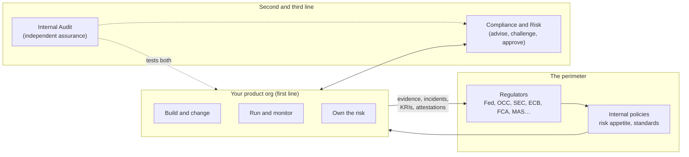
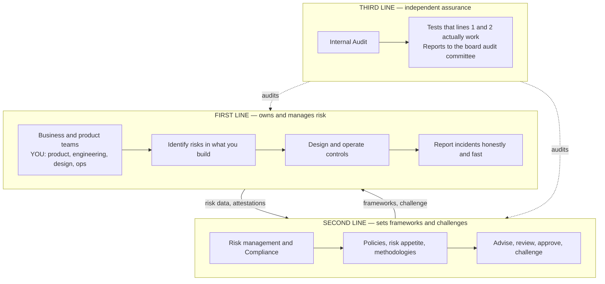
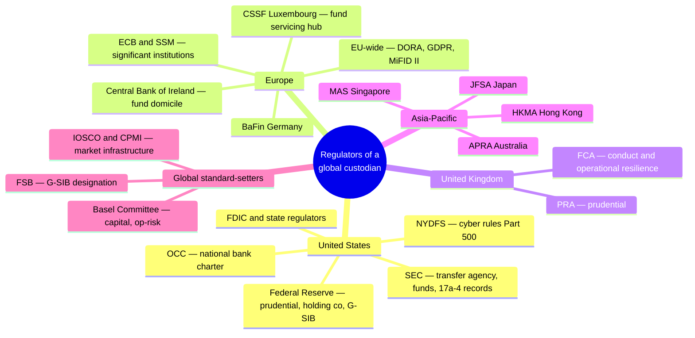
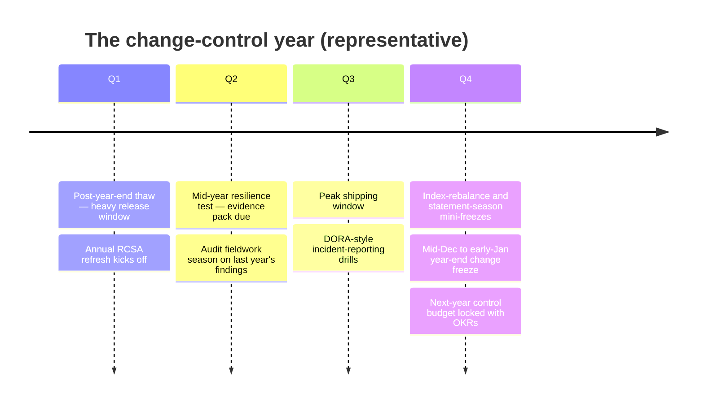
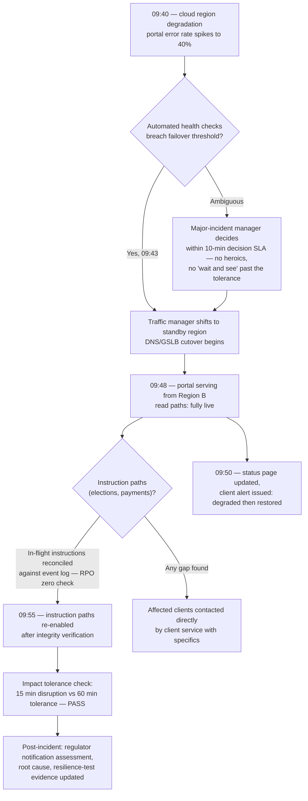
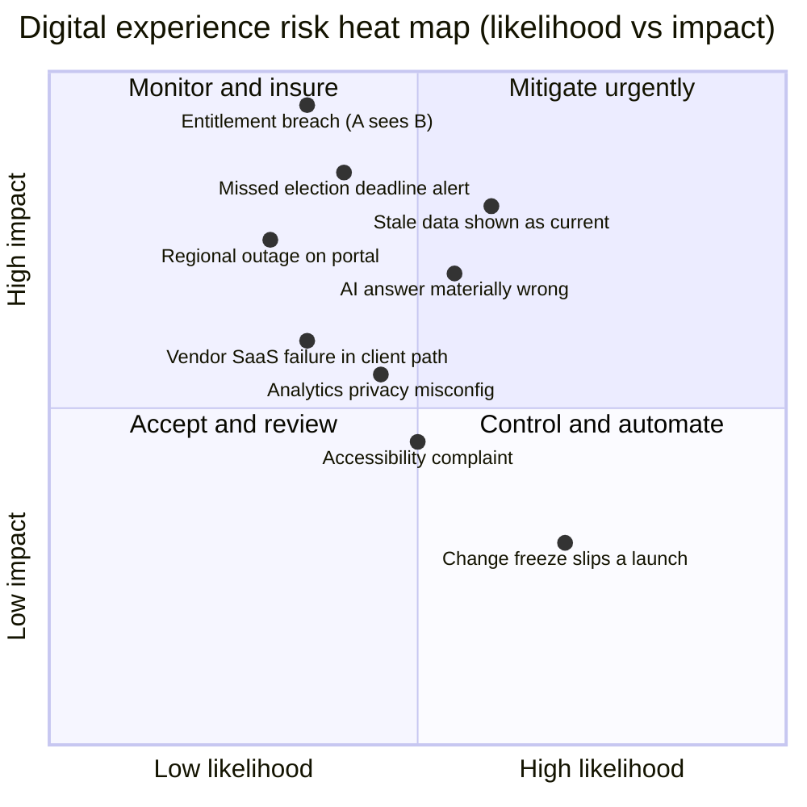

# Day 27 — Risk, Compliance and Regulation for a Product VP

> Week 4 · The Executive Playbook · Est. reading time: 60–90 min

---

## 🎯 Learning objectives

By the end of today you can:

- Place product development correctly in the three-lines-of-defense model — and explain why "first line" means *you own your risk*, not "risk is someone else's job."
- Translate operational-risk machinery (RCSAs, incidents, near-misses, KRIs) into digital-product terms your teams recognize.
- Sketch the regulator map for a global custodian and explain why G-SIB status raises the bar on everything you ship.
- Name the regulations that directly shape client-facing digital products — DORA, SEC 17a-4, GDPR/CCPA, accessibility mandates, NYDFS 500 — and what each demands of your roadmap.
- Ship safely inside bank change controls: CABs, change freezes, progressive rollouts, and feature flags framed in language auditors accept.
- Run the compliance-approval journey for a new feature end-to-end, using a client-facing AI chat launch as the worked case.
- Explain RTO/RPO and walk through a portal region-failover scenario as a resilience story, not a technology story.

---

## 🧭 Where this fits

Everything you built in Weeks 1–3 operates inside a perimeter of rules. This is not decoration: at a custodian, the *product* is trust, and the risk-and-compliance apparatus is how a G-SIB proves it deserves that trust to clients and to roughly a dozen regulators simultaneously. VPs who treat compliance as a tollbooth ship slowly and resentfully; VPs who understand the machinery ship *faster*, because they design approvable things the first time. Yesterday gave you the instrument panel; today gives you the flight rules. Day 28 (teams) and Day 29 (your own trajectory) both assume you can operate credibly in this environment — nothing marks an executive as junior faster than being surprised by their own first line obligations.



---

## Part 1 — Core concepts

### 1.1 The three lines of defense — and where you sit

The **three lines of defense** is the standard governance model in banking:



The sentence to internalize: **as a product VP you are first line, which means you OWN the risk in your products.** Compliance does not own it. Risk does not own it. When an entitlement bug shows Client A's positions to Client B, the finding lands on *your* control environment, and "compliance approved the design" is not a defense — their approval was advice on *your* risk decision. This is liberating once absorbed: first-line ownership means you get to *design* the controls (as product features, with UX), rather than having controls bolted on by people who don't know your system.

### 1.2 Operational risk, translated to digital products

Custody's dominant risk is **operational risk** — loss from failed processes, people, systems, or external events (Day 1's table). The machinery:

| Instrument | What it is | Digital-product translation |
|---|---|---|
| **RCSA** (Risk and Control Self-Assessment) | Periodic first-line inventory: what could go wrong, what controls exist, how effective are they | For each product surface: what's the worst thing this screen/API could do? Rate likelihood × impact; document the control (test, review, monitor) |
| **Incident** | A risk event that happened; logged, root-caused, remediated, sometimes reported externally | Sev-1 portal outage; wrong NAV displayed; entitlement breach — with a regulatory-notification decision tree attached |
| **Near-miss** | Almost happened; caught by a control or luck | Bad entitlement change caught in UAT; a feature flag that saved you. **Log these** — near-miss data is how you prove controls work |
| **KRI** (Key Risk Indicator) | Leading metric with thresholds that trigger escalation | Failed login spike, entitlement-change error rate, data-freshness SLO burn, % changes bypassing CAB |
| **Risk appetite** | Board-approved statement of how much risk the firm accepts | "Zero appetite for client data confidentiality breaches" → your entitlement testing budget is not discretionary |
| **Issues and findings** | Formally tracked control gaps (self-identified, audit, or regulator) with remediation dates | Miss a regulator-finding date and it escalates to the board. Treat finding dates like client-committed launches — harder, actually |

Two translations worth burning in, because they're specific to *your* mandate:

- **Wrong data shown to a client = misstatement risk.** If your portal shows a stale or mis-joined position and the client trades or reports on it, the bank faces client claims and regulatory scrutiny. This is why Day 26 made data freshness a first-class SLO and why every screen showing accounting data needs an as-of timestamp and a source-of-record lineage (Day 18).
- **An entitlement bug = a data leak.** Client A seeing Client B's holdings is a confidentiality breach between competitors, potentially reportable under privacy law and client contracts. Entitlement logic (Day 14) is not an access-control detail; it is one of your highest-severity risk controls and deserves RCSA-level testing rigor, canary checks in production, and a KRI.

**Worked example — what an operational-risk event actually costs.** Suppose a data-join defect causes your portal to display corporate-action deadlines one day late for 14 clients over a weekend, and two clients miss an election on a voluntary tender. Direct loss: making clients whole for the economic difference — say the tender premium was 4% on positions of $18M and $7M, so ~$720k + $280k = **~$1.0M compensation**. Indirect costs: an incident investigation consuming ~400 staff-hours (~$60k), a control remediation program (~$350k of engineering time), heightened client scrutiny in the next service review, and an entry in the firm's loss-event database that feeds operational-risk capital modeling. Total cost: **~$1.4M plus reputation**, against a defect that a $40k investment in deadline-data reconciliation checks would have caught. This asymmetry — small control investments versus large loss events — is the entire economic argument of operational risk, and it's why the RCSA conversation deserves your genuine attention rather than compliance-theater sighing.

### 1.3 The regulator map — and the G-SIB overlay

A global custodian answers to prudential regulators (is the bank safe?), markets/conduct regulators (is it treating clients and markets properly?), and data/operational regulators (privacy, resilience, cyber) — in every major jurisdiction where it operates.



**Why G-SIB status raises the bar:** the Financial Stability Board designates State Street a global systemically important bank — not for balance-sheet size but for *interconnectedness and substitutability*: if a top custodian stopped settling, a meaningful share of world markets would seize (Day 1). Practical consequences for you: capital surcharges fund a heavier control environment; **operational resilience expectations are existential**, not box-ticking (regulators run scenario exercises asking "prove the client channel recovers"); supervisors are *resident* — the Fed has staff dedicated to the firm year-round; and a finding in one jurisdiction travels, because regulators share notes via supervisory colleges. Your portal is not "a website"; in supervisory eyes it is part of the critical service delivery of a systemically important institution.

### 1.4 The regulations that directly shape your product

| Regulation | Jurisdiction | What it demands of a digital experience VP |
|---|---|---|
| **DORA** (Digital Operational Resilience Act, applies from Jan 2025) | EU | Map your "critical or important functions"; test resilience (including threat-led penetration tests); manage ICT third-party risk with **exit plans** for critical vendors; report major ICT incidents on strict clocks; register of information for all ICT contracts |
| **SEC Rule 17a-4 / books-and-records** | US | Communications and records retained immutably (WORM) for prescribed periods — includes portal messages, client chat, and potentially AI-chat transcripts; drives your archival architecture |
| **GDPR / CCPA and successors** | EU / California+ | Lawful basis for processing user data; data-subject rights (access, deletion) even for B2B portal users; cross-border transfer rules constrain where analytics and AI processing happen; privacy notices and consent for tracking |
| **Accessibility** — ADA (US case law), EN 301 549 / European Accessibility Act, WCAG 2.1/2.2 AA as de facto bar | US / EU | Client-facing surfaces must be accessible; institutional clients increasingly test this in due diligence; retrofit is 10× the cost of building it in (Day 12) |
| **NYDFS Part 500** | New York | CISO accountability, MFA, encryption, penetration testing, 72-hour breach notification — NY licensure makes it binding regardless of HQ |
| **Operational resilience regimes** (UK FCA/PRA SS1/21 and Basel principles) | UK / global | Define "important business services" (client digital channels usually qualify), set **impact tolerances** (e.g., "portal unavailable > X hours = intolerable"), test to them |
| **SR 11-7 / model risk** | US Fed | Anything predictive or generative in the client channel may be a "model" requiring validation — decisive for AI features (Part 2.3) |

You do not need to be a lawyer. You need to know **which regulation constrains which backlog item**, and to have a compliance partner who trusts you enough to give you practical answers.

### 1.5 Privacy and accessibility — the two that surprise B2B product leaders

**Privacy applies to your B2B users, not just "consumers."** The ops analyst at your pension-fund client is a natural person under GDPR; her login events, page views, and analytics profile are personal data. Practical consequences:

| Requirement | What it means for the portal |
|---|---|
| Lawful basis and transparency | Privacy notice covering portal analytics; legitimate-interest assessments documented for behavioral tracking |
| Data-subject rights | A user can request access to or deletion of *their* data — your event store (Day 26's taxonomy) needs user-level lookup and deletion paths that don't corrupt aggregates |
| Data minimization | Hash user identifiers in analytics; don't ship raw emails into third-party tools |
| Cross-border transfer | If EU users' events flow to a US analytics SaaS, you need a transfer mechanism — or EU-resident processing; this can veto a vendor selection outright |
| Cookies and tracking | Consent management on the portal, even though it's B2B; session-necessary vs analytics cookies distinguished |

**Accessibility is now a hard requirement, not a virtue.** The European Accessibility Act's obligations went live in June 2025 for many digital services; US ADA litigation reaches B2B financial portals; and — the commercially decisive part — **large institutional clients test accessibility in due diligence** because *their* obligations flow down. WCAG 2.2 AA is the working bar: keyboard-complete workflows, screen-reader-tested data tables (hard — your positions grids are exactly the worst case), contrast, and no information conveyed by color alone (your RAG statuses!). Build it into the design system once (Day 12) and every product inherits it; retrofit it and you'll pay per screen, forever.

---

## Part 2 — The system deep dive

### 2.1 Change risk — why banks freeze, and how product ships anyway

Banks control change because change causes most incidents. The apparatus: a **CAB** (change advisory board) reviews production changes for blast radius and timing; **change freezes** protect fragile high-stakes windows (year-end, quarter-end statement runs, major market events like an index rebalance or a T+1 migration weekend); emergency-change lanes exist with retroactive review. The naive product reaction is to fight the apparatus. The professional move is to **change the risk profile of your changes** so the apparatus can wave them through:

| Technique | What it does | How to frame it for auditors and the CAB |
|---|---|---|
| Progressive rollout (canary → 5% → 50% → 100%) | Limits blast radius; converts "big bang" to "contained experiment" | "A phased control with automated rollback criteria at each gate; evidence of each gate retained" |
| Feature flags | Decouples deploy from release; instant kill switch | "A reversible change mechanism with a documented owner, default-off state, and an audit log of every toggle" — and flags governing *client data visibility* are themselves change-controlled |
| Automated test evidence + CI gates | Replaces manual attestations | "Controls executed on every change with immutable logs" — auditors *prefer* automated controls; they sample logs instead of interviewing people |
| Standard pre-approved change types | High-frequency low-risk changes (copy, config) pre-classified | "Risk-assessed once, executed many times, with drift monitoring" |
| Deployment ≠ release during freezes | Code lands dark behind flags; nothing client-visible moves | Preserves engineering momentum through freezes without violating their purpose |

The deep insight: **auditors don't hate speed; they hate irreversibility and absence of evidence.** A team deploying daily behind flags with automated gates and full audit logs is *more* controlled than a team doing quarterly big-bang releases with manually signed checklists — and a good VP teaches their auditors exactly that, with evidence.

The annual rhythm you're operating inside, representative of a large custodian:



Plan the roadmap *around* this calendar rather than colliding with it: your biggest, riskiest launches belong in Q1–Q3 windows; Q4 is for dark deployments, hardening, and the control work you budgeted.

### 2.2 Vendor and third-party risk — the other half of build-vs-buy

Day 8's build-vs-buy decision has a risk tail: every vendor in a client-facing path becomes *your* regulatory problem. DORA makes this explicit — ICT third-party risk management is a named pillar, and critical ICT providers come under direct EU oversight. What first-line ownership means for the tools you buy:

- **Due diligence proportional to criticality:** a design-tool SaaS gets a questionnaire; the vendor inside your client-portal request path gets SOC 2 review, penetration-test evidence, resilience-test participation, and financial-viability checks.
- **Exit plans that are real:** for critical vendors, DORA expects a documented, *tested* exit strategy. "We would migrate to an alternative" is not a plan; a plan names the alternative, the data-egress mechanism, and the time to execute. This quietly changes build-vs-buy math: a vendor with proprietary data formats and no export path carries a resilience premium you must price in.
- **Concentration risk:** if your portal, data platform, and AI stack all sit on one cloud, regulators will ask about it. You don't necessarily need multi-cloud (often it's a false economy) — you need a *considered answer* with impact tolerances and failover evidence.
- **Fourth parties:** your vendor's vendors. The register of information under DORA wants the chain mapped for critical functions.

### 2.3 Worked walkthrough — launching client-facing AI chat through the approval journey

The scenario: your team wants to ship an AI assistant in the portal that answers questions like "why did trade X fail?" using entitled client data (Day 24's copilot). Here is the journey run *well* — engage early, co-design the controls, arrive at each gate with answers:

```mermaid
sequenceDiagram
    autonumber
    participant PM as Product
    participant Legal as Legal
    participant Comp as Compliance
    participant Risk as OpRisk
    participant MRM as ModelRisk
    participant Sec as InfoSec
    participant CAB as CAB
    PM->>Comp: Week 0 — concept note BEFORE build:<br/>use case, data used, guardrails proposed
    Comp-->>PM: Preliminary view: viable IF grounded-only answers,<br/>no advice, full transcript retention
    PM->>Legal: Client-terms review — is AI output covered<br/>by existing portal terms?
    Legal-->>PM: Requires disclosure banner + terms addendum;<br/>no "advice" language anywhere
    PM->>MRM: Model registration — is this in SR 11-7 scope?
    MRM-->>PM: Yes. Validation plan needed: grounding tests,<br/>hallucination rate benchmarks, ongoing monitoring
    PM->>Sec: Data-flow review: entitlement enforcement<br/>BEFORE retrieval, prompt-injection testing
    Sec-->>PM: Approved with pen-test of injection vectors
    PM->>Risk: RCSA update: new risks (wrong answer,<br/>data leak via retrieval), controls, KRIs
    Risk-->>PM: Risk acceptance at VP level documented;<br/>KRI: answer-accuracy sample audit weekly
    PM->>Comp: Formal approval pack: all above + 17a-4<br/>retention design for transcripts + kill switch
    Comp-->>PM: Approved for limited launch: 5 pilot clients,<br/>human-review sampling, 90-day checkpoint
    PM->>CAB: Change record: progressive rollout plan,<br/>flag default-off, rollback criteria
    CAB-->>PM: Scheduled. Launch.
```

What made this land in one pass instead of six months of ping-pong:

1. **The concept note at week 0.** Compliance reviewed a two-pager before a line of code — cheap to change, and it converted them from gatekeepers to co-designers.
2. **Requirements written so they can approve them.** Not "the AI will be safe" but testable statements: *answers are generated only from documents and data the requesting user is entitled to see; the system declines questions outside its grounded scope; every transcript is retained under the 17a-4 schedule; a kill switch disables the feature globally within 5 minutes; accuracy is sample-audited weekly against a 98% threshold KRI.* Compliance can approve sentences like these because each one is verifiable.
3. **Scope discipline bought the approval.** Grounded Q&A on the client's own data — not market commentary, not recommendations (which would trigger advice regulations), not actions (instructing via chat would be a far heavier approval). Ship the approvable core; extend later with evidence.
4. **The pilot is a control.** Five clients, sampling, 90-day checkpoint — compliance approved a contained experiment, not an irreversible launch. The same progressive-rollout logic as 2.1, applied at the approval layer.

### 2.4 Business continuity — the portal region-failover scenario

**Vocabulary:** **RTO** (recovery time objective — how fast service must be restored) and **RPO** (recovery point objective — how much data you may lose). For a client portal: RTO measured in minutes-to-an-hour; RPO effectively zero for *instructions* (a lost corporate-action election is unacceptable) even if a few minutes of *analytics* events are tolerable.

**Worked scenario — the US-East region degrades at 9:40 am ET on a settlement-heavy day:**



VP-level lessons in this diagram: the **failover decision has a time budget** (a named incident manager must decide within minutes; the costliest failure mode is dithering); **read and write paths recover separately** (showing data is easy; re-enabling money-moving instructions requires integrity verification against the event backbone — Day 17 pays for itself here); **communication is part of the control** (a status page updated at minute 10 prevents a thousand calls and is itself evidence of resilience for regulators); and **this must be tested**, not diagrammed — regulators under DORA and UK operational-resilience rules expect evidence of *executed* failover tests within impact tolerances, at least annually, ideally with real traffic.

---

### 2.5 Your KRI dashboard — what "managed" looks like

The proof that a first-line owner is actually managing risk is a small set of KRIs with thresholds, reviewed monthly alongside the product scorecard (one pipeline, per Day 26). A representative set for a digital experience portfolio:

| KRI | Green | Amber | Red | Why it leads risk |
|---|---|---|---|---|
| Entitlement-change error rate (per 1,000 changes) | < 1 | 1–3 | > 3 | Precursor to a confidentiality breach |
| Data-freshness SLO attainment (positions/cash) | ≥ 99% | 97–99% | < 97% | Precursor to misstatement risk |
| % production changes via emergency lane | < 3% | 3–7% | > 7% | Rising = change discipline eroding |
| Failed-login spike vs 30-day baseline | < 2× | 2–5× | > 5× | Credential-stuffing early warning |
| Open findings past remediation date | 0 | 1 | ≥ 2 | Direct regulator-relationship damage |
| Near-misses logged per quarter | 5–15 | 2–4 or 16–25 | 0–1 or > 25 | Too few = not looking; too many = controls failing |
| AI answer-accuracy sample audit | ≥ 98% | 96–98% | < 96% | The pilot control from 2.3, made permanent |
| Vendor criticals without tested exit plan | 0 | 1 | ≥ 2 | DORA exposure |

Notice the near-miss row's deliberately two-sided thresholds — it's a *health-of-reporting* indicator as much as a risk indicator. When a KRI goes amber, the MBR (Day 26) gets a diagnosis slide, not just a color change.

## Part 3 — The VP lens

### 3.1 Your risk heat map — know your top risks cold

An executive who owns first-line risk can name their top risks, current controls, and residual exposure without notes. The quadrant that structures the conversation:



For each top-right item you should be able to recite: the **control** (what prevents it), the **detection** (how you'd know within minutes), the **KRI** (the leading indicator with a threshold), and the **playbook** (who does what when it fires). If any of those four is missing for entitlement breach or stale-data misstatement, that's this quarter's engineering priority — ahead of features, and you should say so in your MBR.

### 3.2 Decisions and trade-offs you actually own

- **Risk acceptance is a decision, not a default.** When residual risk remains after controls (it always does), someone signs. At your level, you sign for product-level risks and escalate firm-level ones. Never let risk be "accepted" by silence — an undocumented acceptance is *your* exposure with none of the credit for judgment.
- **Control design is product design.** The entitlement model, the as-of timestamp on every data screen, four-eyes approval on instruction workflows, the AI kill switch — these are features, deserving design and UX investment. Bolted-on controls are ugly *and* weak.
- **Findings compete with features — schedule them like clients.** A regulator-finding remediation date is the one deadline in your world with less flexibility than a client commitment. Budget 10–20% of standing capacity for control work so findings don't detonate your roadmap.
- **The freeze negotiation.** You will want an exception someday. Spend that credibility rarely and only with evidence: flags, rollback, blast-radius analysis. A VP who requests freeze exceptions monthly gets none; one who requests them yearly with a strong pack usually gets a yes.
- **Compliance partnership is an asset you build in peacetime.** Bring compliance your roadmap once a quarter *before* they ask; log their practical guidance; make their approval journey a designed experience with SLAs, templates, and pre-reads — you are, after all, the experience professional in the room.

### 3.3 Incident management and notification duties

When a serious incident hits your surfaces, three clocks start simultaneously and *you* are accountable for the first:

| Clock | Owner | The discipline |
|---|---|---|
| **Fix it** | Your teams (incident commander model) | Restore service inside impact tolerance; preserve evidence while doing so |
| **Tell clients** | You + client management | Fast, factual, specific: who is affected, what data/service, what to do. Clients forgive incidents; they do not forgive learning about them from someone else |
| **Tell regulators** | Compliance decides, on facts *you* supply | DORA major-incident reports, NYDFS 72-hour breach notice, privacy-regulator clocks — the decision to notify is second-line's, but the quality and speed of your facts determines whether it's made well |

Your personal role in a sev-1: not commanding the technical bridge (you have engineers for that) but owning the **decision cadence** — every 30 minutes: what changed, what's the client impact now, what do we communicate, do any notification thresholds trip? And afterwards, the blameless post-incident review with *systemic* fixes, feeding the RCSA and the near-miss log. Regulators judge banks less on whether incidents happen than on whether the same incident happens twice.

### 3.4 The RACI for a client-facing launch

Who does what when a significant feature goes out — worth writing down once so every launch doesn't renegotiate it:

| Activity | Product (you) | Engineering | Compliance | OpRisk | Legal | InfoSec | Client mgmt |
|---|---|---|---|---|---|---|---|
| Concept note and risk identification | **A/R** | C | C | C | I | I | I |
| Testable control requirements | **A** | R | C | C | C | C | I |
| Model/AI validation (if in scope) | A | R | I | C | I | I | — |
| Approval pack and sign-offs | **A/R** | C | **A** (their gate) | C | C | C | I |
| CAB change record and rollout plan | A | **R** | I | I | — | C | I |
| Client communication at launch | **A** | I | C | I | C | — | **R** |
| Post-launch KRI monitoring | **A** | R | I | C | — | C | I |
| Incident notification (if it goes wrong) | R (facts) | R (fix) | **A** (decision) | C | C | C | R (clients) |

Two rows matter most: you are *accountable* for the approval pack (compliance owns only their gate, not your homework), and in an incident the **notification decision** belongs to compliance while the **facts** belong to you — get that inverted and you either notify wrongly or sit on something reportable.

### 3.5 Working with internal audit — the third-line relationship

Audit will examine your platform on a rolling plan whether you engage or not; the only variable is whether the examination happens *with* context or *without* it. Practices that consistently pay off:

- **Pre-brief every audit.** Offer the lead auditor a 90-minute walkthrough of your architecture, controls, and known gaps before fieldwork. Auditors who understand the system write accurate findings; auditors who don't write findings you'll spend months re-litigating.
- **Self-identify first.** A gap you logged as a self-identified issue with a remediation plan reads as "management knows its environment." The same gap discovered by audit reads as "management doesn't." Identical fact, opposite career consequence.
- **Never negotiate the finding; negotiate the wording and the date.** Fighting a factually correct finding burns credibility. Ensuring the wording is precise and the remediation date is achievable is legitimate and expected.
- **Close early, close clean.** A finding closed before its due date with strong evidence buys you slack on the next one. A reopened finding (closed without real evidence) is one of the worst outcomes available — it questions your attestations, not just your controls.

### 3.6 Questions to ask your teams

- "What are our top five product risks, and can anyone on the leadership team recite the control, detection, KRI, and playbook for each?"
- "When did we last *test* entitlement isolation in production — not in UAT?"
- "Show me the audit log for feature-flag changes on client-data-affecting flags."
- "What's our evidence pack for the last failover test, and did we hit the impact tolerance?"
- "Which vendors sit in the client-request path, and do we have tested exit plans for the critical ones?"
- "What near-misses did we log last quarter?" (Zero means you're not looking, not that nothing happened.)
- "Which upcoming roadmap items have compliance seen as concept notes?"

---

## 🏦 State Street context

*Representative of State Street and large custodians generally; grounded in public knowledge.*

- State Street is a **G-SIB** (FSB list) supervised by the Federal Reserve at the holding-company level, with the lead bank entity examined by the Fed and state authority; its major fund-servicing operations in **Luxembourg (CSSF)** and **Ireland (Central Bank of Ireland)** sit under ECB-coordinated European supervision, London operations under **PRA/FCA**, and Asia hubs under **MAS, HKMA, and JFSA** among others. A change you ship globally is examined locally everywhere — which is why "one global portal" still needs jurisdiction-aware behavior (data residency, disclosures, language).
- Like all major banks, State Street has lived experience of **public regulatory actions and consent-order-style remediation programs** across the industry era of heightened operational scrutiny; the durable lesson for an incoming VP is that remediation programs consume enormous product capacity when control debt accumulates — the cheapest control program is the one built into the product from the start.
- **DORA applies squarely** to State Street's EU entities from January 2025, and client digital channels are plausibly in scope as supporting critical or important functions: incident-reporting clocks, resilience testing, and the ICT third-party register are live obligations your platform must evidence, not aspirations.
- State Street's scale of fund servicing means **17a-4-style records obligations and fund-regulator expectations** (SEC for US funds, CSSF/CBI for UCITS) reach into anything your portal *communicates* — statements, messages, and chat transcripts are records the moment they exist.
- Org reality: expect a substantial **second line** (enterprise risk, compliance officers aligned to business lines) and an active **internal audit** function with a rolling plan that will include your platform. The VPs who thrive treat their aligned compliance officer as a named member of the extended product leadership team — invited to roadmap reviews, not just approval gates.

---

## 💪 Exercises

1. **Write your RCSA page.** For the corporate-action election workflow (Day 5 + Day 14), list five things that could go wrong, rate each for likelihood and impact, name the existing control, and mark each control preventive/detective/corrective. Identify the weakest control and propose its upgrade as a backlog item with a cost estimate.
2. **Draft the concept note.** Two pages max, for the AI-chat feature in 2.3, written for a compliance reader: use case, data used, what the system will *not* do, proposed controls (each one testable), retention design, pilot plan. Time-box to 45 minutes — the discipline of the short approvable document is the skill.
3. **Run a tabletop failover.** With the 2.4 diagram in front of you, play incident manager: at each decision point, write what you would need to know to decide within the time budget, and who supplies it. Then note which of those information sources exist in a product you know — the gaps are the exercise's output.
4. **Build the regulatory change radar.** List the five regulations from 1.4 and, for each, write one sentence on its *next* expected evolution (e.g., DORA technical standards maturing, WCAG 2.2 → 3.0, AI-specific rules like the EU AI Act reaching financial services). Decide which one deserves a discovery spike on your roadmap this quarter. The habit — scanning the horizon quarterly rather than reacting to compliance memos — is the deliverable.

---

## ❓ Self-check quiz

1. Compliance approved your feature design and it later causes a client data leak. Whose finding is it, and why?
2. Give the digital-product translation of: an RCSA, a near-miss, and a KRI — one example each.
3. Why does G-SIB designation apply to a custodian whose client assets are off balance sheet, and what does it change for your product?
4. Name three specific things DORA requires that land on a digital experience VP's desk.
5. Your team wants to deploy code during the year-end change freeze. Under what conditions is this legitimately fine, and how do you frame it?

<details>
<summary>Answers</summary>

1. Yours — the first line owns the risk. Second-line approval is challenge and advice on your risk decision; it doesn't transfer ownership. The control environment that failed (entitlement testing, code review, monitoring) belongs to the product organization.
2. RCSA: a periodic self-assessment, e.g. documenting that "portal could display stale positions" with likelihood/impact rating and the as-of-timestamp + freshness-SLO controls. Near-miss: an entitlement misconfiguration caught in UAT before production — logged as evidence the control works. KRI: entitlement-change error rate with a threshold that triggers escalation when breached.
3. G-SIB designation reflects interconnectedness and lack of substitutability — the plumbing is systemically critical even though client assets aren't the bank's. For product it means heavier operational-resilience expectations (tested failover, impact tolerances), resident supervisors, capital-funded control overheads, and treatment of the client channel as part of critical service delivery.
4. Any three of: mapping critical/important functions and testing resilience against them (including threat-led pen tests); ICT third-party risk management including tested exit plans and a register of information; major-incident reporting on strict timelines; oversight implications for critical ICT vendors (e.g., cloud concentration answers).
5. Fine when deployment is decoupled from release: code lands dark behind default-off feature flags, nothing client-visible changes, the change is low-risk-classified with automated test evidence and rollback. Frame it to the CAB as "no change to the client-facing service during the freeze window; reversible, evidenced, flag-gated deployment" — and honor the spirit: no toggling flags on until the freeze lifts.

</details>

---

## 🔑 Key takeaways

- You are the first line of defense: product owns its risk, designs its controls, and signs its risk acceptances. Compliance advises and challenges; audit verifies; nobody else owns it for you.
- Translate op-risk machinery into product language: wrong data = misstatement risk, entitlement bug = data leak, near-misses are evidence, KRIs are leading indicators with thresholds.
- The regulator map is plural and layered; G-SIB status makes operational resilience existential and your client channel part of critical service delivery.
- DORA, 17a-4, GDPR/CCPA, accessibility mandates, and NYDFS 500 are roadmap-shaping forces — know which regulation constrains which backlog item.
- Auditors hate irreversibility and missing evidence, not speed: progressive rollouts, audited feature flags, and automated CI evidence make daily shipping *more* controlled than quarterly big bangs.
- Run approvals as a designed journey: concept note at week 0, testable requirements, scoped pilots as controls — the AI-chat walkthrough is the template.
- Resilience is tested, not asserted: RTO/RPO by path (instructions ≠ analytics), failover decisions on a time budget, communication as part of the control, evidence retained.
- In incidents, three clocks run — fix, tell clients, tell regulators — and the quality of your facts drives all three. Clients forgive incidents; they don't forgive silence.
- With audit: pre-brief, self-identify first, negotiate wording and dates but never facts, and close findings early with real evidence — reopened findings damage you more than new ones.
- The control economics are asymmetric: a $40k reconciliation check versus a $1.4M loss event. Budget 10–20% of standing capacity for control work and defend it like revenue.

---

## 📚 Going deeper

- IIA, "Three Lines Model" (2020 update) — the primary source; short and free.
- EU DORA — Regulation (EU) 2022/2554 full text plus the ESAs' technical standards; the incident-reporting RTS is the operational one to skim.
- Basel Committee, "Principles for Operational Resilience" (2021) — the global frame behind national regimes.
- UK PRA SS1/21 / FCA PS21/3 on operational resilience — the clearest articulation of impact tolerances anywhere.
- NYDFS 23 NYCRR Part 500 (amended 2023) — readable in an hour; a good template for cyber-control vocabulary.
- Google SRE Workbook, "Canarying Releases" — arms you for the CAB conversation.
- State Street's annual report risk-factor and regulation sections (investors.statestreet.com) — the firm's own public description of its regulatory perimeter.
- W3C WCAG 2.2 quick reference (w3.org/WAI) — bookmark the AA filter; it's the checklist your design system should encode.
- SEC Rule 17a-4 (as amended 2022) — note the shift from pure WORM to "audit-trail" alternatives; it changed the archival architecture conversation.
- FFIEC IT Examination Handbook, "Business Continuity Management" — the US examiner's playbook; reading it tells you the questions before they're asked.
- Sidney Dekker, *The Field Guide to Understanding 'Human Error'* — the intellectual foundation for blameless post-incident culture, which is a control in itself.

---

## Tomorrow

Day 28 — the machine that ships all of this is made of people: designing, hiring, and scaling product teams across Boston, Hyderabad, and Krakow without losing craft or culture.
