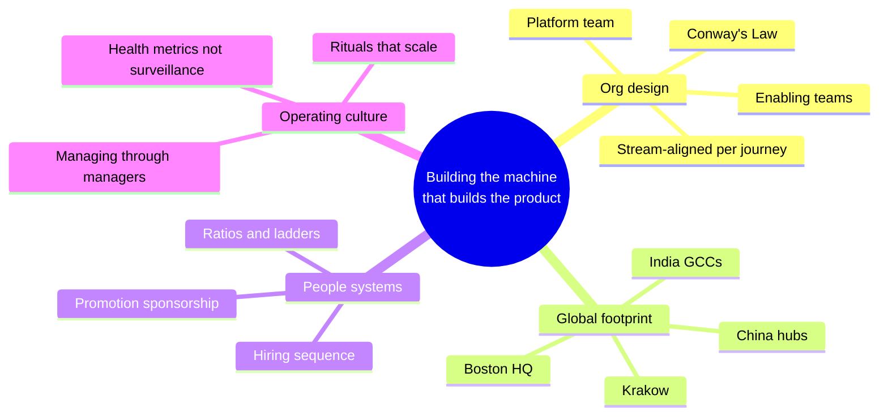
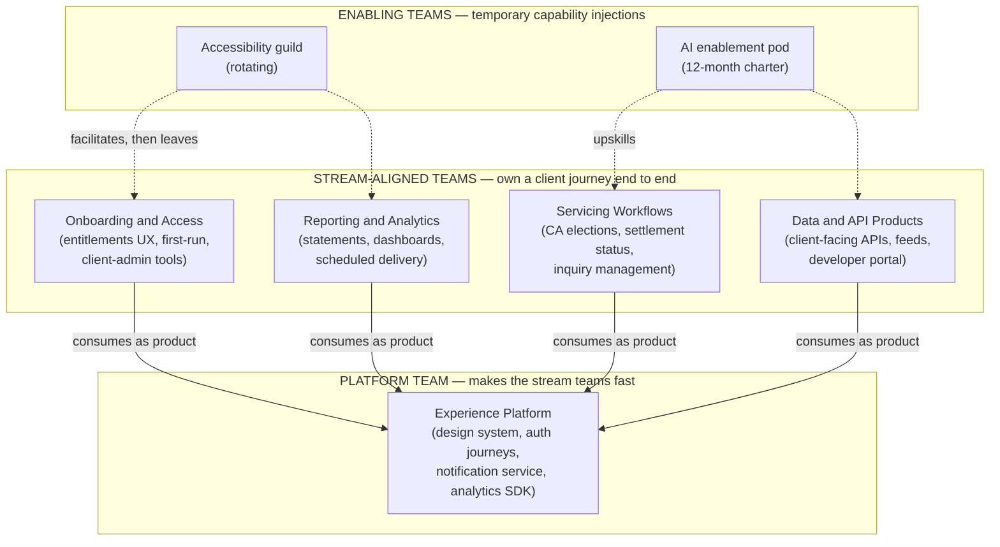
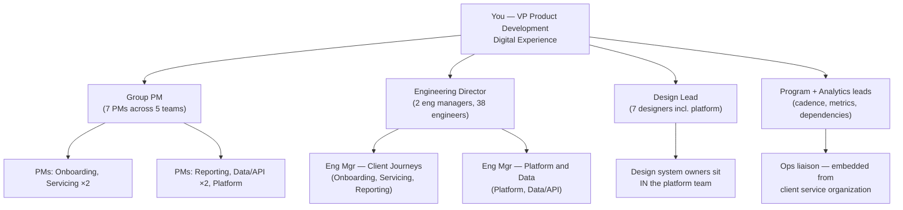
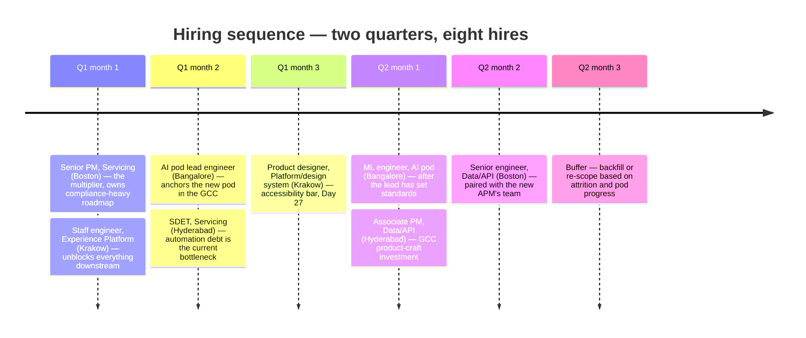

# Day 28 — Building and Scaling Product Teams

> Week 4 · The Executive Playbook · Est. reading time: 60–90 min

---

## 🎯 Learning objectives

By the end of today you can:

- Apply team-topologies thinking to a digital experience portfolio — stream-aligned teams per client journey, a platform team, enabling teams — and defend a worked ~60-person org design.
- State healthy PM:engineering:design ratios and diagnose the specific failure patterns that appear when each ratio breaks.
- Run globally distributed teams across Boston, Hyderabad/Bangalore, Krakow, and China hubs — choosing between follow-the-sun and overlap models deliberately, and preventing HQ–satellite dynamics.
- Decide what to outsource to vendors and consultancies, and what must never leave your payroll.
- Grow product managers with a competency matrix from associate to director, and sponsor promotions that survive calibration.
- Manage through managers: skip-levels, per-team operating reviews, and engineering-health signals (DORA metrics) watched without micromanaging.
- Sequence a hiring plan — eight hires over two quarters — worked as an example you can adapt.

---

## 🧭 Where this fits

Days 26 and 27 gave you the instrument panel and the flight rules. Today is the crew. Every metric you committed to and every control you own is delivered by teams — and at your scale, you no longer make products; you make the *organization* that makes products. Org design is the highest-leverage product decision you'll take all year: Conway's Law guarantees your architecture will mirror your team structure (Day 15's service boundaries and Day 12's design system both depend on getting today right). This is also where the custodian reality bites hardest — your teams will span at least three continents and several employment models, because that is how large custodians actually staff technology.

---

## Part 1 — Core concepts

### 1.1 Team topologies for a digital experience portfolio

The *Team Topologies* model (Skelton & Pais) gives you four team types and three interaction modes. Applied to your world:

The three rules that make this work:

1. **Stream-aligned teams own journeys, not screens or layers.** "Servicing Workflows" owns the corporate-action election from event notification to submitted instruction — UX, service calls, entitlement checks, alerts. A team that owns "the front end" can never be accountable for task success (Day 26's tree needs owners).
2. **The platform team runs its internals as a product** with the stream teams as customers: a roadmap, adoption metrics (design-system component reuse, time-to-first-screen for a new feature), and the discipline to say no. The moment the platform team becomes a ticket-taking service desk, it becomes the bottleneck for everyone.
3. **Enabling teams dissolve on purpose.** The AI enablement pod exists to make the stream teams capable, then disband or rotate. An enabling team that becomes permanent has become a dependency — the opposite of its charter.

**Cognitive load is the sizing rule.** A team's scope is right when it can hold its whole domain in its head. When the Servicing Workflows team starts missing corporate-action edge cases because it's also carrying inquiry management, that's not a performance problem — it's a topology problem, and the fix is a split (fracture along the journey seam, never along the technology layer).

### 1.2 A worked org design — ~60 people

Your representative mandate: the client-facing digital experience portfolio, ~60 people across employment types and locations.

| Team | PM | Design | Eng (incl. lead) | QA/SDET | Location center of gravity |
|---|---|---|---|---|---|
| Onboarding and Access | 1 | 1 | 6 | 1 | Boston + Hyderabad |
| Servicing Workflows | 2 | 2 | 8 | 2 | Boston + Hyderabad |
| Reporting and Analytics | 1 | 1 | 7 | 1 | Krakow |
| Data and API Products | 2 | 1 | 8 | 1 | Boston + Bangalore |
| Experience Platform | 1 | 2 | 9 | 1 | Krakow + Hyderabad |
| Portfolio staff (you + GPM + design lead + eng dir + 2 eng mgrs + analytics lead + program lead + ops liaison) | — | — | — | — | Boston-anchored, distributed |
| **Totals (≈61)** | **7** | **7** | **38** | **6** | 3 hubs |

Design choices worth defending out loud:

- **Two Servicing PMs, one team.** The money-moving journeys (elections, instructions) carry the compliance load from Day 27; one PM drowns in approval packs while discovery starves. Pairing a senior PM with an associate here is also your best PM-development machine.
- **The ops liaison is a real seat**, not a courtesy — an embedded secondee from client service who brings ticket data (deflection tree from Day 26) into every planning cycle. Cheap, and it transforms roadmap quality.
- **QA is embedded, not a phase.** Six SDETs across five teams, building the automated evidence that Day 27 promised the auditors.
- **You have exactly four direct reports plus two staff leads.** VPs who keep ten directs do everyone's job except their own.

### 1.3 Ratios — and what breaks when they're wrong

Healthy working ranges for B2B enterprise product work:

| Ratio | Healthy range | Broken low (too few of numerator) | Broken high (too many) |
|---|---|---|---|
| PM : engineers | 1 : 5–8 | PMs become backlog clerks; discovery stops; engineers pull requirements from stakeholders directly — roadmap becomes ticket queue | PMs invent work; teams whiplash between priorities; engineers context-switch to death |
| Designer : engineers | 1 : 5–8 (journey teams), richer on platform (design system) | UI debt compounds; every team reinvents patterns; accessibility fails (Day 27) at retrofit prices | Design polish outruns delivery; specs pile up unsold |
| SDET : engineers | 1 : 6–8 with strong automation culture | Manual regression grows until releases need freeze weeks | Testing throughput fine, but ownership of quality migrates away from developers — worse long-run |
| Eng manager : engineers | 1 : 7–9 | No career development; attrition of your best (they leave managers, not companies) | Managers micromanage to fill their day |

The diagnostic habit: when a team feels slow, check the ratios *before* blaming the people. A "low-performing" team with one PM across twelve engineers and no designer is performing exactly as designed.

---

## Part 2 — The system deep dive

### 2.1 The global reality — hubs and how to run them

Large custodians staff technology across a small set of global hubs. Representative footprint (public knowledge for State Street and peers): **Boston/US regional offices** (HQ, client proximity, senior product), **India GCCs** — global capability centers — in **Hyderabad and Bangalore** (the largest engineering populations, increasingly senior and product-capable), **Poland/Krakow** (European hub — engineering plus operations, EU data-residency-friendly, strong overlap with both Boston mornings and Asia afternoons), and **China hubs (e.g., Hangzhou/Zhejiang)** (engineering capacity with specific data and network segregation constraints that shape what can be built there).

**The timezone geometry you're managing:**

| Hub | Offset vs Boston (ET) | Overlap with Boston 9–5 | Overlap with Krakow 9–5 | Natural role in the day |
|---|---|---|---|---|
| Boston | — | — | 9 am–11 am ET | Client meetings, decisions, US ops support |
| Krakow | +6 h | 2 hours (their 3–5 pm) | — | EU clients, morning handoff to US |
| Hyderabad/Bangalore | +9.5 h | ~0–1 hour (edges) | 4–5 hours | Deep build time; Asia-morning support |
| Hangzhou | +12–13 h | none | 1–2 hours | Segregated workstreams; Asia support |

Two operating models — choose per team, explicitly:

- **Follow-the-sun** (work moves across hubs daily) is right for *operations-like* work: incident response, support queues, release monitoring. It is usually **wrong for product development** — handing off half-built features across a 9.5-hour gap produces relay-race quality and nobody who owns the outcome.
- **Overlap-hours model** (each team is *whole* within one or two adjacent hubs; cross-hub coordination happens in designed overlap windows) is right for product teams. This is why the worked org in 1.2 gives each team a *center of gravity* rather than smearing every team across every hub: Reporting is Krakow-whole; Data/API pairs Boston and Bangalore with a disciplined 8–9 am ET window; nobody is asked to attend 9 pm standups as a lifestyle.

### 2.2 Avoiding HQ–satellite dynamics — the real distributed-team problem

The failure mode that quietly ruins global orgs: Boston decides, everyone else executes. Symptoms — GCC engineers described as "resources"; decisions made in hallway conversations after the official meeting; all PMs in one city; promotion velocity visibly different by geography. The countermeasures are structural, not motivational:

| Countermeasure | What it looks like in practice |
|---|---|
| **Whole teams, whole ownership** | A Hyderabad-anchored team owns a *journey* (with its PM there too), not "the backend of Boston's journey" |
| **Put product craft where the engineers are** | PM and design roles opened in the GCCs; a GCC product community with real career paths to GPM — this is the single strongest signal, and custodians' GCCs have matured far past "outsourced delivery" |
| **Rotate the inconvenience** | Alternate meeting times quarter by quarter; record and document by default (writing culture, 3.2); if Boston never takes the 7 am call, you've announced who matters |
| **Leaders travel to the hubs** | You spend real weeks in Hyderabad and Krakow yearly — demo days there, skip-levels there, promotions announced there |
| **Watch the artifact trail** | If all RFCs, decision logs, and roadmap docs are authored in one hub, ownership hasn't actually moved, whatever the org chart says |
| **Co-locate with ops deliberately** | When a product serves an operations function concentrated in a hub (e.g., a reconciliation workbench used heavily by Krakow ops), put that team *in that hub* — daily lunchroom contact with your users outbids any research program |

### 2.3 Vendors and consultancies — what to outsource, what never to

You will be offered — and will sometimes need — consultancies and vendor delivery teams. The rule that survives contact with reality:

**Outsource capacity and commodity skills. Never outsource product judgment, client relationships, or the knowledge of *why*.**

| Safe to outsource | Keep on payroll, always | Why the line sits here |
|---|---|---|
| Surge delivery capacity on well-specified builds | Product management and prioritization | Judgment compounds in-house; rented judgment leaves with the contract |
| Specialized one-time skills (penetration testing, a data migration, accessibility audit) | Design system ownership, core architecture | Whoever owns these owns your velocity for a decade |
| Legacy maintenance during a transition | Anything client-facing in *relationship* terms (roadmap conversations, incident calls) | Clients buy trust in the institution, not a vendor's badge |
| Staff augmentation inside your teams' process | Entitlement and security-critical logic (Day 27's highest-severity controls) | First-line risk ownership can't be delegated outside the firm |

Managing the engagement so it ends well:

- **SOWs with outcome milestones, not time-and-materials drift** — and an explicit **knowledge-transfer exit criterion**: named internal engineers pair throughout, documentation and runbooks as deliverables, a defined "we run it alone" date that is *tested* (vendor goes hands-off for two weeks before contract end).
- **One process, one quality bar.** Vendor engineers work in your repos, your CI, your code review. A separate "vendor workstream" with its own standards is deferred integration pain, purchased at premium rates.
- **Watch the ratio.** When vendor headcount in a team exceeds ~30%, institutional knowledge stops accumulating. Treat that threshold like a KRI.

### 2.4 Engineering health without micromanaging — the DORA-style dashboard

You are a product VP, not the engineering director — but you co-own outcomes, and engineering health is a leading indicator of everything you promised in Day 26. The four DORA metrics (from the *Accelerate* research program — unrelated to the EU DORA regulation of Day 27, an unfortunate collision you should disambiguate in every deck):

| Metric | Elite-ish reference | Your VP-level reading |
|---|---|---|
| Deployment frequency | Daily+ per team | Low frequency = big risky batches = the CAB fights of Day 27 |
| Lead time for changes | < 1 week commit → production | The real speed limit on your roadmap promises |
| Change failure rate | < 10–15% | Rising = quality debt or topology overload |
| Time to restore service | < 1 day (aim: hours) | Feeds your SLO/error-budget posture directly |

The governance discipline: review these **per team, quarterly, as trends, with the engineering director narrating** — never as a leaderboard, never in individual performance conversations, never as targets teams self-report against (Goodhart's law will oblige immediately). Add two custodian-specific companions: **flow interruption rate** (% of sprint capacity diverted to unplanned compliance/incident work — if it exceeds the 10–20% you budgeted on Day 27, the plan is fiction) and **onboarding time-to-first-merge** for new joiners (the truest measure of your platform team's and documentation's quality — and of whether GCC hires are being set up to succeed).

### 2.5 The hiring plan — eight hires over two quarters, worked

Context: the org in 1.2 has approval for +8 heads to stand up the AI enablement pod and strengthen Servicing. Sequencing logic: **hire the multipliers first, the dependencies before the dependents, and never more than one leader per team per quarter** (a team can absorb only so much newness).

Notes an experienced operator would add: the **APM in Hyderabad is strategically the most important hire on the list** despite being the most junior — it's the proof-of-intent for GCC product careers (2.2); every offer is calibrated against the ladder in 3.1 *before* the search opens (retrofitting level after a candidate is in play is how comp inequities are born); and month 3 of Q2 is deliberately unallocated because two quarters of hiring *always* includes one surprise departure or one failed search.

---

## Part 3 — The VP lens

### 3.1 Career ladders and the PM competency matrix

Growing PMs is slower and higher-yield than hiring them. The matrix below is the working tool — for expectations-setting, promotion packets, and diagnosing why someone is stuck:

| Competency | Associate PM | PM | Senior PM | Group PM / Director |
|---|---|---|---|---|
| **Product sense** | Executes defined features well; asks good "why" questions | Owns a workflow; finds real user problems behind requests | Owns a journey; kills bad ideas early with evidence | Sets portfolio bets; sense extends to markets and pricing |
| **Execution** | Ships with guidance; writes crisp tickets | Ships independently; manages scope honestly | Ships the hard cross-team thing; manages compliance journeys (Day 27) | Builds the machine — cadences, standards — that ships |
| **Analytics** | Reads dashboards; spots anomalies | Defines metrics for their area (tree fluency, Day 26) | Designs experiments; challenges vanity metrics in others' decks | Owns the portfolio scorecard narrative upward |
| **Domain depth** | Learning custody basics (Weeks 1 of this book!) | Fluent in their journey's operations and SWIFT flows | Ops teams treat them as a peer; anticipates regulatory impact | Credible with clients and regulators directly |
| **Stakeholders** | Manages own team's clarity | Manages ops and tech partners for their workflow | Manages divisional stakeholders; handles conflict without escalation | Manages executives; represents the firm externally |
| **Leadership** | Feedback-seeking | Mentors an APM informally | Force-multiplier; runs guild or community | Manages managers; exports talent to other orgs |

Ladder mechanics that matter at a bank: **corporate title (AVP/VP/SVP) and role level are separate tracks** — be precise about which one a promotion conversation concerns (Day 29 goes deep); promotion requires *demonstrated next-level work*, which means you must **manufacture the opportunities** (the stretch assignment is the promotion machine — a Senior PM candidacy without a cross-team delivery to point at is dead on arrival at calibration); and **sponsorship is your job**: you don't just endorse packets, you build the evidence file all year (Day 26's metrics give every PM quantified impact statements if you've made the tree real).

### 3.2 Rituals that scale culture

Culture is what happens when you're not in the room; rituals are how you program it. The portfolio set that earns its calendar time:

| Ritual | Cadence | What it actually does |
|---|---|---|
| **Demo day** — every team shows working software, clients-first framing, hub locations rotate as host | Bi-weekly | Status theater dies; GCC teams present their own work to the whole org; you learn more than any report tells you |
| **Ops shadowing rotation** — every PM and senior engineer sits with client service/ops for a day | Quarterly per person | The deflection tree (Day 26) becomes visceral; relationships form that survive incidents |
| **Decision log** — one page per significant decision: context, options, choice, owner | Continuous | Kills re-litigation; onboards new joiners; is *also* first-line evidence (Day 27) |
| **Written proposals over slide-driven meetings** — RFC-style docs, comments before meetings | Continuous | The great equalizer for distributed teams: Hyderabad's written argument competes evenly with Boston's hallway charisma |
| **Incident review, blameless, cross-team attendance** | Per sev-1/2 | The Day 27 near-miss culture, socialized |
| **Quarterly "what we killed" review** | Quarterly | Celebrating stopped work makes stopping safe — the hardest cultural move in banks |

### 3.3 Managing through managers

At ~60 people, your leverage is entirely indirect. The operating system:

- **Per-team operating reviews, monthly, 45 minutes:** the team's slice of the metrics tree, delivery confidence, health (attrition risk, ratio breaks), one topic they choose. You're auditing *the manager's grasp*, not the team's work — a lead who can't narrate their own numbers is the real finding.
- **Skip-levels, structured:** every engineer/designer/PM sees you at least twice a year in small groups or 1:1s, with three standing questions: *what's harder than it should be? what would you change about your manager's setup? what are you learning?* Patterns across skip-levels — not individual anecdotes — are the signal; never act on a single skip-level story without triangulating, or you teach people to lobby you.
- **Disagree in private, back in public** — with one exception: values violations get corrected immediately, wherever they happen.
- **Your calendar is the org chart people believe.** If Servicing gets 4× the VP-time of Reporting, you've deprioritized Reporting no matter what the strategy deck says. Audit it quarterly.

### 3.4 Questions to ask your teams

- "Whose cognitive load is over the line — which team owns more journey than it can hold in its head?"
- "Which decisions this month were made in a hub other than Boston? Show me the decision log."
- "What's our vendor percentage per team, and which contracts have no tested knowledge-transfer exit?"
- "Who are the two people most likely to be promoted next cycle, and what stretch evidence are we building for them *now*?"
- "What did the last ops shadowing rotation change on the roadmap?"
- "Which team's DORA trend worries you, and what topology change would fix it?" (Note the framing: topology change, not people change.)

---

## 🏦 State Street context

*Representative of State Street and large custodians generally; grounded in public knowledge.*

- State Street's technology footprint matches today's hub logic: **Boston headquarters** (One Congress Street) with major presences including **India GCCs** (Hyderabad and Bangalore, thousands of technologists and operations staff), **Krakow, Poland** (a flagship European operations-and-technology center), and **China hubs** (notably in Hangzhou/Zhejiang province), plus other global sites. The India centers in particular have publicly evolved from support roles toward genuine engineering and product ownership — your GCC product-craft investment lands on fertile, and expectant, ground.
- Employment models are mixed by design at large custodians: employees, GCC entities, and third-party partners (large Indian and global IT services firms have long custody-industry relationships). The 2.3 vendor disciplines aren't hypothetical — they're the daily texture of running delivery here.
- **Operations proximity is a real advantage:** hubs like Krakow and Hyderabad house large client-operations populations (NAV production, settlements, corporate actions — Weeks 1–2 of this book). A digital experience team building ops-facing or ops-adjacent tools can sit a lunch table away from hundreds of daily users. Few product organizations anywhere get user access that cheap; use it.
- Expect **matrix reality**: engineers may report into a global technology organization while your product org sets direction — influence-based leadership across reporting lines is the norm at custodian scale, which is why the rituals in 3.2 (demos, written proposals, decision logs) matter more than boxes on a chart.
- Bank-wide **job architecture and annual calibration cycles** (Day 29) constrain title and comp moves; the practical implication for team-building is to plan promotions and requisitions against the bank's calendar, not just your roadmap's.

---

## 💪 Exercises

1. **Redesign the org for a shock.** Take the 1.2 org and absorb a mandate change: your portfolio gains "client onboarding document collection" (a workflow-heavy, compliance-heavy journey) with only +4 heads. Which topology changes? Which team splits or sheds scope? Write the one-page decision log entry, including what you *stop* doing.
2. **Run the ratio diagnostic** on a team you've worked in: compute PM:eng, design:eng, manager:IC ratios, then match observed dysfunctions to the "what breaks" table in 1.3. Did structure predict behavior? Write three sentences on what the structural fix would have been.
3. **Draft two promotion packets in outline** — one Senior PM (Boston), one PM (Hyderabad) — using the 3.1 matrix: for each, list the evidence you'd need per competency row and mark which evidence *doesn't exist yet*. The gaps are your stretch-assignment plan for next quarter; note the extra visibility engineering a GCC candidate needs to be judged fairly at a Boston-anchored calibration table.

---

## ❓ Self-check quiz

1. Why should a product development team generally use the overlap model rather than follow-the-sun, and where is follow-the-sun right?
2. Name three structural (not motivational) countermeasures to HQ–satellite dynamics.
3. A team with 12 engineers, 1 PM, and no designer is shipping slowly with rising UI inconsistency. Diagnose using ratios and predict two specific behaviors you'd observe.
4. What may be outsourced to a consultancy and what never should be? Give the test, not just examples.
5. How should a product VP use DORA metrics — and name the two review practices that turn them toxic.

Answers

1. Product work needs shared context, fast feedback, and single-team ownership of outcomes; handing half-built features across a 9.5-hour gap produces relay-race quality with no owner. Follow-the-sun suits operations-like, queue-based, well-proceduralized work: incident response, support, release monitoring.
2. Any three of: whole teams with whole journey ownership anchored in one hub (PM included); opening PM/design roles in the GCCs with real career paths; rotating meeting inconvenience and defaulting to written/recorded decisions; leaders traveling to hubs for demos, skip-levels, and promotion announcements; monitoring where RFCs and decision logs are authored; co-locating teams with the ops populations they serve.
3. PM:eng is 1:12 (broken — healthy is 1:5–8) and design:eng is 0. Predicted behaviors: engineers pulling requirements directly from stakeholders, so the roadmap becomes a ticket queue with whiplash priorities; and每 team reinventing UI patterns with compounding design debt and accessibility gaps, since no one owns the patterns. ("每" — correction: "each" — the point stands: pattern reinvention.) The fix is structural: add a PM or split the team, and embed design.
4. The test: outsource *capacity* and *commodity or one-time skills*; never outsource *judgment that must compound in-house* — product prioritization, core architecture, design system ownership, client relationships, and security/entitlement-critical logic (first-line risk can't be delegated outside the firm). If losing the contractor would take the "why" with them, it should have been an employee.
5. Review per team, quarterly, as trends, narrated by the engineering director, to spot topology and quality problems early — connected to product outcomes (batch size → CAB friction; restore time → error budgets). Toxic practices: using them as a cross-team leaderboard, and wiring them into individual performance reviews or self-reported targets (Goodhart's law: the numbers will improve and the truth will leave).

---

## 🔑 Key takeaways

- Org design is product design: Conway's Law means the portal's architecture will mirror your team chart. Choose stream-aligned journey teams, one product-managed platform team, and enabling teams that dissolve on purpose.
- Size teams by cognitive load; fix "slow teams" with topology and ratios before ever blaming people. Healthy: 1 PM per 5–8 engineers, 1 designer per 5–8, managers at 1:7–9.
- Run global hubs on the overlap model with whole teams anchored per hub; reserve follow-the-sun for operational queues. The single strongest anti-satellite signal is real product careers in the GCCs.
- Outsource capacity and one-time skills; never product judgment, core architecture, design system, or entitlement-critical logic. SOWs end with *tested* knowledge transfer, and vendor share above ~30% of a team is a KRI.
- Grow PMs with an explicit competency matrix, manufacture stretch evidence all year, and sponsor packets — promotion is a system you operate, not an event you attend.
- Rituals program culture at distance: demo days hosted from every hub, ops shadowing, decision logs, and a writing culture that lets distributed arguments compete fairly.
- Manage through managers: monthly per-team operating reviews audit the manager's grasp; skip-levels find patterns, never single-anecdote verdicts; your calendar is the org chart people actually believe.
- Watch DORA-style trends plus flow-interruption and time-to-first-merge — quarterly, per team, never as a leaderboard.

---

## 📚 Going deeper

- Matthew Skelton & Manuel Pais, *Team Topologies* — the source for 1.1; short, practical, worth a full read.
- Nicole Forsgren, Jez Humble, Gene Kim, *Accelerate* — the research behind the DORA metrics and why they predict performance.
- Will Larson, *An Elegant Puzzle: Systems of Engineering Management* — the best treatment of ratios, team sizing, and managing through managers.
- Camille Fournier, *The Manager's Path* — for calibrating what to expect from your eng managers and director.
- Marty Cagan, *Empowered* — on product leadership, coaching PMs, and topology-adjacent team empowerment.
- GitLab's public remote-work handbook (about.gitlab.com/handbook) — the deepest public playbook on writing culture and distributed decision-making; adapt, don't adopt.
- State Street careers and newsroom pages on its global hubs (statestreet.com) — public framing of the Hyderabad, Bangalore, Krakow, and Hangzhou centers.

---

## Tomorrow

Day 29 — the org is built; now build yourself: how promotion really works at a large bank, what separates VP from SVP in observable behaviors, and a full interview-mastery question bank.
