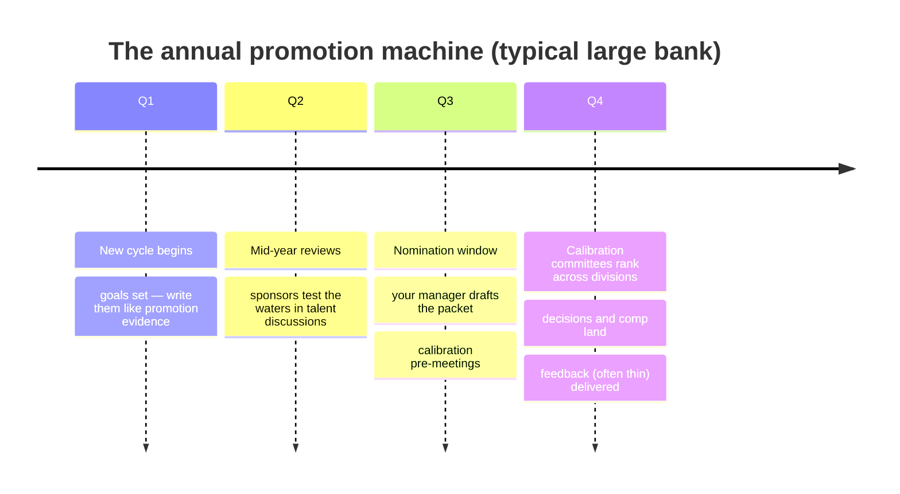
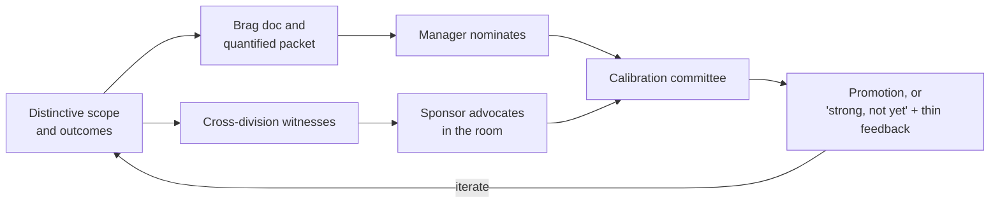
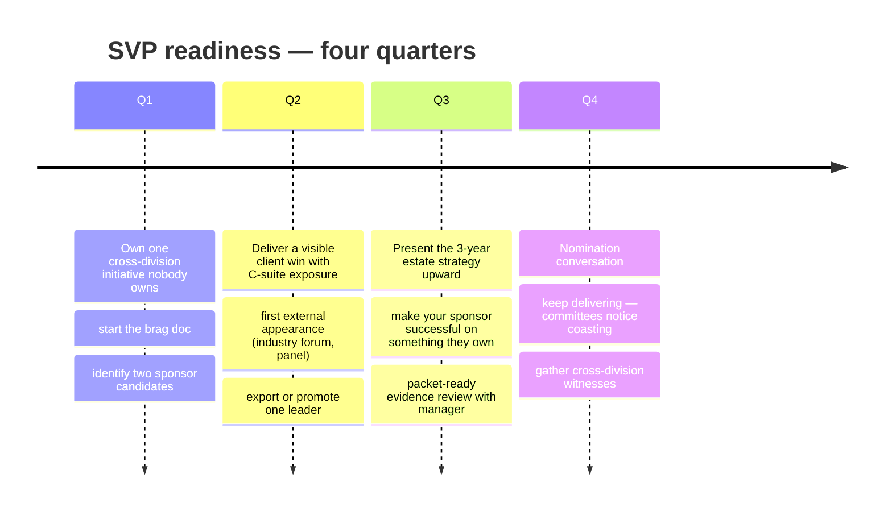

# Day 29 — The Path to SVP and Interview Mastery

> Week 4 · The Executive VP Playbook · Est. reading time: 75–100 min

## 🎯 Learning objectives

By the end of today you can:

- Explain how promotion actually works at a large bank: cycles, calibration, packets, sponsors
- Name the observable behaviors that separate VP from SVP, and audit yourself against them
- Run a 12-month SVP-readiness plan with quarterly milestones
- Build a STAR story bank that covers the whole VP interview question space
- Answer the seven categories of VP product interview questions with frameworks, not scripts
- Ask questions that signal VP-level thinking, and negotiate scope and level

## 🧭 Where this fits

Everything before today was about doing the job. Today is about the career system the job sits inside — how large organizations decide who advances, and how to interview at this level (for the current role, internal moves, or wherever the career goes next). None of it works without the substance of Days 1–28; all of it determines whether the substance gets recognized.

---

## Part 1 — Core concepts

### How promotion actually works

The mechanics nobody explains on day one:

1. **It's an annual machine, decided in rooms you're not in.** Nominations happen in a window; committees calibrate candidates *across* divisions; your case is presented by your manager (or sponsor) in a few minutes against other cases. The decision is 80% made before the committee by what's in the packet and who speaks for you.
2. **The packet is evidence, gathered all year.** Quantified scope (P&L influence, clients served, team size, platforms owned), delivered outcomes (Day 26's numbers become career documents), and *breadth witnesses* — leaders outside your line who can vouch. Keep a running "brag doc"; update it monthly; write your goals in January so December's evidence maps onto them.
3. **Sponsor ≠ mentor.** A mentor advises you; a **sponsor spends their political capital advocating for you in the room**. Mentors are easy to get; sponsors are earned by making them successful — visibly, repeatedly, on things they own. You need at least one at the level above your manager.
4. **Calibration is comparative.** "Great year" is not the bar; the bar is "stronger case than the other VPs on the slate." That's why *distinctive* scope (the thing only you did) beats *excellent* delivery of the expected.

### VP vs SVP — observable behaviors, not vibes

| Dimension | VP (you now) | SVP (the next room) |
|---|---|---|
| Scope | A product portfolio and its teams | A business line or estate; P&L conversation partner |
| Ambiguity | Solves defined-but-hard problems | Defines which problems the org should solve |
| Horizon | 2–4 quarters | 2–3 years; positions the firm, not the product |
| Stakeholders | Manages the matrix (Day 14) | Shapes the matrix; brokers peace between EVPs |
| External | Presents to clients | Industry presence: panels, councils, named relationships with client C-suites |
| Talent | Builds a strong team | *Exports* leaders to the rest of the firm |
| Communication | Clear upward narratives (Day 23) | Sets narratives others repeat |
| Risk | Owns first-line risk (Day 27) | Trusted by second line and regulators as an institution-grade owner |

The self-audit: for each row, write one sentence of evidence you could show today. Rows with no sentence are your 12-month plan.

### The 12-month SVP-readiness plan

---

## Part 2 — The interview system

### The STAR story bank — build once, use everywhere

Interviews at this level are evidence-based: behavioral questions probing what you *actually did*. Prepare ~10 stories, each told in STAR (Situation, Task, Action, Result — with numbers), each covering multiple question categories:

| # | Story (from your real career) | Covers |
|---|---|---|
| 1 | Turned around a failing platform/product | Execution, leadership, ambiguity |
| 2 | Killed or de-scoped something (with data) | Judgment, courage, metrics |
| 3 | Conflict with a powerful stakeholder, resolved | Stakeholders, influence |
| 4 | Client escalation you led to a better relationship | Client focus, comms |
| 5 | A launch that failed and what changed after | Learning, honesty |
| 6 | Built or rebuilt a team; grew a leader | Talent, managing managers |
| 7 | A technical trade-off you drove (API/platform/data) | Technical depth |
| 8 | Influenced strategy above your level | Executive presence |
| 9 | Delivered under regulatory/compliance constraint | Risk fluency (Day 27) |
| 10 | An unpopular decision that proved right (or wrong) | Decision-making (Day 24) |

Discipline per story: 2 minutes told aloud; Result carries numbers; a one-line "what I'd do differently." Practice *aloud* — written fluency is not spoken fluency.

### The question bank — seven categories, with answer frameworks

**1. Product sense (B2B/institutional)**
- "Design a corporate-actions election experience for asset managers." → Personas and JTBD first (Day 10), risk asymmetry (Day 5), then flows; name metrics (response rate before final reminder) and the entitlement/approval model (Day 11). Structure beats features.
- "Portal adoption is flat. Diagnose." → Funnel: entitled → activated → habitual (Day 26); segment before hypothesizing; the fix differs for "never activated" vs "tried and left."
- "API vs portal first for a new capability?" → Segment economics (Day 25) + one contract, two channels (Day 15).

**2. Execution and delivery**
- "Walk me through a launch that slipped. What did you do?" → Story 5; emphasize early detection (leading indicators), honest re-plan comms (Day 23), and the systemic fix.
- "How do you prioritize when everything is a client commitment?" → Cost of delay/WSJF (Day 9) *plus* the commitment-hygiene fix: confidence-tiered shareable roadmap (Day 14).

**3. Leadership and managing managers**
- "How do you know a team is healthy without micromanaging?" → Outcomes and rituals: OKR trajectory, demo quality, decision logs, attrition/skip-levels (Days 24, 28).
- "Tell me about growing a leader." → Story 6; delegation of outcomes with guardrails; the moment you let them own the room.

**4. Stakeholder and conflict**
- "Compliance blocks your flagship feature two weeks before launch." → Day 14's pattern: root-cause the engagement timing, split approvable core, standing concept reviews; no compliance-bashing — interviewers at banks are listening for partnership instincts.
- "Sales sold something that doesn't exist." → Day 14's triage + the systemic fix; show you fix systems, not just incidents.

**5. Technical depth (for product execs)**
- "Explain event-driven architecture and where it bites." → Day 17: duplicates and ordering on client-facing screens; idempotent consumers.
- "How would you think about our data platform strategy?" → Day 18/20: golden sources → warehouse → semantic layer → four channels; consistency as the client-trust requirement.
- The bar: fluent trade-offs, not implementation trivia. Saying "I'd rely on my architects for X, but the product question is Y" *is* a strong answer when Y is right.

**6. Domain (custody/asset servicing)**
- "Why is T+1 a digital experience problem?" → Day 3: compressed affirmation windows kill batch-and-phone workflows; real-time status, webhooks, exception-first design.
- "Where's the operational risk concentrated in custody, and what can product do?" → Day 5: voluntary corporate actions; the last mile of attention is a product surface.

**7. Executive judgment**
- "Your top client demands a bespoke feature or they leave." → Day 25's script: cost it, adjacent yes, council, pre-wired org.
- "You inherit a 60-person org mid-transformation. First 90 days?" → Day 22, told as *your* plan, with the traps named.

### Your questions, and the close

Questions that signal the level (pick 3–4): "What decision rights does this role actually hold over roadmap and budget?" · "What's the operating model tension I'll inherit?" (Day 9) · "How does digital evidence show up in client retention conversations today?" (Day 26) · "Who are this role's three most important partners, and what does each currently want that they're not getting?" (Day 14) · "What would make you say, in 18 months, that this hire changed the trajectory?"

**Negotiating scope and level**: at VP+, negotiate the *role* before the money — decision rights, team ownership, mandate breadth, title/level (which gates everything downstream — Day 24's calibration reality). Anchor with evidence of the scope you've carried, not need. Get the mandate in writing in the offer conversation summary; ambiguity you accept now becomes Day 14 escalations later.

---

## Part 3 — The VP lens

Meta-advice for running your own career like a product:

- **Instrument it** (Day 26 for yourself): brag doc updated monthly; sponsor map reviewed quarterly; the VP-vs-SVP audit twice a year.
- **Choose scope like a portfolio** (Day 8): one distinctive cross-division bet, one reliable delivery engine, one visible client win per year beats five invisible excellences.
- **Your narrative is an asset** (Day 23): the two-minute "what I own and what changed because of me" answer, rehearsed, current, numerate.
- **Beware the promotion trap**: optimizing for the packet at the expense of the mission reads instantly to committees — the paradox is that the strongest cases belong to people conspicuously playing for the team. Do the work of Days 1–28; today's machinery just makes sure it counts.

## 🏦 State Street context

Representative realities of large custodian career systems: officer titles (AVP/VP/SVP/MD-equivalents) follow annual calibration cycles with cross-division committees and finite promotion budgets; SVP cases typically require demonstrated cross-business impact and external/client-facing presence, not just delivery excellence; internal mobility is a genuine accelerator (product leaders who've done a tour in ops, data or a client-facing role calibrate stronger); and industry visibility — SIFMA, Sibos, ISO 20022 working groups (Day 6) — is a recognized and legitimate route to the "external presence" row of the SVP table. (Representative; verify internal specifics on the job.)

## 💪 Exercises

1. **Audit yourself.** Complete the VP-vs-SVP table with one evidence sentence per row. Circle the two emptiest rows; draft the Q1 milestone that starts filling each.
2. **Build story #1.** Write your strongest turnaround story in full STAR, 2 minutes aloud, numbers in the Result. Then map it against the seven categories: which does it cover?
3. **Mock the hard one.** Answer aloud: "Compliance blocks your flagship feature two weeks before launch — walk me through what you do." Record yourself; check for partnership framing, systemic fix, and a numerate outcome.

## ❓ Self-check quiz

1. Sponsor vs mentor — the difference in one sentence, and why only one moves promotions?
2. What belongs in the packet, and when is it built?
3. Name four observable behaviors that distinguish SVP from VP.
4. What's the structural discipline of a STAR story bank (size, coverage, telling time)?
5. What do you negotiate before compensation at VP+ level, and why?

Answers

1. A mentor gives you advice; a sponsor spends their own political capital advocating for you in rooms you're not in — and calibration decisions are made in those rooms.
2. Quantified scope (P&L influence, clients, team, platforms), delivered outcomes with numbers, and cross-division witnesses; built continuously all year (brag doc), not at nomination time.
3. Defines problems rather than solving defined ones; 2–3 year horizon; external/industry presence; exports leaders; brokers peace between executives; trusted by second line and regulators (any four).
4. ~10 real stories, each 2 minutes aloud, Result with numbers, each mapped to cover multiple of the seven question categories so the whole space is covered by a small rehearsed set.
5. The role itself: decision rights, team ownership, mandate breadth and level/title — because scope ambiguity accepted at offer time becomes standing stakeholder conflict later, and level gates future calibration.

## 🔑 Key takeaways

- Promotion is an annual, comparative, evidence-based machine; the packet and the sponsor decide more than the year's work does.
- **Sponsors are earned by making them successful**; you need one above your manager.
- SVP is a set of observable behaviors — audit yourself against the table and plan the empty rows.
- Ten rehearsed STAR stories with numbers cover the entire VP interview space.
- Frameworks beat scripts in interviews: structure, trade-offs, numerate results, partnership instincts.
- Negotiate mandate before money; run your career with the same instrumentation you'd demand of a product.

## 📚 Going deeper

- *The First 90 Days* (Watkins) — pairs with Day 22 for any new mandate
- Carla Harris's talks on sponsorship ("performance currency vs relationship currency")
- *Cracking the PM Career* (Bavaro/McDowell) — the question-bank genre, adapted here for VP level
- Your firm's actual promotion criteria documents — read the real rubric in week one

## Tomorrow

Day 30 — the finale: **the full system, end to end.** One trade travels through everything you've learned, one master diagram holds the whole book, and a final exam closes the bootcamp.
