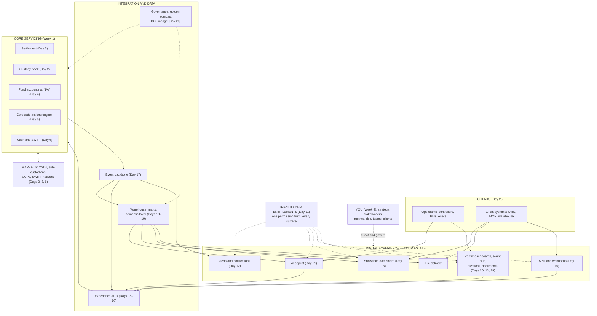
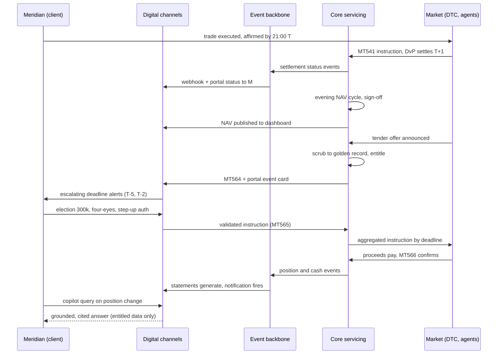
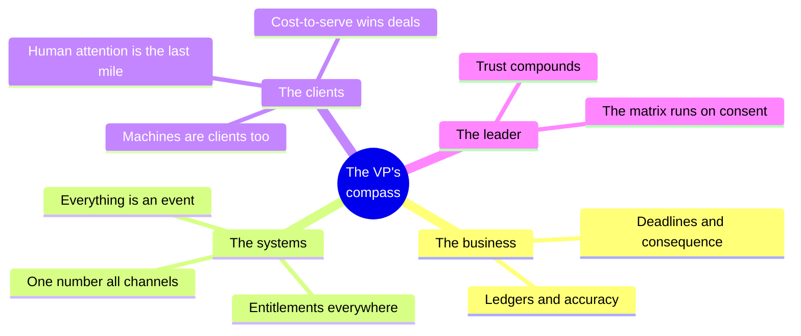
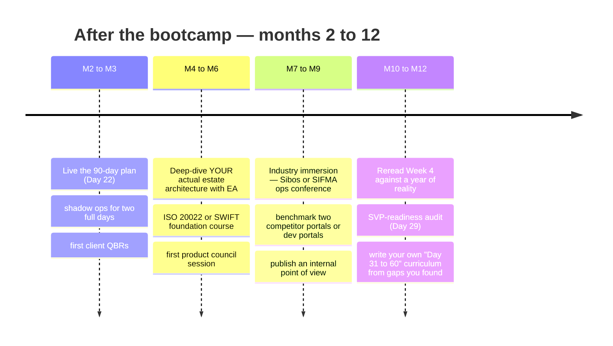

# Day 30 — Capstone: The Full System, End to End

> Week 4 · The Executive VP Playbook · Est. reading time: 90–120 min
> The final chapter. One scenario travels through everything you've learned.

## 🎯 Learning objectives

By the end of today you can:

- Narrate a single client scenario end-to-end across custody, settlement, NAV, corporate actions, cash, events, data and every digital surface — naming systems, messages and actors at each step
- Hold the entire book in two diagrams: the master architecture and the master sequence
- Recite the ten mental models that compress 30 days into carry-anywhere principles
- Pass a 30-question final exam spanning all four weeks
- Continue with a 12-month learning roadmap

## 🧭 Where this fits

This is the summit. Every chapter was a piece; today they run as one machine. If you can tell today's story unaided — whiteboard, no notes, twenty minutes — you know this business better than most people who've worked in it for years, because you know how the pieces *connect*.

---

## Part 1 — The scenario, end to end

**Cast:** *Meridian Investments* (asset manager, $150B AUC client — Day 25's P&L), running the *Meridian Global Equity Fund* (Day 4). State Street-style custodian: custody, fund accounting, digital channels. The scenario spans three weeks of calendar time.

### Act 1 — The trade (Days 3, 6, 17)

Monday, 10:14 ET. Meridian's PM buys **500,000 shares of ACME Corp at $30.00** ($15M) via their OMS. Executed on exchange; allocation and confirmation flow through CTM; the affirmed confirmation must hit DTCC by **21:00 ET tonight** — T+1 leaves no slack (Day 3).

- The custodian receives the settlement instruction (**MT541**, receive-versus-payment) enriched with SSIs from reference data (Days 3, 20).
- The instruction lands in the settlement system and starts emitting **status events** onto the event backbone (Day 17): `acknowledged` → `matched`.
- Meridian's ops team doesn't log in to check: their own platform consumes the **settlement-status API and webhooks** (Day 15). The portal shows the same states to humans — same entitlement model, one permission truth (Day 11).

Tuesday (T+1). DvP settlement at DTC: securities credit, **$15M cash debit** on Meridian's USD account, funded via the cash sweep configuration (Day 6). The custody book updates; `settled` fires on the backbone; the webhook reaches Meridian's IBOR seconds later. *Counterfactual:* had the trade failed, the exception-first portal queue, ageing timers and CSDR-style penalty math (Day 3) would have taken over — and Meridian's analyst would have been *alerted*, not left to discover it.

### Act 2 — The evening machine (Day 4)

Tuesday, 16:00 ET. Fund accounting begins the NAV cycle: prices load (ACME closes at $30.40), tolerance checks pass, positions reconcile to the custody book — including today's settled 500,000 shares — accruals post, and the movement check clears (+8bps vs benchmark, in tolerance). **NAV signed off 21:40, published 22:00**: to the transfer agent, data vendors — and the **NAV dashboard**, where the fund controller sees status `PUBLISHED`, movement commentary attached (Day 4's product). The event `nav.published` also lands in the warehouse pipeline (Day 18) — tonight's ELT will refresh `fact_positions` and the marts before 06:00.

### Act 3 — The corporate action (Days 5, 11, 12)

The following Monday. ACME announces a **voluntary tender offer: $34.50 cash per share** (14% premium), market deadline in 12 business days; custodian client deadline two days earlier (Day 5).

1. **Capture and scrubbing**: four sources disagree on a minor term; scrubbing resolves to a golden record, version 1.
2. **Entitlement calc**: Meridian's fund holds 500,000 shares at record date → entitled in full.
3. **Notification**: **MT564** to Meridian's middle office; simultaneously the **portal event hub** renders the golden record in plain English — terms, options, worked proceeds ($17.25M if fully tendered), and the line that prevents lawsuits: *"If you do nothing: your shares remain; no proceeds."*
4. **Alerting** (Day 12): reminders arm at T-5/T-2/T-1 against the *client* deadline. At T-2, no election yet — the escalation widens: analyst → ops manager, in-app + email.
5. **Election** (Day 11 working exactly as designed): Meridian's analyst enters a partial tender — 300,000 shares — via the portal. Validation (≤ holdings), **four-eyes approval** by their ops manager under their own delegated-admin setup, **step-up authentication** on approval. **MT565** flows to market via the sub-custodian; **MT567** confirms `accepted`; the portal shows the same status the SWIFT-native middle office sees.
6. **Payment**: offer completes; **$10.35M** credits (MT566 confirms); positions drop to 200,000 shares; cash and custody books reconcile; that evening's NAV absorbs it all cleanly (Act 2 runs again).

### Act 4 — Month-end and the data spine (Days 13, 18, 19, 20)

Month-end. The document platform composes Meridian's **statements and valuation packs** (Day 13): generated, indexed with metadata, stored under entitlement-aware access, retention clock started (17a-4). A `document.available` event triggers the notification: *"Your August statements are ready."* Meanwhile the same governed numbers flow four ways (Day 20's consistency mandate): portal dashboards, the API, the monthly file feed — and a **Snowflake secure share** directly into Meridian's own account (Day 18), lineage documented from book of record to every channel.

### Act 5 — The question (Day 21)

Meridian's fund controller, reviewing the pack, asks the portal's **AI copilot**: *"Why did our ACME position drop 60% in August?"* The copilot runs RAG **over the controller's entitled data only** (Day 21 ∘ Day 11): retrieves the tender event, the election record, the MT566-confirmed payment; drafts — with citations to each source — *"On Aug 18, Meridian elected to tender 300,000 of 500,000 ACME shares at $34.50, receiving $10.35M on Aug 29..."* Grounded, cited, correct — and logged for audit. A hallucinated answer here would be a Day 27 incident; that's why the guardrails exist.

**And you?** Your telemetry (Day 26) recorded: zero service tickets from Meridian this month, election completed before final escalation, copilot deflected a call. Three rows of green in the client-health table (Day 25). That's the job, working.

---

## Part 2 — The master diagrams

### The whole book, one architecture

### The scenario as one sequence

---

## Part 3 — The ten mental models

1. **Custody is a ledger business.** Every product you'll ever build renders, moves or explains entries in books of record. Accuracy is the brand. (Week 1)
2. **Deadlines are the drama.** T+1 cutoffs, CA elections, NAV sign-off — value concentrates where time pressure meets consequence, and so should product investment. (Days 3–5)
3. **Everything is an event.** Things *happen* in custody; architectures and products that treat status changes as first-class events serve clients at the speed the business now runs. (Day 17)
4. **Entitlements are the product.** Who may see and do what, per account, per function — get this model right once and every surface inherits it; get it wrong and every feature fights it. (Day 11)
5. **One number, every channel.** Portal, API, file, deck must agree; the semantic layer and lineage are client-trust infrastructure, not tech hygiene. (Days 19–20)
6. **The last mile is human attention.** The catastrophic losses (missed elections) die not in pipelines but in unread notifications — alerting, escalation and comprehension are risk controls you own. (Days 5, 12)
7. **Machines are clients too.** Your most sophisticated relationships experience you entirely through APIs and data shares; contracts and deprecation discipline are relationship management. (Days 15, 18)
8. **Cost-to-serve is your commercial engine.** Thin-margin economics mean deflection and self-service are the provable value of digital — instrument everything. (Days 25–26)
9. **The matrix runs on consent.** Ops, compliance, tech, sales: pre-wired, paid in their currencies, never surprised. Your roadmap moves at the speed of trust. (Day 14)
10. **Trust is the currency — of clients, committees and regulators alike.** Honest status, honest metrics, honest risk ownership compound; every shortcut is borrowed against them. (Weeks 1–4)

---

## ❓ The final exam — 30 questions across 30 days

**Week 1 (1–8):**
1. Name four of a custodian's revenue lines and why servicing margins are thin.
2. Draw the holding chain from investor to issuer (five tiers).
3. Why must a US trade be affirmed by 21:00 ET on T, and what breaks if it isn't?
4. Compute: fund assets $2.1B, liabilities $14M, 68M shares — NAV per share?
5. What's the movement check and why is it the best NAV error catch?
6. Mandatory-with-choice vs voluntary — the risk each carries?
7. MT564/565/566/567 — one line each.
8. Nostro vs vostro, and why cutoff times exist.

**Week 2 (9–16):**
9. Why do B2B2B products die by feature-factory, and what's the antidote?
10. WSJF: formula, and when you'd overrule the score.
11. Name four dense-data UX principles.
12. RBAC vs ABAC, and where delegated admin fits.
13. Design the escalation ladder for an unanswered CA election.
14. What does SEC 17a-4 demand of statements?
15. The two rules of healthy escalation (Day 14)?
16. Three "currencies" of influence and whose they are.

**Week 3 (17–24):**
17. Idempotency: what, why, which verb class?
18. Why 12–18 month API deprecation windows?
19. At-least-once delivery: what must consumers do, and what breaks on a client screen if they don't?
20. Snowflake secure data sharing — why is it a product capability, not IT plumbing?
21. Star schema: name the fact and three dimensions for settlement analytics.
22. Extracts vs live; the custody default and why.
23. Owner vs steward vs custodian in governance.
24. Why does RAG need entitlement-aware retrieval in a client copilot?

**Week 4 (25–30):**
25. The 30/60/90 arc in one line each, and the classic trap of each phase.
26. Pyramid principle: the three moves.
27. One-way vs two-way doors — what changes in how you decide?
28. Five revenue lines in a custody deal P&L.
29. Build the three-level metrics tree from north star to two input metrics.
30. Three lines of defense — and which line are you?

Answers

1. Servicing/custody fees (bps on AUC/A), fund accounting/admin fees, transaction fees, FX and cash-related revenue (NII), securities lending, software/data (Alpha/CRD-style). Thin because fees compress every renewal while the cost base is ops-heavy.
2. Investor → asset manager → global custodian → sub-custodian → CSD (→ issuer register).
3. DTCC affirmation cutoff for T+1 settlement; miss it and you're into exception processing — higher fail probability, funding and recall knock-ons, possible penalties/claims.
4. ($2,100M − $14M) / 68M = $30.6765 ≈ **$30.68**.
5. Compare the fund's daily return to its benchmark's; deviations beyond tolerance flag bad prices, missed CAs or unbooked flows before publication.
6. With-choice: event happens regardless, a default applies if silent (bad-default risk). Voluntary: participation optional (missed-opportunity risk). Both concentrate at deadlines.
7. 564 notification of event/terms/deadlines; 565 client election instruction; 566 confirmation of movements; 567 election/processing status.
8. Nostro: our account at another bank; vostro: their account with us. Cutoffs exist because payment rails and correspondents batch and close — cash must be positioned before the windows shut.
9. Stakeholder-driven output factories ship features nobody adopts; the antidote is outcome-owned persistent teams with OKRs and evidence-based prioritization.
10. WSJF = cost of delay ÷ job size (CoD = value + time criticality + risk reduction). Overrule for contractual/regulatory commitments or strategic bets whose value the model can't see — and say so openly.
11. Tables-first, exception-first, progressive disclosure, bulk actions, honest freshness labeling, keyboard efficiency (any four).
12. RBAC: permissions via assigned roles; ABAC: attribute rules evaluated at decision time. Delegated admin lets the client's own admins manage their users within either model.
13. T-5 analyst in-app+email → T-2 add ops manager, add SMS → T-1 add client ops head + your service team task → deadline day: phone call logged. Severity taxonomy, not blanket repeats.
14. Retention in non-rewriteable/non-erasable form for the regulatory period, retrievable on demand.
15. Never escalate a surprise; never accept an unlogged decision.
16. Ops: relief from manual pain; sales: win stories; compliance: no surprises (also tech: prioritized realistic demand; finance: evidenced benefits).
17. Safe retries — a retried request must not double-apply; applies to non-idempotent writes (POST), via idempotency keys.
18. Each breaking change forces change projects inside dozens of slow-moving client orgs; short windows convert your release into their emergency and a relationship event.
19. Consumers must be idempotent (dedupe on event ID); otherwise duplicates render as phantom double-fails or repeated alerts on client screens — trust damage.
20. It delivers governed data directly into the client's own platform — replacing file plumbing, versioned and entitled — which clients evaluate in RFPs like any product capability.
21. fact_settlement_instruction; dim_account, dim_security, dim_counterparty, dim_date, dim_market (any three).
22. Extracts (cached snapshots) by default — custody data is overnight-batch; stamp freshness. Live only where intraday truth matters.
23. Owner: accountable business executive for the domain. Steward: day-to-day SME on definitions/quality. Custodian: technology role operating the systems.
24. Retrieval must filter to the caller's entitlements *before* generation, or the model can leak another client's data into an answer — an incident, not a bug.
25. 30: learn (trap: solutioning early). 60: form a point of view and pick quick wins (trap: quick wins that aren't). 90: deliver and align the roadmap (trap: over-promising to prove yourself).
26. Answer first; group supporting arguments MECE; order by strength for the audience.
27. One-way doors: slow down, gather evidence, decide at the right level. Two-way doors: decide fast, delegate freely, reverse cheaply.
28. Custody fee, fund accounting/admin fee, transaction fees, FX/cash revenue, securities-lending split.
29. North star: % of client interactions self-served digitally → drivers: active users per entitled (adoption), ticket deflection rate (value) → inputs: activation rate of new users; alert-to-action conversion (any coherent tree).
30. First line: business owns its risk. Second: risk/compliance frameworks and challenge. Third: internal audit assurance. **You are first line.**

---

## 📚 The 12-month continuing roadmap

Standing habits: one ops-floor hour weekly; one client conversation weekly; the brag doc monthly; the client-health table quarterly. Certifications worth considering (matched to gaps, not vanity): SWIFT/ISO 20022 courses, a Snowflake fundamentals badge, CFA Institute's shorter certificates for investment fluency.

## A closing letter

Rishabh —

Thirty days ago this was a wall of acronyms. Today you can follow a dollar from a portfolio manager's decision through DTC, into a NAV, out through a tender offer, into a Snowflake share and a copilot's cited answer — and you know where the risk hides, where the margin lives, and where the product opportunities are, because those three are always in the same place: **wherever attention, deadlines and trust intersect.**

Two things to carry. First: your advantage was never going to be knowing custody better than the 30-year operations veterans — it's *connecting* what they know across silos, in the client's language, on screens and APIs that respect both. The connective view you built this month is genuinely rare; most people in the building have depth in one column of the master diagram. You now own the diagram.

Second: this handbook decays. T+1 becomes T+0 somewhere; MT messages sunset; a new AI pattern arrives. But the ten mental models — the ledger, the deadlines, the events, the entitlements, the one number, the last mile, the machine clients, the cost engine, the consent, the trust — those survived every technology cycle the industry has had, and they'll survive the next one. When in doubt, navigate by them.

Now close the book and go find the ops floor. The best product VPs are the ones the operations teams *claim as their own*.

Go build well.

— *Your bootcamp*

## 🔑 The bootcamp in five lines

- **Week 1**: custody is a ledger business run on deadlines — settlement, NAV, corporate actions, cash.
- **Week 2**: the product craft — strategy, journeys, and the three platform capabilities (identity, alerts, documents) wrapped in stakeholder consent.
- **Week 3**: the foundations — APIs, events, warehouses, governance, AI — with consistency and entitlements as the twin laws.
- **Week 4**: the executive — 90 days, communication, decisions, clients, metrics, risk, teams, career.
- **Day 30**: one scenario, one architecture, ten mental models. The whole machine, in your head, for good.
